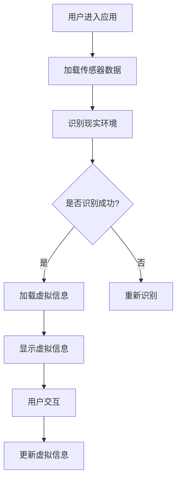

                 

关键词：增强现实，零售业，购物体验，技术应用，用户体验

> 摘要：随着科技的不断发展，增强现实（AR）技术逐渐在各个行业中得到应用。本文将探讨增强现实技术在零售业中的应用，特别是如何提升消费者的购物体验。通过分析AR技术的核心概念、应用场景、技术优势和未来展望，我们将展示AR技术为零售业带来的变革性影响。

## 1. 背景介绍

### 1.1 增强现实技术概述

增强现实（Augmented Reality，AR）是一种将虚拟信息与现实世界相结合的技术。通过AR技术，用户可以在现实环境中看到虚拟的三维对象，这些对象可以与现实世界的物体互动，并随着用户的视角移动而改变。与虚拟现实（VR）不同，AR技术并不完全替代现实世界，而是在现实世界中叠加虚拟元素，从而增强用户的感知体验。

### 1.2 零售业现状

零售业正面临巨大的变革，线上购物的兴起使得消费者拥有更多的选择，同时也对零售商提出了更高的要求。为了吸引消费者，零售商们不断寻求创新的营销手段和提升购物体验的方法。在这个过程中，增强现实技术成为了零售业变革的重要推动力。

## 2. 核心概念与联系

### 2.1 增强现实技术核心概念

增强现实技术的核心在于“现实”和“虚拟”的结合。具体来说，它包括以下几个关键组成部分：

1. **传感器**：用于捕捉现实世界的图像和位置信息。
2. **处理器**：对传感器捕捉到的数据进行处理，以识别现实环境中的物体。
3. **显示设备**：将虚拟信息叠加到现实世界中，通常是通过头戴显示器或智能手机屏幕实现。
4. **交互接口**：用户通过触摸屏、语音命令或其他方式与虚拟信息进行交互。

### 2.2 零售业与增强现实技术的联系

零售业与增强现实技术的结合体现在以下几个方面：

1. **虚拟试穿**：消费者可以在虚拟环境中试穿衣服、配饰等，以获得更加真实的购物体验。
2. **虚拟货架**：在实体店中，虚拟货架可以展示更多的商品信息，帮助消费者快速找到所需商品。
3. **互动营销**：通过增强现实技术，零售商可以创造更加互动和有趣的购物体验，吸引消费者的注意力。
4. **远程购物**：消费者可以通过增强现实技术在家中浏览实体店的货架，实现远程购物。

### 2.3 Mermaid 流程图



## 3. 核心算法原理 & 具体操作步骤

### 3.1 算法原理概述

增强现实技术的核心算法主要包括图像识别、跟踪和渲染。图像识别用于识别现实环境中的物体，跟踪用于保持虚拟信息与物体位置的同步，渲染则是将虚拟信息叠加到现实环境中。

### 3.2 算法步骤详解

1. **图像识别**：
   - 通过摄像头捕捉现实世界的图像。
   - 使用机器学习算法对图像进行特征提取。
   - 根据特征匹配结果识别现实环境中的物体。

2. **跟踪**：
   - 通过识别结果确定物体的位置和姿态。
   - 使用光学流或传感器数据更新物体的位置和姿态。

3. **渲染**：
   - 根据物体的位置和姿态计算虚拟信息的投影位置。
   - 将虚拟信息渲染到现实环境中，形成最终的增强现实效果。

### 3.3 算法优缺点

**优点**：
- **增强体验**：通过虚拟信息的叠加，用户可以获得更加丰富和有趣的购物体验。
- **实时交互**：用户可以与虚拟信息进行实时互动，提高购物过程中的参与度。
- **信息丰富**：增强现实技术可以展示更多的商品信息，帮助用户做出更明智的购物决策。

**缺点**：
- **技术门槛**：实现增强现实技术需要较高的技术门槛，对开发者和设备要求较高。
- **硬件限制**：目前增强现实设备普及率较低，限制了技术的广泛应用。

### 3.4 算法应用领域

增强现实技术在零售业中的应用非常广泛，包括但不限于：

- **虚拟试穿**：消费者可以在虚拟环境中试穿衣服、配饰等，以获得更加真实的购物体验。
- **虚拟货架**：在实体店中，虚拟货架可以展示更多的商品信息，帮助消费者快速找到所需商品。
- **互动营销**：通过增强现实技术，零售商可以创造更加互动和有趣的购物体验，吸引消费者的注意力。
- **远程购物**：消费者可以通过增强现实技术在家中浏览实体店的货架，实现远程购物。

## 4. 数学模型和公式 & 详细讲解 & 举例说明

### 4.1 数学模型构建

增强现实技术的核心算法涉及多个数学模型，其中最常用的是图像识别和跟踪模型。

1. **图像识别模型**：
   - **特征提取**：使用卷积神经网络（CNN）对图像进行特征提取。
   - **分类器**：使用支持向量机（SVM）或深度神经网络（DNN）对特征进行分类。

2. **跟踪模型**：
   - **卡尔曼滤波**：使用卡尔曼滤波算法更新物体的位置和姿态。
   - **粒子滤波**：在复杂场景中使用粒子滤波算法进行跟踪。

### 4.2 公式推导过程

1. **图像识别模型**：

   $$ 特征向量 = CNN(图像) $$

   $$ 类别 = SVM(特征向量) $$

2. **跟踪模型**：

   $$ 位置和姿态 = 卡尔曼滤波(观测数据) $$

   $$ 位置和姿态 = 粒子滤波(观测数据) $$

### 4.3 案例分析与讲解

以虚拟试穿为例，分析增强现实技术在零售业中的应用。

1. **用户操作**：
   - 用户通过智能手机摄像头捕捉现实世界的图像。
   - 用户选择要试穿的衣服或配饰。

2. **图像识别**：
   - 系统使用CNN对用户上传的图像进行特征提取。
   - 系统使用SVM对特征进行分类，确定用户要试穿的衣服或配饰。

3. **跟踪与渲染**：
   - 系统使用卡尔曼滤波或粒子滤波算法更新衣服或配饰的位置和姿态。
   - 系统将虚拟的衣服或配饰渲染到现实环境中，形成增强现实效果。

4. **用户交互**：
   - 用户可以通过触摸屏或语音命令与虚拟衣服或配饰进行互动。
   - 用户可以调整衣服的尺寸、颜色等，获得更加真实的购物体验。

## 5. 项目实践：代码实例和详细解释说明

### 5.1 开发环境搭建

1. **硬件环境**：
   - 智能手机或平板电脑，支持增强现实功能。
   - 头戴显示器（可选），提供更加沉浸式的体验。

2. **软件环境**：
   - 操作系统：Android 或 iOS。
   - 开发工具：Android Studio 或 Xcode。
   - 增强现实开发框架：如 ARCore、ARKit 等。

### 5.2 源代码详细实现

以下是一个简单的增强现实应用示例，使用ARKit框架实现虚拟试穿功能。

```swift
import ARKit
import SceneKit

class ViewController: UIViewController, ARSCNViewDelegate {
    
    var sceneView: ARSCNView!
    var clothingNode: SCNNode?
    
    override func viewDidLoad() {
        super.viewDidLoad()
        
        // 设置ARSCNView
        sceneView = ARSCNView(frame: self.view.bounds)
        sceneView.delegate = self
        self.view.addSubview(sceneView)
        
        // 配置AR环境
        let configuration = ARWorldTrackingConfiguration()
        configuration.planeDetection = .horizontal
        sceneView.session.run(configuration)
    }
    
    func renderer(_ renderer: SCNSceneRenderer, nodeFor anchor: ARAnchor) -> SCNNode? {
        // 创建衣服节点
        if clothingNode == nil {
            let clothingScene = SCNScene("path/to/clothing.scn")
            clothingNode = clothingScene.rootNode.childNode(withName: "clothing", recursively: true)
            clothingNode?.position = SCNVector3(0, 0.1, -0.5)
        }
        return clothingNode
    }
    
    @IBAction func wearClothing(_ sender: Any) {
        // 显示衣服节点
        clothingNode?.isVisible = true
    }
    
    @IBAction func removeClothing(_ sender: Any) {
        // 隐藏衣服节点
        clothingNode?.isVisible = false
    }
}
```

### 5.3 代码解读与分析

1. **ARSCNView**：
   - 用于显示增强现实场景，提供与ARKit的交互接口。

2. **ARWorldTrackingConfiguration**：
   - 用于配置AR环境，包括平面检测等。

3. **SCNScene**：
   - 用于加载衣服的3D模型。

4. **SCNNode**：
   - 用于表示3D模型在场景中的位置和姿态。

5. **wearClothing() 方法**：
   - 显示衣服节点，使衣服在增强现实场景中可见。

6. **removeClothing() 方法**：
   - 隐藏衣服节点，使衣服在增强现实场景中不可见。

### 5.4 运行结果展示

运行该应用后，用户可以在增强现实场景中试穿衣服。通过触摸屏或语音命令，用户可以控制衣服的显示与隐藏。

## 6. 实际应用场景

### 6.1 虚拟试穿

虚拟试穿是增强现实技术在零售业中最常见应用之一。通过虚拟试穿，消费者可以在购买前试穿衣服、配饰等，获得更加真实的购物体验。例如，一家服装零售商可以提供虚拟试穿服务，让消费者在家中通过智能手机或平板电脑试穿衣服，从而提高购买决策的准确性。

### 6.2 虚拟货架

虚拟货架可以出现在实体店的任何位置，帮助消费者快速找到所需商品。通过增强现实技术，零售商可以在实体店内创建虚拟货架，展示更多的商品信息，提高消费者的购物效率。例如，一家超市可以在店内设置虚拟货架，展示商品图片、价格和库存信息，让消费者轻松找到所需商品。

### 6.3 互动营销

增强现实技术可以创造更加互动和有趣的购物体验，吸引消费者的注意力。例如，一家玩具零售商可以使用增强现实技术创建一个虚拟的玩具乐园，让消费者在购物过程中享受乐趣。通过互动营销，零售商可以吸引更多的消费者，提高销售额。

### 6.4 远程购物

通过增强现实技术，消费者可以在家中通过智能手机或平板电脑浏览实体店的货架，实现远程购物。例如，一家家居零售商可以提供远程购物服务，让消费者在家中浏览实体店的货架，选择心仪的家具，并了解其尺寸、颜色和材质等信息。

## 7. 工具和资源推荐

### 7.1 学习资源推荐

1. **《增强现实技术原理与应用》**：详细介绍了增强现实技术的原理和应用场景。
2. **《ARKit开发实战》**：针对iOS平台，介绍了如何使用ARKit实现增强现实应用。
3. **《增强现实设计与开发》**：涵盖了增强现实设计的各个方面，包括用户体验、交互设计等。

### 7.2 开发工具推荐

1. **ARCore**：Google推出的增强现实开发平台，支持Android和iOS平台。
2. **ARKit**：Apple推出的增强现实开发框架，仅支持iOS平台。
3. **Unity**：一款跨平台的游戏和增强现实开发引擎，支持多种平台。

### 7.3 相关论文推荐

1. **"Augmented Reality in Retail: A Comprehensive Survey"**：全面介绍了增强现实技术在零售业中的应用。
2. **"AR in Retail: Transforming the Shopping Experience"**：探讨了增强现实技术如何提升购物体验。
3. **"Virtual Fitting Rooms: An Empirical Evaluation of AR in Retail"**：研究了虚拟试穿在零售业中的应用效果。

## 8. 总结：未来发展趋势与挑战

### 8.1 研究成果总结

随着增强现实技术的不断发展，其在零售业中的应用越来越广泛，取得了显著的成果。虚拟试穿、虚拟货架、互动营销和远程购物等应用场景不断涌现，为零售业带来了新的发展机遇。通过增强现实技术，零售商可以提升购物体验，提高销售额，增强消费者忠诚度。

### 8.2 未来发展趋势

1. **技术成熟度提高**：随着硬件和软件技术的不断进步，增强现实技术在零售业中的应用将越来越成熟，应用场景将更加多样化。
2. **跨平台融合**：增强现实技术将与其他技术（如虚拟现实、人工智能等）融合，形成更加综合的零售解决方案。
3. **个性化体验**：通过大数据和人工智能技术，零售商可以为消费者提供更加个性化的购物体验。

### 8.3 面临的挑战

1. **技术门槛高**：实现增强现实技术需要较高的技术门槛，对开发者和设备要求较高。
2. **硬件普及率低**：目前增强现实设备的普及率较低，限制了技术的广泛应用。
3. **用户体验优化**：如何提供更加自然、流畅和有趣的用户体验，是增强现实技术在零售业中面临的挑战。

### 8.4 研究展望

未来，增强现实技术在零售业中的应用将有广阔的发展前景。随着技术的不断进步，增强现实技术将为零售业带来更多创新和变革，提升消费者的购物体验，促进零售业的持续发展。

## 9. 附录：常见问题与解答

### 9.1 增强现实技术与虚拟现实技术的区别是什么？

增强现实技术（AR）与虚拟现实技术（VR）的主要区别在于：

- **感知体验**：增强现实技术将虚拟信息叠加到现实世界中，用户仍然能够看到现实环境；虚拟现实技术则完全替代现实世界，用户进入一个完全虚拟的环境。
- **交互方式**：增强现实技术通常通过智能手机或头戴显示器实现，用户可以通过触摸屏、语音命令等方式与虚拟信息互动；虚拟现实技术则通常通过头戴显示器和手柄实现，用户通过视觉和手部动作与虚拟世界互动。
- **应用场景**：增强现实技术适用于在现实环境中增强用户感知体验，如虚拟试穿、虚拟货架等；虚拟现实技术则适用于完全沉浸式的体验，如虚拟现实游戏、虚拟旅游等。

### 9.2 增强现实技术在零售业中的具体应用有哪些？

增强现实技术在零售业中的具体应用包括：

- **虚拟试穿**：消费者可以在虚拟环境中试穿衣服、配饰等，获得更加真实的购物体验。
- **虚拟货架**：在实体店中，虚拟货架可以展示更多的商品信息，帮助消费者快速找到所需商品。
- **互动营销**：通过增强现实技术，零售商可以创造更加互动和有趣的购物体验，吸引消费者的注意力。
- **远程购物**：消费者可以通过增强现实技术在家中浏览实体店的货架，实现远程购物。

### 9.3 如何实现增强现实技术的虚拟试穿功能？

实现增强现实技术的虚拟试穿功能主要包括以下几个步骤：

1. **图像识别**：通过摄像头捕捉现实世界的图像，使用图像识别算法识别用户身体部位和衣服。
2. **跟踪与渲染**：根据识别结果，跟踪衣服的位置和姿态，并将其渲染到现实环境中。
3. **交互操作**：用户可以通过触摸屏或语音命令与虚拟衣服进行互动，调整衣服的尺寸、颜色等。

### 9.4 增强现实技术在零售业中面临的挑战是什么？

增强现实技术在零售业中面临的挑战包括：

1. **技术门槛高**：实现增强现实技术需要较高的技术门槛，对开发者和设备要求较高。
2. **硬件普及率低**：目前增强现实设备的普及率较低，限制了技术的广泛应用。
3. **用户体验优化**：如何提供更加自然、流畅和有趣的用户体验，是增强现实技术在零售业中面临的挑战。

## 作者署名

作者：禅与计算机程序设计艺术 / Zen and the Art of Computer Programming

