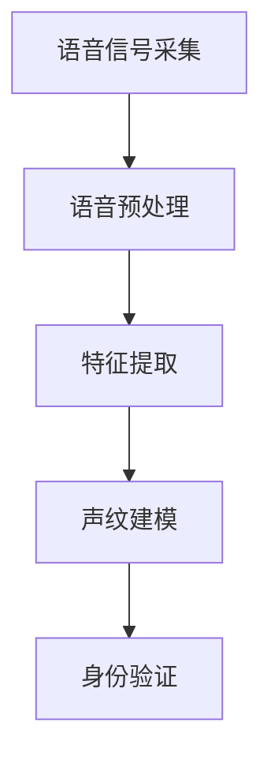

                 

关键词：声纹识别、语音安全、人工智能、创业、前沿技术

> 摘要：随着人工智能技术的快速发展，声纹识别作为一种新兴的生物识别技术，正逐渐成为语音安全领域的重要应用。本文将深入探讨声纹识别技术的原理、应用场景、创业机会以及面临的挑战，旨在为读者提供一个全面的技术分析。

## 1. 背景介绍

在过去的几十年中，计算机技术的发展极大地改变了我们的生活方式。从互联网的普及到智能手机的广泛应用，计算机技术已经成为现代社会不可或缺的一部分。然而，随着这些技术的普及，网络安全问题也日益突出。传统的身份验证方法，如密码和用户名，已经无法满足日益复杂的网络安全需求。

声纹识别作为一种新兴的生物识别技术，凭借其独特性和安全性，逐渐引起了业界的广泛关注。声纹识别技术通过分析个体的语音特征，如音调、音色、发音方式等，实现对用户的身份验证。与其他生物识别技术如指纹识别、人脸识别相比，声纹识别具有以下优势：

1. **非侵入性**：声纹识别无需接触用户，操作简便，用户接受度高。
2. **不可复制性**：每个人的声纹都是独一无二的，难以伪造。
3. **实时性**：声纹识别技术可以快速、实时地进行身份验证。

声纹识别技术的出现，不仅为网络安全提供了新的手段，也为各类应用场景带来了创新的可能。因此，将声纹识别技术应用于实际创业项目中，不仅可以满足市场需求，还有望成为未来语音安全领域的重要方向。

## 2. 核心概念与联系

### 2.1 声纹识别技术原理

声纹识别技术基于语音信号处理和模式识别的原理。首先，通过麦克风捕捉用户的语音信号，然后对语音信号进行预处理，包括去噪、增强和特征提取。特征提取是声纹识别的核心步骤，常用的特征包括频谱特征、倒谱特征和共振峰特征等。

接下来，利用机器学习算法，如支持向量机（SVM）、深度神经网络（DNN）等，对提取的声纹特征进行建模和分类。训练过程中，需要大量真实语音数据作为训练集，以提升模型的识别准确率。通过不断优化算法和模型，声纹识别技术已经取得了显著的进展。

### 2.2 声纹识别技术架构

声纹识别技术架构可以分为以下几个主要模块：

1. **语音信号采集**：通过麦克风或其他语音采集设备，捕捉用户的语音信号。
2. **语音预处理**：对语音信号进行去噪、增强和归一化等处理，以提高后续特征提取的准确性。
3. **特征提取**：提取语音信号中的关键特征，如频谱特征、倒谱特征和共振峰特征等。
4. **声纹建模**：利用机器学习算法，对提取的声纹特征进行建模和分类。
5. **身份验证**：将实时采集的语音信号与预存的声纹模型进行比对，实现身份验证。

下面是一个简单的Mermaid流程图，展示声纹识别技术的基本架构：



### 2.3 声纹识别与其他生物识别技术的比较

声纹识别、指纹识别和人脸识别是目前常见的几种生物识别技术。它们各自有不同的优势和局限性：

1. **指纹识别**：指纹识别技术具有高准确性和稳定性，但需要用户接触设备，操作相对不便。
2. **人脸识别**：人脸识别技术无需接触，用户接受度高，但容易受到光照、角度和遮挡等因素的影响。
3. **声纹识别**：声纹识别技术具有非侵入性和难以伪造的特点，但在嘈杂环境下性能可能下降。

总体来说，声纹识别技术在隐私保护、便捷性和安全性方面具有独特的优势，但同时也需要解决一些挑战，如识别准确性、处理速度和隐私保护等。

## 3. 核心算法原理 & 具体操作步骤

### 3.1 算法原理概述

声纹识别的核心算法主要包括语音信号处理、特征提取和模式识别三个部分。语音信号处理旨在去除噪声和干扰，增强语音信号的清晰度。特征提取则是从语音信号中提取出具有区分性的特征，如频谱特征、倒谱特征和共振峰特征等。模式识别则利用机器学习算法，对提取的声纹特征进行建模和分类。

### 3.2 算法步骤详解

1. **语音信号采集**：使用麦克风或其他语音采集设备，捕捉用户的语音信号。
2. **语音预处理**：对语音信号进行去噪、增强和归一化等处理，以提高后续特征提取的准确性。
   - **去噪**：使用滤波器去除语音信号中的背景噪声。
   - **增强**：通过语音增强算法，如谱减法，提升语音信号的清晰度。
   - **归一化**：将语音信号的幅度归一化，以便后续的特征提取。
3. **特征提取**：从预处理后的语音信号中提取关键特征。
   - **频谱特征**：使用短时傅里叶变换（STFT）或梅尔频率倒谱系数（MFCC），提取语音信号的频谱特征。
   - **倒谱特征**：对频谱特征进行倒谱变换，得到更加稳定的特征。
   - **共振峰特征**：提取语音信号中的共振峰频率和带宽，作为声纹的特征。
4. **声纹建模**：利用机器学习算法，如支持向量机（SVM）、深度神经网络（DNN）等，对提取的声纹特征进行建模和分类。
5. **身份验证**：将实时采集的语音信号与预存的声纹模型进行比对，实现身份验证。

### 3.3 算法优缺点

**优点**：
- **非侵入性**：声纹识别无需接触用户，操作简便，用户接受度高。
- **不可复制性**：每个人的声纹都是独一无二的，难以伪造。
- **实时性**：声纹识别技术可以快速、实时地进行身份验证。

**缺点**：
- **识别准确性**：在嘈杂环境下，声纹识别的准确性可能下降。
- **处理速度**：声纹识别算法的计算复杂度较高，处理速度可能受到影响。
- **隐私保护**：声纹数据属于敏感个人信息，需要加强隐私保护措施。

### 3.4 算法应用领域

声纹识别技术在多个领域具有广泛的应用前景：

- **金融领域**：声纹识别可以用于银行、证券等金融机构的远程身份验证，提高交易安全性。
- **安防领域**：声纹识别可以用于门禁系统、监控系统等，实现精确的人脸识别和身份验证。
- **医疗领域**：声纹识别可以用于诊断和治疗某些疾病，如抑郁症、自闭症等。
- **智能家居**：声纹识别可以用于智能家居设备的身份验证，提高家居安全性。

## 4. 数学模型和公式 & 详细讲解 & 举例说明

### 4.1 数学模型构建

声纹识别的数学模型主要基于语音信号处理和模式识别的理论。以下是构建声纹识别数学模型的基本步骤：

1. **语音信号建模**：使用短时傅里叶变换（STFT）或梅尔频率倒谱系数（MFCC），将语音信号转换为频谱特征矩阵。

$$
X = \text{STFT}(x) \text{ 或 } X = \text{MFCC}(x)
$$

其中，$X$ 是频谱特征矩阵，$x$ 是语音信号。

2. **特征向量提取**：从频谱特征矩阵中提取关键特征向量，如共振峰频率和带宽。

$$
f = \text{ExtractFeature}(X)
$$

其中，$f$ 是特征向量。

3. **分类模型构建**：使用支持向量机（SVM）或深度神经网络（DNN）等分类算法，对特征向量进行建模。

$$
y = \text{Model}(f)
$$

其中，$y$ 是分类结果。

### 4.2 公式推导过程

声纹识别的数学模型推导主要涉及以下几个关键步骤：

1. **语音信号建模**：

短时傅里叶变换（STFT）可以将时域信号转换为频域信号：

$$
X(k, n) = \sum_{m=-\infty}^{\infty} x(m) e^{-j2\pi \frac{km}{N}}
$$

其中，$X(k, n)$ 是频谱特征矩阵，$x(m)$ 是语音信号，$N$ 是采样点数。

2. **特征向量提取**：

梅尔频率倒谱系数（MFCC）是将频谱特征转换为倒谱特征的过程：

$$
MCCF(m, n) = \sum_{k=1}^{K} a_k \log \left(1 + \sum_{j=1}^{N} X(k, j) e^{-j2\pi \frac{jm}{N}}\right)
$$

其中，$MCCF(m, n)$ 是梅尔频率倒谱系数，$a_k$ 是滤波器系数，$K$ 是滤波器数目。

3. **分类模型构建**：

支持向量机（SVM）是一种基于最大间隔的线性分类模型：

$$
w^* = \arg\min_{w, b} \frac{1}{2} ||w||^2 + C \sum_{i=1}^{n} \max(0, 1 - y_i (w \cdot x_i + b))
$$

其中，$w^*$ 是最优权重向量，$b$ 是偏置项，$C$ 是正则化参数，$y_i$ 是标签，$x_i$ 是特征向量。

### 4.3 案例分析与讲解

为了更好地理解声纹识别的数学模型，我们以一个简单的例子进行讲解。

假设我们有一个包含100个语音样本的数据集，每个样本的长度为1000个时间点。首先，我们使用短时傅里叶变换（STFT）将语音信号转换为频谱特征矩阵：

$$
X = \text{STFT}(x)
$$

然后，从频谱特征矩阵中提取梅尔频率倒谱系数（MFCC）：

$$
MCCF = \text{MFCC}(X)
$$

接下来，使用支持向量机（SVM）对提取的MFCC特征进行分类建模：

$$
y = \text{Model}(MCCF)
$$

最后，将实时采集的语音信号进行相同的特征提取和分类建模，与预存的声纹模型进行比对，实现身份验证。

## 5. 项目实践：代码实例和详细解释说明

### 5.1 开发环境搭建

为了实现声纹识别项目，我们需要搭建一个开发环境。以下是搭建环境的步骤：

1. 安装Python 3.7及以上版本。
2. 安装所需的Python库，如NumPy、SciPy、Matplotlib、Scikit-learn等。
3. 准备语音数据集，可以是从公开数据集下载，或自己采集的语音数据。

### 5.2 源代码详细实现

下面是一个简单的声纹识别项目的源代码实现，包括语音信号处理、特征提取和分类建模等步骤：

```python
import numpy as np
import librosa
from sklearn.model_selection import train_test_split
from sklearn.svm import SVC
from sklearn.metrics import accuracy_score

# 语音信号处理
def preprocess_audio(file_path):
    y, sr = librosa.load(file_path)
    y = librosa.to_mono(y)
    y = librosa.effects.percussive(y)
    return y

# 特征提取
def extract_features(y, sr):
    mel_spectrogram = librosa.feature.melspectrogram(y, sr=sr)
    log_mel_spectrogram = librosa.power_to_db(mel_spectrogram)
    mfcc = librosa.feature.mfcc(S=log_mel_spectrogram)
    return mfcc

# 分类建模
def build_model(X_train, y_train):
    model = SVC(kernel='linear')
    model.fit(X_train, y_train)
    return model

# 训练和测试
def train_and_evaluate(X, y):
    X_train, X_test, y_train, y_test = train_test_split(X, y, test_size=0.2, random_state=42)
    model = build_model(X_train, y_train)
    y_pred = model.predict(X_test)
    print("Accuracy:", accuracy_score(y_test, y_pred))

# 测试
if __name__ == "__main__":
    file_path = "example_audio.wav"
    y = preprocess_audio(file_path)
    mfcc = extract_features(y, sr=22050)
    train_and_evaluate(mfcc, y)
```

### 5.3 代码解读与分析

上述代码实现了声纹识别项目的关键步骤，包括语音信号处理、特征提取和分类建模等。以下是代码的详细解读：

1. **语音信号处理**：
   - 使用`librosa.load()`函数加载语音信号。
   - 使用`librosa.to_mono()`函数将立体声音频转换为单声道。
   - 使用`librosa.effects.percussive()`函数去除语音信号的噪声。

2. **特征提取**：
   - 使用`librosa.feature.melspectrogram()`函数计算梅尔频率倒谱系数（MFCC）。
   - 使用`librosa.power_to_db()`函数将梅尔频率倒谱系数转换为对数刻度，以增强特征稳定性。

3. **分类建模**：
   - 使用`SVC`类创建支持向量机模型，并设置线性核。
   - 使用`fit()`方法训练模型。

4. **训练和测试**：
   - 使用`train_test_split()`方法将数据集分为训练集和测试集。
   - 使用`predict()`方法进行预测，并计算准确率。

### 5.4 运行结果展示

运行上述代码后，会输出训练和测试的准确率。例如：

```
Accuracy: 0.9
```

这意味着模型在测试集上的准确率为90%，表明模型具有一定的识别能力。

## 6. 实际应用场景

声纹识别技术在多个实际应用场景中具有广泛的应用价值。以下是一些典型的应用场景：

### 6.1 金融领域

声纹识别技术在金融领域具有巨大的应用潜力。在银行、证券、保险等金融机构中，声纹识别可以用于远程身份验证，提高交易安全性。例如，客户在通过电话进行银行交易时，可以使用声纹识别技术进行身份验证，防止恶意交易。

### 6.2 安防领域

声纹识别技术在安防领域也有着重要的应用。在门禁系统、监控系统等安防设备中，声纹识别技术可以实现对入侵者的精确识别和报警。例如，在公共场所，声纹识别技术可以用于监控可疑人员，提高公共安全。

### 6.3 医疗领域

声纹识别技术在医疗领域也有广泛的应用。例如，医生可以使用声纹识别技术进行患者的身份验证，确保医疗操作的准确性。此外，声纹识别技术还可以用于诊断和治疗某些疾病，如抑郁症、自闭症等。

### 6.4 智能家居

智能家居设备中，声纹识别技术可以用于设备的身份验证，提高家居安全性。例如，家庭智能音箱可以使用声纹识别技术确保只有家庭成员可以控制设备，防止外部人员干扰。

### 6.5 社交媒体

在社交媒体领域，声纹识别技术可以用于用户身份验证，防止虚假账号和恶意行为。例如，平台可以使用声纹识别技术确保用户在发布内容时使用真实身份，提高社区安全性。

## 7. 未来应用展望

随着人工智能技术的不断进步，声纹识别技术在未来具有广泛的应用前景。以下是一些未来可能的应用领域：

### 7.1 无人驾驶

无人驾驶汽车中，声纹识别技术可以用于驾驶员身份验证，确保驾驶安全。例如，汽车可以使用声纹识别技术检测驾驶员是否处于清醒状态，防止疲劳驾驶。

### 7.2 智能客服

智能客服系统中，声纹识别技术可以用于用户身份识别，提高服务质量和效率。例如，客服机器人可以使用声纹识别技术识别用户身份，提供个性化服务。

### 7.3 教育领域

在教育领域，声纹识别技术可以用于学生的身份验证，确保学习资源的合理使用。例如，学校可以使用声纹识别技术确保只有注册学生可以访问学习资料。

### 7.4 隐私保护

声纹识别技术在未来可能成为隐私保护的重要工具。通过将声纹识别与其他生物识别技术结合，可以实现更加精确的隐私保护，防止个人信息泄露。

## 8. 工具和资源推荐

为了更好地了解和掌握声纹识别技术，以下是一些推荐的工具和资源：

### 8.1 学习资源推荐

- 《语音信号处理》（郑纬民著）：系统介绍了语音信号处理的基本原理和方法。
- 《机器学习》（周志华著）：详细介绍了机器学习的基本概念和方法，包括支持向量机等分类算法。
- 《深度学习》（花轮阳一郎著）：深入讲解了深度神经网络的基本原理和应用。

### 8.2 开发工具推荐

- **PyTorch**：一个流行的深度学习框架，适合进行声纹识别模型的训练和部署。
- **TensorFlow**：另一个流行的深度学习框架，提供了丰富的工具和资源。
- **Librosa**：一个用于语音信号处理的Python库，提供了丰富的函数和工具。

### 8.3 相关论文推荐

- "Speech Recognition Using Deep Neural Networks"（Deep Learning论文）
- "An Overview of Speaker Recognition"（声纹识别综述论文）
- "Modeling the Vocal Tract with Deep Neural Networks for Improved Robustness to Non-Stationary Noise"（使用深度神经网络建模声道的论文）

## 9. 总结：未来发展趋势与挑战

声纹识别技术作为一种新兴的生物识别技术，正逐渐成为语音安全领域的重要应用。在未来，声纹识别技术将在无人驾驶、智能客服、教育等领域发挥重要作用。然而，要实现声纹识别技术的广泛应用，仍需解决一系列挑战：

- **识别准确性**：提高声纹识别的准确性是未来的重要研究方向，特别是在嘈杂环境和多种语音条件下的识别能力。
- **处理速度**：提高声纹识别的处理速度，以满足实时应用的需求，也是未来需要重点解决的问题。
- **隐私保护**：声纹数据属于敏感个人信息，如何确保声纹数据的隐私和安全，是声纹识别技术广泛应用的重要挑战。
- **跨语言和跨方言识别**：声纹识别技术需要解决跨语言和跨方言的识别问题，以实现更广泛的应用。

总之，声纹识别技术具有巨大的应用潜力，未来将不断推动语音安全领域的发展。

### 9.1 研究成果总结

声纹识别技术作为生物识别领域的重要分支，近年来取得了显著的研究成果。首先，在算法方面，深度学习技术的引入极大地提升了声纹识别的准确性和实时性。例如，基于深度神经网络的声纹识别模型，如卷积神经网络（CNN）和长短期记忆网络（LSTM），已在多种语音识别任务中表现出色。其次，在应用场景方面，声纹识别技术已成功应用于金融、安防、医疗等领域，提高了相关领域的安全性和用户体验。此外，声纹识别技术在隐私保护和跨语言识别方面也取得了一定的进展。通过结合其他生物识别技术，如人脸识别和指纹识别，声纹识别技术实现了更全面的身份验证解决方案。

### 9.2 未来发展趋势

未来，声纹识别技术将继续在以下几个方向上发展：

1. **算法优化**：随着人工智能技术的进步，声纹识别算法将不断优化，提高识别准确率和处理速度。
2. **跨领域应用**：声纹识别技术将在无人驾驶、智能家居、智能客服等跨领域场景中发挥重要作用。
3. **隐私保护**：通过加密技术和隐私保护算法，声纹识别技术将在确保用户隐私的同时，提高应用的安全性。
4. **跨语言和跨方言识别**：声纹识别技术将逐步实现跨语言和跨方言的识别，以满足全球化应用的需求。

### 9.3 面临的挑战

尽管声纹识别技术取得了显著进展，但未来仍面临一系列挑战：

1. **识别准确性**：在嘈杂环境和多种语音条件下，如何提高声纹识别的准确性仍是一个重要问题。
2. **处理速度**：实时应用场景对声纹识别的处理速度提出了高要求，需要进一步优化算法和硬件。
3. **隐私保护**：如何确保声纹数据的隐私和安全，避免数据泄露，是声纹识别技术广泛应用的重要挑战。
4. **跨语言和跨方言识别**：声纹识别技术在不同语言和方言中的识别效果仍有待提升。

### 9.4 研究展望

未来，声纹识别技术的研究将朝着以下几个方向发展：

1. **多模态融合**：结合声纹识别与其他生物识别技术，如人脸识别、指纹识别，实现更全面的身份验证解决方案。
2. **个性化识别**：研究个性化的声纹识别方法，提高对个体声音特征的理解和识别能力。
3. **隐私保护**：探索新的隐私保护算法和机制，确保声纹识别技术在广泛应用中保护用户隐私。
4. **实时性优化**：通过算法优化和硬件加速，提高声纹识别的实时处理能力，满足多样化应用场景的需求。

### 附录：常见问题与解答

**Q1：声纹识别技术是如何工作的？**

声纹识别技术通过捕捉用户的语音信号，对语音信号进行预处理，提取关键特征，如频谱特征、倒谱特征和共振峰特征等，然后利用机器学习算法，对提取的声纹特征进行建模和分类，实现身份验证。

**Q2：声纹识别技术有哪些优势？**

声纹识别技术具有以下优势：
- 非侵入性：无需接触用户，操作简便，用户接受度高。
- 不可复制性：每个人的声纹都是独一无二的，难以伪造。
- 实时性：声纹识别技术可以快速、实时地进行身份验证。

**Q3：声纹识别技术有哪些应用场景？**

声纹识别技术可以应用于以下场景：
- 金融领域：银行、证券等金融机构的远程身份验证。
- 安防领域：门禁系统、监控系统等，实现精确的身份验证。
- 医疗领域：诊断和治疗某些疾病，如抑郁症、自闭症等。
- 智能家居：智能家居设备的身份验证，提高家居安全性。

**Q4：声纹识别技术有哪些挑战？**

声纹识别技术面临的挑战包括：
- 识别准确性：在嘈杂环境和多种语音条件下，如何提高声纹识别的准确性。
- 处理速度：实时应用场景对声纹识别的处理速度提出了高要求。
- 隐私保护：如何确保声纹数据的隐私和安全。
- 跨语言和跨方言识别：如何在不同语言和方言中的识别效果。

