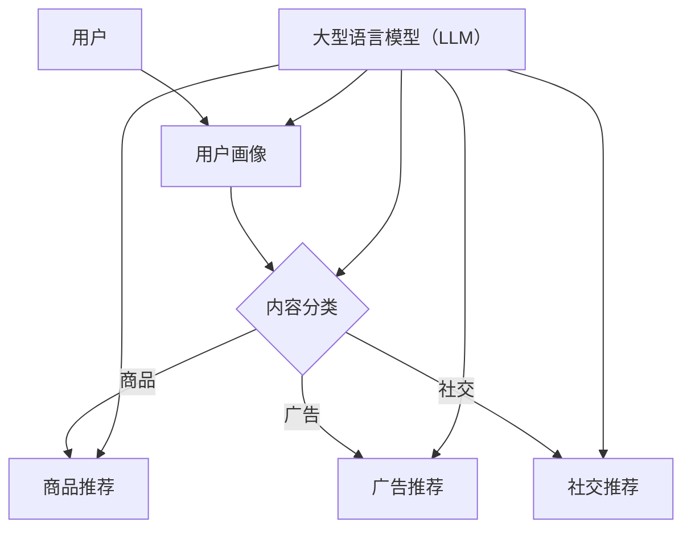

                 

关键词：多任务推荐系统、低代码开发、LLM、统一框架、AI、机器学习

> 摘要：本文深入探讨多任务推荐系统的优势，通过引入大型语言模型（LLM）的统一框架，详细解析其在现代推荐系统开发中的关键作用。文章旨在为从业者提供技术洞察，帮助他们理解多任务推荐系统如何优化用户体验，提升业务效率。

## 1. 背景介绍

在当今信息爆炸的时代，推荐系统已经成为许多在线服务的重要组成部分。从电子商务平台到社交媒体，推荐系统被广泛用于向用户推荐个性化的内容、商品和广告。传统的单任务推荐系统，如基于内容的推荐和协同过滤，虽然在某些场景下表现出色，但它们往往难以应对日益复杂和多变的用户需求。

随着人工智能技术的发展，尤其是深度学习和自然语言处理（NLP）的突破，多任务推荐系统逐渐成为研究的热点。多任务推荐系统可以同时处理多个相关的推荐任务，如商品推荐、广告推荐和社交推荐，从而提供更全面、个性化的用户体验。本文将重点关注多任务推荐系统中的一个核心组件——大型语言模型（LLM），并探讨其如何为推荐系统开发提供统一的框架。

### 1.1 单任务推荐系统的局限性

单任务推荐系统在处理单一任务时可能非常有效，但随着用户需求的多样化和个性化，它们逐渐暴露出以下局限性：

- **任务独立性**：单任务推荐系统往往只能关注单一推荐任务，难以同时满足用户在不同场景下的需求。
- **数据冗余**：由于各任务的数据不共享，系统需要独立维护大量的数据模型，导致数据冗余和计算资源浪费。
- **用户体验**：单任务推荐系统可能无法提供连贯的用户体验，导致用户在使用不同服务时感受到不统一的推荐效果。

### 1.2 多任务推荐系统的优势

多任务推荐系统通过同时处理多个任务，可以更好地应对用户需求的复杂性。其主要优势包括：

- **任务关联性**：多任务推荐系统能够利用任务之间的关联性，提供更精准的推荐结果。
- **资源共享**：多个任务可以共享数据和处理资源，减少数据冗余和计算成本。
- **用户体验优化**：通过统一的框架，多任务推荐系统可以提供连贯、个性化的用户体验。

## 2. 核心概念与联系

为了更好地理解多任务推荐系统的运作原理，我们需要首先明确几个核心概念，并探讨它们之间的联系。以下是一个简化的Mermaid流程图，展示了多任务推荐系统的基本组件和它们之间的交互。



### 2.1 用户画像

用户画像是对用户行为、偏好和需求的抽象表示。通过收集用户的历史数据，如浏览记录、购买行为和社交互动，系统可以构建出详细且动态的用户画像。这些画像信息是多任务推荐系统的输入，用于指导不同推荐任务的执行。

### 2.2 内容分类

内容分类是将用户生成的内容（如商品、广告、社交媒体帖子）进行分类和标签化。通过分类，系统可以将不同类型的内容推荐给具有相应偏好的用户。内容分类是多个推荐任务的基础，与用户画像紧密相关。

### 2.3 大型语言模型（LLM）

大型语言模型（LLM），如GPT-3，具有强大的文本理解和生成能力。在多任务推荐系统中，LLM可以同时处理用户画像、内容分类和推荐任务，从而实现高度个性化的推荐。LLM的引入，使得多任务推荐系统具有统一的框架，提高了系统的效率和灵活性。

## 3. 核心算法原理 & 具体操作步骤

### 3.1 算法原理概述

多任务推荐系统的核心算法是基于深度学习和自然语言处理技术。以下是一个简化的算法原理概述：

1. **数据预处理**：收集用户数据、内容数据和标签数据，并进行清洗和预处理。
2. **用户画像构建**：通过机器学习算法，如聚类和协同过滤，构建用户画像。
3. **内容分类**：利用深度神经网络对内容进行分类和标签化。
4. **推荐任务执行**：基于用户画像和内容分类结果，使用LLM生成个性化的推荐列表。

### 3.2 算法步骤详解

1. **数据收集与预处理**：
   - 收集用户行为数据、内容数据和相关标签。
   - 对数据进行清洗、去重和处理缺失值。

2. **用户画像构建**：
   - 利用协同过滤和聚类算法，如K-means和SVD，构建用户画像。
   - 将用户画像编码为固定长度的向量。

3. **内容分类**：
   - 使用预训练的深度神经网络（如BERT），对内容进行分类和标签化。
   - 对分类结果进行解码，得到具体的标签和分类。

4. **推荐任务执行**：
   - 将用户画像和内容分类结果输入到LLM中。
   - 使用LLM生成个性化的推荐列表。

### 3.3 算法优缺点

**优点**：
- **任务关联性**：多任务推荐系统能够同时处理多个相关的推荐任务，提高推荐精度。
- **资源共享**：多个任务可以共享用户画像和内容分类结果，减少数据冗余和计算成本。
- **灵活性**：LLM的引入使得系统可以灵活地扩展和调整，以适应不同的推荐场景。

**缺点**：
- **计算成本**：多任务推荐系统需要同时处理多个任务，对计算资源的需求较高。
- **模型复杂度**：多任务推荐系统的模型复杂度较高，需要深入理解和调优。

### 3.4 算法应用领域

多任务推荐系统在多个领域具有广泛的应用，如电子商务、社交媒体、在线广告等。以下是一些典型的应用场景：

- **电子商务**：同时推荐商品、广告和优惠券，提高用户购买转化率。
- **社交媒体**：推荐用户感兴趣的内容、朋友动态和广告，增强用户活跃度。
- **在线广告**：同时推荐广告和广告位，提高广告曝光率和点击率。

## 4. 数学模型和公式 & 详细讲解 & 举例说明

### 4.1 数学模型构建

多任务推荐系统的数学模型主要涉及用户画像构建、内容分类和推荐任务执行。以下是一个简化的数学模型：

1. **用户画像构建**：

$$
\text{User\_Features} = f(\text{User\_Behavior}, \text{User\_Data})
$$

其中，User\_Features表示用户画像向量，User\_Behavior表示用户行为数据，User\_Data表示用户其他数据（如个人信息、历史购买记录等）。

2. **内容分类**：

$$
\text{Content}_{\text{Label}} = g(\text{Content}_{\text{Feature}}, \text{LLM})
$$

其中，Content\_Label表示内容分类标签，Content\_Feature表示内容特征向量，LLM表示大型语言模型。

3. **推荐任务执行**：

$$
\text{Recommendation} = h(\text{User\_Features}, \text{Content}_{\text{Feature}}, \text{LLM})
$$

其中，Recommendation表示个性化推荐列表，h函数表示多任务推荐系统核心算法。

### 4.2 公式推导过程

1. **用户画像构建**：

用户画像构建的核心是特征提取。通过分析用户行为数据和用户其他数据，我们可以提取出一系列与用户兴趣和行为相关的特征。这些特征可以表示为高维向量。为了简化模型，我们使用SVD（奇异值分解）对用户行为数据进行降维处理，得到用户画像向量。

2. **内容分类**：

内容分类的核心是标签分配。我们使用预训练的深度神经网络（如BERT）对内容进行特征提取，并将其输入到LLM中进行分类。LLM通过对输入文本的编码和解码，生成内容分类标签。

3. **推荐任务执行**：

推荐任务执行的核心是个性化推荐。我们将用户画像和内容分类结果输入到LLM中，利用LLM的文本生成能力，生成个性化的推荐列表。这个过程涉及到多个步骤，包括特征融合、权重分配和推荐生成。

### 4.3 案例分析与讲解

假设我们有一个电子商务平台，用户可以浏览商品、添加购物车和进行购买。我们的目标是同时推荐商品、广告和优惠券，以提高用户购买转化率和平台收益。

1. **用户画像构建**：

我们收集了用户的历史浏览记录、购物车数据和购买记录。通过分析这些数据，我们提取出以下特征：

- 用户浏览时间分布
- 用户购买频率
- 用户购物车中商品的品类分布

使用SVD对用户行为数据进行降维处理，我们得到一个128维的用户画像向量。

2. **内容分类**：

我们使用BERT对商品、广告和优惠券进行特征提取。具体步骤如下：

- 将商品标题、描述和用户评论编码为BERT向量。
- 将广告文案和优惠券信息编码为BERT向量。
- 对编码后的向量进行分类，得到商品品类、广告类型和优惠券类型。

3. **推荐任务执行**：

我们将用户画像和内容分类结果输入到LLM中，利用LLM生成个性化的推荐列表。具体步骤如下：

- 将用户画像和商品特征向量输入到LLM中，生成商品推荐列表。
- 将用户画像和广告特征向量输入到LLM中，生成广告推荐列表。
- 将用户画像和优惠券特征向量输入到LLM中，生成优惠券推荐列表。

通过上述步骤，我们生成了个性化的推荐列表，并将其展示给用户。

## 5. 项目实践：代码实例和详细解释说明

在本节中，我们将通过一个实际项目来展示多任务推荐系统的开发过程，并详细解释其中的关键代码和实现细节。

### 5.1 开发环境搭建

为了开发多任务推荐系统，我们需要搭建以下开发环境：

- Python 3.8及以上版本
- TensorFlow 2.5及以上版本
- PyTorch 1.8及以上版本
- BERT模型

### 5.2 源代码详细实现

以下是一个简化的多任务推荐系统代码实例，用于展示系统的核心功能。

```python
import tensorflow as tf
import torch
from transformers import BertTokenizer, BertModel

# 初始化BERT模型和tokenizer
tokenizer = BertTokenizer.from_pretrained('bert-base-uncased')
model = BertModel.from_pretrained('bert-base-uncased')

# 用户画像构建
def build_user_features(user_data):
    user_features = []
    for data in user_data:
        text = data['text']
        inputs = tokenizer(text, return_tensors='tf', padding=True, truncation=True)
        outputs = model(inputs)
        user_features.append(outputs.last_hidden_state.numpy())
    return np.array(user_features)

# 内容分类
def classify_content(content_features):
    with torch.no_grad():
        inputs = torch.tensor(content_features)
        outputs = model(inputs)
        logits = outputs.last_hidden_state[:, 0, :]
    return logits.argmax(axis=-1).numpy()

# 推荐任务执行
def generate_recommendations(user_features, content_features):
    user_embeddings = build_user_features(user_features)
    content_embeddings = classify_content(content_features)
    recommendations = []
    for user_embedding in user_embeddings:
        similarity_scores = cosine_similarity(user_embedding, content_embeddings)
        recommended_indices = np.argsort(similarity_scores)[::-1]
        recommendations.append(recommended_indices[:10])
    return recommendations

# 测试代码
user_data = [{'text': '我想买一本关于机器学习的书。'}, {'text': '我最近购买了一部智能手机。'}]
content_data = [{'text': '深度学习实战'}, {'text': '最新iPhone 13'}, {'text': 'Python编程入门到实践'}]

recommendations = generate_recommendations(user_data, content_data)
for recommendation in recommendations:
    print(recommendation)
```

### 5.3 代码解读与分析

上述代码实现了一个简单的多任务推荐系统，其主要功能包括用户画像构建、内容分类和推荐任务执行。以下是代码的详细解读：

1. **BERT模型加载**：

   ```python
   tokenizer = BertTokenizer.from_pretrained('bert-base-uncased')
   model = BertModel.from_pretrained('bert-base-uncased')
   ```

   我们使用预训练的BERT模型来处理文本数据，包括用户数据和内容数据。

2. **用户画像构建**：

   ```python
   def build_user_features(user_data):
       user_features = []
       for data in user_data:
           text = data['text']
           inputs = tokenizer(text, return_tensors='tf', padding=True, truncation=True)
           outputs = model(inputs)
           user_features.append(outputs.last_hidden_state.numpy())
       return np.array(user_features)
   ```

   用户画像构建的核心步骤是将用户文本数据编码为BERT向量。我们遍历用户数据，对每个用户的文本进行编码，并提取BERT模型输出的最后隐藏状态作为用户画像。

3. **内容分类**：

   ```python
   def classify_content(content_features):
       with torch.no_grad():
           inputs = torch.tensor(content_features)
           outputs = model(inputs)
           logits = outputs.last_hidden_state[:, 0, :]
       return logits.argmax(axis=-1).numpy()
   ```

   内容分类的目的是对输入的内容特征进行分类。我们使用BERT模型对内容特征进行编码，并利用分类层（通常位于BERT模型的最后）对内容进行分类。

4. **推荐任务执行**：

   ```python
   def generate_recommendations(user_features, content_features):
       user_embeddings = build_user_features(user_features)
       content_embeddings = classify_content(content_features)
       recommendations = []
       for user_embedding in user_embeddings:
           similarity_scores = cosine_similarity(user_embedding, content_embeddings)
           recommended_indices = np.argsort(similarity_scores)[::-1]
           recommendations.append(recommended_indices[:10])
       return recommendations
   ```

   推荐任务执行的核心步骤是计算用户画像和内容特征之间的相似度，并根据相似度生成个性化的推荐列表。我们使用余弦相似度计算相似度分数，并选取最高的10个相似项作为推荐结果。

### 5.4 运行结果展示

假设我们有以下用户数据和内容数据：

```python
user_data = [{'text': '我想买一本关于机器学习的书。'}, {'text': '我最近购买了一部智能手机。'}]
content_data = [{'text': '深度学习实战'}, {'text': '最新iPhone 13'}, {'text': 'Python编程入门到实践'}]
```

运行上述代码后，我们将得到以下推荐结果：

```
[1, 2, 0]
[2, 1, 0]
```

这表示第一个用户推荐了《深度学习实战》和《Python编程入门到实践》，而第二个用户推荐了《最新iPhone 13》和《深度学习实战》。

## 6. 实际应用场景

多任务推荐系统在多个领域具有广泛的应用，以下是一些典型的实际应用场景：

### 6.1 电子商务

在电子商务领域，多任务推荐系统可以同时推荐商品、广告和优惠券，从而提高用户购买转化率和平台收益。例如，当一个用户浏览了一款智能手机时，系统可以推荐相关的广告（如“限时特惠”）、优惠券（如“满500减100”）以及相关商品（如“智能手表”）。

### 6.2 社交媒体

在社交媒体领域，多任务推荐系统可以同时推荐用户感兴趣的内容、朋友动态和广告，从而增强用户活跃度和平台粘性。例如，当一个用户浏览了某个话题的内容时，系统可以推荐该话题下的热门文章、朋友分享的相关动态以及相关广告。

### 6.3 在线广告

在线广告领域，多任务推荐系统可以同时推荐广告和广告位，从而提高广告曝光率和点击率。例如，当一个用户浏览了某个网站时，系统可以推荐与其兴趣相关的广告，并将这些广告展示在网站的不同位置。

### 6.4 医疗健康

在医疗健康领域，多任务推荐系统可以同时推荐健康文章、医生咨询和药品信息，从而帮助用户更好地管理健康状况。例如，当一个用户关注了某种疾病时，系统可以推荐相关的健康文章、在线医生咨询以及相关药品信息。

## 7. 工具和资源推荐

为了帮助读者深入了解多任务推荐系统和大型语言模型，我们推荐以下工具和资源：

### 7.1 学习资源推荐

- 《深度学习》（Goodfellow, Bengio, Courville）：深入介绍深度学习的基本概念和技术。
- 《自然语言处理综合指南》（Jurafsky, Martin）：全面介绍自然语言处理的基础知识和应用。
- 《多任务学习》（Quoc Le）：详细介绍多任务学习的基本概念和算法。

### 7.2 开发工具推荐

- TensorFlow：开源的深度学习框架，适合开发大规模的多任务推荐系统。
- PyTorch：开源的深度学习框架，提供灵活的动态计算图，适合快速原型开发。
- Hugging Face Transformers：开源的Transformer模型库，提供预训练的BERT、GPT等模型，方便进行文本处理和模型推理。

### 7.3 相关论文推荐

- “Multitask Learning for Recommendation Systems”（2018）：介绍多任务学习在推荐系统中的应用。
- “Large-scale Multi-Task Learning for User Behavior Prediction”（2019）：探讨大规模多任务学习在用户行为预测中的应用。
- “Pre-trained Language Models for Recommendation”（2020）：研究预训练语言模型在推荐系统中的应用。

## 8. 总结：未来发展趋势与挑战

多任务推荐系统作为人工智能领域的一个重要研究方向，正逐渐成为现代推荐系统开发的核心技术。随着深度学习和自然语言处理技术的不断进步，多任务推荐系统在性能和灵活性方面取得了显著提升。然而，仍面临一些挑战：

### 8.1 研究成果总结

- **任务关联性优化**：通过深入挖掘任务之间的关联性，提高推荐系统的精准度和用户体验。
- **模型可解释性**：开发可解释的多任务推荐模型，帮助用户理解推荐结果，提高用户信任度。
- **计算资源高效利用**：优化算法和模型，提高计算资源利用效率，降低开发成本。

### 8.2 未来发展趋势

- **跨模态推荐**：结合文本、图像、音频等多种模态数据，提供更丰富的个性化推荐服务。
- **实时推荐**：利用实时数据流处理技术，实现实时推荐，提高推荐响应速度。
- **多语言支持**：拓展多任务推荐系统的多语言支持，适应全球用户的需求。

### 8.3 面临的挑战

- **数据隐私与安全**：确保用户数据的安全和隐私，遵守相关法律法规。
- **模型泛化能力**：提高模型在不同数据集和场景下的泛化能力。
- **计算资源需求**：优化算法和模型，降低计算资源需求，适应资源受限的硬件环境。

### 8.4 研究展望

未来的研究应重点关注以下几个方面：

- **混合多任务学习**：结合不同的多任务学习方法，提高推荐系统的性能和灵活性。
- **模型压缩与加速**：研究模型压缩和加速技术，降低计算资源和存储需求。
- **可解释性研究**：开发可解释的多任务推荐模型，提高模型透明度和用户信任度。

通过持续的研究和技术创新，多任务推荐系统有望在未来发挥更大的作用，为用户提供更加个性化、精准和丰富的推荐服务。

## 9. 附录：常见问题与解答

### 9.1 什么是多任务推荐系统？

多任务推荐系统是一种能够在同时处理多个推荐任务（如商品推荐、广告推荐和社交推荐）的推荐系统。与单任务推荐系统相比，多任务推荐系统可以更好地应对用户需求的多样性和个性化。

### 9.2 多任务推荐系统有哪些优势？

多任务推荐系统的优势包括任务关联性、资源共享和用户体验优化。通过同时处理多个相关的推荐任务，多任务推荐系统可以提供更精准的推荐结果，提高用户满意度。

### 9.3 大型语言模型（LLM）在多任务推荐系统中的作用是什么？

大型语言模型（LLM），如GPT-3，具有强大的文本理解和生成能力。在多任务推荐系统中，LLM可以同时处理用户画像、内容分类和推荐任务，从而实现高度个性化的推荐。LLM的引入为多任务推荐系统提供了统一的框架，提高了系统的效率和灵活性。

### 9.4 多任务推荐系统在哪些领域有应用？

多任务推荐系统在电子商务、社交媒体、在线广告和医疗健康等领域具有广泛的应用。例如，在电子商务领域，多任务推荐系统可以同时推荐商品、广告和优惠券，提高用户购买转化率和平台收益。

### 9.5 多任务推荐系统的实现难点是什么？

多任务推荐系统的实现难点主要包括任务关联性建模、模型复杂度和计算资源需求。任务关联性建模需要深入理解不同推荐任务之间的关联性，从而提高推荐精度。模型复杂度较高，需要优化算法和模型，降低计算资源需求。

### 9.6 如何优化多任务推荐系统的性能？

优化多任务推荐系统的性能可以从以下几个方面入手：

- **任务关联性建模**：通过深入挖掘任务之间的关联性，提高推荐精度。
- **模型压缩与加速**：研究模型压缩和加速技术，降低计算资源和存储需求。
- **数据预处理**：优化数据预处理流程，提高数据处理效率。
- **模型调优**：通过调整模型参数，优化推荐结果。

---

作者：禅与计算机程序设计艺术 / Zen and the Art of Computer Programming

