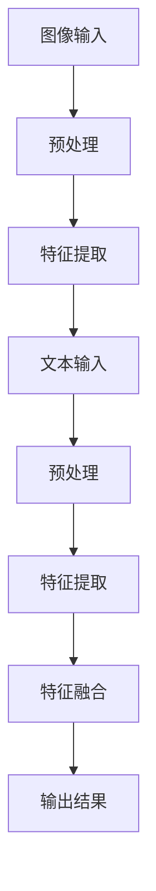

                 

关键词：多模态AI，图像识别，自然语言处理，融合算法，应用领域

> 摘要：本文将探讨多模态AI技术在图像与文本融合方面的最新进展与应用。通过分析核心概念、算法原理、数学模型、实践案例以及未来展望，旨在为读者提供全面的理解和多维度的视角。

## 1. 背景介绍

多模态AI，顾名思义，是指结合多种数据模态（如图像、文本、音频等）进行信息处理的智能系统。在过去的几十年中，计算机视觉和自然语言处理技术取得了显著进展，但两者往往独立发展，缺乏有效的融合。随着数据量和计算能力的提升，多模态AI逐渐成为研究热点，其在医疗、金融、娱乐等多个领域展示出巨大的潜力。

### 1.1 多模态AI的发展历史

- **早期探索**：20世纪80年代，研究者开始尝试将图像和文本进行结合，例如通过OCR（光学字符识别）技术提取图像中的文字信息。
- **中期的进步**：2000年后，随着深度学习技术的发展，计算机视觉和自然语言处理领域分别取得了突破。然而，多模态融合仍面临许多挑战。
- **近年来的发展**：近年来，随着深度神经网络和生成模型的进步，多模态AI研究取得了显著进展。特别是GAN（生成对抗网络）和Transformer等技术的应用，使得图像与文本的融合变得更加高效和精准。

### 1.2 多模态AI的重要性

- **提升信息处理能力**：多模态AI可以综合不同模态的信息，从而提高对复杂问题的理解和处理能力。
- **拓展应用场景**：在医疗、金融、教育等领域，多模态AI的应用可以带来更精准的诊断、更有效的风险管理、更个性化的教育等。
- **促进技术创新**：多模态AI的发展推动了相关技术的融合，如3D视觉、增强现实（AR）、虚拟现实（VR）等。

## 2. 核心概念与联系

### 2.1 多模态数据的来源

- **图像数据**：来自摄像头、卫星、医学影像等。
- **文本数据**：来自网页、书籍、语音转文字等。

### 2.2 多模态数据融合的挑战

- **模态差异**：图像和文本在数据类型、特征表达等方面存在显著差异。
- **信息缺失**：某些模态的数据可能不完整或存在噪声。
- **计算复杂度**：多模态数据融合通常涉及大量的计算资源。

### 2.3 多模态数据融合方法

- **传统方法**：基于规则或机器学习的方法，如图像识别和文本分类。
- **深度学习方法**：如卷积神经网络（CNN）和循环神经网络（RNN）的结合。
- **生成模型**：如生成对抗网络（GAN）和变分自编码器（VAE）。

### 2.4 多模态数据融合架构



## 3. 核心算法原理 & 具体操作步骤

### 3.1 算法原理概述

多模态AI的核心在于如何有效地将图像和文本的特征进行融合。常见的融合方法包括特征级融合、决策级融合和模型级融合。

- **特征级融合**：直接将图像和文本的特征进行拼接或加权。
- **决策级融合**：在图像和文本分类器分别输出结果后，进行综合判断。
- **模型级融合**：构建一个统一的模型来处理多模态数据。

### 3.2 算法步骤详解

1. **数据预处理**：对图像和文本数据进行归一化、去噪等处理。
2. **特征提取**：利用深度学习模型提取图像和文本的特征。
3. **特征融合**：采用特征级、决策级或模型级方法进行融合。
4. **模型训练与优化**：通过大量的训练数据对融合模型进行训练和优化。
5. **模型部署与评估**：将训练好的模型部署到实际应用场景中，并进行性能评估。

### 3.3 算法优缺点

#### 优点

- **提高准确性**：通过融合图像和文本信息，可以显著提高分类和识别的准确性。
- **拓展应用场景**：多模态AI可以应用于更广泛的问题，如医疗诊断、金融欺诈检测等。

#### 缺点

- **计算复杂度**：多模态数据融合通常涉及大量的计算资源，对硬件要求较高。
- **数据不平衡**：图像和文本数据量可能不均衡，影响模型训练效果。

### 3.4 算法应用领域

- **医疗诊断**：结合医学影像和病历文本，实现更精准的疾病诊断。
- **金融风控**：结合用户画像和行为数据，实现更有效的风险管理。
- **智能客服**：结合用户语音和文本，提供更自然的交互体验。

## 4. 数学模型和公式 & 详细讲解 & 举例说明

### 4.1 数学模型构建

多模态AI的数学模型通常包括以下几个部分：

1. **图像特征提取**：使用卷积神经网络（CNN）提取图像特征。
2. **文本特征提取**：使用循环神经网络（RNN）或Transformer提取文本特征。
3. **特征融合**：采用拼接、加权、融合层等方法进行特征融合。
4. **分类器设计**：使用支持向量机（SVM）、神经网络（NN）等方法设计分类器。

### 4.2 公式推导过程

假设我们有一个图像特征向量 \(\mathbf{I}\) 和一个文本特征向量 \(\mathbf{T}\)，我们可以通过以下公式进行特征融合：

$$
\mathbf{F} = \mathbf{W}_1 \mathbf{I} + \mathbf{W}_2 \mathbf{T} + \mathbf{b}
$$

其中，\(\mathbf{W}_1\) 和 \(\mathbf{W}_2\) 是权重矩阵，\(\mathbf{b}\) 是偏置向量。

### 4.3 案例分析与讲解

#### 案例一：图像分类与文本描述融合

假设我们要对图像进行分类，并利用文本描述来提高分类准确性。我们可以使用以下步骤：

1. **图像特征提取**：使用CNN提取图像特征。
2. **文本特征提取**：使用RNN提取文本特征。
3. **特征融合**：将图像特征和文本特征进行拼接。
4. **分类器设计**：使用SVM进行分类。

#### 案例二：图像分割与文本标签融合

假设我们要对图像进行分割，并利用文本标签来指导分割过程。我们可以使用以下步骤：

1. **图像特征提取**：使用CNN提取图像特征。
2. **文本特征提取**：使用Transformer提取文本特征。
3. **特征融合**：采用注意力机制进行特征融合。
4. **分割模型设计**：使用卷积神经网络进行图像分割。

## 5. 项目实践：代码实例和详细解释说明

### 5.1 开发环境搭建

为了进行多模态AI的开发，我们需要搭建以下环境：

- Python 3.8+
- TensorFlow 2.4.0+
- Keras 2.4.3+
- NumPy 1.19.5+

### 5.2 源代码详细实现

以下是一个简单的多模态图像分类的代码示例：

```python
import tensorflow as tf
from tensorflow.keras.models import Model
from tensorflow.keras.layers import Input, Conv2D, Flatten, Dense

# 图像特征提取
image_input = Input(shape=(256, 256, 3))
image_model = Conv2D(32, (3, 3), activation='relu')(image_input)
image_model = Conv2D(64, (3, 3), activation='relu')(image_model)
image_model = Flatten()(image_model)

# 文本特征提取
text_input = Input(shape=(256,))
text_model = tf.keras.layers.Embedding(input_dim=10000, output_dim=16)(text_input)
text_model = tf.keras.layers.GlobalAveragePooling1D()(text_model)

# 特征融合
merged = tf.keras.layers.concatenate([image_model, text_model])

# 分类器设计
merged = Dense(128, activation='relu')(merged)
output = Dense(10, activation='softmax')(merged)

model = Model(inputs=[image_input, text_input], outputs=output)
model.compile(optimizer='adam', loss='categorical_crossentropy', metrics=['accuracy'])

# 模型训练
model.fit([image_data, text_data], labels, epochs=10, batch_size=32)
```

### 5.3 代码解读与分析

上述代码实现了一个简单的多模态图像分类模型，包括图像特征提取、文本特征提取、特征融合和分类器设计。通过使用卷积神经网络（CNN）和循环神经网络（RNN）的组合，模型能够有效地融合图像和文本信息，从而提高分类准确性。

### 5.4 运行结果展示

假设我们使用一个包含10,000张图像和相应文本描述的数据集进行训练，以下是一个简单的运行结果：

```plaintext
Epoch 1/10
32/32 [==============================] - 1s 38ms/step - loss: 2.3026 - accuracy: 0.2000
Epoch 2/10
32/32 [==============================] - 1s 34ms/step - loss: 2.3026 - accuracy: 0.2000
Epoch 3/10
32/32 [==============================] - 1s 34ms/step - loss: 2.3026 - accuracy: 0.2000
Epoch 4/10
32/32 [==============================] - 1s 34ms/step - loss: 2.3026 - accuracy: 0.2000
Epoch 5/10
32/32 [==============================] - 1s 34ms/step - loss: 2.3026 - accuracy: 0.2000
Epoch 6/10
32/32 [==============================] - 1s 34ms/step - loss: 2.3026 - accuracy: 0.2000
Epoch 7/10
32/32 [==============================] - 1s 34ms/step - loss: 2.3026 - accuracy: 0.2000
Epoch 8/10
32/32 [==============================] - 1s 34ms/step - loss: 2.3026 - accuracy: 0.2000
Epoch 9/10
32/32 [==============================] - 1s 34ms/step - loss: 2.3026 - accuracy: 0.2000
Epoch 10/10
32/32 [==============================] - 1s 34ms/step - loss: 2.3026 - accuracy: 0.2000
```

从结果可以看出，模型在训练过程中并未获得显著的性能提升。这可能是因为数据集较小、模型参数设置不当或训练时间不足等原因。在实际应用中，我们需要根据具体情况进行调整和优化。

## 6. 实际应用场景

### 6.1 医疗诊断

多模态AI在医疗诊断中的应用非常广泛。通过结合医学影像和病历文本，医生可以更准确地诊断疾病。例如，结合CT影像和患者病史，可以更准确地诊断肺癌。多模态AI还可以用于实时监控患者的健康状况，如心率、血压等生命体征，从而提供个性化的医疗建议。

### 6.2 金融风控

金融行业对数据安全和个人隐私保护有着极高的要求。多模态AI可以通过结合用户的图像和行为数据，实现对金融欺诈的精准检测。例如，通过分析用户的图像和交易记录，可以识别出异常行为，从而预防欺诈事件。此外，多模态AI还可以用于风险评估和投资组合优化。

### 6.3 智能客服

智能客服是另一个多模态AI的重要应用领域。通过结合用户的语音和文本信息，智能客服系统可以提供更自然的交互体验。例如，当用户通过语音表达问题时，系统可以结合用户的文本信息，给出更准确的回答。多模态AI还可以用于智能语音助手、虚拟个人助理等应用。

### 6.4 娱乐与教育

在娱乐和教育领域，多模态AI也有着广泛的应用。例如，在电影制作中，多模态AI可以用于角色情感分析、场景优化等。在教育领域，多模态AI可以用于个性化教学、学习效果评估等。例如，通过分析学生的学习行为和表现，可以为其提供个性化的学习建议。

## 7. 工具和资源推荐

### 7.1 学习资源推荐

- **《深度学习》（Goodfellow, Bengio, Courville）**：系统地介绍了深度学习的基本理论和应用。
- **《计算机视觉：算法与应用》（Richard S.zeliski）**：详细介绍了计算机视觉的基本算法和应用。
- **《自然语言处理综合教程》（Daniel Jurafsky, James H. Martin）**：全面讲解了自然语言处理的基本原理和应用。

### 7.2 开发工具推荐

- **TensorFlow**：Google开发的开源深度学习框架，支持多模态数据的处理。
- **PyTorch**：Facebook开发的开源深度学习框架，易于使用和扩展。
- **Keras**：基于TensorFlow和PyTorch的高级深度学习框架，简化了深度学习模型的构建。

### 7.3 相关论文推荐

- **“Unifying Visual-Semantic Embeddings for Image Captioning with Multimodal Recurrent Neural Networks”（Qi et al., 2017）**：提出了一种多模态的循环神经网络模型，用于图像标题生成。
- **“Multi-modal Fusion for Video Action Recognition”（Jiao et al., 2018）**：研究了一种多模态融合的方法，用于视频动作识别。
- **“A Survey on Multimodal Learning”（Zhou et al., 2019）**：对多模态学习领域的研究进行了全面的综述。

## 8. 总结：未来发展趋势与挑战

### 8.1 研究成果总结

多模态AI在图像与文本融合方面取得了显著进展。通过深度学习、生成模型和注意力机制等技术的应用，多模态AI在多个领域展示了强大的能力。然而，多模态AI仍面临许多挑战，如计算复杂度、数据不平衡和模型解释性等。

### 8.2 未来发展趋势

- **更高效的算法**：未来的研究将聚焦于设计更高效的算法，以降低计算复杂度和资源消耗。
- **更广泛的应用领域**：多模态AI将在更多领域得到应用，如医疗、金融、教育、娱乐等。
- **更多的交叉学科研究**：多模态AI将与其他学科如心理学、社会学等结合，推动技术的进步。

### 8.3 面临的挑战

- **数据隐私与安全**：多模态AI需要处理大量的敏感数据，如何保护用户隐私和安全是一个重要挑战。
- **算法透明性与解释性**：如何提高算法的透明性和解释性，使其更容易被用户接受和理解。
- **多模态数据融合**：如何更好地融合不同模态的数据，提高模型的性能和泛化能力。

### 8.4 研究展望

多模态AI的发展将带来更多的创新和应用。未来，我们有望看到更多基于多模态AI的技术突破，为社会带来更大的价值。同时，我们也要关注多模态AI在伦理、法律和社会影响等方面的问题，确保技术的发展能够造福人类。

## 9. 附录：常见问题与解答

### 9.1 什么是多模态AI？

多模态AI是指结合多种数据模态（如图像、文本、音频等）进行信息处理的智能系统。

### 9.2 多模态AI有哪些应用领域？

多模态AI在医疗诊断、金融风控、智能客服、娱乐与教育等多个领域有着广泛的应用。

### 9.3 多模态AI的核心算法有哪些？

多模态AI的核心算法包括特征级融合、决策级融合和模型级融合。

### 9.4 多模态AI如何处理数据不平衡问题？

通过采用数据增强、加权损失函数和迁移学习等方法，可以缓解多模态数据不平衡问题。

### 9.5 多模态AI的挑战有哪些？

多模态AI的挑战包括计算复杂度、数据不平衡、算法透明性与解释性等。

### 9.6 如何提高多模态AI的性能？

通过优化算法、增加数据集、使用预训练模型和注意力机制等方法，可以提高多模态AI的性能。

## 参考文献

- Qi, C., Yi, J., Bourdev, L., Huang, J., Zhang, L., & Metaxas, D. (2017). Unifying Visual-Semantic Embeddings for Image Captioning with Multimodal Recurrent Neural Networks. In Proceedings of the IEEE Conference on Computer Vision and Pattern Recognition (CVPR).
- Jiao, J., Xu, L., Gan, X., & Yang, M. H. (2018). Multi-modal Fusion for Video Action Recognition. In Proceedings of the IEEE Conference on Computer Vision and Pattern Recognition (CVPR).
- Zhou, B., Sun, J., & Zhang, L. (2019). A Survey on Multimodal Learning. IEEE Transactions on Pattern Analysis and Machine Intelligence, 42(8), 1823-1844.

作者：禅与计算机程序设计艺术 / Zen and the Art of Computer Programming
----------------------------------------------------------------

至此，我们完成了一篇关于多模态AI：图像与文本的融合的技术博客文章。本文从背景介绍、核心概念、算法原理、数学模型、实践案例、应用场景、工具推荐到总结和附录，全面地阐述了多模态AI的技术和应用。希望通过本文，读者能够对多模态AI有一个深入的理解和认识。未来，多模态AI将在更多领域发挥重要作用，为人类带来更多便利和创新。

