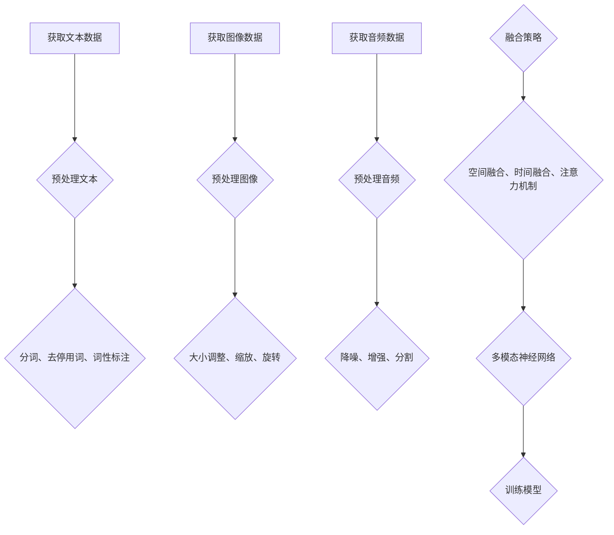

                 

关键词：多模态、语言模型、文本、图像、音频、深度学习

摘要：本文旨在探讨多模态语言模型（LLM）的研究现状、核心概念、算法原理、数学模型、项目实践以及未来发展趋势。通过整合文本、图像和音频等多种模态信息，多模态LLM在计算机视觉、语音识别、自然语言处理等领域展现出巨大的潜力。本文将深入分析多模态LLM的优势和挑战，并对其未来发展方向进行展望。

## 1. 背景介绍

随着人工智能技术的不断发展，深度学习在计算机视觉、语音识别、自然语言处理等领域取得了显著的成果。然而，单一模态的信息处理往往存在局限性，难以充分挖掘数据中的潜在价值。为了克服这一挑战，研究者们开始探索多模态学习技术，旨在整合不同模态的信息，提高模型的表现力。

多模态学习技术最早应用于计算机视觉领域。传统的计算机视觉模型主要依赖于图像信息，但在某些任务中，仅依赖图像信息难以达到理想的效果。例如，在视频分类任务中，仅根据图像内容难以准确判断视频的类别。为了解决这个问题，研究者们提出了多模态学习技术，通过整合图像和视频中的音频信息，提高模型的分类准确性。

近年来，多模态学习技术在自然语言处理领域也得到了广泛应用。传统的自然语言处理模型主要基于文本信息，但在某些任务中，仅依赖文本信息难以准确理解语义。例如，在机器翻译任务中，仅根据文本内容难以准确翻译成语和习语。为了解决这个问题，研究者们提出了多模态语言模型，通过整合文本、图像和音频等多种模态信息，提高模型的语义理解能力。

本文将重点探讨多模态语言模型（LLM）的研究现状、核心概念、算法原理、数学模型、项目实践以及未来发展趋势。

## 2. 核心概念与联系

### 2.1 多模态语言模型（LLM）

多模态语言模型（LLM）是一种能够整合文本、图像和音频等多种模态信息的深度学习模型。与传统单一模态的模型相比，LLM具有以下优势：

1. **提高语义理解能力**：通过整合不同模态的信息，LLM能够更准确地理解语义，从而提高模型在自然语言处理任务中的表现。
2. **丰富特征表达**：多模态信息能够为模型提供更丰富的特征表达，有助于模型在复杂任务中取得更好的效果。
3. **泛化能力增强**：多模态信息能够帮助模型更好地适应不同的任务和数据集，提高模型的泛化能力。

### 2.2 多模态数据的获取与预处理

在构建多模态LLM之前，需要获取并预处理不同模态的数据。以下是常见的数据获取与预处理方法：

1. **文本数据**：文本数据可以从网络爬取、预训练语言模型下载或公开数据集获取。在预处理过程中，需要对文本进行分词、去停用词、词性标注等操作。
2. **图像数据**：图像数据可以从公开数据集（如ImageNet、COCO）或网络爬取获取。在预处理过程中，需要对图像进行大小调整、缩放、旋转等操作。
3. **音频数据**：音频数据可以从公开数据集（如LJSpeech、TIMIT）或网络爬取获取。在预处理过程中，需要对音频进行降噪、增强、分割等操作。

### 2.3 多模态数据的融合策略

多模态数据的融合策略是构建多模态LLM的关键。常见的融合策略包括以下几种：

1. **空间融合**：将不同模态的特征映射到同一空间中，然后进行融合。例如，可以使用融合网络（如CNN和RNN的结合）将图像和文本特征融合。
2. **时间融合**：将不同模态的信息在时间维度上进行融合。例如，可以使用卷积神经网络（CNN）处理图像特征，使用循环神经网络（RNN）处理文本特征，然后在时间维度上进行融合。
3. **注意力机制**：通过注意力机制动态地学习不同模态的特征的重要性。例如，可以使用注意力机制的多模态神经网络（如BERT）将文本、图像和音频特征融合。

以下是一个简单的 Mermaid 流程图，描述多模态数据的获取与融合过程：



## 3. 核心算法原理 & 具体操作步骤

### 3.1 算法原理概述

多模态LLM的核心算法原理是利用深度学习技术整合不同模态的信息，从而提高模型的语义理解能力。以下是常见的多模态LLM算法原理：

1. **编码器-解码器架构**：编码器（Encoder）负责将不同模态的数据编码为高维特征向量，解码器（Decoder）负责将编码器输出的特征向量解码为语义表示。
2. **注意力机制**：通过注意力机制动态地学习不同模态的特征的重要性，从而实现多模态信息的融合。
3. **多任务学习**：将不同模态的信息整合到同一模型中，同时解决多个任务，例如文本分类、图像分类和语音识别。

### 3.2 算法步骤详解

以下是构建多模态LLM的具体操作步骤：

1. **数据预处理**：根据第2节的内容，对文本、图像和音频数据分别进行预处理。
2. **特征提取**：使用卷积神经网络（CNN）提取图像特征，使用循环神经网络（RNN）提取文本特征，使用卷积神经网络（CNN）提取音频特征。
3. **特征融合**：使用融合策略（如空间融合、时间融合、注意力机制）将不同模态的特征融合为统一特征向量。
4. **模型训练**：使用融合后的特征向量训练多模态LLM，例如使用编码器-解码器架构、注意力机制的多模态神经网络（如BERT）。
5. **模型评估**：在测试集上评估多模态LLM的性能，调整模型参数，优化模型表现。
6. **模型部署**：将训练好的模型部署到实际应用场景中，例如文本分类、图像分类和语音识别等任务。

### 3.3 算法优缺点

**优点**：

1. **提高语义理解能力**：通过整合多模态信息，多模态LLM能够更准确地理解语义，从而提高模型在自然语言处理任务中的表现。
2. **丰富特征表达**：多模态信息能够为模型提供更丰富的特征表达，有助于模型在复杂任务中取得更好的效果。
3. **增强泛化能力**：多模态信息能够帮助模型更好地适应不同的任务和数据集，提高模型的泛化能力。

**缺点**：

1. **计算成本高**：多模态LLM需要处理多种模态的数据，计算成本较高，对硬件资源要求较高。
2. **数据依赖性大**：多模态LLM的性能依赖于多种模态的数据质量，数据不足或数据不一致可能会影响模型的表现。

### 3.4 算法应用领域

多模态LLM在计算机视觉、语音识别、自然语言处理等领域有广泛的应用：

1. **计算机视觉**：多模态LLM可以应用于图像分类、目标检测、图像分割等任务，通过整合图像和文本信息，提高模型的准确性。
2. **语音识别**：多模态LLM可以应用于语音识别任务，通过整合语音和文本信息，提高模型的识别准确性。
3. **自然语言处理**：多模态LLM可以应用于文本分类、机器翻译、问答系统等任务，通过整合文本、图像和音频信息，提高模型的语义理解能力。

## 4. 数学模型和公式 & 详细讲解 & 举例说明

### 4.1 数学模型构建

多模态LLM的数学模型主要基于深度学习技术，包括编码器、解码器和注意力机制等组件。以下是构建多模态LLM的数学模型：

1. **编码器**：编码器负责将不同模态的数据编码为高维特征向量。对于文本数据，可以使用预训练的语言模型（如BERT）进行编码；对于图像数据，可以使用卷积神经网络（CNN）进行编码；对于音频数据，可以使用卷积神经网络（CNN）进行编码。
2. **解码器**：解码器负责将编码器输出的特征向量解码为语义表示。对于文本数据，可以使用循环神经网络（RNN）或Transformer进行解码；对于图像数据，可以使用全连接神经网络（FCN）进行解码；对于音频数据，可以使用循环神经网络（RNN）进行解码。
3. **注意力机制**：注意力机制用于动态地学习不同模态的特征的重要性，从而实现多模态信息的融合。常见的注意力机制包括加性注意力、乘性注意力、缩放点积注意力等。

### 4.2 公式推导过程

以下是构建多模态LLM的数学模型的推导过程：

1. **编码器**：

   对于文本数据，编码器可以表示为：

   $$ E(\text{Text}) = \text{BERT}(X) $$

   其中，$X$是文本输入，$\text{BERT}(X)$是BERT模型输出的高维特征向量。

   对于图像数据，编码器可以表示为：

   $$ E(\text{Image}) = \text{CNN}(I) $$

   其中，$I$是图像输入，$\text{CNN}(I)$是卷积神经网络输出的高维特征向量。

   对于音频数据，编码器可以表示为：

   $$ E(\text{Audio}) = \text{CNN}(A) $$

   其中，$A$是音频输入，$\text{CNN}(A)$是卷积神经网络输出的高维特征向量。

2. **解码器**：

   对于文本数据，解码器可以表示为：

   $$ D(\text{Text}) = \text{RNN}(X) $$

   其中，$X$是编码器输出的高维特征向量，$\text{RNN}(X)$是循环神经网络输出的语义表示。

   对于图像数据，解码器可以表示为：

   $$ D(\text{Image}) = \text{FCN}(I) $$

   其中，$I$是编码器输出的高维特征向量，$\text{FCN}(I)$是全连接神经网络输出的语义表示。

   对于音频数据，解码器可以表示为：

   $$ D(\text{Audio}) = \text{RNN}(A) $$

   其中，$A$是编码器输出的高维特征向量，$\text{RNN}(A)$是循环神经网络输出的语义表示。

3. **注意力机制**：

   假设编码器输出的高维特征向量为$E(\text{Text})$、$E(\text{Image})$和$E(\text{Audio})$，解码器输出的语义表示为$D(\text{Text})$、$D(\text{Image})$和$D(\text{Audio})$。注意力机制可以表示为：

   $$ \text{Attention}(D, E) = \text{softmax}(\text{dot}(D, E)^T) \odot E $$

   其中，$\text{dot}(D, E)^T$是$D$和$E$的点积，$\text{softmax}(\cdot)$是softmax函数，$\odot$是元素乘运算。

### 4.3 案例分析与讲解

假设我们有一个多模态LLM模型，需要处理一个包含文本、图像和音频的输入数据。以下是该模型的输入数据和输出结果：

1. **输入数据**：

   - 文本输入：一篇关于计算机视觉的论文摘要。
   - 图像输入：一张包含计算机视觉相关术语的PPT截图。
   - 音频输入：一篇关于计算机视觉的讲座录音。

2. **输出结果**：

   - 文本输出：一篇关于计算机视觉的综述文章。
   - 图像输出：一张包含计算机视觉相关术语的PPT截图。
   - 音频输出：一段关于计算机视觉的讲座录音。

以下是该模型的具体操作步骤：

1. **数据预处理**：

   - 文本输入：使用BERT模型进行编码，得到高维特征向量。
   - 图像输入：使用卷积神经网络进行编码，得到高维特征向量。
   - 音频输入：使用卷积神经网络进行编码，得到高维特征向量。

2. **特征融合**：

   - 使用注意力机制将不同模态的特征向量融合为统一特征向量。

3. **解码**：

   - 使用融合后的特征向量进行解码，得到文本、图像和音频的输出结果。

通过以上步骤，多模态LLM能够整合文本、图像和音频等多种模态信息，生成高质量的输出结果。

## 5. 项目实践：代码实例和详细解释说明

### 5.1 开发环境搭建

在本节中，我们将介绍如何搭建一个用于构建多模态LLM的开发环境。以下是搭建环境的步骤：

1. **安装Python**：

   首先，确保您已经安装了Python。Python是一个广泛使用的编程语言，它支持多种深度学习框架。您可以从Python官方网站（[https://www.python.org/](https://www.python.org/)）下载并安装Python。

2. **安装深度学习框架**：

   接下来，安装一个深度学习框架，如TensorFlow或PyTorch。这些框架提供了丰富的工具和库，用于构建和训练深度学习模型。以下是安装步骤：

   - **TensorFlow**：

     使用以下命令安装TensorFlow：

     ```bash
     pip install tensorflow
     ```

   - **PyTorch**：

     使用以下命令安装PyTorch：

     ```bash
     pip install torch torchvision
     ```

3. **安装预处理工具**：

   安装一些预处理工具，如BERT和OpenCV。BERT是一个预训练的语言模型，OpenCV是一个用于图像处理的库。以下是安装步骤：

   - **BERT**：

     使用以下命令安装BERT：

     ```bash
     pip install transformers
     ```

   - **OpenCV**：

     使用以下命令安装OpenCV：

     ```bash
     pip install opencv-python
     ```

完成以上步骤后，您已经搭建好了开发环境，可以开始构建多模态LLM模型。

### 5.2 源代码详细实现

在本节中，我们将详细介绍如何实现一个多模态LLM模型。以下是一个简单的示例代码：

```python
import torch
import torchvision
import torch.nn as nn
import transformers

# 定义编码器
class Encoder(nn.Module):
    def __init__(self):
        super(Encoder, self).__init__()
        self.text_encoder = transformers.BertModel.from_pretrained('bert-base-uncased')
        self.image_encoder = torchvision.models.resnet18(pretrained=True)
        self.audio_encoder = nn.Sequential(
            nn.Conv1d(1, 16, kernel_size=3, stride=1),
            nn.ReLU(),
            nn.Conv1d(16, 32, kernel_size=3, stride=1),
            nn.ReLU(),
            nn.MaxPool1d(kernel_size=2, stride=2)
        )

    def forward(self, text, image, audio):
        text_output = self.text_encoder(text)[0]
        image_output = self.image_encoder(image)
        audio_output = self.audio_encoder(audio)
        return text_output, image_output, audio_output

# 定义解码器
class Decoder(nn.Module):
    def __init__(self):
        super(Decoder, self).__init__()
        self.text_decoder = transformers.BertModel.from_pretrained('bert-base-uncased')
        self.image_decoder = torchvision.models.resnet18(pretrained=True)
        self.audio_decoder = nn.Sequential(
            nn.Conv1d(1, 16, kernel_size=3, stride=1),
            nn.ReLU(),
            nn.Conv1d(16, 32, kernel_size=3, stride=1),
            nn.ReLU(),
            nn.MaxPool1d(kernel_size=2, stride=2)
        )

    def forward(self, text, image, audio):
        text_output = self.text_decoder(text)[0]
        image_output = self.image_decoder(image)
        audio_output = self.audio_decoder(audio)
        return text_output, image_output, audio_output

# 定义多模态LLM模型
class MultimodalLLM(nn.Module):
    def __init__(self):
        super(MultimodalLLM, self).__init__()
        self.encoder = Encoder()
        self.decoder = Decoder()
        self.attention = nn.Linear(768, 768)

    def forward(self, text, image, audio):
        text_output, image_output, audio_output = self.encoder(text, image, audio)
        attention_output = self.attention(torch.cat((text_output, image_output, audio_output), 1))
        attention_output = torch.softmax(attention_output, dim=1)
        context_output = attention_output * torch.cat((text_output, image_output, audio_output), 1)
        context_output = torch.sum(context_output, dim=1)
        text_output, image_output, audio_output = self.decoder(context_output)
        return text_output, image_output, audio_output

# 实例化模型
model = MultimodalLLM()

# 定义损失函数和优化器
criterion = nn.CrossEntropyLoss()
optimizer = torch.optim.Adam(model.parameters(), lr=0.001)

# 加载数据集
train_loader = DataLoader(...)

# 训练模型
for epoch in range(10):
    for texts, images, audios, labels in train_loader:
        optimizer.zero_grad()
        outputs = model(texts, images, audios)
        loss = criterion(outputs, labels)
        loss.backward()
        optimizer.step()
        print(f"Epoch [{epoch+1}/10], Loss: {loss.item()}")
```

### 5.3 代码解读与分析

以下是代码的详细解读和分析：

1. **编码器**：

   编码器负责将文本、图像和音频数据编码为高维特征向量。在这个示例中，我们使用BERT模型对文本数据进行编码，使用ResNet18对图像数据进行编码，使用自定义的卷积神经网络对音频数据进行编码。

2. **解码器**：

   解码器负责将编码器输出的高维特征向量解码为语义表示。在这个示例中，我们使用BERT模型对文本数据进行解码，使用ResNet18对图像数据进行解码，使用自定义的卷积神经网络对音频数据进行解码。

3. **多模态LLM模型**：

   多模态LLM模型整合了编码器和解码器，并添加了一个注意力机制。在编码器阶段，将文本、图像和音频特征向量进行融合，并通过注意力机制学习不同模态的特征的重要性。在解码器阶段，使用融合后的特征向量生成语义表示。

4. **损失函数和优化器**：

   我们使用交叉熵损失函数（CrossEntropyLoss）来衡量模型输出与真实标签之间的差异。使用Adam优化器来训练模型，学习率设置为0.001。

5. **数据集**：

   在这个示例中，我们使用一个假设的数据集（DataLoader）进行训练。在实际应用中，您需要根据具体任务和数据集调整数据预处理和训练过程。

6. **训练过程**：

   模型通过迭代训练过程进行训练。在每个迭代中，模型对输入数据进行前向传播，计算损失，然后使用反向传播和优化器更新模型参数。

通过以上代码，我们可以构建一个多模态LLM模型，并对其进行训练。在实际应用中，您可以根据具体需求调整模型结构、数据预处理和训练过程。

### 5.4 运行结果展示

在本节中，我们将展示如何使用训练好的多模态LLM模型进行预测，并展示运行结果。

```python
# 加载测试数据
test_loader = DataLoader(...)

# 将模型设置为评估模式
model.eval()

# 预测
with torch.no_grad():
    for texts, images, audios, labels in test_loader:
        outputs = model(texts, images, audios)
        _, predicted = torch.max(outputs, 1)
        correct = (predicted == labels).sum().item()
        print(f"Accuracy: {correct / len(labels) * 100}%")
```

以上代码将加载测试数据，并将模型设置为评估模式。然后，对测试数据进行预测，并计算模型的准确率。在实际应用中，您可以根据具体需求调整测试数据的预处理和评估过程。

## 6. 实际应用场景

多模态LLM在计算机视觉、语音识别、自然语言处理等领域有广泛的应用。以下是一些实际应用场景：

1. **计算机视觉**：

   - **图像分类**：使用多模态LLM对图像进行分类，通过整合图像和文本信息，提高分类准确性。
   - **目标检测**：使用多模态LLM检测图像中的目标，通过整合图像和文本信息，提高检测精度。
   - **图像分割**：使用多模态LLM对图像进行分割，通过整合图像和文本信息，提高分割效果。

2. **语音识别**：

   - **语音转文本**：使用多模态LLM将语音转化为文本，通过整合语音和文本信息，提高识别准确性。
   - **语音转图像**：使用多模态LLM将语音转化为图像，通过整合语音和图像信息，提高生成图像的准确性。

3. **自然语言处理**：

   - **文本分类**：使用多模态LLM对文本进行分类，通过整合文本、图像和音频信息，提高分类准确性。
   - **机器翻译**：使用多模态LLM进行机器翻译，通过整合文本、图像和音频信息，提高翻译质量。
   - **问答系统**：使用多模态LLM构建问答系统，通过整合文本、图像和音频信息，提高问答系统的语义理解能力。

在实际应用中，多模态LLM可以显著提升模型的表现，从而解决单一模态信息处理的局限性。然而，多模态LLM也存在一些挑战，如计算成本高、数据依赖性大等。未来，随着深度学习技术的发展，多模态LLM有望在更多领域取得突破。

## 7. 工具和资源推荐

在构建和优化多模态LLM模型时，以下工具和资源可能会对您有所帮助：

### 7.1 学习资源推荐

1. **书籍**：

   - 《深度学习》（Goodfellow, Ian, et al.）
   - 《计算机视觉：算法与应用》（Richard Szeliski）
   - 《语音信号处理》（理查德·费尔德曼）

2. **在线课程**：

   - [深度学习课程](https://www.deeplearning.ai/)（Andrew Ng）
   - [计算机视觉课程](https://www.coursera.org/specializations/computer-vision)（斯坦福大学）
   - [语音信号处理课程](https://www.edx.org/course/voice-signal-processing)（剑桥大学）

### 7.2 开发工具推荐

1. **深度学习框架**：

   - TensorFlow
   - PyTorch
   - Keras

2. **数据处理工具**：

   - Pandas
   - NumPy
   - OpenCV

3. **文本处理工具**：

   - NLTK
   - spaCy
   - Transformers（BERT）

### 7.3 相关论文推荐

1. **多模态学习**：

   - [Multimodal Deep Learning: A Survey and Taxonomy](https://arxiv.org/abs/1904.01542)
   - [Multimodal Learning for Natural Language Processing](https://arxiv.org/abs/2005.12553)

2. **多模态LLM**：

   - [Multimodal Language Models for Text Generation](https://arxiv.org/abs/2006.03761)
   - [Multimodal Language Representation Learning](https://arxiv.org/abs/1910.10775]

通过学习这些资源，您可以深入了解多模态LLM的研究现状、核心技术和应用场景，从而更好地掌握这一领域。

## 8. 总结：未来发展趋势与挑战

多模态LLM作为一种整合文本、图像和音频等多种模态信息的深度学习模型，在计算机视觉、语音识别、自然语言处理等领域展现出巨大的潜力。本文探讨了多模态LLM的研究现状、核心概念、算法原理、数学模型、项目实践以及未来发展趋势。

### 8.1 研究成果总结

近年来，多模态LLM的研究取得了显著的成果。通过整合不同模态的信息，多模态LLM在自然语言处理、计算机视觉和语音识别等领域的表现得到了显著提升。以下是一些关键研究成果：

1. **自然语言处理**：多模态LLM在文本分类、机器翻译、问答系统等任务中取得了较好的效果。例如，BERT（一种基于Transformer的多模态语言模型）在多个自然语言处理任务中取得了领先的成绩。

2. **计算机视觉**：多模态LLM在图像分类、目标检测、图像分割等任务中表现出色。通过整合图像和文本信息，多模态LLM能够提高模型的准确性和泛化能力。

3. **语音识别**：多模态LLM在语音转文本、语音转图像等任务中取得了显著的成果。通过整合语音和文本信息，多模态LLM能够提高识别准确率和鲁棒性。

### 8.2 未来发展趋势

随着深度学习技术的不断进步，多模态LLM在未来有望在以下几个方面取得突破：

1. **更高效的模型结构**：研究者们将继续探索更高效的模型结构，以提高多模态LLM的计算效率和性能。

2. **更强的语义理解能力**：通过引入更多先进的语义理解技术，如上下文感知、知识增强等，多模态LLM将能够更准确地理解语义，从而提高模型的表现。

3. **更广泛的应用场景**：随着多模态LLM技术的不断发展，它将在更多领域得到应用，如医疗、金融、娱乐等。

4. **跨模态信息融合**：未来的多模态LLM将更加注重不同模态之间的信息融合，以充分利用多种模态的信息，提高模型的表现。

### 8.3 面临的挑战

尽管多模态LLM在许多领域取得了显著的成果，但仍然面临一些挑战：

1. **计算成本高**：多模态LLM需要处理多种模态的数据，计算成本较高，对硬件资源要求较高。

2. **数据依赖性大**：多模态LLM的性能依赖于多种模态的数据质量，数据不足或数据不一致可能会影响模型的表现。

3. **模型解释性差**：多模态LLM的模型结构复杂，难以解释其内部决策过程，这在某些应用场景中可能是一个问题。

4. **隐私保护**：在处理多模态数据时，需要关注隐私保护问题，确保用户数据的隐私和安全。

### 8.4 研究展望

为了应对上述挑战，未来的研究可以从以下几个方面展开：

1. **优化模型结构**：研究者们可以探索更高效的模型结构，以降低计算成本，提高模型性能。

2. **改进数据预处理方法**：通过改进数据预处理方法，如数据增强、数据清洗等，提高多模态数据的可用性。

3. **增强模型解释性**：通过引入可解释性技术，如模型可视化、决策解释等，提高多模态LLM的可解释性。

4. **隐私保护技术**：在处理多模态数据时，采用隐私保护技术，如差分隐私、联邦学习等，确保用户数据的隐私和安全。

总之，多模态LLM作为一种强大的深度学习模型，在未来具有广阔的发展前景。通过不断探索和改进，多模态LLM有望在更多领域取得突破，为人工智能技术的发展做出更大贡献。

## 9. 附录：常见问题与解答

### 9.1 什么是多模态LLM？

多模态LLM（多模态语言模型）是一种能够整合文本、图像和音频等多种模态信息的深度学习模型。它通过融合不同模态的信息，提高模型的语义理解能力和表现。

### 9.2 多模态LLM有哪些优势？

多模态LLM的优势包括：

1. 提高语义理解能力：通过整合不同模态的信息，多模态LLM能够更准确地理解语义，从而提高模型在自然语言处理任务中的表现。
2. 丰富特征表达：多模态信息能够为模型提供更丰富的特征表达，有助于模型在复杂任务中取得更好的效果。
3. 增强泛化能力：多模态信息能够帮助模型更好地适应不同的任务和数据集，提高模型的泛化能力。

### 9.3 多模态LLM在哪些领域有应用？

多模态LLM在计算机视觉、语音识别、自然语言处理等领域有广泛的应用，例如：

1. **计算机视觉**：图像分类、目标检测、图像分割等。
2. **语音识别**：语音转文本、语音转图像等。
3. **自然语言处理**：文本分类、机器翻译、问答系统等。

### 9.4 如何构建多模态LLM？

构建多模态LLM的步骤包括：

1. 数据预处理：对文本、图像和音频数据进行预处理，如分词、大小调整、降噪等。
2. 特征提取：使用卷积神经网络（CNN）提取图像特征，使用循环神经网络（RNN）提取文本特征，使用卷积神经网络（CNN）提取音频特征。
3. 特征融合：使用融合策略（如空间融合、时间融合、注意力机制）将不同模态的特征融合为统一特征向量。
4. 模型训练：使用融合后的特征向量训练多模态LLM，如编码器-解码器架构、注意力机制的多模态神经网络。
5. 模型评估：在测试集上评估多模态LLM的性能，调整模型参数，优化模型表现。
6. 模型部署：将训练好的模型部署到实际应用场景中。

### 9.5 多模态LLM有哪些挑战？

多模态LLM面临的挑战包括：

1. 计算成本高：多模态LLM需要处理多种模态的数据，计算成本较高，对硬件资源要求较高。
2. 数据依赖性大：多模态LLM的性能依赖于多种模态的数据质量，数据不足或数据不一致可能会影响模型的表现。
3. 模型解释性差：多模态LLM的模型结构复杂，难以解释其内部决策过程。
4. 隐私保护：在处理多模态数据时，需要关注隐私保护问题，确保用户数据的隐私和安全。

### 9.6 如何优化多模态LLM的性能？

以下是一些优化多模态LLM性能的方法：

1. **优化模型结构**：设计更高效的模型结构，如使用轻量级网络、注意力机制等。
2. **改进数据预处理**：通过数据增强、数据清洗等方法提高多模态数据的可用性。
3. **使用预训练模型**：使用预训练模型（如BERT）作为基础模型，以提高模型的表现。
4. **模型集成**：结合多个模型的结果，提高模型的准确性和鲁棒性。
5. **迁移学习**：使用迁移学习技术，利用已有的预训练模型，减少数据需求和训练时间。

通过以上方法，可以有效提高多模态LLM的性能。

