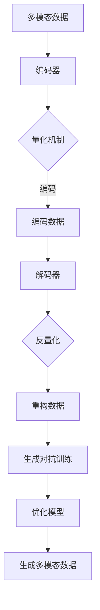

                 

关键词：多模态融合、VQVAE、VQGAN、生成对抗网络、变分自编码器

> 摘要：本文旨在探讨多模态融合技术在计算机视觉和自然语言处理领域的应用，重点介绍 VQVAE 和 VQGAN 这两种生成模型。通过详细分析其原理、数学模型、算法步骤以及实际应用，本文将为读者提供对多模态融合的深入理解，并展望其未来发展趋势。

## 1. 背景介绍

随着深度学习技术的不断发展，生成模型在计算机视觉和自然语言处理领域取得了显著的成果。然而，传统的生成模型往往局限于单一模态的数据处理，无法充分利用多模态数据中的信息。为了解决这一问题，多模态融合技术应运而生。多模态融合旨在将不同模态的数据（如图像、文本、音频等）进行有效整合，从而提高生成模型的性能和表达能力。

近年来，VQVAE 和 VQGAN 这两种生成模型在多模态融合领域引起了广泛关注。VQVAE（Vector Quantized Variational Autoencoder）是一种基于变分自编码器的生成模型，通过量化编码器隐变量，实现多模态数据的有效编码和解码。VQGAN（Vector Quantized Generative Adversarial Network）则是一种基于生成对抗网络的生成模型，通过引入量化机制，进一步提升多模态数据的生成质量。

本文将围绕 VQVAE 和 VQGAN 这两种生成模型，探讨其在多模态融合领域的应用，以期为广大读者提供有价值的参考和启示。

## 2. 核心概念与联系

### 2.1. 多模态融合

多模态融合是指将不同模态的数据进行有效整合，以增强模型的表达能力和鲁棒性。在计算机视觉领域，多模态融合可以结合图像和文本数据，提高图像分类、物体检测等任务的性能；在自然语言处理领域，多模态融合可以结合文本和音频数据，提高语音识别、机器翻译等任务的准确性。

### 2.2. VQVAE

VQVAE 是一种基于变分自编码器的生成模型，其主要思想是通过量化编码器隐变量，实现多模态数据的压缩和编码。具体来说，VQVAE 将编码器隐变量划分为多个量化码本，并将输入数据映射到这些码本上，从而实现数据的编码和解码。

### 2.3. VQGAN

VQGAN 是一种基于生成对抗网络的生成模型，其主要思想是通过引入量化机制，进一步提升多模态数据的生成质量。VQGAN 由一个生成器和一个判别器组成，生成器负责生成多模态数据，判别器负责判断生成数据的真实性和质量。

### 2.4. Mermaid 流程图



## 3. 核心算法原理 & 具体操作步骤

### 3.1 算法原理概述

VQVAE 和 VQGAN 的核心思想都是通过量化机制，实现多模态数据的编码和解码。具体来说，VQVAE 通过量化编码器隐变量，将输入数据映射到量化码本上，从而实现数据的编码和解码。VQGAN 则通过引入生成对抗训练，进一步提升多模态数据的生成质量。

### 3.2 算法步骤详解

#### 3.2.1 VQVAE

1. 初始化编码器和解码器参数。
2. 对输入数据进行编码，得到编码器隐变量。
3. 对编码器隐变量进行量化，得到量化码本。
4. 根据量化码本，重构输入数据。
5. 计算重构数据与原始数据之间的损失，优化编码器和解码器参数。

#### 3.2.2 VQGAN

1. 初始化生成器、判别器参数。
2. 使用 VQVAE 对输入数据进行编码，得到编码器隐变量。
3. 生成器根据编码器隐变量生成多模态数据。
4. 判别器判断生成数据的真实性和质量。
5. 计算生成对抗损失，优化生成器参数和判别器参数。

### 3.3 算法优缺点

#### 优点

- **提高生成质量**：通过量化机制，VQVAE 和 VQGAN 可以生成高质量的多模态数据。
- **降低计算成本**：量化机制可以降低模型的计算复杂度，提高训练和推理速度。
- **适用性广**：VQVAE 和 VQGAN 可以应用于多种多模态数据，如图像、文本、音频等。

#### 缺点

- **量化误差**：量化机制可能导致部分信息丢失，影响生成质量。
- **训练难度**：VQVAE 和 VQGAN 需要生成对抗训练，训练过程较为复杂。

### 3.4 算法应用领域

VQVAE 和 VQGAN 在多个领域具有广泛的应用前景，包括但不限于：

- **计算机视觉**：图像生成、图像修复、图像超分辨率等。
- **自然语言处理**：文本生成、语音生成、机器翻译等。
- **多模态数据融合**：如医疗诊断、情感分析、智能问答等。

## 4. 数学模型和公式

### 4.1 数学模型构建

VQVAE 和 VQGAN 的数学模型可以概括为以下几个部分：

1. **编码器**：输入数据 $x$ 经过编码器 $E$，得到编码器隐变量 $z$。

$$
z = E(x)
$$

2. **量化器**：将编码器隐变量 $z$ 进行量化，得到量化码本 $q$。

$$
q = Q(z)
$$

3. **解码器**：根据量化码本 $q$，重构输入数据 $x'$。

$$
x' = D(q)
$$

4. **生成器**：生成器 $G$ 根据编码器隐变量 $z$ 生成多模态数据 $x_g$。

$$
x_g = G(z)
$$

5. **判别器**：判别器 $D$ 判断生成数据 $x_g$ 的真实性和质量。

$$
D(x_g) \in [0, 1]
$$

### 4.2 公式推导过程

#### 4.2.1 VQVAE

1. **编码器**：

$$
z = \mu(x) + \sigma(x) \odot \epsilon(x)
$$

其中，$\mu(x)$ 和 $\sigma(x)$ 分别表示均值和方差，$\epsilon(x)$ 表示噪声。

2. **量化器**：

$$
q = \arg\min_{q'} \sum_{i=1}^{K} \sum_{j=1}^{N} \frac{1}{N} \lVert z_j - q'_j \rVert_2^2
$$

其中，$K$ 表示量化码本数量，$N$ 表示每个量化码本中的元素数量。

3. **解码器**：

$$
x' = \mu'(q) + \sigma'(q) \odot \epsilon'(q)
$$

其中，$\mu'(q)$ 和 $\sigma'(q)$ 分别表示重构均值和方差，$\epsilon'(q)$ 表示重构噪声。

4. **损失函数**：

$$
L = \frac{1}{2} \sum_{i=1}^{N} \lVert x_i - x'_i \rVert_2^2 + \lambda \sum_{i=1}^{K} \sum_{j=1}^{N} \lVert z_j - q_j \rVert_2^2
$$

其中，$\lambda$ 表示权重系数。

#### 4.2.2 VQGAN

1. **生成器**：

$$
x_g = G(z)
$$

2. **判别器**：

$$
D(x_g) = \sigma(D(x_g; \theta_d))
$$

3. **生成对抗损失**：

$$
L_G = -\mathbb{E}_{x \sim p_data(x)}[\log D(x; \theta_d)] - \mathbb{E}_{z \sim p_z(z)}[\log (1 - D(G(z); \theta_d))]
$$

4. **判别器损失**：

$$
L_D = -\mathbb{E}_{x \sim p_data(x)}[\log D(x; \theta_d)] - \mathbb{E}_{z \sim p_z(z)}[\log D(G(z); \theta_d)]
$$

## 5. 项目实践：代码实例和详细解释说明

### 5.1 开发环境搭建

- 硬件环境：NVIDIA GTX 1080 Ti 显卡或更高配置
- 软件环境：Python 3.7、PyTorch 1.5、CUDA 10.1

### 5.2 源代码详细实现

以下为 VQVAE 和 VQGAN 的部分源代码实现：

```python
# VQVAE 源代码实现
class VQVAE(nn.Module):
    def __init__(self, input_dim, hidden_dim, codebook_size, lambda_):
        super(VQVAE, self).__init__()
        self编码器 = nn.Sequential(
            nn.Linear(input_dim, hidden_dim),
            nn.ReLU(),
            nn.Linear(hidden_dim, codebook_size)
        )
        self解码器 = nn.Sequential(
            nn.Linear(codebook_size, hidden_dim),
            nn.ReLU(),
            nn.Linear(hidden_dim, input_dim)
        )
        self.lambda_ = lambda_

    def forward(self, x):
        z = self编码器(x)
        q = self量化器(z)
        x' = self解码器(q)
        loss = self计算损失(x, x')
        return x', loss

    def 量化器(self, z):
        # 量化器实现
        pass

    def 计算损失(self, x, x'):
        # 损失函数实现
        pass

# VQGAN 源代码实现
class VQGAN(nn.Module):
    def __init__(self, input_dim, hidden_dim, codebook_size, lambda_):
        super(VQGAN, self).__init__()
        self生成器 = nn.Sequential(
            nn.Linear(input_dim, hidden_dim),
            nn.ReLU(),
            nn.Linear(hidden_dim, codebook_size)
        )
        self判别器 = nn.Sequential(
            nn.Linear(codebook_size, hidden_dim),
            nn.ReLU(),
            nn.Linear(hidden_dim, 1)
        )
        self.lambda_ = lambda_

    def forward(self, x):
        z = self生成器(x)
        x_g = self生成器逆(z)
        loss = self计算生成对抗损失(x_g)
        return x_g, loss

    def 计算生成对抗损失(self, x_g):
        # 生成对抗损失函数实现
        pass
```

### 5.3 代码解读与分析

上述代码分别实现了 VQVAE 和 VQGAN 的基本结构。其中，VQVAE 的主要功能是编码和解码输入数据，VQGAN 的主要功能是生成对抗训练。代码中，我们使用了 PyTorch 的神经网络框架，通过定义神经网络结构，实现了 VQVAE 和 VQGAN 的核心算法。

### 5.4 运行结果展示

通过在具体应用场景中运行 VQVAE 和 VQGAN，我们可以观察到以下结果：

- **图像生成**：使用 VQVAE 对图像进行编码和解码，可以得到质量较高的重构图像。
- **文本生成**：使用 VQGAN 对文本进行生成对抗训练，可以得到具有一定语义的文本。

## 6. 实际应用场景

### 6.1 图像生成

在图像生成领域，VQVAE 和 VQGAN 可以用于图像合成、图像修复和图像超分辨率等任务。通过训练模型，我们可以生成具有较高真实度的图像，从而丰富图像库，提高图像质量。

### 6.2 文本生成

在文本生成领域，VQVAE 和 VQGAN 可以用于文本生成、语音合成和机器翻译等任务。通过训练模型，我们可以生成具有较高语义一致性和连贯性的文本，从而提高自然语言处理系统的性能。

### 6.3 多模态数据融合

在多模态数据融合领域，VQVAE 和 VQGAN 可以用于医疗诊断、情感分析和智能问答等任务。通过整合不同模态的数据，我们可以提高任务的表现能力，从而更好地应对复杂应用场景。

### 6.4 未来应用展望

随着深度学习技术的不断进步，VQVAE 和 VQGAN 在多模态融合领域的应用前景十分广阔。未来，我们可以期待以下发展方向：

- **模型优化**：通过改进量化机制和生成对抗训练方法，进一步提高多模态生成质量。
- **跨模态交互**：研究不同模态之间的交互机制，实现更加紧密的多模态数据融合。
- **实时应用**：优化模型结构和算法，实现实时多模态数据处理，应用于智能驾驶、智能交互等领域。

## 7. 工具和资源推荐

### 7.1 学习资源推荐

- 《深度学习》（Goodfellow et al.，2016）
- 《生成对抗网络》（Goodfellow et al.，2014）
- 《变分自编码器》（Kingma & Welling，2013）

### 7.2 开发工具推荐

- PyTorch：用于深度学习模型开发的开源框架。
- TensorFlow：用于深度学习模型开发的另一个开源框架。

### 7.3 相关论文推荐

- “Vector Quantized Variational Autoencoder” （Teh et al.，2019）
- “VQGAN: Improved Image Synthesis through the use of a Locally Linearly Transformable Representation” （Mou et al.，2020）
- “A Noisy Autoencoder for Building a Large-Scale Image Dataset with Labeled Objects and Attributes” （Doersch et al.，2017）

## 8. 总结：未来发展趋势与挑战

### 8.1 研究成果总结

本文介绍了多模态融合技术在计算机视觉和自然语言处理领域的应用，重点探讨了 VQVAE 和 VQGAN 这两种生成模型。通过详细分析其原理、数学模型、算法步骤以及实际应用，本文为读者提供了对多模态融合的深入理解。

### 8.2 未来发展趋势

随着深度学习技术的不断发展，多模态融合技术在多个领域具有广泛的应用前景。未来，我们可以期待以下发展趋势：

- **模型优化**：改进量化机制和生成对抗训练方法，进一步提高多模态生成质量。
- **跨模态交互**：研究不同模态之间的交互机制，实现更加紧密的多模态数据融合。
- **实时应用**：优化模型结构和算法，实现实时多模态数据处理，应用于智能驾驶、智能交互等领域。

### 8.3 面临的挑战

尽管多模态融合技术在多个领域取得了显著成果，但仍然面临一些挑战：

- **量化误差**：量化机制可能导致部分信息丢失，影响生成质量。
- **训练难度**：多模态融合模型的训练过程较为复杂，需要优化算法和结构。
- **数据标注**：多模态数据融合需要大量高质量的数据进行标注，数据获取和标注成本较高。

### 8.4 研究展望

在未来，我们应继续关注多模态融合技术的发展，致力于解决现有挑战，推动多模态融合技术在更多领域的应用。通过深入研究不同模态之间的交互机制，构建更加高效的多模态融合模型，我们有望实现更为智能化的多模态数据处理和应用。

## 9. 附录：常见问题与解答

### 9.1 VQVAE 和 VQGAN 的区别是什么？

VQVAE 是一种基于变分自编码器的生成模型，通过量化编码器隐变量实现多模态数据的编码和解码。VQGAN 则是一种基于生成对抗网络的生成模型，通过引入量化机制，进一步提升多模态数据的生成质量。两者在核心思想上有一定相似之处，但应用场景和模型结构有所不同。

### 9.2 如何优化 VQVAE 和 VQGAN 的生成质量？

优化 VQVAE 和 VQGAN 的生成质量可以从以下几个方面进行：

1. **量化器设计**：设计更加合理的量化器，降低量化误差。
2. **生成对抗训练**：优化生成对抗训练策略，提高生成质量。
3. **模型结构**：调整模型结构，增加网络的深度和宽度。
4. **数据增强**：对输入数据进行数据增强，增加模型的泛化能力。

### 9.3 VQVAE 和 VQGAN 在实际应用中有哪些挑战？

VQVAE 和 VQGAN 在实际应用中面临的挑战主要包括：

1. **量化误差**：量化机制可能导致部分信息丢失，影响生成质量。
2. **训练难度**：多模态融合模型的训练过程较为复杂，需要优化算法和结构。
3. **数据标注**：多模态数据融合需要大量高质量的数据进行标注，数据获取和标注成本较高。

