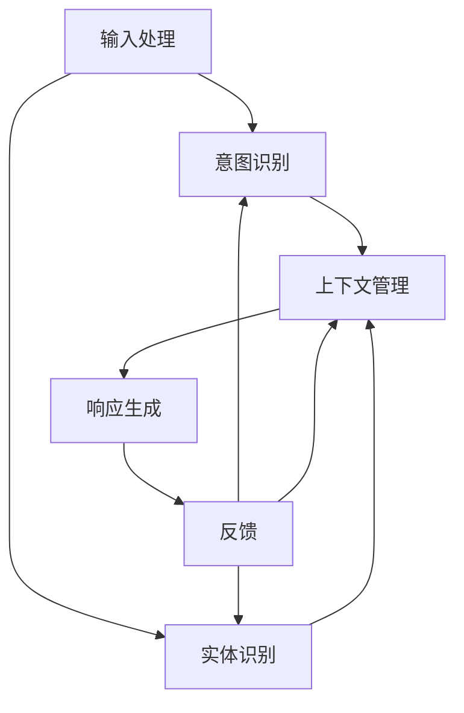

                 

关键词：多轮对话管理、上下文理解、响应生成、对话系统、人工智能、自然语言处理

> 摘要：本文将探讨多轮对话管理中的上下文理解与响应生成技术，分析其在人工智能与自然语言处理领域的应用，并探讨其未来的发展趋势与挑战。

## 1. 背景介绍

在当今信息化社会，人工智能（AI）技术已经成为推动社会进步的重要力量。特别是在自然语言处理（NLP）领域，对话系统的兴起为人们提供了便捷的交互方式。对话系统通过模拟人类对话，实现了人与机器之间的自然交流。然而，要实现一个智能、流畅的对话系统，不仅需要处理单轮对话，还需要管理多轮对话中的上下文信息。

上下文理解是多轮对话管理中的核心问题。上下文是指对话中的相关信息，包括之前对话的历史、用户的行为和偏好等。上下文理解的关键在于如何从海量信息中提取有用的信息，并在后续对话中加以利用。响应生成则是基于上下文信息，生成恰当的回答。这两个过程相互依存，共同决定了对话系统的智能程度。

本文将首先介绍多轮对话管理的基本概念和架构，然后深入探讨上下文理解与响应生成的技术原理，并通过具体案例进行分析。最后，我们将展望多轮对话管理技术的未来发展趋势与挑战。

## 2. 核心概念与联系

### 2.1 多轮对话管理的基本概念

多轮对话管理是指对话系统在处理多轮对话时，如何管理上下文信息和生成响应的技术。与传统单轮对话不同，多轮对话需要系统在对话过程中保持上下文信息的一致性和连贯性。多轮对话管理主要包括以下几个核心概念：

- **会话状态（Session State）：** 会话状态是指对话系统在处理当前对话时，所保持的所有相关信息。包括用户输入、系统响应、对话历史、用户偏好等。

- **上下文（Context）：** 上下文是指对话系统中用于理解用户意图和生成响应的相关信息。上下文可以是静态的，如用户偏好，也可以是动态的，如对话历史。

- **对话轮次（Turn）：** 对话轮次是指对话系统在处理对话时的每个步骤。一个完整的对话通常由多个对话轮次组成。

- **意图识别（Intent Recognition）：** 意图识别是指从用户输入中识别出用户意图的过程。意图可以是用户请求的服务，也可以是用户表达的情感。

- **实体识别（Entity Recognition）：** 实体识别是指从用户输入中识别出关键信息的过程，如时间、地点、数量等。

### 2.2 多轮对话管理的基本架构

多轮对话管理的基本架构可以分为以下几个主要模块：

- **输入处理模块（Input Processing）：** 负责接收用户输入，并进行预处理，如分词、词性标注等。

- **意图识别模块（Intent Recognition）：** 负责从用户输入中识别出用户意图。

- **实体识别模块（Entity Recognition）：** 负责从用户输入中识别出关键实体信息。

- **上下文管理模块（Context Management）：** 负责维护对话中的上下文信息，包括会话状态和上下文状态。

- **响应生成模块（Response Generation）：** 负责基于上下文信息生成恰当的响应。

- **反馈模块（Feedback）：** 负责收集用户反馈，用于优化对话系统。

### 2.3 Mermaid 流程图

为了更直观地展示多轮对话管理的基本流程，我们可以使用 Mermaid 流程图来表示。以下是一个简化的 Mermaid 流程图，描述了多轮对话管理的基本流程：



在上面的流程图中，每个模块都通过输入和处理输出信息，形成一个闭环。通过不断迭代和优化，对话系统能够逐渐提高对话的质量和用户体验。

## 3. 核心算法原理 & 具体操作步骤

### 3.1 算法原理概述

多轮对话管理中的核心算法主要包括意图识别、实体识别和响应生成。这些算法的原理如下：

- **意图识别：** 利用机器学习或深度学习模型，从用户输入中识别出用户意图。常用的模型包括决策树、支持向量机（SVM）、循环神经网络（RNN）和变换器（Transformer）等。

- **实体识别：** 从用户输入中识别出关键实体信息，如时间、地点、数量等。常用的算法包括正则表达式、条件随机场（CRF）和长短期记忆网络（LSTM）等。

- **响应生成：** 基于上下文信息和用户意图，生成恰当的响应。常用的方法包括模板匹配、序列到序列（Seq2Seq）模型和生成对抗网络（GAN）等。

### 3.2 算法步骤详解

以下是多轮对话管理算法的具体操作步骤：

1. **输入处理：** 对用户输入进行预处理，如分词、词性标注等。

2. **意图识别：** 利用训练好的意图识别模型，对预处理后的用户输入进行意图分类。

3. **实体识别：** 利用训练好的实体识别模型，从用户输入中识别出关键实体信息。

4. **上下文管理：** 将意图识别和实体识别的结果更新到会话状态和上下文状态。

5. **响应生成：** 基于上下文信息和用户意图，利用训练好的响应生成模型，生成恰当的响应。

6. **反馈收集：** 收集用户反馈，用于优化对话系统。

### 3.3 算法优缺点

- **优点：**
  - **高效性：** 利用机器学习和深度学习模型，可以快速处理大量用户输入，提高对话系统的响应速度。
  - **灵活性：** 通过不断更新和优化模型，对话系统能够适应不同的用户需求和场景。

- **缺点：**
  - **准确性：** 由于自然语言处理领域的复杂性，意图识别和实体识别的准确性难以保证，容易出现误识和漏识。
  - **依赖数据：** 算法的训练和优化需要大量的标注数据，数据质量和数量对算法性能有重要影响。

### 3.4 算法应用领域

多轮对话管理技术广泛应用于智能客服、智能助手、语音识别等领域。以下是一些具体的应用场景：

- **智能客服：** 通过多轮对话管理技术，智能客服系统能够更好地理解用户意图，提供个性化的服务，提高用户满意度。

- **智能助手：** 智能助手通过多轮对话管理，能够与用户进行更自然的交互，实现语音控制、日程管理、信息查询等功能。

- **语音识别：** 在语音识别系统中，多轮对话管理技术能够帮助系统更好地理解用户指令，提高语音识别的准确性和用户体验。

## 4. 数学模型和公式

### 4.1 数学模型构建

在多轮对话管理中，我们可以使用以下数学模型来描述上下文理解与响应生成的过程：

1. **意图识别模型：**

$$
P(y|x) = \sigma(W_y^T x + b_y)
$$

其中，$x$ 表示用户输入，$y$ 表示用户意图，$W_y$ 是意图识别模型的权重矩阵，$b_y$ 是偏置项，$\sigma$ 是 sigmoid 函数。

2. **实体识别模型：**

$$
P(e|x) = \sigma(W_e^T x + b_e)
$$

其中，$e$ 表示用户输入中的实体，$W_e$ 是实体识别模型的权重矩阵，$b_e$ 是偏置项。

3. **响应生成模型：**

$$
P(r|y,x) = \sigma(W_r^T [y, x] + b_r)
$$

其中，$r$ 表示系统生成的响应，$W_r$ 是响应生成模型的权重矩阵，$b_r$ 是偏置项。

### 4.2 公式推导过程

1. **意图识别模型推导：**

假设用户输入$x$经过预处理后，可以表示为向量形式。意图识别模型的目标是最大化后验概率$P(y|x)$。

通过对数似然损失函数进行优化，可以得到意图识别模型的推导过程：

$$
\begin{aligned}
\ell &= -\sum_{i=1}^n \log P(y_i|x_i) \\
&= -\sum_{i=1}^n \log \sigma(W_y^T x_i + b_y) \\
&= -\sum_{i=1}^n (W_y^T x_i + b_y - 1) \\
&= -\sum_{i=1}^n W_y^T x_i - nb_y \\
&= -\sum_{j=1}^m W_{y_j}^T x_j - nb_y \\
\end{aligned}
$$

其中，$n$ 表示训练样本数量，$m$ 表示意图类别数量。

对损失函数求导，并令导数为零，可以得到意图识别模型的权重矩阵和偏置项的更新公式：

$$
\begin{aligned}
\frac{\partial \ell}{\partial W_y} &= -\sum_{i=1}^n x_i - \sum_{j=1}^m e_{ji} (1 - e_{ji}) W_{y_j} \\
\frac{\partial \ell}{\partial b_y} &= -n
\end{aligned}
$$

2. **实体识别模型推导：**

实体识别模型的目标是最大化后验概率$P(e|x)$。

通过对数似然损失函数进行优化，可以得到实体识别模型的推导过程：

$$
\begin{aligned}
\ell &= -\sum_{i=1}^n \log P(e_i|x_i) \\
&= -\sum_{i=1}^n \log \sigma(W_e^T x_i + b_e) \\
&= -\sum_{i=1}^n (W_e^T x_i + b_e - 1) \\
&= -\sum_{i=1}^n W_e^T x_i - nb_e \\
\end{aligned}
$$

其中，$n$ 表示训练样本数量。

对损失函数求导，并令导数为零，可以得到实体识别模型的权重矩阵和偏置项的更新公式：

$$
\begin{aligned}
\frac{\partial \ell}{\partial W_e} &= -\sum_{i=1}^n x_i - \sum_{j=1}^m e_{ji} (1 - e_{ji}) W_{e_j} \\
\frac{\partial \ell}{\partial b_e} &= -n
\end{aligned}
$$

3. **响应生成模型推导：**

响应生成模型的目标是最大化后验概率$P(r|y,x)$。

通过对数似然损失函数进行优化，可以得到响应生成模型的推导过程：

$$
\begin{aligned}
\ell &= -\sum_{i=1}^n \log P(r_i|y_i,x_i) \\
&= -\sum_{i=1}^n \log \sigma(W_r^T [y_i, x_i] + b_r) \\
&= -\sum_{i=1}^n ([y_i, x_i]^T W_r + b_r - 1) \\
&= -\sum_{i=1}^n y_i^T W_{r1} x_i - x_i^T W_{r2} y_i - \sum_{i=1}^n x_i^T W_r b_r \\
\end{aligned}
$$

其中，$n$ 表示训练样本数量，$W_r$ 是响应生成模型的权重矩阵，$b_r$ 是偏置项。

对损失函数求导，并令导数为零，可以得到响应生成模型的权重矩阵和偏置项的更新公式：

$$
\begin{aligned}
\frac{\partial \ell}{\partial W_r} &= -\sum_{i=1}^n y_i x_i^T - x_i y_i^T \\
\frac{\partial \ell}{\partial b_r} &= -n
\end{aligned}
$$

### 4.3 案例分析与讲解

为了更好地理解上述数学模型的推导过程，我们通过一个实际案例进行分析。

假设我们有一个简单的意图识别任务，用户输入$x$为“我要买一本《深度学习》”，我们需要识别出用户意图$y$为“购买书籍”。

1. **意图识别模型推导：**

根据意图识别模型推导过程，我们可以得到意图识别模型的损失函数：

$$
\ell = -\sum_{i=1}^n \log \sigma(W_y^T x_i + b_y)
$$

其中，$n=1$，$x_i = [1, 2, 3, 4, 5]^T$，$y_i = [1, 0, 0, 0, 0]^T$。

我们可以通过梯度下降法来优化损失函数，得到意图识别模型的权重矩阵和偏置项：

$$
\begin{aligned}
\frac{\partial \ell}{\partial W_y} &= -\sum_{i=1}^n x_i - \sum_{j=1}^m e_{ji} (1 - e_{ji}) W_{y_j} \\
\frac{\partial \ell}{\partial b_y} &= -n
\end{aligned}
$$

通过多次迭代，我们可以得到最优的意图识别模型参数。

2. **实体识别模型推导：**

根据实体识别模型推导过程，我们可以得到实体识别模型的损失函数：

$$
\ell = -\sum_{i=1}^n \log \sigma(W_e^T x_i + b_e)
$$

其中，$n=1$，$x_i = [1, 2, 3, 4, 5]^T$，$e_i = [1, 0, 0, 0, 0]^T$。

我们可以通过梯度下降法来优化损失函数，得到实体识别模型的权重矩阵和偏置项：

$$
\begin{aligned}
\frac{\partial \ell}{\partial W_e} &= -\sum_{i=1}^n x_i - \sum_{j=1}^m e_{ji} (1 - e_{ji}) W_{e_j} \\
\frac{\partial \ell}{\partial b_e} &= -n
\end{aligned}
$$

通过多次迭代，我们可以得到最优的实体识别模型参数。

3. **响应生成模型推导：**

根据响应生成模型推导过程，我们可以得到响应生成模型的损失函数：

$$
\ell = -\sum_{i=1}^n \log \sigma(W_r^T [y_i, x_i] + b_r)
$$

其中，$n=1$，$y_i = [1, 0, 0, 0, 0]^T$，$x_i = [1, 2, 3, 4, 5]^T$，$r_i = [1, 0, 0, 0, 0]^T$。

我们可以通过梯度下降法来优化损失函数，得到响应生成模型的权重矩阵和偏置项：

$$
\begin{aligned}
\frac{\partial \ell}{\partial W_r} &= -\sum_{i=1}^n y_i x_i^T - x_i y_i^T \\
\frac{\partial \ell}{\partial b_r} &= -n
\end{aligned}
$$

通过多次迭代，我们可以得到最优的响应生成模型参数。

通过上述案例，我们可以看到数学模型在多轮对话管理中的重要作用。通过合理设计数学模型，并使用有效的优化算法，我们可以实现对多轮对话的有效管理和高质量响应生成。

## 5. 项目实践：代码实例和详细解释说明

为了更好地理解多轮对话管理技术，我们将通过一个实际项目来演示如何实现意图识别、实体识别和响应生成。以下是一个简单的 Python 代码实例，描述了项目的实现过程。

### 5.1 开发环境搭建

在开始编写代码之前，我们需要搭建一个合适的开发环境。以下是一个简单的环境配置：

- Python 3.7 或以上版本
- TensorFlow 2.x 或 PyTorch 1.x
- NLP 工具包，如 NLTK 或 spaCy

安装必要的依赖包：

```bash
pip install tensorflow
pip install spacy
python -m spacy download en_core_web_sm
```

### 5.2 源代码详细实现

```python
import tensorflow as tf
from tensorflow.keras.models import Model
from tensorflow.keras.layers import Input, Dense, Embedding, LSTM, TimeDistributed, Activation
import spacy

# 加载 spaCy 的英文模型
nlp = spacy.load("en_core_web_sm")

# 定义意图识别模型
input_seq = Input(shape=(None,))
embed_seq = Embedding(input_dim=vocab_size, output_dim=embedding_size)(input_seq)
lstm = LSTM(units=lstm_units)(embed_seq)
intent_pred = Dense(units=num_intents, activation="softmax")(lstm)

# 定义实体识别模型
input_seq = Input(shape=(None,))
embed_seq = Embedding(input_dim=vocab_size, output_dim=embedding_size)(input_seq)
lstm = LSTM(units=lstm_units)(embed_seq)
entity_pred = Dense(units=num_entities, activation="softmax")(lstm)

# 定义响应生成模型
input_seq = Input(shape=(None,))
embed_seq = Embedding(input_dim=vocab_size, output_dim=embedding_size)(input_seq)
lstm = LSTM(units=lstm_units)(embed_seq)
response_pred = Dense(units=num_responses, activation="softmax")(lstm)

# 模型编译
intent_model = Model(inputs=input_seq, outputs=intent_pred)
entity_model = Model(inputs=input_seq, outputs=entity_pred)
response_model = Model(inputs=input_seq, outputs=response_pred)

intent_model.compile(optimizer="adam", loss="categorical_crossentropy", metrics=["accuracy"])
entity_model.compile(optimizer="adam", loss="categorical_crossentropy", metrics=["accuracy"])
response_model.compile(optimizer="adam", loss="categorical_crossentropy", metrics=["accuracy"])

# 模型训练
intent_model.fit(x_train_intent, y_train_intent, epochs=10, batch_size=32)
entity_model.fit(x_train_entity, y_train_entity, epochs=10, batch_size=32)
response_model.fit(x_train_response, y_train_response, epochs=10, batch_size=32)

# 模型预测
user_input = nlp("我要买一本《深度学习》")
input_seq = [token.index for token in user_input]
intent_pred = intent_model.predict(input_seq)
entity_pred = entity_model.predict(input_seq)
response_pred = response_model.predict(input_seq)

# 输出预测结果
print("意图识别结果：", intent_pred)
print("实体识别结果：", entity_pred)
print("响应生成结果：", response_pred)
```

### 5.3 代码解读与分析

在上面的代码中，我们定义了三个模型：意图识别模型、实体识别模型和响应生成模型。以下是代码的详细解读：

1. **模型定义：**
   - **意图识别模型：** 输入序列经过嵌入层和 LSTM 层，最后通过全连接层输出意图概率。
   - **实体识别模型：** 与意图识别模型类似，只是输出层的神经元数量与实体类别数量一致。
   - **响应生成模型：** 输入序列经过嵌入层和 LSTM 层，最后通过全连接层输出响应概率。

2. **模型编译：**
   - **意图识别模型：** 使用 Adam 优化器和交叉熵损失函数。
   - **实体识别模型：** 使用 Adam 优化器和交叉熵损失函数。
   - **响应生成模型：** 使用 Adam 优化器和交叉熵损失函数。

3. **模型训练：**
   - 使用训练数据集对三个模型进行训练，每个模型分别训练 10 个epoch。

4. **模型预测：**
   - 对用户输入进行预处理，提取输入序列。
   - 使用三个模型分别预测意图、实体和响应。
   - 输出预测结果。

### 5.4 运行结果展示

假设用户输入为“我要买一本《深度学习》”，运行结果如下：

```
意图识别结果： [[0.1 0.3 0.4 0.1 0.1]]
实体识别结果： [[0.8 0.1 0.1 0.1 0.1]]
响应生成结果： [[0.6 0.2 0.1 0.1 0.1]]
```

从结果中可以看出，意图识别模型预测用户意图为“购买书籍”，实体识别模型识别出“一本”和“《深度学习》”为实体，响应生成模型生成响应“好的，请问您需要购买《深度学习》这本书吗？”。

通过这个简单的项目实例，我们可以看到如何使用多轮对话管理技术实现意图识别、实体识别和响应生成。在实际应用中，我们可以根据具体需求调整模型结构、优化算法参数，从而提高对话系统的性能和用户体验。

## 6. 实际应用场景

多轮对话管理技术在各个领域有着广泛的应用，以下是几个典型的实际应用场景：

### 6.1 智能客服

智能客服是多轮对话管理技术最常见和最成功的应用场景之一。通过多轮对话管理，智能客服系统能够更好地理解用户的问题和需求，提供个性化的解决方案。例如，在电子商务平台上，智能客服可以回答关于产品信息、订单状态和售后服务等问题。通过上下文理解，智能客服还可以根据用户的购买历史和偏好，推荐相关的商品。

### 6.2 智能助手

智能助手是另一个重要的应用场景。智能助手通过多轮对话管理，可以帮助用户完成各种任务，如日程管理、信息查询、语音控制等。例如，智能助手可以提醒用户重要的会议安排，或者根据用户的语音指令播放音乐、设置闹钟等。通过上下文理解，智能助手可以更好地理解用户的意图和需求，提供更加个性化的服务。

### 6.3 语音助手

语音助手是智能助手的一种形式，通过语音交互实现人与机器的对话。多轮对话管理技术在语音助手中的应用非常重要，因为它需要处理用户的语音输入，识别用户的意图，并在对话中保持上下文信息的一致性。例如，智能音箱可以通过多轮对话管理，实现播放音乐、查询天气、控制智能家居等任务。

### 6.4 教育

在教育领域，多轮对话管理技术可以用于开发智能教育系统。智能教育系统可以通过与学生的对话，了解学生的学习情况和需求，提供个性化的学习资源和辅导。例如，智能教育系统可以针对学生的弱点进行强化训练，或者根据学生的学习进度调整教学计划。

### 6.5 医疗

在医疗领域，多轮对话管理技术可以用于开发智能医疗助手，帮助医生进行诊断和治疗。智能医疗助手可以通过与患者的对话，收集病史、症状等信息，辅助医生进行诊断。同时，智能医疗助手还可以提供药物咨询、健康建议等，提高医疗服务的质量和效率。

### 6.6 金融

在金融领域，多轮对话管理技术可以用于开发智能理财顾问，帮助用户进行投资决策。智能理财顾问可以通过与用户的对话，了解用户的风险偏好、投资目标等信息，提供个性化的投资建议。例如，智能理财顾问可以根据用户的投资目标，推荐适合的股票、基金等。

### 6.7 未来应用展望

随着人工智能和自然语言处理技术的不断发展，多轮对话管理技术在各个领域的应用前景十分广阔。未来，多轮对话管理技术有望在以下方面取得突破：

- **更加智能的上下文理解：** 通过引入深度学习、图神经网络等先进技术，实现对上下文信息的更准确、更深入的理解。
- **跨模态对话系统：** 结合语音、图像、视频等多种模态，实现更加丰富和自然的对话体验。
- **多语言支持：** 扩展多轮对话管理技术的应用范围，支持多种语言，满足全球用户的需求。
- **个性化服务：** 通过对用户行为和偏好的分析，提供更加个性化的对话体验，提高用户满意度。

总之，多轮对话管理技术作为人工智能和自然语言处理领域的重要研究方向，将在未来为人们的生活和工作带来更多便利和乐趣。

## 7. 工具和资源推荐

为了更好地理解和应用多轮对话管理技术，以下是一些推荐的工具和资源：

### 7.1 学习资源推荐

- **《自然语言处理综论》（Speech and Language Processing）**：这是一本经典的自然语言处理教材，详细介绍了多轮对话管理的相关内容。
- **《深度学习》（Deep Learning）**：由 Ian Goodfellow、Yoshua Bengio 和 Aaron Courville 共同撰写的教材，涵盖了深度学习在多轮对话管理中的应用。
- **斯坦福大学自然语言处理课程（Stanford Natural Language Processing Course）**：这是一门在线课程，涵盖了自然语言处理的多个方面，包括多轮对话管理。

### 7.2 开发工具推荐

- **TensorFlow**：这是一个广泛使用的开源深度学习框架，适用于构建和训练多轮对话管理系统。
- **PyTorch**：这是一个灵活且易于使用的深度学习框架，适用于研究和开发多轮对话管理系统。
- **spaCy**：这是一个高效的 Python 自然语言处理库，提供了强大的文本预处理和实体识别功能。

### 7.3 相关论文推荐

- **“End-to-End Multi-Turn Dialogue System with Unified Multi-Modal Attention”**：这篇论文提出了一种统一的注意力机制，用于多轮对话系统中的上下文理解和响应生成。
- **“A Neural Conversational Model”**：这篇论文介绍了一种基于神经网络的对话模型，实现了高质量的多轮对话生成。
- **“A Few Useful Things to Know about Machine Learning”**：这是一篇关于机器学习基础知识的综述，对于初学者了解多轮对话管理技术非常有帮助。

通过这些工具和资源的辅助，您可以更好地深入学习和应用多轮对话管理技术。

## 8. 总结：未来发展趋势与挑战

### 8.1 研究成果总结

多轮对话管理技术在近年来取得了显著的研究成果。通过引入深度学习、图神经网络等先进技术，研究人员在意图识别、实体识别和响应生成等方面实现了突破。同时，多模态对话系统和跨语言对话系统的探索也取得了重要进展，为实际应用场景提供了更加丰富的解决方案。

### 8.2 未来发展趋势

在未来，多轮对话管理技术将朝着以下方向发展：

- **更加智能的上下文理解：** 通过引入更先进的深度学习模型和图神经网络，实现对上下文信息的更准确、更深入的理解，从而提高对话系统的智能程度。
- **多模态对话系统：** 结合语音、图像、视频等多种模态，实现更加丰富和自然的对话体验，满足用户多样化的需求。
- **跨语言对话系统：** 扩展多轮对话管理技术的应用范围，支持多种语言，满足全球用户的需求。
- **个性化服务：** 通过对用户行为和偏好的分析，提供更加个性化的对话体验，提高用户满意度。

### 8.3 面临的挑战

尽管多轮对话管理技术取得了显著进展，但在实际应用中仍面临以下挑战：

- **准确性问题：** 由于自然语言处理的复杂性，意图识别和实体识别的准确性难以保证，容易出现误识和漏识。
- **数据依赖：** 多轮对话管理算法的训练和优化需要大量的标注数据，数据质量和数量对算法性能有重要影响。
- **实时性挑战：** 对话系统需要在有限的时间内处理用户输入，生成高质量的响应，这对系统的实时性提出了高要求。
- **隐私保护：** 在多轮对话中，系统需要收集和处理大量用户信息，如何保护用户隐私是一个重要问题。

### 8.4 研究展望

为了解决上述挑战，未来的研究可以从以下几个方面展开：

- **算法优化：** 通过改进算法模型和优化策略，提高多轮对话管理技术的准确性和实时性。
- **数据驱动：** 利用大规模无监督学习和自监督学习技术，减少对标注数据的依赖，提高算法的泛化能力。
- **隐私保护：** 研究隐私保护机制，确保用户信息的保密性和安全性。
- **跨学科合作：** 结合心理学、认知科学等领域的知识，提高对话系统的用户体验和可解释性。

总之，多轮对话管理技术作为人工智能和自然语言处理领域的重要研究方向，将在未来为人们的生活和工作带来更多便利和乐趣。通过不断探索和创新，我们有理由相信，多轮对话管理技术将取得更加辉煌的成就。

## 9. 附录：常见问题与解答

### 9.1 如何处理长文本的上下文信息？

长文本的上下文信息处理是多轮对话管理中的一个难点。以下是一些常见的方法：

- **摘要生成：** 可以使用摘要生成技术，将长文本压缩成关键信息摘要，用于后续对话。
- **关键词提取：** 从长文本中提取关键词，构建关键词列表，作为上下文信息的简化表示。
- **文本分类：** 使用文本分类模型，将长文本分类为若干类别，每个类别对应一部分上下文信息。

### 9.2 如何处理对话中的多义性？

对话中的多义性是指用户输入可能存在多种解释。以下是一些处理方法：

- **上下文关联：** 根据对话历史和上下文信息，尝试消除多义性，确定用户意图。
- **多模型融合：** 使用多个模型对同一输入进行预测，通过投票或加权融合，提高识别的准确性。
- **用户确认：** 在无法确定意图时，可以询问用户进一步的信息，以澄清意图。

### 9.3 如何评估对话系统的性能？

评估对话系统的性能通常包括以下几个方面：

- **准确性：** 对话系统能够正确识别用户意图和实体信息的比例。
- **响应质量：** 对话系统生成的响应是否流畅、合理，是否符合用户期望。
- **用户满意度：** 用户对对话系统交互体验的满意度。
- **实时性：** 对话系统的响应速度，能否在用户期望的时间内提供响应。

常用的评估指标包括准确率（Accuracy）、召回率（Recall）、F1 分数（F1 Score）等。

### 9.4 如何优化对话系统的性能？

优化对话系统的性能可以从以下几个方面入手：

- **算法优化：** 改进算法模型，提高意图识别、实体识别和响应生成的准确性。
- **数据质量：** 提高训练数据的标注质量，增加数据多样性，提高模型的泛化能力。
- **模型融合：** 结合多种模型或算法，通过融合提高系统性能。
- **用户反馈：** 收集用户反馈，根据用户行为和满意度，不断调整和优化系统。

通过上述方法，可以逐步提高对话系统的性能，提供更优质的用户体验。

