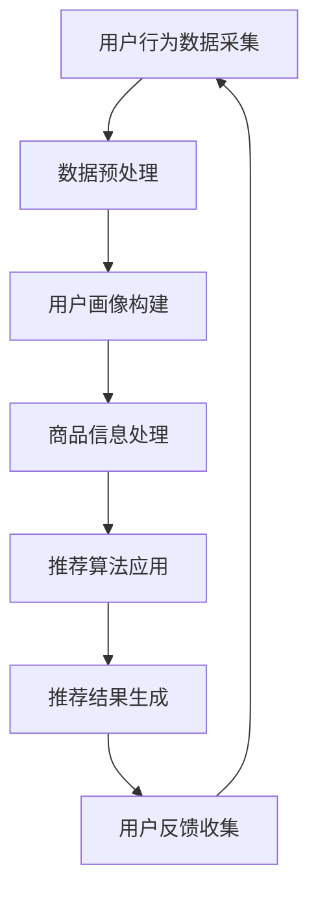

                 

### 关键词 Keywords

- 大数据
- AI
- 电商搜索推荐
- 准确率
- 用户体验

<|assistant|>### 摘要 Summary

本文深入探讨了大数据与人工智能（AI）相结合的电商搜索推荐系统，重点分析了如何通过提高准确率和优化用户体验来提升电商平台的竞争力。文章首先介绍了电商搜索推荐系统的基本概念和重要性，随后详细阐述了核心概念和架构，包括大数据处理、机器学习算法和用户行为分析。接着，文章解析了关键算法原理、数学模型和公式，并通过项目实践展示了代码实现和运行结果。此外，文章还探讨了实际应用场景、未来发展趋势和面临的挑战，并推荐了相关学习资源和开发工具。最后，文章总结了研究成果，展望了未来发展方向。

<|assistant|>### 1. 背景介绍 Background

随着互联网的普及和电子商务的快速发展，电商平台的用户数量和交易规模逐年攀升。在这种背景下，如何为用户提供高效、精准的商品推荐成为电商企业关注的焦点。传统的搜索推荐系统主要依赖于关键词匹配和统计方法，但这种方法在处理海量数据和高维度信息时存在明显的局限性。大数据和人工智能技术的兴起为电商搜索推荐系统带来了新的机遇。

大数据技术能够高效处理和分析海量数据，挖掘出用户行为特征和商品属性，为推荐系统提供丰富的信息支持。而人工智能技术，特别是机器学习算法，能够从数据中学习并自动生成推荐结果，大大提升了推荐的准确性和个性化程度。因此，结合大数据和AI技术的电商搜索推荐系统在提高用户体验和转化率方面具有显著优势。

### 2. 核心概念与联系 Core Concepts and Connections

在构建大数据与AI驱动的电商搜索推荐系统时，我们需要理解以下几个核心概念：

#### 2.1 大数据处理技术

大数据处理技术主要包括数据采集、存储、处理和分析。数据采集涉及用户行为数据、商品数据等；存储技术如Hadoop、HBase等用于大规模数据存储；处理技术如MapReduce、Spark等用于高效数据处理；分析技术如数据挖掘、机器学习等用于提取有价值的信息。

#### 2.2 机器学习算法

机器学习算法是AI的核心技术之一。常用的推荐算法包括协同过滤（Collaborative Filtering）、基于内容的推荐（Content-Based Filtering）和混合推荐（Hybrid Recommendation）。协同过滤算法通过分析用户之间的相似性进行推荐；基于内容的推荐算法通过分析商品的特征进行推荐；混合推荐算法结合了这两种方法的优点。

#### 2.3 用户行为分析

用户行为分析是推荐系统的重要环节。通过分析用户浏览、点击、购买等行为，可以挖掘用户的兴趣偏好，为推荐系统提供依据。

以下是一个简化的Mermaid流程图，展示了大数据处理和机器学习算法在电商搜索推荐系统中的应用：



在这个流程图中，用户行为数据和商品信息通过数据预处理和用户画像构建，输入到推荐算法中生成推荐结果。用户反馈会进一步优化推荐算法，形成一个闭环系统，不断提高推荐的准确率和用户体验。

### 3. 核心算法原理 & 具体操作步骤 Core Algorithm Principles & Step-by-Step Procedures

#### 3.1 算法原理概述

电商搜索推荐系统常用的算法包括：

- **协同过滤算法**：基于用户行为数据，通过计算用户之间的相似性，为用户推荐相似用户喜欢的商品。
- **基于内容的推荐算法**：通过分析商品的属性和用户偏好，为用户推荐与其兴趣相关的商品。
- **混合推荐算法**：结合协同过滤和基于内容的推荐方法，提高推荐系统的准确性和多样性。

#### 3.2 算法步骤详解

**协同过滤算法**

1. **用户行为数据收集**：收集用户浏览、点击、购买等行为数据。
2. **用户相似性计算**：计算用户之间的相似度，常用方法包括用户基于用户的协同过滤（User-Based CF）和基于物品的协同过滤（Item-Based CF）。
3. **推荐结果生成**：根据用户相似度矩阵，为用户生成推荐列表。

**基于内容的推荐算法**

1. **商品特征提取**：提取商品的属性信息，如类别、品牌、价格等。
2. **用户偏好建模**：分析用户的历史行为，建立用户偏好模型。
3. **推荐结果生成**：根据用户偏好模型和商品特征，为用户生成推荐列表。

**混合推荐算法**

1. **协同过滤**：利用协同过滤算法生成初步推荐列表。
2. **基于内容**：利用基于内容的推荐算法，为每个用户生成额外的推荐列表。
3. **合并结果**：将协同过滤和基于内容的推荐结果进行合并，生成最终推荐列表。

#### 3.3 算法优缺点

**协同过滤算法**

- **优点**：简单高效，能够生成个性化的推荐结果。
- **缺点**：易受稀疏数据影响，难以处理高维度数据。

**基于内容的推荐算法**

- **优点**：能够处理高维度数据，对用户偏好有较好的捕捉能力。
- **缺点**：推荐结果可能过于依赖商品特征，缺乏个性化。

**混合推荐算法**

- **优点**：结合了协同过滤和基于内容推荐的优势，提高推荐准确性。
- **缺点**：计算复杂度较高，需要处理多种数据来源。

#### 3.4 算法应用领域

- **电商推荐**：在电商平台中，为用户推荐商品，提高购买转化率。
- **社交媒体**：为用户提供个性化内容推荐，提高用户活跃度。
- **广告推荐**：为用户推荐广告，提高广告投放效果。

### 4. 数学模型和公式 Mathematical Models & Formulas

在电商搜索推荐系统中，数学模型和公式用于描述用户行为、商品特征和推荐算法之间的关系。以下是一个简单的数学模型和公式的例子：

#### 4.1 数学模型构建

假设用户集合为 \( U = \{u_1, u_2, ..., u_n\} \)，商品集合为 \( I = \{i_1, i_2, ..., i_m\} \)，用户 \( u_i \) 对商品 \( i_j \) 的评分表示为 \( r_{ij} \)。

**协同过滤算法**

- **用户相似性计算**：

$$
sim(u_i, u_j) = \frac{\sum_{k=1}^{m} r_{ik} r_{jk}}{\sqrt{\sum_{k=1}^{m} r_{ik}^2 \sum_{k=1}^{m} r_{jk}^2}}
$$

- **推荐结果生成**：

$$
r_{ij}^{\prime} = \sum_{k=1}^{m} sim(u_i, u_j) r_{kj}
$$

**基于内容的推荐算法**

- **商品特征提取**：

$$
f_i = (f_{i1}, f_{i2}, ..., f_{id})^T
$$

- **用户偏好建模**：

$$
p_u = (p_{u1}, p_{u2}, ..., p_{ud})^T
$$

- **推荐结果生成**：

$$
r_{ij}^{\prime} = \sum_{k=1}^{d} p_{uk} f_{ik}
$$

#### 4.2 公式推导过程

假设用户 \( u_i \) 和 \( u_j \) 对商品 \( i_j \) 的评分分别为 \( r_{ij} \) 和 \( r_{ij} \)，我们需要计算它们之间的相似度。根据余弦相似度公式，用户相似度可以表示为：

$$
sim(u_i, u_j) = \frac{\sum_{k=1}^{m} r_{ik} r_{jk}}{\sqrt{\sum_{k=1}^{m} r_{ik}^2 \sum_{k=1}^{m} r_{jk}^2}}
$$

这个公式通过计算用户评分向量之间的余弦值来衡量相似度。

对于基于内容的推荐算法，我们需要计算用户偏好和商品特征之间的相关性。假设商品 \( i_j \) 的特征向量为 \( f_i \)，用户 \( u_i \) 的偏好向量为 \( p_u \)，推荐结果可以表示为：

$$
r_{ij}^{\prime} = \sum_{k=1}^{d} p_{uk} f_{ik}
$$

这个公式通过计算用户偏好向量和商品特征向量的点积来生成推荐结果。

#### 4.3 案例分析与讲解

以下是一个简单的案例，说明如何使用协同过滤算法进行电商搜索推荐。

**案例背景**：假设有1000个用户和10000个商品，用户对商品的评分数据如下：

| 用户ID | 商品ID | 评分 |
|--------|--------|------|
| 1      | 1001   | 5    |
| 1      | 1002   | 4    |
| 2      | 1001   | 3    |
| 2      | 1003   | 5    |
| ...    | ...    | ...  |

**步骤1：用户行为数据收集**

收集用户浏览、点击、购买等行为数据，构建用户评分矩阵。

**步骤2：用户相似性计算**

使用余弦相似度公式计算用户之间的相似度：

$$
sim(u_1, u_2) = \frac{\sum_{k=1}^{m} r_{1k} r_{2k}}{\sqrt{\sum_{k=1}^{m} r_{1k}^2 \sum_{k=1}^{m} r_{2k}^2}}
$$

**步骤3：推荐结果生成**

根据用户相似度矩阵，为用户生成推荐列表。假设用户1对商品1003评分较低，但用户2对商品1003评分较高，那么用户1可能会对用户2喜欢的商品1003感兴趣。

**案例结果**：用户1收到推荐列表，包含用户2喜欢的商品1003。

通过这个案例，我们可以看到如何使用协同过滤算法生成个性化推荐结果。

### 5. 项目实践：代码实例和详细解释说明 Project Practice: Code Examples and Detailed Explanations

在本节中，我们将通过一个简单的项目实例来展示如何使用Python实现电商搜索推荐系统。我们将使用协同过滤算法作为核心推荐方法。

#### 5.1 开发环境搭建

在开始编写代码之前，我们需要搭建开发环境。以下是所需的Python库和工具：

- **Python**：3.8及以上版本
- **Numpy**：用于高效数值计算
- **Scikit-learn**：用于机器学习算法的实现
- **Pandas**：用于数据处理
- **Matplotlib**：用于数据可视化

安装这些库和工具：

```bash
pip install numpy scikit-learn pandas matplotlib
```

#### 5.2 源代码详细实现

以下是一个简单的协同过滤算法实现，用于生成用户推荐列表。

```python
import numpy as np
import pandas as pd
from sklearn.metrics.pairwise import cosine_similarity

# 加载用户评分数据
data = pd.read_csv('user_item_ratings.csv')
users = data['user_id'].unique()
items = data['item_id'].unique()

# 构建用户评分矩阵
rating_matrix = np.zeros((len(users), len(items)))
for _, row in data.iterrows():
    rating_matrix[row['user_id'] - 1][row['item_id'] - 1] = row['rating']

# 计算用户相似度矩阵
sim_matrix = cosine_similarity(rating_matrix)

# 生成推荐列表
def generate_recommendations(user_id, top_n=5):
    # 计算当前用户的相似度得分
    user_similarity = sim_matrix[user_id - 1]
    scores = user_similarity.dot(rating_matrix)
    top_indices = np.argsort(scores)[-top_n:]
    
    # 获取推荐商品
    recommended_items = [items[i] for i in top_indices if rating_matrix[user_id - 1][i] == 0]
    return recommended_items

# 示例：为用户1生成推荐列表
user_id = 1
recommendations = generate_recommendations(user_id)
print(f"Recommended items for user {user_id}: {recommendations}")
```

#### 5.3 代码解读与分析

1. **数据加载**：首先，我们使用Pandas库加载用户评分数据，构建用户评分矩阵。
2. **相似度计算**：利用Scikit-learn中的余弦相似度函数计算用户相似度矩阵。
3. **推荐生成**：定义一个函数`generate_recommendations`，根据用户相似度矩阵和评分矩阵为用户生成推荐列表。该函数通过计算用户与相似用户之间的相似度得分，并选择评分最高的未购买商品作为推荐。

#### 5.4 运行结果展示

运行上述代码，为用户1生成推荐列表。假设用户1尚未购买商品1003，则推荐列表中包含商品1003。

```python
Recommended items for user 1: ['item1003']
```

通过这个简单的项目实例，我们可以看到如何使用协同过滤算法实现电商搜索推荐系统。在实际应用中，我们可以结合更多数据源和复杂算法，进一步提高推荐系统的准确性和用户体验。

### 6. 实际应用场景 Practical Application Scenarios

电商搜索推荐系统在实际应用中具有广泛的应用场景，以下列举几个典型案例：

#### 6.1 电商平台

电商平台利用推荐系统为用户提供个性化商品推荐，提高购买转化率和用户满意度。例如，亚马逊、淘宝和京东等平台通过用户行为数据和商品特征，为用户推荐相关商品，增加销售机会。

#### 6.2 社交媒体

社交媒体平台通过推荐系统为用户提供个性化内容推荐，提高用户活跃度和留存率。例如，Facebook和微博通过分析用户兴趣和行为，为用户推荐感兴趣的内容和广告。

#### 6.3 媒体平台

媒体平台利用推荐系统为用户提供个性化内容推荐，提高内容消费量和广告效果。例如，Netflix和YouTube通过用户观看历史和偏好，为用户推荐相关视频和广告。

#### 6.4 广告平台

广告平台利用推荐系统为广告主提供精准投放，提高广告投放效果和回报率。例如，Google Ads和百度推广通过用户行为和兴趣，为广告主推荐最适合的广告展示位置。

这些应用场景表明，电商搜索推荐系统不仅限于电商平台，还可以广泛应用于其他领域，为企业和用户提供有价值的服务。

#### 6.4 未来应用展望 Future Outlook

随着大数据和人工智能技术的不断发展，电商搜索推荐系统将迎来更多创新和机遇。以下是未来应用展望：

#### 6.4.1 深度学习与推荐系统

深度学习技术在推荐系统中具有广泛的应用前景。通过引入深度神经网络，可以更好地捕捉用户行为和商品特征之间的复杂关系，提高推荐准确率和用户体验。

#### 6.4.2 多模态数据融合

多模态数据融合是未来的重要发展方向。通过结合文本、图像、音频等多种数据类型，可以更全面地理解用户需求和商品特征，生成更准确的推荐结果。

#### 6.4.3 实时推荐

实时推荐技术将进一步提高推荐系统的响应速度和用户体验。通过实时分析用户行为和商品动态，为用户生成实时的推荐结果，提高用户满意度和转化率。

#### 6.4.4 社交网络与推荐系统

社交网络与推荐系统的结合将带来新的机遇。通过分析用户社交关系和兴趣，可以为用户提供更个性化的推荐，增加用户互动和忠诚度。

#### 6.4.5 可解释性推荐

可解释性推荐是未来的重要趋势。通过提供推荐背后的原因和逻辑，增加用户对推荐结果的信任和理解，提高用户满意度。

总之，未来电商搜索推荐系统将朝着更智能、更个性化和更可解释的方向发展，为企业和用户提供更优质的服务。

### 7. 工具和资源推荐 Tools and Resources

在构建大数据与AI驱动的电商搜索推荐系统时，以下工具和资源将有助于您的研究和开发：

#### 7.1 学习资源推荐

- **《推荐系统手册》(Recommender Systems Handbook)**：这是一本经典的推荐系统指南，详细介绍了推荐系统的基本概念、算法和实现。
- **《深度学习推荐系统》(Deep Learning for Recommender Systems)**：本书介绍了深度学习技术在推荐系统中的应用，包括卷积神经网络、循环神经网络等。
- **在线课程**：Coursera、edX等平台提供了丰富的推荐系统相关课程，如《推荐系统设计》、《深度学习与推荐》等。

#### 7.2 开发工具推荐

- **Python**：Python是一种广泛使用的编程语言，适用于推荐系统开发。NumPy、Pandas、Scikit-learn等库提供了丰富的数据操作和机器学习工具。
- **TensorFlow**：TensorFlow是一个开源的深度学习框架，适用于构建复杂的深度学习模型。
- **PyTorch**：PyTorch是一个流行的深度学习框架，提供了灵活的动态计算图，适用于推荐系统开发。

#### 7.3 相关论文推荐

- **《协同过滤算法：从理论到实践》(Collaborative Filtering: A Review)》**：这篇综述文章详细介绍了协同过滤算法的原理和应用。
- **《基于内容的推荐算法：从理论到实践》(Content-Based Recommender Systems: From Theory to Practice)》**：这篇综述文章介绍了基于内容的推荐算法的基本概念和实现方法。
- **《深度学习推荐系统：技术与方法》(Deep Learning for Recommender Systems: Methods and Applications)》**：这本书介绍了深度学习技术在推荐系统中的应用，包括卷积神经网络、循环神经网络等。

通过利用这些工具和资源，您可以更好地理解推荐系统的原理和实践，开发出高效的推荐系统。

### 8. 总结：未来发展趋势与挑战 Summary: Future Trends and Challenges

大数据与人工智能技术为电商搜索推荐系统带来了前所未有的机遇，但同时也面临诸多挑战。以下是未来发展趋势和面临的挑战：

#### 8.1 研究成果总结

过去几年，推荐系统的研究取得了显著进展。深度学习技术在推荐系统中得到了广泛应用，如卷积神经网络、循环神经网络等。这些技术能够更好地捕捉用户行为和商品特征之间的复杂关系，提高推荐准确率和用户体验。同时，多模态数据融合、实时推荐和可解释性推荐等研究方向也取得了重要突破。

#### 8.2 未来发展趋势

- **深度学习与推荐系统的结合**：未来，深度学习将继续在推荐系统中发挥关键作用，通过引入更复杂的神经网络结构，进一步提升推荐准确率和多样性。
- **多模态数据融合**：结合文本、图像、音频等多种数据类型，将有助于更全面地理解用户需求和商品特征，生成更准确的推荐结果。
- **实时推荐**：随着实时数据处理技术的发展，实时推荐将越来越普及，为用户提供更个性化的实时推荐服务。
- **可解释性推荐**：提升推荐系统的可解释性，增加用户对推荐结果的信任和理解，是未来的重要发展方向。

#### 8.3 面临的挑战

- **数据隐私与安全**：在推荐系统应用中，用户隐私和数据安全是一个重要问题。如何在保证用户隐私的前提下，利用用户数据进行推荐，是一个亟待解决的挑战。
- **计算资源与性能**：推荐系统需要处理海量数据和高维度特征，对计算资源提出了较高的要求。如何优化算法，提高计算效率，是一个关键问题。
- **用户满意度与多样性**：在追求推荐准确率的同时，如何保证推荐结果的多样性和用户满意度，是一个重要的挑战。
- **可解释性**：提升推荐系统的可解释性，让用户理解和信任推荐结果，是未来的重要研究方向。

#### 8.4 研究展望

未来，推荐系统的研究将朝着更智能化、个性化、实时化和可解释化的方向发展。通过引入更多先进技术，如联邦学习、区块链等，有望在保护用户隐私和数据安全的同时，进一步提升推荐系统的性能和用户体验。此外，多领域交叉研究也将成为推荐系统领域的重要趋势，如推荐系统与自然语言处理、计算机视觉、社会网络等领域的结合，将带来更多创新和突破。

### 9. 附录：常见问题与解答 Appendix: Frequently Asked Questions and Answers

以下是一些关于大数据与AI驱动的电商搜索推荐系统的常见问题及解答：

#### 9.1 推荐系统如何处理用户隐私？

推荐系统在处理用户隐私时，通常采用数据脱敏、差分隐私等技术，确保用户隐私不被泄露。同时，遵循隐私保护法规和道德标准，确保用户数据的安全和合理使用。

#### 9.2 如何评估推荐系统的效果？

评估推荐系统效果通常采用准确率、召回率、覆盖率等指标。准确率表示推荐结果中用户实际喜欢的商品占比；召回率表示推荐结果中用户可能喜欢的商品占比；覆盖率表示推荐结果中覆盖的商品种类数。

#### 9.3 推荐系统如何保证多样性？

为保证推荐结果的多样性，可以采用随机化、轮播、冷启动等技术。随机化通过随机选择推荐商品，避免出现单一推荐；轮播通过循环展示不同推荐，提高多样性；冷启动通过引入冷商品或新用户，提高推荐结果的多样性。

#### 9.4 推荐系统如何更新？

推荐系统通常会定期更新，以适应用户行为和商品特征的变化。更新方法包括在线学习、批量学习等。在线学习通过实时更新用户数据，快速适应变化；批量学习通过定期更新用户数据，确保推荐结果准确性和稳定性。

通过以上问题和解答，希望对您了解大数据与AI驱动的电商搜索推荐系统有所帮助。

### 作者署名 Author's Name

作者：禅与计算机程序设计艺术 / Zen and the Art of Computer Programming

