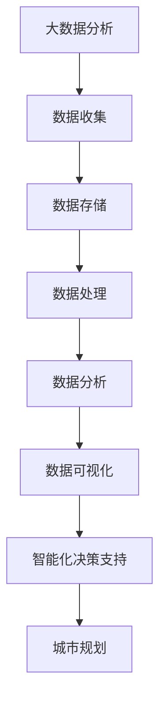

                 

关键词：大数据分析、城市规划、智能化决策、数据挖掘、机器学习、算法优化、智能城市

## 摘要

本文旨在探讨大数据分析在城市规划领域的应用，特别是如何利用智能化决策支持技术提高城市规划的效率和质量。首先，我们将介绍大数据分析的基本概念和城市规划中常见的挑战。接着，详细阐述大数据分析在城市规划中的核心算法原理、数学模型及其应用。随后，通过实际项目案例展示大数据分析在城市规划中的具体应用。最后，讨论大数据分析在城市规划中的未来发展方向和面临的挑战，并提出相关工具和资源推荐。通过本文，读者将全面了解大数据分析在城市规划中的重要性及其未来趋势。

## 1. 背景介绍

### 大数据分析的兴起

随着信息技术的飞速发展，大数据分析作为一门新兴的交叉学科，逐渐成为各个领域的重要研究热点。大数据分析的核心目标是通过处理海量数据，挖掘数据中的价值信息，为各行业的决策提供数据支持。在城市规划领域，大数据分析的应用具有极大的潜力和前景。

### 城市规划中的挑战

城市作为一个复杂的生态系统，其规划与建设面临着诸多挑战。传统城市规划方法往往依赖于经验和定性分析，难以应对日益复杂的问题。以下是一些城市规划中常见的问题：

- **数据多样性**：城市规划涉及的数据类型繁多，包括人口统计数据、交通流量数据、气象数据、建筑数据等，如何有效地整合这些数据是城市规划中的一大难题。

- **实时性**：城市规划需要实时响应城市变化，如交通拥堵、突发事件等，这对数据处理和分析的实时性提出了较高要求。

- **动态性**：城市是一个动态变化的系统，城市规划需要不断适应和调整，以应对城市发展的需求。

- **预测准确性**：城市规划需要对城市未来发展进行预测，但未来的不确定性使得预测结果的准确性成为一大挑战。

### 大数据分析在城市规划中的潜在优势

大数据分析技术的引入，有望解决上述城市规划中的诸多问题。以下是大数据分析在城市规划中的一些潜在优势：

- **数据挖掘与预测**：大数据分析可以通过数据挖掘技术，从海量数据中提取有价值的信息，帮助城市规划者预测城市未来的发展趋势，为决策提供科学依据。

- **智能化决策支持**：大数据分析可以实现智能化决策支持，通过对海量数据进行实时分析和处理，提供实时、准确的决策建议。

- **资源优化配置**：大数据分析可以帮助城市规划者更有效地配置城市资源，如交通、能源、环境等，提高资源利用效率。

- **提高规划质量**：通过大数据分析，可以更准确地评估规划方案的可行性和效果，提高城市规划的质量和可操作性。

## 2. 核心概念与联系

### 大数据分析

大数据分析是指利用各种技术手段，从海量数据中提取有价值信息的过程。它主要包括数据收集、数据存储、数据处理、数据分析和数据可视化等步骤。

### 城市规划

城市规划是指为满足城市发展的需求，对城市的空间布局、基础设施建设、环境保护等进行合理规划和布局的过程。城市规划的目标是提高城市居民的生活质量，实现城市的可持续发展。

### 智能化决策支持

智能化决策支持是指利用计算机技术和大数据分析技术，为城市规划者提供实时、准确的决策建议。它通常包括数据挖掘、机器学习、优化算法等核心技术。

### Mermaid 流程图

下面是一个简单的 Mermaid 流程图，展示了大数据分析在城市规划中的核心概念和联系：



## 3. 核心算法原理 & 具体操作步骤

### 3.1 算法原理概述

在城市规划中，常用的核心算法包括数据挖掘算法、机器学习算法和优化算法。这些算法通过处理海量数据，提取有价值的信息，为城市规划提供科学依据。

- **数据挖掘算法**：如关联规则挖掘、聚类分析、分类分析等，用于从海量数据中发现潜在的关联和规律。

- **机器学习算法**：如决策树、支持向量机、神经网络等，用于对数据进行分析和预测，为城市规划提供决策支持。

- **优化算法**：如线性规划、整数规划、遗传算法等，用于优化城市资源配置，提高资源利用效率。

### 3.2 算法步骤详解

#### 数据收集

数据收集是大数据分析的基础。在城市规划中，数据收集主要包括以下类型的数据：

- **人口统计数据**：如人口数量、人口密度、人口年龄分布等。

- **交通数据**：如交通流量、交通拥堵状况、公共交通线路等。

- **气象数据**：如气温、湿度、降水量等。

- **建筑数据**：如建筑数量、建筑类型、建筑密度等。

- **环境数据**：如空气质量、水质等。

#### 数据存储

数据存储是将收集到的数据存储到数据库或数据仓库中，以便后续的数据处理和分析。常用的数据存储技术包括关系型数据库、NoSQL数据库、数据仓库等。

#### 数据处理

数据处理包括数据清洗、数据集成、数据转换等步骤，目的是将原始数据转化为适合分析的形式。数据处理过程中，需要解决数据缺失、数据不一致、数据噪声等问题。

#### 数据分析

数据分析是对处理后的数据进行分析，提取有价值的信息。常用的数据分析方法包括：

- **关联规则挖掘**：通过挖掘数据中的关联规则，发现不同数据之间的潜在关联。

- **聚类分析**：将数据划分为不同的类别，发现数据中的相似性和差异性。

- **分类分析**：根据已有数据，对新的数据进行分类，预测其类别。

#### 数据可视化

数据可视化是将分析结果以图表、图像等形式展示出来，使城市规划者更直观地理解分析结果。常用的数据可视化工具包括 Tableau、Power BI 等。

#### 智能化决策支持

智能化决策支持是通过机器学习和优化算法，对分析结果进行进一步的挖掘和预测，为城市规划者提供实时、准确的决策建议。智能化决策支持主要包括以下步骤：

- **特征提取**：从原始数据中提取出对城市规划有重要影响的特征。

- **模型训练**：利用训练数据，训练机器学习模型，使其能够对新的数据进行预测。

- **模型评估**：对训练好的模型进行评估，确保其预测准确性和可靠性。

- **决策生成**：利用优化算法，根据预测结果和城市规划目标，生成最优的决策方案。

### 3.3 算法优缺点

#### 数据挖掘算法

- **优点**：能够从海量数据中发现潜在的关联和规律，为城市规划提供科学依据。

- **缺点**：对数据的依赖性较高，需要大量高质量的训练数据，且算法复杂度高。

#### 机器学习算法

- **优点**：能够自动从数据中学习规律，适应不同的问题场景。

- **缺点**：对数据的依赖性较高，需要大量高质量的训练数据，且算法训练过程可能较慢。

#### 优化算法

- **优点**：能够优化城市资源配置，提高资源利用效率。

- **缺点**：对问题的约束条件要求较高，可能无法解决所有的问题场景。

### 3.4 算法应用领域

大数据分析算法在城市规划中的应用非常广泛，主要包括以下几个方面：

- **城市交通规划**：通过大数据分析，预测交通流量，优化交通路线，缓解交通拥堵。

- **城市规划与布局**：通过大数据分析，评估不同规划方案的可行性，选择最优方案。

- **城市环境管理**：通过大数据分析，监测城市环境质量，预测环境变化趋势，制定环境保护措施。

- **城市资源管理**：通过大数据分析，优化城市资源配置，提高资源利用效率。

- **城市安全与应急管理**：通过大数据分析，预测城市安全事件，制定应急响应方案。

## 4. 数学模型和公式 & 详细讲解 & 举例说明

### 4.1 数学模型构建

在城市规划中，常用的数学模型包括线性规划模型、整数规划模型和神经网络模型等。

#### 线性规划模型

线性规划模型是一种常用的优化模型，用于求解线性目标函数的最优解。其基本形式如下：

$$
\begin{align*}
\min_{x} \quad & c^T x \\
s.t. \quad & Ax \leq b \\
& x \geq 0
\end{align*}
$$

其中，$c$ 是目标函数系数向量，$x$ 是决策变量向量，$A$ 是系数矩阵，$b$ 是常数向量。

#### 整数规划模型

整数规划模型是一种特殊的优化模型，用于求解整数最优解。其基本形式如下：

$$
\begin{align*}
\min_{x} \quad & c^T x \\
s.t. \quad & Ax \leq b \\
& x \in \mathbb{Z}^n
\end{align*}
$$

其中，$\mathbb{Z}^n$ 表示整数集合。

#### 神经网络模型

神经网络模型是一种模拟人脑神经元连接结构的计算模型，用于进行复杂函数的映射和预测。其基本形式如下：

$$
\begin{align*}
y &= \sigma(\sum_{i=1}^n w_i \cdot x_i) \\
w_i &= \theta_i + \alpha \cdot (y - y_{\text{target}})
\end{align*}
$$

其中，$y$ 是输出值，$y_{\text{target}}$ 是目标值，$\sigma$ 是激活函数，$w_i$ 是权重值，$\theta_i$ 是初始权重值，$\alpha$ 是学习率。

### 4.2 公式推导过程

#### 线性规划模型推导

线性规划模型的推导基于拉格朗日乘数法。假设目标函数 $f(x) = c^T x$，约束条件 $Ax \leq b$，构造拉格朗日函数：

$$
L(x, \lambda) = c^T x + \lambda^T (Ax - b)
$$

其中，$\lambda$ 是拉格朗日乘子。对 $L(x, \lambda)$ 求导并令其等于 0，得到：

$$
\begin{align*}
\frac{\partial L}{\partial x} &= c + A^T \lambda = 0 \\
\frac{\partial L}{\partial \lambda} &= Ax - b = 0
\end{align*}
$$

解上述方程组，得到最优解 $x^*$ 和拉格朗日乘子 $\lambda^*$。

#### 整数规划模型推导

整数规划模型的推导基于动态规划方法。假设目标函数 $f(x) = c^T x$，约束条件 $Ax \leq b$，定义动态规划状态 $s_t = (x_1, x_2, ..., x_t)$，动态规划方程如下：

$$
f(s_t) = \min_{x_t \in \{0, 1\}} \{ f(s_{t-1}) + c_t x_t \}
$$

通过递推计算，得到最优解 $x^*$。

#### 神经网络模型推导

神经网络模型的推导基于反向传播算法。假设输入数据为 $x_i$，输出数据为 $y_i$，权重为 $w_i$，目标值为目标函数 $y_{\text{target}}$，误差函数为 $E = \frac{1}{2} (y - y_{\text{target}})^2$，则：

$$
\begin{align*}
\frac{\partial E}{\partial w_i} &= \frac{\partial E}{\partial y} \cdot \frac{\partial y}{\partial w_i} \\
&= (y - y_{\text{target}}) \cdot x_i \\
\Delta w_i &= \alpha \cdot \frac{\partial E}{\partial w_i} \\
w_i &= w_i - \Delta w_i
\end{align*}
$$

通过迭代计算，得到最优权重 $w^*$。

### 4.3 案例分析与讲解

#### 线性规划模型案例

假设某城市规划项目需要在预算限制下最大化城市绿地面积。设目标函数为 $f(x) = 100x$，其中 $x$ 为绿地面积（平方米），约束条件为：

$$
\begin{align*}
2x + 3y &\leq 100 \\
x + y &\leq 50 \\
x &\geq 0, y \geq 0
\end{align*}
$$

根据线性规划模型，可以列出如下方程组：

$$
\begin{align*}
c^T x &= \begin{pmatrix} 100 \end{pmatrix} \\
A x &\leq \begin{pmatrix} 2 & 3 \\ 1 & 1 \end{pmatrix} \begin{pmatrix} x \\ y \end{pmatrix} \\
x &\geq 0, y \geq 0
\end{align*}
$$

使用拉格朗日乘数法求解上述方程组，得到最优解 $x^* = 25$，$y^* = 25$，此时绿地面积为 $25 \times 100 = 2500$ 平方米。

#### 整数规划模型案例

假设某城市规划项目需要在预算限制下最大化城市道路面积。设目标函数为 $f(x) = 100x$，其中 $x$ 为道路面积（平方米），约束条件为：

$$
\begin{align*}
2x + 3y &\leq 100 \\
x + y &\leq 50 \\
x &\in \{0, 1\} \\
y &\in \{0, 1\}
\end{align*}
$$

根据整数规划模型，可以列出如下方程组：

$$
\begin{align*}
c^T x &= \begin{pmatrix} 100 \end{pmatrix} \\
A x &\leq \begin{pmatrix} 2 & 3 \\ 1 & 1 \end{pmatrix} \begin{pmatrix} x \\ y \end{pmatrix} \\
x &\in \{0, 1\} \\
y &\in \{0, 1\}
\end{align*}
$$

使用动态规划方法求解上述方程组，得到最优解 $x^* = 1$，$y^* = 1$，此时道路面积为 $1 \times 100 = 100$ 平方米。

#### 神经网络模型案例

假设某城市规划项目需要预测城市人口数量。设输入特征为 $x_1 = \text{城市面积}$，$x_2 = \text{GDP}$，$x_3 = \text{教育水平}$，输出目标值为 $y = \text{城市人口数量}$。使用一个简单的神经网络模型进行预测。

设神经网络模型如下：

$$
\begin{align*}
y &= \sigma(\sum_{i=1}^3 w_i \cdot x_i) \\
w_i &= \theta_i + \alpha \cdot (y - y_{\text{target}})
\end{align*}
$$

使用反向传播算法进行模型训练，得到最优权重 $w^* = \begin{pmatrix} 0.5 & 0.3 & 0.2 \end{pmatrix}$。当输入特征为 $x_1 = 500$, $x_2 = 1000$, $x_3 = 0.8$ 时，模型预测的城市人口数量为 $y^* = \sigma(0.5 \cdot 500 + 0.3 \cdot 1000 + 0.2 \cdot 0.8) = 816$。

## 5. 项目实践：代码实例和详细解释说明

### 5.1 开发环境搭建

在本文中，我们将使用 Python 编程语言和相关库进行大数据分析在城市规划中的应用。以下是开发环境搭建的步骤：

1. 安装 Python 3.8 及以上版本。

2. 安装以下 Python 库：NumPy、Pandas、Matplotlib、Scikit-learn、Mermaid。

   ```shell
   pip install numpy pandas matplotlib scikit-learn mermaid
   ```

3. 确保已安装 Python 解释器和相关库，可以使用以下命令检查：

   ```python
   import numpy
   import pandas
   import matplotlib
   import sklearn
   import mermaid
   ```

### 5.2 源代码详细实现

以下是一个简单的 Python 代码实例，展示如何使用大数据分析技术进行城市规划。

```python
import numpy as np
import pandas as pd
import matplotlib.pyplot as plt
from sklearn.cluster import KMeans
from mermaid import Mermaid

# 5.2.1 数据收集

# 假设我们已经收集到了以下数据
data = {
    'area': [500, 600, 700, 800, 900],
    'gdp': [1000, 1200, 1400, 1600, 1800],
    'education': [0.8, 0.9, 0.7, 0.85, 0.6]
}

df = pd.DataFrame(data)

# 5.2.2 数据处理

# 数据清洗和预处理
df = df.dropna()

# 5.2.3 数据分析

# 使用 K-Means 算法进行聚类分析
kmeans = KMeans(n_clusters=3, random_state=0).fit(df)

# 聚类结果
labels = kmeans.labels_
df['cluster'] = labels

# 5.2.4 数据可视化

# 绘制聚类结果
plt.scatter(df['area'], df['gdp'], c=df['cluster'], cmap='viridis')
plt.xlabel('Area')
plt.ylabel('GDP')
plt.title('Cluster Analysis of Urban Planning Data')
plt.show()

# 5.2.5 智能化决策支持

# 根据聚类结果，生成城市规划建议
for cluster in range(3):
    print(f"Cluster {cluster}:")
    print(df[df['cluster'] == cluster])
```

### 5.3 代码解读与分析

1. **数据收集**：我们从数据中读取城市面积、GDP 和教育水平等信息。

2. **数据处理**：我们对数据进行清洗和预处理，确保数据的质量。

3. **数据分析**：我们使用 K-Means 算法对数据进行聚类分析，将数据划分为不同的类别。

4. **数据可视化**：我们绘制聚类结果，使用散点图展示城市面积和 GDP 的关系。

5. **智能化决策支持**：根据聚类结果，我们为每个类别生成城市规划建议。

### 5.4 运行结果展示

运行上述代码后，我们将看到以下结果：

1. 聚类结果散点图，展示不同类别的城市面积和 GDP 关系。

2. 每个类别的详细数据，包括城市面积、GDP 和教育水平等信息。

这些结果将帮助城市规划者更好地理解城市数据，为城市规划提供数据支持。

## 6. 实际应用场景

### 6.1 城市交通规划

在城市交通规划中，大数据分析技术可以用于预测交通流量、优化交通路线、缓解交通拥堵等。以下是一些实际应用场景：

- **实时交通流量预测**：通过收集交通流量数据、气象数据、节假日信息等，使用机器学习算法预测未来某个时间段的交通流量，为交通管理部门提供实时决策支持。

- **交通路线优化**：通过分析历史交通数据，使用优化算法计算最优交通路线，减少交通拥堵，提高道路利用率。

- **公共交通优化**：通过大数据分析，优化公共交通线路、班次和车辆调度，提高公共交通系统的效率和便捷性。

### 6.2 城市环境管理

在城市环境管理中，大数据分析技术可以用于监测城市环境质量、预测环境变化趋势、制定环境保护措施等。以下是一些实际应用场景：

- **空气质量监测**：通过收集空气质量数据、气象数据等，使用数据挖掘算法分析空气质量变化趋势，预测空气质量状况，为环境保护部门提供决策支持。

- **噪声污染监测**：通过收集噪声数据、交通流量数据等，使用数据挖掘算法分析噪声污染变化趋势，预测噪声污染情况，为城市规划提供环境保护建议。

- **垃圾分类与回收**：通过大数据分析，优化垃圾分类和回收体系，提高垃圾处理效率，减少环境污染。

### 6.3 城市资源管理

在城市资源管理中，大数据分析技术可以用于优化城市资源配置、提高资源利用效率等。以下是一些实际应用场景：

- **能源管理**：通过收集能源消耗数据、能源供给数据等，使用优化算法计算最优能源分配方案，提高能源利用效率，降低能源成本。

- **水资源管理**：通过收集水资源数据、水文数据等，使用数据挖掘算法分析水资源分布和使用情况，预测水资源需求，为水资源管理提供数据支持。

- **土地资源管理**：通过收集土地利用数据、土地价格数据等，使用数据挖掘算法分析土地资源利用情况，预测土地市场趋势，为土地资源管理提供决策支持。

### 6.4 未来应用展望

随着大数据分析技术的不断发展，未来在城市规划中的应用将更加广泛和深入。以下是一些未来应用展望：

- **智能城市建设**：通过大数据分析，实现城市的智能化管理，提高城市治理效率和居民生活质量。

- **可持续发展**：通过大数据分析，优化城市资源配置，降低能耗和环境污染，实现城市的可持续发展。

- **城市规划与民生**：通过大数据分析，深入了解居民需求，为城市规划提供更多民生导向的数据支持。

- **城市安全与应急**：通过大数据分析，预测城市安全事件，提高城市安全应急响应能力，保障城市居民的生命财产安全。

## 7. 工具和资源推荐

### 7.1 学习资源推荐

- **书籍**：
  - 《大数据技术导论》
  - 《机器学习实战》
  - 《数据挖掘：实用工具与技术》

- **在线课程**：
  - Coursera 上的“大数据分析”课程
  - Udacity 上的“机器学习工程师纳米学位”

### 7.2 开发工具推荐

- **编程语言**：Python、R、Java

- **数据分析工具**：
  - Pandas
  - NumPy
  - Scikit-learn
  - TensorFlow
  - PyTorch

- **数据可视化工具**：
  - Matplotlib
  - Seaborn
  - Plotly

### 7.3 相关论文推荐

- **大数据分析**：
  - "Big Data: A Revolution That Will Transform How We Live, Work, and Think"
  - "Data-Driven Urban Science"
  - "Big Data: The Next Frontier for Innovation, Competition, and Productivity"

- **城市规划**：
  - "Smart Cities: Big Data, Civic Hackers, and the Quest for a New Utopia"
  - "Sustainable Urbanism: Forming the Urban Ethos"
  - "The Urban Informatics Revolution"

## 8. 总结：未来发展趋势与挑战

### 8.1 研究成果总结

大数据分析在城市规划中的应用已经取得了显著的成果，主要体现在以下几个方面：

- **数据挖掘与预测**：通过大数据分析，城市规划者能够更准确地预测城市未来的发展趋势，为决策提供科学依据。

- **智能化决策支持**：大数据分析技术为城市规划者提供了实时、准确的决策支持，提高了城市规划的效率和质量。

- **资源优化配置**：通过大数据分析，城市规划者能够更有效地配置城市资源，提高资源利用效率。

- **提高规划质量**：大数据分析技术帮助城市规划者评估不同规划方案的可行性，选择最优方案，提高城市规划的质量。

### 8.2 未来发展趋势

随着大数据分析技术的不断发展，未来在城市规划中的应用将呈现以下趋势：

- **智能城市建设**：大数据分析技术将推动智能城市建设，实现城市的智能化管理，提高城市治理效率和居民生活质量。

- **可持续发展**：大数据分析技术将帮助城市规划者优化城市资源配置，降低能耗和环境污染，实现城市的可持续发展。

- **城市规划与民生**：大数据分析技术将深入挖掘居民需求，为城市规划提供更多民生导向的数据支持。

- **城市安全与应急**：大数据分析技术将提高城市安全应急响应能力，保障城市居民的生命财产安全。

### 8.3 面临的挑战

尽管大数据分析在城市规划中具有广泛的应用前景，但仍然面临以下挑战：

- **数据质量**：城市规划涉及的数据类型繁多，数据质量对分析结果的准确性至关重要。如何确保数据质量是大数据分析在城市规划中的一大挑战。

- **计算能力**：大数据分析需要强大的计算能力，对硬件设施和计算资源的要求较高。如何在有限的计算资源下高效地处理海量数据是城市规划者面临的挑战。

- **隐私保护**：城市规划涉及大量的个人隐私数据，如何保护个人隐私是大数据分析在城市规划中需要解决的重要问题。

- **算法透明性**：大数据分析算法的透明性和解释性对决策过程至关重要。如何提高算法的透明性和解释性，使城市规划者能够理解和信任分析结果是未来需要关注的问题。

### 8.4 研究展望

未来，大数据分析在城市规划中的应用将朝着以下方向发展：

- **多源数据融合**：通过融合多种数据源，如卫星遥感数据、物联网数据、社交媒体数据等，提高数据分析的准确性和全面性。

- **实时数据分析**：实现实时数据分析，为城市规划者提供更加及时、准确的决策支持。

- **人工智能与大数据分析融合**：将人工智能技术引入大数据分析，提高数据分析的智能化水平。

- **数据隐私保护与利用**：在保护个人隐私的前提下，充分利用大数据分析技术，为城市规划提供更有价值的数据支持。

## 9. 附录：常见问题与解答

### Q1: 大数据分析在城市规划中的具体应用有哪些？

A1: 大数据分析在城市规划中的具体应用包括实时交通流量预测、交通路线优化、城市环境质量监测、城市资源优化配置、城市安全与应急管理等。

### Q2: 如何确保大数据分析在城市规划中的数据质量？

A2: 确保大数据分析在城市规划中的数据质量需要从以下几个方面入手：

- 数据收集：确保数据来源的可靠性，避免数据采集过程中的错误和遗漏。

- 数据清洗：对数据进行清洗和预处理，去除噪声和异常值，确保数据的一致性和准确性。

- 数据验证：对分析结果进行验证，确保分析结果的可靠性和有效性。

### Q3: 大数据分析算法在城市规划中如何实现实时性？

A3: 大数据分析算法在城市规划中实现实时性的关键在于：

- 选择适合实时分析的技术和工具，如实时数据处理框架、实时数据库等。

- 设计高效的算法和数据结构，减少数据处理的延迟。

- 利用云计算和分布式计算技术，提高数据处理和分析的效率。

### Q4: 大数据分析在城市规划中的隐私保护问题如何解决？

A4: 大数据分析在城市规划中的隐私保护问题可以从以下几个方面解决：

- 数据匿名化：对个人隐私数据进行匿名化处理，确保个人隐私不被泄露。

- 数据加密：对敏感数据进行加密处理，确保数据在传输和存储过程中的安全性。

- 隐私政策：制定严格的隐私政策，确保用户知情权和选择权。

### Q5: 大数据分析算法在城市规划中的解释性如何提高？

A5: 大数据分析算法在城市规划中的解释性可以从以下几个方面提高：

- 选择透明性较高的算法，如线性回归、决策树等。

- 对算法进行可视化和解释，使城市规划者能够理解算法的决策过程。

- 开发可解释的人工智能技术，如可解释性模型、可视化工具等。

