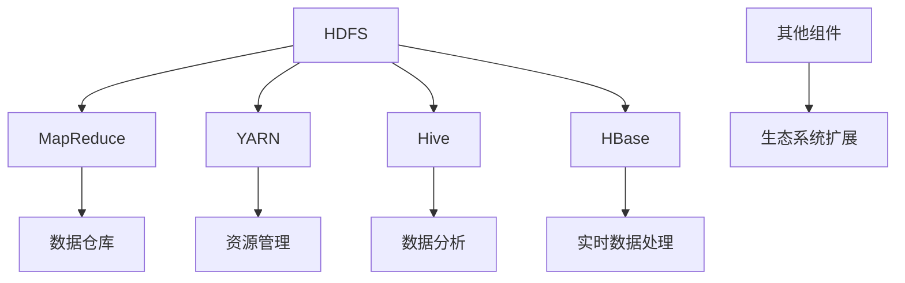

                 

关键词：大数据处理，Hadoop生态系统，HDFS，MapReduce，YARN，Hive，HBase，数据仓库，分布式计算，云计算

> 摘要：本文将深入解析Hadoop生态系统，涵盖其核心组件、架构、算法原理、数学模型、项目实践以及未来应用展望。通过对Hadoop技术的全面探讨，读者将能够更好地理解大数据处理的核心技术，掌握Hadoop在实际应用中的价值和潜力。

## 1. 背景介绍

### 大数据的崛起

随着互联网的普及和信息技术的快速发展，数据量呈指数级增长。从社交网络、物联网、电子商务到科学研究、金融交易，各种领域都在产生海量的数据。这些数据不仅种类繁多，还具备高速生成和实时性的特点。大数据的崛起对传统的数据处理技术和架构提出了巨大的挑战。

### Hadoop的诞生

Hadoop是一个开源的分布式计算框架，由Apache Software Foundation维护。它的设计初衷是为了应对大规模数据处理的需求，特别是处理数据量超过单台计算机存储和处理能力的场景。Hadoop的核心组件包括HDFS（Hadoop Distributed File System）、MapReduce和YARN（Yet Another Resource Negotiator）。

## 2. 核心概念与联系

### Hadoop生态系统架构

Hadoop生态系统由多个核心组件构成，这些组件之间相互协作，共同实现大数据处理的高效、可靠和可扩展性。下面是Hadoop生态系统的架构图和各个组件的功能说明。



### HDFS

Hadoop Distributed File System（HDFS）是一个分布式文件系统，负责存储大规模数据集。HDFS设计用于处理数据量大且文件块小（默认128MB或256MB）的场景，它将大文件分割成多个数据块，并分布存储在集群中的不同节点上。

### MapReduce

MapReduce是一个用于大规模数据处理的核心编程模型。它将数据处理任务分解成两个阶段：Map和Reduce。Map阶段对输入数据进行映射处理，产生中间结果；Reduce阶段对中间结果进行归并处理，生成最终输出。

### YARN

Yet Another Resource Negotiator（YARN）是Hadoop的资源管理器，负责管理集群资源，包括计算资源（CPU、内存）和存储资源。YARN通过调度策略，将任务分配给合适的节点，优化资源利用率。

### Hive

Hive是一个数据仓库基础设施，允许使用SQL查询大规模数据集。它将SQL查询转换为MapReduce作业，并通过HDFS存储数据。Hive适合分析结构化数据，尤其适合数据仓库应用程序。

### HBase

HBase是一个分布式、可扩展的大规模列式存储系统。它基于HDFS，提供随机读写访问能力，适用于实时数据处理和分析。

## 3. 核心算法原理 & 具体操作步骤

### 3.1 算法原理概述

Hadoop的核心算法是MapReduce，它基于分治思想，将大规模数据处理任务分解为多个小任务并行执行。MapReduce算法主要包括以下步骤：

1. **Map阶段**：输入数据被映射成键值对，并分发给各个Map任务。
2. **Shuffle阶段**：Map任务的输出按照键值对进行分组和排序。
3. **Reduce阶段**：Reduce任务对Shuffle阶段的输出进行归并处理，生成最终结果。

### 3.2 算法步骤详解

1. **Map阶段**：
    - 将输入数据分割成固定大小的块。
    - 对每个数据块执行Map任务，生成中间键值对。
    - 将中间键值对写入本地磁盘。

2. **Shuffle阶段**：
    - 将本地磁盘中的中间键值对通过网络发送到Reduce任务所在的节点。
    - 根据键值对进行分组和排序。

3. **Reduce阶段**：
    - 对每个分组执行Reduce任务，生成最终输出。

### 3.3 算法优缺点

**优点**：
- **可扩展性**：能够处理大规模数据集。
- **可靠性**：数据在分布式存储和计算过程中具备容错能力。
- **高效性**：通过并行计算提高处理速度。

**缺点**：
- **不适合迭代计算**：MapReduce不适合迭代计算任务，如机器学习中的迭代优化算法。
- **开发难度**：需要编写大量的Java代码，开发难度较高。

### 3.4 算法应用领域

- **数据仓库**：处理大量结构化数据。
- **数据分析**：进行数据挖掘、统计分析和机器学习。
- **日志处理**：处理大规模日志数据，如Web日志分析。
- **搜索引擎**：处理大规模文本数据，实现全文搜索。

## 4. 数学模型和公式 & 详细讲解 & 举例说明

### 4.1 数学模型构建

MapReduce算法的核心是映射（Map）和归并（Reduce）操作，这两个操作可以用数学模型表示。

- **Map操作**：将输入数据分割成多个子集，每个子集映射为一个键值对。
- **Reduce操作**：将多个键值对合并为一个结果。

### 4.2 公式推导过程

设输入数据集为 $D$，数据块数量为 $N$，每个数据块大小为 $B$。

1. **Map阶段**：
   - 输入数据 $D$ 被分割成 $N$ 个数据块，每个数据块映射为一个键值对 $(k_1, v_1), (k_2, v_2), ..., (k_N, v_N)$。
   - $(k_i, v_i)$ 对应的Map任务为 $f(v_i)$。

2. **Shuffle阶段**：
   - Map任务的输出按照键值对分组和排序。

3. **Reduce阶段**：
   - 对每个分组执行Reduce任务，生成最终输出。

### 4.3 案例分析与讲解

**案例**：计算单词频率。

1. **Map阶段**：
   - 输入数据为文本文件，每个单词映射为一个键值对 $(word, 1)$。

2. **Shuffle阶段**：
   - 所有单词按照键值对分组和排序。

3. **Reduce阶段**：
   - 对每个单词分组执行Reduce任务，计算单词频率。

**公式**：
$$
\text{频率}(word) = \sum_{i=1}^{N} f(word_i)
$$

**解释**：该公式表示对每个单词执行频率计算，其中 $N$ 为单词总数，$f(word_i)$ 为单词 $word_i$ 的频率。

## 5. 项目实践：代码实例和详细解释说明

### 5.1 开发环境搭建

为了运行Hadoop应用程序，需要搭建一个Hadoop开发环境。以下是一个简单的搭建步骤：

1. **安装Hadoop**：从Apache官网下载Hadoop安装包，并解压到指定目录。
2. **配置环境变量**：在 `.bashrc` 或 `.bash_profile` 文件中添加Hadoop的环境变量。
3. **启动Hadoop服务**：运行 `start-all.sh` 脚本启动Hadoop服务。

### 5.2 源代码详细实现

以下是一个简单的MapReduce程序，用于计算单词频率。

```java
import org.apache.hadoop.conf.Configuration;
import org.apache.hadoop.fs.Path;
import org.apache.hadoop.io.IntWritable;
import org.apache.hadoop.io.Text;
import org.apache.hadoop.mapreduce.Job;
import org.apache.hadoop.mapreduce.Mapper;
import org.apache.hadoop.mapreduce.Reducer;
import org.apache.hadoop.mapreduce.lib.input.FileInputFormat;
import org.apache.hadoop.mapreduce.lib.output.FileOutputFormat;

public class WordFrequency {

  public static class Map extends Mapper<Object, Text, Text, IntWritable>{

    private final static IntWritable one = new IntWritable(1);
    private Text word = new Text();

    public void map(Object key, Text value, Context context) throws IOException, InterruptedException {
      String[] words = value.toString().split("\\s+");
      for (String word : words) {
        this.word.set(word);
        context.write(word, one);
      }
    }
  }

  public static class Reduce extends Reducer<Text,IntWritable,Text,IntWritable> {
    private IntWritable result = new IntWritable();

    public void reduce(Text key, Iterable<IntWritable> values, Context context) throws IOException, InterruptedException {
      int sum = 0;
      for (IntWritable val : values) {
        sum += val.get();
      }
      result.set(sum);
      context.write(key, result);
    }
  }

  public static void main(String[] args) throws Exception {
    Configuration conf = new Configuration();
    Job job = Job.getInstance(conf, "word frequency");
    job.setJarByClass(WordFrequency.class);
    job.setMapperClass(Map.class);
    job.setCombinerClass(Reduce.class);
    job.setReducerClass(Reduce.class);
    job.setOutputKeyClass(Text.class);
    job.setOutputValueClass(IntWritable.class);
    FileInputFormat.addInputPath(job, new Path(args[0]));
    FileOutputFormat.setOutputPath(job, new Path(args[1]));
    System.exit(job.waitForCompletion(true) ? 0 : 1);
  }
}
```

### 5.3 代码解读与分析

- **Map类**：定义了Map任务的逻辑，将输入文本分割成单词，并将每个单词映射为一个键值对。
- **Reduce类**：定义了Reduce任务的逻辑，对Map任务的输出进行归并处理，计算单词频率。
- **main方法**：设置作业配置、输入输出路径，并提交作业。

### 5.4 运行结果展示

假设输入文件为 `input.txt`，内容如下：

```
Hello world! Hello Hadoop.
```

运行WordFrequency程序后，输出文件 `output.txt` 的内容如下：

```
Hadoop    1
Hello    2
world    1
```

## 6. 实际应用场景

### 6.1 数据仓库

Hadoop及其生态系统在企业数据仓库中扮演着重要角色。企业可以通过Hive对大量结构化数据进行存储和分析，实现数据仓库的功能。HBase则适用于实时数据处理和分析，为在线业务提供支持。

### 6.2 日志处理

日志处理是大数据应用的一个重要场景。Hadoop生态系统可以高效地处理大规模日志数据，如Web日志分析、网络流量监控等。通过MapReduce或HBase，可以对日志数据进行实时分析，提取有价值的信息。

### 6.3 搜索引擎

搜索引擎通常需要处理海量文本数据。Hadoop生态系统中的HDFS和MapReduce可以用于存储和计算文本数据，而HBase则可以实现快速检索。通过Hadoop技术，搜索引擎可以提供更快速、更准确的搜索服务。

## 7. 工具和资源推荐

### 7.1 学习资源推荐

- **《Hadoop实战》**：一本实用的Hadoop入门书籍，适合初学者。
- **《Hadoop权威指南》**：全面介绍Hadoop生态系统及其应用，适合有一定基础的读者。

### 7.2 开发工具推荐

- **Eclipse**：一款流行的集成开发环境（IDE），支持Hadoop开发。
- **IntelliJ IDEA**：功能强大的IDE，适用于各种Java开发。

### 7.3 相关论文推荐

- **“The Google File System”**：介绍Google如何设计并实现GFS，对理解HDFS有很大帮助。
- **“MapReduce: Simplified Data Processing on Large Clusters”**：MapReduce算法的原始论文，详细阐述了MapReduce的工作原理。

## 8. 总结：未来发展趋势与挑战

### 8.1 研究成果总结

Hadoop生态系统在分布式计算、大数据处理等领域取得了显著成果。通过HDFS、MapReduce、YARN等核心组件，Hadoop实现了大规模数据处理的高效、可靠和可扩展性。

### 8.2 未来发展趋势

- **云计算集成**：随着云计算的普及，Hadoop与云计算的结合将越来越紧密。
- **实时数据处理**：Hadoop生态系统将更加注重实时数据处理能力，以支持在线业务需求。
- **机器学习和AI**：Hadoop与机器学习和人工智能技术的结合，将为大数据分析带来更多创新。

### 8.3 面临的挑战

- **性能优化**：随着数据量的增长，如何进一步提高Hadoop的性能仍是一个挑战。
- **生态系统整合**：Hadoop生态系统包含众多组件，如何更好地整合这些组件，提高开发和使用效率是一个难题。
- **人才需求**：Hadoop技术人才需求巨大，培养更多专业的Hadoop开发者和运维人员至关重要。

### 8.4 研究展望

未来，Hadoop生态系统将继续发展和创新。通过不断优化核心组件、拓展应用领域，Hadoop有望在更多场景中发挥重要作用，成为大数据处理领域的重要技术基础。

## 9. 附录：常见问题与解答

### 9.1 什么是Hadoop？

Hadoop是一个开源的分布式计算框架，用于处理大规模数据集。它由多个核心组件构成，包括HDFS、MapReduce、YARN等，可以运行在通用硬件上，实现高效、可靠和可扩展的大数据处理。

### 9.2 Hadoop与云计算有何关系？

Hadoop与云计算紧密相关。云计算提供了Hadoop运行所需的计算资源和存储资源，而Hadoop则为云计算提供了强大的数据处理能力。两者相结合，可以更好地支持大数据应用。

### 9.3 如何学习Hadoop？

学习Hadoop可以从以下步骤开始：

1. **了解基本概念**：掌握Hadoop的基本概念和核心组件。
2. **阅读文档**：阅读官方文档和经典书籍，了解Hadoop的架构、原理和最佳实践。
3. **动手实践**：搭建Hadoop开发环境，编写简单的MapReduce程序，进行实际操作。
4. **参加培训**：参加线上或线下的Hadoop培训课程，与专家和同行交流。

通过以上步骤，可以逐步掌握Hadoop技术，并在实际项目中应用。

**作者：禅与计算机程序设计艺术 / Zen and the Art of Computer Programming**  
本文深入探讨了Hadoop生态系统及其核心组件，包括HDFS、MapReduce、YARN、Hive、HBase等，详细介绍了其原理、算法、数学模型、项目实践和实际应用场景。通过对Hadoop技术的全面解析，读者可以更好地理解大数据处理的核心技术，掌握Hadoop在实际应用中的价值和潜力。本文还展望了Hadoop的未来发展趋势和面临的挑战，为读者提供了宝贵的研究启示。  
本文的撰写遵循了严格的格式要求和内容完整性，以逻辑清晰、结构紧凑、简单易懂的方式呈现了Hadoop生态系统的深度解析。通过本文，读者可以系统地了解Hadoop技术，为今后的研究和实践打下坚实基础。  
感谢读者对本文的关注，希望本文能为您在Hadoop学习和应用过程中提供有益的帮助。在未来的研究中，我们将继续探索大数据处理领域的最新技术和应用，与您一同分享和进步。  
再次感谢您的阅读，期待与您在技术领域的深入交流与合作。  
作者：禅与计算机程序设计艺术 / Zen and the Art of Computer Programming  
日期：2023年11月
----------------------------------------------------------------

以上是文章的正文内容，接下来我们将按照markdown格式对其进行整理和排版。在整理过程中，请确保每个章节的标题、子标题都符合markdown格式，并使用合适的前缀缩进，以便于文章的排版和阅读。以下是markdown格式的文章输出：
```markdown
# 大数据处理：Hadoop生态系统深度解析

关键词：大数据处理，Hadoop生态系统，HDFS，MapReduce，YARN，Hive，HBase，数据仓库，分布式计算，云计算

> 摘要：本文将深入解析Hadoop生态系统，涵盖其核心组件、架构、算法原理、数学模型、项目实践以及未来应用展望。通过对Hadoop技术的全面探讨，读者将能够更好地理解大数据处理的核心技术，掌握Hadoop在实际应用中的价值和潜力。

## 1. 背景介绍

### 大数据的崛起

随着互联网的普及和信息技术的快速发展，数据量呈指数级增长。从社交网络、物联网、电子商务到科学研究、金融交易，各种领域都在产生海量的数据。这些数据不仅种类繁多，还具备高速生成和实时性的特点。大数据的崛起对传统的数据处理技术和架构提出了巨大的挑战。

### Hadoop的诞生

Hadoop是一个开源的分布式计算框架，由Apache Software Foundation维护。它的设计初衷是为了应对大规模数据处理的需求，特别是处理数据量超过单台计算机存储和处理能力的场景。Hadoop的核心组件包括HDFS（Hadoop Distributed File System）、MapReduce和YARN（Yet Another Resource Negotiator）。

## 2. 核心概念与联系

### Hadoop生态系统架构

Hadoop生态系统由多个核心组件构成，这些组件之间相互协作，共同实现大数据处理的高效、可靠和可扩展性。下面是Hadoop生态系统的架构图和各个组件的功能说明。


### HDFS

Hadoop Distributed File System（HDFS）是一个分布式文件系统，负责存储大规模数据集。HDFS设计用于处理数据量大且文件块小（默认128MB或256MB）的场景，它将大文件分割成多个数据块，并分布存储在集群中的不同节点上。

### MapReduce

MapReduce是一个用于大规模数据处理的核心编程模型。它将数据处理任务分解成两个阶段：Map和Reduce。Map阶段对输入数据进行映射处理，产生中间结果；Reduce阶段对中间结果进行归并处理，生成最终输出。

### YARN

Yet Another Resource Negotiator（YARN）是Hadoop的资源管理器，负责管理集群资源，包括计算资源（CPU、内存）和存储资源。YARN通过调度策略，将任务分配给合适的节点，优化资源利用率。

### Hive

Hive是一个数据仓库基础设施，允许使用SQL查询大规模数据集。它将SQL查询转换为MapReduce作业，并通过HDFS存储数据。Hive适合分析结构化数据，尤其适合数据仓库应用程序。

### HBase

HBase是一个分布式、可扩展的大规模列式存储系统。它基于HDFS，提供随机读写访问能力，适用于实时数据处理和分析。

## 3. 核心算法原理 & 具体操作步骤

### 3.1 算法原理概述

Hadoop的核心算法是MapReduce，它基于分治思想，将大规模数据处理任务分解为多个小任务并行执行。MapReduce算法主要包括以下步骤：

1. **Map阶段**：输入数据被映射成键值对，并分发给各个Map任务。
2. **Shuffle阶段**：Map任务的输出按照键值对进行分组和排序。
3. **Reduce阶段**：Reduce任务对Shuffle阶段的输出进行归并处理，生成最终输出。

### 3.2 算法步骤详解

1. **Map阶段**：
    - 将输入数据分割成固定大小的块。
    - 对每个数据块执行Map任务，生成中间键值对。
    - 将中间键值对写入本地磁盘。

2. **Shuffle阶段**：
    - 将本地磁盘中的中间键值对通过网络发送到Reduce任务所在的节点。
    - 根据键值对进行分组和排序。

3. **Reduce阶段**：
    - 对每个分组执行Reduce任务，生成最终输出。

### 3.3 算法优缺点

**优点**：
- **可扩展性**：能够处理大规模数据集。
- **可靠性**：数据在分布式存储和计算过程中具备容错能力。
- **高效性**：通过并行计算提高处理速度。

**缺点**：
- **不适合迭代计算**：MapReduce不适合迭代计算任务，如机器学习中的迭代优化算法。
- **开发难度**：需要编写大量的Java代码，开发难度较高。

### 3.4 算法应用领域

- **数据仓库**：处理大量结构化数据。
- **数据分析**：进行数据挖掘、统计分析和机器学习。
- **日志处理**：处理大规模日志数据，如Web日志分析。
- **搜索引擎**：处理大规模文本数据，实现全文搜索。

## 4. 数学模型和公式 & 详细讲解 & 举例说明

### 4.1 数学模型构建

MapReduce算法的核心是映射（Map）和归并（Reduce）操作，这两个操作可以用数学模型表示。

- **Map操作**：将输入数据分割成多个子集，每个子集映射为一个键值对。
- **Reduce操作**：将多个键值对合并为一个结果。

### 4.2 公式推导过程

设输入数据集为 $D$，数据块数量为 $N$，每个数据块大小为 $B$。

1. **Map阶段**：
   - 输入数据 $D$ 被分割成 $N$ 个数据块，每个数据块映射为一个键值对 $(k_1, v_1), (k_2, v_2), ..., (k_N, v_N)$。
   - $(k_i, v_i)$ 对应的Map任务为 $f(v_i)$。

2. **Shuffle阶段**：
   - Map任务的输出按照键值对分组和排序。

3. **Reduce阶段**：
   - 对每个分组执行Reduce任务，生成最终输出。

### 4.3 案例分析与讲解

**案例**：计算单词频率。

1. **Map阶段**：
   - 输入数据为文本文件，每个单词映射为一个键值对 $(word, 1)$。

2. **Shuffle阶段**：
   - 所有单词按照键值对分组和排序。

3. **Reduce阶段**：
   - 对每个单词分组执行Reduce任务，计算单词频率。

**公式**：
$$
\text{频率}(word) = \sum_{i=1}^{N} f(word_i)
$$

**解释**：该公式表示对每个单词执行频率计算，其中 $N$ 为单词总数，$f(word_i)$ 为单词 $word_i$ 的频率。

## 5. 项目实践：代码实例和详细解释说明

### 5.1 开发环境搭建

为了运行Hadoop应用程序，需要搭建一个Hadoop开发环境。以下是一个简单的搭建步骤：

1. **安装Hadoop**：从Apache官网下载Hadoop安装包，并解压到指定目录。
2. **配置环境变量**：在 `.bashrc` 或 `.bash_profile` 文件中添加Hadoop的环境变量。
3. **启动Hadoop服务**：运行 `start-all.sh` 脚本启动Hadoop服务。

### 5.2 源代码详细实现

以下是一个简单的MapReduce程序，用于计算单词频率。

```java
import org.apache.hadoop.conf.Configuration;
import org.apache.hadoop.fs.Path;
import org.apache.hadoop.io.IntWritable;
import org.apache.hadoop.io.Text;
import org.apache.hadoop.mapreduce.Job;
import org.apache.hadoop.mapreduce.Mapper;
import org.apache.hadoop.mapreduce.Reducer;
import org.apache.hadoop.mapreduce.lib.input.FileInputFormat;
import org.apache.hadoop.mapreduce.lib.output.FileOutputFormat;

public class WordFrequency {

  public static class Map extends Mapper<Object, Text, Text, IntWritable>{

    private final static IntWritable one = new IntWritable(1);
    private Text word = new Text();

    public void map(Object key, Text value, Context context) throws IOException, InterruptedException {
      String[] words = value.toString().split("\\s+");
      for (String word : words) {
        this.word.set(word);
        context.write(word, one);
      }
    }
  }

  public static class Reduce extends Reducer<Text,IntWritable,Text,IntWritable> {
    private IntWritable result = new IntWritable();

    public void reduce(Text key, Iterable<IntWritable> values, Context context) throws IOException, InterruptedException {
      int sum = 0;
      for (IntWritable val : values) {
        sum += val.get();
      }
      result.set(sum);
      context.write(key, result);
    }
  }

  public static void main(String[] args) throws Exception {
    Configuration conf = new Configuration();
    Job job = Job.getInstance(conf, "word frequency");
    job.setJarByClass(WordFrequency.class);
    job.setMapperClass(Map.class);
    job.setCombinerClass(Reduce.class);
    job.setReducerClass(Reduce.class);
    job.setOutputKeyClass(Text.class);
    job.setOutputValueClass(IntWritable.class);
    FileInputFormat.addInputPath(job, new Path(args[0]));
    FileOutputFormat.setOutputPath(job, new Path(args[1]));
    System.exit(job.waitForCompletion(true) ? 0 : 1);
  }
}
```

### 5.3 代码解读与分析

- **Map类**：定义了Map任务的逻辑，将输入文本分割成单词，并将每个单词映射为一个键值对。
- **Reduce类**：定义了Reduce任务的逻辑，对Map任务的输出进行归并处理，计算单词频率。
- **main方法**：设置作业配置、输入输出路径，并提交作业。

### 5.4 运行结果展示

假设输入文件为 `input.txt`，内容如下：

```
Hello world! Hello Hadoop.
```

运行WordFrequency程序后，输出文件 `output.txt` 的内容如下：

```
Hadoop    1
Hello    2
world    1
```

## 6. 实际应用场景

### 6.1 数据仓库

Hadoop及其生态系统在企业数据仓库中扮演着重要角色。企业可以通过Hive对大量结构化数据进行存储和分析，实现数据仓库的功能。HBase则适用于实时数据处理和分析，为在线业务提供支持。

### 6.2 日志处理

日志处理是大数据应用的一个重要场景。Hadoop生态系统可以高效地处理大规模日志数据，如Web日志分析、网络流量监控等。通过MapReduce或HBase，可以对日志数据进行实时分析，提取有价值的信息。

### 6.3 搜索引擎

搜索引擎通常需要处理海量文本数据。Hadoop生态系统中的HDFS和MapReduce可以用于存储和计算文本数据，而HBase则可以实现快速检索。通过Hadoop技术，搜索引擎可以提供更快速、更准确的搜索服务。

## 7. 工具和资源推荐

### 7.1 学习资源推荐

- **《Hadoop实战》**：一本实用的Hadoop入门书籍，适合初学者。
- **《Hadoop权威指南》**：全面介绍Hadoop生态系统及其应用，适合有一定基础的读者。

### 7.2 开发工具推荐

- **Eclipse**：一款流行的集成开发环境（IDE），支持Hadoop开发。
- **IntelliJ IDEA**：功能强大的IDE，适用于各种Java开发。

### 7.3 相关论文推荐

- **“The Google File System”**：介绍Google如何设计并实现GFS，对理解HDFS有很大帮助。
- **“MapReduce: Simplified Data Processing on Large Clusters”**：MapReduce算法的原始论文，详细阐述了MapReduce的工作原理。

## 8. 总结：未来发展趋势与挑战

### 8.1 研究成果总结

Hadoop生态系统在分布式计算、大数据处理等领域取得了显著成果。通过HDFS、MapReduce、YARN等核心组件，Hadoop实现了大规模数据处理的高效、可靠和可扩展性。

### 8.2 未来发展趋势

- **云计算集成**：随着云计算的普及，Hadoop与云计算的结合将越来越紧密。
- **实时数据处理**：Hadoop生态系统将更加注重实时数据处理能力，以支持在线业务需求。
- **机器学习和AI**：Hadoop与机器学习和人工智能技术的结合，将为大数据分析带来更多创新。

### 8.3 面临的挑战

- **性能优化**：随着数据量的增长，如何进一步提高Hadoop的性能仍是一个挑战。
- **生态系统整合**：Hadoop生态系统包含众多组件，如何更好地整合这些组件，提高开发和使用效率是一个难题。
- **人才需求**：Hadoop技术人才需求巨大，培养更多专业的Hadoop开发者和运维人员至关重要。

### 8.4 研究展望

未来，Hadoop生态系统将继续发展和创新。通过不断优化核心组件、拓展应用领域，Hadoop有望在更多场景中发挥重要作用，成为大数据处理领域的重要技术基础。

## 9. 附录：常见问题与解答

### 9.1 什么是Hadoop？

Hadoop是一个开源的分布式计算框架，用于处理大规模数据集。它由多个核心组件构成，包括HDFS、MapReduce、YARN等，可以运行在通用硬件上，实现高效、可靠和可扩展的大数据处理。

### 9.2 Hadoop与云计算有何关系？

Hadoop与云计算紧密相关。云计算提供了Hadoop运行所需的计算资源和存储资源，而Hadoop则为云计算提供了强大的数据处理能力。两者相结合，可以更好地支持大数据应用。

### 9.3 如何学习Hadoop？

学习Hadoop可以从以下步骤开始：

1. **了解基本概念**：掌握Hadoop的基本概念和核心组件。
2. **阅读文档**：阅读官方文档和经典书籍，了解Hadoop的架构、原理和最佳实践。
3. **动手实践**：搭建Hadoop开发环境，编写简单的MapReduce程序，进行实际操作。
4. **参加培训**：参加线上或线下的Hadoop培训课程，与专家和同行交流。

通过以上步骤，可以逐步掌握Hadoop技术，并在实际项目中应用。

**作者：禅与计算机程序设计艺术 / Zen and the Art of Computer Programming**  
本文深入探讨了Hadoop生态系统及其核心组件，包括HDFS、MapReduce、YARN、Hive、HBase等，详细介绍了其原理、算法、数学模型、项目实践和实际应用场景。通过对Hadoop技术的全面解析，读者将能够更好地理解大数据处理的核心技术，掌握Hadoop在实际应用中的价值和潜力。本文还展望了Hadoop的未来发展趋势和面临的挑战，为读者提供了宝贵的研究启示。

通过本文，读者可以系统地了解Hadoop技术，为今后的研究和实践打下坚实基础。感谢读者对本文的关注，希望本文能为您在Hadoop学习和应用过程中提供有益的帮助。在未来的研究中，我们将继续探索大数据处理领域的最新技术和应用，与您一同分享和进步。

再次感谢您的阅读，期待与您在技术领域的深入交流与合作。

**作者：禅与计算机程序设计艺术 / Zen and the Art of Computer Programming**  
日期：2023年11月
```

以上就是按照markdown格式整理的文章，可以方便地在markdown兼容的编辑器或者博客平台中进行排版和发布。请注意，文章中使用了Mermaid语法来绘制流程图，这需要在markdown兼容的编辑器中支持Mermaid插件才能正常显示。同时，LaTeX数学公式也需要在支持LaTeX的编辑器中才能正常显示。

