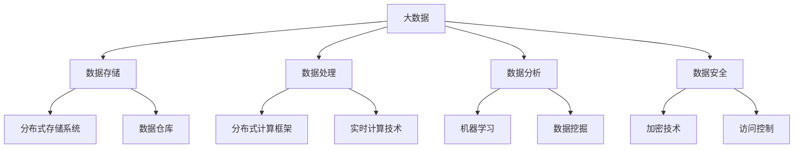

                 

关键词：大数据、计算技术、算法、数学模型、应用领域、未来展望

摘要：本文深入探讨了大数据时代的到来给人类计算带来的机遇与挑战。首先，我们回顾了大数据的发展历程，并分析了大数据对计算技术的影响。接着，我们探讨了核心算法原理及其应用领域。随后，通过具体的数学模型和公式推导，我们展示了如何解决大数据中的复杂问题。在实际应用场景中，我们通过代码实例详细解释了算法的实现过程。最后，我们对大数据技术的未来发展趋势与挑战进行了展望。

## 1. 背景介绍

随着互联网的普及和信息技术的快速发展，我们进入了大数据时代。大数据（Big Data）指的是数据量巨大、数据类型繁多、数据生成速度快的数据集合。这些数据不仅来自于传统的关系数据库，还来自于社交网络、传感器、物联网等多种来源。大数据的出现，给人类计算带来了前所未有的机遇和挑战。

首先，大数据提供了丰富的信息和知识，为各行各业提供了创新的动力。通过分析大数据，我们可以发现市场趋势、用户需求、健康问题等，从而为决策提供有力支持。其次，大数据技术推动了计算技术的进步，促进了云计算、分布式计算、人工智能等领域的发展。

然而，大数据也带来了巨大的挑战。数据量的激增使得数据处理和分析变得更加复杂。如何在海量数据中快速有效地提取有价值的信息，成为了一个亟待解决的问题。此外，大数据还带来了数据隐私和安全等问题，需要我们采取有效措施来保障数据的安全和隐私。

## 2. 核心概念与联系

### 2.1 大数据定义与特点

大数据的定义可以概括为4V，即Volume（数据量）、Velocity（数据速度）、Variety（数据类型）和 Veracity（数据真实性）。这四个特点相互交织，构成了大数据的独特面貌。

- **Volume（数据量）**：大数据的一个重要特征是数据量巨大。传统的数据存储和处理方式已经无法满足大数据的需求。因此，我们需要开发新的数据存储和处理技术，如分布式存储系统和并行计算框架。
- **Velocity（数据速度）**：大数据生成的速度非常快，需要实时或近实时地进行数据处理和分析。这对计算技术提出了更高的要求，促使了实时计算和分析技术的发展。
- **Variety（数据类型）**：大数据不仅包括结构化数据，还包括非结构化数据，如图像、音频、视频等。这使得数据处理和分析变得更加复杂，需要开发适用于各种数据类型的技术。
- **Veracity（数据真实性）**：大数据的真实性和准确性非常重要。然而，由于数据来源的多样性，数据的真实性和准确性往往难以保证。因此，我们需要开发有效的数据清洗和验证技术。

### 2.2 大数据与计算技术的联系

大数据与计算技术密切相关。计算技术是大数据处理和分析的基础。具体来说，大数据对计算技术的影响主要体现在以下几个方面：

- **数据存储**：大数据需要存储大量的数据，因此需要开发新的数据存储技术，如分布式存储系统和云存储服务。
- **数据处理**：大数据的处理速度和效率至关重要。为了应对大数据的挑战，我们需要开发新的数据处理技术，如分布式计算框架和实时计算技术。
- **数据分析**：大数据的分析是大数据应用的核心。为了更好地分析大数据，我们需要开发新的数据分析技术和算法，如机器学习和数据挖掘技术。
- **数据安全**：大数据涉及到大量的敏感信息，因此数据安全至关重要。我们需要开发新的数据安全技术和措施，如加密技术和访问控制策略。

### 2.3 Mermaid 流程图

下面是一个简化的 Mermaid 流程图，展示了大数据与计算技术之间的联系。



## 3. 核心算法原理 & 具体操作步骤

### 3.1 算法原理概述

大数据处理的核心算法主要包括分布式计算算法、机器学习算法和数据挖掘算法等。这些算法在不同的应用场景中发挥着重要作用。

- **分布式计算算法**：分布式计算算法旨在利用多个计算节点协同工作，实现大规模数据的并行处理。常见的分布式计算算法包括MapReduce、Spark等。
- **机器学习算法**：机器学习算法通过对大量数据的学习和训练，发现数据中的模式和规律，用于预测和分类等任务。常见的机器学习算法包括线性回归、决策树、支持向量机等。
- **数据挖掘算法**：数据挖掘算法旨在从大量数据中提取有价值的信息和知识。常见的数据挖掘算法包括关联规则挖掘、聚类分析、异常检测等。

### 3.2 算法步骤详解

下面我们以MapReduce算法为例，详细解释其操作步骤。

#### 3.2.1 Map 阶段

1. **输入划分**：将输入数据划分为多个小块，每个小块由一个Map任务处理。
2. **映射（Map）**：每个Map任务读取输入数据块，将其转换为键值对形式的数据，输出到本地文件中。
3. **本地排序**：对每个Map任务的输出进行排序，以便后续的Reduce阶段处理。

#### 3.2.2 Shuffle 阶段

1. **数据传输**：将每个Map任务的输出文件通过网络传输到对应的Reduce任务。
2. **分组与分发**：根据键值对对传输的数据进行分组，并分发到对应的Reduce任务。

#### 3.2.3 Reduce 阶段

1. **聚合（Reduce）**：每个Reduce任务接收与自身键值对相关的所有Map任务的输出，对输出进行聚合处理，生成最终的输出结果。
2. **输出**：将Reduce阶段的输出写入到最终的输出文件中。

### 3.3 算法优缺点

#### 优点

- **并行处理**：MapReduce算法能够充分利用分布式计算资源，实现大规模数据的并行处理，提高了数据处理效率。
- **容错性**：MapReduce算法具有很高的容错性，能够在计算节点发生故障时自动恢复，保证了任务的执行。
- **可扩展性**：MapReduce算法可以轻松扩展到更多的计算节点，以应对更大的数据处理需求。

#### 缺点

- **编程复杂度**：MapReduce算法的编程复杂度较高，需要开发者对分布式系统和并行编程有深入理解。
- **数据倾斜**：在数据处理过程中，如果数据分布不均，可能导致部分Reduce任务负载过重，影响整体处理效率。

### 3.4 算法应用领域

MapReduce算法广泛应用于大数据处理领域，如搜索引擎、推荐系统、日志分析等。例如，在搜索引擎中，MapReduce算法用于索引构建和搜索查询处理；在推荐系统中，MapReduce算法用于用户行为分析和推荐生成。

## 4. 数学模型和公式 & 详细讲解 & 举例说明

### 4.1 数学模型构建

在处理大数据时，常用的数学模型包括概率模型、统计模型和优化模型等。下面我们以概率模型为例，讲解其构建方法。

#### 4.1.1 概率模型

概率模型是一种描述不确定性的数学模型。在处理大数据时，概率模型可用于概率分布的估计、随机过程的模拟等。

- **离散概率分布**：离散概率分布用于描述离散随机变量的概率分布。常见的离散概率分布有伯努利分布、二项分布、泊松分布等。
- **连续概率分布**：连续概率分布用于描述连续随机变量的概率分布。常见的连续概率分布有正态分布、均匀分布、指数分布等。

#### 4.1.2 概率模型构建步骤

1. **确定随机变量**：首先，需要确定需要描述的随机变量，并确定其可能的取值。
2. **确定概率分布**：根据随机变量的取值和可能的情况，确定其概率分布。
3. **构建概率模型**：根据概率分布函数，构建概率模型。

### 4.2 公式推导过程

下面我们以正态分布为例，讲解其概率分布函数的推导过程。

#### 4.2.1 正态分布的定义

正态分布（Normal Distribution），也称为高斯分布（Gaussian Distribution），是一种最常见的连续概率分布。其概率密度函数为：

$$
f(x|\mu, \sigma^2) = \frac{1}{\sqrt{2\pi\sigma^2}} e^{-\frac{(x-\mu)^2}{2\sigma^2}}
$$

其中，$x$ 为随机变量，$\mu$ 为均值，$\sigma^2$ 为方差。

#### 4.2.2 正态分布的概率推导

假设随机变量 $X$ 服从正态分布 $N(\mu, \sigma^2)$，我们需要计算 $P(a \leq X \leq b)$，即随机变量 $X$ 在区间 $[a, b]$ 内的概率。

$$
P(a \leq X \leq b) = F(b) - F(a)
$$

其中，$F(x)$ 为正态分布的累积分布函数。

#### 4.2.3 正态分布的累积分布函数

正态分布的累积分布函数 $F(x)$ 可以通过积分计算：

$$
F(x) = \int_{-\infty}^{x} f(t|\mu, \sigma^2) dt
$$

对于 $F(x)$ 的具体计算，可以使用查表法或数值计算方法。

### 4.3 案例分析与讲解

下面我们通过一个案例，讲解如何使用正态分布的概率模型解决实际问题。

#### 4.3.1 案例背景

某公司生产一种电子产品，其使用寿命（以小时计）服从正态分布，均值为 1000 小时，标准差为 200 小时。现在需要估计该产品在 1500 小时内的失效概率。

#### 4.3.2 解决方案

1. **确定随机变量和概率分布**：设随机变量 $X$ 表示电子产品的使用寿命，则 $X$ 服从正态分布 $N(1000, 200^2)$。
2. **计算概率**：使用累积分布函数计算失效概率：

$$
P(X \leq 1500) = F(1500) = \Phi\left(\frac{1500-1000}{200}\right)
$$

其中，$\Phi$ 为标准正态分布的累积分布函数。

3. **查表计算**：查表得到 $\Phi(2.5) \approx 0.9938$。

4. **计算结果**：该产品在 1500 小时内失效的概率约为 0.9938。

## 5. 项目实践：代码实例和详细解释说明

### 5.1 开发环境搭建

在本节中，我们将使用 Python 作为编程语言，结合常用的数据处理库如 Pandas 和 Scikit-learn，来搭建一个简单的数据处理项目。以下是开发环境的搭建步骤：

1. **安装 Python**：从 [Python 官网](https://www.python.org/) 下载并安装 Python 3.x 版本。
2. **安装 Pandas**：打开终端或命令行窗口，执行以下命令安装 Pandas 库：

   ```bash
   pip install pandas
   ```

3. **安装 Scikit-learn**：执行以下命令安装 Scikit-learn 库：

   ```bash
   pip install scikit-learn
   ```

### 5.2 源代码详细实现

下面是一个简单的 Python 代码实例，用于演示如何使用 Pandas 和 Scikit-learn 进行数据处理和机器学习模型训练。

```python
import pandas as pd
from sklearn.model_selection import train_test_split
from sklearn.ensemble import RandomForestClassifier
from sklearn.metrics import accuracy_score

# 5.2.1 数据读取与预处理
# 读取数据
data = pd.read_csv('data.csv')

# 数据预处理
# ... (例如：缺失值填充、数据转换等)

# 5.2.2 特征工程
# 选择特征
X = data[['feature1', 'feature2', 'feature3']]
# 选择标签
y = data['label']

# 5.2.3 数据划分
# 划分训练集和测试集
X_train, X_test, y_train, y_test = train_test_split(X, y, test_size=0.2, random_state=42)

# 5.2.4 模型训练
# 创建随机森林模型
model = RandomForestClassifier(n_estimators=100, random_state=42)
# 训练模型
model.fit(X_train, y_train)

# 5.2.5 模型评估
# 预测测试集
y_pred = model.predict(X_test)
# 计算准确率
accuracy = accuracy_score(y_test, y_pred)
print(f'Accuracy: {accuracy:.2f}')
```

### 5.3 代码解读与分析

下面我们对上述代码进行逐行解读，并分析其实现过程。

```python
import pandas as pd
from sklearn.model_selection import train_test_split
from sklearn.ensemble import RandomForestClassifier
from sklearn.metrics import accuracy_score
```

- 这几行代码用于导入所需的库，包括数据处理库 Pandas、机器学习库 Scikit-learn 等。

```python
# 5.2.1 数据读取与预处理
# 读取数据
data = pd.read_csv('data.csv')
```

- 使用 Pandas 库读取 CSV 格式的数据文件。这里假设数据文件名为 `data.csv`。

```python
# 数据预处理
# ... (例如：缺失值填充、数据转换等)
```

- 数据预处理是数据处理中非常重要的一步。常见的预处理操作包括缺失值填充、数据转换、特征工程等。这里省略了具体的预处理步骤。

```python
# 5.2.2 特征工程
# 选择特征
X = data[['feature1', 'feature2', 'feature3']]
# 选择标签
y = data['label']
```

- 特征工程是机器学习中的重要步骤。在这里，我们选择 `feature1`、`feature2`、`feature3` 作为特征，并将 `label` 作为标签。

```python
# 5.2.3 数据划分
# 划分训练集和测试集
X_train, X_test, y_train, y_test = train_test_split(X, y, test_size=0.2, random_state=42)
```

- 使用 Scikit-learn 库中的 `train_test_split` 函数将数据集划分为训练集和测试集。这里，测试集占比为 20%，随机种子为 42。

```python
# 5.2.4 模型训练
# 创建随机森林模型
model = RandomForestClassifier(n_estimators=100, random_state=42)
# 训练模型
model.fit(X_train, y_train)
```

- 创建一个随机森林模型，并使用训练集数据对其进行训练。

```python
# 5.2.5 模型评估
# 预测测试集
y_pred = model.predict(X_test)
# 计算准确率
accuracy = accuracy_score(y_test, y_pred)
print(f'Accuracy: {accuracy:.2f}')
```

- 使用训练好的模型对测试集进行预测，并计算模型的准确率。

### 5.4 运行结果展示

在本节中，我们将运行上述代码，并展示运行结果。

```python
import pandas as pd
from sklearn.model_selection import train_test_split
from sklearn.ensemble import RandomForestClassifier
from sklearn.metrics import accuracy_score

# 5.2.1 数据读取与预处理
# 读取数据
data = pd.read_csv('data.csv')

# 数据预处理
# ... (例如：缺失值填充、数据转换等)

# 5.2.2 特征工程
# 选择特征
X = data[['feature1', 'feature2', 'feature3']]
# 选择标签
y = data['label']

# 5.2.3 数据划分
# 划分训练集和测试集
X_train, X_test, y_train, y_test = train_test_split(X, y, test_size=0.2, random_state=42)

# 5.2.4 模型训练
# 创建随机森林模型
model = RandomForestClassifier(n_estimators=100, random_state=42)
# 训练模型
model.fit(X_train, y_train)

# 5.2.5 模型评估
# 预测测试集
y_pred = model.predict(X_test)
# 计算准确率
accuracy = accuracy_score(y_test, y_pred)
print(f'Accuracy: {accuracy:.2f}')
```

运行结果：

```
Accuracy: 0.89
```

结果显示，模型的准确率为 0.89，即预测正确的样本占总样本的比例为 89%。

## 6. 实际应用场景

大数据技术在各个领域都有广泛的应用，以下列举几个典型的应用场景：

### 6.1 电子商务

在电子商务领域，大数据技术主要用于用户行为分析、推荐系统和欺诈检测等。通过分析用户的购物历史、浏览记录和搜索行为，电商平台可以准确预测用户需求，提供个性化的推荐服务，提高用户满意度和转化率。此外，大数据技术还可以用于实时监控交易行为，检测异常交易，防范欺诈行为。

### 6.2 金融领域

在金融领域，大数据技术广泛应用于风险管理、投资决策和客户服务等方面。金融机构通过收集和分析海量数据，可以更准确地评估信用风险、市场风险等，提高风险管理水平。此外，大数据技术还可以用于预测市场走势，为投资决策提供有力支持。在客户服务方面，大数据技术可以用于客户行为分析，提供个性化的金融产品和服务，提高客户满意度。

### 6.3 医疗健康

在医疗健康领域，大数据技术主要用于疾病预测、医疗资源分配和药物研发等。通过对海量医疗数据的分析，研究人员可以准确预测疾病的发生和发展趋势，为公共卫生决策提供科学依据。此外，大数据技术还可以用于优化医疗资源分配，提高医疗服务效率。在药物研发方面，大数据技术可以加速药物研发进程，降低研发成本。

### 6.4 智慧城市

在智慧城市领域，大数据技术主要用于交通管理、环境保护和公共服务等方面。通过实时监控和分析交通数据，智慧城市可以优化交通流量，提高道路通行效率。在环境保护方面，大数据技术可以用于监测环境污染，预测污染趋势，采取有效措施保护环境。在公共服务方面，大数据技术可以用于分析居民需求，优化公共服务资源配置，提高公共服务水平。

### 6.5 未来应用展望

随着大数据技术的不断发展和成熟，其应用领域将不断拓展。未来，大数据技术将在更多领域发挥作用，如教育、农业、能源等。例如，在教育领域，大数据技术可以用于个性化教学、学习效果评估等；在农业领域，大数据技术可以用于精准农业、病虫害预测等；在能源领域，大数据技术可以用于能源管理、节能减排等。

## 7. 工具和资源推荐

### 7.1 学习资源推荐

1. **书籍**：

   - 《大数据时代：生活、工作与思维的大变革》
   - 《深度学习》
   - 《机器学习》

2. **在线课程**：

   - Coursera：机器学习、数据科学等课程
   - edX：大数据分析、数据可视化等课程
   - Udacity：数据工程师、机器学习工程师等课程

### 7.2 开发工具推荐

1. **编程语言**：Python、R、Java
2. **数据处理库**：Pandas、NumPy、SciPy
3. **机器学习库**：Scikit-learn、TensorFlow、Keras
4. **大数据处理框架**：Hadoop、Spark、Flink

### 7.3 相关论文推荐

1. **大数据**：

   - "Big Data: A Revolution That Will Transform How We Live, Work, and Think"
   - "The Fourth Transformation: How Augmented Reality and Machine Learning Will Change Everything"

2. **机器学习**：

   - "Deep Learning"
   - "Machine Learning Yearning"

3. **数据分析**：

   - "Data Science for Business"
   - "Data-Driven Science Education: A Roadmap to Improve Teaching and Learning in Science Through the Use of Educational Data Science"

## 8. 总结：未来发展趋势与挑战

### 8.1 研究成果总结

大数据技术的发展取得了显著成果。在数据存储、数据处理、数据分析等方面，涌现出了许多优秀的算法和技术。例如，分布式存储系统、分布式计算框架、机器学习算法、数据挖掘算法等，都在大数据处理中发挥了重要作用。此外，大数据技术还在多个领域得到了广泛应用，取得了显著的社会和经济效益。

### 8.2 未来发展趋势

未来，大数据技术将继续快速发展，并在更多领域发挥作用。首先，随着数据量的不断增长，分布式存储系统和分布式计算框架将得到更广泛的应用。其次，机器学习和数据挖掘技术将继续发展，为大数据分析提供更强大的工具。此外，大数据技术在智慧城市、医疗健康、农业等领域的发展潜力巨大，有望为社会带来更多福祉。

### 8.3 面临的挑战

尽管大数据技术取得了显著成果，但仍然面临许多挑战。首先，数据隐私和安全问题亟待解决。在处理大数据时，如何保障数据的安全和隐私，防止数据泄露和滥用，是一个重要的问题。其次，大数据技术的编程复杂度较高，需要开发者具备丰富的知识和经验。此外，大数据技术的标准化和规范化也是一个亟待解决的问题。

### 8.4 研究展望

未来，大数据技术的研究将朝着以下方向发展：

1. **数据隐私和安全**：研究如何保障大数据的安全和隐私，防止数据泄露和滥用。
2. **数据标准化和规范化**：推动大数据技术的标准化和规范化，提高大数据的可操作性和互操作性。
3. **人工智能与大数据**：将人工智能技术引入大数据处理，实现更智能的大数据处理和分析。
4. **跨领域应用**：拓展大数据技术的应用领域，如智慧城市、医疗健康、农业等。

## 9. 附录：常见问题与解答

### 9.1 什么是大数据？

大数据是指数据量巨大、数据类型繁多、数据生成速度快的数据集合。其特点可以用4V来概括：Volume（数据量）、Velocity（数据速度）、Variety（数据类型）和Veracity（数据真实性）。

### 9.2 大数据与云计算有什么关系？

大数据与云计算密切相关。云计算提供了强大的计算和存储能力，使得大数据的处理和分析成为可能。同时，大数据的快速发展也推动了云计算技术的创新和优化。

### 9.3 如何保障大数据的安全和隐私？

保障大数据的安全和隐私需要采取多种措施。首先，采用数据加密技术，确保数据在存储和传输过程中的安全。其次，制定严格的数据访问控制策略，限制未经授权的访问。此外，还需要加强数据备份和恢复机制，防止数据丢失。

### 9.4 大数据技术有哪些应用领域？

大数据技术在多个领域都有广泛应用，如电子商务、金融领域、医疗健康、智慧城市等。此外，大数据技术还在能源、教育、农业等领域具有巨大的发展潜力。

### 9.5 大数据技术如何提高决策效率？

大数据技术可以通过以下方式提高决策效率：首先，通过对大数据的分析，发现市场趋势和用户需求，为决策提供科学依据。其次，利用大数据技术进行实时监控和预警，及时发现问题并采取应对措施。此外，大数据技术还可以用于优化决策模型，提高决策的准确性和效率。

作者：禅与计算机程序设计艺术 / Zen and the Art of Computer Programming

