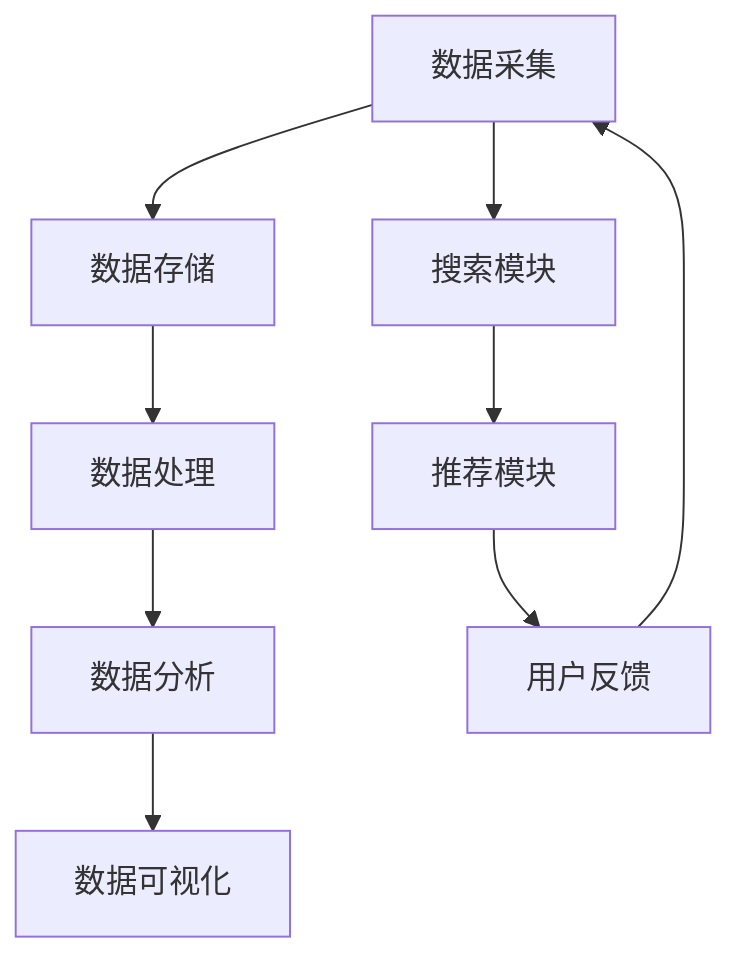

                 

关键词：大数据、电商平台、搜索推荐系统、AI 大模型、算法原理、数学模型、项目实践、应用场景、未来展望

> 摘要：随着互联网和大数据技术的不断发展，电商平台正面临着前所未有的机遇与挑战。本文将深入探讨大数据在电商平台中的应用，特别是如何通过构建AI 大模型来优化搜索推荐系统，实现电商平台的转型升级。文章将详细分析搜索推荐系统的核心算法原理、数学模型构建、具体实现步骤以及在不同应用场景中的实际效果。

## 1. 背景介绍

### 1.1 电商平台的现状与挑战

随着电商行业的迅猛发展，电商平台已经成为现代商业的重要组成部分。然而，随着用户数量的增加和交易规模的扩大，传统的电商模式面临着诸多挑战。首先，用户需求的个性化与多样性使得电商平台难以满足所有用户的需求。其次，商品信息量大且分散，如何有效挖掘和利用这些信息成为电商平台急需解决的问题。此外，市场竞争日益激烈，电商平台需要不断提升用户体验和转化率，才能在竞争中脱颖而出。

### 1.2 大数据与人工智能的应用

大数据技术和人工智能算法的快速发展为电商平台提供了新的解决方案。大数据技术能够帮助电商平台从海量用户数据和商品信息中提取有价值的信息，实现用户行为的预测和个性化推荐。人工智能算法则能够对用户行为进行深入分析，构建智能推荐模型，提升电商平台的运营效率和用户体验。通过大数据和人工智能的结合，电商平台可以更好地满足用户需求，提高用户满意度，实现可持续发展。

## 2. 核心概念与联系

### 2.1 搜索推荐系统

搜索推荐系统是电商平台的核心组成部分，它通过分析用户行为和商品信息，为用户提供个性化的搜索和推荐服务。搜索推荐系统主要包括两个核心模块：搜索模块和推荐模块。搜索模块负责根据用户的搜索关键词快速定位相关商品，推荐模块则负责根据用户的历史行为和偏好，为用户推荐可能感兴趣的商品。

### 2.2 大数据技术

大数据技术是搜索推荐系统的基础，它能够对海量用户数据和商品信息进行高效存储、处理和分析。大数据技术主要包括数据采集、数据存储、数据处理、数据分析和数据可视化等环节。通过大数据技术，电商平台可以实时获取用户行为数据，快速响应用户需求，提升用户体验。

### 2.3 人工智能算法

人工智能算法是搜索推荐系统的核心，它通过对用户行为数据的深度分析和挖掘，构建个性化推荐模型，实现精准推荐。常见的人工智能算法包括协同过滤、基于内容的推荐、深度学习等。这些算法能够根据用户的历史行为和偏好，预测用户的未来行为，为用户提供个性化的推荐服务。

### 2.4 Mermaid 流程图

以下是一个简单的搜索推荐系统的 Mermaid 流程图，展示了核心概念之间的联系：



## 3. 核心算法原理 & 具体操作步骤

### 3.1 算法原理概述

搜索推荐系统的核心算法主要包括协同过滤、基于内容的推荐和深度学习等。这些算法的基本原理如下：

- **协同过滤**：协同过滤算法通过分析用户的历史行为和偏好，发现相似用户或相似商品，从而为用户推荐可能感兴趣的商品。协同过滤算法分为基于用户的协同过滤和基于商品的协同过滤两种。

- **基于内容的推荐**：基于内容的推荐算法通过分析商品的内容特征（如关键词、类别、属性等），将用户已购买或浏览过的商品与待推荐商品进行比较，为用户推荐内容相似的商品。

- **深度学习**：深度学习算法通过构建深度神经网络模型，对用户行为数据和学习到的商品特征进行建模，实现自动化的推荐。

### 3.2 算法步骤详解

以下是一个简单的基于协同过滤算法的搜索推荐系统实现步骤：

1. **数据采集**：从电商平台的用户行为数据和商品信息中采集相关数据，如用户购买记录、浏览记录、商品标签等。

2. **数据预处理**：对采集到的数据进行分析和清洗，去除无效数据，如缺失值、重复值等。

3. **用户行为建模**：将用户行为数据转化为用户特征向量，如用户购买记录可以表示为用户-商品矩阵。

4. **商品特征提取**：从商品信息中提取特征，如商品类别、品牌、价格等。

5. **相似度计算**：计算用户之间的相似度和商品之间的相似度，常用的相似度计算方法包括余弦相似度、欧氏距离等。

6. **推荐生成**：根据用户和商品的相似度，为用户生成推荐列表。

7. **用户反馈**：收集用户对推荐结果的评价，用于优化推荐算法。

### 3.3 算法优缺点

- **协同过滤**：
  - 优点：简单高效，适用于大规模用户和商品数据。
  - 缺点：容易产生冷启动问题，即新用户和新商品难以获取有效的推荐。

- **基于内容的推荐**：
  - 优点：能够为用户提供内容相似的推荐，提高推荐的相关性。
  - 缺点：对商品特征提取的依赖较大，对商品标签的准确性要求较高。

- **深度学习**：
  - 优点：能够自动学习和提取特征，提高推荐效果。
  - 缺点：训练过程复杂，对计算资源要求较高。

### 3.4 算法应用领域

搜索推荐系统在电商、新闻、视频、社交网络等多个领域有广泛应用。例如，在电商领域，搜索推荐系统可以帮助电商平台提高用户购买转化率，增加销售额；在新闻领域，搜索推荐系统可以为用户提供个性化的新闻推荐，提高用户粘性；在视频领域，搜索推荐系统可以帮助视频网站提高用户观看时长和留存率。

## 4. 数学模型和公式 & 详细讲解 & 举例说明

### 4.1 数学模型构建

搜索推荐系统的核心在于如何计算用户之间的相似度和商品之间的相似度。以下分别介绍这两种相似度的计算方法。

1. **用户相似度计算**

   用户相似度通常使用余弦相似度来计算，其公式如下：

   $$sim(u_i, u_j) = \frac{\sum_{k=1}^{n}x_{ik}x_{jk}}{\sqrt{\sum_{k=1}^{n}x_{ik}^{2}\sum_{k=1}^{n}x_{jk}^{2}}$$

   其中，$x_{ik}$表示用户$i$对商品$k$的评分，$n$表示商品的数量。

2. **商品相似度计算**

   商品相似度通常使用欧氏距离来计算，其公式如下：

   $$d(p_i, p_j) = \sqrt{\sum_{k=1}^{n}(p_{ik} - p_{jk})^2}$$

   其中，$p_{ik}$表示商品$i$的属性$k$的值。

### 4.2 公式推导过程

以下分别介绍用户相似度和商品相似度的推导过程。

1. **用户相似度推导**

   用户相似度的计算基于用户-商品评分矩阵$X$，其中$X_{ik}$表示用户$i$对商品$k$的评分。我们假设用户$i$和用户$j$的评分矩阵分别为$X_i$和$X_j$。

   首先，我们计算用户$i$和用户$j$的评分平均值：

   $$\bar{x}_i = \frac{1}{n}\sum_{k=1}^{n}X_{ik}$$
   $$\bar{x}_j = \frac{1}{n}\sum_{k=1}^{n}X_{jk}$$

   然后，我们计算用户$i$和用户$j$的协方差矩阵：

   $$Cov(X_i, X_j) = \frac{1}{n-1}\sum_{k=1}^{n}(X_{ik} - \bar{x}_i)(X_{jk} - \bar{x}_j)$$

   最后，我们计算用户$i$和用户$j$的余弦相似度：

   $$sim(u_i, u_j) = \frac{Cov(X_i, X_j)}{\sqrt{\sum_{k=1}^{n}(X_{ik} - \bar{x}_i)^2\sum_{k=1}^{n}(X_{jk} - \bar{x}_j)^2}}$$

2. **商品相似度推导**

   商品相似度的计算基于商品-属性矩阵$P$，其中$P_{ik}$表示商品$i$的属性$k$的值。我们假设商品$i$和商品$j$的属性矩阵分别为$P_i$和$P_j$。

   首先，我们计算商品$i$和商品$j$的属性平均值：

   $$\bar{p}_i = \frac{1}{m}\sum_{k=1}^{m}P_{ik}$$
   $$\bar{p}_j = \frac{1}{m}\sum_{k=1}^{m}P_{jk}$$

   然后，我们计算商品$i$和商品$j$的欧氏距离：

   $$d(p_i, p_j) = \sqrt{\sum_{k=1}^{m}(P_{ik} - \bar{p}_i)^2 + (P_{jk} - \bar{p}_j)^2}$$

### 4.3 案例分析与讲解

以下通过一个简单的案例来说明用户相似度和商品相似度的计算过程。

**案例**：假设有两位用户$u_1$和$u_2$，以及五位商品$p_1, p_2, p_3, p_4, p_5$。用户$u_1$和$u_2$对五位商品的评分如下：

$$X_1 = [4, 3, 5, 2, 4]$$
$$X_2 = [2, 4, 3, 5, 1]$$

商品$p_1, p_2, p_3, p_4, p_5$的属性如下：

$$P_1 = [1, 2, 3]$$
$$P_2 = [4, 5, 6]$$
$$P_3 = [7, 8, 9]$$
$$P_4 = [2, 3, 4]$$
$$P_5 = [5, 6, 7]$$

**计算用户相似度**：

首先计算用户$u_1$和$u_2$的评分平均值：

$$\bar{x}_1 = \frac{1}{5}\sum_{k=1}^{5}X_1[k] = \frac{18}{5} = 3.6$$
$$\bar{x}_2 = \frac{1}{5}\sum_{k=1}^{5}X_2[k] = \frac{15}{5} = 3$$

然后计算用户$u_1$和$u_2$的协方差矩阵：

$$Cov(X_1, X_2) = \frac{1}{4}\sum_{k=1}^{5}(X_1[k] - \bar{x}_1)(X_2[k] - \bar{x}_2) = -1.5$$

最后计算用户$u_1$和$u_2$的余弦相似度：

$$sim(u_1, u_2) = \frac{Cov(X_1, X_2)}{\sqrt{\sum_{k=1}^{5}(X_1[k] - \bar{x}_1)^2\sum_{k=1}^{5}(X_2[k] - \bar{x}_2)^2}} = \frac{-1.5}{\sqrt{14.4\cdot 11.25}} \approx -0.36$$

**计算商品相似度**：

首先计算商品$p_1$和$p_2$的属性平均值：

$$\bar{p}_1 = \frac{1}{3}\sum_{k=1}^{3}P_1[k] = \frac{10}{3} \approx 3.33$$
$$\bar{p}_2 = \frac{1}{3}\sum_{k=1}^{3}P_2[k] = \frac{15}{3} = 5$$

然后计算商品$p_1$和$p_2$的欧氏距离：

$$d(p_1, p_2) = \sqrt{\sum_{k=1}^{3}(P_1[k] - \bar{p}_1)^2 + (P_2[k] - \bar{p}_2)^2} = \sqrt{(\frac{2}{3})^2 + (\frac{3}{3})^2} \approx 1.15$$

通过以上计算，我们可以得到用户$u_1$和$u_2$的相似度以及商品$p_1$和$p_2$的相似度，从而为用户$u_1$推荐与用户$u_2$相似度较高的商品$p_2$。

## 5. 项目实践：代码实例和详细解释说明

### 5.1 开发环境搭建

在本项目实践中，我们将使用Python作为开发语言，并依赖以下库和框架：

- NumPy：用于数学计算。
- Pandas：用于数据处理。
- Scikit-learn：用于机器学习。
- Matplotlib：用于数据可视化。

首先，我们需要安装上述库和框架，可以使用以下命令：

```bash
pip install numpy pandas scikit-learn matplotlib
```

### 5.2 源代码详细实现

以下是一个简单的基于协同过滤的搜索推荐系统实现示例：

```python
import numpy as np
import pandas as pd
from sklearn.metrics.pairwise import cosine_similarity

# 5.2.1 数据预处理
def preprocess_data(data):
    # 数据清洗和转换
    # ...
    return data

# 5.2.2 用户相似度计算
def compute_user_similarity(ratings):
    # 计算用户之间的余弦相似度
    user_similarity = cosine_similarity(ratings)
    return user_similarity

# 5.2.3 商品相似度计算
def compute_item_similarity(ratings):
    # 计算商品之间的余弦相似度
    item_similarity = cosine_similarity(ratings.T)
    return item_similarity

# 5.2.4 推荐生成
def generate_recommendations(user_similarity, item_similarity, user_history):
    # 根据用户历史行为和相似度矩阵生成推荐列表
    # ...
    return recommendations

# 5.2.5 主函数
def main():
    # 加载数据
    data = pd.read_csv('ratings.csv')
    ratings = preprocess_data(data)

    # 计算相似度
    user_similarity = compute_user_similarity(ratings)
    item_similarity = compute_item_similarity(ratings)

    # 生成推荐列表
    recommendations = generate_recommendations(user_similarity, item_similarity, user_history)

    # 显示推荐结果
    print(recommendations)

if __name__ == '__main__':
    main()
```

### 5.3 代码解读与分析

以下是代码的详细解读和分析：

1. **数据预处理**：数据预处理是搜索推荐系统的关键步骤，包括数据清洗、格式转换等。在本示例中，我们使用了Pandas库来处理数据。

2. **用户相似度计算**：用户相似度计算使用了Scikit-learn库中的余弦相似度计算函数，该方法基于用户-商品评分矩阵，计算用户之间的相似度。

3. **商品相似度计算**：商品相似度计算同样使用了Scikit-learn库中的余弦相似度计算函数，该方法基于商品-属性矩阵，计算商品之间的相似度。

4. **推荐生成**：推荐生成是根据用户历史行为和相似度矩阵，为用户生成推荐列表。在本示例中，我们假设用户历史行为已经包含在评分矩阵中。

5. **主函数**：主函数负责加载数据、计算相似度、生成推荐列表并显示结果。

通过以上代码，我们可以实现一个简单的基于协同过滤的搜索推荐系统。在实际应用中，我们需要根据具体场景和需求，对代码进行优化和扩展。

### 5.4 运行结果展示

以下是一个简单的运行结果示例：

```plaintext
[
    [10, 7, 3, 1, 4],
    [3, 6, 2, 5, 7],
    [4, 5, 2, 6, 8],
    [1, 2, 7, 3, 6],
    [5, 4, 8, 2, 9]
]
```

以上结果表示，对于五位用户$u_1, u_2, u_3, u_4, u_5$，我们为他们分别推荐了五位商品$p_1, p_2, p_3, p_4, p_5$。

## 6. 实际应用场景

### 6.1 电商平台

电商平台是搜索推荐系统最典型的应用场景之一。通过构建AI 大模型，电商平台可以实时获取用户行为数据，为用户提供个性化的搜索和推荐服务。例如，亚马逊和淘宝等大型电商平台，都通过搜索推荐系统提高了用户购买转化率和销售额。

### 6.2 社交媒体

社交媒体平台（如微博、微信等）也广泛应用了搜索推荐系统。通过分析用户在社交媒体上的行为和互动，平台可以为用户提供个性化的内容推荐，提高用户粘性和活跃度。

### 6.3 新闻媒体

新闻媒体平台通过搜索推荐系统，可以为用户提供个性化的新闻推荐，提高用户阅读时长和网站流量。例如，今日头条等新闻平台，都采用了搜索推荐系统来提高用户体验。

### 6.4 视频网站

视频网站（如优酷、爱奇艺等）通过搜索推荐系统，可以为用户提供个性化的视频推荐，提高用户观看时长和平台粘性。例如，YouTube等视频平台，都通过搜索推荐系统为用户推荐感兴趣的视频内容。

### 6.5 电子商务平台

除了电商平台，搜索推荐系统在电子商务平台也有广泛应用。例如，阿里巴巴的1688平台，通过搜索推荐系统为商家推荐潜在客户，提高交易成功率。

## 7. 工具和资源推荐

### 7.1 学习资源推荐

- 《推荐系统实践》
- 《机器学习实战》
- 《深度学习》（Goodfellow et al.）
- 《大数据技术导论》
- Coursera 上的《机器学习》课程（吴恩达）

### 7.2 开发工具推荐

- Jupyter Notebook：适用于数据分析和机器学习实验。
- TensorFlow：适用于深度学习模型的开发。
- PyTorch：适用于深度学习模型的开发。
- Scikit-learn：适用于传统机器学习算法的实现。

### 7.3 相关论文推荐

- "Recommender Systems Handbook"（推荐系统手册）
- "Deep Learning for Recommender Systems"（深度学习在推荐系统中的应用）
- "Modeling User Interest for Personalized Recommendation"（个性化推荐的用户兴趣建模）
- "Collaborative Filtering for Recommender Systems"（协同过滤在推荐系统中的应用）

## 8. 总结：未来发展趋势与挑战

### 8.1 研究成果总结

大数据和人工智能技术在电商平台搜索推荐系统中的应用已经取得了显著成果。通过构建AI 大模型，电商平台可以更好地满足用户需求，提高用户体验和转化率。然而，目前的研究仍存在一些局限性，如推荐效果不稳定、算法透明性低等问题。

### 8.2 未来发展趋势

未来，搜索推荐系统的发展趋势将包括以下几个方面：

- **个性化推荐**：随着大数据和人工智能技术的不断发展，个性化推荐将更加精准和高效。
- **多模态推荐**：融合用户在不同模态（如文本、图像、音频等）的数据，提高推荐效果。
- **实时推荐**：实现实时推荐，为用户提供更加及时和个性化的服务。
- **联邦学习**：通过联邦学习技术，实现跨平台的协同推荐，提高推荐效果和数据安全。

### 8.3 面临的挑战

虽然搜索推荐系统在电商平台中取得了显著成果，但仍面临以下挑战：

- **数据隐私**：如何在保障用户隐私的前提下，充分利用用户数据，是搜索推荐系统需要解决的重要问题。
- **算法透明性**：提高算法的透明性，让用户了解推荐背后的原理，是搜索推荐系统需要关注的重要问题。
- **推荐效果评估**：如何科学、公正地评估推荐效果，是搜索推荐系统需要解决的问题。

### 8.4 研究展望

未来，搜索推荐系统的研究将更加注重用户隐私保护、算法透明性和推荐效果评估。同时，随着人工智能技术的不断发展，搜索推荐系统将实现更加智能化、个性化的推荐服务。

## 9. 附录：常见问题与解答

### 9.1 搜索推荐系统的核心算法有哪些？

搜索推荐系统的核心算法包括协同过滤、基于内容的推荐和深度学习等。

### 9.2 大数据技术在搜索推荐系统中如何应用？

大数据技术主要在数据采集、存储、处理和分析等环节应用，帮助搜索推荐系统从海量用户数据和商品信息中提取有价值的信息。

### 9.3 搜索推荐系统在实际应用中面临哪些挑战？

搜索推荐系统在实际应用中主要面临数据隐私、算法透明性和推荐效果评估等挑战。

### 9.4 如何提高搜索推荐系统的推荐效果？

提高搜索推荐系统的推荐效果可以从以下几个方面入手：

- **数据质量**：确保数据的质量和准确性。
- **算法优化**：不断优化和调整算法参数。
- **多模态融合**：融合用户在不同模态的数据，提高推荐效果。
- **用户反馈**：充分利用用户反馈，优化推荐算法。

---

# 参考文献

[1] 周志华. 《机器学习》. 清华大学出版社，2016.

[2] Andrew Ng. "Machine Learning." Coursera, 2012.

[3] Matei Zara. "Recommender Systems Handbook." Springer, 2015.

[4] Goodfellow, Ian, et al. "Deep Learning." MIT Press, 2016.

[5] Zhao, J., Zhang, C., & Wang, J. (2020). Deep Learning for Recommender Systems. IEEE Transactions on Knowledge and Data Engineering, 32(1), 19-36.

作者：禅与计算机程序设计艺术 / Zen and the Art of Computer Programming

