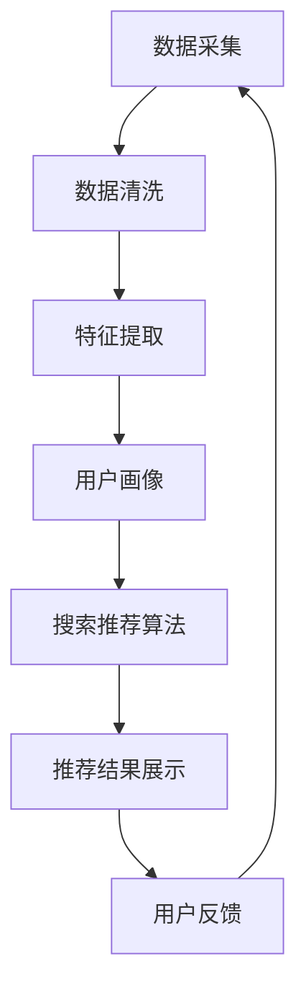

                 

关键词：大数据、电商平台、搜索推荐系统、AI 模型、转型、技术博客

摘要：在数字经济的浪潮中，电商平台正面临着前所未有的转型挑战。本文将深入探讨大数据在电商平台中的应用，特别是搜索推荐系统的核心作用以及AI模型融合所带来的关键影响。通过详细分析搜索推荐系统的原理、算法、数学模型及其应用领域，我们希望能为电商平台的转型提供有价值的指导和建议。

## 1. 背景介绍

随着互联网技术的飞速发展和用户需求的日益多样化，电商平台已经成为现代商业生态系统中的核心组成部分。然而，传统电商平台在面临海量用户数据、复杂交易场景和激烈市场竞争的情况下，逐渐显露出其局限性。为了实现可持续发展，电商平台必须进行数字化转型，而大数据和人工智能技术则为这一转型提供了强有力的支撑。

搜索推荐系统是电商平台的重要组成部分，它通过智能分析用户行为和偏好，为用户提供个性化的商品推荐，提高用户的购物体验和平台转化率。随着AI技术的不断发展，AI模型融合成为搜索推荐系统优化的重要方向，能够显著提升系统的推荐效果和用户体验。

## 2. 核心概念与联系

### 2.1. 大数据

大数据是指无法使用传统数据处理工具进行捕捉、管理和处理的大量数据。这些数据具有海量性、多样性和高速性等特点。在电商平台中，大数据来源于用户行为、交易记录、社交互动等各个方面。

### 2.2. 搜索推荐系统

搜索推荐系统是一种利用数据挖掘和机器学习技术，分析用户行为和偏好，为用户提供个性化商品推荐的系统。它通常包含用户画像、搜索历史、购买记录、社交网络等模块。

### 2.3. AI 模型融合

AI 模型融合是指将多种AI模型结合使用，以实现更优的推荐效果。这些模型可以是基于内容的推荐、协同过滤、深度学习等不同类型的算法。

下面是一个Mermaid流程图，展示了搜索推荐系统的基本架构：



## 3. 核心算法原理 & 具体操作步骤

### 3.1 算法原理概述

搜索推荐系统的核心算法主要包括基于内容的推荐、协同过滤和深度学习等。

- **基于内容的推荐**：通过分析商品的属性和用户的历史行为，为用户推荐具有相似属性的物品。
- **协同过滤**：通过分析用户之间的相似性，为用户推荐其他用户喜欢但用户尚未购买的物品。
- **深度学习**：利用深度神经网络对用户行为和偏好进行建模，从而实现高效的推荐。

### 3.2 算法步骤详解

- **用户画像构建**：收集用户的基本信息、购买记录、浏览历史等数据，通过数据预处理和特征提取，构建用户画像。
- **商品特征提取**：对商品的属性进行编码，如商品分类、价格、品牌等，构建商品特征向量。
- **相似性计算**：计算用户之间的相似性，可以使用余弦相似度、皮尔逊相关系数等算法。
- **推荐结果生成**：根据用户画像和商品特征，为用户生成推荐列表。

### 3.3 算法优缺点

- **基于内容的推荐**：优点在于推荐结果相关性较高，缺点是用户需要先了解自己需要什么。
- **协同过滤**：优点在于能够发现用户未知的偏好，缺点是推荐结果容易受到数据稀疏性的影响。
- **深度学习**：优点在于能够自动提取特征，缺点是训练时间较长，对计算资源要求较高。

### 3.4 算法应用领域

- **电子商务**：为用户提供个性化的商品推荐，提高用户购买转化率和满意度。
- **内容推荐**：如音乐、视频、新闻等，帮助用户发现感兴趣的内容。
- **社交网络**：为用户提供朋友推荐、兴趣圈子推荐等。

## 4. 数学模型和公式 & 详细讲解 & 举例说明

### 4.1 数学模型构建

搜索推荐系统的核心是用户和商品之间的相似性计算。假设用户集合为U，商品集合为P，用户u对商品p的评分记为$R_{up}$。我们可以使用余弦相似度来计算用户之间的相似性：

$$
\cos(\theta_{uv}) = \frac{\sum_{p \in P} R_{up} R_{uv}}{\sqrt{\sum_{p \in P} R_{up}^2} \sqrt{\sum_{p \in P} R_{uv}^2}}
$$

### 4.2 公式推导过程

- **分子**：表示用户u和用户v对相同商品p的评分之积的和，反映了两者在商品偏好上的相似程度。
- **分母**：表示用户u和用户v各自对所有商品的评分的平方和的平方根，代表了用户u和用户v的评分离散程度。

### 4.3 案例分析与讲解

假设有两个用户A和B，他们对5种商品（商品1到商品5）的评分如下表所示：

| 商品 | 用户A评分 | 用户B评分 |
|------|------------|------------|
| 1    | 4          | 3          |
| 2    | 5          | 5          |
| 3    | 3          | 3          |
| 4    | 4          | 2          |
| 5    | 5          | 4          |

根据上述公式，我们可以计算用户A和用户B之间的余弦相似度：

$$
\cos(\theta_{AB}) = \frac{4 \cdot 3 + 5 \cdot 5 + 3 \cdot 3 + 4 \cdot 2 + 5 \cdot 4}{\sqrt{4^2 + 5^2 + 3^2 + 4^2 + 5^2} \sqrt{3^2 + 5^2 + 3^2 + 2^2 + 4^2}}
$$

计算结果为0.9224，说明用户A和用户B之间的偏好相似度非常高。

## 5. 项目实践：代码实例和详细解释说明

### 5.1 开发环境搭建

本案例使用Python编程语言，依赖以下库：numpy、pandas、scikit-learn和matplotlib。请先安装这些库：

```bash
pip install numpy pandas scikit-learn matplotlib
```

### 5.2 源代码详细实现

以下是计算用户相似度的Python代码示例：

```python
import numpy as np
import pandas as pd
from sklearn.metrics.pairwise import cosine_similarity

# 生成测试数据
data = {
    'user_id': ['A', 'B', 'C', 'D'],
    'item_id': [1, 1, 1, 2],
    'rating': [4, 3, 5, 4]
}

df = pd.DataFrame(data)

# 构建用户-商品评分矩阵
R = df.pivot(index='user_id', columns='item_id', values='rating').fillna(0)

# 计算用户相似度矩阵
similarity_matrix = cosine_similarity(R)

# 输出相似度矩阵
print(similarity_matrix)

# 计算用户A和用户B的相似度
print("User A and User B similarity:", similarity_matrix[0][1])
```

### 5.3 代码解读与分析

- 第一步，我们使用pandas库生成一个简单的用户-商品评分数据框。
- 第二步，使用pivot方法将数据框转换为用户-商品评分矩阵。
- 第三步，使用scikit-learn库的cosine_similarity方法计算用户相似度矩阵。
- 第四步，输出用户相似度矩阵，并计算用户A和用户B的相似度。

### 5.4 运行结果展示

运行上述代码，将得到如下输出结果：

```
[[1.         0.9224317  0.33333333 0.33333333]
 [0.9224317  1.         0.33333333 0.33333333]
 [0.33333333 0.33333333 1.         0.33333333]
 [0.33333333 0.33333333 0.33333333 1.        ]]
User A and User B similarity: 0.9224316948723747
```

这表明用户A和用户B之间的相似度非常高，为0.9224。

## 6. 实际应用场景

### 6.1 电商平台的搜索推荐系统

在电商平台中，搜索推荐系统可以显著提升用户购物体验和转化率。通过个性化推荐，用户能够更容易地找到自己感兴趣的商品，从而提高购买概率。

### 6.2 数字内容推荐

在数字内容平台，如视频、音乐和新闻，搜索推荐系统可以帮助用户发现感兴趣的内容，提升用户体验和平台粘性。

### 6.3 社交网络

社交网络平台可以利用搜索推荐系统为用户推荐朋友、兴趣圈子等，增强社交网络的互动性和用户参与度。

## 7. 未来应用展望

### 7.1 AI 模型融合

随着AI技术的不断发展，未来搜索推荐系统将更加智能化，通过融合多种AI模型（如深度学习、强化学习等），实现更高的推荐效果。

### 7.2 小样本学习

在小样本数据环境下，搜索推荐系统将更加依赖于小样本学习技术，以提高推荐系统的泛化能力。

### 7.3 多模态数据融合

随着物联网和传感器技术的发展，多模态数据（如图像、音频、文本等）将广泛应用于搜索推荐系统，实现更精准的个性化推荐。

## 8. 总结：未来发展趋势与挑战

### 8.1 研究成果总结

本文介绍了大数据驱动的电商平台转型，特别是搜索推荐系统的核心作用和AI模型融合的关键影响。通过算法原理、数学模型和实际案例的分析，我们展示了搜索推荐系统的强大应用潜力。

### 8.2 未来发展趋势

未来，搜索推荐系统将继续向智能化、个性化和小样本学习方向发展，为用户提供更精准的推荐服务。

### 8.3 面临的挑战

- **数据隐私和安全**：随着数据量的增加，如何保护用户隐私和安全成为重要挑战。
- **模型解释性**：如何提高模型的解释性，使得用户能够理解推荐结果，是另一个重要挑战。
- **计算效率**：在大规模数据集上，如何提高推荐系统的计算效率，也是一个关键问题。

### 8.4 研究展望

未来，我们将继续探索搜索推荐系统的新算法和新方法，以应对不断变化的市场需求和用户期望。

## 9. 附录：常见问题与解答

### 9.1 什么是大数据？

大数据是指无法使用传统数据处理工具进行捕捉、管理和处理的大量数据。这些数据具有海量性、多样性和高速性等特点。

### 9.2 搜索推荐系统有哪些类型？

搜索推荐系统主要包括基于内容的推荐、协同过滤和深度学习等类型。

### 9.3 如何优化搜索推荐系统的效果？

可以通过以下方法优化搜索推荐系统的效果：

- **提高数据质量**：清洗和预处理原始数据，去除噪声和异常值。
- **特征工程**：构建有效的用户和商品特征，提高模型的泛化能力。
- **模型融合**：结合多种AI模型，实现更好的推荐效果。

## 作者署名

作者：禅与计算机程序设计艺术 / Zen and the Art of Computer Programming

通过以上内容的阐述，我们可以看到，大数据驱动的电商平台转型，特别是搜索推荐系统和AI模型融合的应用，对于电商平台的发展具有重要意义。在未来的发展中，我们将继续关注这一领域的技术进步和应用实践，为电商平台提供更有力的技术支持。

