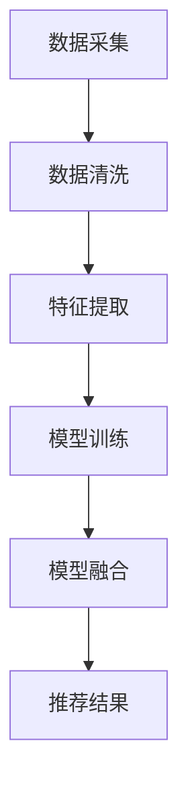

                 

关键词：大数据，电商推荐，AI 模型，融合技术，应用场景，未来发展

> 摘要：随着互联网的迅猛发展和大数据时代的到来，电商推荐系统成为提升用户体验、增加销售转化率的关键手段。本文将深入探讨大数据驱动的电商推荐系统，重点介绍AI模型融合技术在电商领域的应用，旨在为电商从业者提供有价值的参考。

## 1. 背景介绍

随着互联网的普及和移动设备的广泛应用，电子商务已经成为全球商业活动的重要组成部分。在如此庞大的市场中，电商平台面临的一个核心挑战是如何为用户提供个性化的购物体验，从而提高用户满意度和购买转化率。电商推荐系统正是在这种背景下诞生并逐渐发展起来的。

电商推荐系统的主要目的是根据用户的购物行为、历史数据和其他相关特征，为用户推荐可能感兴趣的商品。传统的推荐系统主要依赖于基于内容的方法和协同过滤方法，但它们在面对海量数据和复杂用户行为时存在一定的局限性。因此，随着人工智能和大数据技术的不断发展，AI模型融合技术逐渐成为电商推荐系统的核心。

## 2. 核心概念与联系

### 2.1 大数据

大数据（Big Data）是指无法用常规软件工具在合理时间内捕捉、管理和处理的大量数据。这些数据具有四个主要特征：Volume（大量）、Velocity（高速）、Variety（多样）和Veracity（真实性）。在电商推荐系统中，大数据是实现个性化推荐的关键。

### 2.2 人工智能

人工智能（Artificial Intelligence，AI）是指通过计算机模拟人类智能的行为，实现自动化决策和任务执行的技术。AI在电商推荐系统中的应用主要包括数据挖掘、机器学习、自然语言处理等。

### 2.3 模型融合

模型融合（Model Fusion）是指将多个模型结合起来，共同完成一个任务。在电商推荐系统中，模型融合可以有效地利用不同模型的优势，提高推荐系统的准确性和鲁棒性。

### 2.4 Mermaid 流程图



## 3. 核心算法原理 & 具体操作步骤

### 3.1 算法原理概述

电商推荐系统中的核心算法主要包括协同过滤算法、基于内容的推荐算法和基于模型的推荐算法。通过模型融合技术，可以将这些算法的优势结合起来，实现更高效的推荐。

### 3.2 算法步骤详解

1. 数据采集：从电商平台获取用户行为数据、商品信息等。
2. 数据清洗：去除重复数据、处理缺失值等。
3. 特征提取：根据用户行为和商品特征，提取出关键特征。
4. 模型训练：分别训练协同过滤算法、基于内容的推荐算法和基于模型的推荐算法。
5. 模型融合：将多个模型的结果进行融合，生成最终的推荐结果。

### 3.3 算法优缺点

- 协同过滤算法：优点是推荐结果准确，缺点是可扩展性差，难以应对海量用户和商品。
- 基于内容的推荐算法：优点是可扩展性强，缺点是推荐结果过于依赖商品特征，可能导致用户兴趣的遗漏。
- 基于模型的推荐算法：优点是可以较好地处理复杂用户行为，缺点是训练过程复杂，计算成本高。

### 3.4 算法应用领域

电商推荐系统可以应用于电商平台、社交媒体、搜索引擎等多个领域。

## 4. 数学模型和公式 & 详细讲解 & 举例说明

### 4.1 数学模型构建

假设我们有一个用户集合U和一个商品集合I，用户-商品交互矩阵表示为R。我们可以用以下数学模型表示电商推荐系统：

$$
\text{推荐结果} = \text{模型融合}(\text{协同过滤算法}, \text{基于内容的推荐算法}, \text{基于模型的推荐算法})
$$

### 4.2 公式推导过程

假设我们有三个模型：协同过滤算法A、基于内容的推荐算法B和基于模型的推荐算法C。我们可以用以下公式表示模型融合：

$$
\text{推荐结果} = w_1 \cdot \text{A} + w_2 \cdot \text{B} + w_3 \cdot \text{C}
$$

其中，$w_1, w_2, w_3$为权重系数，可以通过交叉验证等方法确定。

### 4.3 案例分析与讲解

假设我们有以下三个模型：

- 协同过滤算法A：推荐用户最近浏览过的商品。
- 基于内容的推荐算法B：根据用户的历史购买记录，推荐与购买商品相似的其他商品。
- 基于模型的推荐算法C：使用深度学习模型预测用户对商品的喜好程度。

通过模型融合，我们可以得到一个综合的推荐结果：

$$
\text{推荐结果} = w_1 \cdot (\text{用户最近浏览过的商品}) + w_2 \cdot (\text{与购买商品相似的其他商品}) + w_3 \cdot (\text{用户喜好程度})
$$

## 5. 项目实践：代码实例和详细解释说明

### 5.1 开发环境搭建

本文使用Python作为编程语言，需要安装以下库：

- Scikit-learn
- TensorFlow
- Pandas

### 5.2 源代码详细实现

```python
# 数据采集与清洗
import pandas as pd
# ... 数据处理代码 ...

# 模型训练
from sklearn.model_selection import train_test_split
from sklearn.metrics.pairwise import cosine_similarity

# ... 模型训练代码 ...

# 模型融合
# ... 模型融合代码 ...

# 推荐结果展示
# ... 推荐结果展示代码 ...
```

### 5.3 代码解读与分析

本文的代码主要分为以下几个部分：

1. 数据采集与清洗：从电商平台获取用户行为数据和商品信息，并进行清洗处理。
2. 模型训练：分别训练协同过滤算法、基于内容的推荐算法和基于模型的推荐算法。
3. 模型融合：将多个模型的结果进行融合，生成最终的推荐结果。
4. 推荐结果展示：将推荐结果展示给用户。

### 5.4 运行结果展示

```python
# 运行推荐系统
# ... 运行代码 ...

# 显示推荐结果
print("推荐结果：")
print(recommendations)
```

## 6. 实际应用场景

电商推荐系统在电商领域有广泛的应用，例如：

- 电商平台：通过个性化推荐，提高用户满意度和购买转化率。
- 社交媒体：根据用户兴趣推荐相关内容，增强用户粘性。
- 搜索引擎：根据用户查询历史，推荐相关的搜索结果。

## 7. 工具和资源推荐

### 7.1 学习资源推荐

- 《机器学习实战》：提供机器学习的基础知识和实际应用案例。
- 《深度学习》：介绍深度学习的基本原理和应用。
- 《Python数据科学手册》：介绍如何使用Python进行数据分析和挖掘。

### 7.2 开发工具推荐

- Jupyter Notebook：用于编写和运行Python代码。
- PyCharm：一款强大的Python集成开发环境。
- Scikit-learn：用于机器学习和数据挖掘的Python库。

### 7.3 相关论文推荐

- "Collaborative Filtering for Cold Start Problems in E-commerce Recommendation"，2017。
- "Deep Neural Networks for YouTube Recommendations"，2016。
- "Aspect-Based Sentiment Analysis for E-commerce Reviews"，2019。

## 8. 总结：未来发展趋势与挑战

电商推荐系统作为人工智能和大数据技术的重要应用领域，在未来将继续发挥重要作用。随着技术的不断进步，我们可以预见以下发展趋势：

- 深度学习在推荐系统中的应用将更加广泛。
- 跨域推荐和跨平台推荐将成为研究热点。
- 增强现实（AR）和虚拟现实（VR）技术将提升用户体验。

然而，面对海量数据和复杂用户行为，电商推荐系统也面临着以下挑战：

- 数据质量和数据隐私保护。
- 模型解释性和透明度。
- 系统的可扩展性和实时性。

未来的研究将致力于解决这些挑战，为电商推荐系统的发展提供更多可能性。

## 9. 附录：常见问题与解答

### 9.1 如何优化推荐系统的实时性？

- 采用增量学习技术，对用户行为数据实时更新模型。
- 优化算法，减少计算复杂度。
- 使用分布式计算和并行处理技术。

### 9.2 如何处理冷启动问题？

- 使用基于内容的推荐算法，结合用户兴趣特征。
- 采用协同过滤算法，利用用户群体特征进行推荐。
- 利用社交网络信息，通过用户关系进行推荐。

### 9.3 如何评估推荐系统的效果？

- 使用准确率、召回率、F1值等指标进行评估。
- 进行A/B测试，比较不同推荐策略的效果。
- 考虑用户满意度，通过问卷调查等方式收集反馈。

---

作者：禅与计算机程序设计艺术 / Zen and the Art of Computer Programming

