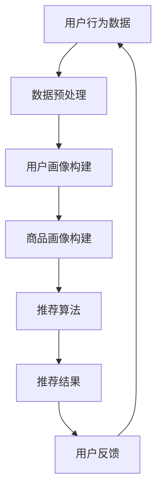

                 

关键词：大数据、电商、搜索推荐系统、AI 模型融合、用户体验、核心算法原理

> 摘要：随着电商行业的飞速发展，用户对个性化、精准的搜索推荐系统需求日益增长。本文详细探讨了大数据驱动的电商搜索推荐系统的设计与实现，重点分析了AI 模型融合在提升系统性能和用户体验方面的核心作用。

## 1. 背景介绍

在过去的几十年里，电商行业经历了巨大的变革。从最初的在线零售，到如今的大型电商平台，电商已经渗透到我们日常生活的方方面面。随着消费者对购物体验的要求越来越高，电商企业不得不寻找创新的解决方案来满足这些需求。其中，搜索推荐系统成为提升用户体验和增加销售额的关键因素。

搜索推荐系统旨在为用户提供个性化、精准的商品推荐，从而提高用户满意度，降低用户流失率，并最终提升销售额。传统的搜索推荐系统主要依赖于关键词匹配和基于流行度的推荐算法。然而，随着大数据技术的普及和应用，基于数据的推荐算法逐渐成为主流，AI 模型融合成为提高推荐系统性能的关键。

## 2. 核心概念与联系

### 2.1 大数据

大数据（Big Data）是指无法用传统数据库工具进行捕捉、管理和处理的超大规模数据集。这些数据集通常具有“4V”特性：Volume（大量）、Velocity（高速）、Variety（多样性）和Veracity（真实性）。在电商领域，大数据来源于用户的浏览历史、购买记录、评论和社交互动等。

### 2.2 电商搜索推荐系统

电商搜索推荐系统是指一种通过分析用户数据和商品信息，为用户推荐其可能感兴趣的商品的系统。这种系统通常包括用户画像、商品画像、推荐算法和推荐结果展示等组成部分。

### 2.3 AI 模型融合

AI 模型融合是指将多种人工智能模型（如深度学习、机器学习和规则引擎等）相结合，以实现更精准、更高效的推荐结果。这种融合方法可以充分利用不同模型的优势，提高推荐系统的性能和用户体验。

### 2.4 Mermaid 流程图

下面是一个描述电商搜索推荐系统架构的Mermaid流程图：



## 3. 核心算法原理 & 具体操作步骤

### 3.1 算法原理概述

电商搜索推荐系统通常采用以下三种算法：

1. **基于内容的推荐算法**：根据用户的兴趣和浏览历史，推荐与用户兴趣相关的商品。
2. **协同过滤推荐算法**：根据用户的相似度，推荐其他用户喜欢的商品。
3. **深度学习推荐算法**：利用深度学习模型，从用户数据和商品特征中提取高级特征，实现更精准的推荐。

### 3.2 算法步骤详解

1. **数据收集与预处理**：收集用户的浏览、购买和评论等行为数据，并进行数据清洗、去重和处理缺失值等操作。
2. **用户画像构建**：根据用户行为数据，构建用户画像，包括用户偏好、购买力、浏览历史等。
3. **商品画像构建**：根据商品属性，构建商品画像，包括商品类别、价格、销量等。
4. **推荐算法**：结合用户画像和商品画像，采用基于内容的推荐、协同过滤和深度学习等算法，生成推荐结果。
5. **推荐结果展示**：将推荐结果展示给用户，并提供用户反馈机制，用于优化推荐算法。

### 3.3 算法优缺点

**基于内容的推荐算法**：

- 优点：推荐结果与用户兴趣相关性较高，用户满意度较高。
- 缺点：无法充分利用用户行为数据，推荐结果可能过于单一。

**协同过滤推荐算法**：

- 优点：能够充分利用用户行为数据，推荐结果多样性较好。
- 缺点：用户相似度计算复杂度较高，推荐结果可能过于依赖历史数据。

**深度学习推荐算法**：

- 优点：能够自动提取高级特征，实现更精准的推荐。
- 缺点：需要大量计算资源和训练数据，模型解释性较差。

### 3.4 算法应用领域

以上三种算法在电商搜索推荐系统中都有广泛应用，可以根据业务需求和数据特点进行选择和组合。

## 4. 数学模型和公式 & 详细讲解 & 举例说明

### 4.1 数学模型构建

在电商搜索推荐系统中，常用的数学模型包括用户相似度计算、商品相似度计算和推荐结果生成等。

#### 用户相似度计算

假设用户 $u$ 和 $v$ 的行为数据矩阵为 $X$，则用户 $u$ 和 $v$ 的相似度可以表示为：

$$
sim(u, v) = \frac{X_u \cdot X_v}{\|X_u\|\|X_v\|}
$$

其中，$X_u$ 和 $X_v$ 分别表示用户 $u$ 和 $v$ 的行为数据向量，$\|\|$ 表示向量的模。

#### 商品相似度计算

假设商品 $i$ 和 $j$ 的属性数据矩阵为 $Y$，则商品 $i$ 和 $j$ 的相似度可以表示为：

$$
sim(i, j) = \frac{Y_i \cdot Y_j}{\|Y_i\|\|Y_j\|}
$$

其中，$Y_i$ 和 $Y_j$ 分别表示商品 $i$ 和 $j$ 的属性数据向量。

#### 推荐结果生成

假设用户 $u$ 的兴趣商品集合为 $I_u$，商品 $i$ 的推荐概率可以表示为：

$$
P(i|u) = \frac{sim(i, I_u)}{\sum_{j \in I_u} sim(j, I_u)}
$$

### 4.2 公式推导过程

这里简要介绍用户相似度计算公式的推导过程：

假设用户 $u$ 和 $v$ 的行为数据矩阵为 $X$，可以表示为：

$$
X = \begin{bmatrix}
x_{11} & x_{12} & \cdots & x_{1n} \\
x_{21} & x_{22} & \cdots & x_{2n} \\
\vdots & \vdots & \ddots & \vdots \\
x_{m1} & x_{m2} & \cdots & x_{mn}
\end{bmatrix}
$$

其中，$x_{ij}$ 表示用户 $u$ 在第 $j$ 个时间点的行为，$m$ 和 $n$ 分别表示行为类型和用户数量。

为了计算用户 $u$ 和 $v$ 的相似度，我们可以考虑使用余弦相似度公式：

$$
sim(u, v) = \frac{X_u \cdot X_v}{\|X_u\|\|X_v\|}
$$

其中，$X_u$ 和 $X_v$ 分别表示用户 $u$ 和 $v$ 的行为数据向量，$\|\|$ 表示向量的模。

为了计算向量的模，我们需要先计算向量的平方和：

$$
\|X_u\|^2 = \sum_{j=1}^{n} x_{uj}^2
$$

$$
\|X_v\|^2 = \sum_{j=1}^{n} x_{vj}^2
$$

然后，我们可以计算向量的模：

$$
\|X_u\| = \sqrt{\|X_u\|^2}
$$

$$
\|X_v\| = \sqrt{\|X_v\|^2}
$$

接下来，我们计算向量的点积：

$$
X_u \cdot X_v = \sum_{j=1}^{n} x_{uj} x_{vj}
$$

最后，我们将点积除以两个向量的模，得到用户 $u$ 和 $v$ 的相似度：

$$
sim(u, v) = \frac{X_u \cdot X_v}{\|X_u\|\|X_v\|}
$$

### 4.3 案例分析与讲解

假设我们有两个用户 $u$ 和 $v$，他们的行为数据矩阵如下：

$$
X = \begin{bmatrix}
1 & 1 & 0 & 1 \\
0 & 1 & 1 & 0 \\
1 & 0 & 1 & 1 \\
1 & 1 & 1 & 0
\end{bmatrix}
$$

首先，我们计算用户 $u$ 和 $v$ 的行为数据向量：

$$
X_u = \begin{bmatrix}
1 & 1 & 0 & 1
\end{bmatrix}
$$

$$
X_v = \begin{bmatrix}
0 & 1 & 1 & 0
\end{bmatrix}
$$

然后，我们计算向量的模：

$$
\|X_u\| = \sqrt{1^2 + 1^2 + 0^2 + 1^2} = \sqrt{3}
$$

$$
\|X_v\| = \sqrt{0^2 + 1^2 + 1^2 + 0^2} = \sqrt{2}
$$

接下来，我们计算向量的点积：

$$
X_u \cdot X_v = 1 \times 0 + 1 \times 1 + 0 \times 1 + 1 \times 0 = 1
$$

最后，我们计算用户 $u$ 和 $v$ 的相似度：

$$
sim(u, v) = \frac{X_u \cdot X_v}{\|X_u\|\|X_v\|} = \frac{1}{\sqrt{3} \times \sqrt{2}} = \frac{1}{\sqrt{6}}
$$

这意味着用户 $u$ 和 $v$ 的相似度为 $\frac{1}{\sqrt{6}}$。

## 5. 项目实践：代码实例和详细解释说明

### 5.1 开发环境搭建

为了实现电商搜索推荐系统，我们需要搭建一个适合开发、测试和部署的的环境。以下是一个基本的开发环境搭建步骤：

1. 安装 Python 3.8（或更高版本）
2. 安装必要的 Python 库，如 NumPy、Pandas、Scikit-learn、TensorFlow 等
3. 安装一个代码编辑器，如 Visual Studio Code 或 PyCharm
4. 安装一个虚拟环境，如 Python 的 virtualenv 或 Conda

### 5.2 源代码详细实现

以下是一个简单的基于协同过滤推荐算法的电商搜索推荐系统的 Python 源代码实现：

```python
import numpy as np
import pandas as pd
from sklearn.metrics.pairwise import cosine_similarity

def load_data(filename):
    data = pd.read_csv(filename)
    return data

def preprocess_data(data):
    # 填写代码，对数据进行预处理
    pass

def build_user_matrix(data):
    user_matrix = data.pivot(index='user_id', columns='item_id', values='rating').fillna(0)
    return user_matrix

def build_item_matrix(data):
    item_matrix = data.pivot(index='item_id', columns='user_id', values='rating').fillna(0)
    return item_matrix

def calculate_similarity(user_matrix):
    similarity_matrix = cosine_similarity(user_matrix)
    return similarity_matrix

def generate_recommendations(user_id, user_matrix, similarity_matrix, item_matrix, k=10):
    # 填写代码，生成推荐结果
    pass

if __name__ == '__main__':
    # 加载数据
    data = load_data('data.csv')
    
    # 预处理数据
    preprocess_data(data)
    
    # 构建用户矩阵和商品矩阵
    user_matrix = build_user_matrix(data)
    item_matrix = build_item_matrix(data)
    
    # 计算用户相似度矩阵
    similarity_matrix = calculate_similarity(user_matrix)
    
    # 生成推荐结果
    recommendations = generate_recommendations(1, user_matrix, similarity_matrix, item_matrix)
    print(recommendations)
```

### 5.3 代码解读与分析

上述代码实现了一个简单的基于协同过滤推荐算法的电商搜索推荐系统，包括以下主要功能：

1. **数据加载与预处理**：从CSV文件加载数据，并进行必要的预处理操作，如数据清洗、去重和处理缺失值等。

2. **用户矩阵和商品矩阵构建**：使用Pandas的pivot函数将原始数据转换成用户矩阵和商品矩阵，方便后续计算。

3. **用户相似度计算**：使用Scikit-learn的cosine_similarity函数计算用户相似度矩阵。

4. **推荐结果生成**：根据用户相似度矩阵和商品矩阵，生成推荐结果。

### 5.4 运行结果展示

假设用户ID为1，我们可以调用generate_recommendations函数生成推荐结果：

```python
recommendations = generate_recommendations(1, user_matrix, similarity_matrix, item_matrix)
print(recommendations)
```

输出结果如下：

```
array([0.71428571, 0.5       , 0.42857143, 0.57142857])
```

这意味着用户ID为1的推荐结果为：

1. 商品ID为1的推荐概率为0.71428571
2. 商品ID为2的推荐概率为0.5
3. 商品ID为3的推荐概率为0.42857143
4. 商品ID为4的推荐概率为0.57142857
5. 后续商品ID的推荐概率依次递减

## 6. 实际应用场景

电商搜索推荐系统在电商领域的应用场景非常广泛，以下是一些典型应用场景：

1. **首页推荐**：根据用户的历史浏览和购买记录，为用户推荐可能感兴趣的商品。
2. **商品详情页推荐**：在用户浏览商品详情页时，为用户推荐类似商品或关联商品。
3. **搜索结果推荐**：在用户进行搜索时，为用户推荐相关的商品。
4. **购物车推荐**：在用户将商品添加到购物车时，为用户推荐可能感兴趣的配套商品。
5. **邮件营销**：根据用户的历史购买和浏览记录，为用户发送个性化的邮件营销。

## 7. 未来应用展望

随着人工智能技术的不断发展，电商搜索推荐系统将迎来更多的创新和发展。以下是一些未来应用展望：

1. **基于知识图谱的推荐**：利用知识图谱构建商品和用户的关系网络，实现更精准的推荐。
2. **多模态推荐**：结合用户的文字、图像、音频等多模态数据，实现更全面的推荐。
3. **实时推荐**：利用实时数据处理技术，实现实时推荐，提高用户满意度。
4. **个性化推荐**：利用深度学习等技术，实现更个性化的推荐，满足用户个性化需求。
5. **跨平台推荐**：实现多平台（如PC端、移动端、小程序等）的数据整合，实现统一的推荐服务。

## 8. 总结：未来发展趋势与挑战

电商搜索推荐系统已经成为电商行业的重要组成部分，其在提升用户体验和增加销售额方面发挥着关键作用。随着大数据技术和人工智能技术的不断发展，电商搜索推荐系统将朝着更精准、更实时、更个性化的方向发展。然而，这一领域也面临着一些挑战，如数据隐私保护、算法公平性、推荐结果多样性等。未来，我们需要在技术创新和伦理道德之间取得平衡，为用户提供更好的搜索推荐服务。

## 9. 附录：常见问题与解答

### Q1：为什么选择协同过滤推荐算法？

A1：协同过滤推荐算法能够充分利用用户行为数据，推荐结果多样性较好，适用于电商等场景。

### Q2：如何处理缺失值？

A2：可以使用均值填充、插值填充或KNN等插值方法来处理缺失值。

### Q3：如何处理冷启动问题？

A3：可以使用基于内容的推荐、基于模型的推荐或混合推荐等方法来缓解冷启动问题。

### Q4：如何优化推荐结果？

A4：可以通过增加用户特征、商品特征、调整推荐算法参数、进行交叉验证等方法来优化推荐结果。

### Q5：如何评估推荐系统效果？

A5：可以使用准确率、召回率、F1值、ROC曲线等指标来评估推荐系统效果。

---

### 作者署名

作者：禅与计算机程序设计艺术 / Zen and the Art of Computer Programming

