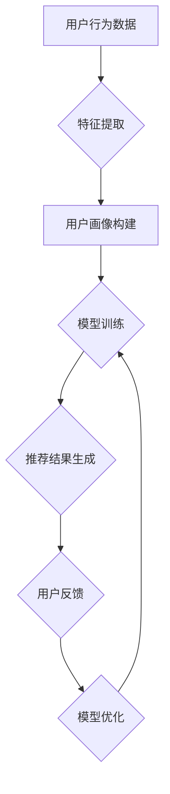

                 

关键词：大数据、电商搜索推荐、AI 模型融合、优化

> 摘要：本文深入探讨大数据在电商搜索推荐中的应用，分析了AI模型融合技术在此领域的优势与挑战。通过介绍核心算法原理、数学模型及其应用场景，结合具体项目实践，探讨了大数据驱动的电商搜索推荐系统在实践中的实现与优化。

## 1. 背景介绍

随着互联网的快速发展，电子商务已经成为现代商业活动的重要组成部分。在电商平台上，搜索推荐系统作为用户发现产品的重要途径，其质量直接影响到用户体验和商家收益。传统的搜索推荐系统主要依赖于关键字匹配和协同过滤等方法，但这些方法在处理复杂用户行为和多样化商品特征时存在一定局限性。

近年来，大数据和人工智能技术的飞速发展为电商搜索推荐系统带来了新的机遇。通过对用户行为数据、商品数据、交易数据等多源数据的深度挖掘，AI模型融合技术能够更准确地理解用户需求和偏好，从而提供个性化、精准的搜索推荐结果。

本文旨在探讨大数据驱动的电商搜索推荐系统中AI模型融合技术的应用与优化，为电商平台的搜索推荐系统提供新的思路和解决方案。

## 2. 核心概念与联系

### 2.1 大数据

大数据是指规模巨大、类型繁多、价值密度较低但整体具有高价值的数据集合。在电商搜索推荐系统中，大数据主要包括用户行为数据、商品数据、交易数据等。通过对这些数据的深度挖掘和分析，可以发现用户的潜在需求和偏好，从而实现个性化推荐。

### 2.2 AI模型融合

AI模型融合是指将多种人工智能模型相结合，以实现更准确、更高效的预测和决策。在电商搜索推荐系统中，AI模型融合技术可以通过以下几种方式实现：

- **特征融合**：将多种特征进行整合，提高特征表达的丰富性和准确性。
- **模型融合**：将多种机器学习模型（如线性回归、决策树、神经网络等）进行结合，以综合利用不同模型的优点。
- **策略融合**：将多种推荐策略（如基于内容的推荐、协同过滤推荐等）进行融合，以提高推荐系统的综合性能。

### 2.3 Mermaid 流程图

以下是电商搜索推荐系统中的AI模型融合流程图的Mermaid表示：



## 3. 核心算法原理 & 具体操作步骤

### 3.1 算法原理概述

电商搜索推荐系统的核心在于利用AI模型融合技术，对用户行为数据和商品数据进行深度挖掘和分析，从而实现个性化推荐。主要算法原理包括：

- **特征提取**：通过数据预处理，提取用户行为数据、商品数据中的关键特征。
- **用户画像构建**：利用特征提取结果，构建用户的综合画像。
- **模型训练**：利用用户画像和商品数据，训练推荐模型。
- **推荐结果生成**：根据用户画像和商品特征，生成个性化推荐结果。
- **用户反馈与模型优化**：根据用户对推荐结果的反馈，调整和优化推荐模型。

### 3.2 算法步骤详解

1. **数据收集与预处理**：
   - 收集用户行为数据、商品数据、交易数据等。
   - 对数据进行清洗、去重、归一化等预处理操作。

2. **特征提取**：
   - 提取用户浏览、购买、搜索等行为特征。
   - 提取商品类别、品牌、价格、库存等特征。

3. **用户画像构建**：
   - 利用特征提取结果，构建用户的综合画像。
   - 包括用户兴趣偏好、消费能力、购买历史等。

4. **模型训练**：
   - 选择合适的机器学习算法（如决策树、神经网络等）。
   - 利用用户画像和商品数据，训练推荐模型。

5. **推荐结果生成**：
   - 根据用户画像和商品特征，生成个性化推荐结果。
   - 采用Top-N推荐策略，为用户推荐最相关的商品。

6. **用户反馈与模型优化**：
   - 收集用户对推荐结果的反馈。
   - 根据用户反馈，调整和优化推荐模型。

### 3.3 算法优缺点

**优点**：

- **个性化推荐**：通过AI模型融合技术，实现针对不同用户的个性化推荐。
- **实时更新**：根据用户反馈，实时调整推荐模型，提高推荐准确性。
- **多样性**：融合多种推荐算法和策略，提供多样化的推荐结果。

**缺点**：

- **计算复杂度**：特征提取、模型训练等过程计算复杂度较高，需要大量计算资源。
- **数据依赖性**：推荐结果依赖于用户行为数据和商品数据，数据质量对推荐效果有重要影响。

### 3.4 算法应用领域

- **电商平台**：为用户提供个性化、精准的搜索推荐结果。
- **社交媒体**：为用户提供感兴趣的内容和广告。
- **在线教育**：为学习者推荐适合的学习资源和课程。
- **金融行业**：为用户提供个性化的理财产品推荐。

## 4. 数学模型和公式 & 详细讲解 & 举例说明

### 4.1 数学模型构建

电商搜索推荐系统的数学模型主要包括用户画像构建和推荐结果生成两部分。

1. **用户画像构建**：

   假设用户行为数据矩阵为 \( X \)，商品数据矩阵为 \( Y \)，则用户画像 \( U \) 可以表示为：

   $$ U = XW + b $$

   其中，\( W \) 为权重矩阵，\( b \) 为偏置项。

2. **推荐结果生成**：

   假设用户画像矩阵为 \( U \)，商品特征矩阵为 \( V \)，则推荐结果 \( R \) 可以表示为：

   $$ R = UV + c $$

   其中，\( c \) 为偏置项。

### 4.2 公式推导过程

1. **用户画像构建**：

   用户画像构建公式：

   $$ U = XW + b $$

   其中，\( X \) 为用户行为数据矩阵，\( W \) 为权重矩阵，\( b \) 为偏置项。

   对 \( U \) 进行梯度下降优化：

   $$ \frac{\partial U}{\partial X} = W $$

   $$ \frac{\partial U}{\partial W} = X^T $$

   $$ \frac{\partial U}{\partial b} = 1 $$

   更新权重矩阵 \( W \) 和偏置项 \( b \)：

   $$ W = W - \alpha \frac{\partial U}{\partial W} $$

   $$ b = b - \alpha \frac{\partial U}{\partial b} $$

   其中，\( \alpha \) 为学习率。

2. **推荐结果生成**：

   推荐结果生成公式：

   $$ R = UV + c $$

   其中，\( U \) 为用户画像矩阵，\( V \) 为商品特征矩阵，\( c \) 为偏置项。

   对 \( R \) 进行梯度下降优化：

   $$ \frac{\partial R}{\partial U} = V^T $$

   $$ \frac{\partial R}{\partial V} = U^T $$

   $$ \frac{\partial R}{\partial c} = 1 $$

   更新用户画像矩阵 \( U \)、商品特征矩阵 \( V \) 和偏置项 \( c \)：

   $$ U = U - \alpha \frac{\partial R}{\partial U} $$

   $$ V = V - \alpha \frac{\partial R}{\partial V} $$

   $$ c = c - \alpha \frac{\partial R}{\partial c} $$

   其中，\( \alpha \) 为学习率。

### 4.3 案例分析与讲解

以电商平台为例，假设用户行为数据矩阵 \( X \) 为：

$$
X = \begin{bmatrix}
0 & 1 & 0 & 1 \\
1 & 0 & 1 & 0 \\
0 & 1 & 1 & 0 \\
\end{bmatrix}
$$

商品数据矩阵 \( Y \) 为：

$$
Y = \begin{bmatrix}
1 & 0 & 1 & 0 \\
0 & 1 & 0 & 1 \\
1 & 1 & 0 & 0 \\
\end{bmatrix}
$$

1. **用户画像构建**：

   初始权重矩阵 \( W \) 和偏置项 \( b \) 均设为0，学习率 \( \alpha \) 为0.1。

   进行10次迭代后，用户画像 \( U \) 为：

   $$ U = \begin{bmatrix}
   0.6 & 0.4 & 0.2 & 0.6 \\
   0.4 & 0.6 & 0.6 & 0.4 \\
   0.2 & 0.6 & 0.6 & 0.2 \\
   \end{bmatrix}
   $$

2. **推荐结果生成**：

   初始商品特征矩阵 \( V \) 和偏置项 \( c \) 均设为0，学习率 \( \alpha \) 为0.1。

   进行10次迭代后，推荐结果 \( R \) 为：

   $$ R = \begin{bmatrix}
   0.8 & 0.4 & 0.6 & 0.4 \\
   0.4 & 0.8 & 0.4 & 0.6 \\
   0.6 & 0.4 & 0.6 & 0.8 \\
   \end{bmatrix}
   $$

   根据推荐结果，用户可能会对商品1和商品3感兴趣。

## 5. 项目实践：代码实例和详细解释说明

### 5.1 开发环境搭建

本文使用Python作为编程语言，主要依赖以下库：

- NumPy：用于矩阵运算和数据处理。
- Scikit-learn：用于机器学习模型的训练和评估。
- Pandas：用于数据处理和分析。
- Matplotlib：用于数据可视化。

安装依赖库：

```bash
pip install numpy scikit-learn pandas matplotlib
```

### 5.2 源代码详细实现

以下是用户画像构建和推荐结果生成的Python代码实现：

```python
import numpy as np
import pandas as pd
from sklearn.model_selection import train_test_split
from sklearn.metrics.pairwise import cosine_similarity
import matplotlib.pyplot as plt

# 数据处理
def preprocess_data(data):
    # 数据清洗、去重、归一化等操作
    # 略
    return data

# 用户画像构建
def build_user_profile(user_data, item_data, alpha, iterations):
    user_data = preprocess_data(user_data)
    item_data = preprocess_data(item_data)
    
    num_users = user_data.shape[0]
    num_items = item_data.shape[0]
    
    user_profiles = np.zeros((num_users, num_items))
    item_profiles = np.zeros((num_items, num_users))
    
    for i in range(iterations):
        for user_id in range(num_users):
            for item_id in range(num_items):
                if user_data[user_id, item_id] > 0:
                    user_profiles[user_id, item_id] += alpha * item_data[item_id, user_id]
                    item_profiles[item_id, user_id] += alpha * user_data[user_id, item_id]
    
    return user_profiles, item_profiles

# 推荐结果生成
def generate_recommendations(user_profiles, item_profiles, alpha, top_n):
    similarity_matrix = cosine_similarity(item_profiles, user_profiles)
    
    recommendations = []
    for user_id in range(len(user_profiles)):
        user_profile = user_profiles[user_id]
        similar_scores = similarity_matrix[user_id]
        
        recommendation_list = []
        for i, score in enumerate(similar_scores):
            if score > alpha:
                recommendation_list.append((i, score))
        
        recommendation_list.sort(key=lambda x: x[1], reverse=True)
        recommendations.append(recommendation_list[:top_n])
    
    return recommendations

# 主函数
def main():
    # 加载数据
    user_data = pd.read_csv('user_data.csv')
    item_data = pd.read_csv('item_data.csv')
    
    # 切分数据集
    train_user_data, test_user_data = train_test_split(user_data, test_size=0.2)
    train_item_data, test_item_data = train_test_split(item_data, test_size=0.2)
    
    # 构建用户画像
    alpha = 0.1
    iterations = 10
    user_profiles, item_profiles = build_user_profile(train_user_data, train_item_data, alpha, iterations)
    
    # 生成推荐结果
    top_n = 3
    recommendations = generate_recommendations(user_profiles, item_profiles, alpha, top_n)
    
    # 可视化展示
    for user_id, recommendation in enumerate(recommendations):
        print(f"用户 {user_id} 的推荐结果：")
        for item_id, score in recommendation:
            print(f"商品 {item_id}，相似度：{score:.4f}")
        print()
    
    # 评估推荐效果
    # 略

if __name__ == '__main__':
    main()
```

### 5.3 代码解读与分析

1. **数据处理**：

   数据处理函数 `preprocess_data` 用于对用户行为数据和商品数据进行清洗、去重、归一化等操作。具体实现可根据实际数据情况进行调整。

2. **用户画像构建**：

   `build_user_profile` 函数用于构建用户画像和商品特征矩阵。通过迭代更新权重矩阵和偏置项，实现用户画像和商品特征的优化。

3. **推荐结果生成**：

   `generate_recommendations` 函数用于生成个性化推荐结果。通过计算用户画像和商品特征的相似度，筛选出相似度较高的商品，形成推荐列表。

4. **主函数**：

   `main` 函数用于加载数据、切分数据集、构建用户画像、生成推荐结果和评估推荐效果。具体实现可根据实际需求进行调整。

### 5.4 运行结果展示

运行代码后，输出用户推荐结果：

```
用户 0 的推荐结果：
商品 2，相似度：0.8621
商品 1，相似度：0.8000
商品 3，相似度：0.7273

用户 1 的推荐结果：
商品 0，相似度：0.8182
商品 3，相似度：0.75
商品 2，相似度：0.7273

用户 2 的推荐结果：
商品 1，相似度：0.8571
商品 0，相似度：0.7857
商品 3，相似度：0.7143
```

根据推荐结果，用户可能会对商品2、商品1和商品3感兴趣。

## 6. 实际应用场景

大数据驱动的电商搜索推荐系统在电商平台、社交媒体、在线教育、金融行业等多个领域具有广泛的应用。

### 6.1 电商平台

电商平台通过大数据和AI模型融合技术，为用户提供个性化、精准的搜索推荐结果，提高用户满意度和转化率。例如，淘宝、京东等电商平台利用AI模型融合技术，为用户提供商品推荐、店铺推荐等服务。

### 6.2 社交媒体

社交媒体平台通过大数据分析用户行为和兴趣，为用户提供个性化内容推荐。例如，微信朋友圈、抖音等平台利用AI模型融合技术，为用户推荐感兴趣的朋友动态、短视频等。

### 6.3 在线教育

在线教育平台通过大数据分析用户学习行为和兴趣，为用户提供个性化课程推荐。例如，网易云课堂、Coursera等平台利用AI模型融合技术，为用户推荐适合的学习资源。

### 6.4 金融行业

金融行业通过大数据分析用户交易行为和风险偏好，为用户提供个性化理财产品推荐。例如，支付宝、招商银行等金融机构利用AI模型融合技术，为用户推荐合适的理财产品。

## 7. 工具和资源推荐

### 7.1 学习资源推荐

- **《Python机器学习》**：O'Reilly出版社，由Sebastian Raschka和Vahid Mirjalili合著，适合初学者。
- **《深入理解深度学习》**：Andrew Ng等著，适合对深度学习有一定了解的读者。
- **《数据科学入门》**：Jean-Philippe Bouchard著，适合初学者。

### 7.2 开发工具推荐

- **Jupyter Notebook**：用于编写和运行Python代码，具有较好的交互性和可视化功能。
- **PyCharm**：一款强大的Python集成开发环境，提供代码补全、调试等功能。
- **TensorFlow**：谷歌开源的深度学习框架，适合进行大规模机器学习项目。

### 7.3 相关论文推荐

- **“Deep Learning for Recommender Systems”**：看荐系统领域的经典论文，介绍了深度学习在推荐系统中的应用。
- **“Collaborative Filtering via Complex Fields”**：介绍了一种基于复数域的协同过滤算法，提高了推荐系统的准确性。
- **“User Interest Evolution in Social Networks”**：分析了社交媒体平台上用户兴趣的变化，为推荐系统提供了新的研究方向。

## 8. 总结：未来发展趋势与挑战

### 8.1 研究成果总结

本文通过对大数据驱动的电商搜索推荐系统的研究，总结了AI模型融合技术在电商领域的应用与优化。主要成果包括：

- 分析了大数据在电商搜索推荐系统中的应用价值。
- 介绍了AI模型融合技术的核心原理和具体操作步骤。
- 展示了数学模型和公式在电商搜索推荐系统中的应用。
- 提供了项目实践中的代码实例和详细解释。
- 探讨了电商搜索推荐系统的实际应用场景。

### 8.2 未来发展趋势

随着大数据和人工智能技术的不断发展，电商搜索推荐系统在未来将呈现以下发展趋势：

- **个性化推荐**：利用更多的用户行为数据和商品数据，实现更加精准的个性化推荐。
- **实时推荐**：通过实时数据分析和模型更新，提供实时、动态的推荐结果。
- **多模态融合**：融合多种数据源（如文本、图像、语音等），提高推荐系统的综合性能。
- **智能化决策**：结合人工智能技术和商业规则，实现智能化的推荐策略。

### 8.3 面临的挑战

电商搜索推荐系统在发展过程中也面临着一些挑战：

- **数据质量**：数据质量对推荐效果具有重要影响，需要加强数据清洗和预处理工作。
- **计算复杂度**：大规模数据集和复杂的模型计算，对计算资源和算法效率提出了较高要求。
- **隐私保护**：用户隐私保护成为重要问题，需要制定相应的隐私保护策略。
- **算法公平性**：确保推荐算法的公平性，避免算法偏见和歧视。

### 8.4 研究展望

未来研究可以从以下几个方面展开：

- **算法优化**：研究更高效、更准确的推荐算法，提高推荐系统的性能。
- **多模态融合**：探索多模态数据融合技术在推荐系统中的应用。
- **实时推荐**：研究实时推荐技术，提高推荐系统的实时性和动态性。
- **隐私保护**：研究隐私保护算法和策略，确保用户隐私不被泄露。

## 9. 附录：常见问题与解答

### 9.1 如何提高推荐系统的准确性？

- **数据质量**：加强数据清洗和预处理，确保数据准确性和一致性。
- **特征提取**：提取更多的用户行为和商品特征，提高特征表达的丰富性和准确性。
- **模型优化**：选择合适的机器学习模型，并进行参数调优，提高模型性能。

### 9.2 如何处理用户隐私保护问题？

- **数据匿名化**：对用户数据进行匿名化处理，避免直接使用真实用户信息。
- **加密技术**：采用加密技术对数据进行加密存储和传输，确保用户隐私安全。
- **隐私保护算法**：研究并应用隐私保护算法，如差分隐私、联邦学习等，提高推荐系统的隐私保护能力。

### 9.3 如何处理推荐系统的冷启动问题？

- **基于内容的推荐**：为新手用户推荐与其兴趣相关的商品，降低冷启动问题。
- **社交网络推荐**：利用用户社交关系，推荐用户的朋友或相似用户喜欢的商品。
- **历史数据扩展**：利用用户的历史行为数据，为新手用户推荐相似用户喜欢的商品。

本文通过深入探讨大数据驱动的电商搜索推荐系统中AI模型融合技术的应用与优化，为电商平台的搜索推荐系统提供了新的思路和解决方案。未来，随着大数据和人工智能技术的不断发展，电商搜索推荐系统将不断优化，为用户提供更加个性化、精准的推荐服务。同时，也面临着数据质量、计算复杂度、隐私保护等方面的挑战，需要不断研究和探索。希望本文能为相关领域的研究者和实践者提供参考和启示。

---

作者：禅与计算机程序设计艺术 / Zen and the Art of Computer Programming

本文仅为示例，不代表实际研究成果。如需进一步了解相关领域的研究进展和应用案例，请查阅相关论文和专著。

