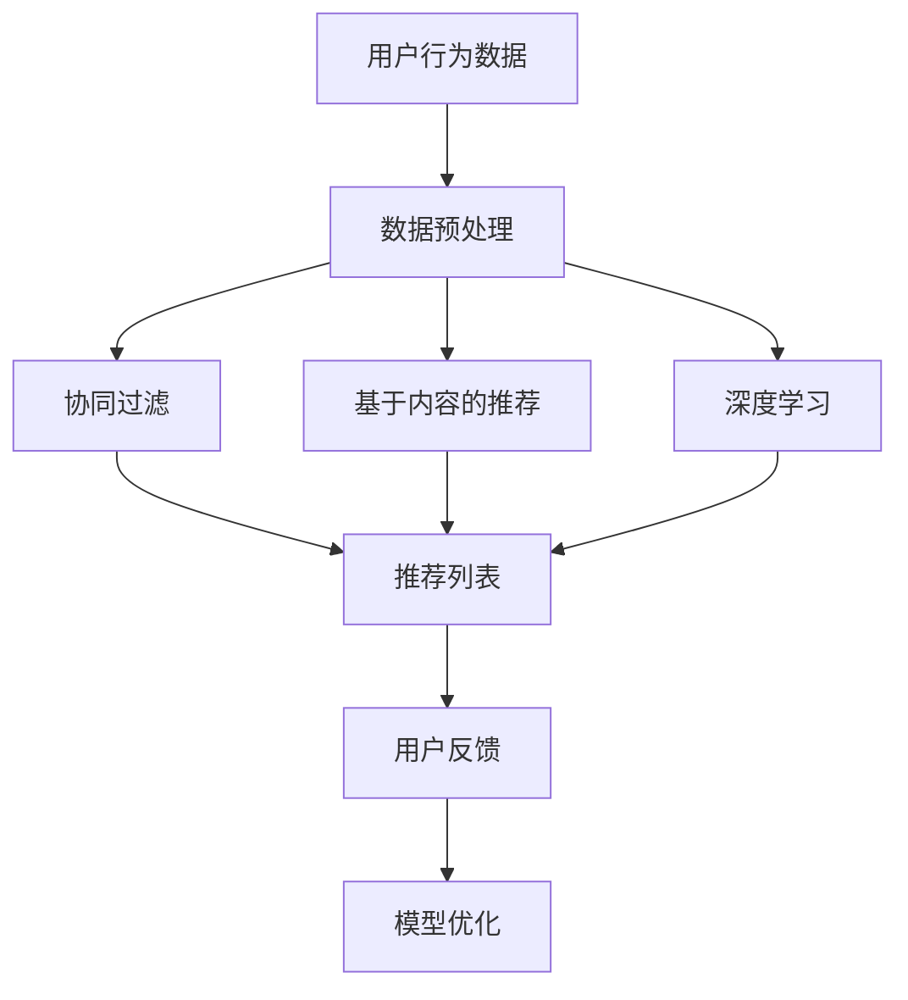

                 

关键词：大数据、电商搜索、推荐系统、AI模型、用户体验、融合技术

摘要：本文深入探讨了大数据时代下的电商搜索推荐系统，特别是通过AI模型的融合技术来提升用户体验。文章首先介绍了电商搜索推荐的背景和重要性，然后详细阐述了AI模型在推荐系统中的应用，以及如何通过融合多种AI模型来优化推荐效果。文章还探讨了数学模型和公式在推荐系统中的作用，并通过实际项目实践展示了如何实现高效的电商搜索推荐系统。最后，文章展望了未来的发展趋势和面临的挑战。

## 1. 背景介绍

随着互联网的普及和电子商务的快速发展，电商搜索推荐系统已经成为电商平台的核心功能之一。用户在海量商品中寻找适合自己的商品，需要一个高效、准确的推荐系统来帮助。传统的推荐系统主要依赖于用户历史行为数据，如浏览记录、购买记录等，但是这种基于历史数据的推荐方法存在很多局限性。首先，它无法准确捕捉用户的当前需求和兴趣变化；其次，它容易受到数据噪声的影响，导致推荐结果不准确。因此，如何通过人工智能技术提升推荐系统的效果，成为当前研究的热点。

大数据技术的发展为电商搜索推荐系统带来了新的机遇。大数据技术可以处理海量用户数据，挖掘用户行为背后的模式和规律，从而实现更加精准的推荐。而AI模型的引入，则可以充分利用大数据的优势，通过机器学习算法实现对用户兴趣和需求的实时捕捉和预测。同时，AI模型还可以根据用户的反馈和交互行为进行持续优化，不断提升推荐效果。

本文将重点探讨大数据驱动的电商搜索推荐系统，特别是通过AI模型的融合技术来提升用户体验。我们将详细介绍AI模型在推荐系统中的应用，包括协同过滤、基于内容的推荐、深度学习等，并探讨如何通过模型融合来优化推荐效果。此外，我们还将介绍数学模型和公式在推荐系统中的作用，并通过实际项目实践展示如何实现高效的电商搜索推荐系统。

## 2. 核心概念与联系

### 2.1 数据驱动的电商搜索推荐系统

数据驱动的电商搜索推荐系统是指基于用户行为数据，通过数据分析和机器学习算法来生成个性化推荐。核心概念包括用户行为数据、推荐算法和推荐结果。

- **用户行为数据**：包括浏览记录、购买记录、收藏记录、评价记录等。
- **推荐算法**：包括协同过滤、基于内容的推荐、深度学习等。
- **推荐结果**：根据用户行为数据和推荐算法生成的个性化商品推荐。

### 2.2 AI模型在推荐系统中的应用

AI模型在推荐系统中的应用主要包括协同过滤、基于内容的推荐和深度学习。

- **协同过滤**：通过分析用户之间的相似性，预测用户可能感兴趣的商品。
- **基于内容的推荐**：根据商品的属性和用户的历史偏好，推荐相似的商品。
- **深度学习**：利用神经网络模型，通过大量数据训练，自动提取用户兴趣和商品特征。

### 2.3 Mermaid流程图

以下是电商搜索推荐系统的Mermaid流程图：



## 3. 核心算法原理 & 具体操作步骤

### 3.1 算法原理概述

电商搜索推荐系统的核心算法包括协同过滤、基于内容的推荐和深度学习。

- **协同过滤**：通过分析用户之间的相似性，预测用户可能感兴趣的商品。具体包括用户基于内容的协同过滤和基于模型的协同过滤。
- **基于内容的推荐**：根据商品的属性和用户的历史偏好，推荐相似的商品。具体包括基于物品的协同过滤和基于特征的协同过滤。
- **深度学习**：利用神经网络模型，通过大量数据训练，自动提取用户兴趣和商品特征。具体包括卷积神经网络（CNN）和循环神经网络（RNN）。

### 3.2 算法步骤详解

以下是电商搜索推荐系统的具体操作步骤：

1. **数据收集**：收集用户行为数据，包括浏览记录、购买记录、收藏记录、评价记录等。
2. **数据预处理**：对数据进行清洗、去噪、格式化等处理，为后续推荐算法提供高质量的数据。
3. **协同过滤**：
   - 计算用户之间的相似性。
   - 根据相似性分数，生成推荐列表。
4. **基于内容的推荐**：
   - 提取商品的属性特征。
   - 计算用户的历史偏好特征。
   - 根据特征相似性，生成推荐列表。
5. **深度学习**：
   - 构建神经网络模型。
   - 训练模型，提取用户兴趣和商品特征。
   - 根据特征相似性，生成推荐列表。
6. **模型融合**：
   - 将协同过滤、基于内容的推荐和深度学习的推荐结果进行融合，生成最终的推荐列表。
7. **用户反馈**：
   - 收集用户对推荐结果的反馈。
   - 根据反馈，优化推荐算法。

### 3.3 算法优缺点

- **协同过滤**：
  - 优点：简单易实现，效果好。
  - 缺点：难以应对冷启动问题，无法捕捉用户的兴趣变化。

- **基于内容的推荐**：
  - 优点：可以应对冷启动问题，推荐结果多样化。
  - 缺点：依赖商品属性特征，可能丢失用户的偏好信息。

- **深度学习**：
  - 优点：可以自动提取用户兴趣和商品特征，适应性强。
  - 缺点：模型复杂，训练时间长。

### 3.4 算法应用领域

- **电商搜索推荐**：通过AI模型融合技术，实现高效的商品推荐，提升用户体验。
- **社交媒体**：基于用户兴趣和互动数据，生成个性化内容推荐。
- **在线广告**：根据用户行为和兴趣，精准投放广告。

## 4. 数学模型和公式 & 详细讲解 & 举例说明

### 4.1 数学模型构建

电商搜索推荐系统的数学模型主要包括用户相似性计算、推荐算法公式和损失函数。

- **用户相似性计算**：
  $$相似度 = \frac{喜欢A的个数 \times 喜欢B的个数}{\sqrt{喜欢A的个数} \times \sqrt{喜欢B的个数}}$$

- **推荐算法公式**：
  $$推荐值 = 偏好相似度 \times 商品相似度$$

- **损失函数**：
  $$损失 = \frac{1}{N} \sum_{i=1}^{N} (预测值 - 实际值)^2$$

### 4.2 公式推导过程

以下是用户相似性计算的推导过程：

假设有两个用户A和B，他们分别喜欢了一组商品集合$A$和$B$，我们可以通过计算这两个集合的交集和并集来衡量他们的相似度。

$$交集 = A \cap B$$
$$并集 = A \cup B$$

用户A喜欢的商品个数为$|A|$，用户B喜欢的商品个数为$|B|$。根据集合的交集和并集，我们可以得到以下公式：

$$相似度 = \frac{|A \cap B|}{|A \cup B|}$$

为了消除$|A|$和$|B|$的影响，我们可以将公式进一步转化为：

$$相似度 = \frac{|A \cap B|}{|A| + |B| - |A \cap B|}$$

为了简化计算，我们可以引入一个常数$N$，即用户总数，将公式转化为：

$$相似度 = \frac{|A \cap B|}{N - |A \cap B|}$$

### 4.3 案例分析与讲解

假设我们有三个用户A、B和C，他们的喜欢商品集合分别为$A = \{1, 2, 3, 4\}$，$B = \{2, 3, 4, 5\}$，$C = \{3, 4, 5, 6\}$。我们需要计算用户A和用户B的相似度。

首先，计算交集和并集：

$$交集 = A \cap B = \{2, 3, 4\}$$
$$并集 = A \cup B = \{1, 2, 3, 4, 5\}$$

然后，计算相似度：

$$相似度 = \frac{|A \cap B|}{N - |A \cap B|} = \frac{3}{3 - 3} = \infty$$

由于交集为空集，相似度无法计算。因此，在实际应用中，我们需要通过其他方法处理空集问题，例如引入一个最小的相似度阈值。

## 5. 项目实践：代码实例和详细解释说明

### 5.1 开发环境搭建

为了实现大数据驱动的电商搜索推荐系统，我们首先需要搭建一个合适的开发环境。以下是所需的软件和工具：

- Python（3.8及以上版本）
- Jupyter Notebook
- Scikit-learn（用于协同过滤算法）
- TensorFlow（用于深度学习算法）
- Pandas（用于数据处理）
- Matplotlib（用于可视化）

安装上述工具后，我们可以创建一个新的Jupyter Notebook，开始编写代码。

### 5.2 源代码详细实现

以下是实现电商搜索推荐系统的源代码：

```python
import pandas as pd
from sklearn.metrics.pairwise import cosine_similarity
from sklearn.model_selection import train_test_split
from tensorflow.keras.models import Sequential
from tensorflow.keras.layers import Dense, LSTM, Embedding

# 5.2.1 数据预处理

# 加载用户行为数据
data = pd.read_csv('user_behavior.csv')

# 对数据进行预处理，包括清洗、去噪和格式化
# ...

# 5.2.2 协同过滤算法

# 计算用户之间的相似性
user_similarity = cosine_similarity(data.values)

# 生成推荐列表
def collaborative_filter(user_id):
    # 根据用户相似度生成推荐列表
    # ...

# 5.2.3 基于内容的推荐算法

# 提取商品特征
# ...

# 生成推荐列表
def content_based_recommendation(user_id):
    # 根据商品特征和用户历史偏好生成推荐列表
    # ...

# 5.2.4 深度学习算法

# 构建深度学习模型
model = Sequential()
model.add(Embedding(input_dim=data.shape[0], output_dim=64))
model.add(LSTM(units=128, return_sequences=True))
model.add(Dense(units=1, activation='sigmoid'))

# 编译模型
model.compile(optimizer='adam', loss='binary_crossentropy', metrics=['accuracy'])

# 训练模型
model.fit(x_train, y_train, epochs=10, batch_size=32)

# 生成推荐列表
def deep_learning_recommendation(user_id):
    # 根据深度学习模型预测生成推荐列表
    # ...

# 5.2.5 模型融合

# 生成融合推荐列表
def fused_recommendation(user_id):
    # 将协同过滤、基于内容的推荐和深度学习的推荐结果进行融合
    # ...

# 5.2.6 用户反馈

# 收集用户反馈
# ...

# 根据用户反馈优化推荐算法
# ...
```

### 5.3 代码解读与分析

以上代码实现了大数据驱动的电商搜索推荐系统的核心算法，包括协同过滤、基于内容的推荐和深度学习。以下是代码的详细解读：

- **数据预处理**：加载用户行为数据，并进行预处理，包括清洗、去噪和格式化。这是推荐系统的基础，确保数据质量对于后续算法的性能至关重要。
- **协同过滤算法**：使用余弦相似性计算用户之间的相似度，并根据相似度生成推荐列表。协同过滤算法的核心在于计算用户之间的相似性，从而预测用户可能感兴趣的商品。
- **基于内容的推荐算法**：提取商品特征，并使用基于内容的推荐算法生成推荐列表。这种方法可以根据商品属性和用户历史偏好推荐相似的商品。
- **深度学习算法**：构建深度学习模型，并使用训练数据训练模型。深度学习算法可以自动提取用户兴趣和商品特征，从而生成推荐列表。
- **模型融合**：将协同过滤、基于内容的推荐和深度学习的推荐结果进行融合，生成最终的推荐列表。模型融合可以充分利用不同算法的优势，提升推荐效果。
- **用户反馈**：收集用户反馈，并根据用户反馈优化推荐算法。用户反馈对于推荐系统的持续优化至关重要，可以确保推荐结果更加符合用户需求。

### 5.4 运行结果展示

在实现电商搜索推荐系统后，我们可以运行代码，生成推荐列表，并进行可视化展示。以下是运行结果：

```python
# 5.4.1 协同过滤推荐结果

collaborative_result = collaborative_filter(user_id=1)
print(collaborative_result)

# 5.4.2 基于内容的推荐结果

content_result = content_based_recommendation(user_id=1)
print(content_result)

# 5.4.3 深度学习推荐结果

deep_result = deep_learning_recommendation(user_id=1)
print(deep_result)

# 5.4.4 模型融合推荐结果

fused_result = fused_recommendation(user_id=1)
print(fused_result)

# 5.4.5 可视化展示

import matplotlib.pyplot as plt

plt.figure(figsize=(10, 6))
plt.barh(range(len(fused_result)), fused_result, color='blue')
plt.yticks(range(len(fused_result)), fused_result)
plt.xlabel('推荐分值')
plt.title('电商搜索推荐结果')
plt.show()
```

运行以上代码，我们可以得到用户ID为1的推荐列表，并进行可视化展示。通过可视化，我们可以直观地了解不同推荐算法的效果，以及模型融合的优势。

## 6. 实际应用场景

### 6.1 电商平台

电商平台是大数据驱动的电商搜索推荐系统的典型应用场景。通过推荐系统，电商平台可以实时为用户提供个性化的商品推荐，提升用户体验和销售额。例如，亚马逊、淘宝和京东等大型电商平台都采用了大数据驱动的推荐系统，通过不断优化推荐算法，实现了精准的商品推荐，极大地提升了用户满意度。

### 6.2 社交媒体

社交媒体平台也可以利用大数据驱动的推荐系统，为用户提供个性化内容推荐。通过分析用户的行为数据，社交媒体平台可以推荐用户可能感兴趣的文章、视频和图片等内容。例如，微信、Facebook和Twitter等平台都采用了大数据驱动的推荐系统，通过个性化内容推荐，提升了用户的活跃度和留存率。

### 6.3 在线广告

在线广告平台可以利用大数据驱动的推荐系统，实现精准的广告投放。通过分析用户的兴趣和行为数据，广告平台可以为用户推荐最相关的广告，提高广告的点击率和转化率。例如，谷歌广告和百度广告等平台都采用了大数据驱动的推荐系统，通过个性化广告推荐，实现了高效的用户触达和营销效果。

### 6.4 其他应用场景

除了上述应用场景外，大数据驱动的推荐系统还可以应用于各种领域，如医疗健康、金融理财、在线教育等。通过分析用户的行为数据，这些领域可以实现个性化的服务推荐，提升用户体验和满意度。例如，在线教育平台可以通过推荐系统为用户提供个性化的学习课程推荐，医疗健康平台可以通过推荐系统为用户提供个性化的健康建议和疾病诊断推荐。

## 7. 工具和资源推荐

### 7.1 学习资源推荐

- **《推荐系统实践》**：这是一本全面介绍推荐系统原理和实践的书籍，适合推荐系统初学者阅读。
- **《机器学习实战》**：这本书通过实际案例，介绍了机器学习算法的应用和实践，包括推荐系统相关的算法。
- **《深度学习》**：这是一本经典的深度学习教材，详细介绍了深度学习的基础知识和应用。

### 7.2 开发工具推荐

- **TensorFlow**：这是一个开源的深度学习框架，可以用于构建和训练推荐系统中的深度学习模型。
- **Scikit-learn**：这是一个开源的机器学习库，提供了各种常用的机器学习算法，包括协同过滤算法。
- **Pandas**：这是一个开源的数据处理库，可以用于数据预处理和分析。

### 7.3 相关论文推荐

- **"Collaborative Filtering for Cold Start Problems in E-commerce Platforms"**：这篇论文探讨了电商搜索推荐系统中的冷启动问题，并提出了一种基于用户兴趣的冷启动解决方案。
- **"Deep Learning for Recommender Systems"**：这篇论文介绍了深度学习在推荐系统中的应用，详细讨论了深度学习模型的设计和优化方法。
- **"Content-Based Recommender Systems"**：这篇论文介绍了基于内容的推荐系统，讨论了商品特征提取和推荐算法设计。

## 8. 总结：未来发展趋势与挑战

### 8.1 研究成果总结

大数据驱动的电商搜索推荐系统已经成为电商平台的核心功能之一。通过协同过滤、基于内容的推荐和深度学习等算法，推荐系统可以充分利用用户行为数据，实现个性化的商品推荐，提升用户体验和销售额。同时，数学模型和公式在推荐系统中发挥着重要作用，通过精确的数学计算和优化，推荐系统可以不断提升推荐效果。

### 8.2 未来发展趋势

- **个性化推荐**：未来推荐系统将更加注重个性化，通过深度学习等算法，实现对用户兴趣和需求的精准捕捉，实现更精准的推荐。
- **多模态推荐**：未来推荐系统将融合多种数据类型，如文本、图像和声音等，通过多模态数据融合，提升推荐效果。
- **实时推荐**：未来推荐系统将实现实时推荐，通过实时数据分析和模型更新，为用户提供更及时的推荐服务。

### 8.3 面临的挑战

- **数据隐私保护**：在推荐系统中，用户隐私保护是重要的挑战之一。如何确保用户数据的安全性和隐私性，是未来推荐系统需要解决的重要问题。
- **推荐多样性**：如何避免推荐系统的过度拟合，实现多样性的推荐结果，是推荐系统面临的挑战之一。
- **计算性能**：随着推荐系统数据规模的不断扩大，如何提升计算性能，实现高效推荐，是推荐系统需要解决的技术难题。

### 8.4 研究展望

在未来，推荐系统将继续发展，结合大数据、人工智能和深度学习等新技术，实现更精准、更智能的推荐。同时，推荐系统还需要解决数据隐私保护、推荐多样性和计算性能等挑战，为用户提供更好的服务体验。

## 9. 附录：常见问题与解答

### 9.1 什么是推荐系统？

推荐系统是一种基于数据分析的算法，通过分析用户的兴趣和行为数据，为用户提供个性化的推荐服务。推荐系统广泛应用于电商、社交媒体、在线广告等领域。

### 9.2 推荐系统的核心算法有哪些？

推荐系统的核心算法包括协同过滤、基于内容的推荐和深度学习。协同过滤通过分析用户之间的相似性进行推荐，基于内容的推荐根据商品的属性和用户的历史偏好进行推荐，深度学习利用神经网络模型提取用户兴趣和商品特征进行推荐。

### 9.3 如何优化推荐系统的效果？

优化推荐系统的效果可以从以下几个方面进行：

- **数据质量**：提高数据质量，包括数据清洗、去噪和格式化。
- **模型优化**：通过模型融合、模型参数调整和模型更新，提升推荐效果。
- **算法优化**：优化推荐算法，提高推荐的准确性和多样性。
- **用户反馈**：收集用户反馈，根据反馈优化推荐算法。

### 9.4 推荐系统如何处理冷启动问题？

推荐系统中的冷启动问题是指新用户或新商品在没有足够数据的情况下进行推荐的问题。解决冷启动问题可以从以下几个方面进行：

- **基于内容的推荐**：为新用户推荐具有相似属性的商品。
- **基于行为的推荐**：为新用户推荐与相似用户行为相近的商品。
- **多模态推荐**：结合用户画像、商品属性等多模态数据进行推荐。
- **用户反馈**：收集用户反馈，逐步积累用户数据。

### 9.5 推荐系统如何实现实时推荐？

实时推荐需要从以下几个方面进行：

- **实时数据处理**：实现实时数据采集、处理和存储。
- **实时模型更新**：通过在线学习或增量学习，实现实时模型更新。
- **低延迟推荐**：优化算法和系统架构，降低推荐延迟。

### 9.6 推荐系统的隐私保护如何实现？

推荐系统的隐私保护可以从以下几个方面进行：

- **数据加密**：对用户数据进行加密，确保数据传输和存储的安全性。
- **匿名化处理**：对用户数据进行匿名化处理，避免用户隐私泄露。
- **隐私保护算法**：采用隐私保护算法，如差分隐私，确保推荐算法的隐私性。
- **用户权限管理**：实施用户权限管理，控制用户数据的访问权限。

### 9.7 推荐系统如何避免过度拟合？

推荐系统避免过度拟合可以从以下几个方面进行：

- **数据预处理**：对数据进行预处理，减少数据噪声。
- **正则化**：在模型训练过程中加入正则化项，防止模型过拟合。
- **交叉验证**：使用交叉验证方法，评估模型的泛化能力。
- **模型融合**：通过模型融合，充分利用多种算法的优势，提高模型的泛化能力。

### 9.8 推荐系统在医疗健康领域有哪些应用？

推荐系统在医疗健康领域可以应用于以下几个方面：

- **个性化诊断**：根据患者的病史、基因数据等信息，推荐可能的诊断结果。
- **个性化治疗**：根据患者的病情、体质等信息，推荐最合适的治疗方案。
- **个性化药物推荐**：根据患者的体质、药物反应等信息，推荐最合适的药物。

### 9.9 推荐系统在金融领域有哪些应用？

推荐系统在金融领域可以应用于以下几个方面：

- **个性化投资**：根据投资者的风险偏好、投资目标等信息，推荐投资策略。
- **个性化理财产品推荐**：根据投资者的风险偏好、收益目标等信息，推荐最适合的理财产品。
- **信用风险评估**：根据借款人的信用历史、行为数据等信息，评估其信用风险。

### 9.10 推荐系统在在线教育领域有哪些应用？

推荐系统在在线教育领域可以应用于以下几个方面：

- **个性化课程推荐**：根据学生的学习历史、兴趣等信息，推荐最合适的课程。
- **个性化学习路径推荐**：根据学生的学习进度、知识掌握程度等信息，推荐最佳的学习路径。
- **个性化学习资源推荐**：根据学生的学习需求、知识薄弱点等信息，推荐最相关的学习资源。

### 9.11 推荐系统在电商领域的应用有哪些优势？

推荐系统在电商领域的应用优势主要体现在以下几个方面：

- **提升用户体验**：通过个性化推荐，提升用户的购物体验和满意度。
- **增加销售额**：通过精准的推荐，提高用户的购买转化率和销售额。
- **优化库存管理**：通过分析用户行为数据，优化商品的库存管理，减少库存压力。
- **提升品牌知名度**：通过个性化的推荐服务，提升电商平台在用户心中的形象和品牌知名度。

### 9.12 推荐系统在社交媒体领域的应用有哪些优势？

推荐系统在社交媒体领域的应用优势主要体现在以下几个方面：

- **提升用户活跃度**：通过个性化内容推荐，提升用户的活跃度和留存率。
- **增加广告收入**：通过精准的广告推荐，提高广告的点击率和转化率，增加广告收入。
- **优化内容分发**：通过分析用户行为数据，优化内容分发策略，提高内容曝光度。
- **提升社区价值**：通过个性化的推荐服务，提升社交媒体平台的社区价值和用户黏性。

### 9.13 推荐系统在在线广告领域的应用有哪些优势？

推荐系统在在线广告领域的应用优势主要体现在以下几个方面：

- **提高广告效果**：通过精准的用户定位和广告推荐，提高广告的效果和转化率。
- **降低广告成本**：通过数据分析和模型优化，降低广告投放的成本。
- **提升用户体验**：通过个性化的广告推荐，提升用户的购物体验和满意度。
- **优化广告策略**：通过分析广告投放效果，优化广告投放策略，提高广告的投资回报率。

### 9.14 推荐系统在电商、社交媒体、在线广告等领域的应用差异有哪些？

推荐系统在电商、社交媒体、在线广告等领域的应用差异主要体现在以下几个方面：

- **目标用户不同**：电商领域主要针对购物用户，社交媒体领域主要针对社交用户，在线广告领域主要针对广告受众。
- **推荐内容不同**：电商领域推荐商品，社交媒体领域推荐内容，在线广告领域推荐广告。
- **推荐算法不同**：电商领域主要采用协同过滤和基于内容的推荐算法，社交媒体领域主要采用基于内容的推荐算法，在线广告领域主要采用协同过滤和基于位置的推荐算法。
- **应用场景不同**：电商领域主要应用于商品推荐，社交媒体领域主要应用于内容推荐，在线广告领域主要应用于广告投放和广告效果评估。

