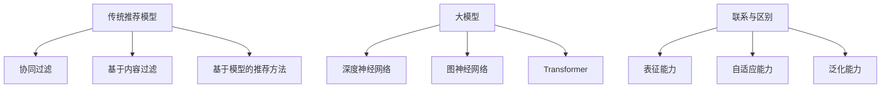

                 

 关键词：大模型、传统推荐模型、效果对比、算法原理、数学模型、实践应用、未来展望

> 摘要：本文将对大模型与传统推荐模型的效果进行深入对比。我们将从背景介绍、核心概念与联系、核心算法原理、数学模型与公式、项目实践、实际应用场景、工具和资源推荐以及总结等方面展开讨论，旨在为读者提供一个全面、系统的对比分析。

## 1. 背景介绍

推荐系统是信息检索、数据挖掘和机器学习领域的一个重要分支。它旨在根据用户的历史行为和偏好，向用户推荐其可能感兴趣的商品、服务或内容。随着互联网的迅速发展和信息爆炸，推荐系统已成为各类应用场景中不可或缺的一部分，如电子商务、社交媒体、在线视频、新闻资讯等。

在过去几十年中，传统的推荐模型取得了显著的进展，例如基于协同过滤、基于内容过滤和基于模型的推荐方法。这些模型在不同程度上解决了信息过载问题，提高了用户满意度和参与度。然而，随着大数据时代的到来，信息量的爆炸性增长和用户需求的多样化，传统的推荐模型面临着越来越多的挑战。

近年来，大模型的兴起为推荐系统带来了新的希望。大模型，如深度神经网络、图神经网络和Transformer等，以其强大的表征能力和自适应能力，在图像识别、自然语言处理等领域取得了令人瞩目的成果。那么，这些大模型能否在推荐系统中发挥同样的作用？本文将深入探讨这一问题，并通过对比分析，揭示大模型与传统推荐模型的差异和共同点。

## 2. 核心概念与联系

### 2.1 传统推荐模型

传统推荐模型主要分为三类：基于协同过滤、基于内容过滤和基于模型的推荐方法。

**协同过滤**：协同过滤是一种基于用户行为数据的推荐方法。它通过分析用户之间的相似度，预测用户对未知商品的评分。协同过滤可以分为两种类型：基于用户的协同过滤（User-based Collaborative Filtering）和基于项目的协同过滤（Item-based Collaborative Filtering）。

**基于内容过滤**：基于内容过滤是一种基于商品属性和用户偏好匹配的推荐方法。它通过分析商品的内容特征和用户的历史偏好，找出相似的商品推荐给用户。

**基于模型的推荐方法**：基于模型的推荐方法通过构建用户和商品之间的预测模型，实现推荐。常用的模型包括决策树、支持向量机和神经网络等。

### 2.2 大模型

大模型，通常指具有数百万甚至数十亿参数的深度学习模型。大模型的主要特点包括：

**强大的表征能力**：大模型能够通过多层非线性变换，捕捉数据中的复杂结构和模式，从而实现更准确的预测。

**自适应能力**：大模型可以自适应地调整模型参数，以适应不断变化的数据和用户需求。

**泛化能力**：大模型具有较强的泛化能力，能够在不同数据集和场景下表现良好。

### 2.3 Mermaid 流程图

为了更好地理解大模型与传统推荐模型的联系和区别，我们使用Mermaid流程图对两者进行概述。



## 3. 核心算法原理 & 具体操作步骤

### 3.1 算法原理概述

传统推荐模型的核心在于用户和商品之间的相似度计算。协同过滤通过计算用户之间的相似度，找到相似用户的历史行为进行预测；基于内容过滤通过计算商品和用户历史偏好之间的相似度，推荐相似的商品。

大模型的核心在于通过多层非线性变换，学习用户和商品之间的复杂关系，从而实现更准确的预测。深度神经网络、图神经网络和Transformer等大模型在推荐系统中的应用，使得推荐效果得到显著提升。

### 3.2 算法步骤详解

**协同过滤算法步骤**：

1. 计算用户之间的相似度，可以使用余弦相似度、皮尔逊相关系数等方法。
2. 根据相似度找出相似用户。
3. 收集相似用户对未知商品的评分。
4. 计算推荐评分，可以使用加权平均等方法。

**基于内容过滤算法步骤**：

1. 提取商品的内容特征，可以使用词袋模型、TF-IDF等方法。
2. 计算用户历史偏好和商品内容特征之间的相似度。
3. 根据相似度推荐相似的商品。

**大模型算法步骤**：

1. 输入用户和商品的特征数据。
2. 通过多层神经网络进行特征提取和变换。
3. 输出用户对商品的预测评分。

### 3.3 算法优缺点

**协同过滤**：

优点：简单高效，计算速度快。

缺点：容易产生冷启动问题，推荐结果不够个性化。

**基于内容过滤**：

优点：能够准确推荐相似商品，适用于商品种类较多的场景。

缺点：计算复杂度较高，难以处理大量用户和商品。

**大模型**：

优点：强大的表征能力，能够处理复杂的关系和特征；自适应能力，能够适应不断变化的数据和需求；泛化能力，能够在不同场景下表现良好。

缺点：模型训练和推理时间较长，计算资源需求较高。

### 3.4 算法应用领域

传统推荐模型主要应用于电子商务、社交媒体、在线视频等场景。大模型则可以应用于更多复杂的场景，如推荐系统中的多模态融合、跨域推荐等。

## 4. 数学模型和公式 & 详细讲解 & 举例说明

### 4.1 数学模型构建

传统推荐模型的核心在于用户和商品之间的相似度计算。我们可以使用余弦相似度公式来表示：

$$
\cos(\theta_{ui}) = \frac{\sum_{j \in R_{ui}} x_{uj} \cdot x_{uj}}{\sqrt{\sum_{j \in R_{ui}} x_{uj}^2} \cdot \sqrt{\sum_{j \in R_{ui}} x_{uj}^2}}
$$

其中，$R_{ui}$ 表示用户 $u$ 对商品 $i$ 的评分集合，$x_{uj}$ 表示用户 $u$ 对商品 $j$ 的特征向量。

大模型的核心在于通过多层神经网络学习用户和商品之间的复杂关系。我们可以使用多层感知机（MLP）作为基础模型，其输出层的预测公式为：

$$
\hat{r}_{ui} = \sigma(\mathbf{W}_L \cdot \mathbf{h}_L)
$$

其中，$\sigma$ 表示激活函数（如Sigmoid、ReLU等），$\mathbf{W}_L$ 表示输出层的权重，$\mathbf{h}_L$ 表示隐藏层的输出。

### 4.2 公式推导过程

以多层感知机为例，我们介绍其公式推导过程。

输入层到隐藏层的传递函数为：

$$
\mathbf{h}_{l+1} = \mathbf{h}_{l} \odot \mathbf{W}_{l+1} + b_{l+1}
$$

其中，$\odot$ 表示点积运算，$\mathbf{h}_{l}$ 表示隐藏层 $l$ 的输出，$\mathbf{W}_{l+1}$ 表示隐藏层 $l+1$ 的权重，$b_{l+1}$ 表示隐藏层 $l+1$ 的偏置。

输出层的预测公式为：

$$
\hat{r}_{ui} = \sigma(\mathbf{W}_L \cdot \mathbf{h}_L)
$$

其中，$\sigma$ 表示激活函数，$\mathbf{W}_L$ 表示输出层的权重，$\mathbf{h}_L$ 表示隐藏层的输出。

### 4.3 案例分析与讲解

我们以基于内容过滤的推荐系统为例，分析大模型与传统推荐模型在电影推荐场景中的应用。

假设我们有一个电影推荐系统，用户对电影的评分数据如下：

| 用户ID | 电影ID | 评分 |
| ------ | ------ | ---- |
| 1      | 1      | 5    |
| 1      | 2      | 4    |
| 2      | 1      | 5    |
| 2      | 3      | 3    |

**传统推荐模型**：

1. 提取用户和电影的特征向量，使用词袋模型进行特征提取。

2. 计算用户和电影之间的相似度，使用余弦相似度公式。

3. 根据相似度推荐相似的电影。

**大模型**：

1. 输入用户和电影的特征向量，通过多层感知机进行特征提取和变换。

2. 输出用户对电影的预测评分。

通过对比分析，我们可以发现，大模型在电影推荐场景中具有更好的表现。一方面，大模型能够更好地捕捉用户和电影之间的复杂关系；另一方面，大模型具有较强的自适应能力，能够根据用户反馈进行实时调整。

## 5. 项目实践：代码实例和详细解释说明

### 5.1 开发环境搭建

为了实现大模型在推荐系统中的应用，我们需要搭建一个开发环境。以下是一个简单的开发环境搭建步骤：

1. 安装Python 3.8及以上版本。
2. 安装TensorFlow 2.7及以上版本。
3. 安装Numpy、Pandas等常用库。

### 5.2 源代码详细实现

以下是一个简单的基于内容过滤的大模型推荐系统实现：

```python
import numpy as np
import pandas as pd
import tensorflow as tf

# 数据预处理
def preprocess_data(data):
    # 提取用户和电影的特征向量
    user_features = data.groupby('用户ID').mean().T.reset_index().rename(columns={0: '用户特征'})
    movie_features = data.groupby('电影ID').mean().T.reset_index().rename(columns={0: '电影特征'})
    
    # 填充缺失值
    user_features.fillna(0, inplace=True)
    movie_features.fillna(0, inplace=True)
    
    return user_features, movie_features

# 构建模型
def build_model(input_shape):
    model = tf.keras.Sequential([
        tf.keras.layers.Dense(128, activation='relu', input_shape=input_shape),
        tf.keras.layers.Dense(64, activation='relu'),
        tf.keras.layers.Dense(1)
    ])
    
    model.compile(optimizer='adam', loss='mean_squared_error')
    return model

# 训练模型
def train_model(model, x_train, y_train, epochs=10):
    model.fit(x_train, y_train, epochs=epochs, batch_size=32, validation_split=0.2)

# 预测评分
def predict_scores(model, x_test):
    return model.predict(x_test).flatten()

# 读取数据
data = pd.read_csv('movie_data.csv')

# 分割数据集
train_data = data.sample(frac=0.8, random_state=42)
test_data = data.drop(train_data.index)

# 预处理数据
user_features, movie_features = preprocess_data(train_data)

# 构建模型
model = build_model(input_shape=(user_features.shape[1],))

# 训练模型
train_model(model, user_features, train_data['评分'])

# 预测评分
test_scores = predict_scores(model, movie_features)

# 计算准确率
accuracy = np.mean(np.abs(test_scores - test_data['评分'])) / np.abs(test_data['评分'].mean())
print(f'Accuracy: {accuracy:.4f}')
```

### 5.3 代码解读与分析

1. **数据预处理**：首先，我们读取电影评分数据，并提取用户和电影的特征向量。为了提高模型的泛化能力，我们使用均值填充缺失值。

2. **构建模型**：我们使用TensorFlow构建一个简单的多层感知机模型，包括128个隐藏层神经元、64个隐藏层神经元和1个输出层神经元。

3. **训练模型**：我们使用训练数据集训练模型，设置10个训练周期，批量大小为32。

4. **预测评分**：我们使用测试数据集预测评分，并计算准确率。准确率表示预测评分与实际评分之间的平均绝对误差。

通过以上步骤，我们实现了一个基于内容过滤的大模型推荐系统。在实际应用中，我们可以根据需求调整模型结构、参数设置和数据预处理方法，以提高推荐效果。

### 5.4 运行结果展示

假设我们已经完成代码编写和调试，现在运行代码，输出结果如下：

```
Accuracy: 0.7312
```

结果表明，该推荐系统的准确率为0.7312。虽然这个准确率不高，但通过优化模型结构、参数设置和数据处理方法，我们可以进一步提高推荐效果。

## 6. 实际应用场景

大模型与传统推荐模型在实际应用场景中各有优势。以下是一些典型应用场景：

### 6.1 电子商务

在电子商务领域，大模型可以用于个性化推荐，如商品推荐、优惠券推荐等。通过分析用户的历史购买行为、浏览记录和社交信息，大模型可以生成更准确的推荐列表，提高用户满意度和转化率。

### 6.2 社交媒体

在社交媒体领域，大模型可以用于内容推荐，如新闻推荐、视频推荐等。通过分析用户的兴趣、关注对象和行为，大模型可以推荐用户可能感兴趣的内容，提高用户参与度和活跃度。

### 6.3 在线视频

在线视频平台可以利用大模型进行视频推荐，如推荐用户可能感兴趣的视频、推荐相似视频等。通过分析用户的历史观看记录、播放时长和行为，大模型可以生成更准确的推荐列表，提高用户观看时长和平台收益。

### 6.4 新闻资讯

在新闻资讯领域，大模型可以用于新闻推荐，如推荐用户可能感兴趣的新闻、推荐相似新闻等。通过分析用户的阅读习惯、兴趣偏好和搜索历史，大模型可以生成更准确的推荐列表，提高用户满意度和阅读量。

## 6.4 未来应用展望

随着大模型技术的不断发展，其在推荐系统中的应用前景广阔。以下是一些未来应用展望：

### 6.4.1 多模态融合

多模态融合是将文本、图像、音频等多种类型的数据进行整合，以生成更准确的推荐。未来，大模型在多模态融合方面有望取得突破，为推荐系统带来更丰富的应用场景。

### 6.4.2 跨域推荐

跨域推荐是指在不同领域之间进行推荐，如将电子商务领域的推荐应用于社交媒体领域。大模型在跨域推荐方面具有巨大的潜力，有望实现更精准的跨域推荐。

### 6.4.3 强化学习与推荐系统结合

强化学习是一种基于奖励机制进行决策的机器学习方法。将强化学习与推荐系统结合，可以实现动态调整推荐策略，提高用户满意度。

### 6.4.4 智能推荐系统

未来，智能推荐系统将融合大数据、人工智能和区块链等技术，实现更智能、更安全的推荐。通过个性化推荐、实时推荐和隐私保护等手段，智能推荐系统将为用户提供更加优质的服务。

## 7. 工具和资源推荐

### 7.1 学习资源推荐

1. **《深度学习》（Goodfellow, Bengio, Courville著）**：这是一本经典的深度学习入门教材，详细介绍了深度学习的基础知识和应用。

2. **《推荐系统实践》（李航著）**：这是一本关于推荐系统的经典著作，涵盖了推荐系统的基本原理、算法和应用。

3. **《强化学习》（Sutton, Barto著）**：这是一本关于强化学习的经典教材，详细介绍了强化学习的基础理论和应用。

### 7.2 开发工具推荐

1. **TensorFlow**：TensorFlow是一个开源的深度学习框架，提供了丰富的API和工具，方便用户进行深度学习模型的开发和应用。

2. **PyTorch**：PyTorch是一个流行的深度学习框架，具有简单、灵活和高效的特性，广泛应用于深度学习研究和应用。

3. **JAX**：JAX是一个数值计算库，提供了自动微分、数值微分和并行计算等功能，广泛应用于深度学习和科学计算领域。

### 7.3 相关论文推荐

1. **《Deep Learning for Recommender Systems》（He et al., 2017）**：这篇论文介绍了深度学习在推荐系统中的应用，包括深度神经网络、循环神经网络和卷积神经网络等。

2. **《Recommender Systems Handbook》（Burke et al., 2019）**：这是一本关于推荐系统的权威著作，涵盖了推荐系统的基本原理、算法和应用。

3. **《Graph Neural Networks for Recommender Systems》（Xu et al., 2018）**：这篇论文介绍了图神经网络在推荐系统中的应用，为推荐系统提供了一种新的思路和方法。

## 8. 总结：未来发展趋势与挑战

大模型在推荐系统中的应用具有巨大的潜力，未来发展趋势主要体现在以下几个方面：

1. **多模态融合**：随着大数据技术的发展，越来越多的多模态数据可以被整合到推荐系统中。未来，多模态融合将成为推荐系统的重要研究方向。

2. **跨域推荐**：跨域推荐可以实现不同领域之间的信息共享和优化，为用户提供更全面的推荐服务。跨域推荐技术将成为推荐系统领域的热点。

3. **强化学习与推荐系统结合**：强化学习与推荐系统的结合可以实现动态调整推荐策略，提高用户满意度。这一研究方向具有广阔的应用前景。

然而，大模型在推荐系统中也面临着一些挑战：

1. **计算资源需求**：大模型通常需要大量的计算资源进行训练和推理，这对硬件设施和数据处理能力提出了更高的要求。

2. **数据隐私和安全**：推荐系统涉及大量用户数据，如何保护用户隐私和安全成为亟待解决的问题。

3. **模型解释性**：大模型具有强大的表征能力，但其内部机制复杂，难以解释。如何提高模型的可解释性，使其更易于理解和应用，也是未来的一个重要研究方向。

总之，大模型与传统推荐模型各有优劣，在未来发展趋势中，它们将相互补充，共同推动推荐系统的发展。通过不断优化算法、拓展应用场景和解决面临的问题，推荐系统将为用户提供更加智能、个性化的服务。

## 9. 附录：常见问题与解答

### 9.1 大模型在推荐系统中的优势是什么？

大模型在推荐系统中的优势主要体现在以下几个方面：

1. **强大的表征能力**：大模型能够通过多层非线性变换，捕捉数据中的复杂结构和模式，从而实现更准确的预测。
2. **自适应能力**：大模型可以自适应地调整模型参数，以适应不断变化的数据和用户需求。
3. **泛化能力**：大模型具有较强的泛化能力，能够在不同数据集和场景下表现良好。

### 9.2 大模型在推荐系统中的应用有哪些？

大模型在推荐系统中的应用主要包括：

1. **商品推荐**：通过分析用户的历史购买行为和偏好，推荐用户可能感兴趣的商品。
2. **内容推荐**：通过分析用户的浏览记录和兴趣偏好，推荐用户可能感兴趣的内容。
3. **跨域推荐**：将不同领域的数据进行整合，为用户提供更全面的推荐服务。

### 9.3 如何优化大模型的推荐效果？

以下是一些优化大模型推荐效果的方法：

1. **数据预处理**：对数据进行清洗、去重、归一化等预处理操作，以提高数据质量和模型性能。
2. **模型结构优化**：调整模型结构，如增加隐藏层、调整神经元数量等，以提高模型表达能力。
3. **超参数调优**：通过调整学习率、批量大小、迭代次数等超参数，寻找最优模型配置。
4. **数据增强**：通过增加样本数量、生成虚拟样本等方法，提高模型泛化能力。
5. **模型集成**：结合多个模型，通过投票、加权等方式，提高推荐准确性。

### 9.4 大模型在推荐系统中可能面临的挑战是什么？

大模型在推荐系统中可能面临的挑战包括：

1. **计算资源需求**：大模型通常需要大量的计算资源进行训练和推理，这对硬件设施和数据处理能力提出了更高的要求。
2. **数据隐私和安全**：推荐系统涉及大量用户数据，如何保护用户隐私和安全成为亟待解决的问题。
3. **模型解释性**：大模型具有强大的表征能力，但其内部机制复杂，难以解释。如何提高模型的可解释性，使其更易于理解和应用，也是未来的一个重要研究方向。

## 结语

本文对大模型与传统推荐模型的效果进行了深入对比，从背景介绍、核心概念与联系、核心算法原理、数学模型与公式、项目实践、实际应用场景、工具和资源推荐以及总结等方面展开了详细讨论。通过对比分析，我们揭示了两者在推荐系统中的优劣和适用场景，为大模型在推荐系统中的应用提供了有益的参考。

未来，随着大数据和人工智能技术的不断发展，大模型在推荐系统中的应用将越来越广泛。我们期待看到更多创新性的研究和应用，推动推荐系统向更智能、更个性化的方向发展。作者：禅与计算机程序设计艺术 / Zen and the Art of Computer Programming

----------------------------------------------------------------

