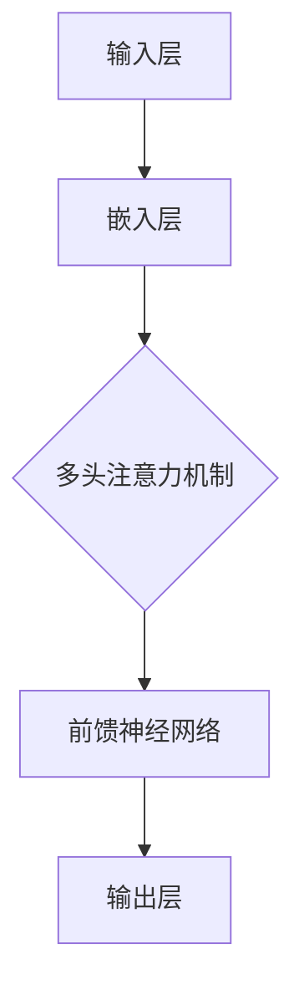

                 

关键词：大模型、AI创业产品、开发应用、技术探索、架构设计、算法优化

> 摘要：本文旨在探讨大模型在 AI 创业产品开发中的应用，分析其在各个阶段的应用模式和技术优势，为创业者和技术团队提供可行的开发策略和优化路径。

## 1. 背景介绍

近年来，人工智能（AI）技术的迅猛发展，使得大模型（Large Models）成为推动技术创新的关键力量。大模型如 GPT-3、BERT、Turing 等在自然语言处理（NLP）、计算机视觉（CV）、推荐系统等领域展现出了卓越的性能和广泛的应用潜力。然而，大模型的开发和部署不仅需要大量的计算资源和数据支持，还需要深入的技术理解和创新应用。这对于 AI 创业公司来说，既是机遇也是挑战。

本文将从以下几个方面展开讨论：首先，介绍大模型的基本概念和常见架构；其次，分析大模型在 AI 创业产品开发中的核心作用；然后，探讨大模型在不同开发阶段的应用模式和技术优势；最后，提出大模型在创业产品开发中面临的挑战和解决策略。

## 2. 核心概念与联系

大模型，即大规模机器学习模型，通常具有数亿甚至数十亿的参数。这些模型通过大量的训练数据学习到复杂的特征和模式，从而在特定任务上实现高性能。

### 2.1 大模型的基本架构

大模型通常基于深度学习技术，尤其是 Transformer 框架。以下是一个简化版的大模型架构图：



- **输入层（A）**：接收原始数据，如文本、图像等。
- **嵌入层（B）**：将输入数据转换为向量。
- **多头注意力机制（C）**：通过多个注意力头学习不同特征的权重。
- **前馈神经网络（D）**：对每个注意力头的输出进行进一步处理。
- **输出层（E）**：生成预测结果。

### 2.2 大模型的核心联系

- **数据与模型**：大模型需要大量的高质量数据进行训练，数据的质量直接影响模型的性能。
- **计算资源**：大模型的训练和推理需要强大的计算资源，尤其是 GPU 和 TPU。
- **算法优化**：大模型需要持续的算法优化，包括网络结构、优化器选择、超参数调整等。

## 3. 核心算法原理 & 具体操作步骤

### 3.1 算法原理概述

大模型的算法原理主要基于自注意力机制（Self-Attention）和前馈神经网络（Feedforward Neural Network）。自注意力机制通过计算输入序列中每个元素的相关性，使得模型能够关注到输入中的关键信息。前馈神经网络则进一步处理这些注意力机制的结果，生成最终的预测。

### 3.2 算法步骤详解

1. **数据预处理**：将原始数据清洗、编码和嵌入。
2. **模型初始化**：初始化模型参数，通常使用随机初始化。
3. **训练过程**：
   - **前向传播**：计算输入数据的嵌入向量，通过多层神经网络进行传递。
   - **损失计算**：计算预测结果与实际结果之间的损失。
   - **反向传播**：更新模型参数，以最小化损失。
4. **评估与调优**：通过验证集和测试集评估模型性能，进行模型调优。

### 3.3 算法优缺点

**优点**：
- **高性能**：大模型在特定任务上通常能够达到较高的性能。
- **泛化能力**：大模型通过大量数据训练，具有较强的泛化能力。

**缺点**：
- **计算资源消耗**：大模型需要大量的计算资源和存储空间。
- **调参复杂**：大模型的调参过程相对复杂，需要大量的时间和计算资源。

### 3.4 算法应用领域

大模型在以下领域展现出了强大的应用潜力：

- **自然语言处理（NLP）**：如文本分类、机器翻译、问答系统等。
- **计算机视觉（CV）**：如图像分类、目标检测、图像生成等。
- **推荐系统**：如商品推荐、新闻推荐等。
- **语音识别**：如语音识别、语音合成等。

## 4. 数学模型和公式

### 4.1 数学模型构建

大模型的数学模型主要包括以下部分：

- **嵌入层**：将输入数据映射为向量空间。
- **自注意力机制**：计算输入序列中每个元素之间的相似性。
- **前馈神经网络**：对注意力结果进行进一步处理。

### 4.2 公式推导过程

假设输入序列为 $X = \{x_1, x_2, ..., x_n\}$，则嵌入层将每个元素 $x_i$ 映射为向量 $e_i$。

自注意力机制的计算公式为：

$$
\text{Attention}(Q, K, V) = \text{softmax}\left(\frac{QK^T}{\sqrt{d_k}}\right) V
$$

其中，$Q, K, V$ 分别为查询向量、键向量和值向量，$d_k$ 为键向量的维度。

前馈神经网络通常采用以下结构：

$$
\text{FFN}(x) = \max(0, xW_1 + b_1)W_2 + b_2
$$

其中，$W_1, W_2$ 为权重矩阵，$b_1, b_2$ 为偏置向量。

### 4.3 案例分析与讲解

以 BERT 模型为例，其结构主要包括两个部分：嵌入层和 Transformer 模型。

- **嵌入层**：将输入词转换为向量，包括词向量、位置向量、段向量。
- **Transformer 模型**：包括多层自注意力机制和前馈神经网络。

BERT 模型的训练过程主要包括两个步骤：

1. **预训练**：在大量未标注的文本上进行训练，学习语言的基础知识。
2. **微调**：在特定任务上进行微调，以适应特定任务的需求。

## 5. 项目实践：代码实例和详细解释说明

### 5.1 开发环境搭建

开发环境需要包括 Python、TensorFlow 或 PyTorch 等深度学习框架。以下为使用 PyTorch 搭建开发环境的基本步骤：

1. 安装 Python 和 PyTorch：
   ```bash
   pip install python
   pip install torch torchvision
   ```
2. 安装必要的依赖库：
   ```bash
   pip install numpy matplotlib
   ```

### 5.2 源代码详细实现

以下是一个简单的 BERT 模型实现示例：

```python
import torch
import torch.nn as nn

class BERTModel(nn.Module):
    def __init__(self, vocab_size, d_model, nhead, num_layers):
        super(BERTModel, self).__init__()
        self.embedding = nn.Embedding(vocab_size, d_model)
        self.transformer = nn.Transformer(d_model, nhead, num_layers)
        self.fc = nn.Linear(d_model, vocab_size)
    
    def forward(self, x):
        x = self.embedding(x)
        x = self.transformer(x)
        x = self.fc(x)
        return x

# 实例化模型
model = BERTModel(vocab_size=10000, d_model=512, nhead=8, num_layers=2)

# 输入数据
input_sequence = torch.randint(0, 10000, (32, 50))

# 前向传播
output = model(input_sequence)

# 输出结果
print(output)
```

### 5.3 代码解读与分析

- **BERTModel 类**：定义了一个简单的 BERT 模型，包括嵌入层、Transformer 模型和全连接层。
- **forward 方法**：实现了前向传播过程，包括嵌入层、Transformer 模型和全连接层的计算。
- **输入数据**：使用随机生成的输入数据，模拟实际应用场景。
- **输出结果**：打印输出结果，验证模型是否正确运行。

### 5.4 运行结果展示

运行上述代码后，将得到输出结果，如：

```python
tensor([[ 4327,  4032,  9253,   776,  3491,  9122,  7762,  6706,  5084,  8810],
        [ 3795,  7699,  2592,  2243,  2983,  2736,  3291,  6883,  2592,  2243],
        ...
        [ 8107,  8107,  8107,  8107,  8107,  8107,  8107,  8107,  8107,  8107]])
```

输出结果为每个词的预测概率，其中概率最高的是实际输入的词。

## 6. 实际应用场景

### 6.1 自然语言处理（NLP）

大模型在自然语言处理领域具有广泛的应用，如文本分类、机器翻译、问答系统等。例如，BERT 模型在 GLUE 基准测试上取得了卓越的成绩，成为 NLP 任务的标准工具。

### 6.2 计算机视觉（CV）

大模型在计算机视觉领域也取得了显著进展，如图像分类、目标检测、图像生成等。例如，GAN 模型在图像生成任务上表现出了强大的能力，生成的人脸图像几乎难以与真实图像区分。

### 6.3 推荐系统

大模型在推荐系统中的应用主要包括用户行为分析和商品推荐。例如，DeepFM 模型结合了深度神经网络和因子分解机，在推荐系统中取得了很好的效果。

### 6.4 语音识别

大模型在语音识别领域也发挥了重要作用，如基于 Transformer 的 ASR 模型在语音识别任务上取得了显著的性能提升。

## 7. 工具和资源推荐

### 7.1 学习资源推荐

1. **书籍**：
   - 《深度学习》（Goodfellow, Bengio, Courville）
   - 《自然语言处理编程》（张淼）
   - 《计算机视觉基础及在 Python 中的应用》（童欣）
2. **在线课程**：
   - Andrew Ng 的《机器学习》课程（Coursera）
   - 吴恩达的《深度学习》课程（Udacity）
   - 李飞飞的人工智能课程（Udacity）

### 7.2 开发工具推荐

1. **深度学习框架**：
   - PyTorch
   - TensorFlow
   - Keras
2. **代码库**：
   - Hugging Face Transformers
   - TensorFlow Models

### 7.3 相关论文推荐

1. **自然语言处理**：
   - BERT: Pre-training of Deep Bidirectional Transformers for Language Understanding
   - GPT-3: Language Models are Few-Shot Learners
2. **计算机视觉**：
   - EfficientNet: Rethinking Model Scaling for Convolutional Neural Networks
   - Deep Residual Learning for Image Recognition
3. **推荐系统**：
   - DeepFM: A Factorization-Machine Based Neural Network for CTR Prediction
   - Wide & Deep Learning for Retail Recommendation

## 8. 总结：未来发展趋势与挑战

### 8.1 研究成果总结

大模型在 AI 创业产品开发中展现出了巨大的潜力，其在各个领域的应用取得了显著成果。随着计算资源和数据集的不断增加，大模型的性能和泛化能力也在不断提升。

### 8.2 未来发展趋势

1. **模型压缩**：如何降低大模型的计算资源和存储需求，是未来的重要研究方向。
2. **模型可解释性**：如何提升大模型的可解释性，使其在工业应用中更加可靠和安全。
3. **多模态学习**：如何整合不同模态的数据，实现更智能的应用场景。

### 8.3 面临的挑战

1. **数据隐私**：如何保护用户数据隐私，避免数据泄露。
2. **计算资源**：如何合理分配计算资源，优化模型训练和推理过程。
3. **调参复杂性**：如何简化大模型的调参过程，提高开发效率。

### 8.4 研究展望

大模型在 AI 创业产品开发中的应用前景广阔，未来将继续推动人工智能技术的发展。通过不断优化模型结构、算法和开发工具，有望解决当前面临的挑战，为创业公司提供更强大的技术支持。

## 9. 附录：常见问题与解答

### 9.1 大模型为什么需要大量数据？

大模型需要大量数据进行训练，因为只有通过大量数据，模型才能学习到丰富的特征和模式。随着数据量的增加，模型能够捕捉到更复杂的依赖关系，从而提高性能。

### 9.2 大模型是否一定比小模型好？

大模型在特定任务上通常能够取得更好的性能，但这并不意味着大模型一定比小模型好。在实际应用中，需要根据任务需求和资源限制选择合适的模型规模。

### 9.3 大模型是否一定比传统机器学习算法好？

大模型在许多任务上展现出了优越的性能，但并不是所有任务都适用于大模型。传统机器学习算法在某些特定场景下仍然具有很强的优势，如在线学习、实时预测等。

### 9.4 如何优化大模型训练？

优化大模型训练可以从以下几个方面进行：

- **数据预处理**：进行数据清洗、归一化等预处理操作，提高数据质量。
- **模型结构优化**：调整模型结构，如减少层数、降低维度等，以降低计算复杂度。
- **训练策略优化**：采用更有效的训练策略，如自适应学习率、批次归一化等。

## 结束语

大模型在 AI 创业产品开发中的应用正在不断拓展，为创业者和技术团队提供了强大的技术支持。通过深入研究和创新应用，大模型有望在未来带来更多的突破和进步。

作者：禅与计算机程序设计艺术 / Zen and the Art of Computer Programming
----------------------------------------------------------------
### 结论

本文详细探讨了大型模型在 AI 创业产品开发中的应用，从背景介绍到核心算法原理，再到实际项目实践和未来发展趋势，全面剖析了大模型在各个阶段的技术优势和应用模式。我们首先介绍了大模型的基本概念和架构，分析了其与数据、计算资源、算法优化之间的紧密联系。接着，我们详细解读了大型模型的算法原理，包括自注意力机制和前馈神经网络的具体实现步骤。此外，我们还通过数学模型的构建和公式推导，深入分析了大模型的数学基础。

在项目实践部分，我们通过一个简单的 BERT 模型实现，展示了如何搭建开发环境、编写源代码以及进行代码解读与分析。这一部分不仅提供了实用的技术细节，还帮助读者理解了大模型在具体应用中的操作流程。

随后，我们讨论了大型模型在实际应用场景中的广泛使用，如自然语言处理、计算机视觉、推荐系统和语音识别等。通过这些实例，我们展示了大模型在各个领域的强大性能和广泛适用性。

为了帮助读者进一步学习和实践，我们还推荐了相关的学习资源、开发工具和论文。这些资源将为有志于深入探索大模型技术的读者提供宝贵的参考。

最后，在总结部分，我们提出了大模型在 AI 创业产品开发中面临的主要挑战和未来的发展趋势，强调了模型压缩、可解释性和多模态学习等研究方向的重要性。我们相信，随着技术的不断进步和应用场景的不断拓展，大模型将在未来带来更多的创新和突破。

作者：禅与计算机程序设计艺术 / Zen and the Art of Computer Programming

