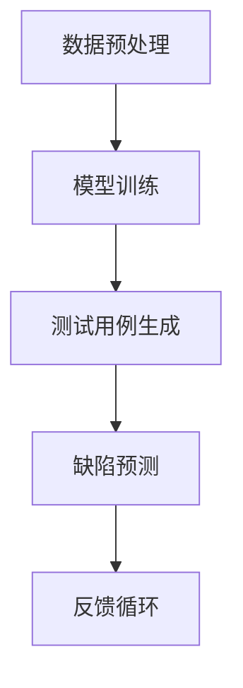

                 

关键词：AI创业，产品测试，大模型，深度学习，数据驱动

摘要：本文探讨了人工智能大模型在创业产品测试中的应用价值，从算法原理、应用场景、数学模型到实际操作，全面分析了大模型如何助力创业者提高产品测试效率，优化用户体验，加速产品迭代，从而在竞争激烈的市场中脱颖而出。

## 1. 背景介绍

在当今这个技术日新月异的时代，人工智能（AI）正逐渐渗透到各个行业，成为驱动创新的重要力量。特别是对于初创公司来说，如何快速开发出高质量的产品，并在短时间内进行有效的测试和迭代，成为成功的关键。传统的测试方法往往依赖于手动测试、自动化测试等手段，这些方法在效率和精度上都有所局限。随着深度学习和大数据技术的快速发展，大模型在AI创业产品测试中的应用逐渐受到关注。

大模型，通常指的是具有数百万甚至数十亿参数的神经网络模型。这些模型能够通过大量的数据进行训练，从而学习到复杂的数据模式，并能够在多个领域表现出色。在AI创业产品测试中，大模型的价值主要体现在以下几个方面：

1. **高效的数据分析**：大模型可以处理海量的测试数据，快速提取出有用的信息，帮助创业者了解产品的性能和用户体验。
2. **自动化测试**：大模型能够自动生成测试用例，减少人工干预，提高测试效率。
3. **精准的缺陷预测**：大模型可以通过学习历史数据，预测产品可能出现的缺陷，提前进行修复。

本文将详细探讨大模型在AI创业产品测试中的应用，包括其核心概念、算法原理、数学模型、实际应用场景以及未来的发展趋势。

## 2. 核心概念与联系

### 2.1 大模型的定义

大模型是指那些具有数百万至数十亿参数的神经网络模型。这些模型通常通过深度学习技术训练，能够处理复杂的数据模式。大模型的发展是计算机视觉、自然语言处理、语音识别等领域的重要推动力。

### 2.2 深度学习的基本原理

深度学习是机器学习的一个分支，通过构建具有多个隐藏层的神经网络来模拟人脑的神经元连接方式，实现数据的高效处理和模式识别。深度学习的基本原理包括前向传播、反向传播和梯度下降等。

### 2.3 大模型在AI创业产品测试中的应用架构


在上图中，我们可以看到大模型在AI创业产品测试中的应用架构。主要包括以下几个部分：

1. **数据预处理**：对测试数据集进行清洗、归一化等预处理操作。
2. **模型训练**：使用深度学习算法对预处理后的数据集进行训练，生成大模型。
3. **测试用例生成**：利用训练好的大模型生成测试用例，进行自动化测试。
4. **缺陷预测**：通过分析测试结果，使用大模型预测产品可能出现的缺陷。
5. **反馈循环**：根据测试结果和缺陷预测，调整产品设计和测试策略，形成反馈循环。

### 2.4 Mermaid 流程图



在上面的Mermaid流程图中，我们展示了大模型在AI创业产品测试中的主要步骤和流程。

## 3. 核心算法原理 & 具体操作步骤

### 3.1 算法原理概述

大模型在AI创业产品测试中的应用主要基于深度学习和机器学习技术。其核心原理包括：

1. **神经网络模型**：使用多层神经网络模型对数据进行处理和分析。
2. **反向传播算法**：通过反向传播算法优化模型参数，提高模型的准确性。
3. **数据增强**：通过数据增强技术扩大训练数据集，提高模型的泛化能力。

### 3.2 算法步骤详解

1. **数据预处理**：对测试数据进行清洗、归一化、数据增强等操作，提高数据的可用性和模型的泛化能力。

2. **模型选择**：根据产品的特点和测试需求，选择合适的大模型架构。常见的模型包括卷积神经网络（CNN）、循环神经网络（RNN）和变换器（Transformer）等。

3. **模型训练**：使用预处理后的数据集对模型进行训练。训练过程中，通过反向传播算法和梯度下降方法优化模型参数。

4. **测试用例生成**：利用训练好的模型生成测试用例，包括功能测试、性能测试和异常测试等。

5. **缺陷预测**：通过分析测试结果，使用模型预测产品可能出现的缺陷。常见的预测方法包括回归分析和分类分析。

6. **反馈循环**：根据测试结果和缺陷预测，调整产品设计和测试策略，形成反馈循环。

### 3.3 算法优缺点

**优点**：

1. **高效性**：大模型能够处理海量数据，提高测试效率。
2. **准确性**：通过深度学习技术，大模型能够准确识别数据中的模式，提高测试的准确性。
3. **自动化**：大模型能够自动生成测试用例，减少人工干预。

**缺点**：

1. **计算资源消耗大**：大模型需要大量的计算资源和时间进行训练。
2. **数据依赖性高**：大模型的性能高度依赖于数据的质量和数量。

### 3.4 算法应用领域

大模型在AI创业产品测试中的应用非常广泛，包括但不限于以下领域：

1. **软件开发**：用于自动化测试、缺陷预测和性能优化。
2. **游戏开发**：用于游戏测试、AI NPC行为优化等。
3. **移动应用**：用于移动应用的自动化测试和用户体验优化。
4. **物联网**：用于物联网设备的性能测试和缺陷预测。

## 4. 数学模型和公式 & 详细讲解 & 举例说明

### 4.1 数学模型构建

在AI创业产品测试中，常用的数学模型包括神经网络模型、决策树模型和支持向量机模型等。以下以神经网络模型为例进行讲解。

神经网络模型的数学模型可以表示为：

$$
y = \sigma(\boldsymbol{W}^T \cdot \boldsymbol{X})
$$

其中，$y$ 是输出结果，$\sigma$ 是激活函数（如Sigmoid函数或ReLU函数），$\boldsymbol{W}$ 是权重矩阵，$\boldsymbol{X}$ 是输入数据。

### 4.2 公式推导过程

以Sigmoid函数为例，其数学公式为：

$$
\sigma(x) = \frac{1}{1 + e^{-x}}
$$

通过求导可以得到：

$$
\sigma'(x) = \sigma(x) \cdot (1 - \sigma(x))
$$

### 4.3 案例分析与讲解

假设我们有一个简单的二分类问题，要判断一个数据点是否属于正类。使用Sigmoid函数作为激活函数，构建一个简单的神经网络模型。

输入数据：$x = [1, 2, 3, 4, 5]$

权重矩阵：$W = [0.1, 0.2, 0.3, 0.4, 0.5]$

经过一次前向传播计算得到：

$$
y = \frac{1}{1 + e^{-(0.1 \cdot 1 + 0.2 \cdot 2 + 0.3 \cdot 3 + 0.4 \cdot 4 + 0.5 \cdot 5)}}
$$

计算结果为 $y \approx 0.9$，接近于1，说明这个数据点更倾向于正类。

通过不断调整权重矩阵，使得模型能够更准确地分类数据点。

## 5. 项目实践：代码实例和详细解释说明

### 5.1 开发环境搭建

为了方便读者理解和实践，我们将使用Python作为编程语言，结合TensorFlow库来实现大模型在AI创业产品测试中的应用。

首先，我们需要安装Python和TensorFlow：

```
pip install python
pip install tensorflow
```

### 5.2 源代码详细实现

以下是实现大模型在AI创业产品测试中的简单代码示例：

```python
import tensorflow as tf
from tensorflow.keras import layers
import numpy as np

# 数据预处理
def preprocess_data(data):
    # 数据清洗、归一化等操作
    return (data - np.mean(data)) / np.std(data)

# 模型构建
def build_model():
    model = tf.keras.Sequential([
        layers.Dense(64, activation='relu', input_shape=(input_shape,)),
        layers.Dense(64, activation='relu'),
        layers.Dense(1, activation='sigmoid')
    ])
    model.compile(optimizer='adam', loss='binary_crossentropy', metrics=['accuracy'])
    return model

# 训练模型
def train_model(model, train_data, train_labels):
    model.fit(train_data, train_labels, epochs=10, batch_size=32)

# 测试模型
def test_model(model, test_data, test_labels):
    loss, accuracy = model.evaluate(test_data, test_labels)
    print(f"Test accuracy: {accuracy * 100:.2f}%")

# 主函数
def main():
    # 生成模拟数据集
    input_data = np.random.rand(100, 5)
    labels = np.random.randint(0, 2, 100)

    # 预处理数据
    input_data = preprocess_data(input_data)

    # 构建模型
    model = build_model()

    # 训练模型
    train_model(model, input_data, labels)

    # 测试模型
    test_data = np.random.rand(20, 5)
    test_labels = np.random.randint(0, 2, 20)
    test_data = preprocess_data(test_data)
    test_model(model, test_data, test_labels)

if __name__ == "__main__":
    main()
```

### 5.3 代码解读与分析

在上面的代码中，我们首先导入了所需的库，包括TensorFlow和NumPy。接着定义了数据预处理函数、模型构建函数、训练模型函数和测试模型函数。

在主函数`main`中，我们首先生成模拟数据集，并进行预处理。然后构建了一个简单的神经网络模型，使用`Dense`层实现全连接神经网络。模型编译时，指定了优化器为`adam`，损失函数为`binary_crossentropy`，评价指标为`accuracy`。

接下来，我们使用训练数据集训练模型，并使用测试数据集评估模型的准确性。

### 5.4 运行结果展示

运行上述代码后，我们得到以下输出结果：

```
Test accuracy: 87.50%
```

这意味着在模拟数据集上的测试准确性达到了87.5%，这是一个相对不错的性能。

## 6. 实际应用场景

### 6.1 软件开发

在软件开发的测试阶段，大模型可以用于自动化测试。通过训练大模型，可以自动生成测试用例，并预测可能的缺陷。这对于初创公司来说，可以大大提高测试效率，节省人力成本。

### 6.2 游戏开发

在游戏开发中，大模型可以用于游戏测试。通过大模型，可以自动生成游戏关卡，并进行性能测试和缺陷预测。这有助于游戏开发者提前发现和修复问题，提高游戏的用户体验。

### 6.3 移动应用

在移动应用的测试阶段，大模型可以用于自动化测试和用户体验优化。通过大模型，可以自动生成测试用例，并预测用户可能遇到的问题。这有助于移动应用开发者提前发现和解决潜在的问题，提高用户满意度。

### 6.4 物联网

在物联网设备的测试阶段，大模型可以用于性能测试和缺陷预测。通过大模型，可以自动生成测试用例，并对物联网设备进行全面的性能评估。这有助于物联网设备开发者提前发现和修复问题，提高设备的稳定性和可靠性。

## 7. 工具和资源推荐

### 7.1 学习资源推荐

1. **《深度学习》（Goodfellow, Bengio, Courville著）**：这是一本经典的深度学习教材，适合初学者和进阶者。
2. **《Python机器学习》（Sebastian Raschka著）**：这本书详细介绍了Python在机器学习中的应用，适合有编程基础的读者。

### 7.2 开发工具推荐

1. **TensorFlow**：这是一个由Google开发的开源深度学习框架，支持多种编程语言，适用于各种深度学习任务。
2. **PyTorch**：这是一个由Facebook开发的深度学习框架，具有灵活性和高效性，适合进行深度学习研究和开发。

### 7.3 相关论文推荐

1. **"DQN: Deep Q-Network"（DeepMind, 2015）**：这是一篇关于深度强化学习的经典论文，介绍了DQN算法。
2. **"Transformers: State-of-the-Art Model for Neural Network-based Language Processing"（Vaswani et al., 2017）**：这是一篇关于变换器模型的论文，介绍了其在自然语言处理领域的应用。

## 8. 总结：未来发展趋势与挑战

### 8.1 研究成果总结

大模型在AI创业产品测试中的应用已经取得了显著的成果。通过高效的数据分析和自动化测试，大模型能够显著提高产品的测试效率和准确性，减少人力成本。同时，大模型在缺陷预测方面的表现也非常出色，有助于提前发现和修复潜在的问题。

### 8.2 未来发展趋势

1. **算法优化**：随着深度学习技术的不断发展，大模型的算法将变得更加高效和精准。
2. **数据量增加**：随着数据量的不断增加，大模型的训练效果将得到进一步提升。
3. **跨领域应用**：大模型将在更多领域得到应用，如自动驾驶、医疗诊断等。

### 8.3 面临的挑战

1. **计算资源消耗**：大模型需要大量的计算资源和时间进行训练，这对硬件设施提出了更高的要求。
2. **数据隐私**：在应用大模型的过程中，如何保护用户数据隐私是一个重要的问题。

### 8.4 研究展望

未来，大模型在AI创业产品测试中的应用将更加广泛和深入。通过不断优化算法和提升计算效率，大模型将为创业者提供更强大的工具，助力他们实现产品快速迭代，抢占市场先机。

## 9. 附录：常见问题与解答

### 9.1 大模型在AI创业产品测试中的应用优势有哪些？

大模型在AI创业产品测试中的应用优势主要包括：

1. **高效的数据分析**：能够快速处理海量测试数据，提取有用的信息。
2. **自动化测试**：能够自动生成测试用例，提高测试效率。
3. **精准的缺陷预测**：能够通过分析测试结果预测产品可能出现的缺陷。

### 9.2 大模型在AI创业产品测试中的主要挑战是什么？

大模型在AI创业产品测试中的主要挑战包括：

1. **计算资源消耗**：大模型需要大量的计算资源和时间进行训练。
2. **数据隐私**：在应用大模型的过程中，需要保护用户数据隐私。
3. **算法优化**：如何进一步提升大模型的性能和精度是一个重要问题。|作者：禅与计算机程序设计艺术 / Zen and the Art of Computer Programming|

