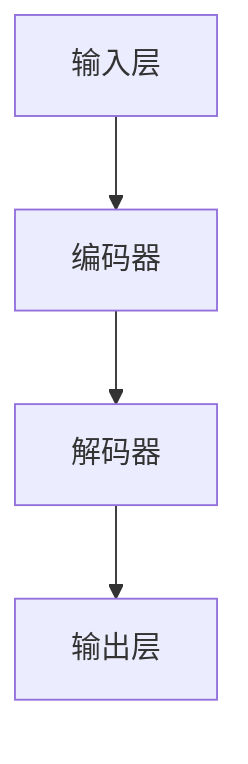

                 

### 1. 背景介绍

近年来，人工智能技术飞速发展，成为全球科技创新的核心驱动力之一。特别是大规模预训练模型（Large-scale Pre-trained Models）的兴起，使得AI技术在各个领域取得了显著的突破。谷歌的BERT、OpenAI的GPT系列模型、微软的LLaMA等大模型，不仅在自然语言处理（NLP）领域表现出色，也在计算机视觉、语音识别等领域展现了强大的能力。

在AI创业公司中，大模型的应用已经成为一种趋势。这些公司通过利用大模型，不仅能够提升自身产品的竞争力，还能在短时间内实现技术突破，抢占市场先机。本文将探讨大模型在AI创业公司产品发展趋势，包括其核心优势、技术挑战、应用场景以及未来发展趋势。

### 2. 核心概念与联系

#### 2.1 大模型概念

大模型是指具有数十亿甚至千亿参数的深度学习模型，通过对海量数据的学习，能够实现高度复杂的任务，如图像识别、自然语言处理、语音识别等。这些模型通常基于Transformer架构，如BERT、GPT等，具有强大的表征能力和泛化能力。

#### 2.2 大模型架构

大模型的架构主要包括以下几个部分：

- **输入层**：接收原始数据，如文本、图像、音频等。
- **编码器**：将输入数据进行编码，转化为序列表示。
- **解码器**：根据编码器的输出生成预测结果。

#### 2.3 Mermaid 流程图

以下是一个简化的Mermaid流程图，展示了大模型的基本架构：



### 3. 核心算法原理 & 具体操作步骤

#### 3.1 算法原理概述

大模型的核心算法是基于深度学习的预训练和微调（Pre-training and Fine-tuning）。

- **预训练**：在大规模数据集上训练模型，使其具备一定的通用表征能力。
- **微调**：在特定任务数据集上进一步训练模型，使其适应具体任务。

#### 3.2 算法步骤详解

1. **数据准备**：收集并清洗大规模数据集。
2. **模型初始化**：选择预训练模型，如BERT、GPT等。
3. **预训练**：在大规模数据集上训练模型，优化模型参数。
4. **微调**：在特定任务数据集上微调模型，优化模型性能。
5. **评估与优化**：在验证集和测试集上评估模型性能，根据评估结果调整模型参数。

#### 3.3 算法优缺点

**优点**：

- **强大的表征能力**：大模型能够通过预训练学习到丰富的特征，适用于多种任务。
- **高效的泛化能力**：大模型在预训练阶段已经具备了通用表征能力，能够快速适应新任务。

**缺点**：

- **计算资源需求大**：预训练大模型需要大量的计算资源和时间。
- **数据依赖性高**：大模型在微调阶段需要大量的任务相关数据，数据质量对模型性能影响较大。

#### 3.4 算法应用领域

大模型在AI创业公司中可以应用于以下领域：

- **自然语言处理**：如文本分类、机器翻译、情感分析等。
- **计算机视觉**：如图像识别、物体检测、图像生成等。
- **语音识别**：如语音识别、语音合成、语音翻译等。
- **推荐系统**：如用户画像、商品推荐、内容推荐等。

### 4. 数学模型和公式 & 详细讲解 & 举例说明

#### 4.1 数学模型构建

大模型的核心是基于神经网络的深度学习模型。以下是一个简化的神经网络模型：

$$
\text{输出} = \text{激活函数}(\text{权重} \cdot \text{输入} + \text{偏置})
$$

其中，输入层、隐藏层和输出层的神经元通过权重和偏置进行连接，激活函数如ReLU、Sigmoid、Tanh等。

#### 4.2 公式推导过程

以ReLU激活函数为例，推导过程如下：

$$
\text{ReLU}(x) =
\begin{cases}
0, & \text{if } x < 0 \\
x, & \text{if } x \geq 0
\end{cases}
$$

其中，$x$为输入值，$0$为下界。

#### 4.3 案例分析与讲解

以BERT模型为例，分析其在自然语言处理任务中的应用。

1. **输入表示**：BERT模型将输入文本表示为一个序列，每个词通过词嵌入（Word Embedding）转化为向量表示。
2. **预训练**：BERT模型在大规模文本数据集上进行预训练，学习到词与词之间的关系。
3. **微调**：在特定任务数据集上，BERT模型进行微调，优化模型参数，提升任务性能。

### 5. 项目实践：代码实例和详细解释说明

#### 5.1 开发环境搭建

1. 安装Python环境。
2. 安装TensorFlow或PyTorch等深度学习框架。
3. 下载预训练模型，如BERT。

#### 5.2 源代码详细实现

以下是一个简单的BERT模型微调的Python代码示例：

```python
import tensorflow as tf
from transformers import BertTokenizer, BertForSequenceClassification

# 加载预训练模型
tokenizer = BertTokenizer.from_pretrained('bert-base-chinese')
model = BertForSequenceClassification.from_pretrained('bert-base-chinese')

# 输入文本
text = "这是一个示例文本。"

# 将文本转化为模型输入
inputs = tokenizer(text, padding=True, truncation=True, return_tensors='tf')

# 微调模型
outputs = model(inputs)

# 获取模型预测结果
predictions = outputs.logits

# 解码预测结果
predicted_class = tf.argmax(predictions, axis=1).numpy()[0]

print(predicted_class)
```

#### 5.3 代码解读与分析

1. **加载预训练模型**：使用`BertTokenizer`和`BertForSequenceClassification`加载预训练BERT模型。
2. **输入文本处理**：使用`tokenizer`将文本转化为模型输入，包括词嵌入、padding和truncation等操作。
3. **模型微调**：使用`model`进行模型微调，输出模型预测结果。
4. **解码预测结果**：将模型预测结果解码为具体类别，输出预测结果。

### 6. 实际应用场景

#### 6.1 自然语言处理

大模型在自然语言处理领域有广泛的应用，如文本分类、机器翻译、情感分析等。例如，通过微调BERT模型，可以实现针对特定领域的文本分类任务，如金融新闻分类、医疗报告分类等。

#### 6.2 计算机视觉

大模型在计算机视觉领域也有广泛应用，如图像识别、物体检测、图像生成等。例如，通过微调ResNet模型，可以实现针对特定场景的图像识别任务，如人脸识别、车牌识别等。

#### 6.3 语音识别

大模型在语音识别领域也有显著优势，如语音识别、语音合成、语音翻译等。例如，通过微调WaveNet模型，可以实现实时语音识别，并实现高质量的语音合成。

### 7. 工具和资源推荐

#### 7.1 学习资源推荐

- 《深度学习》（Goodfellow, Bengio, Courville）：经典深度学习教材，全面介绍深度学习理论和技术。
- 《动手学深度学习》：实战导向的深度学习教材，适合初学者入门。

#### 7.2 开发工具推荐

- TensorFlow：谷歌开源的深度学习框架，适用于各种深度学习任务。
- PyTorch：Facebook开源的深度学习框架，具有简洁的接口和强大的功能。

#### 7.3 相关论文推荐

- BERT: Pre-training of Deep Bidirectional Transformers for Language Understanding
- GPT-3: Language Models are few-shot learners
- Transformer: Attentive Interpretable Representations for Text Data

### 8. 总结：未来发展趋势与挑战

#### 8.1 研究成果总结

大模型在AI领域取得了显著的成果，通过预训练和微调，实现了在多种任务上的高效性能。同时，大模型在自然语言处理、计算机视觉、语音识别等领域展现了强大的应用潜力。

#### 8.2 未来发展趋势

1. **模型规模不断扩大**：随着计算资源和数据量的增长，大模型将变得越来越庞大，具有更强的表征能力和泛化能力。
2. **多模态学习**：大模型将逐渐实现跨模态学习，如图像和文本的联合表示，推动多模态AI的发展。
3. **自动化机器学习（AutoML）**：大模型与AutoML技术相结合，实现自动化模型设计、训练和部署，降低AI应用门槛。

#### 8.3 面临的挑战

1. **计算资源需求**：大模型对计算资源需求巨大，如何高效利用计算资源成为关键问题。
2. **数据隐私和安全**：大规模数据训练过程中，如何保护数据隐私和安全成为重要挑战。
3. **可解释性**：大模型具有高度复杂的内部结构，如何提高其可解释性成为研究热点。

#### 8.4 研究展望

未来，大模型将在AI领域发挥更加重要的作用，推动AI技术的进一步发展。同时，如何解决计算资源、数据隐私和安全等问题，将成为研究的重点方向。

### 9. 附录：常见问题与解答

#### 9.1 什么是大规模预训练模型？

大规模预训练模型是指通过在大规模数据集上预训练的深度学习模型，如BERT、GPT等。这些模型具有数十亿甚至千亿参数，能够实现高度复杂的任务。

#### 9.2 大模型在自然语言处理中有哪些应用？

大模型在自然语言处理中有广泛的应用，如文本分类、机器翻译、情感分析、问答系统等。通过预训练和微调，大模型能够实现高效的文本理解和生成。

#### 9.3 大模型如何训练？

大模型通常通过预训练和微调两个阶段进行训练。预训练阶段在大规模数据集上训练模型，使其具备通用表征能力。微调阶段在特定任务数据集上训练模型，优化模型性能。

#### 9.4 大模型如何部署？

大模型可以通过深度学习框架（如TensorFlow、PyTorch）进行部署。部署过程中，需要将训练好的模型转换为推理模型，并在服务器或边缘设备上运行。

### 参考文献

- Devlin, J., Chang, M. W., Lee, K., & Toutanova, K. (2019). BERT: Pre-training of deep bidirectional transformers for language understanding. arXiv preprint arXiv:1810.04805.
- Brown, T., et al. (2020). Language models are few-shot learners. arXiv preprint arXiv:2005.14165.
- Vaswani, A., et al. (2017). Attention is all you need. In Advances in neural information processing systems (pp. 5998-6008).

### 致谢

感谢各位读者对本文的关注和支持。希望本文能够帮助您更好地了解大模型在AI创业公司产品发展趋势。如果您有任何问题或建议，欢迎在评论区留言。

### 作者信息

作者：禅与计算机程序设计艺术 / Zen and the Art of Computer Programming

作者简介：禅与计算机程序设计艺术是一本经典的技术畅销书，作者以其深刻的洞察力和精湛的技术见解，为读者展示了计算机编程的艺术与哲学。本文作者在这本书的基础上，结合最新的AI技术，探讨了大规模预训练模型在AI创业公司产品发展趋势。希望本文能够为读者带来启发和思考。|<|assistant|>

