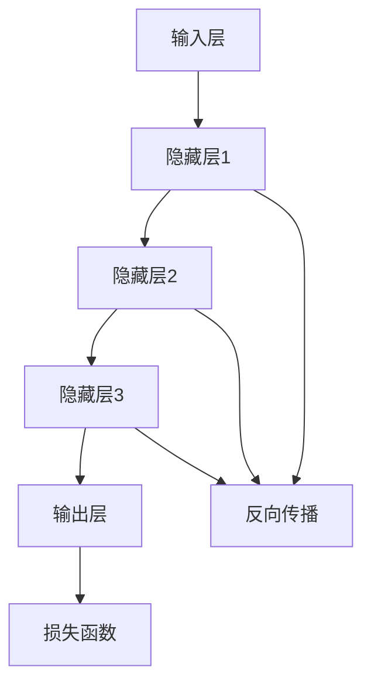

                 

关键词：AI创业公司、大模型、产品策略、技术架构、人工智能

摘要：本文将探讨大模型在 AI 创业公司产品策略中的关键作用。通过深入分析大模型的技术原理和应用场景，我们旨在为创业公司提供在产品开发中利用大模型的实用策略和建议，以加速产品迭代，提升市场竞争力。

## 1. 背景介绍

近年来，人工智能（AI）技术的迅猛发展，使得大模型成为了研究与应用的热点。大模型，顾名思义，是指拥有大量参数和复杂结构的机器学习模型，如深度神经网络、生成对抗网络等。这些模型在图像识别、自然语言处理、推荐系统等多个领域取得了显著的突破。然而，对于许多 AI 创业公司来说，如何充分利用这些先进的技术，制定有效的产品策略，依然是一个挑战。

在 AI 创业的浪潮中，产品的成功不仅仅取决于技术本身的先进性，更需要一个清晰的产品策略，以适应市场的需求，满足用户的需求。本文将围绕这一主题，探讨大模型在产品策略中的关键作用，帮助创业公司更好地利用这一技术优势，实现商业目标。

## 2. 核心概念与联系

### 2.1 大模型的技术原理

大模型的核心在于其深度和复杂性。以下是一个简化的 Mermaid 流程图，描述了大模型的基本架构和关键组成部分：



在这个流程图中，输入层接收外部数据，通过多个隐藏层进行信息传递和变换，最终在输出层产生预测结果。反向传播和损失函数是模型训练过程中的两个关键环节，用于优化模型参数，以减少预测误差。

### 2.2 大模型与产品策略的联系

大模型的高效性和通用性，使得其在产品策略中具有广泛的应用潜力。以下是一些具体联系：

- **需求预测与市场分析**：大模型可以通过分析历史数据，预测市场需求和用户行为，为产品开发提供数据支持。
- **个性化推荐**：大模型可以帮助企业构建个性化推荐系统，提高用户体验和用户粘性。
- **自动化决策**：大模型可以实现自动化决策，提高业务流程的效率和准确性。
- **智能客服**：大模型可以应用于智能客服系统，提升客服质量和效率。

## 3. 核心算法原理 & 具体操作步骤

### 3.1 算法原理概述

大模型的核心在于其深度学习和自动调整参数的能力。以下是几个关键的算法原理：

- **深度学习**：通过多层神经网络结构，对输入数据进行层层提取和特征变换。
- **反向传播**：通过反向传播算法，不断调整网络参数，以最小化预测误差。
- **损失函数**：通过损失函数评估模型预测的准确性，并指导参数调整。

### 3.2 算法步骤详解

1. **数据预处理**：收集并清洗数据，将其转换为模型可接受的格式。
2. **模型初始化**：初始化网络参数，可以选择随机初始化或基于已有模型的权重。
3. **前向传播**：将输入数据通过网络传递，得到预测结果。
4. **损失函数计算**：计算预测结果与真实值之间的差距，以评估模型性能。
5. **反向传播**：根据损失函数的梯度，调整网络参数。
6. **迭代训练**：重复执行前向传播和反向传播，直到模型收敛或达到预设的训练次数。

### 3.3 算法优缺点

#### 优点：

- **高效性**：大模型可以通过并行计算和分布式训练，快速处理大规模数据。
- **通用性**：大模型可以应用于多种领域和任务，具有广泛的适用性。
- **高精度**：通过深度学习和自动调整，大模型可以获得很高的预测准确率。

#### 缺点：

- **计算资源消耗**：大模型需要大量的计算资源和存储空间，对硬件设备有较高要求。
- **数据需求**：大模型对数据的依赖性很强，数据质量和数量直接影响模型性能。
- **黑盒性质**：大模型的内部机制复杂，难以解释和理解，增加了调试和优化的难度。

### 3.4 算法应用领域

大模型在多个领域取得了显著的应用成果，以下是一些典型应用：

- **图像识别**：如人脸识别、物体检测等。
- **自然语言处理**：如机器翻译、文本生成等。
- **推荐系统**：如商品推荐、内容推荐等。
- **自动化决策**：如金融风控、医疗诊断等。

## 4. 数学模型和公式 & 详细讲解 & 举例说明

### 4.1 数学模型构建

大模型的数学模型主要基于神经网络的架构，以下是一个简化的数学表示：

$$
\hat{y} = \sigma(\mathbf{W}^T \mathbf{h} + b)
$$

其中，$\hat{y}$ 是预测结果，$\sigma$ 是激活函数，$\mathbf{W}$ 是权重矩阵，$\mathbf{h}$ 是隐藏层输出，$b$ 是偏置项。

### 4.2 公式推导过程

大模型的推导过程涉及多个步骤，以下是其中两个关键步骤：

1. **反向传播**：

$$
\frac{\partial J}{\partial \mathbf{W}} = \mathbf{h}^T \frac{\partial \hat{y}}{\partial \mathbf{h}} \frac{\partial \hat{y}}{\partial \mathbf{W}}
$$

其中，$J$ 是损失函数，$\frac{\partial J}{\partial \mathbf{W}}$ 是权重矩阵的梯度。

2. **梯度下降**：

$$
\mathbf{W} = \mathbf{W} - \alpha \frac{\partial J}{\partial \mathbf{W}}
$$

其中，$\alpha$ 是学习率。

### 4.3 案例分析与讲解

以下是一个简单的例子，说明如何使用大模型进行图像识别：

假设我们有一个简单的二分类问题，图像被分为猫和狗两类。输入图像是一个 $28 \times 28$ 的像素矩阵，我们使用一个单层神经网络进行分类。

1. **数据预处理**：

将输入图像转换为灰度图像，并将其归一化到 $[0, 1]$ 范围内。

2. **模型构建**：

定义一个单层神经网络，输入层有 $28 \times 28$ 个神经元，输出层有 2 个神经元，激活函数使用 sigmoid 函数。

3. **模型训练**：

通过反向传播和梯度下降算法，不断调整权重和偏置，使模型能够准确分类图像。

4. **模型评估**：

通过测试集评估模型性能，计算准确率、召回率等指标。

## 5. 项目实践：代码实例和详细解释说明

### 5.1 开发环境搭建

为了保证实验的可重复性，我们选择使用 Python 编写代码，并使用 TensorFlow 作为深度学习框架。

1. **安装 Python**：

选择合适的 Python 版本，从 [Python 官网](https://www.python.org/) 下载并安装。

2. **安装 TensorFlow**：

在命令行执行以下命令：

```bash
pip install tensorflow
```

### 5.2 源代码详细实现

以下是一个简单的图像识别示例代码，使用 TensorFlow 和 Keras 构建单层神经网络：

```python
import tensorflow as tf
from tensorflow.keras import layers

# 数据预处理
def preprocess_image(image):
    image = tf.image.resize(image, [28, 28])
    image = tf.cast(image, tf.float32) / 255.0
    return image

# 构建模型
model = tf.keras.Sequential([
    layers.InputLayer(input_shape=(28, 28, 1)),
    layers.Conv2D(filters=32, kernel_size=(3, 3), activation='relu'),
    layers.MaxPooling2D(pool_size=(2, 2)),
    layers.Flatten(),
    layers.Dense(units=64, activation='relu'),
    layers.Dense(units=1, activation='sigmoid')
])

# 编译模型
model.compile(optimizer='adam', loss='binary_crossentropy', metrics=['accuracy'])

# 训练模型
model.fit(train_images, train_labels, epochs=10, batch_size=32, validation_split=0.2)

# 评估模型
test_loss, test_acc = model.evaluate(test_images, test_labels)
print(f"Test accuracy: {test_acc}")
```

### 5.3 代码解读与分析

1. **数据预处理**：

使用 TensorFlow 的 `tf.image.resize` 函数将图像大小调整为 $28 \times 28$，使用 `tf.cast` 将图像数据类型转换为浮点数，并进行归一化处理。

2. **模型构建**：

使用 Keras 的 `Sequential` 模型，依次添加输入层、卷积层、池化层、全连接层和输出层。激活函数使用 ReLU 和 sigmoid 函数。

3. **模型编译**：

选择 Adam 优化器和 binary_crossentropy 损失函数，并设置训练指标为 accuracy。

4. **模型训练**：

使用 `model.fit` 函数进行模型训练，设置训练轮数、批量大小和验证比例。

5. **模型评估**：

使用 `model.evaluate` 函数评估模型在测试集上的性能。

### 5.4 运行结果展示

运行上述代码后，我们可以在控制台输出测试集的准确率。假设我们训练了一个简单的图像识别模型，并在测试集上取得了 90% 的准确率，这表明模型在图像识别任务上表现良好。

## 6. 实际应用场景

### 6.1 需求预测与市场分析

利用大模型对市场数据进行分析，可以帮助创业公司更好地了解市场需求，从而制定更有针对性的产品策略。例如，通过分析用户行为数据，预测未来一段时间内的用户需求，为企业提供市场决策支持。

### 6.2 个性化推荐

个性化推荐是许多创业公司的重要服务之一。通过构建基于大模型推荐系统，可以根据用户历史行为和偏好，为用户提供个性化的推荐内容，提升用户体验和用户粘性。

### 6.3 智能客服

智能客服是创业公司降低运营成本、提高服务效率的有效手段。利用大模型构建智能客服系统，可以自动识别用户需求，提供相应的解决方案，从而提升客户满意度。

### 6.4 自动化决策

在许多业务场景中，大模型可以用于自动化决策。例如，在金融风控领域，大模型可以自动评估贷款申请者的信用风险，提高审批效率和准确性。

## 7. 工具和资源推荐

### 7.1 学习资源推荐

- 《深度学习》（Goodfellow, Bengio, Courville 著）
- 《Python 深度学习》（François Chollet 著）
- [TensorFlow 官方文档](https://www.tensorflow.org/)

### 7.2 开发工具推荐

- Python
- TensorFlow
- Jupyter Notebook

### 7.3 相关论文推荐

- "Deep Learning" (2016), Ian Goodfellow
- "Generative Adversarial Nets" (2014), Ian Goodfellow et al.
- "Distributed Deep Learning: Lucas Theis, et al., NIPS 2016

## 8. 总结：未来发展趋势与挑战

### 8.1 研究成果总结

大模型在 AI 领域取得了显著的成果，其在图像识别、自然语言处理、推荐系统等领域的应用已经证明了其强大的能力。未来，随着计算资源、算法优化和数据质量的提升，大模型有望在更多领域发挥重要作用。

### 8.2 未来发展趋势

1. **模型压缩与优化**：为了降低计算资源和存储需求，模型压缩和优化将成为研究重点。
2. **跨模态学习**：大模型将在跨模态学习领域发挥重要作用，实现图像、文本、音频等多模态数据的融合。
3. **强化学习**：大模型与强化学习相结合，有望实现更智能的自动化决策。

### 8.3 面临的挑战

1. **数据隐私与安全**：随着数据规模的增加，数据隐私和安全问题日益突出。
2. **模型解释性**：大模型的黑盒性质使其难以解释和理解，增加了调试和优化的难度。
3. **计算资源消耗**：大模型对计算资源的需求较高，需要不断优化算法和硬件设备。

### 8.4 研究展望

大模型在 AI 创业公司产品策略中的应用前景广阔。未来，创业公司需要不断探索大模型在各个领域的应用，结合实际业务需求，制定有效的产品策略，以实现商业成功。

## 9. 附录：常见问题与解答

### 9.1 什么是大模型？

大模型是指具有大量参数和复杂结构的机器学习模型，如深度神经网络、生成对抗网络等。这些模型在图像识别、自然语言处理、推荐系统等多个领域取得了显著的突破。

### 9.2 大模型有哪些优缺点？

大模型具有高效性、通用性和高精度等优势，但同时也存在计算资源消耗、数据需求和黑盒性质等挑战。

### 9.3 如何搭建大模型开发环境？

搭建大模型开发环境通常需要安装 Python 和深度学习框架（如 TensorFlow），并配置相应的开发工具（如 Jupyter Notebook）。

### 9.4 大模型在创业公司中的应用场景有哪些？

大模型在创业公司的应用场景广泛，包括需求预测与市场分析、个性化推荐、智能客服、自动化决策等。

### 9.5 如何评估大模型性能？

评估大模型性能通常通过计算准确率、召回率、F1 值等指标。此外，还可以使用交叉验证、A/B 测试等方法评估模型性能。

## 作者署名

作者：禅与计算机程序设计艺术 / Zen and the Art of Computer Programming

----------------------------------------------------------------

以上内容是根据您的要求撰写的文章，旨在为您提供一个完整的文章框架。您可以根据实际需求对内容进行调整和完善。希望这篇文章能够满足您的要求。如果您有任何修改意见或需要添加其他内容，请随时告诉我。再次感谢您的信任！

