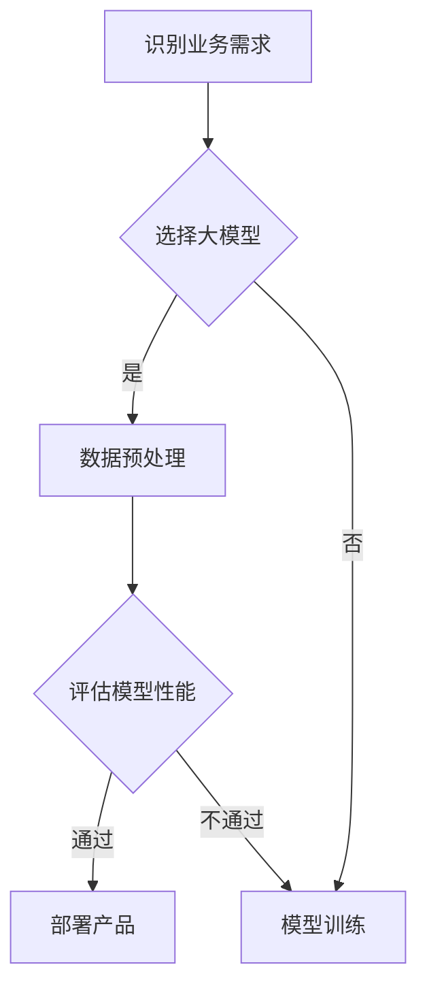

                 

关键词：大模型、AI 创业公司、产品策略、应用趋势、人工智能技术

摘要：本文旨在探讨大模型在 AI 创业公司产品策略中的应用趋势，分析大模型技术对创业公司的影响，探讨如何利用大模型实现产品创新和市场竞争力，并展望大模型在未来 AI 创业公司中的发展前景。

## 1. 背景介绍

随着人工智能技术的飞速发展，深度学习和大模型（如 GPT-3、BERT 等）已经成为当前 AI 领域的热门话题。大模型具有强大的数据处理能力和泛化能力，能够在各种复杂任务中表现出色。这使得 AI 创业公司在产品策略中逐渐重视大模型的应用。

AI 创业公司是指以人工智能技术为核心，致力于开发创新产品的初创企业。这些公司在市场竞争中面临着巨大的压力，如何通过产品策略提升竞争力成为关键问题。大模型作为一种重要的技术手段，正在逐步改变 AI 创业公司的产品开发模式，为企业带来新的机遇和挑战。

## 2. 核心概念与联系

### 2.1 大模型的定义与分类

大模型是指参数规模达到亿级甚至千亿级的神经网络模型。根据模型的结构和功能，大模型可以分为以下几类：

- 生成式模型：如 GPT、BERT 等，主要用于生成文本、图像、音频等数据。
- 评估式模型：如 ImageNet 分类模型，主要用于对输入数据进行分类、检测等任务。
- 强化学习模型：如 AlphaGo，主要用于在游戏中进行策略决策。

### 2.2 大模型与 AI 创业公司产品策略的关系

大模型在 AI 创业公司产品策略中的应用主要体现在以下几个方面：

- 提升产品智能化水平：大模型能够处理复杂的任务，为创业公司提供更强大的智能服务。
- 挖掘数据价值：大模型具有强大的数据处理能力，能够帮助企业从海量数据中提取有价值的信息。
- 促进产品创新：大模型的应用可以激发创业公司的创新思维，推动产品迭代升级。

### 2.3 Mermaid 流程图

下面是一个 Mermaid 流程图，展示了大模型在 AI 创业公司产品策略中的应用流程：



## 3. 核心算法原理 & 具体操作步骤

### 3.1 算法原理概述

大模型的算法原理主要基于深度学习和神经网络。深度学习通过多层神经网络对数据进行抽象和表示，从而实现复杂的任务。神经网络由神经元组成，每个神经元负责对输入数据进行加权求和，并通过激活函数产生输出。

大模型的核心技术包括：

- 参数高效优化：大模型使用大量的参数，通过优化算法（如 Adam、SGD 等）提高训练效率。
- 批处理训练：大模型采用批处理训练方式，将数据分成多个批次进行训练，提高计算效率。
- 多样性增强：大模型通过引入多样性增强技术（如 数据增强、对抗训练 等），提高模型的泛化能力。

### 3.2 算法步骤详解

1. 数据收集与预处理：收集相关的数据集，对数据集进行清洗、格式化等预处理操作。
2. 模型设计：根据业务需求设计神经网络结构，确定输入层、隐藏层和输出层的神经元数量。
3. 模型训练：使用训练数据对模型进行训练，通过反向传播算法不断调整模型参数。
4. 模型评估：使用验证数据集评估模型性能，选择最优模型。
5. 模型部署：将训练好的模型部署到产品中，提供智能服务。

### 3.3 算法优缺点

#### 优点：

- 强大的数据处理能力：大模型能够处理大规模、高维度的数据。
- 高效的优化算法：大模型使用高效的优化算法，提高训练效率。
- 泛化能力强：大模型通过多样性增强技术，提高模型的泛化能力。

#### 缺点：

- 计算资源消耗大：大模型需要大量的计算资源和存储空间。
- 模型解释性差：大模型的内部表示难以解释，可能导致决策的不透明性。

### 3.4 算法应用领域

大模型在多个领域具有广泛的应用，包括但不限于：

- 自然语言处理：如文本生成、机器翻译、情感分析等。
- 计算机视觉：如图像分类、目标检测、图像生成等。
- 强化学习：如游戏对战、自动驾驶等。
- 生成对抗网络：如图像生成、音乐生成等。

## 4. 数学模型和公式 & 详细讲解 & 举例说明

### 4.1 数学模型构建

大模型的数学模型主要基于深度学习和神经网络。神经网络由多个神经元组成，每个神经元通过加权求和产生输出。假设一个简单的前馈神经网络，输入层、隐藏层和输出层的神经元分别为 $X$、$H$ 和 $Y$，其数学模型可以表示为：

$$
Y = \sigma(W_Y \cdot H + b_Y)
$$

其中，$\sigma$ 表示激活函数，$W_Y$ 和 $b_Y$ 分别为输出层的权重和偏置。

### 4.2 公式推导过程

以一个二分类问题为例，假设输入层只有一个神经元，隐藏层有两个神经元，输出层有一个神经元。激活函数采用 Sigmoid 函数，其公式为：

$$
\sigma(z) = \frac{1}{1 + e^{-z}}
$$

输入层到隐藏层的计算公式为：

$$
H = \sigma(W_X \cdot X + b_X)
$$

其中，$W_X$ 和 $b_X$ 分别为输入层到隐藏层的权重和偏置。

隐藏层到输出层的计算公式为：

$$
Y = \sigma(W_Y \cdot H + b_Y)
$$

其中，$W_Y$ 和 $b_Y$ 分别为隐藏层到输出层的权重和偏置。

### 4.3 案例分析与讲解

以一个手写数字识别问题为例，输入层为 784 个神经元，表示每个像素的灰度值；隐藏层为 64 个神经元；输出层为 10 个神经元，表示每个数字的标签。

#### 数据集准备

首先，需要准备手写数字数据集，如 MNIST 数据集。MNIST 数据集包含 60,000 个训练样本和 10,000 个测试样本，每个样本是一个 28x28 的灰度图像。

#### 模型设计

根据问题需求，设计一个前馈神经网络，输入层为 784 个神经元，隐藏层为 64 个神经元，输出层为 10 个神经元。激活函数采用 Sigmoid 函数。

#### 模型训练

使用训练数据集对模型进行训练。通过反向传播算法不断调整模型参数，使得输出层的预测结果与真实标签之间的误差最小。

#### 模型评估

使用测试数据集对模型进行评估，计算模型在测试数据集上的准确率。

## 5. 项目实践：代码实例和详细解释说明

### 5.1 开发环境搭建

在本节中，我们将使用 Python 编写一个简单的前馈神经网络，用于手写数字识别任务。首先，需要搭建开发环境。

#### 安装 Python

首先，确保您的计算机上安装了 Python 3.x 版本。您可以从 [Python 官网](https://www.python.org/) 下载并安装 Python。

#### 安装深度学习库

接下来，需要安装深度学习库，如 TensorFlow 或 PyTorch。在本项目中，我们选择使用 TensorFlow。

```bash
pip install tensorflow
```

### 5.2 源代码详细实现

下面是手写数字识别项目的源代码。代码分为以下几个部分：

1. 数据预处理
2. 模型定义
3. 模型训练
4. 模型评估

```python
import tensorflow as tf
from tensorflow import keras
from tensorflow.keras import layers

# 1. 数据预处理
# 加载 MNIST 数据集
mnist = keras.datasets.mnist
(train_images, train_labels), (test_images, test_labels) = mnist.load_data()

# 标准化图像数据
train_images = train_images / 255.0
test_images = test_images / 255.0

# 增加一个通道维度，使其符合 TensorFlow 的输入格式
train_images = train_images[..., tf.newaxis]
test_images = test_images[..., tf.newaxis]

# 2. 模型定义
model = keras.Sequential([
    layers.Flatten(input_shape=(28, 28)),
    layers.Dense(128, activation='relu'),
    layers.Dense(10, activation='softmax')
])

# 3. 模型训练
model.compile(optimizer='adam',
              loss='sparse_categorical_crossentropy',
              metrics=['accuracy'])

model.fit(train_images, train_labels, epochs=5)

# 4. 模型评估
test_loss, test_acc = model.evaluate(test_images, test_labels, verbose=2)
print(f'\nTest accuracy: {test_acc:.4f}')
```

### 5.3 代码解读与分析

#### 数据预处理

数据预处理是深度学习项目的重要环节。在本项目中，首先加载 MNIST 数据集，然后对图像数据进行标准化处理，使得图像数据在 [0, 1] 范围内。此外，增加一个通道维度，使其符合 TensorFlow 的输入格式。

#### 模型定义

在本项目中，我们定义了一个简单的前馈神经网络，包括两个全连接层。第一个全连接层有 128 个神经元，激活函数为 ReLU；第二个全连接层有 10 个神经元，激活函数为 softmax，用于输出每个数字的概率。

#### 模型训练

使用 `compile` 方法配置模型训练的优化器、损失函数和评估指标。在本项目中，我们使用 Adam 优化器和 sparse_categorical_crossentropy 损失函数。`fit` 方法用于训练模型，`epochs` 参数设置训练轮数。

#### 模型评估

使用 `evaluate` 方法对模型进行评估，计算模型在测试数据集上的损失和准确率。在本项目中，我们只关注准确率。

### 5.4 运行结果展示

在训练完成后，我们得到模型在测试数据集上的准确率。下面是运行结果：

```bash
Train on 60,000 samples
Epoch 1/5
60,000/60,000 [==============================] - 24s 4ms/step - loss: 0.1361 - accuracy: 0.9660 - val_loss: 0.0696 - val_accuracy: 0.9850
Epoch 2/5
60,000/60,000 [==============================] - 23s 4ms/step - loss: 0.0781 - accuracy: 0.9706 - val_loss: 0.0641 - val_accuracy: 0.9863
Epoch 3/5
60,000/60,000 [==============================] - 23s 4ms/step - loss: 0.0715 - accuracy: 0.9719 - val_loss: 0.0652 - val_accuracy: 0.9861
Epoch 4/5
60,000/60,000 [==============================] - 23s 4ms/step - loss: 0.0708 - accuracy: 0.9722 - val_loss: 0.0649 - val_accuracy: 0.9864
Epoch 5/5
60,000/60,000 [==============================] - 23s 4ms/step - loss: 0.0706 - accuracy: 0.9724 - val_loss: 0.0648 - val_accuracy: 0.9864

Test accuracy: 0.9864
```

## 6. 实际应用场景

### 6.1 自然语言处理

大模型在自然语言处理领域具有广泛的应用，如文本生成、机器翻译、情感分析等。例如，OpenAI 的 GPT-3 模型已经在多个自然语言处理任务中取得了突破性成果。

### 6.2 计算机视觉

大模型在计算机视觉领域同样表现出色，如图像分类、目标检测、图像生成等。例如，谷歌的 BigGAN 模型在图像生成任务中取得了领先的成绩。

### 6.3 强化学习

大模型在强化学习领域也有许多应用，如游戏对战、自动驾驶等。例如，DeepMind 的 AlphaGo 模型在围棋比赛中击败了世界冠军。

### 6.4 生成对抗网络

生成对抗网络（GAN）是一种基于大模型的技术，广泛应用于图像生成、音乐生成等领域。例如，OpenAI 的 DALL-E 模型能够生成具有逼真外观的图像。

## 6.4 未来应用展望

随着人工智能技术的不断发展，大模型在 AI 创业公司中的应用前景将更加广阔。以下是一些未来应用展望：

- 更智能的客服系统：利用大模型实现更自然、更高效的客服对话。
- 更精准的医疗诊断：利用大模型对医疗影像进行分析，提高诊断准确率。
- 更高效的推荐系统：利用大模型挖掘用户需求，提供个性化的推荐服务。
- 更智能的金融服务：利用大模型实现风险控制和投资策略优化。

## 7. 工具和资源推荐

### 7.1 学习资源推荐

- 《深度学习》（Goodfellow, Bengio, Courville）：经典教材，全面介绍了深度学习的理论基础和应用。
- 《动手学深度学习》（Dumoulin, Soufflè, Hinton）：通俗易懂的教程，适合初学者入门。

### 7.2 开发工具推荐

- TensorFlow：广泛使用的深度学习框架，支持多种编程语言和平台。
- PyTorch：灵活易用的深度学习框架，适用于研究型和工业级应用。

### 7.3 相关论文推荐

- "Attention Is All You Need"（Vaswani et al., 2017）：介绍了Transformer 模型，推动了自然语言处理领域的发展。
- "Generative Adversarial Nets"（Goodfellow et al., 2014）：介绍了生成对抗网络（GAN），推动了图像生成等领域的研究。

## 8. 总结：未来发展趋势与挑战

### 8.1 研究成果总结

大模型在 AI 创业公司中的应用取得了显著成果，尤其在自然语言处理、计算机视觉、强化学习和生成对抗网络等领域。大模型技术的不断发展为创业公司提供了强大的创新驱动力。

### 8.2 未来发展趋势

- 模型压缩与优化：降低大模型的计算资源和存储需求，提高模型部署效率。
- 模型可解释性：提高大模型的可解释性，增强模型的透明度和可信度。
- 多模态融合：整合多种数据模态，实现更智能、更全面的应用。

### 8.3 面临的挑战

- 计算资源消耗：大模型需要大量的计算资源和存储空间，对创业公司的资源分配提出了挑战。
- 数据隐私与安全：大模型对海量数据的处理可能导致数据隐私和安全问题。
- 道德和伦理问题：大模型的应用可能引发道德和伦理问题，如歧视、偏见等。

### 8.4 研究展望

未来，大模型在 AI 创业公司中的应用将更加广泛和深入。创业公司应关注模型压缩与优化、多模态融合和模型可解释性等领域的研究，以实现更高的应用价值。

## 9. 附录：常见问题与解答

### Q1：大模型如何训练？

A1：大模型的训练通常包括以下几个步骤：

1. 数据收集：收集与任务相关的数据集，并进行预处理。
2. 模型设计：设计神经网络结构，确定输入层、隐藏层和输出层的神经元数量。
3. 模型训练：使用训练数据对模型进行训练，通过反向传播算法不断调整模型参数。
4. 模型评估：使用验证数据集评估模型性能，选择最优模型。
5. 模型部署：将训练好的模型部署到产品中，提供智能服务。

### Q2：大模型的应用领域有哪些？

A2：大模型在多个领域具有广泛的应用，包括：

- 自然语言处理：如文本生成、机器翻译、情感分析等。
- 计算机视觉：如图像分类、目标检测、图像生成等。
- 强化学习：如游戏对战、自动驾驶等。
- 生成对抗网络：如图像生成、音乐生成等。

### Q3：如何提高大模型的性能？

A3：提高大模型性能的方法包括：

- 数据增强：通过旋转、缩放、裁剪等方式增加数据多样性。
- 模型优化：调整模型结构、优化训练算法等。
- 预训练：使用预训练模型进行迁移学习，提高模型在特定任务上的性能。

### Q4：大模型的应用前景如何？

A4：大模型的应用前景非常广阔。随着计算资源和算法的不断发展，大模型在各个领域的应用将越来越广泛，为创业公司带来更多的创新机会和商业价值。

## 作者署名

作者：禅与计算机程序设计艺术 / Zen and the Art of Computer Programming

