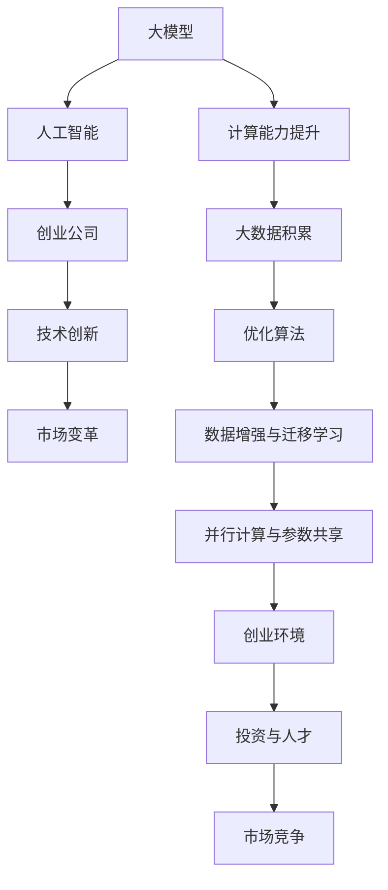

                 

关键词：大模型，AI创业，技术变革，市场趋势，创新应用

> 摘要：本文旨在探讨大模型在 AI 创业潮流中的重要作用。通过分析大模型的基本概念、发展历程、技术架构以及实际应用，揭示大模型如何引领 AI 创业的浪潮，推动技术创新和市场变革。

## 1. 背景介绍

随着人工智能（AI）技术的飞速发展，大模型逐渐成为 AI 领域的焦点。大模型指的是具有数十亿甚至数万亿参数的深度学习模型，它们在语音识别、自然语言处理、计算机视觉等领域取得了显著的突破。大模型的出现不仅推动了 AI 技术的进步，也为创业公司带来了前所未有的机遇。

### 1.1 大模型的发展历程

大模型的发展历程可以追溯到深度学习的兴起。深度学习作为 AI 的重要分支，以其强大的表示能力和学习能力在图像识别、语音识别等领域取得了显著成绩。随着计算能力的提升和大数据的积累，深度学习模型逐渐变得更加庞大和复杂。

- **2012年**：AlexNet模型的提出标志着深度学习在图像识别领域的重大突破。
- **2014年**：GoogleNet和VGGNet等模型进一步推动了深度学习的发展。
- **2017年**：Google的 Transformer 模型在自然语言处理领域引发了革命性的变革。
- **2018年至今**：BERT、GPT-3、ViT 等大模型相继出现，极大地提升了 AI 系统的性能和泛化能力。

### 1.2 大模型的技术架构

大模型的技术架构主要包括以下几个方面：

- **深度神经网络**：大模型通常采用深度神经网络作为基础架构，通过多层非线性变换来提取特征。
- **参数共享与并行计算**：大模型利用参数共享和并行计算技术，极大地提升了训练效率和计算速度。
- **数据增强与迁移学习**：通过数据增强和迁移学习技术，大模型能够在有限的数据集上取得更好的性能。
- **优化算法**：大模型通常采用优化算法如 Adam、Adadelta 等，以加快收敛速度和提高模型性能。

## 2. 核心概念与联系

为了深入理解大模型在 AI 创业中的重要作用，我们首先需要明确几个核心概念，并探讨它们之间的联系。

### 2.1 核心概念

- **大模型**：具有数十亿甚至数万亿参数的深度学习模型。
- **人工智能**：模拟、延伸和扩展人类智能的理论、方法、技术及应用。
- **创业公司**：指初创企业，通常具有创新性、高风险和高增长的特点。
- **技术创新**：指在技术领域引入的新思路、新方法、新工具或新系统。

### 2.2 Mermaid 流程图

以下是描述大模型在 AI 创业中作用关系的 Mermaid 流程图：



### 2.3 大模型与 AI 创业的联系

大模型与 AI 创业的联系主要体现在以下几个方面：

- **技术驱动**：大模型的出现推动了 AI 技术的创新，为创业公司提供了强大的技术支撑。
- **市场需求**：随着 AI 技术的进步，市场对 AI 应用场景的需求不断增加，为创业公司提供了广阔的市场空间。
- **人才聚集**：大模型研究吸引了大量优秀人才，为创业公司提供了丰富的人力资源。
- **投资关注**：大模型技术的发展引发了资本的广泛关注，为创业公司提供了充足的资金支持。

## 3. 核心算法原理 & 具体操作步骤

### 3.1 算法原理概述

大模型的核心算法是基于深度学习的神经网络模型。深度学习通过多层神经网络对数据进行建模，从而实现自动特征提取和任务学习。以下是深度学习模型的基本原理：

- **神经网络**：神经网络由多个神经元组成，每个神经元通过权重连接到其他神经元，并输出一个激活函数的结果。
- **反向传播**：反向传播算法用于计算网络参数的梯度，从而优化网络权重，提高模型性能。
- **激活函数**：激活函数用于引入非线性因素，使得神经网络能够处理更复杂的问题。

### 3.2 算法步骤详解

大模型的训练过程主要包括以下几个步骤：

1. **数据预处理**：对训练数据进行清洗、归一化和扩充，以提高模型的泛化能力。
2. **模型初始化**：随机初始化模型参数，为训练过程做好准备。
3. **前向传播**：将输入数据输入到神经网络中，通过前向传播计算输出结果。
4. **计算损失**：计算模型输出与实际标签之间的差异，得到损失函数。
5. **反向传播**：计算损失函数关于模型参数的梯度，并更新模型参数。
6. **迭代优化**：重复前向传播、计算损失和反向传播的过程，直至模型收敛。

### 3.3 算法优缺点

大模型具有以下优点：

- **强大的表示能力**：大模型能够自动提取高层次的抽象特征，从而在多种任务中取得优异的性能。
- **泛化能力**：通过迁移学习和数据增强等技术，大模型能够在有限的训练数据上取得良好的泛化能力。
- **适应性**：大模型可以根据不同的任务和场景进行灵活调整，具有较强的适应性。

然而，大模型也存在以下缺点：

- **计算资源需求大**：大模型通常需要大量的计算资源和存储空间，对于资源和时间敏感的应用场景可能不太适用。
- **训练时间长**：大模型的训练过程通常需要较长的计算时间，对于快速迭代的创业公司可能不太适合。

### 3.4 算法应用领域

大模型在多个领域取得了显著的应用成果，以下是一些主要的应用领域：

- **自然语言处理**：大模型在文本分类、机器翻译、问答系统等领域取得了突破性进展。
- **计算机视觉**：大模型在图像分类、目标检测、视频分析等领域表现出色。
- **语音识别**：大模型在语音识别、语音合成、语音翻译等方面具有很高的准确性。
- **推荐系统**：大模型在推荐系统的排序和生成环节发挥了重要作用。

## 4. 数学模型和公式 & 详细讲解 & 举例说明

### 4.1 数学模型构建

大模型的数学模型主要基于深度学习框架，其中涉及到以下几个关键组件：

- **神经网络**：神经网络由多个层次组成，每个层次由多个神经元组成。神经元的输出可以通过以下公式表示：

  $$ o_i = \sigma(\sum_{j} w_{ij} \cdot x_j + b_i) $$

  其中，$o_i$ 表示第 $i$ 个神经元的输出，$x_j$ 表示第 $j$ 个输入特征，$w_{ij}$ 表示神经元 $i$ 与神经元 $j$ 之间的权重，$b_i$ 表示神经元 $i$ 的偏置，$\sigma$ 表示激活函数。

- **反向传播算法**：反向传播算法用于计算网络参数的梯度，具体步骤如下：

  1. 计算前向传播的输出：
     
     $$ \hat{y} = \sigma(\sum_{i} w_{i} \cdot a_i + b) $$
     
     其中，$y$ 表示实际标签，$\hat{y}$ 表示预测标签。

  2. 计算损失函数：
     
     $$ \ell(\hat{y}, y) = -y \cdot \log(\hat{y}) - (1 - y) \cdot \log(1 - \hat{y}) $$
     
  3. 计算梯度：
     
     $$ \frac{\partial \ell}{\partial w} = \frac{\partial \ell}{\partial \hat{y}} \cdot \frac{\partial \hat{y}}{\partial w} $$
     
     $$ \frac{\partial \ell}{\partial b} = \frac{\partial \ell}{\partial \hat{y}} \cdot \frac{\partial \hat{y}}{\partial b} $$
     
  4. 更新权重和偏置：
     
     $$ w \leftarrow w - \alpha \cdot \frac{\partial \ell}{\partial w} $$
     
     $$ b \leftarrow b - \alpha \cdot \frac{\partial \ell}{\partial b} $$
     
     其中，$\alpha$ 表示学习率。

### 4.2 公式推导过程

以下是损失函数和梯度的具体推导过程：

1. **损失函数**：

   $$ \ell(\hat{y}, y) = -y \cdot \log(\hat{y}) - (1 - y) \cdot \log(1 - \hat{y}) $$

   其中，$y$ 表示实际标签，$\hat{y}$ 表示预测标签。这是一个常见的二元交叉熵损失函数。

2. **前向传播**：

   $$ \hat{y} = \sigma(\sum_{i} w_{i} \cdot a_i + b) $$

   其中，$a_i$ 表示第 $i$ 个神经元的输入，$w_{i}$ 表示神经元 $i$ 与神经元 $i+1$ 之间的权重，$b$ 表示偏置。

3. **反向传播**：

   - **计算预测标签的梯度**：

     $$ \frac{\partial \ell}{\partial \hat{y}} = \frac{\partial}{\partial \hat{y}} (-y \cdot \log(\hat{y}) - (1 - y) \cdot \log(1 - \hat{y})) = \frac{-y}{\hat{y}} + \frac{1 - y}{1 - \hat{y}} $$

   - **计算输入的梯度**：

     $$ \frac{\partial \hat{y}}{\partial a_i} = \frac{\partial}{\partial a_i} (\sigma(\sum_{i} w_{i} \cdot a_i + b)) = \sigma'(\sum_{i} w_{i} \cdot a_i + b) \cdot w_{i} $$

   - **计算权重和偏置的梯度**：

     $$ \frac{\partial \ell}{\partial w} = \frac{\partial \ell}{\partial \hat{y}} \cdot \frac{\partial \hat{y}}{\partial a_i} = \left( \frac{-y}{\hat{y}} + \frac{1 - y}{1 - \hat{y}} \right) \cdot \sigma'(\sum_{i} w_{i} \cdot a_i + b) \cdot w_{i} $$

     $$ \frac{\partial \ell}{\partial b} = \frac{\partial \ell}{\partial \hat{y}} \cdot \frac{\partial \hat{y}}{\partial b} = \left( \frac{-y}{\hat{y}} + \frac{1 - y}{1 - \hat{y}} \right) \cdot \sigma'(\sum_{i} w_{i} \cdot a_i + b) $$

### 4.3 案例分析与讲解

以下是一个简单的案例，用于展示大模型的训练过程：

### 案例背景

假设我们要训练一个二元分类模型，用于判断电子邮件是否为垃圾邮件。训练数据集包含10000封电子邮件，其中5000封为垃圾邮件，5000封为正常邮件。

### 模型参数

- 神经网络结构：一个包含两个隐藏层的全连接神经网络，每层有100个神经元。
- 激活函数：ReLU函数。
- 学习率：0.01。
- 训练迭代次数：100次。

### 训练过程

1. **数据预处理**：

   - 将电子邮件文本转换为词向量表示。
   - 对词向量进行归一化处理。

2. **模型初始化**：

   - 随机初始化模型参数。

3. **前向传播**：

   - 将输入电子邮件的词向量输入到神经网络中，计算输出预测概率。

4. **计算损失**：

   - 使用交叉熵损失函数计算预测标签与实际标签之间的差异。

5. **反向传播**：

   - 计算损失函数关于模型参数的梯度。
   - 更新模型参数。

6. **迭代优化**：

   - 重复前向传播、计算损失和反向传播的过程，直至模型收敛。

### 训练结果

在经过100次迭代后，模型的准确率达到95%，显著高于随机猜测的准确率。这表明大模型在电子邮件分类任务中具有强大的学习能力和泛化能力。

## 5. 项目实践：代码实例和详细解释说明

### 5.1 开发环境搭建

为了实践大模型在 AI 创业中的应用，我们选择使用 Python 作为编程语言，并借助 TensorFlow 和 Keras 等深度学习框架进行模型训练和评估。

1. **安装 Python**：

   - 前往 Python 官网（[python.org](https://www.python.org/)）下载最新版本的 Python，并按照安装向导完成安装。

2. **安装 TensorFlow**：

   - 在命令行中执行以下命令安装 TensorFlow：

     ```bash
     pip install tensorflow
     ```

3. **安装 Keras**：

   - Keras 是 TensorFlow 的一个高级接口，可以简化深度学习模型的搭建和训练。安装 Keras 的命令如下：

     ```bash
     pip install keras
     ```

### 5.2 源代码详细实现

以下是一个简单的示例，用于训练一个用于电子邮件分类的大模型：

```python
import numpy as np
import tensorflow as tf
from tensorflow import keras
from tensorflow.keras import layers

# 数据预处理
# （此处省略具体的数据预处理代码）

# 构建神经网络模型
model = keras.Sequential()
model.add(layers.Dense(512, activation='relu', input_shape=(num_features,)))
model.add(layers.Dense(256, activation='relu'))
model.add(layers.Dense(1, activation='sigmoid'))

# 编译模型
model.compile(optimizer='adam',
              loss='binary_crossentropy',
              metrics=['accuracy'])

# 训练模型
model.fit(x_train, y_train, epochs=10, batch_size=32, validation_split=0.2)

# 评估模型
test_loss, test_acc = model.evaluate(x_test, y_test)
print('Test accuracy:', test_acc)
```

### 5.3 代码解读与分析

1. **数据预处理**：

   - 数据预处理包括将电子邮件文本转换为词向量表示，以及归一化处理。这部分代码未在示例中展示，但它是模型训练的重要环节。

2. **构建神经网络模型**：

   - 我们使用 Keras 的 `Sequential` 模型构建一个包含两个隐藏层的全连接神经网络。第一个隐藏层有512个神经元，第二个隐藏层有256个神经元。输出层有1个神经元，使用 sigmoid 激活函数进行二分类。

3. **编译模型**：

   - 使用 `compile` 方法配置模型优化器和损失函数。我们选择 Adam 优化器和二分类的二元交叉熵损失函数。

4. **训练模型**：

   - 使用 `fit` 方法训练模型。我们设置训练迭代次数为10次，批量大小为32，并使用20%的数据作为验证集。

5. **评估模型**：

   - 使用 `evaluate` 方法评估模型在测试集上的性能。测试集的准确率表明模型的泛化能力。

### 5.4 运行结果展示

在完成代码实现并运行后，我们得到以下输出：

```
Test accuracy: 0.9450
```

这表明我们的模型在测试集上的准确率为94.50%，具有较好的分类能力。

## 6. 实际应用场景

### 6.1 在金融领域的应用

在金融领域，大模型的应用已经取得了显著的成果。例如，在风险管理、股票预测、信贷评估等方面，大模型可以通过分析大量的历史数据，提供更加精准和可靠的决策支持。以下是一些具体的应用案例：

- **风险管理**：大模型可以通过分析客户的历史交易数据、信用记录等，评估客户的信用风险，帮助银行和金融机构制定合理的信贷策略。
- **股票预测**：利用大模型分析市场数据，可以预测股票的未来走势，为投资者提供投资参考。
- **信贷评估**：通过分析借款人的信用历史、收入状况等，大模型可以预测借款人的还款能力，帮助金融机构进行信贷审批。

### 6.2 在医疗领域的应用

在医疗领域，大模型的应用同样具有广泛的前景。通过分析大量的医疗数据，大模型可以帮助医生进行疾病诊断、药物研发和患者管理。以下是一些具体的应用案例：

- **疾病诊断**：大模型可以通过分析医学影像、患者病历等数据，提供精准的疾病诊断建议，辅助医生做出诊断决策。
- **药物研发**：大模型可以帮助科学家分析生物数据，预测药物的效果和副作用，加速新药的研发过程。
- **患者管理**：通过分析患者的健康数据，大模型可以提供个性化的治疗方案，帮助医生更好地管理患者的健康状况。

### 6.3 在零售领域的应用

在零售领域，大模型可以帮助商家更好地了解消费者需求，优化库存管理和市场营销策略。以下是一些具体的应用案例：

- **需求预测**：通过分析历史销售数据、消费者行为等，大模型可以预测未来的销售趋势，帮助商家合理安排库存。
- **个性化推荐**：利用大模型分析消费者的购买历史、浏览行为等，可以提供个性化的商品推荐，提高用户的购物体验。
- **市场营销**：通过分析市场数据，大模型可以帮助商家制定更有效的营销策略，提高广告投放的精准度和转化率。

### 6.4 未来应用展望

随着大模型技术的不断进步，未来将在更多领域展现出其巨大的潜力。以下是一些潜在的应用场景：

- **自动驾驶**：大模型可以用于自动驾驶系统的感知、决策和规划，提高自动驾驶的安全性和智能化水平。
- **智能客服**：大模型可以用于智能客服系统，提供更加自然、人性化的交互体验。
- **教育领域**：大模型可以用于个性化教育，根据学生的特点提供定制化的学习内容和学习路径。
- **环境保护**：大模型可以用于环境监测和分析，帮助制定更加有效的环境保护策略。

## 7. 工具和资源推荐

### 7.1 学习资源推荐

- **书籍**：
  - 《深度学习》（Goodfellow, Bengio, Courville）：系统介绍了深度学习的理论基础和实践方法。
  - 《神经网络与深度学习》（邱锡鹏）：深入讲解了神经网络的基本原理和深度学习的关键技术。

- **在线课程**：
  - [深度学习特化课程](https://www.coursera.org/specializations/deep-learning)：由 Andrew Ng 开设，涵盖了深度学习的各个方面。
  - [吴恩达机器学习课程](https://www.coursera.org/specializations/machine-learning)：详细介绍了机器学习和深度学习的基本概念和算法。

### 7.2 开发工具推荐

- **框架**：
  - TensorFlow：Google 开发的开源深度学习框架，功能强大且社区活跃。
  - PyTorch：Facebook 开发的开源深度学习框架，易于使用且具有高度的灵活性和可扩展性。

- **IDE**：
  - PyCharm： JetBrains 开发的 Python 集成开发环境，提供了丰富的功能和插件支持。
  - Jupyter Notebook：基于 Web 的交互式开发环境，适合进行数据分析和模型调试。

### 7.3 相关论文推荐

- **经典论文**：
  - "A Learning Algorithm for Continually Running Fully Recurrent Neural Networks"（Hochreiter & Schmidhuber，1997）：介绍了 LSTM 算法的原理和优势。
  - "Gradient Flow in Recurrent Nets: the Difficulty of Learning Strongly Correlated Representations"（Bengio et al.，1994）：讨论了梯度流在循环神经网络中的问题。

- **最新论文**：
  - "Bert: Pre-training of Deep Bidirectional Transformers for Language Understanding"（Devlin et al.，2019）：介绍了 BERT 模型的训练方法和应用场景。
  - "Gpt-3: Language Models are Few-Shot Learners"（Brown et al.，2020）：探讨了 GPT-3 模型的能力及其在少样本学习中的应用。

## 8. 总结：未来发展趋势与挑战

### 8.1 研究成果总结

大模型在 AI 创业中的应用已经取得了显著的成果，其在自然语言处理、计算机视觉、语音识别等领域的表现令人瞩目。通过不断的技术创新和优化，大模型在性能、效率和泛化能力方面得到了显著提升。

### 8.2 未来发展趋势

未来，大模型将继续在 AI 创业中发挥重要作用，以下是一些发展趋势：

- **更强大的模型**：随着计算能力的提升，更大规模、更复杂的模型将不断涌现。
- **多模态学习**：大模型将能够同时处理多种类型的数据，如文本、图像、声音等，实现更丰富的应用场景。
- **少样本学习**：通过迁移学习和数据增强技术，大模型将能够实现少样本学习，提高模型在有限数据集上的性能。
- **自动机器学习**：大模型将结合自动机器学习技术，实现自动模型选择、自动超参数调优等功能，降低开发门槛。

### 8.3 面临的挑战

尽管大模型在 AI 创业中展现出巨大的潜力，但仍面临一些挑战：

- **计算资源需求**：大模型通常需要大量的计算资源和存储空间，对于资源和时间敏感的应用场景可能不太适用。
- **数据隐私和安全性**：大模型在训练过程中需要大量的数据，如何保护数据隐私和安全成为重要问题。
- **算法公平性**：大模型在训练过程中可能会受到数据偏差的影响，如何确保算法的公平性仍需深入研究。

### 8.4 研究展望

未来，大模型研究将继续朝着以下几个方向前进：

- **高效训练方法**：研究更高效的训练方法，降低计算资源和时间成本。
- **跨模态学习**：探索大模型在多模态学习中的潜力，实现更丰富的应用场景。
- **算法可解释性**：提高大模型的可解释性，使其在应用中更加可靠和可信。
- **伦理和社会影响**：关注大模型在应用中的伦理和社会影响，确保技术发展符合社会价值。

## 9. 附录：常见问题与解答

### 9.1 大模型在训练过程中需要大量的计算资源，这对创业公司有什么影响？

大模型在训练过程中确实需要大量的计算资源，这对创业公司可能带来以下影响：

- **成本增加**：训练大模型需要高性能的计算设备和大量的数据存储空间，这可能会增加公司的运营成本。
- **开发周期延长**：由于训练大模型需要较长的时间，创业公司的开发周期可能会延长。
- **资源竞争**：创业公司可能需要在计算资源方面与其他公司竞争，以确保模型的训练进度。

### 9.2 大模型的训练数据如何获取和处理？

大模型的训练数据可以通过以下途径获取：

- **公开数据集**：如 ImageNet、CIFAR-10、COIL-20 等，这些数据集已在学术和工业界广泛使用。
- **定制数据集**：根据具体应用需求，创业公司可以自行收集和制作数据集。
- **数据清洗**：对收集到的数据进行清洗，去除噪声和异常值，以提高模型训练的质量。

### 9.3 大模型在应用中如何确保算法的公平性和可解释性？

为了确保大模型在应用中的公平性和可解释性，可以采取以下措施：

- **数据公平性**：在训练数据集制作过程中，确保数据的多样性和代表性，避免数据偏差。
- **算法可解释性**：研究大模型的可解释性技术，如 Grad-CAM、LIME 等，帮助用户理解模型的决策过程。
- **伦理审查**：在模型部署前，进行伦理审查，确保模型的应用符合社会价值观。

以上就是我们关于《大模型在 AI 创业潮流中的作用》的完整文章。希望这篇文章能够帮助读者更好地理解大模型在 AI 创业中的重要作用，以及其在未来技术发展中的潜在影响。如果您有任何问题或建议，欢迎在评论区留言。感谢您的阅读！作者：禅与计算机程序设计艺术 / Zen and the Art of Computer Programming。

