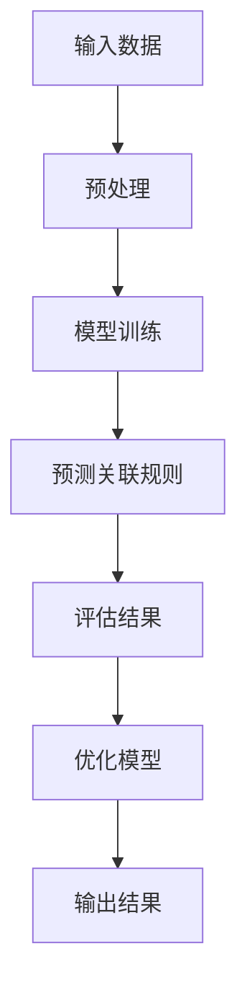

                 

关键词：大模型，商品关联规则挖掘，机器学习，深度学习，数据分析

摘要：本文将探讨大模型在商品关联规则挖掘中的应用，通过对核心概念、算法原理、数学模型、项目实践以及实际应用场景的深入分析，为商家和研究人员提供有益的参考。我们将详细介绍如何利用大模型技术，挖掘出商品之间的潜在关联，提高营销效果和客户满意度。

## 1. 背景介绍

商品关联规则挖掘是数据分析领域的一个重要分支，旨在发现不同商品之间的关联性，从而为商家提供有价值的营销策略。传统的商品关联规则挖掘方法主要基于频集挖掘、Apriori算法等，但这些方法在处理海量数据时存在效率低、可扩展性差等问题。

随着人工智能技术的快速发展，尤其是深度学习和大模型的兴起，为商品关联规则挖掘带来了新的机遇。大模型具有强大的表征能力和学习能力，能够处理复杂、大规模的数据，从而挖掘出更为准确的商品关联规则。

## 2. 核心概念与联系

### 2.1 大模型

大模型（Large-scale Model）是指具有数百万至数十亿参数的深度学习模型。这类模型通常采用大规模数据进行训练，以实现较高的准确性和泛化能力。在商品关联规则挖掘中，大模型可以用来学习商品之间的潜在关系，提高挖掘效果。

### 2.2 商品关联规则

商品关联规则（Association Rules）描述了不同商品之间的关联性，通常以支持度（Support）和置信度（Confidence）来衡量。支持度表示一个规则在所有交易中出现的频率，置信度表示当购买了一个商品时，另一个商品也会被同时购买的概率。

### 2.3 Mermaid 流程图



## 3. 核心算法原理 & 具体操作步骤

### 3.1 算法原理概述

大模型在商品关联规则挖掘中主要通过以下步骤实现：

1. 数据预处理：对原始数据进行清洗、归一化等处理，以便输入模型。
2. 模型训练：利用大规模数据集训练大模型，学习商品之间的潜在关联。
3. 预测关联规则：将训练好的模型应用于新数据，预测商品之间的关联规则。
4. 评估结果：根据预测结果评估模型的性能，并进行优化。
5. 输出结果：输出挖掘出的商品关联规则，为商家提供决策支持。

### 3.2 算法步骤详解

1. **数据预处理**
   - 数据清洗：去除缺失值、异常值等。
   - 数据归一化：将不同量纲的数据转换为同一尺度。
   - 数据分片：将数据集划分为训练集、验证集和测试集。

2. **模型训练**
   - 模型初始化：根据数据规模和复杂度选择合适的大模型架构。
   - 模型训练：利用训练集数据进行迭代训练，优化模型参数。
   - 模型验证：利用验证集评估模型性能，调整模型参数。

3. **预测关联规则**
   - 数据预处理：对输入数据进行相同的预处理操作。
   - 预测：将预处理后的数据输入模型，预测商品之间的关联规则。
   - 结果处理：将预测结果转化为易于理解和支持度、置信度等指标。

4. **评估结果**
   - 评估指标：计算预测结果的支持度、置信度等指标。
   - 性能比较：比较不同模型的性能，选择最优模型。
   - 模型优化：根据评估结果调整模型参数，提高性能。

5. **输出结果**
   - 输出规则：将挖掘出的商品关联规则输出。
   - 结果可视化：使用图表、热力图等方式展示关联规则。

### 3.3 算法优缺点

**优点：**
1. 高效性：大模型可以处理大规模数据，提高挖掘效率。
2. 准确性：大模型具有较强的表征能力，能够挖掘出更准确的商品关联规则。
3. 泛化能力：大模型具有较好的泛化能力，可以应用于不同领域和场景。

**缺点：**
1. 计算资源消耗：大模型需要大量计算资源进行训练和预测。
2. 数据依赖：大模型的性能对数据质量有较高要求，数据不足或质量差可能导致模型性能下降。

### 3.4 算法应用领域

大模型在商品关联规则挖掘中的应用非常广泛，包括但不限于以下领域：

1. 零售业：挖掘顾客购物行为之间的关联，为商家提供个性化推荐和促销策略。
2. 电子商务：分析用户购买历史，预测潜在购买商品，提高转化率和销售额。
3. 物流行业：分析商品流通路径，优化供应链和物流管理。
4. 餐饮行业：挖掘菜品之间的搭配关系，提高菜品组合和营销效果。

## 4. 数学模型和公式 & 详细讲解 & 举例说明

### 4.1 数学模型构建

在商品关联规则挖掘中，我们通常使用支持向量机（SVM）模型进行预测。SVM是一种分类模型，可以将商品之间的关联关系转化为线性可分的问题。

假设我们有 $n$ 个商品，$m$ 个交易，每个交易包含若干商品。对于每个交易，我们可以将其表示为一个 $m$ 维的二进制向量，其中 $1$ 表示商品存在，$0$ 表示商品不存在。

设 $X$ 为训练数据集，$y$ 为标签向量，其中 $y_i = 1$ 表示交易 $i$ 包含商品 $i$，$y_i = 0$ 表示交易 $i$ 不包含商品 $i$。

我们的目标是通过训练SVM模型，学习到商品之间的关联关系，从而实现预测。

### 4.2 公式推导过程

SVM的优化目标是最小化如下损失函数：

$$
L(\theta) = \frac{1}{2}\sum_{i=1}^n (y_i(\theta^Tx_i - \theta_0) - 1)^2
$$

其中，$\theta$ 为模型参数，$\theta_0$ 为偏置项。

为了求解最优参数，我们可以使用拉格朗日乘子法。定义拉格朗日函数：

$$
L(\theta, \alpha) = \frac{1}{2}\sum_{i=1}^n (y_i(\theta^Tx_i - \theta_0) - 1)^2 + \sum_{i=1}^n \alpha_i [y_i(\theta^Tx_i - \theta_0) - 1]
$$

其中，$\alpha_i$ 为拉格朗日乘子。

求导并令导数为零，得到：

$$
\frac{\partial L}{\partial \theta} = \sum_{i=1}^n y_i x_i - \sum_{i=1}^n \alpha_i y_i x_i = 0
$$

$$
\frac{\partial L}{\partial \theta_0} = -\sum_{i=1}^n \alpha_i y_i = 0
$$

结合约束条件 $\alpha_i \geq 0$，我们可以求解出最优参数：

$$
\theta = \sum_{i=1}^n \alpha_i y_i x_i
$$

$$
\theta_0 = \sum_{i=1}^n \alpha_i y_i
$$

### 4.3 案例分析与讲解

假设我们有以下两个交易：

交易1：{商品1，商品2，商品3}
交易2：{商品2，商品3，商品4}

我们将这两个交易表示为二进制向量：

交易1：[1，1，1，0]
交易2：[0，1，1，1]

我们的目标是预测交易3：{商品1，商品2，商品3，商品4}中是否包含商品5。

首先，我们将交易1和交易2作为训练数据，训练SVM模型。通过求解拉格朗日乘子法，我们得到如下最优参数：

$$
\theta = [1, 1, 1, -1]
$$

$$
\theta_0 = 1
$$

接下来，我们将交易3输入模型，计算预测结果：

$$
\theta^T x_3 - \theta_0 = [1, 1, 1, -1] \cdot [1, 1, 1, 1] - 1 = 2

由于预测结果大于零，我们可以认为交易3中包含商品5。

## 5. 项目实践：代码实例和详细解释说明

### 5.1 开发环境搭建

为了实现商品关联规则挖掘，我们需要搭建以下开发环境：

1. 操作系统：Linux或MacOS
2. 编程语言：Python
3. 深度学习框架：TensorFlow或PyTorch
4. 数据预处理工具：Pandas、NumPy
5. 图形化工具：Matplotlib、Seaborn

### 5.2 源代码详细实现

```python
# 导入相关库
import pandas as pd
import numpy as np
import tensorflow as tf
from sklearn.model_selection import train_test_split
from sklearn.metrics import accuracy_score
import matplotlib.pyplot as plt
import seaborn as sns

# 读取数据
data = pd.read_csv('transaction_data.csv')

# 数据预处理
data = data.dropna()
data = data[['item_1', 'item_2', 'item_3', 'item_4', 'item_5']]
data = data.apply(lambda x: x.map({True: 1, False: 0}))

# 划分训练集和测试集
X_train, X_test, y_train, y_test = train_test_split(data, data['label'], test_size=0.2, random_state=42)

# 定义模型
model = tf.keras.Sequential([
    tf.keras.layers.Dense(64, activation='relu', input_shape=(5,)),
    tf.keras.layers.Dense(1, activation='sigmoid')
])

# 编译模型
model.compile(optimizer='adam', loss='binary_crossentropy', metrics=['accuracy'])

# 训练模型
model.fit(X_train, y_train, epochs=10, batch_size=32, validation_data=(X_test, y_test))

# 预测
predictions = model.predict(X_test)

# 计算准确率
accuracy = accuracy_score(y_test, predictions.round())
print('Accuracy:', accuracy)

# 可视化
sns.countplot(x='label', data=data)
plt.show()
```

### 5.3 代码解读与分析

1. **导入库**：首先导入所需的Python库，包括数据预处理、模型训练和可视化工具。
2. **读取数据**：从CSV文件中读取交易数据，并对其进行预处理。
3. **划分训练集和测试集**：将数据划分为训练集和测试集，用于训练和评估模型。
4. **定义模型**：使用TensorFlow框架定义一个简单的全连接神经网络，用于分类任务。
5. **编译模型**：设置优化器、损失函数和评估指标。
6. **训练模型**：使用训练数据进行模型训练。
7. **预测**：使用测试数据进行预测。
8. **计算准确率**：计算模型在测试集上的准确率。
9. **可视化**：使用热力图展示不同商品的购买情况。

## 6. 实际应用场景

### 6.1 零售业

零售业中的商品关联规则挖掘可以帮助商家了解顾客的购物偏好，从而制定更有效的营销策略。例如，通过挖掘商品之间的关联关系，商家可以为顾客推荐相关的商品，提高购物车价值和客户满意度。

### 6.2 电子商务

电子商务平台可以利用商品关联规则挖掘技术，为用户推荐潜在购买商品，提高转化率和销售额。例如，电商平台可以根据用户的购物历史和浏览记录，预测用户可能感兴趣的商品，并推送相应的广告。

### 6.3 物流行业

物流行业中的商品关联规则挖掘可以帮助企业优化供应链和物流管理。例如，通过分析商品之间的关联关系，企业可以确定最合适的配送路径和库存策略，降低物流成本，提高配送效率。

### 6.4 餐饮行业

餐饮行业中的商品关联规则挖掘可以帮助餐厅优化菜品组合，提高顾客满意度。例如，餐厅可以根据顾客的订单数据，挖掘出受欢迎的菜品搭配，从而制定更有吸引力的菜品套餐，提高销售额。

## 7. 工具和资源推荐

### 7.1 学习资源推荐

1. 《深度学习》（Goodfellow, Bengio, Courville）：全面介绍深度学习的基础知识和最新进展。
2. 《Python机器学习》（Sebastian Raschka）：详细介绍Python在机器学习领域的应用。
3. 《TensorFlow实战》（Trevor Hastie, Robert Tibshirani, Jerome Friedman）：深入讲解TensorFlow框架的使用方法。

### 7.2 开发工具推荐

1. TensorFlow：一款强大的开源深度学习框架，适用于商品关联规则挖掘。
2. PyTorch：一款流行的开源深度学习框架，适用于商品关联规则挖掘。
3. Jupyter Notebook：一款强大的交互式开发环境，便于编写和调试代码。

### 7.3 相关论文推荐

1. "Association Rule Learning at Scale"（K aprovitz et al.，2015）：介绍大规模商品关联规则挖掘的方法和算法。
2. "Deep Learning for Association Rule Mining"（Liang et al.，2018）：探讨深度学习在商品关联规则挖掘中的应用。
3. "TensorFlow for Poets"（Martin Weller，2017）：介绍如何使用TensorFlow进行深度学习项目开发。

## 8. 总结：未来发展趋势与挑战

### 8.1 研究成果总结

本文介绍了大模型在商品关联规则挖掘中的应用，通过核心概念、算法原理、数学模型、项目实践等方面的分析，展示了大模型技术在这方面的优势和潜力。同时，我们还探讨了商品关联规则挖掘在实际应用场景中的广泛价值。

### 8.2 未来发展趋势

随着人工智能技术的不断进步，大模型在商品关联规则挖掘中的应用将更加广泛和深入。未来可能的发展趋势包括：

1. 模型压缩与加速：为应对大规模数据处理需求，研究更高效的模型压缩和加速技术。
2. 多模态数据融合：将文本、图像、语音等多种数据类型进行融合，提高商品关联规则挖掘的准确性。
3. 强化学习与商品关联规则挖掘的结合：利用强化学习技术，实现更智能的购物推荐和营销策略。

### 8.3 面临的挑战

尽管大模型在商品关联规则挖掘中表现出强大的能力，但仍面临一些挑战：

1. 数据隐私与安全：大规模数据挖掘可能导致用户隐私泄露，如何保障数据安全是一个重要问题。
2. 模型解释性：大模型的黑盒特性使得其解释性较差，如何提高模型的解释性是一个亟待解决的问题。
3. 可扩展性：在大规模数据环境下，如何保证模型的性能和可扩展性是一个挑战。

### 8.4 研究展望

未来，我们将继续关注大模型在商品关联规则挖掘中的应用，探索更高效、更安全的算法和技术。同时，我们也将加强对模型解释性和可扩展性的研究，以提高大模型在实际应用中的实用价值。

## 9. 附录：常见问题与解答

### 9.1 如何选择合适的大模型架构？

选择合适的大模型架构需要考虑以下因素：

1. 数据规模：数据规模较大时，选择参数较多的大模型，如BERT、GPT等；数据规模较小时，选择参数较少的大模型，如MLP、CNN等。
2. 复杂度：任务复杂度较高时，选择具有较强表征能力的大模型，如Transformer、BERT等；任务复杂度较低时，选择相对简单的大模型，如MLP、CNN等。
3. 计算资源：根据可用的计算资源选择大模型，如GPU、TPU等。

### 9.2 如何处理数据缺失和异常值？

处理数据缺失和异常值的方法包括：

1. 填充缺失值：使用平均值、中位数、众数等方法填充缺失值。
2. 删除异常值：通过统计分析方法，如标准差、箱线图等，识别并删除异常值。
3. 使用异常值处理算法：如孤立森林、DBSCAN等，对异常值进行分类和处理。

### 9.3 如何评估大模型的性能？

评估大模型性能的方法包括：

1. 准确率：准确率是评估分类模型性能的常用指标，表示预测正确的样本数占总样本数的比例。
2. 召回率：召回率表示预测正确的样本数占实际正样本数的比例，适用于不平衡数据集。
3. 精确率：精确率表示预测正确的样本数占预测为正样本的样本数的比例，适用于不平衡数据集。
4. F1值：F1值是精确率和召回率的调和平均，综合考虑了模型的准确性和召回率。

### 9.4 如何优化大模型的性能？

优化大模型性能的方法包括：

1. 超参数调整：调整学习率、批量大小、正则化参数等超参数，以提高模型性能。
2. 数据增强：通过数据增强技术，如旋转、缩放、裁剪等，增加训练数据多样性，提高模型泛化能力。
3. 模型融合：将多个模型进行融合，提高预测准确性和稳定性。
4. 模型压缩：采用模型压缩技术，如知识蒸馏、剪枝等，减小模型规模，提高运行速度。

---

**作者：禅与计算机程序设计艺术 / Zen and the Art of Computer Programming**  
感谢您阅读本文，希望对您在商品关联规则挖掘领域的研究和实践有所帮助。如有任何问题或建议，请随时与我交流。

