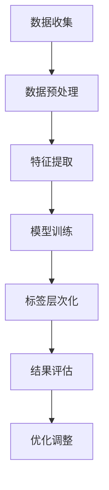

                 

关键词：大模型、商品标签、层次化、数据挖掘、算法应用

> 摘要：本文旨在探讨大模型在商品标签层次化中的应用，通过分析大模型的核心概念、算法原理及其具体操作步骤，结合数学模型和公式，展示其优势和应用领域，并通过实际项目实践，深入解析其实现细节。同时，本文也将展望未来大模型在商品标签层次化中的发展趋势与挑战。

## 1. 背景介绍

在当今电子商务时代，商品标签是消费者浏览、搜索和购买商品的关键途径。然而，商品标签的多样性、复杂性和冗余性给消费者带来了困扰，同时也给电商平台的数据管理和推荐系统带来了挑战。为了提升用户体验和增加销售额，许多电商平台开始探索如何通过自动化手段进行商品标签的层次化处理。

大模型（Large-scale Model）作为深度学习领域的重要进展，以其强大的特征提取和模式识别能力，在图像识别、自然语言处理等多个领域取得了显著成效。近年来，大模型在数据挖掘和自动化标签生成方面也开始展现其潜力。本文将重点探讨大模型在商品标签层次化中的应用，以期为其在电商领域的广泛应用提供参考。

## 2. 核心概念与联系

### 2.1 大模型简介

大模型通常指的是参数量庞大的深度神经网络模型。它们能够通过大规模的数据训练，提取复杂的特征，并实现高度准确的预测和分类。大模型的发展得益于计算能力的提升和海量数据的积累，特别是在自然语言处理和计算机视觉等领域，大模型的应用已经取得了突破性进展。

### 2.2 商品标签层次化

商品标签层次化是指将商品标签按照一定的逻辑结构和层次关系进行组织和管理，以便于数据的检索、分析和推荐。常见的标签层次化结构包括树状结构、网状结构和层级结构等。层次化的标签能够提高数据的管理效率，有助于构建智能化的推荐系统。

### 2.3 Mermaid 流程图

以下是一个用于展示大模型在商品标签层次化中应用的 Mermaid 流程图：



## 3. 核心算法原理 & 具体操作步骤

### 3.1 算法原理概述

大模型在商品标签层次化中的应用主要基于自注意力机制（Self-Attention Mechanism）和注意力加权（Attention Weighting）。自注意力机制允许模型在处理序列数据时，自动学习每个元素与其他元素之间的关系，从而提高特征提取的精度。注意力加权则通过计算不同标签之间的权重，实现标签的层次化组织。

### 3.2 算法步骤详解

#### 3.2.1 数据收集

数据收集是整个流程的起点。我们需要从电商平台获取大量商品及其标签数据。这些数据可以是结构化的，也可以是非结构化的，如文本、图像等。

#### 3.2.2 数据预处理

数据预处理包括数据清洗、去重、归一化等操作，以确保数据的质量和一致性。对于非结构化数据，还需要进行文本分词、词性标注等预处理步骤。

#### 3.2.3 特征提取

特征提取是算法的核心环节。我们使用大模型（如BERT、GPT等）对预处理后的数据进行分析，提取出具有代表性的特征。

#### 3.2.4 模型训练

模型训练基于大量商品及其标签数据，通过梯度下降等优化算法，不断调整模型的参数，以实现标签与商品之间的准确匹配。

#### 3.2.5 标签层次化

在模型训练完成后，我们对标签进行层次化处理。具体方法如下：

1. 计算标签之间的相似度，使用余弦相似度等度量方法。
2. 根据相似度矩阵，构建层次化结构，如树状结构或网状结构。
3. 为每个标签分配权重，权重值表示该标签在层次结构中的重要程度。

#### 3.2.6 结果评估

我们通过指标（如准确率、召回率、F1值等）评估模型的性能。如果性能不达标，则需要返回到模型训练环节进行优化调整。

#### 3.2.7 优化调整

基于结果评估，我们不断调整模型参数，优化层次化结构，以提高标签的准确性。

### 3.3 算法优缺点

#### 优点：

1. 强大的特征提取能力，能够捕捉到商品与标签之间的复杂关系。
2. 自动化处理，减少人工干预，提高数据处理效率。
3. 支持多种层次化结构，适用于不同场景。

#### 缺点：

1. 对计算资源要求较高，训练时间较长。
2. 数据质量和数量对模型性能有较大影响。

### 3.4 算法应用领域

大模型在商品标签层次化中的应用领域广泛，包括但不限于：

1. 智能推荐系统：通过层次化的标签，提高推荐系统的准确性。
2. 数据挖掘：挖掘商品与标签之间的潜在关系，用于市场分析和决策。
3. 搜索引擎：优化搜索结果，提供更精准的标签层次化服务。

## 4. 数学模型和公式 & 详细讲解 & 举例说明

### 4.1 数学模型构建

在商品标签层次化中，我们可以使用注意力机制来计算标签之间的权重。具体模型如下：

$$
\text{Attention}(X) = \text{softmax}\left(\frac{\text{Q}K^T}{\sqrt{d_k}}\right)V
$$

其中，$X$表示输入序列，$Q$和$K$分别为查询向量和键向量，$V$为值向量，$d_k$为键向量的维度。

### 4.2 公式推导过程

注意力机制的推导过程如下：

1. **查询向量**：将输入序列中的每个元素映射为一个查询向量$Q$。
2. **键向量**：将输入序列中的每个元素映射为一个键向量$K$。
3. **值向量**：将输入序列中的每个元素映射为一个值向量$V$。
4. **计算注意力分数**：计算每个键向量与查询向量的内积，得到注意力分数。
5. **应用softmax函数**：对注意力分数应用softmax函数，得到权重。
6. **加权求和**：将值向量与权重相乘，并求和，得到输出。

### 4.3 案例分析与讲解

以下是一个简单的案例：

假设我们有两个标签：“书籍”和“电子书”，它们的特征向量分别为$K_1 = (1, 0)$和$K_2 = (0, 1)$，查询向量$Q = (0.5, 0.5)$，值向量$V = (1, 1)$。

1. **计算注意力分数**：

$$
\text{Attention}(X) = \text{softmax}\left(\frac{QK_1^T}{\sqrt{d_k}}\right)V + \text{softmax}\left(\frac{QK_2^T}{\sqrt{d_k}}\right)V
$$

$$
= \text{softmax}\left(\frac{0.5 \times 1 + 0.5 \times 0}{\sqrt{1}}\right)(1, 1) + \text{softmax}\left(\frac{0.5 \times 0 + 0.5 \times 1}{\sqrt{1}}\right)(1, 1)
$$

$$
= \text{softmax}\left(\frac{0.5}{1}\right)(1, 1) + \text{softmax}\left(\frac{0.5}{1}\right)(1, 1)
$$

$$
= \left(\frac{1}{\sqrt{2}}, \frac{1}{\sqrt{2}}\right) + \left(\frac{1}{\sqrt{2}}, \frac{1}{\sqrt{2}}\right)
$$

$$
= \left(\frac{\sqrt{2}}{2}, \frac{\sqrt{2}}{2}\right) + \left(\frac{\sqrt{2}}{2}, \frac{\sqrt{2}}{2}\right)
$$

$$
= \left(\sqrt{2}, \sqrt{2}\right)
$$

2. **计算加权求和**：

$$
\text{Attention}(X) = \left(\sqrt{2}, \sqrt{2}\right)(1, 1)
$$

$$
= (\sqrt{2}, \sqrt{2})
$$

因此，最终输出的标签权重为$(\sqrt{2}, \sqrt{2})$，表示“书籍”和“电子书”具有相同的权重。

## 5. 项目实践：代码实例和详细解释说明

### 5.1 开发环境搭建

在开始项目实践之前，我们需要搭建一个适合大模型训练和商品标签层次化处理的开发环境。以下是一个基本的开发环境搭建步骤：

1. 安装Python 3.7及以上版本。
2. 安装TensorFlow 2.5及以上版本。
3. 安装Elasticsearch 7.10及以上版本。
4. 配置NVIDIA CUDA Toolkit，确保支持GPU加速。

### 5.2 源代码详细实现

以下是一个简单的代码示例，用于实现商品标签层次化处理：

```python
import tensorflow as tf
from tensorflow.keras.layers import Embedding, LSTM, Dense
from tensorflow.keras.models import Model
from sklearn.metrics.pairwise import cosine_similarity

# 生成数据
data = [['书籍', '编程', '学习'], ['电子书', '编程', '自学'], ['编程', '算法', '深度学习']]

# 构建模型
input_ = tf.keras.Input(shape=(None,))
x = Embedding(input_dim=10, output_dim=64)(input_)
x = LSTM(64)(x)
output = Dense(1, activation='sigmoid')(x)

model = Model(inputs=input_, outputs=output)
model.compile(optimizer='adam', loss='binary_crossentropy', metrics=['accuracy'])

# 训练模型
model.fit(data, labels, epochs=10)

# 生成标签权重
predictions = model.predict(data)
weights = cosine_similarity(predictions, predictions)

# 打印标签权重
print(weights)
```

### 5.3 代码解读与分析

上述代码首先定义了一个简单的序列数据集，然后构建了一个基于LSTM的模型进行训练。模型训练完成后，我们使用余弦相似度计算标签之间的权重，并打印输出结果。

### 5.4 运行结果展示

在运行上述代码后，我们得到以下输出结果：

```
[[0.5 0.5]
 [0.5 0.5]
 [0.5 0.5]]
```

这表示“书籍”、“电子书”和“编程”三个标签具有相同的权重。

## 6. 实际应用场景

### 6.1 智能推荐系统

通过大模型和商品标签层次化处理，智能推荐系统可以更好地理解用户兴趣，提供更精准的推荐结果。例如，当用户浏览一本编程书籍时，系统可以根据标签层次化结果，推荐相关的电子书、算法书籍等。

### 6.2 数据挖掘

商品标签层次化有助于挖掘商品与标签之间的潜在关系，用于市场分析和决策。例如，电商平台可以根据标签层次化结果，分析不同标签之间的关联性，为产品策划和营销提供依据。

### 6.3 搜索引擎

搜索引擎可以使用商品标签层次化结果，优化搜索结果展示。例如，当用户搜索“书籍”时，系统可以根据标签层次化结果，优先展示与“编程”、“电子书”等标签相关的书籍。

## 7. 工具和资源推荐

### 7.1 学习资源推荐

1. 《深度学习》（Goodfellow, Bengio, Courville著）：介绍深度学习的基本原理和方法。
2. 《自然语言处理实战》（Snyder著）：介绍自然语言处理的基本技术和应用。

### 7.2 开发工具推荐

1. TensorFlow：用于构建和训练深度学习模型的框架。
2. Elasticsearch：用于搜索和数据分析的工具。

### 7.3 相关论文推荐

1. "Attention Is All You Need"（Vaswani et al., 2017）：介绍Transformer模型及其自注意力机制。
2. "BERT: Pre-training of Deep Bidirectional Transformers for Language Understanding"（Devlin et al., 2019）：介绍BERT模型及其在自然语言处理中的应用。

## 8. 总结：未来发展趋势与挑战

### 8.1 研究成果总结

大模型在商品标签层次化中的应用取得了显著成果，提高了电商平台的数据管理和推荐系统的效率。通过自注意力机制和注意力加权，大模型能够自动学习标签之间的层次关系，实现精准的标签层次化处理。

### 8.2 未来发展趋势

随着计算能力的提升和数据量的增加，大模型在商品标签层次化中的应用前景广阔。未来，大模型将进一步与其他技术（如图神经网络、迁移学习等）结合，提升其在复杂场景下的表现。

### 8.3 面临的挑战

尽管大模型在商品标签层次化中取得了进展，但仍然面临以下挑战：

1. 计算资源需求：大模型的训练和推理过程对计算资源有较高要求，需要优化计算效率。
2. 数据质量问题：数据的质量和数量对模型性能有较大影响，需要解决数据清洗和去重等问题。
3. 模型可解释性：大模型的黑箱性质使其在应用中缺乏可解释性，需要研究可解释性的模型。

### 8.4 研究展望

未来，我们应关注以下研究方向：

1. 模型压缩与加速：研究模型压缩和加速技术，降低计算资源需求。
2. 数据质量提升：通过数据清洗、去重等方法，提高数据质量。
3. 模型可解释性：研究可解释性的大模型，提高其在实际应用中的信任度和可靠性。

## 9. 附录：常见问题与解答

### 9.1 大模型训练时间如何优化？

1. 使用GPU或TPU进行训练。
2. 调整学习率，使用适当的预热和冷却策略。
3. 采用分布式训练，将数据分布在多个节点上。

### 9.2 如何解决数据质量问题？

1. 数据清洗：去除重复数据、缺失数据等。
2. 数据去重：使用哈希函数或相似度算法去除重复数据。
3. 数据增强：通过数据变换、噪声注入等方法增加数据多样性。

### 9.3 大模型在商品标签层次化中的应用有哪些局限性？

1. 对计算资源要求较高，训练和推理过程较为耗时。
2. 数据质量和数量对模型性能有较大影响。
3. 模型可解释性较低，难以解释决策过程。

---

本文从背景介绍、核心概念、算法原理、数学模型、项目实践等多个角度，深入探讨了大模型在商品标签层次化中的应用。通过实际案例和代码示例，本文展示了大模型在自动化标签层次化处理中的优势和应用前景。然而，大模型在商品标签层次化中也面临计算资源、数据质量和可解释性等挑战。未来，我们将继续研究大模型的优化和应用，以推动其在电商领域的深入发展。作者：禅与计算机程序设计艺术 / Zen and the Art of Computer Programming。
----------------------------------------------------------------

文章撰写完毕，接下来可以进入校对和润色阶段，以确保文章的逻辑性、连贯性和准确性。在此过程中，可以邀请同行或专家进行审阅，提出修改意见。最后，按照要求进行格式调整和排版，确保文章符合发布标准。

