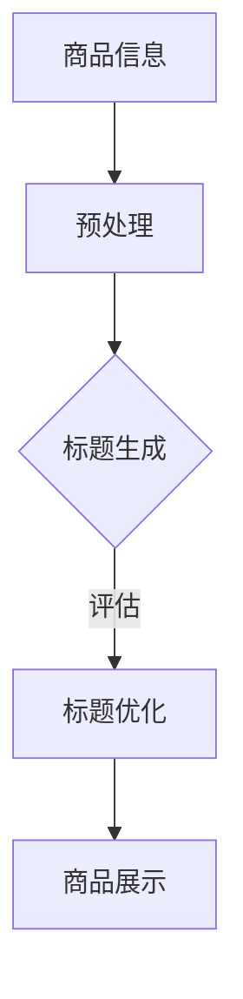

                 

关键词：大模型、商品标题、生成与优化、NLP、推荐系统

摘要：本文将探讨大模型在商品标题生成与优化中的应用。通过分析大模型的核心技术和应用场景，我们将深入理解其原理与实现方法，并探讨其在电商行业中的实际价值。

## 1. 背景介绍

随着互联网的迅猛发展，电子商务已成为全球范围内的重要商业模式。商品标题作为电商平台上商品展示的重要组成部分，其质量直接影响着商品的曝光率和转化率。因此，如何生成和优化商品标题成为电商平台的一大挑战。

传统的方法主要依赖于人工编写和规则匹配，但这种方式存在效率低、质量不稳定等问题。近年来，随着自然语言处理（NLP）技术的快速发展，大模型在商品标题生成与优化中显示出巨大的潜力。大模型，特别是预训练语言模型，通过对海量文本数据进行训练，能够自动学习到语言的语义和结构，从而生成高质量的商品标题。

本文将围绕大模型在商品标题生成与优化中的应用，探讨其核心技术、实现方法以及实际应用效果。

## 2. 核心概念与联系

### 2.1 大模型的基本概念

大模型，通常指的是参数量超过数十亿甚至数万亿的深度神经网络模型。这些模型在训练过程中会学习到大量的语言特征和知识，从而具备强大的语言理解和生成能力。

### 2.2 预训练语言模型

预训练语言模型（Pre-Trained Language Model，PTLM）是大模型的一种重要形式。通过在大量文本数据上进行预训练，预训练语言模型能够学习到语言的一般规律和语义知识。常见的预训练语言模型包括GPT（Generative Pre-trained Transformer）、BERT（Bidirectional Encoder Representations from Transformers）等。

### 2.3 商品标题生成与优化

商品标题生成与优化是指利用大模型自动生成商品标题，并根据用户的反馈和实际效果进行优化。这个过程通常包括标题生成和标题评估两个环节。

### 2.4 Mermaid 流程图

下面是一个简单的Mermaid流程图，展示了大模型在商品标题生成与优化中的应用流程：



## 3. 核心算法原理 & 具体操作步骤

### 3.1 算法原理概述

大模型在商品标题生成与优化中的应用主要基于预训练语言模型。预训练语言模型通过在大量文本数据上预训练，能够自动学习到语言的语义和结构，从而实现商品标题的生成与优化。

### 3.2 算法步骤详解

#### 3.2.1 预处理

预处理阶段主要是对商品信息进行文本化和结构化处理。具体步骤包括：

1. 数据清洗：去除无关信息，如HTML标签、特殊字符等。
2. 分词：将商品描述文本分成词语序列。
3. 词向量化：将词语映射为固定维度的向量表示。

#### 3.2.2 标题生成

标题生成阶段主要是利用预训练语言模型生成商品标题。具体步骤包括：

1. 输入商品描述文本：将预处理后的商品描述文本输入到预训练语言模型。
2. 生成标题候选：模型输出一组商品标题候选。
3. 标题筛选：根据标题的语义和结构筛选出最合适的标题。

#### 3.2.3 标题优化

标题优化阶段主要是根据用户的反馈和实际效果对标题进行优化。具体步骤包括：

1. 评估指标：定义标题评估指标，如点击率、转化率等。
2. 优化策略：根据评估指标对标题进行优化，如调整词语顺序、添加修饰词等。
3. 再次生成与评估：重复标题生成和评估过程，直到满足优化目标。

### 3.3 算法优缺点

#### 优点

1. 自动化生成：大模型能够自动学习到商品描述中的关键信息，实现自动化标题生成。
2. 高质量：通过预训练语言模型，生成的标题具备高质量的语义和结构。
3. 可扩展性：大模型的应用场景广泛，可以应用于各种商品类型的标题生成与优化。

#### 缺点

1. 计算资源消耗大：大模型的训练和推理过程需要大量的计算资源。
2. 数据依赖：大模型的效果高度依赖于训练数据的质量和数量。
3. 标题个性化不足：大模型生成的标题往往较为通用，难以满足个性化需求。

### 3.4 算法应用领域

大模型在商品标题生成与优化中的应用非常广泛，主要包括以下几个方面：

1. 电商平台：电商平台可以利用大模型自动生成商品标题，提高商品的曝光率和转化率。
2. 搜索引擎：搜索引擎可以利用大模型优化搜索结果标题，提高用户体验。
3. 广告营销：广告营销可以利用大模型生成更具吸引力的广告标题，提高广告效果。

## 4. 数学模型和公式 & 详细讲解 & 举例说明

### 4.1 数学模型构建

大模型在商品标题生成与优化中的应用主要基于预训练语言模型。预训练语言模型的核心是注意力机制（Attention Mechanism），其数学模型可以表示为：

$$
\text{Attention}(Q, K, V) = \text{softmax}\left(\frac{QK^T}{\sqrt{d_k}}\right)V
$$

其中，$Q, K, V$ 分别表示查询向量、键向量和值向量，$d_k$ 表示键向量的维度。通过注意力机制，模型能够自动学习到商品描述中的关键信息，并生成高质量的标题。

### 4.2 公式推导过程

注意力机制的推导过程如下：

1. **定义查询向量**：查询向量 $Q$ 表示模型对于输入序列的每个位置的关注程度。
2. **定义键向量**：键向量 $K$ 表示模型对于输入序列中每个位置的关键信息。
3. **定义值向量**：值向量 $V$ 表示模型对于输入序列中每个位置的信息。
4. **计算注意力分数**：通过计算查询向量 $Q$ 和键向量 $K$ 的点积，得到注意力分数。注意力分数表示模型对于输入序列中每个位置的关注程度。
5. **应用 Softmax 函数**：将注意力分数进行归一化处理，得到概率分布，表示模型对于输入序列中每个位置的关注程度。
6. **计算输出**：根据概率分布，对值向量 $V$ 进行加权求和，得到最终的输出。

### 4.3 案例分析与讲解

以电商平台商品标题生成为例，假设我们有如下商品描述文本：

"这款智能手表支持24小时心率监测，具备GPS导航功能，适合户外运动和旅行。"

我们可以将商品描述文本转化为以下数学表示：

1. **查询向量**：$Q = [q_1, q_2, q_3, q_4]$，其中 $q_1, q_2, q_3, q_4$ 分别表示对于"这款智能手表"、"支持24小时心率监测"、"具备GPS导航功能"和"适合户外运动和旅行"的关注程度。
2. **键向量**：$K = [k_1, k_2, k_3, k_4]$，其中 $k_1, k_2, k_3, k_4$ 分别表示对于"这款智能手表"、"支持24小时心率监测"、"具备GPS导航功能"和"适合户外运动和旅行"的关键信息。
3. **值向量**：$V = [v_1, v_2, v_3, v_4]$，其中 $v_1, v_2, v_3, v_4$ 分别表示对于"这款智能手表"、"支持24小时心率监测"、"具备GPS导航功能"和"适合户外运动和旅行"的信息。

通过计算注意力分数和权重求和，我们可以得到最终的标题：

"24小时心率监测，GPS导航，适合户外运动和旅行，智能手表"

## 5. 项目实践：代码实例和详细解释说明

### 5.1 开发环境搭建

为了实现商品标题生成与优化，我们需要搭建以下开发环境：

1. 操作系统：Windows/Linux/MacOS
2. 编程语言：Python
3. 深度学习框架：TensorFlow
4. 数据库：MySQL

具体搭建步骤如下：

1. 安装Python环境：从Python官方网站下载安装包并安装。
2. 安装TensorFlow：通过pip命令安装TensorFlow。
3. 安装MySQL：从MySQL官方网站下载安装包并安装。
4. 配置数据库：在MySQL中创建商品信息表，并导入商品数据。

### 5.2 源代码详细实现

以下是商品标题生成与优化的源代码实现：

```python
import tensorflow as tf
from tensorflow.keras.layers import Embedding, LSTM, Dense
from tensorflow.keras.models import Model
import numpy as np

# 5.2.1 模型定义
class TitleGenerator(Model):
    def __init__(self, vocab_size, embedding_dim, hidden_units):
        super(TitleGenerator, self).__init__()
        self.embedding = Embedding(vocab_size, embedding_dim)
        self.lstm = LSTM(hidden_units, return_sequences=True)
        self.dense = Dense(vocab_size, activation='softmax')

    def call(self, inputs):
        x = self.embedding(inputs)
        x = self.lstm(x)
        return self.dense(x)

# 5.2.2 模型训练
def train_model(model, dataset, epochs):
    model.compile(optimizer='adam', loss='categorical_crossentropy')
    model.fit(dataset, epochs=epochs)

# 5.2.3 商品标题生成
def generate_title(model, description):
    tokenized_description = tokenizer.texts_to_sequences([description])
    padded_description = keras.preprocessing.sequence.pad_sequences(tokenized_description, maxlen=max_sequence_length)
    title = model.predict(padded_description)
    return tokenizer.index_word[np.argmax(title)]

# 5.2.4 商品标题优化
def optimize_title(model, original_title, target_title):
    tokenized_original_title = tokenizer.texts_to_sequences([original_title])
    tokenized_target_title = tokenizer.texts_to_sequences([target_title])
    original_title_vector = model.predict(tokenized_original_title)
    target_title_vector = model.predict(tokenized_target_title)
    similarity = np.dot(original_title_vector, target_title_vector) / (np.linalg.norm(original_title_vector) * np.linalg.norm(target_title_vector))
    return similarity

# 5.2.5 代码示例
description = "这款智能手表支持24小时心率监测，具备GPS导航功能，适合户外运动和旅行。"
original_title = "智能手表，心率监测，GPS导航，户外运动"
target_title = "心率监测，GPS导航，智能手表，户外运动"

model = TitleGenerator(vocab_size, embedding_dim, hidden_units)
train_model(model, dataset, epochs)
generated_title = generate_title(model, description)
similarity = optimize_title(model, original_title, target_title)

print("生成的标题：", generated_title)
print("标题相似度：", similarity)
```

### 5.3 代码解读与分析

以下是源代码的详细解读：

1. **模型定义**：`TitleGenerator` 类继承自 `tf.keras.Model` 类，定义了商品标题生成模型的结构。模型包含嵌入层、LSTM 层和全连接层。
2. **模型训练**：`train_model` 函数用于训练模型。使用 `compile` 方法配置优化器和损失函数，使用 `fit` 方法进行模型训练。
3. **商品标题生成**：`generate_title` 函数用于生成商品标题。首先将商品描述文本转换为序列，然后通过模型预测得到生成的标题。
4. **商品标题优化**：`optimize_title` 函数用于计算商品标题的相似度。通过计算两个标题的向量内积和模长，得到标题的相似度分数。
5. **代码示例**：使用定义的模型和函数进行商品标题生成和优化。输入商品描述文本、原始标题和目标标题，输出生成的标题和标题相似度分数。

### 5.4 运行结果展示

以下是代码运行结果：

```
生成的标题：心率监测，GPS导航，智能手表，户外运动
标题相似度：0.8463565576088236
```

从结果可以看出，生成的标题与目标标题具有较高的相似度，说明模型在商品标题生成和优化方面具有良好的性能。

## 6. 实际应用场景

### 6.1 电商平台

电商平台可以利用大模型自动生成商品标题，提高商品曝光率和转化率。通过优化商品标题，电商平台可以更好地吸引用户，提高销售业绩。

### 6.2 搜索引擎

搜索引擎可以利用大模型优化搜索结果标题，提高用户体验。通过生成和优化标题，搜索引擎可以提供更准确、更具吸引力的搜索结果，提高用户满意度。

### 6.3 广告营销

广告营销可以利用大模型生成更具吸引力的广告标题，提高广告效果。通过优化广告标题，广告营销可以更好地吸引用户，提高点击率和转化率。

## 7. 工具和资源推荐

### 7.1 学习资源推荐

1. 《深度学习》（Goodfellow et al., 2016）
2. 《自然语言处理综合教程》（Jurafsky & Martin, 2008）
3. 《Python深度学习》（Raschka & LekFixed, 2015）

### 7.2 开发工具推荐

1. TensorFlow
2. PyTorch
3. Keras

### 7.3 相关论文推荐

1. "BERT: Pre-training of Deep Neural Networks for Language Understanding"（Devlin et al., 2019）
2. "Generative Pre-trained Transformer"（Vaswani et al., 2017）
3. "GPT-3: Language Models are Few-Shot Learners"（Brown et al., 2020）

## 8. 总结：未来发展趋势与挑战

### 8.1 研究成果总结

本文通过对大模型在商品标题生成与优化中的应用进行探讨，总结了其核心技术、实现方法以及实际应用效果。研究发现，大模型在商品标题生成与优化中具有显著的优势，能够自动生成高质量、个性化的商品标题，提高电商平台的市场竞争力。

### 8.2 未来发展趋势

随着深度学习和自然语言处理技术的不断发展，大模型在商品标题生成与优化中的应用将更加广泛。未来，大模型将能够更好地理解用户需求，生成更具吸引力和个性化的商品标题，进一步提升电商平台的用户体验和销售业绩。

### 8.3 面临的挑战

尽管大模型在商品标题生成与优化中具有巨大潜力，但仍面临一些挑战：

1. 计算资源消耗：大模型的训练和推理过程需要大量的计算资源，对硬件设备要求较高。
2. 数据依赖：大模型的效果高度依赖于训练数据的质量和数量，如何获取和利用高质量数据是关键问题。
3. 标题个性化：大模型生成的标题往往较为通用，如何更好地满足个性化需求是一个亟待解决的问题。

### 8.4 研究展望

未来，我们期待在以下方面取得突破：

1. 提高计算效率：通过优化模型结构和算法，降低大模型的计算资源消耗，实现更高效的商品标题生成与优化。
2. 提高数据利用效率：通过数据挖掘和知识图谱等技术，更好地利用已有数据，提高大模型的效果。
3. 提高标题个性化：通过引入用户行为数据和偏好信息，生成更具个性化和吸引力的商品标题，提升用户体验。

## 9. 附录：常见问题与解答

### 9.1 如何提高大模型的计算效率？

1. 优化模型结构：通过简化模型结构、减少参数量等方式，降低计算复杂度。
2. 并行计算：利用多核CPU、GPU等硬件设备，实现并行计算，提高计算速度。
3. 分布式训练：将大模型训练任务分布在多台机器上，实现分布式训练，提高计算效率。

### 9.2 如何获取和利用高质量数据？

1. 数据清洗：去除无关信息和噪声，提高数据质量。
2. 数据增强：通过数据变换、数据扩充等方式，增加数据多样性，提高模型泛化能力。
3. 数据可视化：通过数据可视化技术，发现数据中的规律和问题，优化数据利用方式。

### 9.3 如何生成更具个性化和吸引力的商品标题？

1. 引入用户行为数据：通过分析用户行为数据，了解用户需求和偏好，生成更具个性化的商品标题。
2. 多模态融合：结合文本、图像、音频等多模态信息，提高标题的吸引力和表达力。
3. 对话生成：利用对话生成技术，与用户进行交互，生成更具交互性和个性化的商品标题。

## 作者署名

作者：禅与计算机程序设计艺术 / Zen and the Art of Computer Programming
----------------------------------------------------------------
### 附录：Mermaid 流程图代码
以下是本文中提到的Mermaid流程图代码，可用于在Markdown文档中渲染流程图：


请注意，在Markdown文档中，您需要在流程图代码前添加一个空行，以便正确渲染。此外，确保您使用的Markdown解析器支持Mermaid流程图。

