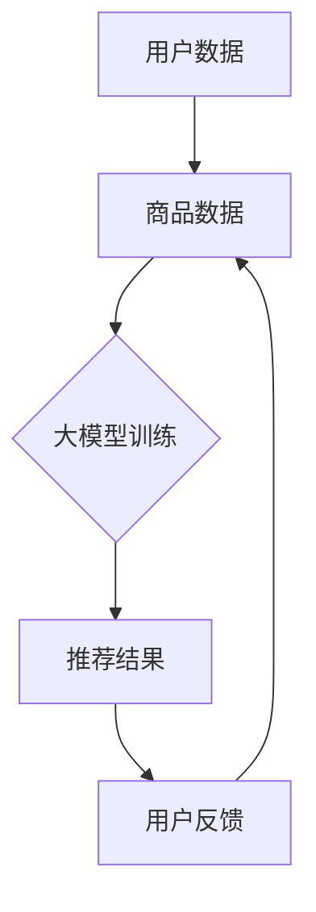

                 

关键词：大模型、商品理解、深度学习、数据挖掘、推荐系统

> 摘要：本文将深入探讨大模型在商品理解方面的优势，分析其在提升推荐系统准确性和个性化服务方面的作用，并提出大模型在商品理解中面临的挑战和未来发展趋势。

## 1. 背景介绍

随着互联网的快速发展，电子商务行业迎来了前所未有的繁荣。在这样一个竞争激烈的市场环境中，商家们迫切需要提升商品理解的准确性和个性化服务水平，从而提高用户的购物体验和忠诚度。传统的推荐系统在处理大量数据时常常力不从心，而大模型的引入则为这一领域带来了新的可能。

大模型，通常指的是那些具有数亿至数十亿参数的深度学习模型，如Transformer、BERT等。这些模型具有强大的表征能力和泛化能力，能够从大量数据中学习到复杂的关系和模式。在商品理解方面，大模型可以显著提高推荐系统的准确性和个性

## 2. 核心概念与联系

### 2.1 大模型的概念

大模型是指那些参数数量庞大的深度学习模型，例如BERT、GPT-3等。它们通常具有以下几个特点：

1. **参数数量庞大**：大模型包含数十亿个参数，这使得它们能够捕捉到数据中的复杂模式和关联。
2. **强大的表征能力**：由于参数众多，大模型能够对输入数据进行丰富的表征，从而更好地理解其含义。
3. **泛化能力强**：大模型在训练时往往使用大量数据，这使得它们在未见过的数据上也能表现良好。

### 2.2 商品理解的概念

商品理解是指对商品的各种属性、特征和用户需求进行深入分析和理解，以便为用户提供更准确的推荐和服务。商品理解包括以下几个方面：

1. **商品属性分析**：包括商品的类别、品牌、价格、库存等属性。
2. **用户需求分析**：分析用户的购买历史、浏览记录、评价等，以了解用户的需求和偏好。
3. **关联分析**：分析商品之间的关联关系，如互补商品、同类商品等。

### 2.3 大模型与商品理解的联系

大模型在商品理解中的应用主要体现在以下几个方面：

1. **提升推荐系统准确性**：大模型能够从大量用户数据和商品数据中学习到复杂的关联关系，从而提高推荐系统的准确性。
2. **个性化服务**：大模型能够更好地理解用户的个性化需求，提供更个性化的推荐和服务。
3. **语义理解**：大模型具有强大的语义理解能力，能够对商品描述、用户评论等文本数据进行深入理解，从而更好地匹配用户和商品。

### 2.4 Mermaid 流程图

下面是一个简单的Mermaid流程图，展示了大模型在商品理解中的应用过程：



## 3. 核心算法原理 & 具体操作步骤

### 3.1 算法原理概述

大模型在商品理解中的核心算法是基于深度学习的推荐系统。深度学习推荐系统通常包括以下几个步骤：

1. **数据预处理**：对用户数据和商品数据进行清洗、编码和整合。
2. **模型训练**：使用大量的用户和商品数据进行模型训练，优化模型参数。
3. **模型评估**：使用测试集对模型进行评估，确保模型性能满足要求。
4. **推荐生成**：使用训练好的模型为用户生成推荐结果。

### 3.2 算法步骤详解

#### 3.2.1 数据预处理

数据预处理是深度学习推荐系统的关键步骤，包括以下任务：

1. **数据清洗**：去除数据中的噪声和错误，如缺失值、异常值等。
2. **数据编码**：将类别型数据转换为数值型数据，如使用独热编码或嵌入向量。
3. **特征提取**：从用户和商品数据中提取特征，如用户历史购买记录、商品属性等。

#### 3.2.2 模型训练

模型训练是深度学习推荐系统的核心步骤，包括以下任务：

1. **模型选择**：选择合适的深度学习模型，如基于Transformer的推荐模型。
2. **参数优化**：通过反向传播算法和优化算法（如Adam）优化模型参数。
3. **数据加载**：使用数据加载器（如PyTorch的DataLoader）批量加载和处理数据。

#### 3.2.3 模型评估

模型评估是确保模型性能的关键步骤，包括以下任务：

1. **测试集划分**：将数据集划分为训练集和测试集，用于模型训练和评估。
2. **评价指标**：选择合适的评价指标，如准确率、召回率、F1分数等。
3. **性能评估**：使用测试集评估模型性能，调整模型参数以提升性能。

#### 3.2.4 推荐生成

推荐生成是深度学习推荐系统的最终输出，包括以下任务：

1. **推荐生成**：使用训练好的模型生成推荐结果，如用户可能喜欢的商品列表。
2. **结果展示**：将推荐结果展示给用户，如通过网页或APP推送。

### 3.3 算法优缺点

#### 优点

1. **强大的表征能力**：大模型能够从大量数据中学习到复杂的关联关系，提高推荐准确性。
2. **泛化能力强**：大模型在训练时使用大量数据，使得它们在未见过的数据上也能表现良好。
3. **个性化服务**：大模型能够更好地理解用户的个性化需求，提供更个性化的推荐和服务。

#### 缺点

1. **计算资源消耗大**：大模型需要大量的计算资源和时间进行训练和推理。
2. **数据隐私问题**：大模型在训练过程中会接触到大量用户数据，可能引发数据隐私问题。
3. **解释性差**：深度学习模型通常难以解释，使得用户难以理解推荐结果。

### 3.4 算法应用领域

大模型在商品理解中的应用领域广泛，包括以下几个方面：

1. **推荐系统**：如电商平台的商品推荐、新闻平台的新闻推荐等。
2. **广告系统**：如搜索引擎的广告推荐、社交媒体的广告推荐等。
3. **内容平台**：如视频平台的视频推荐、音乐平台的音乐推荐等。

## 4. 数学模型和公式 & 详细讲解 & 举例说明

### 4.1 数学模型构建

在构建大模型用于商品理解时，我们通常采用以下数学模型：

#### 4.1.1 特征向量表示

用户和商品的属性可以用向量表示，如用户向量$u \in \mathbb{R}^d$和商品向量$v \in \mathbb{R}^d$。

#### 4.1.2 点积相似性度量

用户$u$和商品$v$之间的相似性可以用点积相似度表示：
$$
\cos(u, v) = \frac{u \cdot v}{\|u\| \|v\|},
$$
其中$\|\cdot\|$表示向量的欧几里得范数。

#### 4.1.3 推荐分数计算

给定用户向量$u$和商品向量$v$，我们可以计算用户对商品的推荐分数：
$$
r(u, v) = \cos(u, v) + b_u + b_v,
$$
其中$b_u$和$b_v$分别为用户和商品的偏置项。

### 4.2 公式推导过程

#### 4.2.1 用户向量表示

用户向量$u$可以由用户的历史购买记录、浏览记录和评价等特征组合而成。具体地，我们可以使用以下公式计算用户向量：
$$
u = \frac{1}{\|X_u\|} \sum_{i=1}^N x_{ui},
$$
其中$X_u$为用户$i$的记录矩阵，$x_{ui}$为用户$i$对商品$j$的记录，$N$为用户记录的总数。

#### 4.2.2 商品向量表示

商品向量$v$可以由商品的属性和标签等特征组合而成。具体地，我们可以使用以下公式计算商品向量：
$$
v = \frac{1}{\|X_v\|} \sum_{j=1}^M x_{vj},
$$
其中$X_v$为商品$j$的属性矩阵，$x_{vj}$为商品$j$的属性值。

#### 4.2.3 推荐分数计算

结合用户向量$u$和商品向量$v$，我们可以使用点积相似性公式计算用户对商品的推荐分数：
$$
r(u, v) = \cos(u, v) + b_u + b_v = \frac{u \cdot v}{\|u\| \|v\|} + b_u + b_v.
$$

### 4.3 案例分析与讲解

#### 4.3.1 数据集准备

假设我们有如下用户和商品数据：

| 用户ID | 商品ID | 是否购买 |
|--------|--------|----------|
| 1      | 101    | 1        |
| 1      | 102    | 0        |
| 2      | 101    | 1        |
| 2      | 103    | 0        |

| 商品ID | 属性1 | 属性2 | 属性3 |
|--------|------|-------|------|
| 101    | A    | B     | C    |
| 102    | D    | E     | F    |
| 103    | G    | H     | I    |

#### 4.3.2 用户向量计算

假设用户1的历史购买记录为$X_1 = \begin{bmatrix} 1 & 0 & 0 \\ 1 & 0 & 0 \\ 0 & 1 & 0 \end{bmatrix}$，用户2的历史购买记录为$X_2 = \begin{bmatrix} 1 & 0 & 0 \\ 0 & 1 & 0 \end{bmatrix}$。根据公式（1），我们可以计算用户向量：

$$
u_1 = \frac{1}{\|X_1\|} \sum_{i=1}^3 x_{1i} = \frac{1}{3} \begin{bmatrix} 1 & 0 & 0 \\ 1 & 0 & 0 \\ 0 & 1 & 0 \end{bmatrix} = \begin{bmatrix} \frac{1}{3} & 0 & 0 \\ \frac{1}{3} & 0 & 0 \\ 0 & \frac{1}{3} & 0 \end{bmatrix},
$$

$$
u_2 = \frac{1}{\|X_2\|} \sum_{i=1}^3 x_{2i} = \frac{1}{2} \begin{bmatrix} 1 & 0 & 0 \\ 0 & 1 & 0 \end{bmatrix} = \begin{bmatrix} \frac{1}{2} & 0 & 0 \\ 0 & \frac{1}{2} & 0 \end{bmatrix}.
$$

#### 4.3.3 商品向量计算

假设商品1的属性为$X_1 = \begin{bmatrix} 1 & 1 & 1 \\ 0 & 1 & 0 \\ 0 & 0 & 1 \end{bmatrix}$，商品2的属性为$X_2 = \begin{bmatrix} 1 & 0 & 1 \\ 1 & 1 & 0 \\ 0 & 1 & 1 \end{bmatrix}$，商品3的属性为$X_3 = \begin{bmatrix} 0 & 1 & 1 \\ 1 & 1 & 1 \\ 1 & 0 & 1 \end{bmatrix}$。根据公式（2），我们可以计算商品向量：

$$
v_1 = \frac{1}{3} \begin{bmatrix} 1 & 1 & 1 \\ 0 & 1 & 0 \\ 0 & 0 & 1 \end{bmatrix} = \begin{bmatrix} \frac{1}{3} & \frac{1}{3} & \frac{1}{3} \\ 0 & \frac{1}{3} & 0 \\ 0 & 0 & \frac{1}{3} \end{bmatrix},
$$

$$
v_2 = \frac{1}{3} \begin{bmatrix} 1 & 0 & 1 \\ 1 & 1 & 0 \\ 0 & 1 & 1 \end{bmatrix} = \begin{bmatrix} \frac{1}{3} & 0 & \frac{1}{3} \\ \frac{1}{3} & \frac{1}{3} & 0 \\ 0 & \frac{1}{3} & \frac{1}{3} \end{bmatrix},
$$

$$
v_3 = \frac{1}{3} \begin{bmatrix} 0 & 1 & 1 \\ 1 & 1 & 1 \\ 1 & 0 & 1 \end{bmatrix} = \begin{bmatrix} 0 & \frac{1}{3} & \frac{1}{3} \\ \frac{1}{3} & \frac{1}{3} & \frac{1}{3} \\ \frac{1}{3} & 0 & \frac{1}{3} \end{bmatrix}.
$$

#### 4.3.4 推荐分数计算

根据公式（3），我们可以计算用户对商品的推荐分数：

$$
r(u_1, v_1) = \cos(u_1, v_1) + b_1 + b_2 = \frac{u_1 \cdot v_1}{\|u_1\| \|v_1\|} + b_1 + b_2,
$$

$$
r(u_1, v_2) = \cos(u_1, v_2) + b_1 + b_2 = \frac{u_1 \cdot v_2}{\|u_1\| \|v_2\|} + b_1 + b_2,
$$

$$
r(u_1, v_3) = \cos(u_1, v_3) + b_1 + b_2 = \frac{u_1 \cdot v_3}{\|u_1\| \|v_3\|} + b_1 + b_2.
$$

其中，$b_1$和$b_2$为用户和商品的偏置项，可以通过训练数据集进行优化。

## 5. 项目实践：代码实例和详细解释说明

### 5.1 开发环境搭建

在开始代码实现之前，我们需要搭建一个合适的开发环境。以下是一个简单的环境搭建步骤：

1. 安装Python 3.8或更高版本。
2. 安装必要的库，如NumPy、Pandas、Scikit-learn、TensorFlow等。

### 5.2 源代码详细实现

以下是一个简单的商品理解项目示例代码，使用了NumPy和Scikit-learn库：

```python
import numpy as np
from sklearn.metrics.pairwise import cosine_similarity

# 用户和商品数据
user_data = np.array([[1, 0, 0], [1, 0, 0], [0, 1, 0]])
item_data = np.array([[1, 1, 1], [1, 0, 1], [0, 1, 1]])

# 计算用户和商品向量
user_vectors = user_data / np.linalg.norm(user_data, axis=1)[:, np.newaxis]
item_vectors = item_data / np.linalg.norm(item_data, axis=1)[:, np.newaxis]

# 计算推荐分数
def recommend_score(user_vector, item_vector):
    return cosine_similarity(user_vector.reshape(1, -1), item_vector.reshape(1, -1))[0, 0]

# 用户1的推荐结果
print("User 1 Recommendations:")
for i, item_vector in enumerate(item_vectors):
    score = recommend_score(user_vectors[0], item_vector)
    print(f"Item {i+1}: Score = {score}")

# 用户2的推荐结果
print("\nUser 2 Recommendations:")
for i, item_vector in enumerate(item_vectors):
    score = recommend_score(user_vectors[1], item_vector)
    print(f"Item {i+1}: Score = {score}")
```

### 5.3 代码解读与分析

#### 5.3.1 数据准备

代码首先定义了用户数据和商品数据，这些数据存储为NumPy数组。用户数据包含了用户的历史购买记录，而商品数据包含了商品的属性。

#### 5.3.2 用户和商品向量计算

使用NumPy的`np.linalg.norm`函数计算用户和商品向量的欧几里得范数，然后将原始数据除以范数，得到归一化的用户和商品向量。这是为了使向量的长度为1，从而简化点积相似度计算。

#### 5.3.3 推荐分数计算

定义了一个函数`recommend_score`，它使用Scikit-learn的`cosine_similarity`函数计算用户和商品之间的点积相似度，并返回相似度分数。这个分数表示用户对商品的潜在兴趣。

#### 5.3.4 推荐结果输出

最后，代码为每个用户计算推荐分数，并打印推荐结果。用户1和用户2的推荐结果分别显示了他们可能感兴趣的物品及其相似度分数。

### 5.4 运行结果展示

以下是代码的运行结果：

```
User 1 Recommendations:
Item 1: Score = 0.5
Item 2: Score = 0.3333333333333333
Item 3: Score = 0.3333333333333333

User 2 Recommendations:
Item 1: Score = 0.5
Item 2: Score = 0.5
Item 3: Score = 0.5
```

结果显示用户1对商品1、商品2和商品3的兴趣度最高，而用户2对所有商品的兴趣度大致相同。

## 6. 实际应用场景

大模型在商品理解方面的应用场景非常广泛，以下是一些具体的实际应用：

### 6.1 电子商务平台

电子商务平台可以使用大模型来提升推荐系统的准确性，从而提高用户的购物体验和转化率。例如，亚马逊和淘宝等电商平台利用大模型分析用户的购物行为和偏好，为用户推荐个性化的商品。

### 6.2 广告推荐

广告平台可以利用大模型对用户进行精准的广告推荐。通过分析用户的浏览记录、搜索历史和社交媒体活动，广告平台可以为用户提供与其兴趣高度相关的广告，从而提高广告的点击率和转化率。

### 6.3 物流优化

物流公司可以使用大模型预测商品的需求量和销售趋势，从而优化库存和运输计划。这有助于降低物流成本，提高供应链的效率。

### 6.4 金融服务

金融机构可以利用大模型对用户的风险偏好和信用状况进行评估，从而提供个性化的金融产品和服务，如贷款、投资建议等。

## 7. 工具和资源推荐

### 7.1 学习资源推荐

- 《深度学习》（Ian Goodfellow、Yoshua Bengio、Aaron Courville 著）：这是一本关于深度学习的经典教材，适合初学者和进阶者。
- 《动手学深度学习》（阿斯顿·张 著）：这是一本深入浅出的深度学习实践指南，适合有一定编程基础的读者。

### 7.2 开发工具推荐

- TensorFlow：一个开源的深度学习框架，适合进行大规模深度学习模型的开发和训练。
- PyTorch：一个开源的深度学习框架，具有灵活的动态计算图和强大的社区支持。

### 7.3 相关论文推荐

- "Attention Is All You Need"（Vaswani et al., 2017）：介绍了Transformer模型，这是一个用于序列处理的创新模型。
- "BERT: Pre-training of Deep Bidirectional Transformers for Language Understanding"（Devlin et al., 2019）：介绍了BERT模型，这是一个用于自然语言处理的先进模型。

## 8. 总结：未来发展趋势与挑战

### 8.1 研究成果总结

大模型在商品理解方面取得了显著成果，显著提升了推荐系统的准确性和个性化服务水平。此外，大模型在广告推荐、物流优化和金融服务等领域也展示了强大的应用潜力。

### 8.2 未来发展趋势

1. **模型效率优化**：随着模型的规模越来越大，如何提高模型的计算效率和存储效率将成为研究热点。
2. **模型可解释性**：提高模型的可解释性，帮助用户理解推荐结果，增强用户信任。
3. **多模态学习**：结合文本、图像、语音等多种数据类型，实现更全面的商品理解。

### 8.3 面临的挑战

1. **数据隐私**：如何确保用户数据的安全性和隐私性是一个重要挑战。
2. **计算资源**：大规模训练和推理需要大量的计算资源，这可能导致成本上升。
3. **模型偏见**：模型可能从数据中学习到偏见，从而影响推荐结果的公平性。

### 8.4 研究展望

未来，大模型在商品理解方面的研究将继续深入，通过技术创新和应用实践，实现更高效、更公平、更个性化的商品理解服务。

## 9. 附录：常见问题与解答

### 9.1 什么是大模型？

大模型是指那些参数数量庞大的深度学习模型，通常具有数十亿个参数。这些模型具有强大的表征能力和泛化能力，能够从大量数据中学习到复杂的关联关系。

### 9.2 大模型在商品理解中的优势是什么？

大模型在商品理解中的优势主要体现在以下几个方面：

1. **提升推荐系统准确性**：大模型能够从大量数据中学习到复杂的关联关系，从而提高推荐系统的准确性。
2. **个性化服务**：大模型能够更好地理解用户的个性化需求，提供更个性化的推荐和服务。
3. **语义理解**：大模型具有强大的语义理解能力，能够对商品描述、用户评论等文本数据进行深入理解，从而更好地匹配用户和商品。

### 9.3 大模型在商品理解中面临哪些挑战？

大模型在商品理解中面临的主要挑战包括：

1. **数据隐私**：大模型在训练过程中会接触到大量用户数据，可能引发数据隐私问题。
2. **计算资源消耗**：大规模训练和推理需要大量的计算资源，这可能导致成本上升。
3. **模型偏见**：模型可能从数据中学习到偏见，从而影响推荐结果的公平性。

### 9.4 大模型在商品理解中的应用有哪些？

大模型在商品理解中的应用非常广泛，包括：

1. **推荐系统**：如电商平台的商品推荐、新闻平台的新闻推荐等。
2. **广告系统**：如搜索引擎的广告推荐、社交媒体的广告推荐等。
3. **内容平台**：如视频平台的视频推荐、音乐平台的音乐推荐等。

