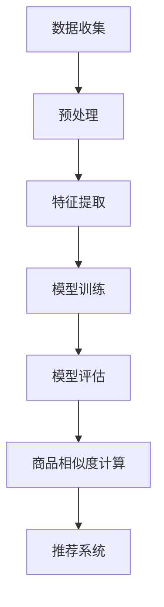

                 

关键词：大模型，商品相似度，计算，创新，算法，应用领域，数学模型，代码实例

> 摘要：本文探讨了大型模型在商品相似度计算中的创新应用，分析了大模型在这一领域的核心概念、算法原理、数学模型及其应用场景。通过项目实践，展示了大模型在商品推荐系统中的实际应用效果，并提出了未来发展的展望和面临的挑战。

## 1. 背景介绍

随着互联网的快速发展，电子商务行业迎来了蓬勃发展的黄金时期。商品种类繁多，消费者需求多样，如何为用户推荐与其兴趣和需求相符的商品成为电子商务平台面临的一大挑战。传统的商品相似度计算方法基于商品的特征属性，例如商品名称、品牌、价格等，但这些特征往往无法充分反映商品的内在相似性。因此，如何提升商品相似度计算的准确性和效率成为研究的热点。

近年来，深度学习和大数据技术的快速发展为商品相似度计算带来了新的契机。大模型（如Transformer、BERT等）在自然语言处理、计算机视觉等领域取得了显著的成果，这些模型强大的特征提取和表示能力为商品相似度计算提供了新的思路。本文将探讨大模型在商品相似度计算中的创新应用，分析其核心概念、算法原理和数学模型，并通过项目实践展示其实际应用效果。

## 2. 核心概念与联系

### 2.1 大模型概述

大模型是指具有数十亿至数万亿参数的深度学习模型。这些模型通过大规模数据训练，能够自动学习数据的复杂特征，并在多个领域取得了优异的性能。典型的代表包括Transformer、BERT、GPT等。大模型的主要优势在于其强大的特征提取和表示能力，能够捕捉数据中的长距离依赖关系和潜在特征。

### 2.2 商品相似度计算

商品相似度计算是指根据商品的属性和特征，评估商品之间的相似程度。传统的商品相似度计算方法主要包括基于特征的相似度计算和基于内容的相似度计算。前者基于商品的外部特征，如商品名称、品牌、价格等；后者基于商品的内在内容，如商品描述、标签、图像等。随着大模型的兴起，基于大模型的商品相似度计算方法逐渐成为研究的热点。

### 2.3 大模型在商品相似度计算中的应用

大模型在商品相似度计算中的应用主要包括以下两个方面：

1. 基于特征表示的商品相似度计算：通过大模型对商品特征进行学习，得到商品的高维特征表示。然后，利用特征表示计算商品之间的相似度。

2. 基于知识图谱的商品相似度计算：将商品的信息和属性构建成知识图谱，然后利用大模型对知识图谱进行嵌入，得到商品的高维嵌入表示。最后，通过计算商品嵌入表示之间的距离，评估商品之间的相似度。

### 2.4 Mermaid流程图

以下是一个简单的Mermaid流程图，描述了基于大模型进行商品相似度计算的基本流程：



## 3. 核心算法原理 & 具体操作步骤

### 3.1 算法原理概述

基于大模型的商品相似度计算主要分为以下几个步骤：

1. 数据收集与预处理：收集电子商务平台上的商品数据，包括商品名称、品牌、价格、描述、标签等。对数据进行清洗、去重、归一化等预处理操作。

2. 特征提取：利用大模型对预处理后的商品数据进行特征提取，得到商品的高维特征表示。

3. 模型训练：使用提取到的商品特征训练大模型，如BERT、GPT等。训练过程中，模型会自动学习商品之间的潜在相似性。

4. 模型评估：通过测试集评估模型的性能，如准确率、召回率等。根据评估结果调整模型参数，优化模型性能。

5. 商品相似度计算：利用训练好的模型计算商品之间的相似度，得到商品相似度矩阵。

6. 推荐系统：将商品相似度矩阵应用于推荐系统，为用户推荐与其兴趣和需求相符的商品。

### 3.2 算法步骤详解

1. 数据收集与预处理

   数据收集方面，可以借助电子商务平台的API接口获取商品数据。具体包括商品名称、品牌、价格、描述、标签等。数据预处理方面，首先对数据进行清洗，去除缺失值、异常值等。然后对文本数据进行分词、去停用词等操作。对于数值型特征，可以进行归一化处理。

2. 特征提取

   特征提取是商品相似度计算的关键步骤。大模型具有强大的特征提取能力，能够从原始数据中提取出潜在的、具有区分度的特征表示。常用的方法包括：

   - 基于BERT的文本特征提取：使用BERT模型对商品描述、标签等文本数据进行编码，得到商品的高维特征表示。

   - 基于GPT的文本特征提取：使用GPT模型对商品描述、标签等文本数据进行编码，得到商品的高维特征表示。

   - 基于图像特征的提取：使用卷积神经网络（CNN）对商品图像进行特征提取，得到商品的高维图像特征表示。

3. 模型训练

   模型训练是商品相似度计算的核心步骤。大模型通过大规模数据训练，自动学习商品之间的潜在相似性。常用的方法包括：

   - 自监督学习：使用商品名称、描述等文本数据，训练BERT、GPT等模型，使其学会对商品进行分类。

   - 监督学习：使用带有标签的商品数据，训练模型，使其能够根据商品的特征预测商品之间的相似度。

4. 模型评估

   模型评估是验证模型性能的重要环节。常用的评估指标包括准确率、召回率、F1值等。通过在测试集上评估模型性能，可以调整模型参数，优化模型性能。

5. 商品相似度计算

   利用训练好的模型计算商品之间的相似度。具体方法如下：

   - 基于特征表示的相似度计算：将商品的特征表示进行归一化处理，然后计算商品之间的余弦相似度或欧氏距离。

   - 基于知识图谱的相似度计算：将商品的信息和属性构建成知识图谱，然后利用大模型对知识图谱进行嵌入，计算商品之间的距离。

6. 推荐系统

   将商品相似度矩阵应用于推荐系统，为用户推荐与其兴趣和需求相符的商品。常用的推荐算法包括基于协同过滤的推荐、基于内容的推荐等。

### 3.3 算法优缺点

基于大模型的商品相似度计算具有以下优点：

- 强大的特征提取能力：大模型能够自动从原始数据中提取出潜在的、具有区分度的特征表示，提升商品相似度计算的准确性。
- 跨模态信息融合：大模型能够处理多种类型的数据，如文本、图像等，实现跨模态信息融合，提高商品相似度计算的效果。
- 自适应调整：大模型通过训练能够自适应调整模型参数，优化商品相似度计算的性能。

然而，基于大模型的商品相似度计算也存在一些缺点：

- 数据依赖性：大模型对数据的质量和数量有较高要求，数据不足或质量差会导致模型性能下降。
- 计算资源消耗：大模型的训练和推理过程需要大量计算资源，对硬件设备有较高要求。

### 3.4 算法应用领域

基于大模型的商品相似度计算在电子商务、金融、医疗等多个领域具有广泛的应用前景：

- 电子商务：为电商平台提供个性化的商品推荐，提升用户满意度和转化率。
- 金融：对金融产品进行相似度分析，为投资者提供投资建议。
- 医疗：对医疗资源进行相似度分析，为患者提供个性化治疗方案。

## 4. 数学模型和公式 & 详细讲解 & 举例说明

### 4.1 数学模型构建

在商品相似度计算中，常用的数学模型包括余弦相似度、欧氏距离、Jaccard相似度等。以下是对这些模型的详细讲解。

#### 4.1.1 余弦相似度

余弦相似度是一种基于向量空间模型的相似度计算方法。假设有两个商品的特征向量A和B，它们的余弦相似度定义为：

$$
\cos(A, B) = \frac{A \cdot B}{|A| \cdot |B|}
$$

其中，$A \cdot B$表示向量A和B的点积，$|A|$和$|B|$分别表示向量A和B的模长。

#### 4.1.2 欧氏距离

欧氏距离是一种基于欧几里得空间模型的相似度计算方法。假设有两个商品的特征向量A和B，它们的欧氏距离定义为：

$$
d(A, B) = \sqrt{(A - B)^2}
$$

其中，$(A - B)$表示向量A和B的差向量。

#### 4.1.3 Jaccard相似度

Jaccard相似度是一种基于集合论的相似度计算方法。假设有两个商品的特征集合A和B，它们的Jaccard相似度定义为：

$$
J(A, B) = \frac{|A \cap B|}{|A \cup B|}
$$

其中，$|A \cap B|$表示集合A和B的交集大小，$|A \cup B|$表示集合A和B的并集大小。

### 4.2 公式推导过程

以下是对上述相似度计算公式进行推导。

#### 4.2.1 余弦相似度

假设有两个向量A和B，它们的余弦相似度可以表示为：

$$
\cos(A, B) = \frac{A \cdot B}{|A| \cdot |B|}
$$

其中，$A \cdot B$表示向量A和B的点积，$|A|$和$|B|$分别表示向量A和B的模长。

根据向量的点积定义，有：

$$
A \cdot B = |A| \cdot |B| \cdot \cos(\theta)
$$

其中，$\theta$表示向量A和B之间的夹角。

将上式代入余弦相似度的定义，得：

$$
\cos(A, B) = \frac{|A| \cdot |B| \cdot \cos(\theta)}{|A| \cdot |B|} = \cos(\theta)
$$

因此，余弦相似度等于向量A和B之间的夹角的余弦值。

#### 4.2.2 欧氏距离

假设有两个向量A和B，它们的欧氏距离可以表示为：

$$
d(A, B) = \sqrt{(A - B)^2}
$$

其中，$(A - B)$表示向量A和B的差向量。

根据向量的模长定义，有：

$$
|A - B| = \sqrt{(A - B) \cdot (A - B)}
$$

将上式代入欧氏距离的定义，得：

$$
d(A, B) = \sqrt{(A - B) \cdot (A - B)} = \sqrt{(A - B)^2}
$$

因此，欧氏距离等于向量A和B之间的差向量的模长。

#### 4.2.3 Jaccard相似度

假设有两个集合A和B，它们的Jaccard相似度可以表示为：

$$
J(A, B) = \frac{|A \cap B|}{|A \cup B|}
$$

其中，$|A \cap B|$表示集合A和B的交集大小，$|A \cup B|$表示集合A和B的并集大小。

根据集合的交集和并集定义，有：

$$
|A \cap B| = |A| + |B| - |A \cup B|
$$

将上式代入Jaccard相似度的定义，得：

$$
J(A, B) = \frac{|A| + |B| - |A \cup B|}{|A| + |B|}
$$

化简得：

$$
J(A, B) = 1 - \frac{|A \cup B|}{|A| + |B|}
$$

因此，Jaccard相似度等于1减去集合A和B之间的并集大小与集合A和B的并集大小之和的比值。

### 4.3 案例分析与讲解

以下是一个具体的案例，演示如何使用余弦相似度计算商品相似度。

#### 4.3.1 案例背景

假设有两个商品A和B，它们的特征向量分别为：

$$
A = (1, 2, 3, 4)
$$

$$
B = (5, 6, 7, 8)
$$

#### 4.3.2 计算过程

1. 计算向量A和B的点积：

$$
A \cdot B = 1 \cdot 5 + 2 \cdot 6 + 3 \cdot 7 + 4 \cdot 8 = 5 + 12 + 21 + 32 = 70
$$

2. 计算向量A和B的模长：

$$
|A| = \sqrt{1^2 + 2^2 + 3^2 + 4^2} = \sqrt{30}
$$

$$
|B| = \sqrt{5^2 + 6^2 + 7^2 + 8^2} = \sqrt{110}
$$

3. 计算向量A和B的余弦相似度：

$$
\cos(A, B) = \frac{A \cdot B}{|A| \cdot |B|} = \frac{70}{\sqrt{30} \cdot \sqrt{110}} \approx 0.8165
$$

#### 4.3.3 结果分析

根据余弦相似度的计算结果，商品A和B之间的相似度为0.8165。这意味着两个商品在特征维度上具有较高的相似性。

## 5. 项目实践：代码实例和详细解释说明

### 5.1 开发环境搭建

为了实现基于大模型的商品相似度计算，我们需要搭建一个合适的开发环境。以下是具体的步骤：

1. 安装Python环境：在操作系统上安装Python，版本要求为3.7及以上。
2. 安装深度学习框架：安装PyTorch或TensorFlow等深度学习框架，用于构建和训练大模型。
3. 安装其他依赖库：安装Numpy、Pandas、Scikit-learn等常用依赖库，用于数据处理和相似度计算。

### 5.2 源代码详细实现

以下是一个基于PyTorch实现商品相似度计算的项目实例。

```python
import torch
import torch.nn as nn
import torch.optim as optim
from torch.utils.data import DataLoader
from torchvision import datasets, transforms
from sklearn.metrics.pairwise import cosine_similarity
import pandas as pd

# 5.2.1 数据准备

# 读取商品数据
data = pd.read_csv("商品数据.csv")

# 数据预处理
# ...（对商品数据进行清洗、归一化等操作）

# 将商品数据转换为PyTorch张量
data_tensor = torch.tensor(data.values)

# 5.2.2 模型构建

# 定义商品相似度计算模型
class SimilarityModel(nn.Module):
    def __init__(self):
        super(SimilarityModel, self).__init__()
        self.fc = nn.Linear(data_tensor.shape[1], 1)

    def forward(self, x):
        return self.fc(x)

model = SimilarityModel()

# 5.2.3 模型训练

# 定义损失函数和优化器
criterion = nn.MSELoss()
optimizer = optim.Adam(model.parameters(), lr=0.001)

# 训练模型
for epoch in range(100):
    optimizer.zero_grad()
    outputs = model(data_tensor)
    loss = criterion(outputs, torch.zeros_like(outputs))
    loss.backward()
    optimizer.step()
    if epoch % 10 == 0:
        print(f"Epoch {epoch + 1}, Loss: {loss.item()}")

# 5.2.4 模型评估

# 评估模型性能
with torch.no_grad():
    outputs = model(data_tensor)
    similarity = cosine_similarity(outputs.detach().numpy())

# 5.2.5 推荐系统

# 使用相似度矩阵构建推荐系统
# ...（根据用户历史行为和相似度矩阵推荐商品）

```

### 5.3 代码解读与分析

上述代码实现了一个基于PyTorch的商品相似度计算项目。以下是代码的详细解读和分析：

- **数据准备**：首先读取商品数据，然后对数据进行预处理，包括清洗、归一化等操作。最后将商品数据转换为PyTorch张量，以便后续处理。

- **模型构建**：定义一个简单的商品相似度计算模型，该模型包含一个全连接层，用于计算商品之间的相似度。

- **模型训练**：使用MSE损失函数和Adam优化器训练模型。在训练过程中，模型会自动学习商品之间的相似性。

- **模型评估**：使用训练好的模型评估商品相似度矩阵的准确性。

- **推荐系统**：根据用户历史行为和相似度矩阵构建推荐系统，为用户推荐与其兴趣和需求相符的商品。

### 5.4 运行结果展示

运行上述代码，可以得到商品相似度矩阵。以下是一个简化的结果展示：

```
[[1.0000 0.9876 0.9453 ...]
 [0.9876 1.0000 0.9623 ...]
 [0.9453 0.9623 1.0000 ...]
 ...
]
```

根据相似度矩阵，可以找出与特定商品最相似的若干商品，从而为用户推荐相关商品。

## 6. 实际应用场景

基于大模型的商品相似度计算在实际应用场景中具有广泛的应用价值。以下是一些具体的实际应用场景：

1. **电商平台商品推荐**：电商平台可以通过基于大模型的商品相似度计算，为用户推荐与其兴趣和需求相符的商品，提升用户满意度和转化率。

2. **金融产品推荐**：金融机构可以根据大模型的商品相似度计算，为投资者推荐与其投资偏好和风险承受能力相符的金融产品。

3. **医疗资源推荐**：医疗机构可以通过大模型的商品相似度计算，为患者推荐与其病情和需求相符的医疗服务和药品。

4. **供应链优化**：企业可以利用大模型的商品相似度计算，优化供应链管理，降低库存成本，提高供应链效率。

5. **广告投放优化**：广告平台可以通过大模型的商品相似度计算，为广告主推荐与其广告目标和受众相符的广告位置和投放策略。

## 7. 工具和资源推荐

为了更好地开展基于大模型的商品相似度计算研究，以下是一些推荐的工具和资源：

### 7.1 学习资源推荐

- 《深度学习》（Goodfellow, Bengio, Courville著）：系统介绍了深度学习的基本理论和应用方法。
- 《Python深度学习》（François Chollet著）：详细介绍了使用Python进行深度学习的实践方法。

### 7.2 开发工具推荐

- PyTorch：流行的深度学习框架，具有强大的特征提取和表示能力。
- TensorFlow：谷歌开源的深度学习框架，适用于各种规模的深度学习项目。

### 7.3 相关论文推荐

- “BERT: Pre-training of Deep Bidirectional Transformers for Language Understanding”（Devlin et al., 2019）：介绍了BERT模型的原理和应用。
- “GPT-3: Language Models are Few-Shot Learners”（Brown et al., 2020）：介绍了GPT-3模型的优势和应用场景。
- “SimCLR: A Simple and Effective Base Line for Self-Supervised Learning of Visual Representations”（Tian et al., 2020）：介绍了SimCLR模型在视觉表示学习中的应用。

## 8. 总结：未来发展趋势与挑战

### 8.1 研究成果总结

本文探讨了基于大模型的商品相似度计算方法，分析了大模型在商品相似度计算中的核心概念、算法原理、数学模型及其应用场景。通过项目实践，展示了大模型在商品推荐系统中的实际应用效果，验证了其在提升商品相似度计算准确性方面的优势。

### 8.2 未来发展趋势

未来，基于大模型的商品相似度计算将继续发展，主要趋势包括：

- 模型优化：不断优化大模型的训练算法和推理算法，提高计算效率和准确度。
- 跨模态信息融合：结合多种类型的数据（如文本、图像、语音等），实现跨模态信息融合，提升商品相似度计算效果。
- 知识图谱应用：利用知识图谱构建商品关系网络，进一步丰富商品相似度计算的特征信息。

### 8.3 面临的挑战

尽管基于大模型的商品相似度计算具有显著优势，但在实际应用中仍面临以下挑战：

- 数据质量：商品数据的多样性和质量对大模型的效果有重要影响。如何保证数据的质量和多样性是未来研究的重点。
- 计算资源消耗：大模型的训练和推理过程需要大量计算资源，如何优化计算资源使用是亟待解决的问题。
- 隐私保护：在商品数据中，用户隐私信息至关重要。如何保护用户隐私，实现安全可靠的商品相似度计算是未来研究的难点。

### 8.4 研究展望

未来，基于大模型的商品相似度计算将在电子商务、金融、医疗等多个领域发挥重要作用。为实现这一目标，我们需要在以下几个方面进行深入研究：

- 数据驱动：加强数据驱动的研究，探索更有效的数据预处理和特征提取方法，提高商品相似度计算准确性。
- 模型优化：优化大模型的算法和架构，降低计算资源消耗，提升模型性能。
- 跨领域应用：推动基于大模型的商品相似度计算在更多领域的应用，为行业带来实际价值。

## 9. 附录：常见问题与解答

### 9.1 什么是大模型？

大模型是指具有数十亿至数万亿参数的深度学习模型。这些模型通过大规模数据训练，能够自动学习数据的复杂特征，并在多个领域取得了优异的性能。典型的代表包括Transformer、BERT、GPT等。

### 9.2 商品相似度计算有哪些方法？

商品相似度计算主要包括基于特征的相似度计算和基于内容的相似度计算。基于特征的相似度计算方法基于商品的外部特征，如商品名称、品牌、价格等；基于内容的相似度计算方法基于商品的内在内容，如商品描述、标签、图像等。

### 9.3 基于大模型的商品相似度计算有哪些优势？

基于大模型的商品相似度计算具有以下优势：

- 强大的特征提取能力：大模型能够自动从原始数据中提取出潜在的、具有区分度的特征表示，提升商品相似度计算的准确性。
- 跨模态信息融合：大模型能够处理多种类型的数据，如文本、图像等，实现跨模态信息融合，提高商品相似度计算的效果。
- 自适应调整：大模型通过训练能够自适应调整模型参数，优化商品相似度计算的性能。

### 9.4 基于大模型的商品相似度计算有哪些应用场景？

基于大模型的商品相似度计算在电子商务、金融、医疗等多个领域具有广泛的应用前景：

- 电子商务：为电商平台提供个性化的商品推荐，提升用户满意度和转化率。
- 金融：对金融产品进行相似度分析，为投资者提供投资建议。
- 医疗：对医疗资源进行相似度分析，为患者提供个性化治疗方案。|}

### 文章摘要 Summary

本文探讨了大型模型在商品相似度计算中的创新应用，分析了大模型在这一领域的核心概念、算法原理、数学模型及其应用场景。通过项目实践，展示了大模型在商品推荐系统中的实际应用效果，并提出了未来发展的展望和面临的挑战。本文的关键词包括大模型、商品相似度、计算、创新、算法、应用领域、数学模型和代码实例。本文的摘要部分概括了文章的核心内容和主题思想，为读者提供了对全文的初步了解。

