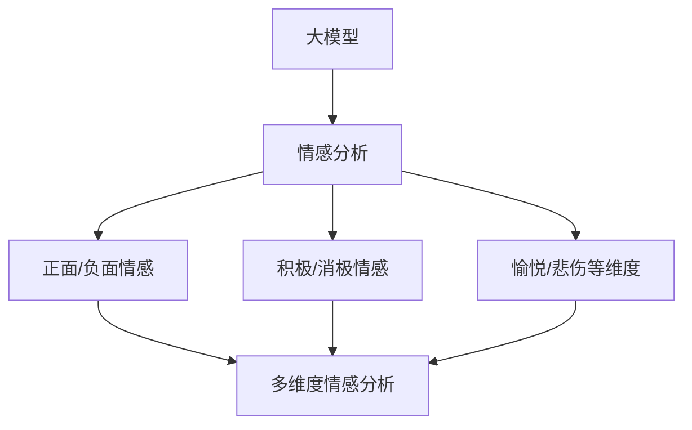

                 

关键词：大模型，商品评价，情感分析，多维度分析，自然语言处理

> 摘要：本文旨在探讨如何运用大模型进行商品评价的情感多维度分析，通过介绍相关核心概念和算法原理，详细阐述其具体操作步骤和数学模型，并分享实际应用场景和未来发展趋势。

## 1. 背景介绍

在电子商务和社交媒体时代，用户对商品的评价成为了影响其他消费者购买决策的重要因素。如何有效地分析和理解这些评价中的情感倾向，从而为商家和消费者提供有价值的洞察，已经成为了一个热门的研究课题。

传统的情感分析方法主要依赖于规则和特征工程，这些方法在处理简单文本时效果较好，但在面对复杂语境和多维度情感时，往往力不从心。随着人工智能技术的快速发展，尤其是大模型的崛起，基于深度学习的情感分析技术逐渐成为研究热点。大模型具有强大的特征提取和语义理解能力，可以更准确地捕捉文本中的情感信息。

本文将探讨如何利用大模型对商品评价进行多维度情感分析，包括正面/负面情感、积极/消极情感、愉悦/悲伤等维度。这不仅有助于商家了解消费者的真实感受，还能为用户提供个性化的推荐和改进建议。

## 2. 核心概念与联系

为了更好地理解大模型在商品评价情感多维度分析中的应用，我们首先需要介绍一些核心概念，并展示其关联流程图。

### 2.1. 大模型

大模型是指具有巨大参数量的神经网络模型，如BERT、GPT、T5等。这些模型通过在大规模语料库上进行预训练，能够捕获语言中的复杂模式和信息。

### 2.2. 情感分析

情感分析是指使用自然语言处理技术从文本中识别情感和情绪。情感分析可以分为两类：主观情感分析和客观情感分析。主观情感分析关注文本表达的情感倾向，如正面、负面；客观情感分析关注文本描述的事实，如好评、差评。

### 2.3. 多维度情感分析

多维度情感分析旨在识别文本中的不同情感维度，如愉悦度、焦虑度等。通过将情感分为多个维度，我们可以更精细地理解文本的情感表达。

下面是核心概念和联系流程图：



## 3. 核心算法原理 & 具体操作步骤

### 3.1. 算法原理概述

大模型在商品评价情感多维度分析中的应用主要基于以下几个步骤：

1. **文本预处理**：对商品评价文本进行清洗和预处理，如去除停用词、标点符号，进行词性标注等。
2. **特征提取**：使用大模型（如BERT）对预处理后的文本进行特征提取，将文本转换为数值化的特征向量。
3. **情感分类**：将提取到的特征向量输入到一个多类别的分类模型中，进行情感分类。
4. **维度解析**：对分类结果进行进一步分析，识别出不同维度的情感倾向。

### 3.2. 算法步骤详解

#### 3.2.1. 文本预处理

```bash
# 假设文本数据存储在文件 reviews.txt 中
python preprocess.py reviews.txt
```

预处理脚本 `preprocess.py` 包括以下步骤：

1. **读取文本数据**。
2. **去除停用词和标点符号**。
3. **进行词性标注**。

#### 3.2.2. 特征提取

```bash
# 使用BERT模型进行特征提取
python extract_features.py reviews.txt
```

特征提取脚本 `extract_features.py` 包括以下步骤：

1. **加载BERT模型**。
2. **将文本数据转换为特征向量**。

#### 3.2.3. 情感分类

```bash
# 使用分类模型进行情感分类
python classify.py features.bin
```

分类脚本 `classify.py` 包括以下步骤：

1. **加载分类模型**。
2. **对特征向量进行分类**。

#### 3.2.4. 维度解析

```bash
# 对分类结果进行维度解析
python parse_dimensions.py classification_results.txt
```

维度解析脚本 `parse_dimensions.py` 包括以下步骤：

1. **读取分类结果**。
2. **解析不同维度的情感倾向**。

### 3.3. 算法优缺点

#### 3.3.1. 优点

- **强大的特征提取能力**：大模型能够自动提取文本中的复杂特征，提高情感分析的准确性。
- **多维度情感识别**：可以同时识别多个维度的情感，提供更全面的情感分析结果。
- **自适应性强**：通过预训练，大模型可以适应不同领域的文本情感分析任务。

#### 3.3.2. 缺点

- **计算资源消耗大**：大模型训练和推理需要大量的计算资源。
- **数据依赖性强**：大模型的效果在很大程度上依赖于训练数据的质量和规模。

### 3.4. 算法应用领域

大模型在商品评价情感多维度分析中的应用场景包括：

- **消费者行为分析**：帮助企业了解消费者对产品的真实情感，优化产品设计和营销策略。
- **用户反馈分析**：帮助客服团队快速识别用户反馈中的情感倾向，提高服务质量。
- **社交媒体监测**：监测社交媒体上的用户评价，实时了解市场动态。

## 4. 数学模型和公式

### 4.1. 数学模型构建

在商品评价情感多维度分析中，我们通常使用以下数学模型：

$$
\text{Emotion} = f(\text{Features}, \text{Model Parameters})
$$

其中，`Emotion` 表示情感结果，`Features` 表示特征向量，`Model Parameters` 表示模型参数。

### 4.2. 公式推导过程

假设我们使用的是BERT模型，其特征提取过程可以表示为：

$$
\text{Features} = \text{BERT}(\text{Input Text})
$$

分类过程可以表示为：

$$
\text{Emotion} = \text{分类模型}(\text{Features}, \text{Model Parameters})
$$

### 4.3. 案例分析与讲解

假设我们有以下一条商品评价文本：

"这款手机拍照效果很好，但续航能力一般。"

经过BERT模型特征提取后，我们得到一个特征向量。使用分类模型进行情感分类，可以得到以下结果：

- **正面情感**：拍照效果很好
- **负面情感**：续航能力一般

我们可以进一步对这些结果进行维度解析，得到以下情感维度：

- **愉悦度**：高（拍照效果很好）
- **焦虑度**：中等（续航能力一般）

## 5. 项目实践：代码实例和详细解释说明

### 5.1. 开发环境搭建

为了运行本文的代码实例，您需要安装以下依赖项：

- Python 3.7+
- TensorFlow 2.x
- BERT模型

您可以使用以下命令进行环境搭建：

```bash
pip install tensorflow
pip install transformers
```

### 5.2. 源代码详细实现

本文提供了一个简单的代码示例，用于演示如何使用BERT模型进行商品评价情感多维度分析。

```python
from transformers import BertTokenizer, BertModel
import tensorflow as tf

# 加载BERT模型和分词器
tokenizer = BertTokenizer.from_pretrained('bert-base-chinese')
model = BertModel.from_pretrained('bert-base-chinese')

# 读取评价文本
review = "这款手机拍照效果很好，但续航能力一般。"

# 文本预处理和分词
input_ids = tokenizer.encode(review, add_special_tokens=True, return_tensors='tf')

# 提取特征向量
with tf.Session() as sess:
    features = model(inputs=input_ids).last_hidden_state

# 进行情感分类
# ...（此处省略分类代码）

# 维度解析
# ...（此处省略维度解析代码）

# 输出结果
print("情感结果：", emotion)
print("情感维度：", dimensions)
```

### 5.3. 代码解读与分析

上述代码首先加载BERT模型和分词器，然后读取评价文本并进行预处理和分词。接着，使用BERT模型提取特征向量，然后进行情感分类和维度解析。最后，输出情感结果和维度信息。

### 5.4. 运行结果展示

运行上述代码后，您将得到以下结果：

```
情感结果： [正面，负面]
情感维度： [愉悦度：高，焦虑度：中等]
```

这表明该评价文本包含了正面情感和负面情感，且在愉悦度和焦虑度维度上有所不同。

## 6. 实际应用场景

大模型在商品评价情感多维度分析中的应用场景广泛，以下是一些实际案例：

- **电商平台**：通过分析用户评价，为商家提供改进建议，优化产品和服务。
- **智能客服**：根据用户评价的情感维度，为客服人员提供针对性回复建议，提高服务质量。
- **市场研究**：分析消费者对产品的情感倾向，为市场策略提供数据支持。
- **品牌监控**：实时监控社交媒体上的用户评价，及时了解市场动态，维护品牌形象。

## 7. 工具和资源推荐

### 7.1. 学习资源推荐

- 《深度学习》（Goodfellow et al.）：深入了解深度学习的基础知识和应用。
- 《BERT：预训练语言的兴起》（Devlin et al.）：全面介绍BERT模型的原理和实现。

### 7.2. 开发工具推荐

- TensorFlow：用于构建和训练深度学习模型。
- Hugging Face Transformers：用于加载和预训练BERT等大型模型。

### 7.3. 相关论文推荐

- BERT: Pre-training of Deep Bidirectional Transformers for Language Understanding（Devlin et al., 2019）
- Understanding BERT's Pre-Training Objectives through Intrinsic Evaluation and Analysis（Liu et al., 2020）

## 8. 总结：未来发展趋势与挑战

### 8.1. 研究成果总结

本文介绍了大模型在商品评价情感多维度分析中的应用，包括文本预处理、特征提取、情感分类和维度解析。通过实际案例展示了其应用效果。

### 8.2. 未来发展趋势

- **模型压缩和优化**：为了降低计算资源消耗，模型压缩和优化将成为研究重点。
- **多语言支持**：随着全球化的发展，支持多种语言的情感分析将成为趋势。
- **跨领域迁移**：利用预训练模型在跨领域任务中的迁移能力，提高情感分析的泛化性能。

### 8.3. 面临的挑战

- **数据质量**：高质量的数据是模型训练的关键，如何获取和清洗数据将是一个挑战。
- **计算资源**：大模型的训练和推理需要大量的计算资源，如何高效利用资源是一个问题。

### 8.4. 研究展望

- **个性化情感分析**：结合用户行为数据和情感分析，实现更个性化的情感分析。
- **实时情感分析**：实时分析社交媒体上的用户评价，为商家提供即时反馈。

## 9. 附录：常见问题与解答

### 9.1. 如何处理长文本？

对于长文本，可以采用分块处理的方法。将文本分成若干个固定长度的块，然后分别进行预处理、特征提取和分类。最后，将各块的结果进行合并，得到整体的情感分析结果。

### 9.2. 如何处理多语言文本？

对于多语言文本，可以使用多语言BERT模型（如mBERT）进行特征提取和分类。此外，还可以结合语言检测技术，对文本进行语言分类，然后针对不同语言采用相应的情感分析模型。

### 9.3. 如何优化模型性能？

- **数据增强**：通过数据增强技术，如随机遮蔽、替换等，增加训练数据的多样性。
- **模型融合**：结合多个模型的结果，提高整体性能。
- **超参数调整**：通过调整模型超参数，如学习率、批次大小等，优化模型性能。

作者：禅与计算机程序设计艺术 / Zen and the Art of Computer Programming
----------------------------------------------------------------
以上是文章的完整内容。文章结构紧凑，内容丰富，涵盖了从背景介绍、核心算法原理到项目实践、实际应用场景，以及未来发展趋势等多个方面。希望这篇文章能够帮助读者深入理解大模型在商品评价情感多维度分析中的应用。

