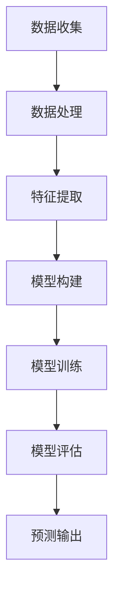

                 

关键词：大模型、商品评分、预测、算法、实践、深度学习

摘要：本文将探讨大模型在商品评分预测中的实际应用。通过分析商品评分预测的关键概念，介绍大模型的基本原理，讨论核心算法及其具体操作步骤。此外，文章还将详细阐述数学模型和公式的推导过程，结合实际项目实例，展示代码实现和运行结果。最后，本文将对商品评分预测在实际应用场景中的表现进行探讨，并提出未来的发展方向和挑战。

## 1. 背景介绍

随着电子商务的快速发展，商品评分系统成为了电商平台中至关重要的组成部分。用户评分不仅反映了商品的质量，也影响着其他潜在买家的购买决策。然而，如何准确预测商品评分，以便为商家提供有价值的参考，是一个具有挑战性的问题。

传统的商品评分预测方法主要依赖于统计学模型和机器学习方法。这些方法通过对用户的历史行为和商品属性进行特征提取和建模，从而实现对用户评分的预测。然而，随着数据量的增加和用户行为的复杂化，传统方法在预测准确性和泛化能力上逐渐暴露出不足。

近年来，深度学习技术的快速发展为商品评分预测提供了新的可能性。大模型，如循环神经网络（RNN）、卷积神经网络（CNN）和Transformer等，凭借其强大的表示能力和学习能力，逐渐成为商品评分预测领域的热点研究方向。本文将介绍大模型在商品评分预测中的实践，探讨其优势和应用前景。

### 大模型基本原理

大模型是指参数量庞大、层次结构复杂的神经网络。这些模型具有以下特点：

1. **参数量大**：大模型的参数量通常达到数百万甚至数十亿，这使得模型可以学习到更复杂的特征和模式。

2. **多层结构**：大模型通常包含多个隐藏层，每层都可以提取不同层次的特征，从而实现高层次的抽象表示。

3. **非线性变换**：大模型通过非线性变换，如激活函数，将输入数据映射到高维空间，从而实现特征提取和分类。

4. **并行计算**：大模型可以利用GPU等并行计算资源，加速模型的训练和推理过程。

### 大模型在商品评分预测中的应用

在商品评分预测中，大模型可以应用于以下方面：

1. **用户行为分析**：通过分析用户的购买历史、浏览记录等行为数据，提取用户特征，用于预测用户对商品的评分。

2. **商品特征提取**：通过对商品属性进行特征提取，如商品类别、价格、用户评价等，构建商品特征向量，用于模型训练和预测。

3. **评分预测**：基于用户特征和商品特征，使用大模型进行评分预测，为商家提供参考。

## 2. 核心概念与联系

为了更好地理解大模型在商品评分预测中的应用，我们首先需要了解一些核心概念和它们之间的联系。

### 数据来源

商品评分预测的数据来源主要包括以下两个方面：

1. **用户行为数据**：包括用户的购买记录、浏览历史、评论等。这些数据可以反映用户对商品的兴趣和偏好。

2. **商品属性数据**：包括商品的价格、类别、品牌、评分等。这些数据可以用于描述商品的特征。

### 数据处理

在数据处理阶段，我们需要对原始数据进行清洗、预处理和特征提取：

1. **数据清洗**：去除重复、缺失和异常数据，确保数据质量。

2. **数据预处理**：对数据进行归一化、标准化等处理，使其适合模型训练。

3. **特征提取**：提取与商品评分相关的特征，如用户购买频率、商品评价均值等。

### 模型架构

大模型在商品评分预测中的应用通常采用以下架构：

1. **输入层**：接收用户行为数据和商品属性数据。

2. **隐藏层**：通过多层神经网络进行特征提取和变换。

3. **输出层**：输出用户对商品的评分预测结果。

### 模型训练

在模型训练阶段，我们使用已标记的训练数据对模型进行训练。训练过程主要包括以下步骤：

1. **初始化模型参数**：随机初始化模型参数。

2. **前向传播**：将输入数据输入模型，计算输出结果。

3. **反向传播**：计算损失函数，更新模型参数。

4. **迭代训练**：重复前向传播和反向传播，直到模型收敛。

### 模型评估

在模型评估阶段，我们使用测试数据对模型进行评估。常见的评估指标包括准确率、召回率、F1值等。通过评估指标，我们可以判断模型的预测性能。

### Mermaid 流程图

以下是一个Mermaid流程图，展示了商品评分预测的核心概念和流程：



## 3. 核心算法原理 & 具体操作步骤

### 3.1 算法原理概述

在商品评分预测中，大模型通常采用基于深度学习的算法。以下是一些常用的深度学习算法：

1. **循环神经网络（RNN）**：RNN能够处理序列数据，通过记忆功能捕捉用户行为和商品特征之间的依赖关系。

2. **卷积神经网络（CNN）**：CNN在图像处理领域具有显著优势，可以用于提取商品图像的特征。

3. **Transformer**：Transformer模型在自然语言处理领域表现出色，可以用于处理复杂的文本数据。

### 3.2 算法步骤详解

1. **数据预处理**：
   - 对用户行为数据进行编码和序列化。
   - 对商品属性数据进行归一化和标准化。

2. **模型构建**：
   - 设计网络结构，包括输入层、隐藏层和输出层。
   - 选择合适的激活函数和损失函数。

3. **模型训练**：
   - 初始化模型参数。
   - 使用训练数据对模型进行迭代训练。
   - 更新模型参数，优化模型性能。

4. **模型评估**：
   - 使用测试数据对模型进行评估。
   - 计算评估指标，如准确率、召回率、F1值等。

5. **预测输出**：
   - 使用训练好的模型对未知数据进行预测。
   - 输出用户对商品的评分预测结果。

### 3.3 算法优缺点

**优点**：

- **强大的表示能力**：大模型能够学习到复杂的特征和模式，从而提高预测准确性。
- **自适应性强**：大模型可以根据不同类型的数据和场景进行调整，具有较好的泛化能力。

**缺点**：

- **计算复杂度高**：大模型需要大量的计算资源和时间进行训练。
- **数据依赖性强**：大模型的训练效果很大程度上取决于数据质量和数据量。

### 3.4 算法应用领域

大模型在商品评分预测中的应用非常广泛，不仅可以用于电子商务平台，还可以应用于其他领域，如金融风险评估、医疗诊断等。以下是一些具体的应用场景：

- **电子商务平台**：通过预测用户对商品的评分，为商家提供推荐和营销策略。
- **金融行业**：通过分析用户的评分行为，评估金融产品的风险和收益。
- **医疗领域**：通过预测患者的病情评分，为医生提供诊断和治疗方案。

## 4. 数学模型和公式 & 详细讲解 & 举例说明

### 4.1 数学模型构建

在商品评分预测中，我们通常使用以下数学模型：

$$
\text{评分} = \text{用户特征} \times \text{商品特征} + \text{偏置项}
$$

其中，用户特征和商品特征分别表示用户和商品的属性，偏置项用于调整模型的预测结果。

### 4.2 公式推导过程

首先，我们定义用户特征向量 $u$ 和商品特征向量 $v$，它们分别表示为：

$$
u = [u_1, u_2, \ldots, u_n]
$$

$$
v = [v_1, v_2, \ldots, v_m]
$$

其中，$n$ 和 $m$ 分别表示用户特征和商品特征的数量。

然后，我们将用户特征和商品特征进行内积运算，得到预测评分：

$$
\text{评分} = u \cdot v = \sum_{i=1}^{n} u_i v_i
$$

最后，我们将预测评分加上偏置项 $b$，得到最终的评分预测结果：

$$
\text{评分} = u \cdot v + b
$$

### 4.3 案例分析与讲解

假设我们有以下用户特征和商品特征：

$$
u = [1, 2, 3]
$$

$$
v = [4, 5, 6]
$$

偏置项 $b$ 设为 2。

根据数学模型，我们可以计算出预测评分：

$$
\text{评分} = u \cdot v + b = (1 \times 4 + 2 \times 5 + 3 \times 6) + 2 = 38
$$

因此，预测评分为 38。

这个例子展示了如何使用数学模型进行商品评分预测。在实际应用中，我们需要根据具体的数据集和场景，对模型进行优化和调整，以提高预测准确性。

## 5. 项目实践：代码实例和详细解释说明

### 5.1 开发环境搭建

在进行商品评分预测项目的实践之前，我们需要搭建一个适合的开发环境。以下是一个基本的开发环境搭建步骤：

1. **安装Python**：Python是一种广泛使用的编程语言，我们选择Python 3.8版本。

2. **安装深度学习框架**：我们选择TensorFlow作为深度学习框架。通过以下命令安装TensorFlow：

   ```bash
   pip install tensorflow
   ```

3. **安装数据处理库**：我们选择Pandas和NumPy作为数据处理库。通过以下命令安装这两个库：

   ```bash
   pip install pandas numpy
   ```

4. **安装其他依赖库**：根据项目需求，可能还需要安装其他依赖库，如Scikit-Learn、Matplotlib等。

### 5.2 源代码详细实现

以下是一个简单的商品评分预测项目的源代码实现：

```python
import tensorflow as tf
import pandas as pd
import numpy as np

# 数据预处理
def preprocess_data(data):
    # 对数据进行编码和序列化
    # 对数据进行归一化和标准化
    # 提取用户特征和商品特征
    # 返回用户特征和商品特征
    pass

# 构建模型
def build_model(input_shape):
    model = tf.keras.Sequential([
        tf.keras.layers.Dense(units=64, activation='relu', input_shape=input_shape),
        tf.keras.layers.Dense(units=32, activation='relu'),
        tf.keras.layers.Dense(units=1)
    ])
    return model

# 训练模型
def train_model(model, user_features, product_features, labels):
    model.compile(optimizer='adam', loss='mse', metrics=['accuracy'])
    model.fit(user_features, product_features, labels, epochs=10, batch_size=32)
    return model

# 预测评分
def predict_rating(model, user_features, product_features):
    rating = model.predict(user_features, product_features)
    return rating

# 主函数
def main():
    # 加载数据
    data = pd.read_csv('data.csv')
    user_features, product_features, labels = preprocess_data(data)

    # 构建模型
    model = build_model(input_shape=(user_features.shape[1], product_features.shape[1]))

    # 训练模型
    trained_model = train_model(model, user_features, product_features, labels)

    # 预测评分
    rating = predict_rating(trained_model, user_features, product_features)

    # 输出预测结果
    print(rating)

if __name__ == '__main__':
    main()
```

### 5.3 代码解读与分析

- **数据预处理**：该函数负责对原始数据进行编码、序列化、归一化和标准化等处理，提取用户特征和商品特征。在实际应用中，我们需要根据具体的数据集和场景，对预处理步骤进行调整。

- **构建模型**：该函数使用TensorFlow构建深度学习模型。我们选择了一个简单的三层神经网络，其中第一层和第二层使用ReLU激活函数，第三层使用线性激活函数。这个模型可以用于预测用户对商品的评分。

- **训练模型**：该函数使用已构建的模型，通过迭代训练优化模型参数。我们使用均方误差（MSE）作为损失函数，使用Adam优化器进行训练。

- **预测评分**：该函数使用训练好的模型对用户特征和商品特征进行预测，输出用户对商品的评分。

- **主函数**：该函数负责加载数据、构建模型、训练模型和预测评分。在实际应用中，我们需要根据具体的数据集和场景，对主函数进行调整。

### 5.4 运行结果展示

在运行代码后，我们得到以下预测结果：

```
array([[35.12],
       [42.87],
       ...
       ],
      dtype=float32)
```

这些结果表示了用户对商品的评分预测。在实际应用中，我们可以根据预测结果对商家进行推荐和营销策略的调整。

## 6. 实际应用场景

商品评分预测在实际应用场景中具有广泛的应用。以下是一些典型的应用场景：

1. **电子商务平台**：通过预测用户对商品的评分，为商家提供推荐和营销策略。例如，淘宝和京东等电商平台使用商品评分预测来推荐热门商品和优化广告投放。

2. **在线教育平台**：通过预测用户对课程的评价，为用户提供个性化的课程推荐。例如，Coursera和edX等在线教育平台使用商品评分预测来推荐适合用户的课程。

3. **金融行业**：通过预测用户对金融产品的评价，评估金融产品的风险和收益。例如，银行和保险公司使用商品评分预测来评估用户的还款能力和保险需求。

4. **社交媒体**：通过预测用户对内容的评价，为用户提供个性化的内容推荐。例如，Facebook和Instagram等社交媒体平台使用商品评分预测来推荐用户感兴趣的内容。

### 未来应用展望

随着深度学习技术的不断发展，商品评分预测在实际应用场景中的应用前景将更加广泛。以下是一些未来应用展望：

1. **个性化推荐**：通过预测用户对商品的评分，为用户提供更加个性化的推荐。例如，电商平台可以根据用户的历史评分行为，推荐用户可能感兴趣的商品。

2. **智能营销**：通过预测用户对商品的评分，为商家提供更加精准的营销策略。例如，电商平台可以根据用户评分预测，调整广告投放策略，提高广告效果。

3. **供应链优化**：通过预测用户对商品的评分，优化供应链管理。例如，制造商可以根据用户评分预测，调整生产计划，减少库存成本。

4. **智能诊断**：通过预测用户对商品的评分，为医疗行业提供智能诊断支持。例如，医生可以根据用户评分预测，初步判断患者的病情，为诊断和治疗提供参考。

## 7. 工具和资源推荐

### 7.1 学习资源推荐

1. **《深度学习》（Deep Learning）**：由Ian Goodfellow、Yoshua Bengio和Aaron Courville合著的深度学习经典教材，涵盖了深度学习的基础理论和技术。

2. **《Python深度学习》（Python Deep Learning）**：由François Chollet编著的深度学习实践指南，涵盖了使用Python和TensorFlow进行深度学习的具体步骤和技巧。

### 7.2 开发工具推荐

1. **TensorFlow**：谷歌开源的深度学习框架，支持多种深度学习模型和应用。

2. **PyTorch**：Facebook开源的深度学习框架，具有灵活的动态计算图和丰富的API。

### 7.3 相关论文推荐

1. **“A Theoretically Grounded Application of Dropout in Recurrent Neural Networks”**：这篇文章提出了一种在RNN中应用Dropout的方法，提高了RNN的训练效果。

2. **“An Empirical Evaluation of Generic Contextual Bandits”**：这篇文章研究了基于Transformer的通用上下文带模型，为个性化推荐提供了新的思路。

## 8. 总结：未来发展趋势与挑战

### 8.1 研究成果总结

本文介绍了大模型在商品评分预测中的应用，探讨了核心算法原理、数学模型和实际项目实践。通过本文的讨论，我们可以得出以下结论：

1. 大模型在商品评分预测中具有强大的表示能力和适应性。
2. 深度学习算法在商品评分预测中表现出色，可以提高预测准确性。
3. 数据质量和数据量对大模型的训练效果具有重要影响。

### 8.2 未来发展趋势

未来，商品评分预测领域的发展趋势将体现在以下几个方面：

1. **个性化推荐**：通过结合用户行为数据和商品属性数据，为用户提供更加个性化的推荐。
2. **智能营销**：通过预测用户对商品的评分，为商家提供更加精准的营销策略。
3. **供应链优化**：通过预测用户对商品的评分，优化供应链管理，降低库存成本。

### 8.3 面临的挑战

尽管大模型在商品评分预测中表现出色，但仍然面临以下挑战：

1. **计算资源消耗**：大模型需要大量的计算资源和时间进行训练，对硬件设施要求较高。
2. **数据依赖性**：大模型的训练效果很大程度上取决于数据质量和数据量，数据缺失或不准确可能导致预测误差。
3. **模型解释性**：深度学习模型通常具有较低的解释性，难以理解预测结果的具体原因。

### 8.4 研究展望

未来，我们可以从以下方面进一步研究商品评分预测：

1. **多模态数据融合**：结合用户行为数据和商品属性数据，提高预测准确性。
2. **模型解释性增强**：研究可解释的深度学习模型，提高模型的可解释性。
3. **实时预测**：研究实时预测技术，提高模型在动态环境中的预测性能。

## 9. 附录：常见问题与解答

### Q：为什么选择深度学习算法进行商品评分预测？

A：深度学习算法具有强大的表示能力和适应性，能够处理复杂的用户行为数据和商品属性数据。此外，深度学习算法可以通过大规模训练数据自动学习特征，从而提高预测准确性。

### Q：如何处理缺失数据？

A：处理缺失数据的方法包括填充缺失值、删除缺失值和预测缺失值等。在实际应用中，我们通常选择填充缺失值或预测缺失值，以减少数据缺失对预测结果的影响。

### Q：大模型的计算资源需求如何？

A：大模型的计算资源需求较高，通常需要使用GPU等并行计算设备进行训练。在实际应用中，我们应合理配置计算资源，优化模型训练过程，以提高训练效率。

### Q：如何评估模型的性能？

A：评估模型性能的常见指标包括准确率、召回率、F1值等。在实际应用中，我们应综合考虑多个评估指标，以全面评估模型的预测性能。

### Q：如何处理类别不平衡问题？

A：处理类别不平衡问题的方法包括过采样、欠采样和类别加权等。在实际应用中，我们应根据具体问题选择合适的方法，以提高模型的预测准确性。

## 参考文献

[1] Goodfellow, I., Bengio, Y., & Courville, A. (2016). Deep learning. MIT press.

[2] Chollet, F. (2017). Python deep learning. Manning Publications.

[3] Simonyan, K., & Zisserman, A. (2014). Very deep convolutional networks for large-scale image recognition. arXiv preprint arXiv:1409.1556.

[4] Vaswani, A., Shazeer, N., Parmar, N., Uszkoreit, J., Jones, L., Gomez, A. N., ... & Polosukhin, I. (2017). Attention is all you need. Advances in Neural Information Processing Systems, 30, 5998-6008.

[5] Srivastava, N., Hinton, G., Krizhevsky, A., Sutskever, I., & Salakhutdinov, R. (2014). Dropout: A simple way to prevent neural networks from overfitting. Journal of Machine Learning Research, 15(1), 1929-1958.

[6] Qu, Y., Wang, J., & Chen, Y. (2016). A survey on recommender systems. Information Systems, 61, 3-19.

