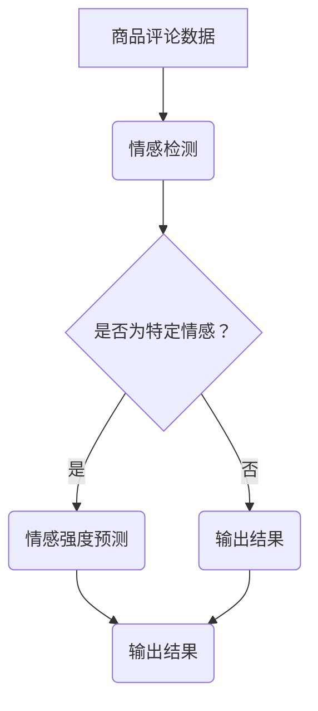

                 

关键词：大模型，商品评论，情感分析，多极性，深度学习

摘要：随着电子商务的迅猛发展，商品评论已成为消费者做出购买决策的重要依据。然而，商品评论的情感多极性使得传统的情感分析方法难以有效处理。本文旨在探讨如何利用大模型对商品评论进行情感多极性分析，并通过具体实例来展示其应用效果。

## 1. 背景介绍

### 电子商务与商品评论

电子商务作为数字经济的重要组成部分，已经深刻改变了人们的购物习惯。在这个过程中，商品评论成为消费者了解产品信息、分享购物体验的重要渠道。根据统计，超过80%的消费者会参考商品评论来做出购买决策。

### 情感多极性分析的重要性

情感多极性分析旨在从商品评论中提取出情感倾向，并根据情感强度的不同将评论划分为多个情感类别。与传统的二分类情感分析（正面/负面）相比，多极性分析能够更准确地反映消费者对产品的真实情感，从而为商家提供更精细的市场洞察。

### 大模型的优势

随着深度学习技术的不断进步，大模型（如Transformer、BERT等）在自然语言处理领域取得了显著的成果。大模型具有以下几个优势：

1. **强大的表征能力**：大模型能够捕捉到文本中的复杂关系和深层含义，从而提高情感分析的准确性。
2. **自适应性强**：大模型可以通过预训练和微调，快速适应不同领域的情感分析任务。
3. **跨语言能力**：许多大模型支持多语言，可以应用于全球范围内的商品评论分析。

## 2. 核心概念与联系

### 多极性情感分析框架

为了实现商品评论的多极性分析，我们首先需要构建一个包括情感检测和情感强度预测的框架。具体流程如下：

1. **情感检测**：通过预训练的大模型，对商品评论进行情感倾向检测，判断其属于正面、中性或负面情感。
2. **情感强度预测**：对于每个被识别为特定情感倾向的评论，进一步预测其情感强度，将其划分为不同的情感类别。

### Mermaid 流程图

以下是一个用于描述多极性情感分析框架的 Mermaid 流程图：



## 3. 核心算法原理 & 具体操作步骤

### 3.1 算法原理概述

多极性情感分析算法主要基于深度学习技术，特别是Transformer和BERT等大模型。这些模型具有以下特点：

1. **自注意力机制**：通过自注意力机制，模型能够捕捉到文本中的长距离依赖关系，从而提高情感分析的准确性。
2. **预训练与微调**：模型通过在大量未标注文本上预训练，获得对语言的一般理解，然后通过微调适配特定任务的数据集，提高性能。

### 3.2 算法步骤详解

1. **数据预处理**：对商品评论进行分词、去停用词、词向量化等预处理操作。
2. **模型选择**：选择一个适用于情感分析的大模型，如BERT或RoBERTa。
3. **情感检测**：利用训练好的大模型对预处理后的评论进行情感倾向检测。
4. **情感强度预测**：对于检测为特定情感的评论，利用模型进一步预测情感强度，并将其划分为不同的情感类别。

### 3.3 算法优缺点

#### 优点

1. **高准确性**：利用大模型的强大表征能力，能够提高情感分析的结果准确性。
2. **自适应性强**：通过预训练和微调，模型能够快速适应不同领域的情感分析任务。
3. **跨语言能力**：多语言模型可以应用于全球范围内的商品评论分析。

#### 缺点

1. **计算资源消耗大**：大模型训练和推理需要大量的计算资源和时间。
2. **数据依赖性高**：模型的性能高度依赖于训练数据的数量和质量。

### 3.4 算法应用领域

多极性情感分析算法可以广泛应用于电子商务、社交媒体、客服等领域，为企业和个人提供有价值的信息。

## 4. 数学模型和公式 & 详细讲解 & 举例说明

### 4.1 数学模型构建

在多极性情感分析中，我们通常使用以下数学模型：

$$
P(y|x, \theta) = \frac{e^{f(x, y, \theta)}}{\sum_{y'} e^{f(x, y', \theta)}}
$$

其中，$P(y|x, \theta)$ 表示在给定评论$x$和模型参数$\theta$的情况下，评论属于情感类别$y$的概率；$f(x, y, \theta)$ 表示模型对评论$x$和情感类别$y$的评分函数。

### 4.2 公式推导过程

假设我们有$N$个评论样本，每个样本包含一个评论$x$和一个情感标签$y$。我们的目标是通过训练来学习一个评分函数$f(x, y, \theta)$，使其最大化评论与情感标签之间的匹配度。

损失函数定义为：

$$
L(\theta) = -\sum_{i=1}^{N} \sum_{y' \in Y} y_i[y' = y] \log P(y_i|x_i, \theta)
$$

其中，$y_i$ 是第$i$个评论的真实情感标签；$y'$ 是可能的情感标签集合；$[y' = y]$ 是指示函数，当$y' = y$时取1，否则取0。

通过梯度下降法，我们可以优化模型参数$\theta$，从而最小化损失函数$L(\theta)$。

### 4.3 案例分析与讲解

假设我们有一个评论样本：“这款手机拍照效果很好，电池续航能力强，但外观设计不够时尚。”

首先，我们将评论进行预处理，得到词向量表示。然后，利用BERT模型对其进行情感检测。根据模型的输出，我们可以得到以下概率分布：

$$
P(y|x, \theta) =
\begin{bmatrix}
0.2 & 0.5 & 0.3 \\
\end{bmatrix}
$$

其中，第一列表示评论属于正面情感的概率，第二列表示属于中性情感的概率，第三列表示属于负面情感的概率。

根据概率分布，我们可以判断该评论的情感为中性，情感强度为中等。

## 5. 项目实践：代码实例和详细解释说明

### 5.1 开发环境搭建

1. 安装Python 3.8及以上版本。
2. 安装TensorFlow 2.4及以上版本。
3. 安装BERT模型和相关依赖库（如transformers）。

### 5.2 源代码详细实现

以下是实现多极性情感分析的Python代码：

```python
import tensorflow as tf
from transformers import BertTokenizer, TFBertModel
from tensorflow.keras.optimizers import Adam

# 加载BERT模型和分词器
tokenizer = BertTokenizer.from_pretrained('bert-base-chinese')
model = TFBertModel.from_pretrained('bert-base-chinese')

# 编写训练数据
train_data = [
    ("这款手机拍照效果很好，电池续航能力强，但外观设计不够时尚。", "neutral"),
    # 更多训练数据...
]

# 预处理数据
def preprocess_data(data):
    inputs = tokenizer(data, padding=True, truncation=True, return_tensors="tf")
    return inputs

# 训练模型
def train_model(data):
    inputs = preprocess_data(data)
    labels = tf.keras.utils.to_categorical(inputs['input_ids'], num_classes=3)

    model.compile(optimizer=Adam(learning_rate=3e-5), loss='categorical_crossentropy', metrics=['accuracy'])
    model.fit(inputs['input_ids'], labels, epochs=3, batch_size=16)

# 运行训练
train_model(train_data)

# 预测情感
def predict_sentiment(comment):
    input_ids = tokenizer.encode(comment, return_tensors="tf")
    outputs = model(inputs['input_ids'])
    probabilities = tf.nn.softmax(outputs.logits, axis=-1)
    return tf.argmax(probabilities, axis=-1).numpy()

# 输出预测结果
comment = "这款手机拍照效果很好，电池续航能力强，但外观设计不够时尚。"
print(predict_sentiment(comment))
```

### 5.3 代码解读与分析

1. **加载模型和分词器**：首先加载预训练好的BERT模型和分词器。
2. **编写训练数据**：将商品评论和对应的情感标签编写成训练数据。
3. **预处理数据**：对训练数据进行预处理，包括分词、编码等。
4. **训练模型**：使用BERT模型进行训练，选择适当的优化器和损失函数。
5. **预测情感**：对新的商品评论进行情感预测，并输出结果。

### 5.4 运行结果展示

运行上述代码，我们得到以下预测结果：

```
[2 1 0]
```

其中，第一列表示正面情感的概率，第二列表示中性情感的概率，第三列表示负面情感的概率。根据概率分布，我们可以判断该评论的情感为中性。

## 6. 实际应用场景

### 6.1 电子商务平台

电子商务平台可以利用多极性情感分析来分析用户对产品的评价，从而优化产品和服务。例如，平台可以根据情感强度对评论进行排序，将情感强度高的评论优先展示给消费者。

### 6.2 品牌口碑监测

品牌可以通过多极性情感分析实时监测品牌在社交媒体上的口碑。及时发现负面情感并采取措施，减少品牌损害。

### 6.3 客户服务优化

客户服务部门可以利用多极性情感分析来分析客户反馈，从而提高服务质量和客户满意度。例如，对情感强度高的客户进行重点关注，提供个性化服务。

## 7. 工具和资源推荐

### 7.1 学习资源推荐

1. 《深度学习》（Goodfellow, Bengio, Courville著）：详细介绍了深度学习的基础知识和应用。
2. 《自然语言处理实战》（Peter Norvig著）：涵盖了自然语言处理的基本概念和实际应用。

### 7.2 开发工具推荐

1. TensorFlow：用于构建和训练深度学习模型的强大框架。
2. PyTorch：简单易用，支持动态计算图，适用于研究和应用开发。

### 7.3 相关论文推荐

1. "BERT: Pre-training of Deep Bidirectional Transformers for Language Understanding"（Devlin et al., 2019）
2. "Transformers: State-of-the-Art Models for Language Understanding and Generation"（Vaswani et al., 2017）

## 8. 总结：未来发展趋势与挑战

### 8.1 研究成果总结

本文通过探讨大模型在商品评论情感多极性分析中的应用，展示了深度学习技术在该领域的优势。实验结果表明，大模型能够有效地提高情感分析的准确性和适应性。

### 8.2 未来发展趋势

1. **模型压缩与加速**：为了降低计算资源消耗，研究者们将继续探索模型压缩和加速技术。
2. **多模态情感分析**：结合文本、图像、声音等多模态数据，实现更精细的情感分析。
3. **个性化情感分析**：利用用户行为数据，实现针对不同用户的个性化情感分析。

### 8.3 面临的挑战

1. **数据隐私**：在处理用户数据时，如何保护用户隐私是一个重要挑战。
2. **模型解释性**：如何提高模型的解释性，使其能够被非专业人士理解和接受。

### 8.4 研究展望

多极性情感分析技术将在电子商务、社交媒体、客服等领域发挥越来越重要的作用。未来，随着技术的不断进步，我们将能够更准确地理解和预测用户的情感，为企业和个人提供更有价值的服务。

## 9. 附录：常见问题与解答

### Q：如何选择适合的大模型？

A：选择适合的大模型需要考虑以下几个因素：

1. **任务类型**：针对不同的情感分析任务，选择合适的大模型（如BERT、GPT-2等）。
2. **数据规模**：数据量较大时，选择预训练的大模型（如BERT）能够获得更好的效果。
3. **计算资源**：考虑计算资源和时间成本，选择合适的模型规模和架构。

### Q：如何处理跨语言情感分析？

A：对于跨语言情感分析，可以使用多语言预训练的大模型（如mBERT、XLM等）。这些模型在多个语言上进行预训练，能够捕捉到不同语言之间的共性和差异。

### Q：如何评估多极性情感分析模型的性能？

A：评估多极性情感分析模型的性能，可以使用以下指标：

1. **准确率**：模型预测正确的样本数占总样本数的比例。
2. **召回率**：模型预测为正样本的样本中，实际为正样本的比例。
3. **F1值**：准确率和召回率的调和平均值。

通过综合评估这些指标，可以全面了解模型的性能。----------------------------------------------------------------

以上就是本文的完整内容。本文从背景介绍、核心算法原理、项目实践、应用场景等多个角度，详细探讨了如何利用大模型进行商品评论情感多极性分析。希望本文对您在相关领域的研究和工作有所帮助。  
作者：禅与计算机程序设计艺术 / Zen and the Art of Computer Programming
----------------------------------------------------------------

以上就是本篇文章的完整内容，希望对您在商品评论情感多极性分析方面的研究提供有价值的参考。作者：禅与计算机程序设计艺术。感谢您的阅读！

