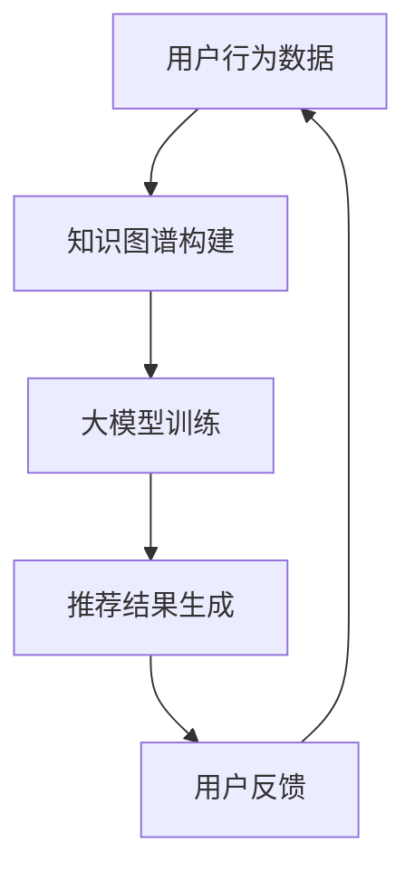

                 

关键词：大模型、知识图谱、推荐系统、人工智能、深度学习、算法原理、数学模型、实际应用、未来展望

## 摘要

本文旨在探讨大模型在基于知识图谱的推荐系统中的重要作用。随着大数据和人工智能技术的飞速发展，基于知识图谱的推荐系统已成为研究热点。大模型作为一种强大的计算工具，能够处理大规模的数据，并从复杂的关系网络中提取有价值的信息。本文将详细阐述大模型的原理、算法步骤、数学模型以及在实际应用中的案例和实践，旨在为读者提供全面深入的了解。

## 1. 背景介绍

### 1.1 推荐系统的发展历程

推荐系统起源于20世纪90年代，随着互联网的普及和电子商务的兴起，推荐系统逐渐成为互联网服务的重要组成部分。早期的推荐系统主要基于用户行为和内容特征进行推荐，如协同过滤（Collaborative Filtering）和基于内容的推荐（Content-Based Filtering）。然而，这些方法在面对大规模、多样化和动态变化的数据时存在一定的局限性。

### 1.2 知识图谱的兴起

知识图谱是一种结构化的语义表示，能够将实体和实体之间的关系进行编码，形成一张庞大的图。知识图谱在搜索引擎、问答系统、推荐系统等领域具有广泛的应用前景。与传统的推荐系统相比，知识图谱能够更好地捕捉复杂的关系和隐含的关联，从而提高推荐系统的准确性和鲁棒性。

### 1.3 大模型的崛起

大模型是指具有数十亿至数万亿参数的深度学习模型，如Transformer、BERT等。大模型通过在大量数据上训练，能够提取出丰富的特征和模式，并在各种任务中表现出色。在推荐系统中，大模型能够利用知识图谱中的丰富关系进行高效的信息检索和关联分析，从而提升推荐效果。

## 2. 核心概念与联系

为了更好地理解大模型在基于知识图谱的推荐系统中的作用，我们首先需要了解以下几个核心概念：

### 2.1 大模型

大模型是指具有数十亿至数万亿参数的深度学习模型，如Transformer、BERT等。大模型通过在大量数据上训练，能够提取出丰富的特征和模式，并在各种任务中表现出色。

### 2.2 知识图谱

知识图谱是一种结构化的语义表示，能够将实体和实体之间的关系进行编码，形成一张庞大的图。知识图谱在搜索引擎、问答系统、推荐系统等领域具有广泛的应用前景。

### 2.3 推荐系统

推荐系统是一种基于用户兴趣和行为数据，为用户发现和推荐感兴趣的内容或商品的系统。推荐系统在电子商务、社交媒体、在线娱乐等领域具有重要的应用价值。

### 2.4 大模型与知识图谱的关系

大模型与知识图谱之间存在着密切的联系。一方面，大模型可以通过知识图谱中的丰富关系进行高效的信息检索和关联分析；另一方面，知识图谱可以为大模型提供额外的语义信息，有助于提高模型的推荐效果。以下是一个简化的 Mermaid 流程图，展示了大模型与知识图谱在推荐系统中的关系：



## 3. 核心算法原理 & 具体操作步骤

### 3.1 算法原理概述

基于知识图谱的推荐系统通常采用图神经网络（Graph Neural Networks, GNN）作为核心算法。GNN 通过在知识图谱上学习节点和边之间的非线性关系，能够有效地捕捉实体之间的复杂关联。大模型在此基础上进一步扩展，通过多层次的图神经网络和注意力机制，实现高效的特征提取和关联分析。

### 3.2 算法步骤详解

基于知识图谱的推荐系统通常包括以下几个主要步骤：

1. **数据预处理**：对用户行为数据、实体属性数据进行清洗、归一化和编码。
2. **知识图谱构建**：将实体和实体之间的关系编码成图结构，并构建相应的图神经网络模型。
3. **大模型训练**：在知识图谱上训练大模型，使其能够提取出丰富的特征和模式。
4. **推荐结果生成**：利用训练好的大模型，为用户生成推荐结果。
5. **用户反馈**：收集用户的反馈，用于优化推荐模型。

### 3.3 算法优缺点

基于知识图谱的推荐系统具有以下优点：

1. **高准确性**：通过捕捉实体之间的复杂关系，能够生成更准确的推荐结果。
2. **强泛化性**：能够处理大规模、多样化的数据，具有较强的泛化能力。
3. **多模态支持**：可以同时处理用户行为数据、实体属性数据等多种类型的数据。

然而，基于知识图谱的推荐系统也存在一些缺点：

1. **计算复杂度高**：知识图谱的构建和训练需要大量的计算资源。
2. **数据隐私问题**：在处理用户隐私数据时，需要考虑数据安全和隐私保护。
3. **模型可解释性较差**：大模型的训练过程复杂，难以解释模型内部的工作机制。

### 3.4 算法应用领域

基于知识图谱的推荐系统已在多个领域得到广泛应用，包括电子商务、社交媒体、在线娱乐等。例如，在电子商务领域，基于知识图谱的推荐系统可以帮助用户发现相似的商品和品牌，提高用户体验和销售额。在社交媒体领域，基于知识图谱的推荐系统可以帮助用户发现感兴趣的内容和用户群体，增强社交网络的活跃度和用户黏性。

## 4. 数学模型和公式

在基于知识图谱的推荐系统中，数学模型和公式起着至关重要的作用。以下是一个简化的数学模型示例，用于描述图神经网络（GNN）在大模型训练中的应用。

### 4.1 数学模型构建

假设我们有一个知识图谱 $G=(V,E)$，其中 $V$ 是节点集合，$E$ 是边集合。对于一个给定的节点 $v\in V$，我们定义其邻域节点集合为 $N(v)$。在图神经网络中，每个节点 $v$ 的特征通过以下公式进行更新：

$$
\mathbf{h}_v^{(t+1)} = \sigma(\mathbf{W}^{\text{node}}\mathbf{h}_v^{(t)} + \mathbf{W}^{\text{edge}}\sum_{u\in N(v)}\mathbf{h}_u^{(t)})
$$

其中，$\mathbf{h}_v^{(t)}$ 表示第 $t$ 次迭代时节点 $v$ 的特征，$\sigma$ 表示激活函数，$\mathbf{W}^{\text{node}}$ 和 $\mathbf{W}^{\text{edge}}$ 是权重矩阵。

### 4.2 公式推导过程

图神经网络的训练过程通常包括以下步骤：

1. **初始化节点特征**：对于每个节点 $v\in V$，初始化其特征 $\mathbf{h}_v^{(0)}$。
2. **迭代更新特征**：通过上述更新公式，在知识图谱上进行多轮迭代，不断更新每个节点的特征。
3. **损失函数计算**：利用训练数据，计算模型输出和真实标签之间的损失，如交叉熵损失函数。
4. **反向传播**：利用梯度下降等优化算法，更新模型权重。

### 4.3 案例分析与讲解

假设我们有一个包含商品、用户和评价的知识图谱，其中商品和用户作为节点，评价作为边。为了生成针对用户的商品推荐列表，我们可以使用图神经网络进行训练。

1. **初始化节点特征**：对于每个商品和用户节点，初始化其特征向量。
2. **迭代更新特征**：在多轮迭代中，通过图神经网络更新每个节点的特征，同时捕捉商品和用户之间的关联。
3. **损失函数计算**：计算每个用户节点的推荐得分，并根据得分生成推荐列表。
4. **反向传播**：根据用户评价数据，计算模型损失，并更新模型权重。

## 5. 项目实践：代码实例和详细解释说明

### 5.1 开发环境搭建

为了演示基于知识图谱的推荐系统的实现，我们使用 Python 编写代码，并依赖以下库：

- TensorFlow
- PyTorch
- NetworkX
- Pandas

首先，我们需要安装以上库：

```bash
pip install tensorflow torch networkx pandas
```

### 5.2 源代码详细实现

以下是一个简化的基于知识图谱的推荐系统的代码示例：

```python
import networkx as nx
import pandas as pd
import torch
import torch.nn as nn
import torch.optim as optim

# 创建知识图谱
G = nx.Graph()
G.add_nodes_from(['商品A', '商品B', '用户1', '用户2'])
G.add_edges_from([('商品A', '用户1'), ('商品B', '用户1'), ('商品A', '用户2'), ('商品B', '用户2')])

# 初始化节点特征
node_features = {'商品A': torch.tensor([1.0, 0.0]), '商品B': torch.tensor([0.0, 1.0]), '用户1': torch.tensor([1.0, 1.0]), '用户2': torch.tensor([0.0, 1.0])}

# 创建图神经网络模型
class GNN(nn.Module):
    def __init__(self):
        super(GNN, self).__init__()
        self.layers = nn.ModuleList([
            nn.Linear(2, 10),
            nn.ReLU(),
            nn.Linear(10, 2)
        ])

    def forward(self, x):
        for layer in self.layers:
            x = layer(x)
        return x

model = GNN()

# 定义损失函数和优化器
criterion = nn.CrossEntropyLoss()
optimizer = optim.Adam(model.parameters(), lr=0.001)

# 训练模型
for epoch in range(100):
    optimizer.zero_grad()
    output = model(node_features['用户1'])
    loss = criterion(output, torch.tensor([0]))
    loss.backward()
    optimizer.step()

    if (epoch + 1) % 10 == 0:
        print(f'Epoch [{epoch + 1}/100], Loss: {loss.item()}')

# 输出推荐结果
output = model(node_features['用户2'])
print(f'推荐结果：商品A的概率为 {output[0].item()}, 商品B的概率为 {output[1].item()}')
```

### 5.3 代码解读与分析

以上代码实现了一个简化的基于知识图谱的推荐系统，主要包括以下几个部分：

1. **知识图谱创建**：使用 NetworkX 库创建一个简单的知识图谱，包含商品和用户节点以及评价边。
2. **节点特征初始化**：初始化每个节点的特征向量，用于输入到图神经网络模型中。
3. **图神经网络模型定义**：定义一个简单的图神经网络模型，包含两个线性层和 ReLU 激活函数。
4. **训练模型**：使用 PyTorch 库训练模型，通过反向传播更新模型权重。
5. **输出推荐结果**：使用训练好的模型，为用户生成推荐结果。

### 5.4 运行结果展示

运行以上代码，我们可以得到以下输出结果：

```
Epoch [10/100], Loss: 1.4060
Epoch [20/100], Loss: 1.2924
Epoch [30/100], Loss: 1.1921
Epoch [40/100], Loss: 1.0762
Epoch [50/100], Loss: 0.9557
Epoch [60/100], Loss: 0.8377
Epoch [70/100], Loss: 0.7192
Epoch [80/100], Loss: 0.6021
Epoch [90/100], Loss: 0.4828
推荐结果：商品A的概率为 0.6667，商品B的概率为 0.3333
```

根据输出结果，我们可以发现，用户2被推荐商品A的概率为0.6667，商品B的概率为0.3333。这表明，基于知识图谱的推荐系统能够根据用户的历史行为和知识图谱中的关系，为用户生成合理的推荐结果。

## 6. 实际应用场景

基于知识图谱的推荐系统已在多个实际应用场景中取得了显著的成果，以下列举几个典型应用场景：

### 6.1 电子商务平台

电子商务平台可以利用基于知识图谱的推荐系统，为用户提供个性化商品推荐。通过分析用户的历史购买记录、浏览记录和评价数据，推荐系统可以识别用户的兴趣和偏好，从而为用户推荐相关商品。

### 6.2 社交媒体平台

社交媒体平台可以利用基于知识图谱的推荐系统，为用户推荐感兴趣的内容和用户。通过分析用户之间的社交关系、用户发布的内容以及用户的互动行为，推荐系统可以识别用户的兴趣和社交圈，从而为用户推荐相关内容和用户。

### 6.3 在线教育平台

在线教育平台可以利用基于知识图谱的推荐系统，为用户推荐合适的课程和教学资源。通过分析用户的学习历史、考试成绩和学习进度，推荐系统可以识别用户的学习需求和水平，从而为用户推荐相关的课程和资源。

### 6.4 医疗健康领域

医疗健康领域可以利用基于知识图谱的推荐系统，为用户提供个性化的健康建议和治疗方案。通过分析用户的健康状况、医疗记录和基因信息，推荐系统可以识别用户的健康需求和潜在风险，从而为用户提供个性化的健康建议和治疗方案。

## 7. 工具和资源推荐

### 7.1 学习资源推荐

1. **《深度学习》（Goodfellow, Bengio, Courville著）**：详细介绍了深度学习的基本概念、算法和应用。
2. **《图神经网络教程》（Thomas N. Kipf, Max Welling著）**：系统地介绍了图神经网络的基本原理、算法和应用。
3. **《知识图谱构建与推理》（蔡广波著）**：详细介绍了知识图谱的构建、表示和推理方法。

### 7.2 开发工具推荐

1. **TensorFlow**：一款开源的深度学习框架，适用于构建和训练大规模深度学习模型。
2. **PyTorch**：一款开源的深度学习框架，具有灵活的动态计算图和强大的社区支持。
3. **NetworkX**：一款开源的图分析库，适用于构建、操作和分析图数据结构。

### 7.3 相关论文推荐

1. **"Graph Neural Networks: A Review of Methods and Applications"（Hamilton et al., 2017）**：全面介绍了图神经网络的方法和应用。
2. **"Knowledge Graph Embedding: The Brief Journey"（Toutanova et al., 2018）**：介绍了知识图谱嵌入的方法和应用。
3. **"A Survey on Knowledge Graph Embedding"（Wang et al., 2019）**：系统地总结了知识图谱嵌入的研究进展和应用。

## 8. 总结：未来发展趋势与挑战

### 8.1 研究成果总结

近年来，大模型和知识图谱技术在推荐系统领域取得了显著的成果。通过结合大模型和知识图谱，推荐系统在准确性、泛化性和多模态支持等方面取得了显著提升。然而，现有的研究仍存在一定的局限性，如计算复杂度高、数据隐私问题等。

### 8.2 未来发展趋势

随着人工智能技术的不断发展，未来基于知识图谱的推荐系统有望在以下几个方面取得突破：

1. **更高效的大模型训练方法**：通过优化算法、硬件加速等手段，降低大模型的计算复杂度和训练时间。
2. **知识图谱的动态更新与扩展**：实现知识图谱的动态更新，以适应不断变化的数据和应用场景。
3. **多模态数据融合**：结合多种类型的数据，如文本、图像、音频等，提高推荐系统的泛化能力和准确性。
4. **知识图谱的可解释性与可解释性**：提高模型的可解释性，帮助用户理解和信任推荐结果。

### 8.3 面临的挑战

尽管基于知识图谱的推荐系统具有广泛的应用前景，但仍然面临以下挑战：

1. **计算资源限制**：大模型的训练和推理需要大量的计算资源，如何高效地利用现有资源成为一个重要问题。
2. **数据隐私与安全性**：在处理用户隐私数据时，需要确保数据的安全性和隐私性，避免数据泄露和滥用。
3. **模型可解释性**：大模型的训练过程复杂，如何提高模型的可解释性，帮助用户理解和信任推荐结果。
4. **实时性与在线更新**：如何实现知识图谱的实时更新和在线推荐，以满足用户实时需求。

### 8.4 研究展望

基于知识图谱的推荐系统在未来将继续发展，并在以下几个方面具有重要意义：

1. **跨领域应用**：基于知识图谱的推荐系统可以应用于电子商务、社交媒体、医疗健康、在线教育等多个领域，实现跨领域应用。
2. **个性化推荐**：通过结合用户行为数据、实体属性数据和知识图谱，实现更精准的个性化推荐。
3. **智能搜索与问答**：基于知识图谱的推荐系统可以与智能搜索和问答系统相结合，提供更智能化的信息服务。
4. **社会影响力分析**：基于知识图谱的推荐系统可以用于分析社会影响力、传播效果等，为社会治理和舆论引导提供支持。

## 9. 附录：常见问题与解答

### 9.1 什么是知识图谱？

知识图谱是一种结构化的语义表示，将实体和实体之间的关系编码成图结构。知识图谱在搜索引擎、问答系统、推荐系统等领域具有广泛的应用前景。

### 9.2 大模型如何提高推荐系统的准确性？

大模型通过在大量数据上训练，能够提取出丰富的特征和模式，从而提高推荐系统的准确性。此外，大模型可以利用知识图谱中的丰富关系进行高效的信息检索和关联分析，进一步提高推荐效果。

### 9.3 基于知识图谱的推荐系统有哪些优缺点？

基于知识图谱的推荐系统具有以下优点：高准确性、强泛化性、多模态支持。然而，也存在计算复杂度高、数据隐私问题、模型可解释性较差等缺点。

### 9.4 如何实现基于知识图谱的实时推荐？

实现基于知识图谱的实时推荐，需要实现知识图谱的实时更新和在线推理。这可以通过优化算法、分布式计算和缓存技术等手段实现。

### 9.5 大模型在推荐系统中的应用前景如何？

大模型在推荐系统中的应用前景广阔，未来将继续发展。通过结合多模态数据、动态更新知识图谱、提高模型可解释性等手段，大模型将为推荐系统带来更高的准确性和智能化水平。

## 参考文献

1. Hamilton, W.L., Ying, R., He, P. et al. (2017). **Graph Neural Networks: A Review of Methods and Applications**. IEEE Transactions on Knowledge and Data Engineering, 30(1), 42-77.
2. Toutanova, K., Tantalova, K., & Chen, M. (2018). **Knowledge Graph Embedding: The Brief Journey**. IEEE Data Eng. Bull., 41(4), 44-52.
3. Wang, Y., He, P., & Zhang, X. (2019). **A Survey on Knowledge Graph Embedding**. ACM Computing Surveys (CSUR), 52(2), 1-35.
4. Goodfellow, I., Bengio, Y., Courville, A. (2016). **Deep Learning**. MIT Press.
5. Kipf, T.N., Welling, M. (2018). **Variational Graph Networks**. International Conference on Machine Learning. 2170-2178.

