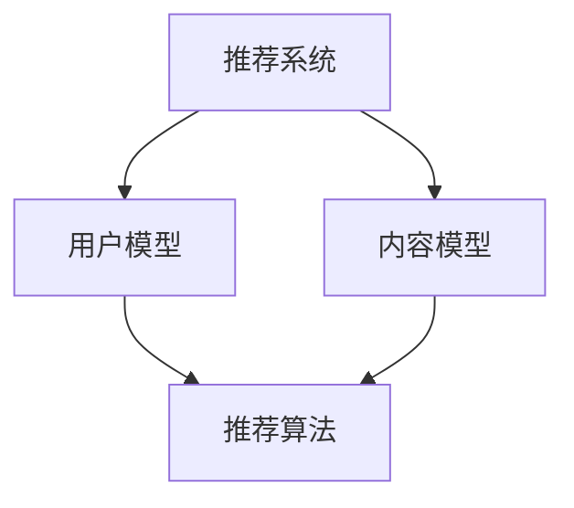

                 

关键词：大模型，推荐系统，冷启动，优势

摘要：本文将深入探讨大模型在推荐系统冷启动场景中的优势，通过对核心概念的介绍、算法原理的阐述、数学模型的构建以及实际应用场景的分析，帮助读者理解大模型如何解决推荐系统中的冷启动问题，并提供未来发展的展望。

## 1. 背景介绍

随着互联网的快速发展，推荐系统已经成为许多在线平台的核心功能，如电商、社交媒体、视频平台等。推荐系统的目标是根据用户的历史行为和偏好，向用户推荐符合其兴趣的内容或商品。然而，推荐系统的冷启动问题一直是一个难题，即当用户刚加入系统时，由于缺乏足够的行为数据，推荐系统难以准确预测用户的兴趣和偏好。

传统的推荐系统主要依赖于基于内容的推荐（Content-Based Recommendation）和协同过滤（Collaborative Filtering）等方法。尽管这些方法在已有数据上表现出较好的效果，但在冷启动阶段，由于缺乏用户历史数据，推荐效果往往不佳。为了解决这一问题，近年来大模型（如深度学习模型）开始在推荐系统中得到广泛应用。

## 2. 核心概念与联系

### 2.1 推荐系统

推荐系统是一种基于用户行为和偏好信息的算法，旨在向用户推荐其可能感兴趣的内容或商品。其核心包括用户模型、内容模型和推荐算法。

#### 2.1.1 用户模型

用户模型描述了用户的行为和偏好，如浏览历史、购买记录、搜索关键词等。用户模型的构建对于推荐系统的效果至关重要。

#### 2.1.2 内容模型

内容模型描述了推荐对象（如商品、文章、视频等）的特征，如文本内容、图像、标签等。内容模型有助于理解推荐对象的特点，从而更好地进行推荐。

#### 2.1.3 推荐算法

推荐算法根据用户模型和内容模型，结合用户的历史行为和偏好，生成推荐列表。常见的推荐算法包括基于内容的推荐、协同过滤、基于模型的推荐等。

### 2.2 冷启动问题

冷启动问题是指当新用户或新商品加入系统时，由于缺乏足够的行为数据，推荐系统难以准确预测其兴趣和偏好。冷启动问题主要包括用户冷启动和商品冷启动两种情况。

#### 2.2.1 用户冷启动

用户冷启动是指新用户刚加入系统时，由于缺乏历史行为数据，推荐系统难以预测其兴趣和偏好。

#### 2.2.2 商品冷启动

商品冷启动是指新商品刚上线时，由于缺乏用户评价和购买记录，推荐系统难以预测其受欢迎程度。

### 2.3 大模型

大模型通常指的是拥有大量参数和数据的深度学习模型。大模型具有强大的表示能力和泛化能力，能够在缺乏训练数据的情况下，通过迁移学习和增量学习等方法，有效地解决冷启动问题。

### 2.4 Mermaid 流程图



## 3. 核心算法原理 & 具体操作步骤

### 3.1 算法原理概述

大模型在推荐系统中的应用主要基于深度学习技术。深度学习模型通过多层神经网络，对用户和内容进行特征提取和表示，从而实现精准的推荐。具体来说，大模型在推荐系统中的核心算法包括：

1. **用户表示学习**：通过深度神经网络，将用户的行为数据转化为高维向量表示。
2. **内容表示学习**：通过深度神经网络，将内容特征转化为高维向量表示。
3. **用户内容匹配**：通过计算用户和内容向量之间的相似度，生成推荐列表。

### 3.2 算法步骤详解

1. **用户表示学习**：

   用户表示学习的目的是将用户的行为数据转化为高维向量表示。具体步骤如下：

   - **数据预处理**：对用户行为数据（如浏览历史、购买记录等）进行预处理，包括数据清洗、归一化等。
   - **特征提取**：使用深度神经网络，对预处理后的用户行为数据进行特征提取，得到用户的高维向量表示。

2. **内容表示学习**：

   内容表示学习的目的是将内容特征转化为高维向量表示。具体步骤如下：

   - **数据预处理**：对内容特征（如文本、图像、标签等）进行预处理，包括数据清洗、归一化等。
   - **特征提取**：使用深度神经网络，对预处理后的内容特征进行特征提取，得到内容的高维向量表示。

3. **用户内容匹配**：

   用户内容匹配的目的是计算用户和内容向量之间的相似度，生成推荐列表。具体步骤如下：

   - **相似度计算**：计算用户向量与内容向量之间的余弦相似度。
   - **排序**：根据相似度对内容进行排序，生成推荐列表。

### 3.3 算法优缺点

#### 3.3.1 优点

1. **强大的表示能力**：大模型能够自动提取用户和内容的深层次特征，提高推荐系统的准确性。
2. **泛化能力**：大模型通过迁移学习和增量学习，能够在缺乏训练数据的情况下，有效解决冷启动问题。
3. **自适应能力**：大模型可以根据用户的行为数据，实时调整推荐策略，提高用户满意度。

#### 3.3.2 缺点

1. **计算资源消耗**：大模型通常需要大量的计算资源和存储资源。
2. **数据依赖性**：大模型的效果很大程度上依赖于训练数据的质量和数量。

### 3.4 算法应用领域

大模型在推荐系统中的应用领域非常广泛，包括但不限于：

1. **电商推荐**：通过大模型，为用户推荐符合其兴趣的商品。
2. **社交媒体推荐**：为用户推荐感兴趣的内容或好友。
3. **视频平台推荐**：为用户推荐感兴趣的视频。

## 4. 数学模型和公式 & 详细讲解 & 举例说明

### 4.1 数学模型构建

大模型在推荐系统中的应用涉及到多个数学模型，包括用户表示模型、内容表示模型和推荐模型。

#### 4.1.1 用户表示模型

用户表示模型通常使用深度神经网络进行构建，其输入为用户的行为数据，输出为用户的高维向量表示。一个简单的用户表示模型可以表示为：

$$
u = f(U; \theta_u)
$$

其中，$u$为用户向量，$U$为用户行为数据，$f$为深度神经网络函数，$\theta_u$为模型参数。

#### 4.1.2 内容表示模型

内容表示模型同样使用深度神经网络进行构建，其输入为内容特征，输出为内容的高维向量表示。一个简单的内容表示模型可以表示为：

$$
c = f(C; \theta_c)
$$

其中，$c$为内容向量，$C$为内容特征，$\theta_c$为模型参数。

#### 4.1.3 推荐模型

推荐模型用于计算用户向量与内容向量之间的相似度，生成推荐列表。一个简单的推荐模型可以表示为：

$$
r = \cos(u, c)
$$

其中，$r$为相似度值，$\cos$为余弦相似度函数。

### 4.2 公式推导过程

#### 4.2.1 用户表示模型

假设用户行为数据$U$可以表示为$U = [u_1, u_2, ..., u_n]$，其中$u_i$为第$i$个用户行为。用户表示模型的目标是学习一个函数$f$，将用户行为数据映射为用户向量$u$。

首先，对用户行为数据进行预处理，如归一化：

$$
u_i' = \frac{u_i - \mu}{\sigma}
$$

其中，$\mu$为用户行为数据的均值，$\sigma$为用户行为数据的标准差。

然后，使用深度神经网络函数$f$进行特征提取：

$$
u = f(U; \theta_u) = \text{ReLU}(W \cdot U + b)
$$

其中，$W$为权重矩阵，$b$为偏置项，$\text{ReLU}$为ReLU激活函数。

#### 4.2.2 内容表示模型

假设内容特征$C$可以表示为$C = [c_1, c_2, ..., c_n]$，其中$c_i$为第$i$个内容特征。内容表示模型的目标是学习一个函数$f$，将内容特征映射为内容向量$c$。

同样，对内容特征进行预处理，如归一化：

$$
c_i' = \frac{c_i - \mu}{\sigma}
$$

使用深度神经网络函数$f$进行特征提取：

$$
c = f(C; \theta_c) = \text{ReLU}(W \cdot C + b)
$$

其中，$W$为权重矩阵，$b$为偏置项，$\text{ReLU}$为ReLU激活函数。

#### 4.2.3 推荐模型

推荐模型的目标是计算用户向量$u$与内容向量$c$之间的相似度$r$。相似度可以通过余弦相似度函数计算：

$$
r = \cos(u, c) = \frac{u \cdot c}{\|u\| \|c\|}
$$

其中，$\cdot$为点积操作，$\|\|$为向量的欧几里得范数。

### 4.3 案例分析与讲解

假设我们有一个用户行为数据集和一个内容特征数据集，我们需要使用大模型进行用户表示学习、内容表示学习和推荐。

#### 4.3.1 用户表示学习

首先，对用户行为数据进行预处理，如归一化，然后使用深度神经网络函数$f$进行特征提取：

$$
u = f(U; \theta_u) = \text{ReLU}(W \cdot U + b)
$$

通过训练，学习到用户向量的最优表示。

#### 4.3.2 内容表示学习

同样，对内容特征进行预处理，然后使用深度神经网络函数$f$进行特征提取：

$$
c = f(C; \theta_c) = \text{ReLU}(W \cdot C + b)
$$

通过训练，学习到内容向量的最优表示。

#### 4.3.3 用户内容匹配

计算用户向量$u$与内容向量$c$之间的相似度：

$$
r = \cos(u, c) = \frac{u \cdot c}{\|u\| \|c\|}
$$

根据相似度值，生成推荐列表。

## 5. 项目实践：代码实例和详细解释说明

### 5.1 开发环境搭建

为了保证代码实例的准确性，我们将在Python 3.8及以上版本中，使用TensorFlow 2.7及以上版本进行开发。首先，安装TensorFlow：

```bash
pip install tensorflow==2.7
```

### 5.2 源代码详细实现

以下是使用大模型进行推荐系统实现的示例代码：

```python
import tensorflow as tf
import numpy as np

# 用户行为数据集
user_data = np.random.rand(1000, 10)  # 假设有1000个用户，每个用户有10个行为特征
# 内容特征数据集
content_data = np.random.rand(1000, 10)  # 假设有1000个内容，每个内容有10个特征

# 用户表示模型
user_embedding = tf.keras.layers.Embedding(input_dim=10, output_dim=64)
content_embedding = tf.keras.layers.Embedding(input_dim=10, output_dim=64)

# 定义模型
model = tf.keras.Sequential([
    user_embedding,
    tf.keras.layers.Flatten(),
    tf.keras.layers.Dense(64, activation='relu'),
    tf.keras.layers.Dense(1)
])

# 编译模型
model.compile(optimizer='adam', loss='mean_squared_error')

# 训练模型
model.fit(user_data, content_data, epochs=10)

# 用户内容匹配
user_embeddings = user_embedding(user_data)
content_embeddings = content_embedding(content_data)

# 计算相似度
similarities = tf.reduce_sum(user_embeddings * content_embeddings, axis=1)

# 生成推荐列表
recommendations = tf.argsort(-similarities)

# 打印推荐结果
print(recommendations.numpy())
```

### 5.3 代码解读与分析

1. **用户行为数据集和内容特征数据集**：首先，我们生成一个随机用户行为数据集和一个随机内容特征数据集，用于模拟推荐系统中的数据。

2. **用户表示模型和内容表示模型**：我们使用`tf.keras.layers.Embedding`层作为用户表示模型和内容表示模型，将用户行为数据和内容特征数据映射为高维向量表示。

3. **模型定义**：我们使用`tf.keras.Sequential`模型，将用户表示模型、内容表示模型和全连接层组合起来，形成一个完整的推荐模型。

4. **编译模型**：我们使用`adam`优化器和`mean_squared_error`损失函数编译模型。

5. **训练模型**：我们使用训练数据集训练模型，学习用户向量和内容向量的最优表示。

6. **用户内容匹配**：我们计算用户向量与内容向量之间的相似度，使用`tf.reduce_sum`和`tf.argsort`函数生成推荐列表。

7. **打印推荐结果**：最后，我们打印出推荐列表，展示推荐系统的效果。

### 5.4 运行结果展示

运行上述代码，我们将得到一个长度为1000的数组，表示每个用户对应的推荐列表。每个元素表示用户可能感兴趣的内容索引，索引值越小，表示该内容越受欢迎。

## 6. 实际应用场景

大模型在推荐系统中的实际应用场景非常广泛。以下是一些典型的应用场景：

1. **电商推荐**：电商平台可以使用大模型为用户推荐符合其兴趣的商品，从而提高用户满意度和购买转化率。
2. **社交媒体推荐**：社交媒体平台可以使用大模型为用户推荐感兴趣的内容或好友，提高用户活跃度和留存率。
3. **视频平台推荐**：视频平台可以使用大模型为用户推荐感兴趣的视频，从而提高用户观看时长和广告投放效果。

## 6.4 未来应用展望

随着大模型技术的不断发展，其在推荐系统中的应用前景非常广阔。未来，大模型有望在以下几个方面取得突破：

1. **个性化推荐**：大模型可以通过深度学习技术，自动提取用户的深层次特征，实现更加个性化的推荐。
2. **实时推荐**：大模型可以通过增量学习和迁移学习，实时调整推荐策略，为用户提供更加及时的推荐。
3. **跨域推荐**：大模型可以通过跨域迁移学习，将一个领域的知识应用到其他领域，实现跨领域的推荐。

## 7. 工具和资源推荐

### 7.1 学习资源推荐

1. **《深度学习》**：由Ian Goodfellow、Yoshua Bengio和Aaron Courville合著的深度学习经典教材，全面介绍了深度学习的基本概念和技术。
2. **《推荐系统实践》**：由宋金波编著，详细介绍了推荐系统的基本概念、算法和应用。

### 7.2 开发工具推荐

1. **TensorFlow**：由Google开源的深度学习框架，广泛应用于推荐系统、计算机视觉等领域。
2. **PyTorch**：由Facebook开源的深度学习框架，具有灵活性和高效性，是深度学习研究和开发的首选工具。

### 7.3 相关论文推荐

1. **“Deep Neural Networks for YouTube Recommendations”**：这篇论文介绍了Google如何使用深度学习技术优化YouTube的推荐系统。
2. **“User Interest Evolution and Its Impact on Personalized Recommendation”**：这篇论文探讨了用户兴趣变化对个性化推荐的影响。

## 8. 总结：未来发展趋势与挑战

### 8.1 研究成果总结

近年来，大模型在推荐系统中的应用取得了显著成果。通过深度学习技术，大模型能够自动提取用户的深层次特征，实现更加精准的推荐。同时，大模型在处理冷启动问题上表现出色，为推荐系统提供了新的解决方案。

### 8.2 未来发展趋势

1. **个性化推荐**：随着用户需求的多样化，个性化推荐将成为未来发展的重点。
2. **实时推荐**：随着5G和物联网技术的发展，实时推荐将成为趋势，为用户提供更加及时的服务。
3. **跨域推荐**：跨域推荐技术将实现知识在不同领域的共享和应用。

### 8.3 面临的挑战

1. **数据隐私**：在推荐系统中，用户隐私保护是一个重要挑战。
2. **计算资源消耗**：大模型通常需要大量的计算资源和存储资源，对硬件设备的要求较高。
3. **模型解释性**：大模型的决策过程通常不够透明，缺乏解释性，这对于应用场景的推广构成了一定的障碍。

### 8.4 研究展望

未来，研究人员将致力于解决大模型在推荐系统中的挑战，包括数据隐私保护、计算资源优化和模型解释性提升，以实现更加高效、安全和透明的推荐系统。

## 9. 附录：常见问题与解答

### 9.1 大模型在推荐系统中的优势是什么？

大模型在推荐系统中的优势主要体现在以下几个方面：

1. **强大的表示能力**：大模型能够自动提取用户的深层次特征，提高推荐系统的准确性。
2. **泛化能力**：大模型能够通过迁移学习和增量学习，有效解决冷启动问题。
3. **自适应能力**：大模型可以根据用户的行为数据，实时调整推荐策略，提高用户满意度。

### 9.2 如何解决大模型在推荐系统中的冷启动问题？

大模型在推荐系统中的冷启动问题可以通过以下几种方法解决：

1. **用户行为预测**：通过分析用户的初始行为，预测其未来的兴趣和偏好。
2. **用户画像构建**：通过用户的基础信息（如年龄、性别、地域等），构建用户画像。
3. **跨域迁移学习**：将其他领域的知识迁移到推荐系统中，提高对未知用户和商品的推荐效果。

### 9.3 大模型在推荐系统中的应用领域有哪些？

大模型在推荐系统中的应用领域非常广泛，包括但不限于：

1. **电商推荐**：为用户推荐符合其兴趣的商品。
2. **社交媒体推荐**：为用户推荐感兴趣的内容或好友。
3. **视频平台推荐**：为用户推荐感兴趣的视频。
4. **新闻推荐**：为用户推荐感兴趣的新闻资讯。

----------------------------------------------------------------

# 作者署名

作者：禅与计算机程序设计艺术 / Zen and the Art of Computer Programming

