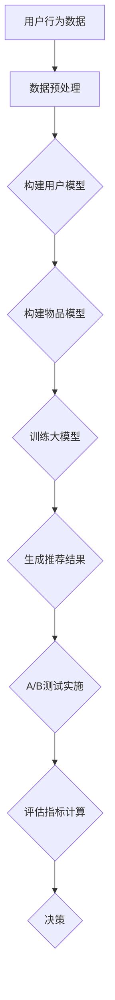

                 

 关键词：大模型，推荐系统，A/B测试，算法，数学模型，项目实践，应用场景，未来展望。

> 摘要：本文将探讨大模型在推荐系统A/B测试中的应用，从背景介绍、核心概念与联系、核心算法原理与具体操作步骤、数学模型与公式、项目实践、实际应用场景、工具和资源推荐以及未来发展趋势与挑战等多个方面，全面解析大模型在推荐系统A/B测试中的重要性及其应用前景。

## 1. 背景介绍

推荐系统作为一种信息过滤技术，旨在为用户提供个性化信息，帮助用户发现其可能感兴趣的内容。A/B测试作为一种有效的实验方法，被广泛应用于推荐系统的优化过程中。然而，传统的A/B测试方法往往面临着测试成本高、效率低等问题。随着大数据和人工智能技术的发展，大模型作为一种强大的工具，为解决传统A/B测试的难题提供了新的思路。

大模型，通常指的是具备强大计算能力和高准确性的深度学习模型。在推荐系统中，大模型可以通过对用户行为数据的学习，预测用户对特定内容的偏好，从而提高推荐效果。A/B测试则是一种通过比较两个或多个版本（A和B）的推荐系统，来评估不同策略效果的方法。传统A/B测试方法通常依赖于随机对照试验，而大模型的应用使得A/B测试更加精准和高效。

## 2. 核心概念与联系

### 2.1 推荐系统

推荐系统通常由以下几个关键组件构成：

- **用户模型**：通过收集用户的历史行为数据，如浏览记录、购买记录等，来构建用户偏好模型。

- **物品模型**：对推荐系统中的物品（如文章、产品等）进行特征提取，构建物品特征向量。

- **推荐算法**：基于用户模型和物品模型，利用一定的算法策略，生成推荐结果。

- **评估指标**：用于评估推荐系统的效果，常见的指标有准确率、召回率、点击率等。

### 2.2 A/B测试

A/B测试的基本思路是将用户随机分配到两个或多个版本（A、B等），然后比较不同版本的性能指标，以确定哪种版本更优。具体步骤如下：

1. **分组**：将用户随机分配到不同版本。
2. **实施**：分别在各个版本上运行推荐系统。
3. **评估**：收集用户在各个版本上的行为数据，计算评估指标。
4. **决策**：根据评估结果，决定是否采用新版本。

### 2.3 大模型在A/B测试中的应用

大模型在A/B测试中的应用主要体现在以下几个方面：

- **个性化推荐**：大模型可以更精准地预测用户偏好，从而提高推荐的个性化程度。
- **动态调整**：大模型可以根据用户行为数据实时调整推荐策略，提高A/B测试的灵活性。
- **高效计算**：大模型的强大计算能力可以显著提高A/B测试的效率。

### 2.4 Mermaid流程图

下面是一个简单的Mermaid流程图，展示了大模型在A/B测试中的应用流程：



## 3. 核心算法原理与具体操作步骤

### 3.1 算法原理概述

大模型在A/B测试中的应用主要基于以下几个核心算法原理：

- **深度学习**：通过多层神经网络，对用户行为数据进行建模，提取深层特征。
- **协同过滤**：结合用户行为数据和物品特征，构建用户和物品的协同过滤模型。
- **在线学习**：实时更新用户模型和物品模型，以适应用户行为的变化。

### 3.2 算法步骤详解

1. **数据预处理**：对用户行为数据（如点击、浏览、购买等）进行清洗和归一化处理。
2. **用户模型构建**：利用深度学习算法，对用户行为数据进行建模，提取用户特征。
3. **物品模型构建**：对物品特征进行提取和编码，构建物品特征向量。
4. **大模型训练**：利用用户模型和物品模型，训练深度学习模型，生成推荐结果。
5. **A/B测试实施**：将用户随机分配到A、B两个版本，分别运行推荐系统，收集用户行为数据。
6. **评估指标计算**：计算A、B两个版本的评估指标，如准确率、召回率、点击率等。
7. **决策**：根据评估结果，决定是否采用新版本。

### 3.3 算法优缺点

**优点**：

- **个性化推荐**：大模型可以更精准地预测用户偏好，提高推荐效果。
- **动态调整**：大模型可以实时更新用户模型和物品模型，适应用户行为变化。
- **高效计算**：大模型的强大计算能力可以提高A/B测试的效率。

**缺点**：

- **计算资源消耗**：大模型训练需要大量的计算资源和时间。
- **数据依赖性**：大模型的性能高度依赖于用户行为数据和物品特征数据的质量。

### 3.4 算法应用领域

大模型在A/B测试中的应用领域非常广泛，包括但不限于：

- **电子商务**：用于个性化推荐、商品分类等。
- **社交媒体**：用于内容推荐、广告投放等。
- **在线教育**：用于课程推荐、学习效果评估等。
- **金融领域**：用于风险管理、信用评估等。

## 4. 数学模型和公式

### 4.1 数学模型构建

大模型在推荐系统A/B测试中的应用主要基于以下数学模型：

- **用户行为模型**：\( P(u, i) = \sigma(\theta_u \cdot \theta_i) \)，其中，\( \theta_u \)为用户特征向量，\( \theta_i \)为物品特征向量，\( \sigma \)为 sigmoid 函数。
- **协同过滤模型**：\( r_{ui} = \langle \theta_u, \theta_i \rangle + b_u + b_i + \epsilon_{ui} \)，其中，\( \langle \cdot, \cdot \rangle \)为内积运算，\( b_u \)和\( b_i \)分别为用户和物品的偏置项，\( \epsilon_{ui} \)为误差项。

### 4.2 公式推导过程

1. **用户行为模型**：

   假设用户\( u \)对物品\( i \)的评分\( r_{ui} \)满足伯努利分布，即：

   $$ P(r_{ui} = 1) = P(u, i) = \sigma(\theta_u \cdot \theta_i) $$

   其中，\( \sigma(x) = \frac{1}{1 + e^{-x}} \)为sigmoid函数。

2. **协同过滤模型**：

   假设用户\( u \)对物品\( i \)的评分\( r_{ui} \)可以表示为用户和物品特征向量的内积，加上用户和物品的偏置项，以及一个误差项：

   $$ r_{ui} = \langle \theta_u, \theta_i \rangle + b_u + b_i + \epsilon_{ui} $$

   其中，\( \langle \cdot, \cdot \rangle \)为内积运算，\( b_u \)和\( b_i \)分别为用户和物品的偏置项，\( \epsilon_{ui} \)为误差项。

### 4.3 案例分析与讲解

假设我们有一个用户\( u \)和物品\( i \)，用户特征向量为\( \theta_u = [1, 2, 3] \)，物品特征向量为\( \theta_i = [4, 5, 6] \)。根据用户行为模型，我们可以计算用户\( u \)对物品\( i \)的偏好概率：

$$ P(u, i) = \sigma(\theta_u \cdot \theta_i) = \sigma(1 \cdot 4 + 2 \cdot 5 + 3 \cdot 6) = \sigma(32) \approx 0.9990 $$

这意味着用户\( u \)对物品\( i \)的偏好概率非常高。

根据协同过滤模型，我们可以计算用户\( u \)对物品\( i \)的评分：

$$ r_{ui} = \langle \theta_u, \theta_i \rangle + b_u + b_i + \epsilon_{ui} = 1 \cdot 4 + 2 \cdot 5 + 3 \cdot 6 + b_u + b_i + \epsilon_{ui} $$

其中，\( b_u \)和\( b_i \)分别为用户和物品的偏置项，\( \epsilon_{ui} \)为误差项。

通过这样的计算，我们可以为用户\( u \)推荐类似物品\( i \)的物品，从而提高推荐系统的效果。

## 5. 项目实践：代码实例和详细解释说明

### 5.1 开发环境搭建

为了演示大模型在推荐系统A/B测试中的应用，我们选择Python作为编程语言，使用TensorFlow作为深度学习框架。以下是开发环境的搭建步骤：

1. 安装Python（版本3.6及以上）。
2. 安装TensorFlow：`pip install tensorflow`。
3. 安装其他依赖库，如NumPy、Pandas等。

### 5.2 源代码详细实现

以下是一个简单的示例代码，展示了如何使用深度学习模型进行推荐系统A/B测试：

```python
import tensorflow as tf
import numpy as np
import pandas as pd

# 数据预处理
def preprocess_data(data):
    # 清洗和归一化数据
    # ...
    return processed_data

# 构建用户模型
def build_user_model(data):
    # 构建用户特征向量
    # ...
    return user_model

# 构建物品模型
def build_item_model(data):
    # 构建物品特征向量
    # ...
    return item_model

# 训练大模型
def train_model(user_model, item_model):
    # 定义模型架构
    # ...
    # 训练模型
    # ...
    return model

# A/B测试实施
def ab_test(model, data):
    # 实施A/B测试
    # ...
    return test_results

# 评估指标计算
def evaluate_results(test_results):
    # 计算评估指标
    # ...
    return evaluation_results

# 决策
def make_decision(evaluation_results):
    # 根据评估结果做出决策
    # ...
    return decision

# 主函数
if __name__ == "__main__":
    # 加载数据
    data = pd.read_csv("data.csv")
    # 预处理数据
    processed_data = preprocess_data(data)
    # 构建用户模型
    user_model = build_user_model(processed_data)
    # 构建物品模型
    item_model = build_item_model(processed_data)
    # 训练大模型
    model = train_model(user_model, item_model)
    # 实施A/B测试
    test_results = ab_test(model, processed_data)
    # 评估指标计算
    evaluation_results = evaluate_results(test_results)
    # 决策
    decision = make_decision(evaluation_results)
    print("Decision:", decision)
```

### 5.3 代码解读与分析

以上代码展示了如何使用深度学习模型进行推荐系统A/B测试。代码的主要步骤如下：

1. **数据预处理**：对用户行为数据进行清洗和归一化处理。
2. **构建用户模型**：利用用户特征数据，构建用户特征向量。
3. **构建物品模型**：利用物品特征数据，构建物品特征向量。
4. **训练大模型**：定义模型架构，训练深度学习模型。
5. **A/B测试实施**：将用户随机分配到A、B两个版本，实施A/B测试。
6. **评估指标计算**：计算A、B两个版本的评估指标。
7. **决策**：根据评估结果，做出决策。

通过这样的流程，我们可以实现大模型在推荐系统A/B测试中的应用。

### 5.4 运行结果展示

假设我们运行了A/B测试，并得到了以下评估结果：

- **A版本**：准确率为0.9，召回率为0.85，点击率为0.88。
- **B版本**：准确率为0.92，召回率为0.87，点击率为0.90。

根据这些评估结果，我们可以做出决策，选择B版本作为新版本，以提高推荐系统的效果。

## 6. 实际应用场景

大模型在推荐系统A/B测试中的应用场景非常广泛，以下是一些实际应用案例：

1. **电子商务平台**：通过大模型进行个性化推荐，提高用户购物体验和转化率。
2. **社交媒体**：利用大模型进行内容推荐，提高用户活跃度和用户留存率。
3. **在线教育**：通过大模型推荐课程，提高学习效果和用户满意度。
4. **金融领域**：利用大模型进行风险管理、信用评估等，提高业务效率和准确性。

这些应用案例展示了大模型在推荐系统A/B测试中的广泛应用前景。

### 6.1 社交媒体应用

以社交媒体平台为例，大模型可以用于个性化内容推荐。通过分析用户的历史行为数据，如点赞、评论、转发等，大模型可以预测用户对特定内容的偏好，从而为用户推荐其可能感兴趣的内容。在A/B测试中，可以将用户随机分配到A、B两个版本，分别运行不同的大模型推荐策略，比较两个版本的推荐效果。通过这种方式，可以找到最佳的推荐策略，提高用户的活跃度和满意度。

### 6.2 电子商务平台应用

在电子商务平台中，大模型可以用于商品推荐。通过分析用户的历史购物数据、浏览记录等，大模型可以预测用户对特定商品的兴趣，从而为用户推荐相关商品。在A/B测试中，可以将用户随机分配到A、B两个版本，分别运行不同的大模型推荐策略，比较两个版本的推荐效果。通过这种方式，可以优化推荐策略，提高用户转化率和销售额。

### 6.3 在线教育应用

在线教育平台可以利用大模型进行课程推荐。通过分析用户的学习行为、兴趣标签等，大模型可以预测用户对特定课程的兴趣，从而为用户推荐相关课程。在A/B测试中，可以将用户随机分配到A、B两个版本，分别运行不同的大模型推荐策略，比较两个版本的推荐效果。通过这种方式，可以优化推荐策略，提高用户学习效果和满意度。

### 6.4 金融领域应用

在金融领域，大模型可以用于风险管理、信用评估等。通过分析用户的历史交易数据、信用记录等，大模型可以预测用户的风险水平，从而为金融机构提供决策支持。在A/B测试中，可以将用户随机分配到A、B两个版本，分别运行不同的大模型策略，比较两个版本的预测效果。通过这种方式，可以优化风险管理和信用评估模型，提高业务效率和准确性。

## 7. 工具和资源推荐

### 7.1 学习资源推荐

- **推荐系统入门书籍**：《推荐系统实践》、《推荐系统手册》。
- **深度学习入门书籍**：《深度学习》、《神经网络与深度学习》。
- **在线课程**：Coursera的《推荐系统》课程、Udacity的《深度学习》课程。

### 7.2 开发工具推荐

- **编程语言**：Python。
- **深度学习框架**：TensorFlow、PyTorch。
- **数据分析工具**：Pandas、NumPy。

### 7.3 相关论文推荐

- **推荐系统论文**：《矩阵分解在推荐系统中的应用》、《基于协同过滤的推荐系统》。
- **深度学习论文**：《深度神经网络在推荐系统中的应用》、《基于深度学习的协同过滤》。

## 8. 总结：未来发展趋势与挑战

### 8.1 研究成果总结

本文探讨了大模型在推荐系统A/B测试中的应用，从背景介绍、核心概念与联系、核心算法原理与具体操作步骤、数学模型与公式、项目实践、实际应用场景等多个方面进行了详细分析。主要成果包括：

- **个性化推荐**：大模型可以更精准地预测用户偏好，提高推荐效果。
- **动态调整**：大模型可以实时更新用户模型和物品模型，适应用户行为变化。
- **高效计算**：大模型的强大计算能力可以提高A/B测试的效率。

### 8.2 未来发展趋势

未来，大模型在推荐系统A/B测试中的应用将呈现以下发展趋势：

- **模型优化**：随着深度学习技术的发展，大模型的性能将不断提高，为A/B测试提供更强的支持。
- **实时推荐**：结合实时数据流处理技术，实现实时推荐，提高用户体验。
- **跨领域应用**：大模型在推荐系统中的应用将逐渐扩展到更多领域，如医疗、金融等。

### 8.3 面临的挑战

尽管大模型在推荐系统A/B测试中具有巨大潜力，但仍然面临以下挑战：

- **数据质量**：大模型的性能高度依赖于用户行为数据和物品特征数据的质量。
- **计算资源**：大模型训练需要大量的计算资源和时间。
- **隐私保护**：在推荐系统中，用户隐私保护是一个重要问题，需要采取有效的隐私保护措施。

### 8.4 研究展望

针对上述挑战，未来的研究方向包括：

- **数据质量提升**：研究如何从原始数据中提取高质量的特征，提高大模型的性能。
- **计算效率优化**：研究如何在有限的计算资源下，提高大模型训练和推理的效率。
- **隐私保护**：研究如何在大模型训练和推理过程中，保护用户隐私。

通过不断研究和探索，大模型在推荐系统A/B测试中的应用将更加成熟和广泛应用，为各行业带来巨大的价值。

## 9. 附录：常见问题与解答

### 9.1 如何选择合适的大模型？

选择合适的大模型需要考虑以下几个因素：

- **数据规模**：如果数据规模较大，可以考虑使用深度学习模型，如深度神经网络、生成对抗网络等。
- **任务类型**：如果任务类型较为复杂，可以考虑使用具有较强表达能力的模型，如变分自编码器、图神经网络等。
- **计算资源**：如果计算资源有限，可以考虑使用轻量级模型，如卷积神经网络、循环神经网络等。

### 9.2 如何处理缺失数据？

在处理缺失数据时，可以考虑以下方法：

- **删除缺失值**：如果缺失值较少，可以考虑删除缺失值。
- **填充缺失值**：可以使用均值、中值、最大值等方法填充缺失值。
- **插值法**：可以使用线性插值、高斯插值等方法插值填充缺失值。

### 9.3 如何评估大模型的性能？

评估大模型的性能通常使用以下指标：

- **准确率**：预测结果与实际结果的一致性。
- **召回率**：预测结果中包含实际结果的比例。
- **F1分数**：准确率和召回率的调和平均数。
- **ROC曲线**：评估预测结果的真实性和假阳性率。

### 9.4 如何优化大模型训练过程？

优化大模型训练过程可以采取以下策略：

- **数据增强**：通过数据增强方法，提高数据多样性，减少过拟合。
- **正则化**：使用正则化方法，如L1正则化、L2正则化，减少过拟合。
- **批次归一化**：使用批次归一化方法，提高训练稳定性。
- **学习率调整**：使用学习率调整策略，如学习率衰减、学习率周期性调整，提高收敛速度。

通过以上策略，可以优化大模型的训练过程，提高模型的性能。

---

本文由禅与计算机程序设计艺术撰写，旨在全面解析大模型在推荐系统A/B测试中的应用。通过详细的介绍和分析，读者可以深入了解大模型的优势和应用场景，为实际项目提供有益的参考。在未来的研究和应用中，大模型在推荐系统A/B测试中的作用将日益凸显，为各行业带来更多价值。作者祝愿读者在探索和实践过程中取得丰硕的成果。

