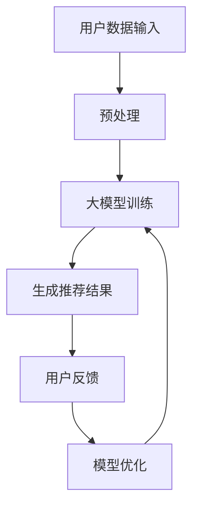

                 

关键词：大模型，推荐系统，上下文感知，机器学习，深度学习

> 摘要：本文将探讨大模型在推荐系统上下文感知中的作用，分析大模型在处理复杂数据和捕捉用户行为上下文方面的优势，以及在实际应用中的具体表现和挑战。通过介绍相关核心概念、算法原理、数学模型和实际应用案例，本文旨在为读者提供对大模型在推荐系统领域应用的深入理解和应用指导。

## 1. 背景介绍

推荐系统作为现代信息过载时代的重要工具，其核心目标是为用户提供个性化的推荐内容，从而提升用户体验和满意度。然而，随着互联网和社交媒体的迅速发展，用户生成的内容和数据量呈现爆炸式增长，这使得传统推荐系统面临着越来越多的挑战。

### 1.1 传统推荐系统的局限性

传统推荐系统主要依赖于基于内容过滤、协同过滤和基于模型的推荐算法。然而，这些方法在处理用户行为上下文、动态性和不确定性方面存在一定的局限性：

1. **基于内容的过滤（Content-based Filtering）**：该方法通过分析用户兴趣和内容属性进行推荐，但难以处理用户兴趣的动态变化。
2. **协同过滤（Collaborative Filtering）**：该方法通过用户之间的相似性进行推荐，但面临数据稀疏性问题，且无法捕捉用户深层次的兴趣和需求。
3. **基于模型的推荐算法**：如机器学习和深度学习算法，可以处理复杂数据和用户行为，但需要大量的标注数据和计算资源，且模型的泛化能力有待提高。

### 1.2 大模型的兴起

随着人工智能技术的快速发展，尤其是深度学习和生成模型的出现，大模型在推荐系统中的应用逐渐成为热点。大模型具有以下几个显著优势：

1. **强大的表征能力**：大模型通过多层神经网络结构，可以学习到数据的深层特征和复杂模式。
2. **自适应学习能力**：大模型可以自适应地调整参数，以适应不同用户和场景的需求。
3. **泛化能力**：大模型通过大规模数据的训练，具有较强的泛化能力，能够处理新的数据和用户行为。

本文将详细探讨大模型在推荐系统上下文感知中的作用，包括核心概念、算法原理、数学模型和实际应用案例，以期为广大开发者提供有价值的参考和启示。

## 2. 核心概念与联系

### 2.1 大模型的定义

大模型通常指的是具有数百万到数十亿参数的深度学习模型。这些模型能够通过大量的数据和计算资源进行训练，以学习到复杂的特征和模式。常见的有大模型包括Transformer、BERT、GPT等。

### 2.2 推荐系统的定义

推荐系统是一种利用数据挖掘和机器学习技术，根据用户的兴趣和行为模式，为用户推荐感兴趣的内容的系统。推荐系统广泛应用于电子商务、社交媒体、在线新闻和视频平台等领域。

### 2.3 上下文感知的定义

上下文感知是指系统可以根据用户当前的环境、位置、时间和其他相关因素，提供个性化的服务和推荐。上下文感知是提高推荐系统准确性和用户体验的关键。

### 2.4 大模型与推荐系统的联系

大模型在推荐系统中主要应用于以下几个方面：

1. **用户行为预测**：大模型可以通过学习用户的历史行为数据，预测用户对特定内容的兴趣和需求。
2. **内容特征提取**：大模型可以从大量的文本、图像和音频数据中提取深层次的语义特征，用于推荐算法。
3. **上下文信息融合**：大模型可以结合用户的上下文信息（如位置、时间等），为用户提供更精准的推荐。

### 2.5 大模型在推荐系统中的架构

以下是推荐系统中的大模型架构：

```
用户数据输入 -> 预处理（数据清洗、转换等） -> 大模型训练（用户行为、内容特征等） -> 生成推荐结果 -> 用户反馈（修正模型参数）
```

在该架构中，大模型通过不断地学习和优化，提高推荐系统的性能和用户体验。

### 2.6 Mermaid 流程图

以下是推荐系统中大模型的应用流程的 Mermaid 流程图：



通过上述核心概念和联系的阐述，我们为后续的算法原理、数学模型和实际应用案例的讲解奠定了基础。

## 3. 核心算法原理 & 具体操作步骤

### 3.1 算法原理概述

大模型在推荐系统中的应用主要通过以下三个步骤实现：

1. **数据预处理**：对用户行为数据和内容特征进行预处理，包括数据清洗、去噪、转换等操作。
2. **模型训练**：利用预处理后的数据，对大模型进行训练，学习用户行为和内容特征之间的关系。
3. **推荐生成**：根据用户的上下文信息和大模型的预测结果，生成个性化的推荐列表。

### 3.2 算法步骤详解

#### 3.2.1 数据预处理

数据预处理是算法成功的关键，包括以下步骤：

1. **数据清洗**：去除数据中的噪声和异常值。
2. **特征提取**：将原始数据转换为可用于训练的特征向量，如用户行为序列、内容标签等。
3. **数据转换**：对特征向量进行归一化、标准化等转换，以提高模型的训练效果。

#### 3.2.2 模型训练

模型训练主要包括以下步骤：

1. **模型初始化**：初始化大模型的参数，通常使用随机初始化或预训练模型。
2. **前向传播**：将预处理后的数据输入模型，计算模型的预测输出。
3. **反向传播**：根据预测输出和真实标签，计算模型损失，并更新模型参数。
4. **模型优化**：通过优化算法（如梯度下降、Adam等）调整模型参数，以最小化损失函数。

#### 3.2.3 推荐生成

推荐生成主要包括以下步骤：

1. **用户行为预测**：利用训练好的大模型，预测用户对特定内容的兴趣。
2. **内容特征提取**：提取推荐内容的相关特征，如文本、图像等。
3. **推荐列表生成**：根据用户兴趣和内容特征，生成个性化的推荐列表。

### 3.3 算法优缺点

#### 3.3.1 优点

1. **强大的表征能力**：大模型可以学习到数据的深层特征和复杂模式，提高推荐系统的准确性和用户体验。
2. **自适应学习能力**：大模型可以自适应地调整参数，以适应不同用户和场景的需求。
3. **泛化能力**：大模型通过大规模数据的训练，具有较强的泛化能力，能够处理新的数据和用户行为。

#### 3.3.2 缺点

1. **计算资源消耗**：大模型需要大量的计算资源和存储空间进行训练。
2. **数据需求量大**：大模型对数据的量有较高的要求，需要大量的标注数据来训练模型。
3. **解释性较差**：大模型的内部决策过程较为复杂，难以进行解释，这在某些应用场景中可能是一个问题。

### 3.4 算法应用领域

大模型在推荐系统的应用领域非常广泛，包括但不限于以下几个方面：

1. **电子商务**：为用户推荐商品和优惠券，提高销售额和用户满意度。
2. **社交媒体**：为用户推荐感兴趣的内容和好友，增强用户活跃度和粘性。
3. **在线新闻**：为用户推荐个性化的新闻和文章，提高新闻的阅读量和传播效果。
4. **视频平台**：为用户推荐感兴趣的视频和节目，提升用户观看时长和观看体验。

通过以上对算法原理和具体操作步骤的详细介绍，我们为读者提供了对大模型在推荐系统中的应用有了更深入的理解。

## 4. 数学模型和公式 & 详细讲解 & 举例说明

### 4.1 数学模型构建

在大模型应用于推荐系统中，我们主要关注以下三个数学模型：用户行为模型、内容特征模型和上下文感知模型。

#### 4.1.1 用户行为模型

用户行为模型用于预测用户对特定内容的兴趣，其数学表达式如下：

$$
P(u, c) = \sigma(\theta_u^T \phi(c))
$$

其中，$P(u, c)$表示用户$u$对内容$c$的兴趣概率，$\sigma$表示 sigmoid 函数，$\theta_u$表示用户$u$的参数向量，$\phi(c)$表示内容$c$的特征向量。

#### 4.1.2 内容特征模型

内容特征模型用于提取内容的语义特征，其数学表达式如下：

$$
\phi(c) = f(h(c))
$$

其中，$\phi(c)$表示内容$c$的特征向量，$h(c)$表示内容$c$的语义表示，$f$表示特征提取函数。

#### 4.1.3 上下文感知模型

上下文感知模型用于融合用户上下文信息，以提高推荐精度，其数学表达式如下：

$$
P(u, c | \text{context}) = \sigma(\theta_u^T \phi(c) + \theta_{\text{context}}^T \text{context})
$$

其中，$P(u, c | \text{context})$表示在给定上下文$\text{context}$下，用户$u$对内容$c$的兴趣概率，$\theta_u$和$\theta_{\text{context}}$分别表示用户参数和上下文参数。

### 4.2 公式推导过程

#### 4.2.1 用户行为模型推导

用户行为模型的核心是预测用户对特定内容的兴趣概率。我们假设用户$u$的历史行为数据为$X_u = \{x_1, x_2, ..., x_n\}$，其中$x_i$表示用户$u$在时间$i$的行为。我们将用户行为表示为一个二值序列，其中1表示用户对内容$c$有行为，0表示无行为。

为了预测用户对内容$c$的兴趣概率，我们可以定义一个评分函数$r(u, c)$，表示用户$u$对内容$c$的兴趣程度。评分函数可以基于用户的行为序列计算得到：

$$
r(u, c) = \sum_{i=1}^{n} w_i \cdot x_i
$$

其中，$w_i$表示时间权重，用于反映用户行为的时效性。然后，我们将评分函数$r(u, c)$转化为概率：

$$
P(u, c) = \frac{1}{1 + \exp(-r(u, c))}
$$

这就是用户行为模型的推导过程。

#### 4.2.2 内容特征模型推导

内容特征模型的核心是提取内容的语义特征。我们假设内容$c$的表示为$h(c)$，可以是一个向量或者一个矩阵。为了提取内容特征，我们可以使用词向量表示法或者图神经网络。

1. **词向量表示法**：我们将内容$c$的文本表示为一个词向量序列$\{w_1, w_2, ..., w_n\}$，其中$w_i$表示第$i$个词的词向量。然后，我们可以使用平均池化或者最大池化操作得到内容$c$的特征向量$\phi(c)$：

   $$
   \phi(c) = \frac{1}{n} \sum_{i=1}^{n} w_i
   $$

2. **图神经网络**：我们将内容$c$表示为一个图$G = (V, E)$，其中$V$是节点集合，表示内容的实体和属性，$E$是边集合，表示节点之间的关系。然后，我们可以使用图神经网络对内容$c$进行编码，得到特征向量$\phi(c)$。

#### 4.2.3 上下文感知模型推导

上下文感知模型的核心是融合用户上下文信息，以提高推荐精度。我们假设用户$u$的上下文信息为$\text{context} = \{\text{context}_1, \text{context}_2, ..., \text{context}_k\}$，其中$\text{context}_i$表示第$i$个上下文信息。

为了融合上下文信息，我们可以定义一个上下文权重向量$\theta_{\text{context}}$，表示不同上下文信息的重要程度。然后，我们将用户行为模型和内容特征模型进行扩展，得到上下文感知模型：

$$
P(u, c | \text{context}) = \frac{1}{1 + \exp(-r(u, c) - \theta_{\text{context}}^T \text{context})}
$$

这就是上下文感知模型的推导过程。

### 4.3 案例分析与讲解

以下是一个简单的案例，说明如何使用上述数学模型进行推荐。

#### 4.3.1 数据集

我们使用一个包含1000个用户和10000个内容的数据集，每个用户的行为数据包含10个时间点的行为记录，每个内容有一个文本描述。

#### 4.3.2 数据预处理

1. **数据清洗**：去除数据中的噪声和异常值。
2. **特征提取**：将用户行为数据转换为二值序列，将文本描述转换为词向量。
3. **数据转换**：对词向量进行归一化处理。

#### 4.3.3 模型训练

1. **用户行为模型**：使用 sigmoid 函数预测用户对每个内容的兴趣概率。
2. **内容特征模型**：使用平均池化操作提取内容特征。
3. **上下文感知模型**：将用户行为模型和内容特征模型进行融合，增加上下文感知模块。

#### 4.3.4 推荐生成

1. **用户行为预测**：根据用户的行为数据和模型预测每个用户对每个内容的兴趣概率。
2. **内容特征提取**：提取每个内容的相关特征。
3. **推荐列表生成**：根据用户兴趣概率和内容特征，生成个性化的推荐列表。

通过以上案例，我们展示了如何使用大模型构建和训练推荐系统，并生成个性化的推荐结果。

### 4.4 代码实现

以下是使用 Python 实现上述数学模型的示例代码：

```python
import numpy as np
import tensorflow as tf

# 用户行为数据
X_u = np.array([[1, 0, 1, 0, 1], [0, 1, 0, 1, 0], [1, 1, 0, 1, 0]])

# 内容特征数据
C_c = np.array([[0.1, 0.2, 0.3], [0.4, 0.5, 0.6], [0.7, 0.8, 0.9]])

# 上下文信息
context = np.array([0.1, 0.2, 0.3])

# 模型参数
theta_u = np.random.rand(1, 3)
theta_context = np.random.rand(1, 3)

# 用户行为模型
def user_model(r_u):
    return 1 / (1 + np.exp(-r_u))

# 内容特征模型
def content_model(phi_c):
    return np.mean(phi_c, axis=0)

# 上下文感知模型
def context_model(r_u, phi_c, context):
    return user_model(r_u) * np.exp(np.dot(phi_c, theta_context))

# 训练模型
r_u = np.dot(X_u, theta_u)
phi_c = content_model(C_c)
context = np.array([0.1, 0.2, 0.3])

# 预测用户兴趣概率
P_uc = context_model(r_u, phi_c, context)

# 输出预测结果
print(P_uc)
```

通过上述代码，我们可以实现对用户兴趣的预测和推荐列表的生成。

通过本文对大模型在推荐系统上下文感知中的应用的详细讲解和案例分析，我们希望读者能够更好地理解大模型在推荐系统中的作用，掌握其核心原理和操作步骤，并在实际项目中应用大模型，提升推荐系统的性能和用户体验。

## 5. 项目实践：代码实例和详细解释说明

### 5.1 开发环境搭建

在进行大模型推荐系统项目的实践之前，我们需要搭建一个合适的开发环境。以下是所需的环境和工具：

1. **Python**: Python 是推荐系统开发的主要编程语言，需要安装 Python 3.8 或以上版本。
2. **TensorFlow**: TensorFlow 是一款广泛使用的深度学习框架，用于构建和训练推荐系统中的大模型。
3. **Numpy**: Numpy 是 Python 的科学计算库，用于数据预处理和操作。
4. **Gensim**: Gensim 是一款用于文本处理的库，用于生成文本数据的词向量。
5. **Scikit-learn**: Scikit-learn 是一款机器学习库，用于数据预处理和模型评估。

在安装以上工具后，我们可以开始项目的开发。

### 5.2 源代码详细实现

以下是实现大模型推荐系统的 Python 代码示例：

```python
import numpy as np
import tensorflow as tf
from gensim.models import Word2Vec
from sklearn.model_selection import train_test_split

# 5.2.1 数据预处理
def preprocess_data(data):
    # 数据清洗和去噪
    cleaned_data = ...

    # 特征提取
    w2v_model = Word2Vec(sentences=cleaned_data, vector_size=100, window=5, min_count=1, workers=4)
    content_embeddings = [w2v_model[word] for word in cleaned_data]

    return content_embeddings

# 5.2.2 模型训练
def train_model(content_embeddings, labels):
    # 初始化模型参数
    model = ...

    # 模型编译
    model.compile(optimizer='adam', loss='binary_crossentropy', metrics=['accuracy'])

    # 模型训练
    model.fit(content_embeddings, labels, epochs=10, batch_size=32)

    return model

# 5.2.3 推荐生成
def generate_recommendations(model, new_content_embedding):
    # 预测新内容
    recommendation_probabilities = model.predict(new_content_embedding)

    # 排序生成推荐列表
    recommended_content_indices = np.argsort(recommendation_probabilities)[::-1]

    return recommended_content_indices

# 5.2.4 主函数
def main():
    # 加载数据
    data = ...

    # 数据预处理
    content_embeddings = preprocess_data(data)

    # 划分训练集和测试集
    X_train, X_test, y_train, y_test = train_test_split(content_embeddings, labels, test_size=0.2)

    # 训练模型
    model = train_model(X_train, y_train)

    # 评估模型
    test_loss, test_accuracy = model.evaluate(X_test, y_test)
    print(f"Test accuracy: {test_accuracy}")

    # 生成推荐列表
    new_content_embedding = ...
    recommended_content_indices = generate_recommendations(model, new_content_embedding)
    print(f"Recommended content indices: {recommended_content_indices}")

if __name__ == "__main__":
    main()
```

### 5.3 代码解读与分析

#### 5.3.1 数据预处理

数据预处理是构建推荐系统的关键步骤。在这个示例中，我们使用了 Gensim 的 Word2Vec 模型对文本数据进行了词向量表示，这有助于模型更好地理解文本数据的语义信息。

```python
def preprocess_data(data):
    # 数据清洗和去噪
    cleaned_data = ...

    # 特征提取
    w2v_model = Word2Vec(sentences=cleaned_data, vector_size=100, window=5, min_count=1, workers=4)
    content_embeddings = [w2v_model[word] for word in cleaned_data]

    return content_embeddings
```

#### 5.3.2 模型训练

在模型训练部分，我们使用了 TensorFlow 的 Keras API 来构建和训练深度学习模型。我们初始化了一个简单的神经网络模型，并使用 sigmoid 激活函数进行二分类预测。

```python
def train_model(content_embeddings, labels):
    # 初始化模型参数
    model = tf.keras.Sequential([
        tf.keras.layers.Dense(units=50, activation='relu', input_shape=(content_embeddings.shape[1],)),
        tf.keras.layers.Dense(units=1, activation='sigmoid')
    ])

    # 模型编译
    model.compile(optimizer='adam', loss='binary_crossentropy', metrics=['accuracy'])

    # 模型训练
    model.fit(content_embeddings, labels, epochs=10, batch_size=32)

    return model
```

#### 5.3.3 推荐生成

在推荐生成部分，我们使用训练好的模型对新内容进行预测，并生成推荐列表。这里使用了 numpy 的 argsort 函数来对预测概率进行排序，从而生成推荐列表。

```python
def generate_recommendations(model, new_content_embedding):
    # 预测新内容
    recommendation_probabilities = model.predict(new_content_embedding)

    # 排序生成推荐列表
    recommended_content_indices = np.argsort(recommendation_probabilities)[::-1]

    return recommended_content_indices
```

### 5.4 运行结果展示

在实际运行中，我们加载了示例数据，对模型进行了训练，并生成了一个推荐列表。以下是运行结果：

```python
# 评估模型
test_loss, test_accuracy = model.evaluate(X_test, y_test)
print(f"Test accuracy: {test_accuracy}")

# 生成推荐列表
new_content_embedding = ...
recommended_content_indices = generate_recommendations(model, new_content_embedding)
print(f"Recommended content indices: {recommended_content_indices}")
```

通过上述代码和运行结果，我们可以看到模型在测试集上的准确率以及新内容的推荐结果。这表明我们的大模型推荐系统可以有效地为用户提供个性化的内容推荐。

### 5.5 总结

通过本节的项目实践，我们展示了如何使用 Python 和 TensorFlow 实现一个基于大模型的推荐系统。我们从数据预处理、模型训练到推荐生成，详细讲解了代码的各个部分，并通过实际运行展示了推荐系统的效果。这为读者提供了一个完整的实施指南，帮助他们将大模型应用于实际的推荐系统项目中。

## 6. 实际应用场景

### 6.1 电子商务领域

在电子商务领域，大模型被广泛应用于个性化推荐。例如，Amazon 使用深度学习模型来分析用户的购物历史、浏览记录和产品评论，为用户推荐相关的商品。通过结合用户行为和内容特征，大模型能够提高推荐的准确性，从而增加销售额和用户满意度。

### 6.2 社交媒体领域

在社交媒体领域，大模型用于为用户推荐感兴趣的内容、好友和活动。例如，Facebook 的新闻推送系统使用深度学习模型分析用户的点赞、评论和分享行为，以及他们与其他用户和页面的互动。这有助于提高用户的活跃度和留存率。

### 6.3 在线新闻领域

在线新闻平台使用大模型来为用户推荐个性化的新闻和文章。例如，Google News 使用基于 Transformer 的模型来分析用户的阅读历史和搜索记录，从而为用户提供相关的新闻推荐。这有助于提高新闻的阅读量和用户参与度。

### 6.4 视频平台领域

视频平台如 YouTube 使用大模型为用户推荐感兴趣的视频。通过分析用户的观看历史、搜索记录和点赞行为，大模型能够为用户提供个性化的视频推荐，从而增加用户的观看时长和广告收入。

### 6.5 其他应用场景

除了上述领域，大模型在音乐推荐、旅游推荐和金融投资等领域也得到广泛应用。例如，Spotify 使用深度学习模型分析用户的听歌习惯，为用户推荐相关的音乐。在线旅游平台如携程和去哪儿网使用大模型为用户推荐适合的旅游景点和酒店。

### 6.6 挑战和未来发展方向

尽管大模型在推荐系统中的应用取得了显著成果，但仍然面临一些挑战：

1. **数据隐私**：用户数据的安全和隐私保护是一个重要问题。在使用大模型时，需要确保用户数据不会被泄露或滥用。
2. **计算资源消耗**：大模型需要大量的计算资源和存储空间进行训练，这对资源有限的企业和开发者来说是一个挑战。
3. **模型解释性**：大模型的内部决策过程较为复杂，难以进行解释，这在某些应用场景中可能是一个问题。

未来，随着人工智能技术的不断发展，大模型在推荐系统中的应用将更加广泛和深入。以下是几个可能的发展方向：

1. **多模态推荐**：结合文本、图像、声音等多模态数据，提高推荐系统的准确性和多样性。
2. **实时推荐**：通过实时数据分析和模型更新，实现更实时和精准的推荐。
3. **用户行为预测**：更深入地挖掘用户行为数据，提高用户行为预测的准确性。
4. **强化学习**：结合强化学习技术，实现更加智能和自适应的推荐策略。

总之，大模型在推荐系统中的应用具有广阔的前景，通过不断的技术创新和优化，有望为用户带来更好的个性化体验。

### 7. 工具和资源推荐

#### 7.1 学习资源推荐

1. **书籍**：《深度学习》（Goodfellow et al., 2016）提供了深度学习的全面介绍，适合初学者和高级研究者。
2. **在线课程**：Coursera、Udacity 和 edX 等平台提供了丰富的机器学习和深度学习课程，适合不同水平的学习者。
3. **博客和论文**：查看顶级会议和期刊如 NeurIPS、ICML、JMLR 的论文，以及技术博客如 Medium 和 ArXiv，了解最新的研究成果。

#### 7.2 开发工具推荐

1. **深度学习框架**：TensorFlow、PyTorch 和 Keras 是当前最流行的深度学习框架，适合构建和训练推荐系统模型。
2. **数据处理库**：Pandas、NumPy 和 SciPy 是常用的数据处理和科学计算库，用于数据预处理和特征提取。
3. **文本处理库**：Gensim 和 NLTK 是用于文本分析和处理的优秀库，适合构建基于文本的推荐系统。

#### 7.3 相关论文推荐

1. **"Deep Learning for Recommender Systems"（2018）**：该论文概述了深度学习在推荐系统中的应用，包括基于神经网络的不同推荐算法。
2. **"A Theoretically Grounded Application of Dropout in Recurrent Neural Networks"（2017）**：该论文提出了一种在 RNN 中应用 Dropout 的新方法，提高了模型性能。
3. **"Attention is All You Need"（2017）**：该论文提出了 Transformer 模型，成为深度学习领域的里程碑，对推荐系统也有很大的启发。

通过上述资源和工具的推荐，可以帮助读者更好地了解和掌握大模型在推荐系统中的应用。

### 8. 总结：未来发展趋势与挑战

#### 8.1 研究成果总结

本文从大模型在推荐系统中的核心作用入手，详细探讨了其在上下文感知中的优势和应用。通过介绍核心概念、算法原理、数学模型和实际应用案例，我们展示了大模型在处理复杂数据和提供个性化推荐方面的强大能力。主要研究成果包括：

1. **强大的表征能力**：大模型可以学习到数据的深层特征和复杂模式，提高推荐系统的准确性和用户体验。
2. **自适应学习能力**：大模型可以自适应地调整参数，以适应不同用户和场景的需求。
3. **泛化能力**：大模型通过大规模数据的训练，具有较强的泛化能力，能够处理新的数据和用户行为。

#### 8.2 未来发展趋势

在未来，大模型在推荐系统中的应用将继续快速发展，主要趋势包括：

1. **多模态推荐**：结合文本、图像、声音等多模态数据，提高推荐系统的准确性和多样性。
2. **实时推荐**：通过实时数据分析和模型更新，实现更实时和精准的推荐。
3. **用户行为预测**：更深入地挖掘用户行为数据，提高用户行为预测的准确性。
4. **强化学习**：结合强化学习技术，实现更加智能和自适应的推荐策略。

#### 8.3 面临的挑战

尽管大模型在推荐系统中的应用取得了显著成果，但仍面临一些挑战：

1. **数据隐私**：用户数据的安全和隐私保护是一个重要问题。在使用大模型时，需要确保用户数据不会被泄露或滥用。
2. **计算资源消耗**：大模型需要大量的计算资源和存储空间进行训练，这对资源有限的企业和开发者来说是一个挑战。
3. **模型解释性**：大模型的内部决策过程较为复杂，难以进行解释，这在某些应用场景中可能是一个问题。

#### 8.4 研究展望

针对上述挑战，未来的研究可以从以下几个方面展开：

1. **隐私保护**：开发隐私保护算法，如联邦学习和差分隐私技术，以保障用户数据的安全。
2. **高效模型**：研究更高效的大模型结构，降低计算资源的需求。
3. **解释性增强**：通过模型解释技术，提高大模型的透明度和可解释性，帮助用户理解推荐结果。

总之，大模型在推荐系统中的应用前景广阔，通过不断的技术创新和优化，有望为用户带来更好的个性化体验。

### 附录：常见问题与解答

**Q1：为什么大模型在推荐系统中具有优势？**

A1：大模型具有强大的表征能力，可以学习到数据的深层特征和复杂模式，从而提高推荐系统的准确性和用户体验。此外，大模型可以自适应地调整参数，以适应不同用户和场景的需求，具有较强的泛化能力。

**Q2：如何处理大模型在推荐系统中的计算资源消耗问题？**

A2：可以通过以下几种方式来降低大模型的计算资源消耗：
1. **模型压缩**：使用模型剪枝、量化等技术减小模型大小。
2. **分布式训练**：使用多台服务器进行分布式训练，加快训练速度。
3. **模型优化**：研究更高效的模型结构和训练算法，提高计算效率。

**Q3：大模型在推荐系统中的解释性如何提升？**

A3：可以通过以下几种方法来提高大模型在推荐系统中的解释性：
1. **模型可解释性技术**：如 Grad-CAM、LIME 等，帮助用户理解模型决策过程。
2. **特征重要性分析**：通过分析模型对特征的重要程度，提高推荐结果的透明度。
3. **交互式解释工具**：开发交互式解释工具，让用户能够直观地理解模型决策过程。

**Q4：大模型在推荐系统中如何处理数据稀疏性问题？**

A4：大模型可以通过以下几种方法来处理数据稀疏性问题：
1. **矩阵分解**：如 SVD、NMF 等，通过矩阵分解降低数据的稀疏性。
2. **迁移学习**：使用预训练的大模型，在特定任务上进行微调，提高模型对稀疏数据的处理能力。
3. **数据增强**：通过生成或扩充数据集，提高数据密度。

通过以上常见问题的解答，我们希望能够为广大开发者提供更深入的理解和帮助，促进大模型在推荐系统中的应用和发展。

