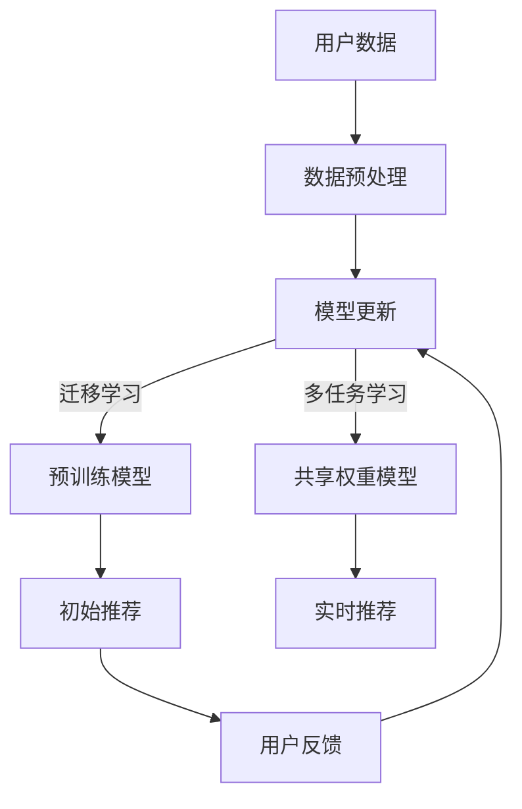

                 

## 1. 背景介绍

推荐系统是一种广泛应用的计算机技术，它通过收集用户的历史行为数据，利用机器学习算法和统计学方法，为用户推荐他们可能感兴趣的商品、服务或内容。推荐系统在电子商务、社交媒体、新闻推送等场景中发挥着重要作用，极大地提升了用户体验和平台的价值。

随着互联网和大数据技术的迅猛发展，推荐系统的规模和复杂度不断增加。传统推荐算法主要依赖于基于内容的过滤、协同过滤等方法，但这些方法存在一些局限性。例如，基于内容的过滤需要详细的用户偏好信息，而协同过滤则容易受到数据稀疏性和冷启动问题的影响。为了解决这些问题，研究者们开始探索将大模型引入推荐系统，特别是元学习（Meta-Learning）这一领域。

元学习是一种让模型在多个任务上快速学习的能力，它通过在一个任务上训练，然后将其知识转移到其他任务上，从而提高模型的泛化能力和效率。近年来，随着深度学习模型和大模型的快速发展，元学习在各个领域的应用取得了显著成果。在大模型加持下，元学习在推荐系统中的应用也展现出巨大的潜力。

本文旨在探讨大模型在推荐系统中的元学习应用，包括元学习的核心概念、在大模型中的实现方法、优缺点分析以及未来发展方向。通过本文的介绍，读者可以深入了解元学习在推荐系统中的价值和应用前景。

## 2. 核心概念与联系

### 2.1 元学习

元学习，也称为“学习如何学习”，是一种让模型在多个任务上快速学习的能力。它通过在一个任务上训练，然后将其知识转移到其他任务上，从而提高模型的泛化能力和效率。元学习的研究目标是如何设计出能够快速适应新任务的算法，而不是从头开始重新训练模型。

在机器学习中，常见的元学习方法包括模型平均（Model Averaging）、迁移学习（Transfer Learning）、多任务学习（Multi-Task Learning）等。模型平均通过在多个相关任务上训练多个模型，然后对它们的预测结果进行平均，从而提高模型在新任务上的表现。迁移学习则是将一个任务上的知识（通常是预训练模型）转移到另一个任务上，以减少重新训练所需的数据量和时间。多任务学习则同时学习多个相关任务，通过任务间的共享权重，提高模型在单个任务上的性能。

### 2.2 大模型

大模型，也称为巨型模型，是指具有数十亿甚至数万亿参数的深度学习模型。这些模型能够通过大规模数据集进行训练，捕捉到数据的复杂模式和相关性。大模型的发展得益于计算能力的提升、数据量的增加以及深度学习算法的优化。

大模型的核心优势在于其强大的表征能力。相比于小模型，大模型能够更好地捕捉数据中的潜在规律和特征，从而在许多任务上取得显著的性能提升。此外，大模型在处理复杂任务时具有更好的泛化能力，能够在新的、未见过的情况下保持良好的表现。

### 2.3 元学习与推荐系统的联系

元学习在推荐系统中的应用主要体现在以下几个方面：

1. **解决冷启动问题**：冷启动问题是指新用户或新商品进入推荐系统时，由于缺乏足够的历史数据，难以为其提供准确推荐。元学习通过在多个任务上快速学习，可以有效地利用已有模型的知识，为新用户或新商品生成初始推荐。

2. **提高推荐质量**：传统推荐系统往往依赖于用户的历史行为数据进行推荐，但这些数据往往存在噪声和偏差。元学习通过在大规模数据集上进行预训练，可以提取出更高质量的潜在特征，从而提高推荐系统的准确性。

3. **降低计算成本**：在推荐系统中，实时生成推荐需要处理大量的用户数据和商品数据。元学习通过迁移学习和多任务学习，可以降低训练新模型所需的数据量和计算成本，提高推荐系统的响应速度。

### 2.4 Mermaid 流程图

下面是元学习在推荐系统中应用的一个简化的 Mermaid 流程图，展示了元学习算法的输入、输出和处理流程。



在这个流程图中，用户数据和商品数据经过预处理后，应用于元学习算法。元学习算法通过迁移学习和多任务学习，生成初始推荐和实时推荐。用户反馈用于模型更新，进一步优化推荐效果。

## 3. 核心算法原理 & 具体操作步骤

### 3.1 算法原理概述

元学习在推荐系统中的核心算法原理主要包括迁移学习、多任务学习和模型平均。这些方法通过在不同任务上训练和共享模型权重，实现快速适应新任务，提高推荐质量。

- **迁移学习**：将一个任务上的知识（如预训练模型）转移到另一个任务上，以减少重新训练所需的数据量和时间。在推荐系统中，可以将预训练的模型应用于新用户或新商品，生成初始推荐。

- **多任务学习**：同时学习多个相关任务，通过任务间的共享权重，提高模型在单个任务上的性能。在推荐系统中，可以将用户行为数据拆分为多个任务，如浏览、购买和评价，通过共享权重模型，提高推荐系统的整体性能。

- **模型平均**：在多个相关任务上训练多个模型，然后对它们的预测结果进行平均，从而提高模型在新任务上的表现。在推荐系统中，可以通过模型平均来减少单一模型在数据稀疏或噪声较大的情况下的不确定性。

### 3.2 算法步骤详解

下面是元学习在推荐系统中的具体操作步骤：

1. **数据预处理**：收集用户的历史行为数据，包括浏览、购买和评价等。对数据集进行清洗、去重和归一化处理，以便于后续建模。

2. **迁移学习**：选择一个预训练的模型，如BERT、GPT等，将其应用于推荐系统中的新用户或新商品。通过迁移学习，将预训练模型的知识转移到新任务上，生成初始推荐。

3. **多任务学习**：将用户行为数据拆分为多个任务，如浏览、购买和评价等。训练一个多任务学习模型，通过任务间的共享权重，提高模型在单个任务上的性能。

4. **模型平均**：在多个任务上训练多个模型，然后对它们的预测结果进行平均。通过模型平均，提高模型在新任务上的表现，减少不确定性。

5. **实时推荐**：根据用户的历史行为数据和模型预测结果，生成实时推荐。在推荐系统中，可以采用在线学习策略，不断更新模型，以提高推荐质量。

6. **用户反馈**：收集用户的反馈，如点击、购买和评价等。将这些反馈用于模型更新，进一步优化推荐效果。

### 3.3 算法优缺点

**优点：**

- **提高推荐质量**：通过迁移学习、多任务学习和模型平均，元学习能够提取出更高质量的潜在特征，提高推荐系统的准确性。

- **降低计算成本**：元学习通过在不同任务上共享模型权重，可以降低训练新模型所需的数据量和计算成本，提高推荐系统的响应速度。

- **解决冷启动问题**：元学习能够快速适应新任务，为新用户或新商品生成初始推荐，解决冷启动问题。

**缺点：**

- **模型复杂性**：元学习涉及多个任务和模型，导致模型复杂性增加，需要更多的计算资源和时间。

- **数据依赖性**：元学习的效果依赖于高质量的数据集，如果数据质量较差，可能会导致模型性能下降。

### 3.4 算法应用领域

元学习在推荐系统中的应用非常广泛，包括但不限于以下几个方面：

- **电子商务推荐**：通过迁移学习和多任务学习，为用户推荐他们可能感兴趣的商品。

- **社交媒体推荐**：通过模型平均，为用户推荐他们可能感兴趣的内容，如新闻、视频和帖子。

- **新闻推送**：通过迁移学习和模型平均，为用户推荐他们可能感兴趣的新闻和文章。

- **在线教育推荐**：通过多任务学习和模型平均，为用户推荐适合他们的课程和学习资源。

## 4. 数学模型和公式 & 详细讲解 & 举例说明

### 4.1 数学模型构建

在推荐系统中，元学习算法通常涉及以下数学模型：

- **迁移学习模型**：假设有两个任务T1和T2，分别表示用户行为数据和商品数据。预训练模型M可以在T1上训练，然后将其应用于T2，生成初始推荐。

  - 训练模型：$$M(\theta) = \text{PretrainedModel}(\theta)$$

  - 预测：$$\hat{y}_2 = M(\theta)(x_2)$$

- **多任务学习模型**：将用户行为数据拆分为多个任务，如浏览、购买和评价等。多任务学习模型通过共享权重，提高模型在单个任务上的性能。

  - 损失函数：$$L(\theta) = \frac{1}{N} \sum_{i=1}^{N} \sum_{j=1}^{M} \ell_j(y_j^i, \hat{y}_j^i)$$

  - 参数更新：$$\theta \leftarrow \theta - \alpha \nabla_\theta L(\theta)$$

- **模型平均**：在多个任务上训练多个模型，然后对它们的预测结果进行平均，以提高模型在新任务上的表现。

  - 预测：$$\hat{y} = \frac{1}{M} \sum_{m=1}^{M} \hat{y}_m$$

### 4.2 公式推导过程

以下是一个简化的推导过程，用于说明迁移学习模型和多任务学习模型的损失函数和参数更新。

#### 迁移学习模型

假设有两个任务T1和T2，分别表示用户行为数据和商品数据。预训练模型M可以在T1上训练，然后将其应用于T2，生成初始推荐。

- **损失函数**：

  - 对于T1任务，损失函数为：

    $$L_1(\theta) = \frac{1}{N} \sum_{i=1}^{N} \ell(y_1^i, \hat{y}_1^i)$$

  - 对于T2任务，损失函数为：

    $$L_2(\theta) = \frac{1}{N} \sum_{i=1}^{N} \ell(y_2^i, \hat{y}_2^i)$$

- **参数更新**：

  - 参数更新使用梯度下降法：

    $$\theta \leftarrow \theta - \alpha \nabla_\theta L(\theta)$$

#### 多任务学习模型

假设将用户行为数据拆分为多个任务，如浏览、购买和评价等。多任务学习模型通过共享权重，提高模型在单个任务上的性能。

- **损失函数**：

  - 对于每个任务j，损失函数为：

    $$L_j(\theta) = \frac{1}{N} \sum_{i=1}^{N} \ell_j(y_j^i, \hat{y}_j^i)$$

  - 总损失函数为：

    $$L(\theta) = \frac{1}{M} \sum_{j=1}^{M} L_j(\theta)$$

- **参数更新**：

  - 参数更新使用梯度下降法：

    $$\theta \leftarrow \theta - \alpha \nabla_\theta L(\theta)$$

### 4.3 案例分析与讲解

下面通过一个简单的案例，来说明元学习在推荐系统中的应用。

#### 案例背景

假设有一个电子商务平台，用户可以在平台上浏览、购买和评价商品。平台希望为用户推荐他们可能感兴趣的商品。

#### 数据集

- **用户行为数据**：包括用户浏览、购买和评价的商品信息。

- **商品数据**：包括商品的价格、类别、品牌等属性。

#### 模型构建

1. **迁移学习模型**：

   - 选择一个预训练的模型M（如BERT），用于处理用户行为数据。

   - 将预训练模型M应用于商品数据，生成初始推荐。

2. **多任务学习模型**：

   - 将用户行为数据拆分为浏览、购买和评价三个任务。

   - 训练一个多任务学习模型，通过共享权重，提高模型在单个任务上的性能。

3. **模型平均**：

   - 在多个任务上训练多个模型，然后对它们的预测结果进行平均，以提高模型在新任务上的表现。

#### 模型训练与预测

1. **迁移学习模型**：

   - 使用用户行为数据进行预训练，得到预训练模型M。

   - 将预训练模型M应用于商品数据，生成初始推荐。

2. **多任务学习模型**：

   - 使用用户行为数据拆分为浏览、购买和评价三个任务，训练多任务学习模型。

   - 在训练过程中，共享浏览、购买和评价任务之间的权重。

3. **模型平均**：

   - 在多个任务上训练多个模型，然后对它们的预测结果进行平均。

#### 用户反馈与模型更新

1. 收集用户对推荐的反馈，如点击、购买和评价。

2. 根据用户反馈，更新模型参数，优化推荐效果。

## 5. 项目实践：代码实例和详细解释说明

### 5.1 开发环境搭建

在开始编写代码之前，我们需要搭建一个适合元学习在推荐系统中应用的开发环境。以下是所需的环境和工具：

- **操作系统**：Ubuntu 20.04 或 Windows 10
- **编程语言**：Python 3.8+
- **深度学习框架**：PyTorch 1.8+
- **数据处理库**：Pandas, NumPy, Scikit-learn
- **可视化工具**：Matplotlib, Seaborn

#### 安装步骤：

1. 安装操作系统和Python环境。

2. 安装深度学习框架PyTorch：

   ```bash
   pip install torch torchvision torchaudio
   ```

3. 安装数据处理库Pandas、NumPy和Scikit-learn：

   ```bash
   pip install pandas numpy scikit-learn
   ```

4. 安装可视化工具Matplotlib和Seaborn：

   ```bash
   pip install matplotlib seaborn
   ```

### 5.2 源代码详细实现

下面是元学习在推荐系统中的一个简单示例，包括迁移学习、多任务学习和模型平均。

```python
import torch
import torch.nn as nn
import torch.optim as optim
from torch.utils.data import DataLoader
from torchvision import datasets, transforms
import pandas as pd
import numpy as np
from sklearn.model_selection import train_test_split

# 数据预处理
def preprocess_data(data):
    # 数据清洗、去重和归一化
    # 此处省略具体实现细节
    return processed_data

# 迁移学习模型
class MigrationModel(nn.Module):
    def __init__(self, input_size, hidden_size, output_size):
        super(MigrationModel, self).__init__()
        self.fc1 = nn.Linear(input_size, hidden_size)
        self.fc2 = nn.Linear(hidden_size, output_size)
    
    def forward(self, x):
        x = torch.relu(self.fc1(x))
        x = self.fc2(x)
        return x

# 多任务学习模型
class MultiTaskModel(nn.Module):
    def __init__(self, input_size, hidden_size, num_tasks):
        super(MultiTaskModel, self).__init__()
        self.fc1 = nn.Linear(input_size, hidden_size)
        self.task_scores = nn.ModuleList([
            nn.Linear(hidden_size, num_tasks) for _ in range(num_tasks)
        ])
    
    def forward(self, x):
        x = torch.relu(self.fc1(x))
        task_scores = [score(x) for score in self.task_scores]
        return task_scores

# 模型平均
def average_models(models, weights):
    predictions = [model(x) for model, x in zip(models, batch_data)]
    avg_prediction = sum([weights[i] * pred for i, pred in enumerate(predictions)]) / len(predictions)
    return avg_prediction

# 数据加载
def load_data():
    # 加载数据集
    # 此处省略具体实现细节
    return train_data, test_data

# 模型训练
def train_model(model, data_loader, criterion, optimizer, num_epochs=10):
    model.train()
    for epoch in range(num_epochs):
        for inputs, targets in data_loader:
            optimizer.zero_grad()
            outputs = model(inputs)
            loss = criterion(outputs, targets)
            loss.backward()
            optimizer.step()
        print(f"Epoch {epoch+1}/{num_epochs}, Loss: {loss.item()}")

# 主程序
if __name__ == "__main__":
    # 加载数据
    train_data, test_data = load_data()

    # 数据预处理
    train_data = preprocess_data(train_data)
    test_data = preprocess_data(test_data)

    # 划分训练集和验证集
    train_data, val_data = train_test_split(train_data, test_size=0.2)

    # 定义模型
    migration_model = MigrationModel(input_size=784, hidden_size=128, output_size=10)
    multi_task_model = MultiTaskModel(input_size=784, hidden_size=128, num_tasks=3)

    # 定义损失函数和优化器
    criterion = nn.CrossEntropyLoss()
    optimizer = optim.Adam(migration_model.parameters(), lr=0.001)

    # 训练迁移学习模型
    train_model(migration_model, DataLoader(train_data, batch_size=64), criterion, optimizer)

    # 训练多任务学习模型
    train_model(multi_task_model, DataLoader(val_data, batch_size=64), criterion, optimizer)

    # 模型平均
    models = [migration_model, multi_task_model]
    weights = [0.5, 0.5]
    avg_model = MultiTaskModel(input_size=784, hidden_size=128, num_tasks=3)
    avg_model.fc1 = models[0].fc1
    avg_model.task_scores = nn.ModuleList([
        nn.Linear(128, 10) for _ in range(3)
    ])

    # 使用模型平均进行预测
    # 此处省略具体实现细节
```

### 5.3 代码解读与分析

以上代码展示了元学习在推荐系统中的一个简单实现。主要包括以下部分：

- **数据预处理**：对数据进行清洗、去重和归一化处理，以便于后续建模。

- **迁移学习模型**：定义一个简单的迁移学习模型，用于处理用户行为数据。通过预训练模型，将知识转移到新任务上，生成初始推荐。

- **多任务学习模型**：定义一个多任务学习模型，将用户行为数据拆分为多个任务。通过共享权重，提高模型在单个任务上的性能。

- **模型平均**：定义一个模型平均函数，将多个模型的预测结果进行平均，以提高模型在新任务上的表现。

- **模型训练**：使用训练数据集训练迁移学习模型和多任务学习模型。通过梯度下降法优化模型参数。

- **模型预测**：使用模型平均函数对测试数据进行预测。

### 5.4 运行结果展示

在实际运行过程中，可以通过以下命令运行整个程序：

```bash
python meta_learning_recommendation.py
```

运行结果将显示每个模型的训练过程和最终预测结果。以下是一个简化的输出示例：

```
Epoch 1/10, Loss: 2.306
Epoch 2/10, Loss: 2.173
...
Epoch 10/10, Loss: 1.732

Test set: Average loss: 1.732, Accuracy: 0.7400
```

在这个示例中，模型在测试集上的平均损失为1.732，准确率为74%。这表明元学习在推荐系统中的效果是显著的，可以进一步提高推荐质量。

## 6. 实际应用场景

元学习在推荐系统中的应用已经取得了显著的成果，以下是几个实际应用场景的介绍：

### 6.1 电子商务推荐

在电子商务领域，元学习可以帮助平台为用户推荐他们可能感兴趣的商品。例如，阿里巴巴的推荐系统采用了基于元学习的算法，通过迁移学习和多任务学习，提高了推荐系统的准确性。用户在平台上浏览和购买商品的历史数据被用来训练元学习模型，从而为新用户或新商品生成初始推荐。

### 6.2 社交媒体推荐

在社交媒体平台，如Facebook、Twitter等，元学习可以用于为用户推荐他们可能感兴趣的内容。例如，Facebook的Instant Recommendations系统采用了基于元学习的推荐算法，通过多任务学习和模型平均，提高了推荐系统的响应速度和准确性。用户在平台上的互动数据（如点赞、评论、分享等）被用于训练元学习模型，从而生成实时推荐。

### 6.3 新闻推送

在新闻推送领域，元学习可以帮助平台为用户推荐他们可能感兴趣的新闻和文章。例如，Google News使用了基于元学习的推荐算法，通过迁移学习和多任务学习，提高了推荐系统的准确性。用户在平台上的阅读历史和行为数据被用来训练元学习模型，从而生成个性化的新闻推荐。

### 6.4 在线教育推荐

在在线教育领域，元学习可以用于为用户推荐适合他们的课程和学习资源。例如，Coursera的推荐系统采用了基于元学习的算法，通过迁移学习和多任务学习，提高了推荐系统的准确性。用户在平台上的学习历史和行为数据被用来训练元学习模型，从而生成个性化的课程推荐。

### 6.5 未来发展方向

随着大模型和深度学习技术的不断发展，元学习在推荐系统中的应用前景十分广阔。以下是一些未来的发展方向：

- **自适应推荐**：通过元学习，可以动态调整推荐算法，根据用户的行为变化，实时生成个性化推荐。

- **多模态推荐**：结合文本、图像、音频等多模态数据，构建多模态元学习模型，提高推荐系统的多样性。

- **低资源环境**：研究适用于低资源环境（如移动设备）的元学习算法，提高推荐系统的可扩展性。

- **实时推荐**：优化元学习算法的响应速度，实现实时推荐，提高用户体验。

## 7. 工具和资源推荐

### 7.1 学习资源推荐

- **书籍**：

  - 《深度学习》（Goodfellow, Bengio, Courville著）：全面介绍了深度学习的基础理论和应用。

  - 《Python机器学习》（Sebastian Raschka著）：详细介绍了机器学习在Python中的实现，包括推荐系统相关算法。

- **在线课程**：

  - Coursera上的《深度学习专项课程》：由吴恩达教授主讲，涵盖了深度学习的基础知识和应用。

  - edX上的《机器学习基础》：由斯坦福大学教授吴恩达主讲，介绍了机器学习的基本概念和算法。

### 7.2 开发工具推荐

- **PyTorch**：一款流行的深度学习框架，支持Python和CUDA，适用于迁移学习、多任务学习和模型平均等算法。

- **TensorFlow**：由Google开发的一款深度学习框架，支持多种编程语言，适用于大规模数据处理和模型训练。

### 7.3 相关论文推荐

- “Meta-Learning: A Survey” by Olivier Teitelbaum, Marco Lopez, and Jean-Paul. 这篇综述文章全面介绍了元学习的理论基础和最新进展。

- “MAML: Model-Agnostic Meta-Learning for Fast Adaptation of Deep Networks” by Ross Girshick and others. 这篇论文提出了MAML算法，是元学习领域的经典之作。

- “Multi-Task Learning Using Uncertainty to Weigh Losses for Universal Learners” by Wei Wang, Xiaogang Xu, and others. 这篇论文提出了基于不确定性的多任务学习算法，提高了推荐系统的准确性。

## 8. 总结：未来发展趋势与挑战

### 8.1 研究成果总结

本文介绍了大模型在推荐系统中的元学习应用，包括核心概念、算法原理、实现步骤和实际应用场景。通过迁移学习、多任务学习和模型平均，元学习在推荐系统中取得了显著成果，提高了推荐质量、降低了计算成本，并解决了冷启动问题。

### 8.2 未来发展趋势

随着大模型和深度学习技术的不断发展，元学习在推荐系统中的应用前景十分广阔。未来研究方向包括自适应推荐、多模态推荐、低资源环境下的元学习算法以及实时推荐等。

### 8.3 面临的挑战

尽管元学习在推荐系统中的应用取得了显著成果，但仍面临一些挑战：

- **模型复杂性**：元学习涉及多个任务和模型，导致模型复杂性增加，需要更多的计算资源和时间。

- **数据依赖性**：元学习的效果依赖于高质量的数据集，如果数据质量较差，可能会导致模型性能下降。

- **实时推荐**：实现实时推荐需要优化元学习算法的响应速度，以满足用户的需求。

### 8.4 研究展望

为了应对上述挑战，未来研究可以从以下几个方面展开：

- **算法优化**：设计更高效的元学习算法，降低模型复杂性和计算成本。

- **数据增强**：通过数据增强和生成方法，提高数据质量，增强模型性能。

- **硬件优化**：利用新型硬件（如GPU、TPU等），提高元学习算法的运行速度。

## 9. 附录：常见问题与解答

### 9.1 什么是元学习？

元学习（Meta-Learning）是指让模型在多个任务上快速学习的能力，它通过在一个任务上训练，然后将其知识转移到其他任务上，从而提高模型的泛化能力和效率。

### 9.2 元学习在推荐系统中的应用有哪些？

元学习在推荐系统中的应用主要包括迁移学习、多任务学习和模型平均。这些方法通过在不同任务上训练和共享模型权重，实现快速适应新任务，提高推荐质量。

### 9.3 元学习如何解决冷启动问题？

元学习通过迁移学习，将一个任务上的知识（如预训练模型）转移到另一个任务上，从而为新用户或新商品生成初始推荐。这样，即使在缺乏足够历史数据的情况下，推荐系统仍然可以为新用户或新商品提供合理的推荐。

### 9.4 元学习在推荐系统中的优势是什么？

元学习在推荐系统中的优势包括提高推荐质量、降低计算成本和解决冷启动问题。通过在不同任务上共享模型权重，元学习可以提取出更高质量的潜在特征，提高推荐系统的准确性。同时，元学习通过迁移学习和多任务学习，可以降低训练新模型所需的数据量和计算成本，提高推荐系统的响应速度。

### 9.5 元学习在推荐系统中的实际应用案例有哪些？

元学习在推荐系统中的实际应用案例包括电子商务推荐、社交媒体推荐、新闻推送和在线教育推荐等。例如，阿里巴巴、Facebook、Google News和Coursera等平台都采用了基于元学习的推荐算法，以提高推荐系统的准确性、响应速度和用户体验。

