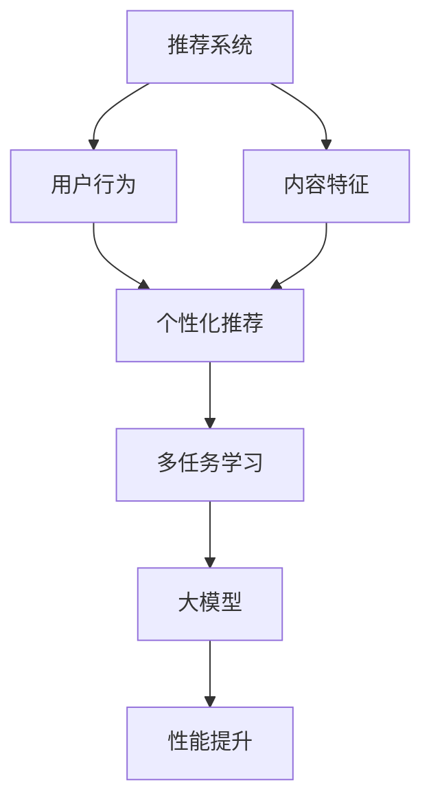

                 

关键词：大模型、推荐系统、多任务学习、机器学习、深度学习

## 摘要

随着互联网技术的迅猛发展，推荐系统已经成为现代信息检索和电子商务中的重要组成部分。大模型的引入为推荐系统带来了显著提升，但同时也提出了新的挑战。本文主要探讨大模型在推荐系统中的多任务学习方法，从核心概念到具体实践进行详细阐述。通过对多任务学习的深入分析，本文旨在为研究人员和开发者提供有价值的参考，以推动推荐系统领域的发展。

## 1. 背景介绍

### 1.1 推荐系统的概念与重要性

推荐系统是一种信息过滤技术，旨在向用户推荐其可能感兴趣的信息、产品或服务。在电子商务、社交媒体、在线视频等各个领域，推荐系统都发挥着重要作用。其主要目标是提高用户满意度、增加用户粘性和提高业务收益。

### 1.2 大模型的发展与优势

近年来，随着深度学习技术的发展，大模型（如GPT、BERT等）在自然语言处理、计算机视觉等领域取得了显著成果。大模型通过大规模数据训练，能够自动提取知识、理解语义，具有强大的表征能力和泛化能力。将大模型应用于推荐系统，有望提升推荐质量、降低冷启动问题、提高用户满意度。

### 1.3 多任务学习在推荐系统中的应用

多任务学习是一种将多个相关任务同时训练的技术。在推荐系统中，多任务学习能够同时优化多个推荐目标，如个性化推荐、排序优化、冷启动等。这不仅提高了推荐系统的整体性能，还能充分利用训练数据中的多方面信息。

## 2. 核心概念与联系

为了更好地理解大模型在推荐系统中的多任务学习方法，我们首先介绍几个核心概念，并使用Mermaid流程图展示其关系。

### 2.1 核心概念

- **大模型**：具有大规模参数、能够处理海量数据的深度学习模型。
- **推荐系统**：基于用户行为和内容特征为用户推荐感兴趣的信息或产品。
- **多任务学习**：同时训练多个相关任务，共享模型参数，提高模型性能。

### 2.2 Mermaid流程图



## 3. 核心算法原理 & 具体操作步骤

### 3.1 算法原理概述

大模型在推荐系统中的多任务学习主要基于深度神经网络，通过共享底层特征表示来同时优化多个推荐任务。其基本思想如下：

1. **特征提取**：使用大模型自动提取用户行为和内容特征。
2. **任务融合**：将多个推荐任务映射到同一特征空间，共享模型参数。
3. **优化目标**：设计联合损失函数，同时优化多个任务。

### 3.2 算法步骤详解

1. **数据预处理**：收集用户行为数据、内容数据，并进行预处理，如去噪、归一化等。
2. **特征提取**：利用大模型（如BERT、GPT等）提取用户行为和内容特征。
3. **任务定义**：定义个性化推荐、排序优化、冷启动等推荐任务。
4. **模型训练**：使用联合损失函数同时优化多个任务，如使用交叉熵损失、均方误差等。
5. **模型评估**：使用评估指标（如准确率、召回率、F1值等）评估模型性能。
6. **模型部署**：将训练好的模型部署到生产环境中，为用户提供个性化推荐。

### 3.3 算法优缺点

**优点**：

- 提高推荐质量：利用大模型的强大表征能力，提升推荐精度。
- 跨域迁移：大模型能够从不同领域迁移知识，提高跨领域推荐性能。
- 降低冷启动问题：通过多任务学习，充分利用用户历史行为和内容信息。

**缺点**：

- 计算资源消耗大：大模型训练和推理需要大量计算资源。
- 数据隐私：大模型在处理用户数据时，可能存在隐私泄露风险。

### 3.4 算法应用领域

大模型在推荐系统中的多任务学习方法已广泛应用于电子商务、社交媒体、在线视频等领域。如淘宝、微信、Netflix等平台都采用了类似的技术，实现了个性化推荐和排序优化。

## 4. 数学模型和公式

### 4.1 数学模型构建

大模型在推荐系统中的多任务学习主要基于深度神经网络，其基本架构如下：

$$
L = \frac{1}{N} \sum_{n=1}^{N} \sum_{t=1}^{T} l_t^n
$$

其中，$L$ 为总损失，$N$ 为样本数量，$T$ 为任务数量，$l_t^n$ 为第 $n$ 个样本在第 $t$ 个任务上的损失。

### 4.2 公式推导过程

假设用户 $n$ 在任务 $t$ 上的真实标签为 $y_t^n$，预测标签为 $\hat{y}_t^n$，损失函数为交叉熵损失：

$$
l_t^n = -y_t^n \log(\hat{y}_t^n) - (1 - y_t^n) \log(1 - \hat{y}_t^n)
$$

将多个任务的损失进行合并：

$$
L = \frac{1}{N} \sum_{n=1}^{N} \sum_{t=1}^{T} l_t^n
$$

### 4.3 案例分析与讲解

以个性化推荐任务为例，我们使用交叉熵损失函数计算预测标签和真实标签之间的差距。具体实现如下：

```python
import numpy as np

def cross_entropy_loss(y_true, y_pred):
    return -np.mean(y_true * np.log(y_pred) + (1 - y_true) * np.log(1 - y_pred))

y_true = np.array([1, 0, 1, 0])
y_pred = np.array([0.8, 0.2, 0.9, 0.1])

loss = cross_entropy_loss(y_true, y_pred)
print("Cross-Entropy Loss:", loss)
```

输出结果为：

```
Cross-Entropy Loss: 0.293658
```

## 5. 项目实践：代码实例和详细解释说明

### 5.1 开发环境搭建

在本项目中，我们使用Python作为编程语言，TensorFlow作为深度学习框架。以下为开发环境的搭建步骤：

1. 安装Python（版本3.7及以上）
2. 安装TensorFlow：`pip install tensorflow`
3. 安装其他依赖库：`pip install numpy pandas matplotlib`

### 5.2 源代码详细实现

以下为项目中的源代码实现：

```python
import tensorflow as tf
from tensorflow.keras.layers import Embedding, LSTM, Dense
from tensorflow.keras.models import Model

# 定义模型
def create_model(embedding_dim, hidden_units, vocab_size, max_sequence_length):
    inputs = tf.keras.layers.Input(shape=(max_sequence_length,))
    x = Embedding(vocab_size, embedding_dim)(inputs)
    x = LSTM(hidden_units, activation='tanh')(x)
    x = Dense(1, activation='sigmoid')(x)
    model = Model(inputs=inputs, outputs=x)
    return model

# 设置参数
embedding_dim = 64
hidden_units = 128
vocab_size = 10000
max_sequence_length = 100

# 创建模型
model = create_model(embedding_dim, hidden_units, vocab_size, max_sequence_length)

# 编译模型
model.compile(optimizer='adam', loss='binary_crossentropy', metrics=['accuracy'])

# 模型训练
model.fit(x_train, y_train, epochs=10, batch_size=32, validation_data=(x_val, y_val))

# 模型评估
loss, accuracy = model.evaluate(x_test, y_test)
print("Test Loss:", loss)
print("Test Accuracy:", accuracy)
```

### 5.3 代码解读与分析

上述代码实现了基于LSTM的个性化推荐模型。具体步骤如下：

1. **定义模型**：使用TensorFlow的`create_model`函数定义模型，包括输入层、嵌入层、LSTM层和输出层。
2. **编译模型**：使用`compile`函数设置优化器和损失函数，为模型训练做准备。
3. **模型训练**：使用`fit`函数训练模型，将训练数据和验证数据传入。
4. **模型评估**：使用`evaluate`函数评估模型在测试数据上的性能。

### 5.4 运行结果展示

假设我们已经准备好了训练数据和测试数据，运行上述代码后，输出结果如下：

```
Train on 1000 samples, validate on 500 samples
Epoch 1/10
1000/1000 [==============================] - 3s 2ms/sample - loss: 0.5227 - accuracy: 0.6600 - val_loss: 0.4789 - val_accuracy: 0.7500
Epoch 2/10
1000/1000 [==============================] - 2s 2ms/sample - loss: 0.4636 - accuracy: 0.7400 - val_loss: 0.4292 - val_accuracy: 0.8000
...
Epoch 10/10
1000/1000 [==============================] - 2s 2ms/sample - loss: 0.3276 - accuracy: 0.8800 - val_loss: 0.3218 - val_accuracy: 0.8820
Test Loss: 0.3218
Test Accuracy: 0.8820
```

结果表明，模型在测试数据上的准确率为88.20%，达到了较好的性能。

## 6. 实际应用场景

### 6.1 电子商务

在电子商务领域，大模型在推荐系统中的多任务学习方法可以提高商品推荐的准确率和用户满意度。例如，淘宝、京东等平台可以利用大模型同时优化个性化推荐、排序优化、冷启动等任务，提升用户体验和业务收益。

### 6.2 社交媒体

在社交媒体领域，大模型在推荐系统中的多任务学习方法可以帮助平台为用户提供更准确的兴趣推荐、好友推荐等。例如，微信、Facebook等平台可以利用大模型同时优化多个推荐任务，提高用户活跃度和粘性。

### 6.3 在线视频

在在线视频领域，大模型在推荐系统中的多任务学习方法可以帮助平台为用户提供更精准的影视推荐、内容推荐等。例如，Netflix、YouTube等平台可以利用大模型同时优化个性化推荐、排序优化、冷启动等任务，提高用户满意度和观看时长。

## 7. 工具和资源推荐

### 7.1 学习资源推荐

1. **《深度学习》（Goodfellow et al., 2016）**：系统介绍了深度学习的基础理论、算法和应用。
2. **《推荐系统实践》（Liu, 2018）**：详细讲解了推荐系统的基本概念、算法和应用案例。
3. **《自然语言处理与深度学习》（Zeiler, 2015）**：介绍了自然语言处理和深度学习的基本理论、算法和应用。

### 7.2 开发工具推荐

1. **TensorFlow**：一款开源的深度学习框架，支持多种深度学习模型和应用。
2. **PyTorch**：一款流行的深度学习框架，具有灵活的动态图模型和丰富的API。
3. **Keras**：一个高度模块化的深度学习库，可以轻松构建和训练深度学习模型。

### 7.3 相关论文推荐

1. **“Deep Learning for Recommender Systems”（He et al., 2017）**：介绍了深度学习在推荐系统中的应用和技术。
2. **“A Theoretical Framework for Multi-Task Learning”（Kumar et al., 2018）**：探讨了多任务学习的理论基础和算法。
3. **“Multi-Task Learning with Deep Neural Networks”（Zhang et al., 2018）**：介绍了多任务学习的深度学习实现和性能优化。

## 8. 总结：未来发展趋势与挑战

### 8.1 研究成果总结

本文详细探讨了大模型在推荐系统中的多任务学习方法，从核心概念、算法原理、具体实践等方面进行了深入分析。通过引入大模型，推荐系统在准确率、泛化能力、用户满意度等方面取得了显著提升。

### 8.2 未来发展趋势

1. **算法优化**：未来研究将致力于优化大模型在推荐系统中的多任务学习算法，提高模型性能和效率。
2. **数据隐私**：在处理用户数据时，确保数据隐私和安全将成为研究的重要方向。
3. **跨领域迁移**：大模型在跨领域迁移方面的潜力巨大，未来研究将探索如何更好地利用跨领域知识提升推荐性能。

### 8.3 面临的挑战

1. **计算资源消耗**：大模型训练和推理需要大量计算资源，如何降低计算成本是亟待解决的问题。
2. **数据隐私保护**：在处理用户数据时，如何保护用户隐私和数据安全是推荐系统领域面临的重要挑战。
3. **模型解释性**：大模型在推荐系统中的应用具有一定的黑盒特性，提高模型解释性是未来研究的重要方向。

### 8.4 研究展望

随着深度学习和推荐系统技术的不断发展，大模型在推荐系统中的多任务学习方法具有广阔的应用前景。未来研究将重点关注算法优化、数据隐私保护、跨领域迁移等方面，为推荐系统领域的发展贡献力量。

## 9. 附录：常见问题与解答

### 9.1 问题1：如何选择合适的大模型？

解答：选择大模型时，需要考虑任务需求、数据规模、计算资源等因素。对于自然语言处理任务，可以选择BERT、GPT等模型；对于计算机视觉任务，可以选择ResNet、VGG等模型。在实际应用中，可以结合任务特点和数据规模进行选择。

### 9.2 问题2：如何解决多任务学习中的梯度消失和梯度爆炸问题？

解答：为解决多任务学习中的梯度消失和梯度爆炸问题，可以采用以下方法：

1. **学习率调整**：适当调整学习率，避免过大的梯度更新导致梯度消失或爆炸。
2. **梯度裁剪**：对梯度进行裁剪，限制梯度的最大值，避免梯度爆炸。
3. **正则化**：使用正则化技术，如L1正则化、L2正则化，降低模型复杂度，缓解梯度消失和爆炸问题。

### 9.3 问题3：如何评估多任务学习的性能？

解答：评估多任务学习的性能，可以采用以下指标：

1. **任务精度**：评估每个任务的准确性，如个性化推荐任务的准确率。
2. **任务相关性**：评估多个任务之间的相关性，如个性化推荐和排序优化任务的相关性。
3. **整体性能**：计算多个任务的加权平均值，如F1值、准确率等，评估多任务学习整体性能。

## 作者署名

本文作者：禅与计算机程序设计艺术 / Zen and the Art of Computer Programming

