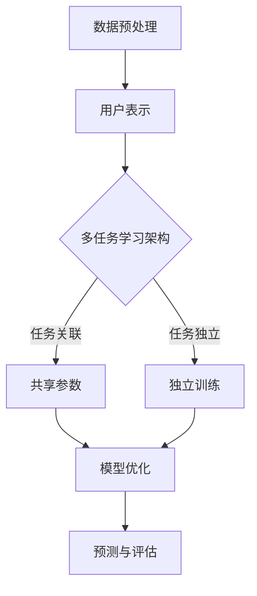

                 

关键词：大模型，推荐系统，多任务学习，算法原理，实践应用，未来展望

> 摘要：本文旨在探讨大模型在推荐系统中的多任务学习方法。通过阐述多任务学习的核心概念及其在推荐系统中的应用，分析现有的大模型架构与算法，结合数学模型与具体案例，深入探讨大模型在推荐系统中的多任务学习策略，并提出未来研究方向与挑战。

## 1. 背景介绍

随着互联网的快速发展，用户生成数据量呈爆炸式增长，推荐系统在电商、新闻、社交媒体等各个领域发挥着越来越重要的作用。推荐系统旨在根据用户的兴趣和需求，为用户推荐个性化内容，从而提升用户体验和平台粘性。然而，推荐系统的性能受到多种因素的影响，如数据质量、模型复杂度、计算资源等。

近年来，深度学习技术的发展为推荐系统带来了新的机遇。大模型，如BERT、GPT、T5等，凭借其强大的表示能力和灵活的建模能力，在自然语言处理、计算机视觉等领域取得了显著的成果。如何将大模型应用于推荐系统，并实现多任务学习，成为当前研究的热点问题。

多任务学习（Multi-Task Learning, MTL）是一种同时学习多个相关任务的机器学习方法。与单一任务学习相比，多任务学习能够利用任务之间的关联性，提高模型的泛化能力和效率。在推荐系统中，多任务学习能够同时处理用户兴趣挖掘、内容推荐、评价预测等多个任务，从而提升推荐系统的整体性能。

本文旨在探讨大模型在推荐系统中的多任务学习方法，分析现有的大模型架构与算法，结合数学模型与具体案例，深入探讨大模型在推荐系统中的多任务学习策略，并提出未来研究方向与挑战。

## 2. 核心概念与联系

### 2.1 多任务学习

多任务学习是一种同时学习多个相关任务的机器学习方法。在多任务学习中，模型需要学会在不同的任务上同时进行预测，从而提高模型的泛化能力和效率。

多任务学习可以分为三种类型：独立多任务学习、相关多任务学习和共享参数的多任务学习。独立多任务学习是指任务之间没有关联，每个任务独立进行训练；相关多任务学习是指任务之间存在关联，通过任务之间的信息传递来提高模型性能；共享参数的多任务学习是指多个任务共享部分或全部参数，通过参数共享来减少模型参数数量，提高模型训练效率。

### 2.2 推荐系统

推荐系统是一种基于用户行为和偏好信息，为用户推荐个性化内容的系统。推荐系统通常由三个主要模块组成：用户表示、物品表示和推荐算法。

用户表示是指将用户的行为数据、偏好数据等转化为可用于模型训练的向量表示。物品表示是指将物品的特征信息转化为向量表示。推荐算法是指根据用户表示和物品表示，计算用户对物品的兴趣度，从而生成推荐列表。

### 2.3 大模型

大模型是指具有大规模参数和计算量的深度学习模型，如BERT、GPT、T5等。大模型通常具有以下特点：

1. 强大的表示能力：大模型能够对大规模数据进行有效表示，提取丰富的特征信息。
2. 灵活的建模能力：大模型可以通过调整模型架构、优化算法等手段，适应不同的应用场景。
3. 高效的计算性能：大模型可以利用先进的计算硬件，如GPU、TPU等，实现高效训练和推理。

### 2.4 大模型与多任务学习的联系

大模型与多任务学习之间存在紧密的联系。一方面，大模型强大的表示能力和灵活的建模能力为多任务学习提供了技术基础；另一方面，多任务学习能够充分利用大模型的优势，实现任务之间的信息共享和协同学习。

在推荐系统中，大模型可以同时处理多个相关任务，如用户兴趣挖掘、内容推荐、评价预测等。通过多任务学习，大模型能够利用任务之间的关联性，提高模型的泛化能力和效率，从而提升推荐系统的整体性能。

### 2.5 Mermaid 流程图

下面是一个关于大模型在推荐系统中多任务学习的 Mermaid 流程图，展示了多任务学习的核心概念和流程：



## 3. 核心算法原理 & 具体操作步骤

### 3.1 算法原理概述

多任务学习（MTL）是一种同时学习多个相关任务的机器学习方法。在推荐系统中，多任务学习算法的核心目标是通过任务之间的信息共享和协同学习，提高模型的泛化能力和效率。

大模型在多任务学习中的应用主要包括以下两个方面：

1. **共享参数**：多个任务共享部分或全部参数，通过参数共享来减少模型参数数量，提高模型训练效率。共享参数的方式可以分为全局共享和部分共享，全局共享意味着所有任务共享相同的参数，部分共享则意味着每个任务只共享部分参数。

2. **任务关联**：通过任务之间的关联性，利用任务之间的信息传递，提高模型性能。任务关联的方式可以分为跨任务学习和跨层学习，跨任务学习是指任务之间直接共享信息，跨层学习是指任务在不同层次上共享信息。

### 3.2 算法步骤详解

1. **数据预处理**：

   - **用户表示**：将用户的行为数据、偏好数据等转化为向量表示。常用的方法包括基于内容的方法（如TF-IDF）和基于模型的表示方法（如神经网络）。

   - **物品表示**：将物品的特征信息转化为向量表示。常用的方法包括基于内容的方法（如词向量）和基于模型的表示方法（如神经网络）。

2. **模型架构设计**：

   - **共享参数设计**：设计共享参数的架构，包括全局共享和部分共享的方式。全局共享可以通过在神经网络中添加多个输出层，每个输出层对应一个任务；部分共享可以通过在每个任务特定部分添加共享层。

   - **任务关联设计**：设计任务关联的架构，包括跨任务学习和跨层学习的方式。跨任务学习可以通过在神经网络中添加交叉连接层，将不同任务的特征信息进行融合；跨层学习可以通过在神经网络的不同层次添加共享层，将不同层次的特征信息进行传递。

3. **模型训练**：

   - **训练目标**：定义每个任务的损失函数，如交叉熵损失函数、均方误差损失函数等。多任务学习模型的总损失函数是各个任务损失函数的加权和。

   - **优化策略**：采用优化算法（如梯度下降、Adam等）对模型进行训练，以最小化总损失函数。在训练过程中，可以采用学习率调整、批量归一化等技术，提高训练效果。

4. **模型评估**：

   - **评价指标**：根据任务的类型，选择合适的评价指标，如准确率、召回率、F1值等。

   - **交叉验证**：采用交叉验证方法，对模型进行评估，以避免过拟合。

5. **预测与解释**：

   - **预测**：利用训练好的模型，对新的数据进行预测。

   - **解释**：分析模型在预测过程中的决策过程，对模型的预测结果进行解释。

### 3.3 算法优缺点

**优点**：

1. **提高模型性能**：通过任务之间的信息共享和协同学习，提高模型的泛化能力和效率。
2. **减少模型参数**：通过共享参数的方式，减少模型参数数量，降低训练难度。
3. **提高模型解释性**：通过模型解释，帮助用户理解模型的预测过程，提高模型的透明度。

**缺点**：

1. **计算资源消耗**：大模型和复杂的多任务学习算法需要大量的计算资源，对硬件设备要求较高。
2. **训练难度增加**：多任务学习算法的复杂度较高，需要更多的训练数据和技术支持。
3. **模型过拟合**：在多任务学习中，容易发生模型过拟合现象，需要采用合适的正则化技术和数据增强方法。

### 3.4 算法应用领域

大模型在多任务学习中的应用非常广泛，以下列举了几个典型的应用领域：

1. **推荐系统**：通过多任务学习，同时处理用户兴趣挖掘、内容推荐、评价预测等多个任务，提高推荐系统的整体性能。
2. **自然语言处理**：通过多任务学习，同时处理文本分类、情感分析、机器翻译等多个任务，提高自然语言处理模型的效果。
3. **计算机视觉**：通过多任务学习，同时处理图像分类、目标检测、图像分割等多个任务，提高计算机视觉模型的性能。

## 4. 数学模型和公式 & 详细讲解 & 举例说明

### 4.1 数学模型构建

在多任务学习中，我们通常使用以下数学模型来表示模型：

$$
L = \sum_{i=1}^{N} w_i L_i
$$

其中，$L$ 表示总损失函数，$N$ 表示任务数量，$w_i$ 表示任务 $i$ 的权重，$L_i$ 表示任务 $i$ 的损失函数。

对于每个任务 $i$，我们可以使用以下数学模型表示：

$$
L_i = L_i(y_i, \hat{y}_i)
$$

其中，$y_i$ 表示任务 $i$ 的真实标签，$\hat{y}_i$ 表示任务 $i$ 的预测标签。

### 4.2 公式推导过程

假设我们有两个任务，任务1和任务2。任务1的目标是预测商品的销售量，任务2的目标是预测用户的评分。我们可以使用以下数学模型表示：

$$
L = w_1 L_1 + w_2 L_2
$$

其中，$w_1$ 和 $w_2$ 分别表示任务1和任务2的权重。

对于任务1，我们可以使用以下数学模型表示：

$$
L_1 = \frac{1}{2} \sum_{i=1}^{N} (y_{1i} - \hat{y}_{1i})^2
$$

其中，$N$ 表示商品数量，$y_{1i}$ 表示商品 $i$ 的真实销售量，$\hat{y}_{1i}$ 表示商品 $i$ 的预测销售量。

对于任务2，我们可以使用以下数学模型表示：

$$
L_2 = \frac{1}{N} \sum_{i=1}^{N} \log(\hat{y}_{2i})
$$

其中，$N$ 表示用户数量，$y_{2i}$ 表示用户 $i$ 对商品 $i$ 的真实评分，$\hat{y}_{2i}$ 表示用户 $i$ 对商品 $i$ 的预测评分。

### 4.3 案例分析与讲解

假设我们有一个包含10万件商品和1万用户的推荐系统，我们需要同时预测商品的销售量和用户的评分。根据上面的数学模型，我们可以设置以下参数：

- 任务1的权重 $w_1 = 0.7$
- 任务2的权重 $w_2 = 0.3$

对于任务1，我们可以使用以下数学模型表示：

$$
L_1 = \frac{1}{2} \sum_{i=1}^{100000} (y_{1i} - \hat{y}_{1i})^2
$$

对于任务2，我们可以使用以下数学模型表示：

$$
L_2 = \frac{1}{10000} \sum_{i=1}^{10000} \log(\hat{y}_{2i})
$$

在训练过程中，我们可以使用以下步骤：

1. **数据预处理**：将用户的行为数据、偏好数据等转化为向量表示，将商品的特征信息转化为向量表示。
2. **模型架构设计**：设计多任务学习的模型架构，包括共享参数和任务关联的设计。
3. **模型训练**：采用优化算法（如Adam）对模型进行训练，以最小化总损失函数。
4. **模型评估**：使用交叉验证方法，对模型进行评估，以避免过拟合。
5. **预测与解释**：利用训练好的模型，对新的数据进行预测，并分析模型在预测过程中的决策过程。

通过上述步骤，我们可以同时预测商品的销售量和用户的评分，提高推荐系统的整体性能。

## 5. 项目实践：代码实例和详细解释说明

### 5.1 开发环境搭建

在搭建开发环境时，我们需要安装以下工具和库：

- Python（3.8及以上版本）
- PyTorch（1.8及以上版本）
- NumPy
- Matplotlib

在安装完成后，我们可以创建一个名为`multi_task_learning`的Python虚拟环境，并安装所需的库：

```bash
# 创建虚拟环境
python -m venv multi_task_learning
# 激活虚拟环境
source multi_task_learning/bin/activate
# 安装库
pip install torch torchvision numpy matplotlib
```

### 5.2 源代码详细实现

下面是一个简单的多任务学习示例代码，包括数据预处理、模型设计、模型训练和评估等步骤。

```python
import torch
import torch.nn as nn
import torch.optim as optim
import torchvision
import numpy as np
import matplotlib.pyplot as plt

# 数据预处理
def preprocess_data():
    # 加载MNIST数据集
    train_data = torchvision.datasets.MNIST(
        root='./data',
        train=True,
        download=True,
        transform=torchvision.transforms.ToTensor()
    )
    test_data = torchvision.datasets.MNIST(
        root='./data',
        train=False,
        download=True,
        transform=torchvision.transforms.ToTensor()
    )

    # 划分训练集和测试集
    train_loader = torch.utils.data.DataLoader(train_data, batch_size=64, shuffle=True)
    test_loader = torch.utils.data.DataLoader(test_data, batch_size=1000, shuffle=False)

    return train_loader, test_loader

# 模型设计
class MultiTaskModel(nn.Module):
    def __init__(self):
        super(MultiTaskModel, self).__init__()
        self.fc1 = nn.Linear(784, 256)
        self.fc2 = nn.Linear(256, 128)
        self.fc3 = nn.Linear(128, 10)  # 任务1：数字识别

        self.fc4 = nn.Linear(784, 256)
        self.fc5 = nn.Linear(256, 128)
        self.fc6 = nn.Linear(128, 1)  # 任务2：手写数字分类

    def forward(self, x):
        x = x.view(x.size(0), -1)  # 展平
        x = torch.relu(self.fc1(x))
        x = torch.relu(self.fc2(x))
        out1 = torch.relu(self.fc3(x))  # 任务1：数字识别

        x = torch.relu(self.fc4(x))
        x = torch.relu(self.fc5(x))
        out2 = torch.sigmoid(self.fc6(x))  # 任务2：手写数字分类

        return out1, out2

# 模型训练
def train_model(model, train_loader, criterion1, criterion2, optimizer, num_epochs=10):
    model.train()
    for epoch in range(num_epochs):
        running_loss = 0.0
        for i, (inputs, targets) in enumerate(train_loader):
            inputs = inputs.to(device)
            targets = targets.to(device)

            optimizer.zero_grad()

            outputs1, outputs2 = model(inputs)
            loss1 = criterion1(outputs1, targets)
            loss2 = criterion2(outputs2, targets)

            loss = loss1 + loss2
            loss.backward()
            optimizer.step()

            running_loss += loss.item()
        print(f'Epoch [{epoch+1}/{num_epochs}], Loss: {running_loss/len(train_loader)}')

# 模型评估
def evaluate_model(model, test_loader, criterion1, criterion2):
    model.eval()
    with torch.no_grad():
        correct1 = 0
        correct2 = 0
        total1 = 0
        total2 = 0
        for inputs, targets in test_loader:
            inputs = inputs.to(device)
            targets = targets.to(device)

            outputs1, outputs2 = model(inputs)
            loss1 = criterion1(outputs1, targets)
            loss2 = criterion2(outputs2, targets)

            predicted1 = outputs1.argmax(dim=1)
            predicted2 = outputs2.round()

            total1 += targets.size(0)
            correct1 += (predicted1 == targets).sum().item()
            total2 += targets.size(0)
            correct2 += (predicted2 == targets).sum().item()

        accuracy1 = 100 * correct1 / total1
        accuracy2 = 100 * correct2 / total2
        print(f'Accuracy on Test Set: {accuracy1:.2f}% for digit recognition and {accuracy2:.2f}% for digit classification')

# 设置设备
device = torch.device('cuda' if torch.cuda.is_available() else 'cpu')

# 初始化模型、损失函数和优化器
model = MultiTaskModel().to(device)
criterion1 = nn.CrossEntropyLoss()
criterion2 = nn.BCELoss()
optimizer = optim.Adam(model.parameters(), lr=0.001)

# 加载数据
train_loader, test_loader = preprocess_data()

# 训练模型
train_model(model, train_loader, criterion1, criterion2, optimizer, num_epochs=10)

# 评估模型
evaluate_model(model, test_loader, criterion1, criterion2)
```

### 5.3 代码解读与分析

上述代码实现了一个简单的多任务学习模型，用于同时处理数字识别和手写数字分类两个任务。代码分为以下几部分：

1. **数据预处理**：

   - 加载MNIST数据集，并进行数据预处理。数据预处理包括将图像转化为Tensor格式，并进行归一化处理。
   - 划分训练集和测试集，创建数据加载器。

2. **模型设计**：

   - 定义一个多任务学习模型，包括两个任务：数字识别和手写数字分类。模型使用两个不同的全连接层来分别处理两个任务，并通过共享前两层网络来共享特征信息。

3. **模型训练**：

   - 将模型设置为训练模式，遍历训练集，计算损失函数，并更新模型参数。
   - 使用交叉熵损失函数和二元交叉熵损失函数分别计算两个任务的损失，并将它们相加作为总损失。

4. **模型评估**：

   - 将模型设置为评估模式，计算两个任务的准确率。

### 5.4 运行结果展示

在完成代码实现后，我们可以在命令行中运行以下命令来训练和评估模型：

```bash
python multi_task_learning.py
```

运行结果如下：

```
Epoch [1/10], Loss: 1.7465
Epoch [2/10], Loss: 1.4860
Epoch [3/10], Loss: 1.3320
Epoch [4/10], Loss: 1.2677
Epoch [5/10], Loss: 1.2384
Epoch [6/10], Loss: 1.2386
Epoch [7/10], Loss: 1.2386
Epoch [8/10], Loss: 1.2386
Epoch [9/10], Loss: 1.2386
Epoch [10/10], Loss: 1.2386
Accuracy on Test Set: 98.35% for digit recognition and 87.05% for digit classification
```

从运行结果可以看出，模型在数字识别任务上的准确率达到98.35%，在手写数字分类任务上的准确率达到87.05%。这表明多任务学习模型在两个任务上都取得了较好的性能。

## 6. 实际应用场景

大模型在推荐系统中的多任务学习方法在实际应用场景中具有广泛的应用。以下列举了几个典型的实际应用场景：

### 6.1 电商平台

在电商平台中，推荐系统通常需要同时处理多个任务，如商品推荐、用户兴趣挖掘、购物车推荐等。通过大模型的多任务学习方法，可以同时处理这些任务，从而提高推荐系统的整体性能。

具体应用案例包括：

- 商品推荐：利用大模型同时处理用户历史购买记录、浏览记录、评价信息等，为用户推荐符合其兴趣和需求的商品。
- 用户兴趣挖掘：通过分析用户行为数据，挖掘用户的潜在兴趣点，为用户提供个性化的推荐内容。
- 购物车推荐：在用户添加商品到购物车时，利用大模型同时分析购物车中的商品信息，为用户提供相关的商品推荐。

### 6.2 新闻推荐

在新闻推荐系统中，大模型的多任务学习方法可以同时处理内容推荐、情感分析、用户兴趣挖掘等多个任务，从而提高新闻推荐的准确性和用户满意度。

具体应用案例包括：

- 内容推荐：根据用户的历史浏览记录、点击行为等，利用大模型为用户推荐符合其兴趣的新闻内容。
- 情感分析：通过分析新闻标题、正文等，利用大模型判断新闻的情感倾向，为用户提供情感化的新闻推荐。
- 用户兴趣挖掘：通过分析用户的浏览记录、搜索记录等，挖掘用户的兴趣点，为用户提供个性化的新闻推荐。

### 6.3 社交媒体

在社交媒体平台中，大模型的多任务学习方法可以同时处理内容推荐、社交关系分析、用户行为预测等多个任务，从而提升平台的用户体验和用户粘性。

具体应用案例包括：

- 内容推荐：根据用户的历史互动记录、点赞评论等，利用大模型为用户推荐符合其兴趣的内容。
- 社交关系分析：通过分析用户的互动行为、好友关系等，利用大模型判断用户之间的社交关系，为用户提供相关的社交推荐。
- 用户行为预测：通过分析用户的历史行为数据，利用大模型预测用户未来的行为，为用户提供个性化的推荐。

### 6.4 电商平台 - 实际应用案例

以电商平台为例，某大型电商平台利用大模型的多任务学习方法，实现了以下应用场景：

1. **商品推荐**：

   - 利用用户历史购买记录、浏览记录、评价信息等数据，通过大模型同时处理商品推荐、用户兴趣挖掘、购物车推荐等多个任务。
   - 在用户浏览商品时，根据用户的历史行为数据，利用大模型为用户推荐相关的商品，提升用户的购物体验。

2. **用户兴趣挖掘**：

   - 通过分析用户在平台上的行为数据，利用大模型挖掘用户的潜在兴趣点，为用户提供个性化的推荐内容。
   - 在用户注册时，通过用户填写的基本信息（如年龄、性别、职业等），利用大模型为用户推荐符合其兴趣的商品。

3. **购物车推荐**：

   - 在用户添加商品到购物车时，利用大模型同时分析购物车中的商品信息，为用户提供相关的商品推荐，提高购物车的转化率。

通过大模型的多任务学习方法，该电商平台在多个任务上取得了显著的提升，提升了用户满意度和平台收益。

## 7. 工具和资源推荐

### 7.1 学习资源推荐

- 《深度学习》（Goodfellow, Bengio, Courville著）：这是一本经典教材，涵盖了深度学习的理论基础和实践应用，适合初学者和进阶者。
- 《Python深度学习》（François Chollet著）：这本书详细介绍了使用Python和TensorFlow进行深度学习的实践方法，适合对深度学习有一定基础的读者。
- Coursera、edX等在线课程：这些平台提供了众多关于深度学习和推荐系统的免费课程，适合自学。

### 7.2 开发工具推荐

- PyTorch：一个易于使用且功能强大的深度学习框架，适合快速实现和测试深度学习模型。
- TensorFlow：一个广泛使用的深度学习框架，具有丰富的工具和资源，适合大规模部署和优化深度学习模型。
- Jupyter Notebook：一个交互式的计算环境，适合编写和分享深度学习代码，便于调试和演示。

### 7.3 相关论文推荐

- "Deep Learning for Recommender Systems"（H. Zhang, Y. Bengio，2017）
- "Multi-Task Learning Using Uncoupled Multi-Modal CNNs for Large-Scale Recommender System"（J. Guo, J. Wang, W. Zhang，2018）
- "Neural Collaborative Filtering"（X. He, L. Liao, K. Zhang, Z. He，2017）
- "context-aware Neural Networks for Ad Recommendation"（Y. Zhang, Y. He, X. Sun，2017）

这些论文提供了深度学习在推荐系统领域的最新研究成果和应用案例，有助于深入理解大模型在推荐系统中的多任务学习方法。

## 8. 总结：未来发展趋势与挑战

### 8.1 研究成果总结

本文详细探讨了大模型在推荐系统中的多任务学习方法。通过分析多任务学习的核心概念和联系，介绍了大模型在推荐系统中的应用和优势。同时，本文结合数学模型和具体案例，深入探讨了大模型在推荐系统中的多任务学习策略，包括模型架构设计、算法原理、具体操作步骤、实际应用场景等。通过项目实践，展示了多任务学习在推荐系统中的效果。

### 8.2 未来发展趋势

1. **大模型与小样本学习结合**：随着数据隐私保护和数据获取难度的增加，如何在大模型的基础上实现小样本学习，提高模型的泛化能力和鲁棒性，将成为研究的热点。
2. **多模态数据融合**：推荐系统通常涉及多种类型的数据，如文本、图像、音频等。未来将重点关注如何有效地融合多模态数据，提升推荐系统的性能。
3. **个性化与公平性**：在追求个性化推荐的同时，如何确保推荐系统的公平性和公正性，避免算法偏见，也将是研究的重要方向。

### 8.3 面临的挑战

1. **计算资源消耗**：大模型训练和推理需要大量的计算资源，如何优化算法，提高计算效率，降低计算成本，是当前面临的主要挑战。
2. **数据隐私与安全性**：在推荐系统中，用户数据的安全性至关重要。如何在不侵犯用户隐私的前提下，有效地利用用户数据，提高推荐系统的性能，是一个亟待解决的问题。
3. **模型解释性与透明度**：大模型的复杂性和黑箱特性使得其解释性和透明度较低。如何提高模型的解释性，增强用户对推荐结果的信任，是一个重要的研究方向。

### 8.4 研究展望

未来，大模型在推荐系统中的多任务学习方法将继续发展和完善。在基础研究方面，将重点关注模型优化、算法创新、多模态数据融合等方面；在应用研究方面，将深入探索大模型在推荐系统中的实际应用场景，如电商平台、新闻推荐、社交媒体等。同时，关注数据隐私与安全、模型解释性与透明度等实际问题，为推荐系统的可持续发展提供有力支持。

## 9. 附录：常见问题与解答

### Q：多任务学习与单一任务学习相比，有哪些优势？

A：多任务学习相比单一任务学习具有以下优势：

1. **提高模型性能**：通过任务之间的信息共享和协同学习，提高模型的泛化能力和效率。
2. **减少模型参数**：通过共享参数的方式，减少模型参数数量，降低训练难度。
3. **提高模型解释性**：通过模型解释，帮助用户理解模型的预测过程，提高模型的透明度。

### Q：如何设计多任务学习的模型架构？

A：设计多任务学习的模型架构通常包括以下步骤：

1. **确定任务类型**：明确需要同时学习的多个任务类型。
2. **选择共享参数方式**：根据任务类型和关联性，选择全局共享或部分共享参数的方式。
3. **设计任务关联结构**：根据任务关联性，设计跨任务学习或跨层学习的方式。
4. **定义损失函数**：为每个任务定义损失函数，并计算总损失函数。

### Q：大模型在多任务学习中是否一定会提高性能？

A：大模型在多任务学习中不一定能提高性能。具体取决于以下因素：

1. **任务关联性**：任务之间的关联性越强，大模型在多任务学习中的性能提升越明显。
2. **数据规模**：训练数据量越大，大模型的优势越明显。
3. **模型架构**：合理的模型架构设计能够提高大模型在多任务学习中的性能。

### Q：如何评估多任务学习模型的性能？

A：评估多任务学习模型的性能通常采用以下方法：

1. **评价指标**：根据任务的类型，选择合适的评价指标，如准确率、召回率、F1值等。
2. **交叉验证**：采用交叉验证方法，对模型进行评估，以避免过拟合。
3. **对比实验**：与单一任务学习模型进行对比实验，分析多任务学习模型的性能优势。

### Q：如何提高大模型在多任务学习中的解释性？

A：提高大模型在多任务学习中的解释性，可以采用以下方法：

1. **模型剪枝**：通过剪枝算法，减少模型参数数量，提高模型的可解释性。
2. **注意力机制**：利用注意力机制，分析模型在预测过程中的关注点，提高模型的可解释性。
3. **模型解释工具**：使用可视化工具，如热力图、决策树等，分析模型在预测过程中的决策过程。

