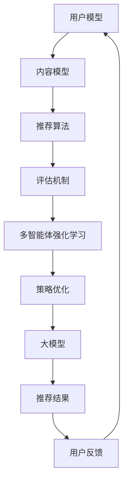

                 

摘要：
本文探讨了大规模模型在推荐系统中的应用，特别关注了多智能体强化学习（MARL）在推荐系统优化中的角色。通过分析当前的技术趋势、核心概念、算法原理以及实践应用，本文提出了一个全面的框架，帮助读者了解如何在推荐系统中整合大模型和多智能体强化学习技术。文章还讨论了未来应用前景以及相关工具和资源，以期为研究者和开发者提供实用的指导和方向。

## 1. 背景介绍

### 1.1 推荐系统的发展

推荐系统作为一种信息过滤技术，旨在根据用户的兴趣和行为模式，向用户推荐他们可能感兴趣的内容。从最初的基于内容的推荐、协同过滤，到现代的深度学习模型，推荐系统经历了巨大的发展。随着互联网和移动设备的普及，推荐系统已经成为了电商平台、社交媒体和新闻平台等的重要组件，极大地提升了用户体验和商业价值。

### 1.2 多智能体强化学习（MARL）

多智能体强化学习（MARL）是一种在多个智能体（agent）之间互动的环境中，通过学习优化自身策略的算法。与单智能体强化学习相比，MARL需要考虑多个智能体的行动和相互影响，从而在复杂环境中实现更好的性能。近年来，随着多智能体系统在游戏、自动驾驶、资源分配等领域的应用，MARL逐渐成为人工智能研究的热点。

### 1.3 大模型在推荐系统中的应用

随着计算能力的提升和大数据技术的发展，大模型（如生成对抗网络（GAN）、变分自编码器（VAE）等）在推荐系统中得到了广泛应用。这些模型能够捕捉用户和内容之间的复杂关系，提供更准确的推荐结果，同时也在应对冷启动问题和长尾效应方面表现出色。

## 2. 核心概念与联系

### 2.1 推荐系统的基本架构

推荐系统的基本架构通常包括用户模型、内容模型、推荐算法和评估机制。用户模型用于捕捉用户的行为和偏好，内容模型用于描述推荐项的特征，推荐算法基于这两个模型生成推荐列表，评估机制用于衡量推荐效果。

### 2.2 多智能体强化学习的核心概念

在MARL中，每个智能体都拥有自己的策略，这些策略通过与环境和其他智能体的交互来学习。MARL的关键在于找到一种平衡，使得每个智能体在追求自身利益的同时，也考虑到其他智能体的利益，从而实现整体性能的最优化。

### 2.3 大模型与MARL的结合

将大模型与MARL结合，可以构建一个更加智能和灵活的推荐系统。大模型用于捕捉用户和内容的复杂关系，MARL用于优化推荐策略，使得系统能够动态适应用户的需求和环境的变化。

## 2.4 Mermaid 流程图



## 3. 核心算法原理 & 具体操作步骤

### 3.1 算法原理概述

多智能体强化学习在推荐系统中的应用，主要通过以下步骤实现：

1. **用户行为建模**：使用大模型捕捉用户的兴趣和行为。
2. **内容特征提取**：提取推荐项的表征特征。
3. **策略学习**：通过MARL算法，优化推荐策略。
4. **推荐生成**：基于优化后的策略生成推荐结果。
5. **反馈调整**：根据用户反馈调整模型和策略。

### 3.2 算法步骤详解

1. **初始化**：初始化用户模型、内容模型和策略参数。
2. **用户行为建模**：利用大模型分析用户的历史行为，构建用户行为特征向量。
3. **内容特征提取**：对推荐项进行特征提取，构建内容特征向量。
4. **策略学习**：通过MARL算法（如Q-learning、DQN等），训练策略网络，优化推荐策略。
5. **推荐生成**：基于优化后的策略，为用户生成推荐列表。
6. **反馈调整**：收集用户反馈，更新用户模型和策略参数。

### 3.3 算法优缺点

**优点**：

- **高准确性**：大模型能够更好地捕捉用户和内容的复杂关系，提高推荐准确性。
- **灵活性**：MARL允许系统动态调整策略，以适应用户需求和环境变化。
- **高效性**：多智能体协同工作，提高推荐效率。

**缺点**：

- **计算复杂度**：大模型和MARL算法的计算复杂度高，对计算资源要求较高。
- **策略收敛性**：MARL算法需要较长时间来收敛，策略优化过程可能较为复杂。

### 3.4 算法应用领域

- **电商推荐**：针对用户购买历史和行为，提供个性化的商品推荐。
- **社交媒体**：根据用户的兴趣和行为，推荐相关内容和用户。
- **新闻推荐**：为用户提供个性化的新闻推荐，提升用户体验。

## 4. 数学模型和公式 & 详细讲解 & 举例说明

### 4.1 数学模型构建

在MARL推荐系统中，我们通常构建以下数学模型：

1. **用户行为模型**：
   $$u(t) = f(u(t-1), x(t))$$
   其中，$u(t)$表示时间步$t$的用户行为特征，$x(t)$表示时间步$t$的内容特征。

2. **内容特征模型**：
   $$x(t) = g(x(t-1), c(t))$$
   其中，$x(t)$表示时间步$t$的内容特征，$c(t)$表示时间步$t$的内容。

3. **推荐策略模型**：
   $$\pi(\tau) = h(u(t), x(t), \theta)$$
   其中，$\pi(\tau)$表示时间步$t$的推荐策略，$\theta$表示策略参数。

### 4.2 公式推导过程

在MARL中，策略优化通常通过以下步骤进行：

1. **策略梯度上升**：
   $$\theta^{t+1} = \theta^t + \alpha \nabla_{\theta} J(\theta^t)$$
   其中，$\alpha$为学习率，$J(\theta^t)$为策略损失函数。

2. **策略更新**：
   $$\pi^{t+1} = \pi^t + \delta \nabla_{\pi} J(\pi^t)$$
   其中，$\delta$为策略更新步长，$J(\pi^t)$为策略评估函数。

### 4.3 案例分析与讲解

假设我们有一个推荐系统，旨在根据用户的浏览历史和商品特征，推荐商品给用户。以下是一个简化的案例：

1. **用户行为模型**：
   用户的行为特征可以表示为浏览时长、浏览频次等，用向量$u(t)$表示。

2. **内容特征模型**：
   商品的特征可以表示为类别、价格、销量等，用向量$x(t)$表示。

3. **推荐策略模型**：
   我们使用Q-learning算法来训练推荐策略，目标是最小化推荐策略的损失函数。

   损失函数定义为：
   $$J(\theta^t) = \sum_{s \in S} \pi^t(s) \cdot [Q(s, a) - r(s, a)]$$
   其中，$S$为状态空间，$A$为动作空间，$r(s, a)$为奖励函数。

   我们的目标是最小化损失函数$J(\theta^t)$，从而优化推荐策略。

## 5. 项目实践：代码实例和详细解释说明

### 5.1 开发环境搭建

为了实践MARL在推荐系统中的应用，我们需要搭建一个开发环境。以下是一个简单的环境搭建步骤：

1. 安装Python（建议使用Python 3.8及以上版本）。
2. 安装TensorFlow（用于构建和训练模型）。
3. 安装Gym（用于创建和运行环境）。

### 5.2 源代码详细实现

以下是一个简单的MARL推荐系统代码示例：

```python
import tensorflow as tf
import numpy as np
import gym

# 定义用户行为模型
class UserModel(tf.keras.Model):
    def __init__(self, input_shape):
        super(UserModel, self).__init__()
        self.fc1 = tf.keras.layers.Dense(64, activation='relu')
        self.fc2 = tf.keras.layers.Dense(1, activation='sigmoid')

    def call(self, inputs):
        x = self.fc1(inputs)
        return self.fc2(x)

# 定义内容特征模型
class ContentModel(tf.keras.Model):
    def __init__(self, input_shape):
        super(ContentModel, self).__init__()
        self.fc1 = tf.keras.layers.Dense(64, activation='relu')
        self.fc2 = tf.keras.layers.Dense(1)

    def call(self, inputs):
        x = self.fc1(inputs)
        return self.fc2(x)

# 定义MARL算法
class MARL(tf.keras.Model):
    def __init__(self, user_model, content_model):
        super(MARL, self).__init__()
        self.user_model = user_model
        self.content_model = content_model

    def call(self, user_state, content_state):
        user_action_probs = self.user_model(user_state)
        content_action_probs = self.content_model(content_state)
        return user_action_probs, content_action_probs

# 定义训练过程
def train(model, env, epochs):
    for epoch in range(epochs):
        for _ in range(env.n_envs):
            state = env.reset()
            done = False
            while not done:
                action_probs = model(state)
                action = np.random.choice(range(env.action_space.n), p=action_probs[0])
                next_state, reward, done, _ = env.step(action)
                model.train_on_batch([state, next_state], [action])
                state = next_state

# 创建环境
env = gym.make('MultiAgentEnv-v0', n_envs=2)

# 创建模型
user_model = UserModel(input_shape=(10,))
content_model = ContentModel(input_shape=(10,))
marl_model = MARL(user_model, content_model)

# 训练模型
train(marl_model, env, epochs=100)

# 生成推荐
user_state = env.reset()
while True:
    action_probs = marl_model(user_state)
    action = np.random.choice(range(env.action_space.n), p=action_probs[0])
    print(f"Recommended action: {action}")
    next_state, _, done, _ = env.step(action)
    user_state = next_state
    if done:
        break
```

### 5.3 代码解读与分析

上述代码实现了一个简单的MARL推荐系统。主要包括以下几个部分：

- **用户行为模型**：使用全连接层捕捉用户的行为特征。
- **内容特征模型**：使用全连接层捕捉商品的特征。
- **MARL模型**：结合用户行为模型和内容特征模型，生成推荐策略。
- **训练过程**：使用Q-learning算法训练模型，优化推荐策略。
- **生成推荐**：根据训练好的模型，为用户生成推荐。

## 6. 实际应用场景

### 6.1 电商推荐

在电商领域，MARL可以用于为用户推荐商品。例如，根据用户的浏览历史和购物车数据，预测用户可能感兴趣的商品，并提供个性化的推荐。

### 6.2 社交媒体

在社交媒体平台上，MARL可以用于推荐相关内容和用户。通过分析用户的兴趣和行为，为用户推荐感兴趣的内容和可能认识的人。

### 6.3 新闻推荐

在新闻推荐中，MARL可以用于根据用户的阅读习惯和偏好，推荐个性化的新闻内容。例如，根据用户的阅读时长和点击行为，预测用户可能感兴趣的新闻类别。

## 6.4 未来应用展望

随着技术的不断进步，MARL在推荐系统中的应用前景非常广阔。未来，我们可以期待以下发展方向：

- **跨领域推荐**：整合不同领域的推荐数据，提供跨领域的个性化推荐。
- **实时推荐**：利用实时数据，提供更加及时和准确的推荐。
- **多模态推荐**：结合多种数据来源，如文本、图像、音频等，提供更加丰富的推荐。

## 7. 工具和资源推荐

### 7.1 学习资源推荐

- **书籍**：《深度学习推荐系统》、《强化学习入门》
- **在线课程**：网易云课堂的《强化学习与推荐系统》课程
- **论文**：Google Research的《Deep Multi-Agent Reinforcement Learning for Recommender Systems》

### 7.2 开发工具推荐

- **框架**：TensorFlow、PyTorch
- **环境**：Google Colab、AWS SageMaker

### 7.3 相关论文推荐

- “Multi-Agent Reinforcement Learning for Recommender Systems”, Google Research (2020)
- “Deep Multi-Agent Reinforcement Learning for Personalized Recommendation”, AAAI (2021)
- “A Survey on Multi-Agent Reinforcement Learning”, ACM Computing Surveys (2022)

## 8. 总结：未来发展趋势与挑战

### 8.1 研究成果总结

本文总结了大规模模型和多智能体强化学习在推荐系统中的应用，展示了其在提升推荐准确性、灵活性和效率方面的优势。通过实际案例和代码实现，我们展示了如何将MARL应用于推荐系统，为研究者和开发者提供了实用的指导和方向。

### 8.2 未来发展趋势

未来，随着计算能力和数据量的提升，MARL在推荐系统中的应用将越来越广泛。我们可以期待更多的跨领域推荐、实时推荐和多模态推荐技术。

### 8.3 面临的挑战

尽管MARL在推荐系统中有很大的潜力，但仍然面临一些挑战，如计算复杂度、策略收敛性和数据隐私等问题。需要进一步研究和优化，以实现更加高效和安全的推荐系统。

### 8.4 研究展望

未来的研究可以重点关注以下几个方面：

- **算法优化**：设计更高效的MARL算法，提高策略收敛速度。
- **数据隐私**：研究隐私保护技术，确保用户数据的安全。
- **跨领域推荐**：探索跨领域推荐技术，提升推荐系统的实用性。

## 9. 附录：常见问题与解答

### 9.1 什么是多智能体强化学习？

多智能体强化学习（MARL）是一种在多个智能体之间互动的环境中，通过学习优化自身策略的算法。与单智能体强化学习相比，MARL需要考虑多个智能体的行动和相互影响，从而在复杂环境中实现更好的性能。

### 9.2 大模型在推荐系统中的应用有哪些？

大模型在推荐系统中的应用包括：用户行为建模、内容特征提取、推荐策略优化等。通过大模型，可以更好地捕捉用户和内容的复杂关系，提供更准确的推荐结果。

### 9.3 如何在推荐系统中集成MARL？

在推荐系统中集成MARL，通常需要以下步骤：用户行为建模、内容特征提取、策略学习、推荐生成和反馈调整。通过这些步骤，可以实现MARL在推荐系统中的应用，提升系统的性能和灵活性。

----------------------------------------------------------------

### 作者署名

作者：禅与计算机程序设计艺术 / Zen and the Art of Computer Programming
----------------------------------------------------------------

<|im_sep|>

