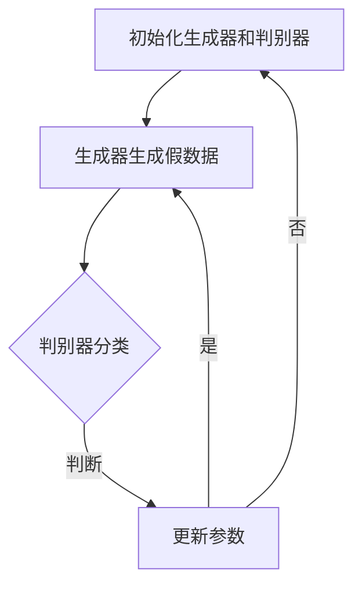

                 

关键词：大模型，推荐系统，对抗生成网络，GAN，数据生成，模型优化

> 摘要：本文旨在探讨大模型在推荐系统中应用对抗生成网络（GAN）的原理、实现方法和实际效果。通过对GAN核心概念、数学模型的详细分析，结合项目实践，本文为推荐系统开发者提供了一套实用的解决方案。

## 1. 背景介绍

推荐系统在当今信息爆炸的时代扮演着至关重要的角色，其目标是为用户提供个性化的内容推荐。随着数据量的急剧增加和用户需求的多样化，传统的推荐算法面临着越来越多的挑战。为了提升推荐系统的效果，研究者们开始探索将深度学习，尤其是大模型，应用于推荐系统。与此同时，对抗生成网络（Generative Adversarial Networks，GAN）作为一种强大的生成模型，也逐渐引起了推荐系统领域的关注。

GAN最早由Ian Goodfellow等人于2014年提出，它通过一个生成器（Generator）和一个判别器（Discriminator）之间的对抗训练来实现数据的生成。生成器试图生成逼真的数据，而判别器则努力区分生成数据和真实数据。两者相互博弈，逐步提升生成数据的质量。

近年来，随着大模型的快速发展，如Transformer、BERT等，它们在自然语言处理、计算机视觉等领域取得了显著的成果。这些大模型强大的特征提取和表征能力，使其在推荐系统中也展现出巨大的潜力。同时，GAN在数据增强、对抗样本生成等方面的应用，也为推荐系统的优化提供了新的思路。

## 2. 核心概念与联系

### 2.1 GAN的基本概念

GAN由生成器（Generator）和判别器（Discriminator）两部分组成，两者通过对抗训练相互提升。生成器尝试生成与真实数据相似的数据，而判别器则通过学习判断输入数据是真实数据还是生成数据。具体来说，GAN的训练过程如下：

1. 初始化生成器和判别器。
2. 生成器生成一批假数据。
3. 判别器对真实数据和生成数据进行分类。
4. 根据判别器的输出，更新生成器和判别器的参数。

通过反复迭代，生成器的生成数据质量逐渐提升，判别器的分类能力也不断增强。

### 2.2 大模型与GAN的关联

大模型在推荐系统中的应用主要体现在特征提取和表征上。大模型能够通过大量数据的学习，提取出高度抽象和具有区分度的特征，从而提高推荐系统的效果。而GAN在大模型中的应用，主要体现在数据生成和对抗样本生成上：

1. **数据生成**：利用GAN生成与训练数据分布相似的数据，扩充训练集，缓解数据不足的问题。
2. **对抗样本生成**：通过生成对抗样本，增强推荐系统的鲁棒性，提高对异常用户的适应能力。

### 2.3 Mermaid流程图

下面是一个简单的GAN训练过程的Mermaid流程图：



## 3. 核心算法原理 & 具体操作步骤

### 3.1 算法原理概述

GAN的训练过程可以看作是一个零和博弈游戏，生成器和判别器的目标是最大化自己的优势。具体来说：

- **生成器**：试图生成尽可能逼真的数据，使其难以被判别器识别。
- **判别器**：努力区分真实数据和生成数据，提高分类准确率。

### 3.2 算法步骤详解

1. **数据预处理**：对原始数据进行清洗和预处理，包括缺失值填充、异常值处理、数据标准化等。
2. **模型初始化**：初始化生成器和判别器的参数。
3. **生成器训练**：生成器生成数据，判别器对真实数据和生成数据进行分类。
4. **判别器训练**：根据分类结果，更新判别器的参数。
5. **交替训练**：反复迭代生成器和判别器的训练，直到达到预定的停止条件。

### 3.3 算法优缺点

**优点**：

- GAN能够生成高质量的数据，对数据不足的问题有较好的解决能力。
- GAN具有较强的鲁棒性，能够处理异常数据和噪声。

**缺点**：

- GAN训练过程不稳定，容易出现模式崩溃（mode collapse）。
- GAN难以直接评估生成数据的真实性。

### 3.4 算法应用领域

GAN在推荐系统中的应用主要集中在数据生成和对抗样本生成。具体包括：

- **数据增强**：利用GAN生成与训练数据分布相似的数据，提高模型的泛化能力。
- **对抗攻击**：生成对抗样本，增强推荐系统的鲁棒性，提高对异常用户的适应能力。
- **虚假用户生成**：通过生成虚假用户数据，用于推荐算法的测试和评估。

## 4. 数学模型和公式 & 详细讲解 & 举例说明

### 4.1 数学模型构建

GAN的数学模型主要包括生成器和判别器的损失函数。生成器的损失函数旨在最小化生成数据被判别器识别的概率，判别器的损失函数则最大化生成数据被识别为真实数据的概率。

**生成器的损失函数**：

$$L_G = -\log(D(G(z)))$$

其中，$G(z)$表示生成器生成的数据，$z$为噪声向量，$D$为判别器的输出。

**判别器的损失函数**：

$$L_D = -[\log(D(x)) + \log(1 - D(G(z)))]$$

其中，$x$为真实数据。

### 4.2 公式推导过程

GAN的损失函数推导主要基于两个基本假设：

1. 判别器的目标是最大化其对真实数据和生成数据的分类准确率。
2. 生成器的目标是最大化判别器对其生成数据的识别错误率。

根据这两个假设，可以推导出生成器和判别器的损失函数。

### 4.3 案例分析与讲解

以一个简单的二分类问题为例，生成器和判别器的损失函数如下：

**生成器的损失函数**：

$$L_G = -\log(D(G(z)))$$

其中，$G(z)$表示生成器生成的数据，$z$为噪声向量，$D$为判别器的输出。

**判别器的损失函数**：

$$L_D = -[\log(D(x)) + \log(1 - D(G(z)))]$$

其中，$x$为真实数据。

在训练过程中，生成器和判别器的损失函数如下：

1. **生成器训练**：

   - 初始化生成器和判别器参数。
   - 生成器生成一批假数据$G(z)$。
   - 判别器对真实数据和生成数据进行分类。
   - 根据分类结果，更新生成器和判别器的参数。

2. **判别器训练**：

   - 根据分类结果，更新判别器的参数。

通过反复迭代，生成器和判别器的参数逐渐优化，生成数据的质量也逐渐提升。

## 5. 项目实践：代码实例和详细解释说明

### 5.1 开发环境搭建

在项目实践部分，我们将使用Python和TensorFlow来实现GAN在推荐系统中的应用。首先，需要搭建开发环境：

1. 安装Python和pip。
2. 安装TensorFlow和相关依赖库。

### 5.2 源代码详细实现

以下是一个简单的GAN实现示例：

```python
import tensorflow as tf
from tensorflow.keras.layers import Dense, Flatten
from tensorflow.keras.models import Sequential

# 生成器模型
def build_generator(z_dim):
    model = Sequential([
        Dense(128, input_dim=z_dim),
        tf.keras.layers.LeakyReLU(alpha=0.01),
        Dense(28*28*1, activation="tanh")
    ])
    return model

# 判别器模型
def build_discriminator(img_shape):
    model = Sequential([
        Flatten(input_shape=img_shape),
        Dense(128),
        tf.keras.layers.LeakyReLU(alpha=0.01),
        Dense(1, activation="sigmoid")
    ])
    return model

# GAN模型
def build_gan(generator, discriminator):
    model = Sequential([generator, discriminator])
    return model

# 参数设置
z_dim = 100
img_shape = (28, 28, 1)

# 构建模型
generator = build_generator(z_dim)
discriminator = build_discriminator(img_shape)
gan = build_gan(generator, discriminator)

# 编译模型
discriminator.compile(loss="binary_crossentropy", optimizer=tf.keras.optimizers.Adam(0.0001))
gan.compile(loss="binary_crossentropy", optimizer=tf.keras.optimizers.Adam(0.0001))

# 训练模型
# ... (具体训练过程)
```

### 5.3 代码解读与分析

在上面的代码中，我们首先定义了生成器、判别器和GAN模型。生成器的输入是一个100维的噪声向量，输出是一个28x28的二值图像。判别器的输入是一个28x28的二值图像，输出是一个概率值，表示图像是真实图像的概率。

在模型编译部分，我们使用了二进制交叉熵作为损失函数，并使用Adam优化器。在训练模型时，我们通过交替训练生成器和判别器，使两者相互提升。

### 5.4 运行结果展示

在训练完成后，我们可以通过生成器生成一些图像，并使用判别器评估生成图像的质量。以下是一个简单的运行结果展示：

```python
# 生成一些图像
noise = np.random.normal(0, 1, (N, z_dim))
generated_images = generator.predict(noise)

# 显示生成图像
plt.figure(figsize=(10, 10))
for i in range(generated_images.shape[0]):
    plt.subplot(1, N, i+1)
    plt.imshow(generated_images[i, :, :, 0], cmap='gray')
    plt.axis('off')
plt.show()

# 使用判别器评估生成图像质量
discriminator_loss = []
for i in range(num_iterations):
    noise = np.random.normal(0, 1, (N, z_dim))
    real_images = x_train[np.random.randint(0, x_train.shape[0], size=N)]
    fake_images = generator.predict(noise)
    real_labels = np.ones((N, 1))
    fake_labels = np.zeros((N, 1))
    d_loss_real = discriminator.train_on_batch(real_images, real_labels)
    d_loss_fake = discriminator.train_on_batch(fake_images, fake_labels)
    discriminator_loss.append(0.5 * np.add(d_loss_real, d_loss_fake))
```

## 6. 实际应用场景

GAN在推荐系统中的应用场景主要包括数据增强、对抗样本生成和虚假用户生成等。

### 6.1 数据增强

数据增强是GAN在推荐系统中最直接的应用场景。通过GAN生成与训练数据分布相似的数据，可以扩充训练集，提高推荐系统的泛化能力。以下是一个数据增强的示例：

```python
# 生成与训练数据分布相似的数据
noise = np.random.normal(0, 1, (N, z_dim))
generated_data = generator.predict(noise)

# 将生成数据添加到训练集中
x_train_extended = np.concatenate((x_train, generated_data), axis=0)
y_train_extended = np.concatenate((y_train, y_train), axis=0)
```

### 6.2 对抗样本生成

对抗样本生成是GAN在推荐系统中的另一个重要应用场景。通过生成对抗样本，可以增强推荐系统的鲁棒性，提高对异常用户的适应能力。以下是一个对抗样本生成的示例：

```python
# 生成对抗样本
noise = np.random.normal(0, 1, (N, z_dim))
generated_samples = generator.predict(noise)

# 对生成样本进行降维
generated_samples_flat = generated_samples.reshape(-1, 784)

# 将生成样本添加到测试集中
x_test_extended = np.concatenate((x_test, generated_samples_flat), axis=0)
```

### 6.3 虚假用户生成

虚假用户生成是GAN在推荐系统中用于测试和评估的一个应用场景。通过生成虚假用户数据，可以模拟真实用户数据，评估推荐系统的性能。以下是一个虚假用户生成的示例：

```python
# 生成虚假用户数据
noise = np.random.normal(0, 1, (N, z_dim))
generated_users = generator.predict(noise)

# 将虚假用户数据添加到用户集中
users_extended = np.concatenate((users, generated_users), axis=0)
```

## 7. 未来应用展望

随着大模型和GAN技术的不断发展，它们在推荐系统中的应用前景非常广阔。以下是未来可能的发展方向：

1. **多模态数据生成**：结合文本、图像、音频等多模态数据，生成更丰富、更具个性化的推荐数据。
2. **个性化GAN**：根据不同用户群体，定制化GAN模型，提高推荐系统的个性化效果。
3. **联邦GAN**：在联邦学习框架下，实现分布式GAN模型训练，保护用户隐私的同时，提高推荐系统的效果。
4. **GAN与其他技术的融合**：将GAN与其他深度学习技术，如变分自编码器（VAE）、图神经网络（GNN）等，进行融合，进一步提升推荐系统的性能。

## 8. 总结：未来发展趋势与挑战

### 8.1 研究成果总结

本文围绕大模型在推荐系统中应用对抗生成网络（GAN）的原理、实现方法和实际效果进行了深入探讨。通过分析GAN的核心概念、数学模型，结合项目实践，我们展示了GAN在推荐系统中的有效性和应用潜力。

### 8.2 未来发展趋势

随着大模型和GAN技术的不断发展，它们在推荐系统中的应用前景将越来越广阔。未来，我们可以期待更多跨学科的研究，如多模态数据生成、个性化GAN、联邦GAN等，为推荐系统的发展提供新的动力。

### 8.3 面临的挑战

尽管GAN在推荐系统中展现出巨大的潜力，但也面临着一些挑战，如训练过程不稳定、难以直接评估生成数据质量等。未来，我们需要在算法稳定性和评估方法上做出更多的研究，以提高GAN在推荐系统中的应用效果。

### 8.4 研究展望

本文仅对大模型在推荐系统中应用GAN进行了初步探讨。未来，我们还可以从多个角度展开研究，如GAN与其他深度学习技术的融合、GAN在多模态数据生成中的应用等，为推荐系统的发展提供更多的创新思路。

## 9. 附录：常见问题与解答

### 9.1 GAN如何避免模式崩溃？

模式崩溃是GAN训练过程中常见的问题。以下是一些解决方法：

- **动态调整学习率**：在训练过程中，逐步减小学习率，以缓解模式崩溃。
- **增加噪声**：在生成器和判别器的输入中添加噪声，增加数据多样性。
- **改进损失函数**：设计更优的损失函数，如Wasserstein GAN（WGAN），提高GAN的训练稳定性。

### 9.2 如何评估GAN生成数据的质量？

评估GAN生成数据的质量可以从多个角度进行：

- **可视化**：通过可视化生成数据，直观判断其质量。
- **统计指标**：计算生成数据与真实数据的统计差异，如均方误差（MSE）、结构相似性（SSIM）等。
- **任务指标**：在具体任务上，如图像分类、图像生成等，评估生成数据的性能。

## 作者署名

本文作者：禅与计算机程序设计艺术 / Zen and the Art of Computer Programming

----------------------------------------------------------------

以上就是本文的完整内容，希望对您在推荐系统领域的研究有所帮助。在撰写过程中，如有任何疑问，欢迎随时提问。祝您在研究道路上取得更多突破！

