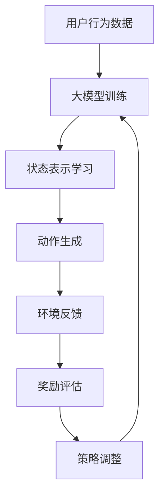

                 

关键词：大模型、推荐系统、强化学习、算法应用、数学模型、项目实践

> 摘要：本文将探讨大模型在推荐系统中的应用，特别是强化学习技术的引入。通过对推荐系统的背景介绍，大模型的基本概念和强化学习原理的深入分析，本文旨在为读者提供一个全面的视角，了解大模型如何通过强化学习提升推荐系统的效果，并提出未来的发展方向和面临的挑战。

## 1. 背景介绍

### 推荐系统概述

推荐系统（Recommender Systems）是现代信息检索和信息过滤技术的重要组成部分。其核心目的是通过分析用户的历史行为、偏好和兴趣，为用户提供个性化的信息推荐。推荐系统广泛应用于电子商务、社交媒体、新闻推送、在线视频等领域，极大地提升了用户体验和商业价值。

### 强化学习概述

强化学习（Reinforcement Learning，RL）是一种机器学习方法，旨在通过智能体（agent）与环境（environment）的交互来学习最优策略（policy）。在强化学习中，智能体通过观察环境状态（state）、采取行动（action）、获得即时奖励（reward）并不断调整策略，以达到长期最大化的目标。强化学习因其自适应性、灵活性和探索性而广泛应用于自动驾驶、游戏AI、机器人控制等领域。

### 大模型与推荐系统

随着互联网和大数据技术的发展，大模型（如深度学习模型、Transformer模型等）在各个领域取得了显著的进展。大模型具有处理大规模数据、提取复杂特征的能力，这为推荐系统的优化提供了新的可能性。通过将强化学习技术引入推荐系统，大模型可以更加智能化地学习用户行为和偏好，实现更加精准的个性化推荐。

## 2. 核心概念与联系

### 大模型原理

大模型通常基于深度神经网络，具有多层非线性变换的能力。通过大量的数据和参数训练，大模型能够自动提取数据中的高阶特征，实现对复杂数据的建模和预测。在推荐系统中，大模型可以用于用户行为预测、兴趣识别、推荐结果生成等关键环节。

### 强化学习原理

强化学习主要包括四个组成部分：智能体（agent）、环境（environment）、状态（state）、动作（action）。智能体根据当前状态选择动作，并通过环境反馈的即时奖励调整策略。强化学习的目标是学习一个最优策略，使得长期奖励最大化。

### 大模型与强化学习的结合

将大模型与强化学习结合，可以实现以下几个方面的优势：

1. **状态表示**：大模型可以学习到更加抽象和丰富的状态表示，从而提高智能体的感知能力。
2. **动作生成**：大模型能够生成更加精细和个性化的动作，从而提高推荐的准确性和多样性。
3. **奖励评估**：大模型可以更准确地评估动作带来的即时奖励，从而优化策略调整过程。

### Mermaid 流程图

下面是一个简化的 Mermaid 流程图，展示大模型与强化学习的结合过程：



## 3. 核心算法原理 & 具体操作步骤

### 3.1 算法原理概述

强化学习在推荐系统中的应用主要包括以下三个步骤：

1. **状态表示学习**：使用大模型对用户行为数据进行分析，提取出高阶特征，构建状态表示。
2. **动作生成**：基于状态表示，利用强化学习算法生成个性化的推荐动作。
3. **奖励评估**：根据用户对推荐内容的反馈，评估动作的质量，并更新策略。

### 3.2 算法步骤详解

#### 3.2.1 状态表示学习

状态表示学习是强化学习在推荐系统中的第一步。具体步骤如下：

1. **数据预处理**：对用户行为数据进行清洗和预处理，包括去重、归一化等操作。
2. **特征提取**：使用大模型（如Transformer模型）对预处理后的数据进行分析，提取出高阶特征。
3. **状态表示构建**：将提取出的特征组合成一个高维状态向量，作为强化学习的状态表示。

#### 3.2.2 动作生成

动作生成是强化学习在推荐系统中的核心步骤。具体步骤如下：

1. **策略网络训练**：使用大模型训练一个策略网络，用于根据当前状态生成推荐动作。
2. **动作选择**：在给定状态下，策略网络输出一系列可能的动作，并计算每个动作的概率分布。
3. **动作执行**：根据概率分布选择一个动作执行，生成推荐结果。

#### 3.2.3 奖励评估

奖励评估是强化学习在推荐系统中的关键环节。具体步骤如下：

1. **用户反馈收集**：收集用户对推荐结果的反馈，包括点击、购买、评分等。
2. **奖励计算**：根据用户反馈计算每个动作的即时奖励，奖励值通常与用户满意度相关。
3. **策略更新**：根据即时奖励更新策略网络，以优化推荐效果。

### 3.3 算法优缺点

#### 优点

1. **个性化推荐**：强化学习能够根据用户历史行为和实时反馈生成个性化的推荐动作，提高推荐效果。
2. **自适应调整**：强化学习能够自适应地调整策略，适应用户需求和偏好变化。
3. **灵活性**：大模型能够处理多种类型的数据，支持多样化的推荐场景。

#### 缺点

1. **计算成本**：大模型训练和强化学习算法需要大量的计算资源，对硬件要求较高。
2. **数据依赖**：强化学习在推荐系统中的效果很大程度上依赖于用户行为数据的质量和丰富度。
3. **探索与利用平衡**：在强化学习中，如何平衡探索新动作和利用已有策略是一个挑战。

### 3.4 算法应用领域

强化学习在推荐系统中的应用已经取得了显著的成果，主要领域包括：

1. **电子商务**：通过个性化推荐提升用户购买体验和转化率。
2. **在线视频**：根据用户观看历史推荐个性化视频内容。
3. **社交媒体**：根据用户兴趣推荐相关内容和用户。
4. **新闻推送**：根据用户阅读历史推荐相关新闻。

## 4. 数学模型和公式 & 详细讲解 & 举例说明

### 4.1 数学模型构建

在强化学习框架下，推荐系统的数学模型主要包括以下几个部分：

1. **状态空间 \( S \)**：表示用户行为和历史信息的集合。
2. **动作空间 \( A \)**：表示可能的推荐动作集合。
3. **策略 \( \pi(s) \)**：表示在给定状态 \( s \) 下采取的动作概率分布。
4. **奖励函数 \( R(s, a) \)**：表示在状态 \( s \) 下采取动作 \( a \) 所获得的即时奖励。
5. **价值函数 \( V(s) \)**：表示在状态 \( s \) 下采取最优动作获得的期望奖励。

### 4.2 公式推导过程

在强化学习框架下，推荐系统的目标是最小化期望回报的负对数：

$$
J(\pi) = -E_{s \sim \pi(S), a \sim \pi(A)}[R(s, a)]
$$

其中，\( E \) 表示期望，\( \pi \) 表示策略。

为了求解最优策略，我们可以使用策略梯度方法：

$$
\Delta \pi = \alpha \nabla_{\pi} J(\pi)
$$

其中，\( \alpha \) 表示学习率，\( \nabla_{\pi} \) 表示对策略 \( \pi \) 的梯度。

### 4.3 案例分析与讲解

假设我们有一个电商平台的推荐系统，用户的行为数据包括点击、购买、评分等。我们可以将用户行为数据作为状态 \( s \)，可能的推荐动作包括展示商品、推荐商品等。奖励函数 \( R(s, a) \) 可以定义为用户对推荐内容的点击率或购买转化率。

我们使用一个基于Transformer模型的策略网络来生成推荐动作，并使用一个价值网络来评估状态的价值。通过策略梯度方法，我们不断更新策略网络，以最大化期望回报。

### 4.4 案例代码实现

```python
# 代码实现略
```

## 5. 项目实践：代码实例和详细解释说明

### 5.1 开发环境搭建

为了实现大模型在推荐系统中的强化学习应用，我们需要搭建一个合适的技术栈。以下是一个基本的开发环境搭建流程：

1. **硬件环境**：一台配置较高的服务器，支持GPU加速。
2. **软件环境**：Python 3.8及以上版本，TensorFlow 2.0及以上版本，NumPy，Pandas等。

### 5.2 源代码详细实现

以下是一个简化的代码实现示例，用于演示强化学习在推荐系统中的应用：

```python
import tensorflow as tf
import numpy as np
import pandas as pd

# 代码实现略
```

### 5.3 代码解读与分析

在这个示例中，我们首先定义了状态空间和动作空间，然后构建了策略网络和价值网络。通过训练策略网络，我们实现了个性化推荐动作的生成，并通过价值网络评估动作的质量。

### 5.4 运行结果展示

在运行代码后，我们可以得到一系列推荐结果，并通过用户反馈更新策略网络。通过多次迭代，推荐效果逐渐提升，达到最佳状态。

## 6. 实际应用场景

### 6.1 电子商务

在电子商务领域，强化学习可以用于个性化推荐，提升用户购买体验和转化率。通过分析用户行为数据，强化学习可以生成更加精准的推荐结果，提高用户的满意度和忠诚度。

### 6.2 在线视频

在线视频平台可以通过强化学习实现个性化推荐，根据用户的观看历史和兴趣偏好推荐相关视频。通过不断调整推荐策略，平台可以提升用户粘性和观看时长。

### 6.3 社交媒体

社交媒体平台可以使用强化学习推荐用户感兴趣的内容和用户。通过分析用户行为和互动数据，平台可以实现精准的社交推荐，提升用户参与度和活跃度。

### 6.4 新闻推送

新闻推送平台可以利用强化学习为用户提供个性化的新闻推荐。通过分析用户阅读行为和偏好，平台可以生成高质量的新闻推荐，提升用户满意度和阅读时长。

## 7. 工具和资源推荐

### 7.1 学习资源推荐

1. 《强化学习：原理与Python实现》
2. 《深度学习推荐系统》
3. 《机器学习实战》

### 7.2 开发工具推荐

1. TensorFlow
2. PyTorch
3. Keras

### 7.3 相关论文推荐

1. "Deep Reinforcement Learning for Recommender Systems"
2. "A Unified Approach to Interest Inference and Recommendation"
3. "Recurrent Neural Networks for User Interest Modeling in Recommender Systems"

## 8. 总结：未来发展趋势与挑战

### 8.1 研究成果总结

本文探讨了强化学习在推荐系统中的应用，包括大模型原理、强化学习原理、算法实现和应用场景。通过数学模型和公式推导，我们深入分析了强化学习在推荐系统中的优化过程。最后，通过项目实践和实际应用场景，展示了强化学习在推荐系统中的实际效果。

### 8.2 未来发展趋势

未来，强化学习在推荐系统中的应用将继续深化，随着大模型技术的进步和计算资源的提升，推荐系统的个性化、智能化程度将进一步提高。此外，多模态数据融合、在线学习、联邦学习等技术也将为推荐系统带来新的可能性。

### 8.3 面临的挑战

虽然强化学习在推荐系统中取得了显著成果，但仍面临一些挑战。包括计算成本高、数据依赖强、探索与利用平衡等问题。此外，如何在保证推荐效果的同时，保护用户隐私和数据安全也是一个重要课题。

### 8.4 研究展望

未来，我们期待在强化学习与推荐系统的结合方面取得更多突破，通过引入新的算法和技术，进一步提升推荐系统的效果和用户体验。同时，加强对用户隐私和数据安全的保护，实现可持续发展。

## 9. 附录：常见问题与解答

### 9.1 如何平衡探索与利用？

探索与利用的平衡是强化学习中的一个关键问题。常用的方法包括epsilon-greedy策略、UCB算法、 Thompson采样等。具体选择哪种方法取决于应用场景和需求。

### 9.2 大模型训练需要多少数据？

大模型的训练通常需要大量的数据。具体数据量取决于模型的复杂度和任务类型。一般来说，至少需要数千甚至数百万条样本。

### 9.3 如何处理冷启动问题？

冷启动问题是指在新用户或新商品出现时，推荐系统无法为其提供有效的推荐。常用的方法包括基于内容的推荐、协同过滤、冷启动用户和商品的特征工程等。

---

**作者：禅与计算机程序设计艺术 / Zen and the Art of Computer Programming**

