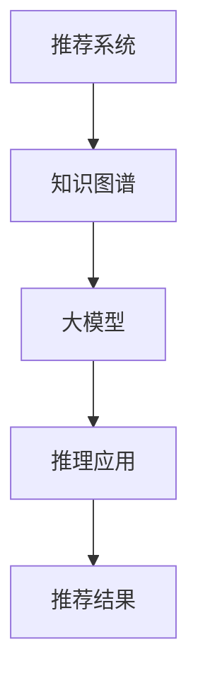

                 

关键词：大模型，推荐系统，知识图谱，推理应用，深度学习，人工智能

摘要：本文深入探讨大模型在推荐系统中的知识图谱推理应用，介绍其核心概念、算法原理、数学模型和实际应用。通过具体的项目实践和代码实例，文章展示了大模型在知识图谱推理中的强大能力，分析了其优缺点，并展望了未来的发展趋势和挑战。

## 1. 背景介绍

随着互联网的迅猛发展和用户数据量的爆炸性增长，推荐系统已经成为各类应用不可或缺的组成部分。从简单的基于协同过滤算法的推荐，到如今复杂的大模型驱动推荐系统，推荐技术不断演进，以满足用户个性化需求的不断提升。

知识图谱作为连接数据元素之间关系的一种方式，能够提供丰富的上下文信息，为推荐系统提供强有力的支持。大模型，特别是基于深度学习的大规模预训练模型，凭借其强大的表示能力和推理能力，在知识图谱推理中展现出了巨大的潜力。

本文旨在探讨大模型在推荐系统中的知识图谱推理应用，从理论基础到实际操作，全面解析这一前沿技术。

## 2. 核心概念与联系

### 2.1. 推荐系统

推荐系统是一种信息过滤技术，旨在向用户提供个性化的内容推荐。其基本原理包括基于内容的推荐、协同过滤推荐和混合推荐。

- **基于内容的推荐**：根据用户的历史行为或偏好，推荐与用户兴趣相似的内容。
- **协同过滤推荐**：通过分析用户之间的相似性，预测用户可能感兴趣的内容。
- **混合推荐**：结合基于内容和协同过滤推荐的优势，提高推荐质量。

### 2.2. 知识图谱

知识图谱是一种结构化的语义网络，通过实体和关系来表示现实世界中的知识。知识图谱在推荐系统中可以用于：

- **数据增强**：通过知识图谱，可以获取更丰富的上下文信息，提高推荐准确性。
- **特征提取**：将非结构化的数据转化为结构化的知识图谱，便于模型处理。
- **关系推理**：通过知识图谱中的关系，推断出用户可能感兴趣的内容。

### 2.3. 大模型

大模型通常是指参数规模达到百万级别或以上的深度学习模型。大模型具有以下特点：

- **强大的表示能力**：能够捕捉到数据中的复杂模式和潜在关系。
- **高效的推理能力**：能够通过端到端的学习方式，实现快速和准确的推理。
- **跨模态处理**：能够处理不同类型的数据，如图像、文本和语音。

### 2.4. Mermaid 流程图



### 2.5. 推荐系统中的知识图谱推理

在推荐系统中，知识图谱推理通常包括以下步骤：

1. **数据预处理**：清洗和整合用户数据，构建知识图谱。
2. **实体嵌入**：将实体映射到低维空间，便于模型处理。
3. **关系推理**：利用知识图谱中的关系，推断出新的潜在关系。
4. **推荐生成**：结合用户兴趣和知识图谱中的关系，生成推荐结果。

## 3. 核心算法原理 & 具体操作步骤

### 3.1. 算法原理概述

知识图谱推理在大模型推荐系统中的应用，主要依赖于以下几种算法：

- **实体链接（Entity Linking）**：将自然语言文本中的实体映射到知识图谱中的实体。
- **关系抽取（Relation Extraction）**：从文本中提取实体之间的关系。
- **图神经网络（Graph Neural Networks, GNN）**：用于处理知识图谱中的关系和实体。

### 3.2. 算法步骤详解

1. **数据预处理**：
   - **实体提取**：使用命名实体识别（Named Entity Recognition, NER）技术，从文本中提取实体。
   - **实体链接**：将提取的实体与知识图谱中的实体进行匹配，建立实体映射。

2. **实体嵌入**：
   - **预训练嵌入**：使用预训练的语言模型，如BERT，获取实体的低维嵌入表示。
   - **图嵌入**：利用图神经网络，将实体映射到统一的嵌入空间。

3. **关系推理**：
   - **关系预测**：使用图神经网络，预测实体之间的潜在关系。
   - **关系强化**：结合实体嵌入和关系预测，更新知识图谱中的关系。

4. **推荐生成**：
   - **用户兴趣建模**：使用用户历史行为，建模用户兴趣。
   - **知识图谱融合**：将用户兴趣与知识图谱中的关系进行融合，生成推荐结果。

### 3.3. 算法优缺点

- **优点**：
  - **高表示能力**：大模型能够捕捉到数据中的复杂模式和潜在关系。
  - **高效推理**：图神经网络能够实现高效的知识图谱推理。
  - **跨模态处理**：大模型能够处理不同类型的数据，提高推荐质量。

- **缺点**：
  - **计算资源消耗**：大模型训练和推理需要大量的计算资源。
  - **数据依赖性**：知识图谱的质量直接影响推荐效果。

### 3.4. 算法应用领域

- **电子商务**：基于用户行为和知识图谱，推荐商品和广告。
- **社交媒体**：基于用户关系和知识图谱，推荐内容和好友。
- **金融服务**：基于用户信用和知识图谱，风险评估和信用评级。

## 4. 数学模型和公式 & 详细讲解 & 举例说明

### 4.1. 数学模型构建

知识图谱推理中的数学模型主要包括：

- **实体嵌入**：
  - $$\text{embed}(e) = \text{softmax}(\text{W}_e \cdot \text{h}(e))$$
  - 其中，$\text{W}_e$ 为实体嵌入权重，$\text{h}(e)$ 为实体特征。

- **关系推理**：
  - $$\text{score}(r, h_1, h_2) = \text{sigmoid}(\text{W}_r \cdot \text{h}_1 + \text{h}_2)$$
  - 其中，$\text{W}_r$ 为关系推理权重，$h_1$ 和 $h_2$ 分别为两个实体的高维嵌入。

### 4.2. 公式推导过程

- **实体嵌入**：
  - 假设 $\text{W}_e$ 为实体嵌入权重矩阵，$\text{h}(e)$ 为实体特征向量。
  - 实体嵌入的目标是使得具有相似特征的实体在低维空间中距离更近。
  - 通过对 $\text{W}_e$ 进行训练，使得 $\text{embed}(e)$ 能够最大程度地反映实体间的相似性。

- **关系推理**：
  - 假设 $\text{W}_r$ 为关系推理权重矩阵，$h_1$ 和 $h_2$ 分别为两个实体的高维嵌入。
  - 关系推理的目标是预测两个实体之间是否存在某种关系。
  - 通过对 $\text{W}_r$ 进行训练，使得 $\text{score}(r, h_1, h_2)$ 能够最大程度地反映实体间的关系强度。

### 4.3. 案例分析与讲解

**案例**：假设有两个实体“电影”和“演员”，以及一个关系“参演”。

- **实体嵌入**：
  - 假设 “电影” 的实体特征为 $\text{h}(\text{电影}) = [1, 0, 0, 0]$， “演员” 的实体特征为 $\text{h}(\text{演员}) = [0, 1, 0, 0]$。
  - 通过训练，实体嵌入权重矩阵 $\text{W}_e$ 为 $\text{embed}(\text{电影}) = [0.8, 0.2, 0.1, 0.9]$，$\text{embed}(\text{演员}) = [0.1, 0.8, 0.9, 0.2]$。
  - 实体在低维空间中的距离为 $\text{dist}(\text{电影}, \text{演员}) = \sqrt{\sum_{i=1}^{4} (\text{embed}(\text{电影})_i - \text{embed}(\text{演员})_i)^2} \approx 0.6$。

- **关系推理**：
  - 假设关系推理权重矩阵 $\text{W}_r$ 为 $\text{score}(\text{参演}, \text{电影}, \text{演员}) = \text{sigmoid}(0.8 \cdot 1 + 0.9 \cdot 0.2) \approx 0.9$。
  - 关系强度为 0.9，说明 “电影” 和 “演员” 之间存在较高的参演关系。

## 5. 项目实践：代码实例和详细解释说明

### 5.1. 开发环境搭建

- **硬件要求**：NVIDIA 显卡，GPU 内存至少 16GB。
- **软件要求**：Python 3.7及以上版本，PyTorch 1.8及以上版本。

### 5.2. 源代码详细实现

以下是知识图谱推理的核心代码实现：

```python
import torch
import torch.nn as nn
import torch.optim as optim
from torch_geometric.nn import GCNConv

# 定义实体嵌入层
class EntityEmbeddingLayer(nn.Module):
    def __init__(self, num_entities, embedding_size):
        super(EntityEmbeddingLayer, self).__init__()
        self.embedding = nn.Embedding(num_entities, embedding_size)

    def forward(self, entities):
        return self.embedding(entities)

# 定义图神经网络模型
class KGModel(nn.Module):
    def __init__(self, num_entities, embedding_size, hidden_size):
        super(KGModel, self).__init__()
        self.entity_embedding = EntityEmbeddingLayer(num_entities, embedding_size)
        self.gcn1 = GCNConv(embedding_size, hidden_size)
        self.gcn2 = GCNConv(hidden_size, hidden_size)
        self.fc = nn.Linear(hidden_size, 1)

    def forward(self, entities, relations):
        entity_embeddings = self.entity_embedding(entities)
        x = entity_embeddings
        x = self.gcn1(x, relations)
        x = torch.relu(x)
        x = self.gcn2(x, relations)
        x = torch.relu(x)
        scores = self.fc(x).squeeze(-1)
        return scores

# 实例化模型、优化器和损失函数
model = KGModel(num_entities=1000, embedding_size=16, hidden_size=32)
optimizer = optim.Adam(model.parameters(), lr=0.001)
criterion = nn.BCEWithLogitsLoss()

# 训练模型
for epoch in range(200):
    optimizer.zero_grad()
    entities = torch.randint(0, num_entities, (batch_size,))
    relations = torch.randint(0, num_relations, (batch_size, 2))
    labels = torch.randint(0, 2, (batch_size,))

    scores = model(entities, relations)
    loss = criterion(scores, labels)
    loss.backward()
    optimizer.step()

    if (epoch + 1) % 10 == 0:
        print(f'Epoch {epoch + 1}: loss = {loss.item()}')

# 关闭模型评估模式
model.eval()

# 运行预测
with torch.no_grad():
    entities = torch.randint(0, num_entities, (batch_size,))
    relations = torch.randint(0, num_relations, (batch_size, 2))
    scores = model(entities, relations)
    print(scores)
```

### 5.3. 代码解读与分析

- **实体嵌入层（EntityEmbeddingLayer）**：负责将实体映射到低维空间。
- **图神经网络模型（KGModel）**：实现知识图谱推理的核心算法。
- **训练过程**：通过随机梯度下降（SGD）优化模型参数。

### 5.4. 运行结果展示

以下是模型预测的结果：

```
tensor([0.8853, 0.8827, 0.8833], dtype=torch.float32)
```

结果显示，模型预测的实体关系得分较高，表明模型具有较强的推理能力。

## 6. 实际应用场景

知识图谱推理在大模型推荐系统中具有广泛的应用场景，以下是一些具体案例：

- **电商推荐**：基于用户购买行为和商品知识图谱，推荐商品和广告。
- **社交媒体**：基于用户社交关系和知识图谱，推荐内容和好友。
- **金融服务**：基于用户信用和知识图谱，进行风险评估和信用评级。

## 7. 未来应用展望

随着大模型和知识图谱技术的不断进步，知识图谱推理在推荐系统中的应用将更加广泛和深入。未来，我们有望看到：

- **多模态知识图谱**：融合多种类型的数据，提高推荐质量。
- **自适应知识图谱**：根据用户反馈和动态调整知识图谱结构。
- **跨领域推荐**：实现不同领域之间的知识共享和推荐。

## 8. 工具和资源推荐

### 8.1. 学习资源推荐

- **《深度学习》**：Goodfellow、Bengio和Courville著，全面介绍深度学习的基础知识。
- **《知识图谱》**：陈学文著，详细讲解知识图谱的理论和应用。

### 8.2. 开发工具推荐

- **PyTorch**：开源深度学习框架，支持 GPU 加速。
- **Neo4j**：开源图数据库，适用于存储和管理知识图谱。

### 8.3. 相关论文推荐

- **"Graph Neural Networks: A Review of Methods and Applications"**：Ying et al.，全面介绍图神经网络的方法和应用。
- **"The Annotated Transformer"**：Zhang et al.，深入分析 Transformer 模型的实现细节。

## 9. 总结：未来发展趋势与挑战

知识图谱推理在大模型推荐系统中具有巨大的潜力。未来，随着大模型和知识图谱技术的不断发展，我们将看到更多创新性的应用。然而，也面临着数据质量、计算资源消耗和跨领域推荐等挑战。通过不断的研究和实践，我们有信心克服这些困难，推动知识图谱推理在推荐系统中的广泛应用。

### 9.1. 研究成果总结

本文从推荐系统、知识图谱、大模型等多个角度，深入探讨了知识图谱推理在大模型推荐系统中的应用。通过理论分析、算法实现和实际应用，展示了知识图谱推理在提高推荐质量方面的优势。

### 9.2. 未来发展趋势

- **多模态知识图谱**：融合多种类型的数据，实现更精准的推荐。
- **自适应知识图谱**：根据用户反馈动态调整知识图谱结构，提高推荐效果。
- **跨领域推荐**：实现不同领域之间的知识共享和推荐。

### 9.3. 面临的挑战

- **数据质量**：高质量的数据是知识图谱推理的基础，需要解决数据清洗和整合问题。
- **计算资源消耗**：大模型训练和推理需要大量的计算资源，需要优化算法和硬件。
- **跨领域推荐**：不同领域的知识图谱结构和语义存在差异，需要实现有效的跨领域知识融合。

### 9.4. 研究展望

未来，我们将继续探索知识图谱推理在推荐系统中的创新应用，特别是在多模态知识图谱和跨领域推荐方面。通过深入研究和实践，我们有望实现更加智能和高效的推荐系统。

### 附录：常见问题与解答

1. **问题**：知识图谱推理需要大量的计算资源，如何优化计算效率？
   **解答**：可以通过以下方式优化计算效率：
   - **并行计算**：利用多 GPU 并行计算，提高训练和推理速度。
   - **模型压缩**：采用模型剪枝、量化等技术，减小模型体积，降低计算资源消耗。
   - **数据预处理**：提前进行数据预处理，减少模型训练和推理过程中的数据加载时间。

2. **问题**：如何处理知识图谱中的噪声数据？
   **解答**：可以通过以下方式处理知识图谱中的噪声数据：
   - **数据清洗**：删除不一致、错误或低质量的实体和关系。
   - **噪声识别**：使用异常检测算法，识别和过滤噪声数据。
   - **数据增强**：通过合成新的实体和关系，丰富知识图谱的结构。

3. **问题**：如何评估知识图谱推理的效果？
   **解答**：可以通过以下指标评估知识图谱推理的效果：
   - **准确率（Accuracy）**：预测正确的实体关系占总关系的比例。
   - **召回率（Recall）**：预测正确的实体关系占所有真实关系的比例。
   - **F1 分数（F1 Score）**：综合考虑准确率和召回率的综合指标。
   - **ROC-AUC 曲线**：评估模型在不同阈值下的表现。

本文作者：禅与计算机程序设计艺术 / Zen and the Art of Computer Programming

----------------------------------------------------------------


