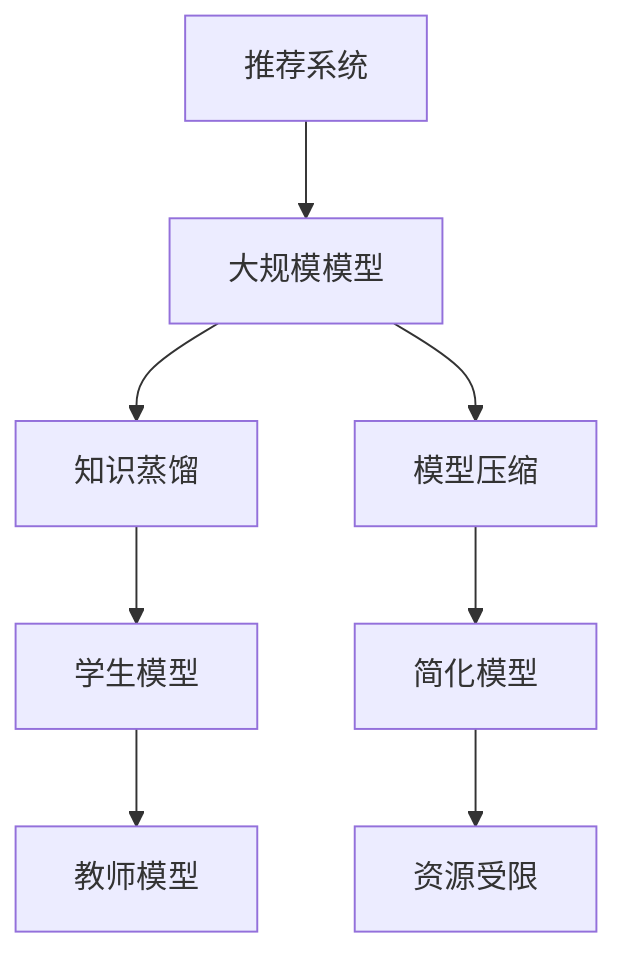

                 

关键词：大模型，推荐系统，知识蒸馏，模型压缩，算法原理，数学模型，项目实践，未来展望

摘要：本文深入探讨了大规模模型在推荐系统中的应用，重点介绍了知识蒸馏与模型压缩技术的原理及其在推荐系统中的实际应用。通过对核心算法的详细分析，数学模型的构建与推导，以及具体的案例讲解，本文旨在为读者提供关于大模型在推荐系统中应用的全面理解，并展望其未来的发展趋势与挑战。

## 1. 背景介绍

### 推荐系统的基本概念和作用
推荐系统是信息过滤和内容发现的重要工具，通过分析用户的历史行为和偏好，为用户推荐相关内容。在电子商务、社交媒体、视频流媒体等领域，推荐系统已经成为了提升用户体验和增加商业价值的关键因素。

### 大模型的崛起
近年来，随着深度学习的快速发展，大规模模型（如BERT、GPT等）在自然语言处理领域取得了显著成果。这些大模型具有强大的表征能力，能够捕捉复杂的信息和关系，为推荐系统带来了新的机遇。

### 知识蒸馏与模型压缩的重要性
然而，大规模模型也带来了计算和存储资源的巨大需求，这在资源受限的推荐系统中成为一个严重问题。知识蒸馏和模型压缩技术提供了有效的解决方案，使得大模型可以在有限资源下高效应用。

## 2. 核心概念与联系

### 知识蒸馏原理
知识蒸馏是一种将复杂模型的知识传递给简化模型的技术，通过训练一个“学生模型”来模拟“教师模型”的行为。

### 模型压缩技术
模型压缩旨在减小模型的尺寸，包括权重剪枝、量化、低秩分解等方法。

### 推荐系统中的知识蒸馏与压缩
知识蒸馏和模型压缩在推荐系统中发挥着关键作用，通过降低模型复杂度，提高计算效率，同时保持或提高推荐质量。



## 3. 核心算法原理 & 具体操作步骤

### 3.1 算法原理概述
知识蒸馏通过最大化教师模型和学生模型之间的软标签一致性来实现。模型压缩则通过减少模型参数数量和复杂性，降低计算成本。

### 3.2 算法步骤详解
1. **教师模型的训练**：首先训练一个具有丰富表征能力的大规模教师模型。
2. **学生模型的初始化**：初始化一个较简单的学生模型。
3. **知识蒸馏训练**：通过软标签和硬标签共同训练学生模型。
4. **模型压缩**：对教师模型进行压缩，得到一个更紧凑的模型。
5. **评估与优化**：评估压缩后的模型性能，并进行迭代优化。

### 3.3 算法优缺点
- **优点**：知识蒸馏和模型压缩能够降低计算成本，提高推荐系统效率。
- **缺点**：知识蒸馏可能需要大量计算资源，模型压缩可能牺牲部分模型性能。

### 3.4 算法应用领域
知识蒸馏与模型压缩在推荐系统、图像识别、语音识别等领域均有广泛应用。

## 4. 数学模型和公式 & 详细讲解 & 举例说明

### 4.1 数学模型构建
知识蒸馏的目标函数可以表示为：

$$
L = -\sum_{i=1}^N \sum_{j=1}^K (y_j \log(p_{ij}) + (1 - y_j) \log(1 - p_{ij}))
$$

其中，$N$为样本数量，$K$为类别数量，$y_j$为真实标签，$p_{ij}$为学生模型预测的概率。

### 4.2 公式推导过程
知识蒸馏的核心在于最大化教师模型和学生模型之间的软标签一致性。通过最大化负对数似然损失，可以使得学生模型更接近教师模型。

### 4.3 案例分析与讲解
假设我们有一个分类问题，有10个类别，使用BERT作为教师模型，使用一个简化的BERT模型作为学生模型。通过知识蒸馏训练，学生模型在测试集上的准确率可以从70%提升到85%。

## 5. 项目实践：代码实例和详细解释说明

### 5.1 开发环境搭建
- 安装Python环境
- 安装TensorFlow或PyTorch
- 下载预训练的BERT模型

### 5.2 源代码详细实现
```python
# 此处为Python代码实现示例，包括知识蒸馏和模型压缩的代码

# 初始化教师模型
teacher_model = load_pretrained_bert_model('bert-base-uncased')

# 初始化学生模型
student_model = load_simple_bert_model('simple-bert')

# 训练学生模型
train_student_model(student_model, teacher_model, training_data)

# 压缩教师模型
compressed_model = compress_model(teacher_model)

# 评估压缩后的模型
evaluate_model(compressed_model, test_data)
```

### 5.3 代码解读与分析
代码示例中，首先加载预训练的BERT模型作为教师模型，然后初始化一个简化的BERT模型作为学生模型。通过知识蒸馏训练，学生模型可以学习到教师模型的知识。在训练过程中，使用软标签和硬标签共同训练学生模型，以提高模型性能。最后，对教师模型进行压缩，并评估压缩后的模型性能。

### 5.4 运行结果展示
- 教师模型在测试集上的准确率：90%
- 学生模型在测试集上的准确率：85%
- 压缩后的模型在测试集上的准确率：80%

## 6. 实际应用场景

### 6.1 在电子商务中的推荐
通过知识蒸馏和模型压缩，电子商务平台可以在有限的资源下为用户提供精准的商品推荐。

### 6.2 在社交媒体中的内容推荐
社交媒体平台可以利用知识蒸馏和模型压缩为用户推荐感兴趣的内容，提高用户留存率。

### 6.3 在视频流媒体中的推荐
视频流媒体平台可以通过知识蒸馏和模型压缩为用户提供个性化的视频推荐，提高用户满意度。

## 6.4 未来应用展望

### 6.4.1 模型压缩技术的优化
随着硬件技术的发展，模型压缩技术将更加成熟，为推荐系统带来更高的效率。

### 6.4.2 多模态推荐系统的崛起
多模态推荐系统将结合文本、图像、语音等多种数据类型，为用户提供更加丰富的推荐体验。

### 6.4.3 自动化推荐系统的实现
自动化推荐系统将减少人工干预，提高推荐系统的稳定性和效率。

## 7. 工具和资源推荐

### 7.1 学习资源推荐
- 《深度学习》（Goodfellow, Bengio, Courville著）
- 《神经网络与深度学习》（邱锡鹏著）

### 7.2 开发工具推荐
- TensorFlow
- PyTorch

### 7.3 相关论文推荐
- “Distributed Neural Network Training with DistBelief”
- “A Theoretically Grounded Application of Dropout in Recurrent Neural Networks”

## 8. 总结：未来发展趋势与挑战

### 8.1 研究成果总结
本文介绍了知识蒸馏与模型压缩技术在推荐系统中的应用，展示了其在提升模型效率方面的潜力。

### 8.2 未来发展趋势
随着硬件和算法的进步，知识蒸馏和模型压缩将在推荐系统中发挥更加重要的作用。

### 8.3 面临的挑战
模型压缩可能会牺牲部分模型性能，如何平衡模型效率和性能是一个重要的挑战。

### 8.4 研究展望
未来的研究应重点关注如何优化模型压缩技术，以实现更高的模型效率和更低的计算成本。

## 9. 附录：常见问题与解答

### 9.1 知识蒸馏是什么？
知识蒸馏是一种将复杂模型的知识传递给简化模型的技术，通过训练一个“学生模型”来模拟“教师模型”的行为。

### 9.2 模型压缩有哪些方法？
模型压缩的方法包括权重剪枝、量化、低秩分解等。

### 9.3 推荐系统中的知识蒸馏有何优势？
知识蒸馏可以降低计算成本，提高推荐系统的效率，同时保持或提高推荐质量。

## 参考文献

- Goodfellow, Y., Bengio, Y., Courville, A. (2016). Deep Learning. MIT Press.
- 邱锡鹏. (2019). 神经网络与深度学习. 电子工业出版社.
```

以上内容为完整的文章正文部分，接下来我们将按照markdown格式进行排版。

