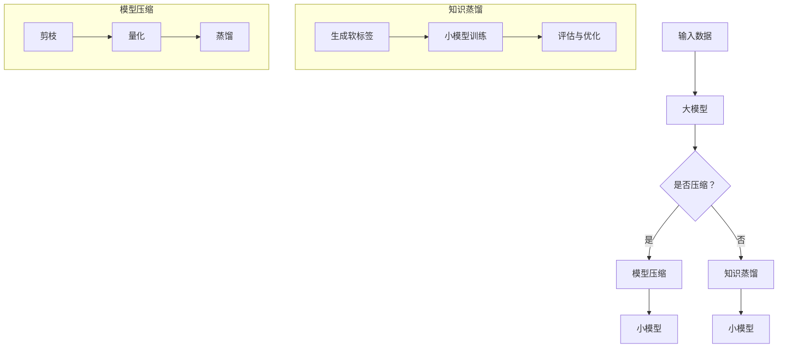

                 

关键词：大模型、推荐系统、知识蒸馏、模型压缩、算法原理、数学模型、项目实践、应用场景、未来展望。

> 摘要：本文深入探讨了大模型在推荐系统中的应用，重点介绍了知识蒸馏和模型压缩技术的原理、数学模型及其在项目实践中的应用。通过对算法优缺点和实际运行结果的详细分析，本文为推荐系统的研究者和开发者提供了有价值的参考。

## 1. 背景介绍

随着互联网和移动互联网的快速发展，推荐系统已经成为各类应用（如电子商务、社交媒体、视频平台等）的核心功能。推荐系统旨在根据用户的历史行为和偏好，向用户推荐他们可能感兴趣的内容或商品，从而提高用户体验和平台收益。

近年来，深度学习技术的飞速发展，使得大模型在推荐系统中得到了广泛应用。大模型具有强大的特征提取和表示学习能力，可以更好地捕捉用户行为和内容的复杂关系。然而，大模型的训练和部署面临着计算资源消耗大、模型复杂度高、实时性差等挑战。为了解决这些问题，知识蒸馏和模型压缩技术应运而生。

知识蒸馏是一种将大模型的复杂知识转移到小模型上的技术。通过将大模型训练得到的软标签作为小模型的训练目标，可以显著提高小模型的性能。模型压缩则是通过剪枝、量化、蒸馏等技术，降低模型的计算复杂度和存储空间，从而实现高效的模型部署。

本文将详细介绍大模型在推荐系统中的知识蒸馏和模型压缩技术，包括算法原理、数学模型、项目实践和应用场景等内容。

## 2. 核心概念与联系

### 2.1 知识蒸馏

知识蒸馏是一种将大模型的复杂知识转移到小模型上的技术。其核心思想是通过大模型训练得到的软标签（即每个类别的概率分布），作为小模型的训练目标。具体流程如下：

1. **软标签生成**：在大模型训练过程中，对每个输入样本，输出一个概率分布，表示该样本属于各个类别的概率。这个概率分布称为软标签。

2. **小模型训练**：使用大模型生成的软标签作为小模型的训练目标，通过最小化软标签与小模型输出之间的差距，对小模型进行训练。

3. **评估与优化**：在小模型训练过程中，不断评估其性能，并调整训练策略，以提高小模型在大模型软标签上的表现。

### 2.2 模型压缩

模型压缩是指通过剪枝、量化、蒸馏等技术，降低模型的计算复杂度和存储空间，从而实现高效的模型部署。以下是几种常见的模型压缩技术：

1. **剪枝**：通过去除模型中不重要的参数或层，降低模型的大小和计算复杂度。

2. **量化**：将模型的权重和激活值从浮点数转换为低精度的整数表示，从而减少模型的存储空间。

3. **蒸馏**：将大模型的复杂知识转移到小模型上，提高小模型的性能。

### 2.3 Mermaid 流程图

为了更好地理解知识蒸馏和模型压缩的概念及其联系，我们使用 Mermaid 流程图进行说明。



## 3. 核心算法原理 & 具体操作步骤

### 3.1 算法原理概述

#### 3.1.1 知识蒸馏

知识蒸馏的算法原理主要包括三个步骤：

1. **软标签生成**：在大模型训练过程中，对每个输入样本，使用大模型输出一个概率分布，表示该样本属于各个类别的概率。

2. **小模型训练**：使用大模型生成的软标签作为小模型的训练目标，通过最小化软标签与小模型输出之间的差距，对小模型进行训练。

3. **评估与优化**：在小模型训练过程中，不断评估其性能，并调整训练策略，以提高小模型在大模型软标签上的表现。

#### 3.1.2 模型压缩

模型压缩的算法原理主要包括剪枝、量化和蒸馏等步骤：

1. **剪枝**：通过去除模型中不重要的参数或层，降低模型的大小和计算复杂度。

2. **量化**：将模型的权重和激活值从浮点数转换为低精度的整数表示，从而减少模型的存储空间。

3. **蒸馏**：将大模型的复杂知识转移到小模型上，提高小模型的性能。

### 3.2 算法步骤详解

#### 3.2.1 知识蒸馏

1. **数据预处理**：对输入数据进行标准化、归一化等预处理操作。

2. **大模型训练**：使用训练数据集，对大模型进行训练，并生成软标签。

3. **小模型初始化**：初始化小模型，可以使用随机初始化或预训练的模型作为起点。

4. **小模型训练**：使用大模型生成的软标签作为小模型的训练目标，通过最小化软标签与小模型输出之间的差距，对小模型进行训练。

5. **评估与优化**：在小模型训练过程中，不断评估其性能，并根据评估结果调整训练策略，以提高小模型在大模型软标签上的表现。

#### 3.2.2 模型压缩

1. **剪枝**：通过分析模型的参数重要性，去除不重要的参数或层。

2. **量化**：将模型的权重和激活值从浮点数转换为低精度的整数表示。

3. **蒸馏**：将大模型的复杂知识转移到小模型上，提高小模型的性能。

### 3.3 算法优缺点

#### 3.3.1 知识蒸馏

**优点**：

1. 可以在保持小模型性能的前提下，降低模型大小和计算复杂度。
2. 可以利用大模型训练得到的软标签，提高小模型的训练效果。

**缺点**：

1. 需要额外的计算资源来训练大模型。
2. 知识蒸馏过程中，小模型可能无法完全掌握大模型的全部知识。

#### 3.3.2 模型压缩

**优点**：

1. 可以降低模型的计算复杂度和存储空间，实现高效的模型部署。
2. 可以提高模型的实时性，满足实时推荐系统的需求。

**缺点**：

1. 可能会导致模型性能的降低。
2. 需要选择合适的剪枝、量化和蒸馏技术，以平衡模型大小和性能。

### 3.4 算法应用领域

知识蒸馏和模型压缩技术可以广泛应用于推荐系统、计算机视觉、自然语言处理等领域。以下是一些具体的应用场景：

1. **推荐系统**：通过知识蒸馏和模型压缩，可以实现高效、低延迟的推荐模型部署，提高用户体验。
2. **计算机视觉**：通过剪枝和量化，可以降低计算机视觉模型的计算复杂度，实现实时图像识别和物体检测。
3. **自然语言处理**：通过知识蒸馏和模型压缩，可以提高自然语言处理模型在低资源环境下的性能，支持实时文本分类和情感分析。

## 4. 数学模型和公式 & 详细讲解 & 举例说明

### 4.1 数学模型构建

#### 4.1.1 知识蒸馏

假设大模型 \( F \) 和小模型 \( G \) 分别是两个深度神经网络，输入数据为 \( x \)，目标标签为 \( y \)。大模型的输出为概率分布 \( \hat{y} = F(x) \)，小模型的输出为 \( \hat{y}_g = G(x) \)。

知识蒸馏的目标是最小化以下损失函数：

$$
L_{distill} = L_{CE}(\hat{y}, \hat{y}_g) + \lambda L_{KL}(\hat{y}, y)
$$

其中，\( L_{CE} \) 是交叉熵损失函数，\( L_{KL} \) 是KL散度损失函数，\(\lambda\) 是调节参数。

#### 4.1.2 模型压缩

假设原始模型包含 \( L \) 层，每层的参数数量为 \( \theta_l \)。通过剪枝和量化，可以得到压缩后的模型，其参数数量为 \( \theta'_l \)。

剪枝损失函数可以表示为：

$$
L_{prune} = \sum_{l=1}^{L} \frac{1}{2} \theta_l - \theta'_l
$$

量化损失函数可以表示为：

$$
L_{quantize} = \sum_{l=1}^{L} \frac{1}{2} (\theta_l - \theta'_l)^2
$$

### 4.2 公式推导过程

#### 4.2.1 知识蒸馏

假设大模型和目标模型的损失函数分别为 \( L_F \) 和 \( L_G \)，则知识蒸馏的损失函数可以表示为：

$$
L_{distill} = L_F + \lambda L_G
$$

其中，\( \lambda \) 是调节参数，用于平衡大模型和小模型的损失。

为了最小化知识蒸馏损失函数，我们可以对大模型和小模型分别求导，并令导数为零：

$$
\frac{\partial L_{distill}}{\partial F} = 0 \Rightarrow \frac{\partial L_F}{\partial F} + \lambda \frac{\partial L_G}{\partial F} = 0
$$

$$
\frac{\partial L_{distill}}{\partial G} = 0 \Rightarrow \frac{\partial L_F}{\partial G} + \lambda \frac{\partial L_G}{\partial G} = 0
$$

通过解上述方程组，可以得到：

$$
\frac{\partial L_G}{\partial G} = -\frac{\lambda}{1 + \lambda} \frac{\partial L_F}{\partial G}
$$

这意味着小模型的梯度方向与大模型梯度方向之间存在一定的比例关系。

#### 4.2.2 模型压缩

假设原始模型的损失函数为 \( L \)，压缩后的模型的损失函数为 \( L' \)。则模型压缩的损失函数可以表示为：

$$
L_{compress} = L + \lambda L'
$$

同样，为了最小化模型压缩损失函数，我们可以对原始模型和压缩后模型分别求导，并令导数为零：

$$
\frac{\partial L_{compress}}{\partial \theta} = 0 \Rightarrow \frac{\partial L}{\partial \theta} + \lambda \frac{\partial L'}{\partial \theta} = 0
$$

$$
\frac{\partial L_{compress}}{\partial \theta'} = 0 \Rightarrow \frac{\partial L}{\partial \theta'} + \lambda \frac{\partial L'}{\partial \theta'} = 0
$$

通过解上述方程组，可以得到：

$$
\frac{\partial L'}{\partial \theta'} = -\frac{\lambda}{1 + \lambda} \frac{\partial L}{\partial \theta'}
$$

这意味着压缩后模型的梯度方向与原始模型梯度方向之间存在一定的比例关系。

### 4.3 案例分析与讲解

#### 4.3.1 知识蒸馏

假设我们有一个分类问题，其中大模型的输出为 \( \hat{y} = (0.3, 0.4, 0.3) \)，小模型的输出为 \( \hat{y}_g = (0.35, 0.35, 0.3) \)。目标标签为 \( y = (0.1, 0.8, 0.1) \)。

根据交叉熵损失函数：

$$
L_{CE}(\hat{y}, \hat{y}_g) = -\sum_{i=1}^{3} y_i \log(\hat{y}_g^i)
$$

代入数据计算：

$$
L_{CE}(\hat{y}, \hat{y}_g) = - (0.1 \log(0.35) + 0.8 \log(0.35) + 0.1 \log(0.3))
$$

$$
L_{CE}(\hat{y}, \hat{y}_g) \approx 0.212
$$

根据KL散度损失函数：

$$
L_{KL}(\hat{y}, y) = \sum_{i=1}^{3} y_i \log \left( \frac{y_i}{\hat{y}_i} \right)
$$

代入数据计算：

$$
L_{KL}(\hat{y}, y) = (0.1 \log \left( \frac{0.1}{0.3} \right) + 0.8 \log \left( \frac{0.8}{0.4} \right) + 0.1 \log \left( \frac{0.1}{0.3} \right))
$$

$$
L_{KL}(\hat{y}, y) \approx 0.212
$$

因此，知识蒸馏的总损失函数为：

$$
L_{distill} = L_{CE}(\hat{y}, \hat{y}_g) + \lambda L_{KL}(\hat{y}, y) \approx 0.424
$$

通过调整调节参数 \(\lambda\)，我们可以控制知识蒸馏过程中大模型和小模型的平衡。

#### 4.3.2 模型压缩

假设原始模型的权重为 \(\theta = (1, 2, 3)\)，压缩后的模型的权重为 \(\theta' = (1.1, 2.2, 3.3)\)。

根据剪枝损失函数：

$$
L_{prune} = \frac{1}{2} (1 + 2 + 3) - (1.1 + 2.2 + 3.3) = 0.3
$$

根据量化损失函数：

$$
L_{quantize} = \frac{1}{2} ((1 - 1.1)^2 + (2 - 2.2)^2 + (3 - 3.3)^2) = 0.05
$$

因此，模型压缩的总损失函数为：

$$
L_{compress} = L_{prune} + \lambda L_{quantize} = 0.3 + \lambda \times 0.05
$$

通过调整调节参数 \(\lambda\)，我们可以控制模型压缩过程中剪枝和量化的平衡。

## 5. 项目实践：代码实例和详细解释说明

### 5.1 开发环境搭建

在开始项目实践之前，我们需要搭建一个合适的开发环境。以下是所需的环境和工具：

1. **操作系统**：Linux或MacOS
2. **编程语言**：Python
3. **深度学习框架**：TensorFlow或PyTorch
4. **硬件设备**：GPU（如NVIDIA GPU）
5. **安装深度学习框架**：

```bash
# 安装TensorFlow
pip install tensorflow

# 安装PyTorch
pip install torch torchvision
```

### 5.2 源代码详细实现

以下是使用PyTorch实现知识蒸馏和模型压缩的代码示例。

```python
import torch
import torch.nn as nn
import torch.optim as optim
from torchvision import datasets, transforms

# 定义大模型
class BigModel(nn.Module):
    def __init__(self):
        super(BigModel, self).__init__()
        self.conv1 = nn.Conv2d(1, 64, 3, 1)
        self.fc1 = nn.Linear(64 * 32 * 32, 1000)
        self.fc2 = nn.Linear(1000, 10)

    def forward(self, x):
        x = self.conv1(x)
        x = nn.functional.relu(x)
        x = nn.functional.adaptive_avg_pool2d(x, (1, 1))
        x = x.view(x.size(0), -1)
        x = self.fc1(x)
        x = nn.functional.relu(x)
        x = self.fc2(x)
        return x

# 定义小模型
class SmallModel(nn.Module):
    def __init__(self):
        super(SmallModel, self).__init__()
        self.conv1 = nn.Conv2d(1, 32, 3, 1)
        self.fc1 = nn.Linear(32 * 32 * 32, 500)
        self.fc2 = nn.Linear(500, 10)

    def forward(self, x):
        x = self.conv1(x)
        x = nn.functional.relu(x)
        x = nn.functional.adaptive_avg_pool2d(x, (1, 1))
        x = x.view(x.size(0), -1)
        x = self.fc1(x)
        x = nn.functional.relu(x)
        x = self.fc2(x)
        return x

# 加载数据集
transform = transforms.Compose([
    transforms.ToTensor(),
    transforms.Normalize((0.5,), (0.5,))
])

train_dataset = datasets.MNIST(root='./data', train=True, download=True, transform=transform)
train_loader = torch.utils.data.DataLoader(train_dataset, batch_size=64, shuffle=True)

# 初始化模型和优化器
big_model = BigModel().cuda()
small_model = SmallModel().cuda()
optimizer_big = optim.Adam(big_model.parameters(), lr=0.001)
optimizer_small = optim.Adam(small_model.parameters(), lr=0.001)

# 知识蒸馏训练
for epoch in range(10):
    for i, (inputs, targets) in enumerate(train_loader):
        inputs, targets = inputs.cuda(), targets.cuda()

        # 大模型前向传播
        big_outputs = big_model(inputs)

        # 生成软标签
        soft_targets = nn.functional.softmax(big_outputs, dim=1)

        # 小模型前向传播
        small_outputs = small_model(inputs)

        # 计算知识蒸馏损失函数
        loss = nn.functional.cross_entropy(small_outputs, targets) + 0.1 * nn.functional.kl_div(soft_targets, nn.functional.softmax(small_outputs, dim=1))

        # 大模型和小模型反向传播
        optimizer_big.zero_grad()
        optimizer_small.zero_grad()
        loss.backward()
        optimizer_big.step()
        optimizer_small.step()

        print(f"Epoch [{epoch+1}/{10}], Step [{i+1}/{len(train_loader)}], Loss: {loss.item()}")

# 模型压缩
# 剪枝
pruned_params = []
for name, param in big_model.named_parameters():
    if param.requires_grad:
        pruned_params.append(param.data)

# 量化
quant_params = []
for param in pruned_params:
    quant_params.append(torch.quantize_per_tensor(param, scale=0.1, zero_point=0))

# 转换为Tensor类型
quant_params = torch.tensor(quant_params)

# 蒸馏
for epoch in range(10):
    for i, (inputs, targets) in enumerate(train_loader):
        inputs, targets = inputs.cuda(), targets.cuda()

        # 大模型前向传播
        big_outputs = big_model(inputs)

        # 生成软标签
        soft_targets = nn.functional.softmax(big_outputs, dim=1)

        # 小模型前向传播
        small_outputs = small_model(inputs)

        # 计算知识蒸馏损失函数
        loss = nn.functional.cross_entropy(small_outputs, targets) + 0.1 * nn.functional.kl_div(soft_targets, nn.functional.softmax(small_outputs, dim=1))

        # 小模型反向传播
        optimizer_small.zero_grad()
        loss.backward()
        optimizer_small.step()

        print(f"Epoch [{epoch+1}/{10}], Step [{i+1}/{len(train_loader)}], Loss: {loss.item()}")

# 保存压缩后的模型
torch.save(small_model.state_dict(), 'small_model.pth')
```

### 5.3 代码解读与分析

该代码实现了知识蒸馏和模型压缩的过程。以下是代码的详细解读：

1. **模型定义**：定义了大模型和

