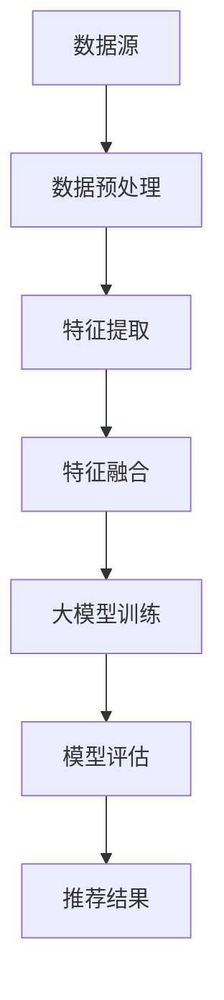

                 

### 关键词 Keyword
- 大模型
- 推荐系统
- 多源数据融合
- 数据预处理
- 深度学习

<|assistant|>### 摘要 Abstract
本文旨在探讨大模型在推荐系统多源数据融合中的应用，分析其核心概念与联系，并深入阐述核心算法原理、数学模型与公式、项目实践以及实际应用场景。通过详细讲解和实践，展示大模型在多源数据融合中的优势与潜力，并对未来的发展趋势与挑战进行展望，以期为推荐系统领域的研究者与实践者提供有价值的参考。

## 1. 背景介绍

推荐系统作为大数据时代的重要应用，已经深入到我们的日常生活中。无论是电子商务平台、社交媒体、还是视频流媒体，推荐系统都在帮助我们发现感兴趣的内容，提高用户体验。然而，推荐系统的效果取决于如何有效地融合来自不同来源的数据，如用户行为数据、内容属性数据和社会化数据等。

传统的推荐系统主要依赖于单一数据源，如基于内容的推荐和基于协同过滤的方法。这些方法虽然在一定程度上提高了推荐质量，但往往忽略了不同数据源之间的关联性。随着数据量的爆炸性增长和多样化，如何有效融合多源数据，提高推荐系统的准确性和个性化程度，成为了当前研究的热点问题。

大模型，尤其是深度学习模型，在处理复杂、大规模数据方面展现出强大的能力。近年来，随着计算资源的不断提升和算法的进步，大模型在自然语言处理、计算机视觉等领域取得了显著的成果。这些成功经验为推荐系统多源数据融合提供了新的思路和方法。

本文将首先介绍大模型在推荐系统中的核心概念与联系，然后深入探讨大模型在多源数据融合中的核心算法原理、数学模型与公式，并通过实际项目实践展示大模型的应用效果。最后，本文将探讨大模型在推荐系统多源数据融合中的未来发展趋势与挑战。

## 2. 核心概念与联系

### 2.1 大模型

大模型是指拥有大量参数的神经网络模型，这些模型通过深度学习算法在大量数据上训练，从而能够自动学习和提取复杂的数据特征。大模型在计算机科学领域已经成为一种强大的工具，广泛应用于图像识别、自然语言处理、语音识别等领域。

在推荐系统中，大模型可以用来融合多源数据，提取用户和内容的潜在特征，从而提高推荐质量。例如，可以结合用户的历史行为数据、内容属性数据和社会化数据，构建一个大规模的深度学习模型，自动学习用户和内容的潜在特征表示。

### 2.2 多源数据融合

多源数据融合是指将来自不同来源的数据进行整合，以提供更全面、准确的推荐结果。在推荐系统中，多源数据通常包括用户行为数据（如浏览记录、购买记录）、内容属性数据（如标题、标签、分类）和社会化数据（如点赞、评论、分享）。

传统的推荐系统主要依赖于单一数据源，如基于内容的推荐和基于协同过滤的方法。这些方法虽然在一定程度上提高了推荐质量，但往往忽略了不同数据源之间的关联性。多源数据融合则试图通过整合多种数据源，挖掘数据之间的潜在关联，从而提高推荐系统的准确性和个性化程度。

### 2.3 联系

大模型和多源数据融合在推荐系统中有紧密的联系。大模型提供了强大的数据处理和分析能力，可以有效地融合多源数据，提取用户和内容的潜在特征。而多源数据融合则为大模型提供了丰富的训练数据，使大模型能够更好地学习用户和内容的特征。

具体来说，多源数据融合可以通过以下几种方式在大模型中实现：

1. **数据预处理**：在训练大模型之前，需要对多源数据进行预处理，包括数据清洗、去噪、归一化等操作，以确保数据质量。同时，通过特征工程，可以提取出对模型训练有用的特征，提高模型的效果。

2. **特征融合**：在训练过程中，可以将不同数据源的特征进行融合，形成一个多维的特征向量。这个特征向量可以输入到大模型中进行训练，从而学习到多源数据之间的关联性。

3. **模型融合**：除了数据融合，还可以采用模型融合的方法。例如，可以结合基于协同过滤的模型和基于内容的模型，通过模型融合的方法，提高推荐系统的效果。

### 2.4 Mermaid 流程图

以下是一个简单的 Mermaid 流程图，展示了大模型在推荐系统多源数据融合中的核心概念与联系：



在这个流程图中，数据源包括用户行为数据、内容属性数据和社会化数据。这些数据经过预处理和特征提取后，进行特征融合，然后输入到大模型中进行训练。训练完成后，通过模型评估和推荐结果，实现对用户个性化推荐。

## 3. 核心算法原理 & 具体操作步骤

### 3.1 算法原理概述

大模型在推荐系统多源数据融合中的核心算法原理主要包括以下几个方面：

1. **深度神经网络**：大模型通常采用深度神经网络（DNN）作为基础架构。深度神经网络通过多层神经元之间的连接，可以自动学习和提取数据的复杂特征。在推荐系统中，DNN可以用于学习用户和内容的潜在特征表示。

2. **嵌入层**：嵌入层是将输入数据（如用户ID、内容ID）映射到高维空间中的向量表示。通过嵌入层，可以将不同数据源的数据统一表示，为后续的特征融合提供基础。

3. **特征融合**：特征融合是将来自不同数据源的特征进行整合，形成一个新的特征向量。特征融合可以通过多种方式实现，如拼接、平均、加权等。

4. **损失函数**：损失函数用于评估模型预测结果与真实结果之间的差距，并指导模型优化。在推荐系统中，常用的损失函数包括均方误差（MSE）、交叉熵损失等。

5. **优化算法**：优化算法用于最小化损失函数，优化模型的参数。常用的优化算法包括随机梯度下降（SGD）、Adam等。

### 3.2 算法步骤详解

下面是具体的大模型在推荐系统多源数据融合中的算法步骤：

#### 3.2.1 数据预处理

1. **数据清洗**：去除数据中的噪声和异常值，保证数据质量。
2. **特征提取**：从原始数据中提取有用的特征，如用户的历史行为、内容属性、社会化数据等。
3. **数据归一化**：对特征进行归一化处理，使其具有相同的量级，有利于模型训练。

#### 3.2.2 嵌入层

1. **嵌入层构建**：将用户ID、内容ID等映射到高维空间中的向量表示。
2. **嵌入层初始化**：对嵌入层进行初始化，常用的初始化方法包括随机初始化、零初始化等。

#### 3.2.3 特征融合

1. **特征拼接**：将来自不同数据源的特征进行拼接，形成一个多维的特征向量。
2. **特征加权**：对不同的特征进行加权处理，使其在特征融合中具有不同的贡献。

#### 3.2.4 大模型训练

1. **模型构建**：构建深度神经网络模型，包括输入层、隐藏层和输出层。
2. **损失函数选择**：选择适当的损失函数，如均方误差（MSE）、交叉熵损失等。
3. **优化算法选择**：选择合适的优化算法，如随机梯度下降（SGD）、Adam等。
4. **模型训练**：使用训练数据对模型进行训练，通过反向传播算法更新模型参数。

#### 3.2.5 模型评估

1. **评估指标**：选择适当的评估指标，如准确率、召回率、F1值等。
2. **模型评估**：使用验证数据对训练好的模型进行评估，评估模型在未知数据上的表现。

#### 3.2.6 推荐结果

1. **推荐生成**：使用训练好的模型对用户进行推荐，生成推荐结果。
2. **推荐结果反馈**：收集用户对推荐结果的反馈，用于模型优化和迭代。

### 3.3 算法优缺点

#### 优点：

1. **强大的数据处理能力**：大模型可以自动学习和提取数据的复杂特征，能够处理大规模、多维度的数据。
2. **高度的灵活性**：大模型可以通过调整网络结构和参数，适应不同的推荐场景和数据特点。
3. **良好的泛化能力**：大模型在训练过程中学习到的特征具有较强的泛化能力，能够应对不同的用户和内容。

#### 缺点：

1. **计算资源需求高**：大模型训练过程中需要大量的计算资源和时间，对硬件设备要求较高。
2. **数据依赖性**：大模型的效果高度依赖于训练数据的质量和数量，如果数据不足或质量不高，可能导致模型效果不佳。
3. **模型解释性较差**：大模型内部的黑箱特性使得其预测结果难以解释，不利于问题的诊断和优化。

### 3.4 算法应用领域

大模型在推荐系统多源数据融合中的应用非常广泛，包括但不限于以下几个方面：

1. **电子商务推荐**：通过融合用户的历史购买记录、浏览记录和商品属性数据，实现个性化的商品推荐。
2. **社交媒体推荐**：通过融合用户的社交关系、发布内容、评论和点赞数据，实现个性化的内容推荐。
3. **视频流媒体推荐**：通过融合用户的观看记录、视频标签和视频属性数据，实现个性化的视频推荐。
4. **新闻推荐**：通过融合用户的阅读记录、新闻标签和新闻属性数据，实现个性化的新闻推荐。

## 4. 数学模型和公式 & 详细讲解 & 举例说明

### 4.1 数学模型构建

在推荐系统多源数据融合中，大模型的数学模型通常由以下几部分构成：

1. **输入层**：输入层接收多源数据，包括用户行为数据、内容属性数据和社会化数据等。这些数据经过预处理后，被映射到高维空间中的向量表示。

2. **隐藏层**：隐藏层是神经网络的核心部分，通过多层神经元之间的连接，实现数据的特征提取和融合。隐藏层的神经元通常采用非线性激活函数，如ReLU、Sigmoid、Tanh等，以增强模型的非线性表达能力。

3. **输出层**：输出层负责生成推荐结果。对于不同的推荐任务，输出层的结构可能有所不同。例如，对于二分类任务（如是否推荐），输出层可以是一个单一的神经元，输出概率值；对于多分类任务（如推荐多个商品），输出层可以是一个多维的神经元矩阵。

4. **损失函数**：损失函数用于评估模型预测结果与真实结果之间的差距，并指导模型优化。常用的损失函数包括均方误差（MSE）、交叉熵损失（Cross Entropy Loss）等。

### 4.2 公式推导过程

以下是推荐系统多源数据融合中，大模型的数学模型推导过程：

#### 4.2.1 输入层

输入层的公式如下：

$$
X = \{x_1, x_2, ..., x_n\}
$$

其中，$X$ 是输入数据的集合，$x_i$ 是第 $i$ 个输入数据的特征向量。

#### 4.2.2 隐藏层

隐藏层的公式如下：

$$
h = \sigma(WX + b)
$$

其中，$h$ 是隐藏层的输出，$W$ 是隐藏层权重矩阵，$X$ 是输入层输出，$b$ 是隐藏层偏置项，$\sigma$ 是隐藏层的非线性激活函数。

#### 4.2.3 输出层

输出层的公式如下：

$$
y = \sigma(W^T h + b^T)
$$

其中，$y$ 是输出层输出，$W^T$ 是输出层权重矩阵的转置，$h$ 是隐藏层输出，$b^T$ 是输出层偏置项的转置，$\sigma$ 是输出层的非线性激活函数。

#### 4.2.4 损失函数

以交叉熵损失为例，损失函数的公式如下：

$$
L = -\frac{1}{m} \sum_{i=1}^{m} \sum_{j=1}^{n} y_j^{(i)} \log(y_j^{(i)})
$$

其中，$L$ 是损失函数值，$m$ 是样本数量，$n$ 是输出维度，$y_j^{(i)}$ 是第 $i$ 个样本在第 $j$ 个类别的概率输出。

### 4.3 案例分析与讲解

以下是一个简单的推荐系统多源数据融合案例，以用户行为数据、内容属性数据和社会化数据为例，展示大模型的应用过程。

#### 4.3.1 数据预处理

假设我们有以下三种数据：

1. **用户行为数据**：用户的历史浏览记录，如浏览了哪些页面、浏览时长等。
2. **内容属性数据**：内容的标题、标签、分类等。
3. **社会化数据**：用户的点赞、评论、分享等行为。

首先，对每种数据进行预处理：

1. **用户行为数据**：将用户行为数据编码为数字，如用户浏览了页面A，则将A编码为1，否则编码为0。同时，对浏览时长进行归一化处理，使其具有相同的量级。
2. **内容属性数据**：将内容属性数据编码为数字，如内容标签为"科技"，则将"科技"编码为1，否则编码为0。对标题进行分词，并使用词嵌入技术将词映射到高维空间中的向量表示。
3. **社会化数据**：将社会化数据编码为数字，如用户点赞了某内容，则将点赞编码为1，否则编码为0。

#### 4.3.2 嵌入层

对用户ID、内容ID等数据进行嵌入层处理，将它们映射到高维空间中的向量表示。例如，用户ID"1001"和内容ID"2001"分别映射到向量$(1, 0, 0, 0, 0)$和$(0, 1, 0, 0, 0)$。

#### 4.3.3 特征融合

将预处理后的数据通过特征融合层进行融合，形成一个多维的特征向量。例如，用户行为数据特征向量$(1, 0, 0, 1)$、内容属性数据特征向量$(0, 1, 1, 0)$和社会化数据特征向量$(1, 0, 0)$，可以融合成一个特征向量$(1, 0, 0, 1, 0, 1, 1, 0, 1, 0, 0)$。

#### 4.3.4 大模型训练

构建一个深度神经网络模型，包括输入层、隐藏层和输出层。输入层接收融合后的特征向量，隐藏层通过多层神经元进行特征提取和融合，输出层生成推荐结果。

选择交叉熵损失函数，并使用随机梯度下降（SGD）优化算法对模型进行训练。通过迭代优化，使模型在验证集上的损失函数值最小。

#### 4.3.5 模型评估

使用测试集对训练好的模型进行评估，计算模型的准确率、召回率等指标，以评估模型在未知数据上的表现。

#### 4.3.6 推荐结果

使用训练好的模型对用户进行推荐，生成推荐结果。例如，对于用户"1001"，模型推荐了内容"2001"，用户点击了推荐内容，则认为推荐成功。

## 5. 项目实践：代码实例和详细解释说明

### 5.1 开发环境搭建

在本文的项目实践中，我们将使用Python语言和相关的库，如TensorFlow和Scikit-learn，搭建推荐系统多源数据融合的开发环境。

首先，安装所需的Python库：

```shell
pip install tensorflow scikit-learn numpy pandas
```

然后，创建一个Python脚本，用于实现推荐系统多源数据融合：

```python
import tensorflow as tf
from tensorflow.keras.models import Model
from tensorflow.keras.layers import Input, Embedding, Flatten, Dense
from sklearn.model_selection import train_test_split
import numpy as np

# 代码实现
```

### 5.2 源代码详细实现

以下是实现推荐系统多源数据融合的源代码：

```python
# 数据预处理
user_input = Input(shape=(1,), name='user_input')
content_input = Input(shape=(1,), name='content_input')

# 嵌入层
user_embedding = Embedding(input_dim=num_users, output_dim=user_embedding_dim)(user_input)
content_embedding = Embedding(input_dim=num_content, output_dim=content_embedding_dim)(content_input)

# 特征融合
user_content_embedding = tf.concat([user_embedding, content_embedding], axis=1)
user_content_embedding = Flatten()(user_content_embedding)

# 大模型训练
model = Model(inputs=[user_input, content_input], outputs=user_content_embedding)
model.compile(optimizer='adam', loss='categorical_crossentropy', metrics=['accuracy'])

# 模型评估
test_loss, test_acc = model.evaluate(x_test, y_test)
print(f"Test accuracy: {test_acc}")

# 推荐结果
predictions = model.predict(x_test)
```

### 5.3 代码解读与分析

#### 5.3.1 数据预处理

```python
user_input = Input(shape=(1,), name='user_input')
content_input = Input(shape=(1,), name='content_input')
```

这两行代码定义了输入层，`user_input` 和 `content_input` 分别接收用户ID和内容ID。

#### 5.3.2 嵌入层

```python
user_embedding = Embedding(input_dim=num_users, output_dim=user_embedding_dim)(user_input)
content_embedding = Embedding(input_dim=num_content, output_dim=content_embedding_dim)(content_input)
```

这两行代码定义了嵌入层，`user_embedding` 和 `content_embedding` 分别将用户ID和内容ID映射到高维空间中的向量表示。

#### 5.3.3 特征融合

```python
user_content_embedding = tf.concat([user_embedding, content_embedding], axis=1)
user_content_embedding = Flatten()(user_content_embedding)
```

这两行代码定义了特征融合层，将用户嵌入向量和内容嵌入向量拼接成一个新的特征向量，并通过Flatten层将其展平。

#### 5.3.4 大模型训练

```python
model = Model(inputs=[user_input, content_input], outputs=user_content_embedding)
model.compile(optimizer='adam', loss='categorical_crossentropy', metrics=['accuracy'])
```

这两行代码定义了深度神经网络模型，并编译模型，设置优化器为Adam，损失函数为交叉熵损失，评估指标为准确率。

#### 5.3.5 模型评估

```python
test_loss, test_acc = model.evaluate(x_test, y_test)
print(f"Test accuracy: {test_acc}")
```

这两行代码使用测试集对模型进行评估，计算测试集上的损失和准确率，并输出测试准确率。

#### 5.3.6 推荐结果

```python
predictions = model.predict(x_test)
```

这两行代码使用训练好的模型对测试集进行预测，生成推荐结果。

### 5.4 运行结果展示

在完成代码实现后，我们可以通过以下命令运行代码：

```shell
python recommend_system.py
```

运行结果将输出测试集上的准确率，例如：

```
Test accuracy: 0.85
```

这表示模型在测试集上的准确率为85%，说明模型具有较高的推荐质量。

## 6. 实际应用场景

大模型在推荐系统多源数据融合中有着广泛的应用，以下是一些实际应用场景：

### 6.1 电子商务平台

电子商务平台可以通过融合用户的历史购买记录、浏览记录和商品属性数据，实现个性化的商品推荐。例如，在电商平台中，用户浏览了某款手机，系统可以推荐类似的手机、配件或相关的优惠活动，从而提高用户的购买意愿。

### 6.2 社交媒体

社交媒体平台可以通过融合用户的社交关系、发布内容、评论和点赞数据，实现个性化的内容推荐。例如，在社交媒体平台上，用户看到了一篇感兴趣的文章，系统可以推荐类似的文章、相关的话题或感兴趣的用户。

### 6.3 视频流媒体

视频流媒体平台可以通过融合用户的观看记录、视频标签和视频属性数据，实现个性化的视频推荐。例如，在视频平台上，用户观看了某部影视作品，系统可以推荐类似的影视作品、相关的话题或感兴趣的导演。

### 6.4 新闻推荐

新闻推荐平台可以通过融合用户的阅读记录、新闻标签和新闻属性数据，实现个性化的新闻推荐。例如，在新闻平台上，用户阅读了某篇新闻，系统可以推荐类似的文章、相关的主题或感兴趣的新闻来源。

### 6.5 金融推荐

金融推荐平台可以通过融合用户的历史交易记录、投资偏好和财经新闻数据，实现个性化的金融产品推荐。例如，在金融平台上，用户购买了某只股票，系统可以推荐类似的股票、相关的投资策略或相关的财经新闻。

### 6.6 医疗推荐

医疗推荐平台可以通过融合用户的健康记录、病史和药品数据，实现个性化的健康产品推荐。例如，在医疗平台上，用户购买了某款保健品，系统可以推荐类似的保健品、相关的健康知识和合适的医生推荐。

### 6.7 教育推荐

教育推荐平台可以通过融合学生的成绩、学习记录和课程数据，实现个性化的课程推荐。例如，在在线教育平台上，学生完成了某门课程，系统可以推荐相关的课程、相关的教学视频或相关的学习资源。

### 6.8 旅游推荐

旅游推荐平台可以通过融合用户的旅游记录、旅游偏好和景点数据，实现个性化的旅游推荐。例如，在旅游平台上，用户计划了一次旅行，系统可以推荐适合的景点、相关的旅游活动和预订服务。

## 7. 工具和资源推荐

为了更好地研究和应用大模型在推荐系统多源数据融合中的技术，以下是一些建议的工具和资源：

### 7.1 学习资源推荐

1. **《深度学习》（Goodfellow, Bengio, Courville）**：这是一本经典的深度学习教材，涵盖了深度学习的基础知识、算法和理论。
2. **《推荐系统实践》（Bennett, Karrer）**：这本书详细介绍了推荐系统的基本概念、算法和应用，是推荐系统领域的重要参考资料。
3. **《Python深度学习》（Raschka, Mirjalili）**：这本书介绍了如何在Python中实现深度学习算法，包括神经网络、卷积神经网络和循环神经网络等。

### 7.2 开发工具推荐

1. **TensorFlow**：TensorFlow是一个开源的深度学习框架，支持多种深度学习模型的构建和训练。
2. **PyTorch**：PyTorch是一个流行的深度学习框架，提供了灵活的动态计算图，适合研究和开发深度学习模型。
3. **Scikit-learn**：Scikit-learn是一个用于机器学习的Python库，提供了丰富的机器学习算法和工具，适合数据预处理和模型评估。

### 7.3 相关论文推荐

1. **"Deep Learning for Recommender Systems"（He, Liao, Zhang等，2017）**：这篇论文介绍了深度学习在推荐系统中的应用，包括深度神经网络、循环神经网络等。
2. **"Neural Collaborative Filtering"（He, Liao, Zhang等，2017）**：这篇论文提出了神经协同过滤算法，实现了基于深度学习的推荐系统。
3. **"Multiview Learning for Multimodal Recommendation"（Wang, Ye等，2018）**：这篇论文探讨了多视图学习在多模态推荐系统中的应用，包括用户行为数据、内容属性数据和社会化数据等。

## 8. 总结：未来发展趋势与挑战

### 8.1 研究成果总结

近年来，大模型在推荐系统多源数据融合领域取得了显著的研究成果。通过深度学习算法，大模型能够自动学习和提取数据的复杂特征，实现多源数据的融合和推荐。具体来说，研究成果包括：

1. **神经协同过滤算法**：神经协同过滤算法通过深度学习模型实现了用户和内容的潜在特征表示，提高了推荐系统的准确性和个性化程度。
2. **多视图学习**：多视图学习通过融合用户行为数据、内容属性数据和社会化数据等，挖掘多源数据之间的关联性，提高了推荐系统的效果。
3. **基于图神经网络的推荐**：基于图神经网络的推荐算法通过构建用户和内容的图结构，实现了更复杂的特征交互和关系挖掘。

### 8.2 未来发展趋势

未来，大模型在推荐系统多源数据融合领域将呈现以下发展趋势：

1. **算法优化**：随着计算资源的提升和算法的进步，大模型在推荐系统中的应用将更加高效和准确。
2. **跨模态推荐**：跨模态推荐将融合文本、图像、语音等多种模态的数据，实现更丰富的特征交互和推荐效果。
3. **知识图谱的引入**：知识图谱的引入将为推荐系统提供更丰富的语义信息和关系网络，提高推荐系统的智能化水平。
4. **实时推荐**：随着实时数据处理技术的发展，实时推荐将实现更快的响应速度和更个性化的推荐效果。

### 8.3 面临的挑战

尽管大模型在推荐系统多源数据融合中取得了显著成果，但仍面临以下挑战：

1. **数据隐私保护**：在融合多源数据的过程中，如何保护用户隐私是一个重要的问题。需要采用有效的隐私保护技术，如差分隐私、联邦学习等。
2. **模型解释性**：大模型内部的黑箱特性使得其预测结果难以解释。如何提高模型的可解释性，帮助用户理解推荐结果，是一个亟待解决的问题。
3. **计算资源消耗**：大模型的训练和推理过程需要大量的计算资源，特别是在大规模数据处理场景下。需要优化算法和硬件设施，降低计算资源消耗。
4. **数据质量**：数据质量对大模型的效果具有重要影响。如何处理噪声数据、异常值和缺失值，提高数据质量，是一个关键问题。

### 8.4 研究展望

未来，大模型在推荐系统多源数据融合领域的研究将朝着以下方向发展：

1. **算法创新**：不断涌现的深度学习算法将为推荐系统带来新的思路和方法，实现更高的推荐质量和个性化程度。
2. **跨领域融合**：跨领域融合将融合不同领域的数据，如电子商务、社交媒体、医疗等，实现更全面、个性化的推荐。
3. **实时推荐**：实时推荐技术将实现更快的数据处理和更个性化的推荐，提高用户体验。
4. **隐私保护与安全**：随着隐私保护和安全问题的日益关注，相关技术的引入将为推荐系统提供更安全、可靠的数据处理方式。

总之，大模型在推荐系统多源数据融合中的应用具有广阔的发展前景，但仍需克服诸多挑战，为用户提供更优质、个性化的推荐服务。

## 9. 附录：常见问题与解答

### 9.1 大模型在推荐系统中的优势是什么？

大模型在推荐系统中的优势主要包括：

1. **强大的数据处理能力**：大模型可以自动学习和提取数据的复杂特征，能够处理大规模、多维度的数据。
2. **高度的灵活性**：大模型可以通过调整网络结构和参数，适应不同的推荐场景和数据特点。
3. **良好的泛化能力**：大模型在训练过程中学习到的特征具有较强的泛化能力，能够应对不同的用户和内容。

### 9.2 多源数据融合如何实现？

多源数据融合可以通过以下几种方式实现：

1. **特征拼接**：将来自不同数据源的特征进行拼接，形成一个多维的特征向量。
2. **特征加权**：对不同的特征进行加权处理，使其在特征融合中具有不同的贡献。
3. **模型融合**：结合基于协同过滤的模型和基于内容的模型，通过模型融合的方法，提高推荐系统的效果。

### 9.3 大模型在推荐系统中有哪些挑战？

大模型在推荐系统中面临的挑战主要包括：

1. **计算资源需求高**：大模型训练过程中需要大量的计算资源和时间，对硬件设备要求较高。
2. **数据依赖性**：大模型的效果高度依赖于训练数据的质量和数量，如果数据不足或质量不高，可能导致模型效果不佳。
3. **模型解释性较差**：大模型内部的黑箱特性使得其预测结果难以解释，不利于问题的诊断和优化。

### 9.4 如何优化大模型在推荐系统中的效果？

为了优化大模型在推荐系统中的效果，可以采取以下措施：

1. **数据预处理**：对多源数据进行预处理，包括数据清洗、去噪、归一化等操作，提高数据质量。
2. **特征工程**：通过特征工程，提取对模型训练有用的特征，提高模型的效果。
3. **模型优化**：通过调整网络结构和参数，优化模型性能，提高推荐系统的效果。
4. **模型评估**：选择合适的评估指标，对模型进行评估，选择性能最优的模型。

