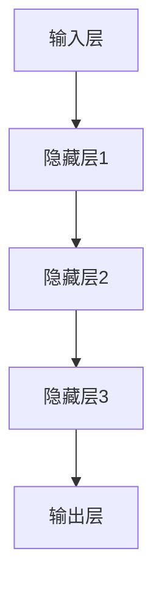
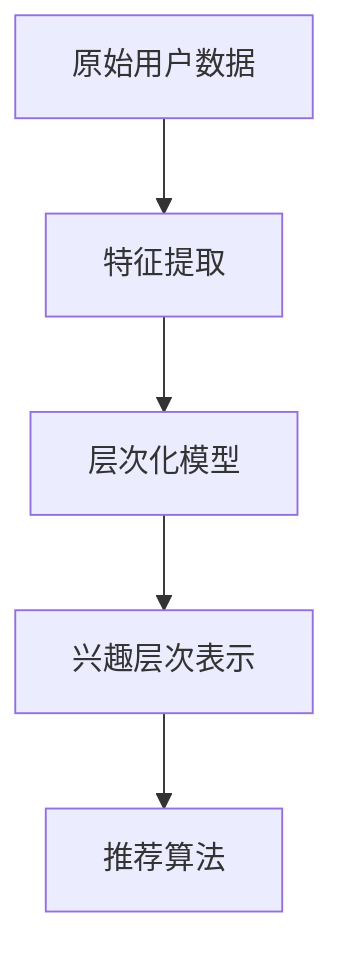

                 

 关键词：大模型，推荐系统，用户兴趣，层次化表示，算法原理，数学模型，项目实践，应用场景，未来展望

> 摘要：本文深入探讨了大规模机器学习模型在推荐系统中对用户兴趣层次化表示的应用。通过介绍大模型的核心概念、原理及其与推荐系统的结合，详细解析了其数学模型和算法步骤，并通过具体项目实践展示了其实际应用效果。文章旨在为读者提供全面的技术视角，助力理解大模型在推荐系统中的价值与挑战。

## 1. 背景介绍

随着互联网的快速发展，推荐系统已成为各种在线平台的核心功能，从电子商务网站到社交媒体，从音乐流媒体到新闻资讯，推荐系统无处不在。然而，推荐系统的效果取决于能否准确捕捉和表示用户的兴趣。用户兴趣的层次化表示是一个复杂的问题，它要求系统能够动态地理解和适应用户需求的多样性。

传统的推荐系统主要依赖于用户的历史行为数据，如点击、购买、评分等，这些方法往往在处理用户兴趣的多样性方面存在局限性。而随着深度学习和大数据技术的进步，大规模机器学习模型（大模型）在推荐系统中的应用逐渐成为研究热点。大模型具有强大的数据处理能力和复杂的结构，能够从海量数据中提取深层特征，从而更准确地表示用户的兴趣。

本文将探讨大模型在推荐系统用户兴趣层次化表示中的应用，旨在通过深入的理论分析和实践案例，揭示大模型在该领域的价值与潜力。

### 1.1 大模型的基本概念

大模型是指那些拥有数百万至数十亿参数的机器学习模型，如深度神经网络（DNN）、循环神经网络（RNN）和变压器（Transformer）等。这些模型能够通过多层非线性变换，从原始数据中学习到具有高抽象度的特征表示。大模型的优势在于其能够处理复杂的任务，并且在大规模数据集上表现出色。

### 1.2 大模型的发展历程

大模型的发展历程可以追溯到20世纪80年代，当时人工神经网络（ANN）开始在计算机视觉和自然语言处理等领域展示出潜力。随着计算能力的提升和大数据的普及，大模型的规模和复杂度也在不断增长。特别是在2012年，AlexNet在ImageNet竞赛中取得突破性成绩，标志着深度学习进入了一个新的时代。

### 1.3 大模型与推荐系统的结合

大模型在推荐系统中的应用，主要是通过以下几个方面实现的：

1. **用户表示**：大模型可以学习到用户的复杂兴趣偏好，从而生成更加精细和个性化的用户特征向量。
2. **内容表示**：大模型可以分析用户历史行为和内容数据，生成高质量的内容特征向量。
3. **推荐算法**：大模型可以作为推荐算法的核心部分，如协同过滤算法、基于内容的推荐算法等。

## 2. 核心概念与联系

在讨论大模型在推荐系统中用户兴趣层次化表示的应用之前，我们需要明确几个核心概念和它们之间的联系。

### 2.1 大模型的架构

大模型通常由多个层次组成，包括输入层、隐藏层和输出层。每一层都可以进行特征提取和变换。Mermaid流程图如下：



### 2.2 用户兴趣层次化表示

用户兴趣层次化表示是指将用户的兴趣分解为多个层次，每个层次代表用户对某一类别的兴趣强度。层次化的用户兴趣模型可以更好地捕捉用户需求的复杂性和多样性。Mermaid流程图如下：



### 2.3 大模型在推荐系统中的应用

大模型在推荐系统中的应用包括以下几个步骤：

1. **数据预处理**：包括用户数据的清洗、归一化和特征提取。
2. **模型训练**：使用训练数据训练大模型，使其能够学习到用户的兴趣特征。
3. **用户表示**：利用训练好的大模型生成用户的兴趣向量。
4. **内容表示**：对推荐的内容进行特征提取和表示。
5. **推荐算法**：结合用户和内容的表示，通过推荐算法生成推荐结果。

## 3. 核心算法原理 & 具体操作步骤

### 3.1 算法原理概述

大模型在推荐系统用户兴趣层次化表示中的应用，主要依赖于以下两个核心原理：

1. **深度特征提取**：大模型可以通过多层非线性变换，从原始数据中提取出深层特征，这些特征可以更准确地表示用户的兴趣。
2. **层次化模型结构**：通过构建层次化的用户兴趣模型，可以更好地捕捉用户兴趣的多样性和复杂性。

### 3.2 算法步骤详解

1. **数据预处理**：对用户行为数据进行清洗、归一化和特征提取，生成初始的用户兴趣特征向量。
2. **模型训练**：使用预处理后的数据训练大模型，通常采用深度神经网络结构，如Transformer或RNN等。
3. **用户表示**：利用训练好的大模型，对用户的历史行为数据进行编码，生成高维的用户兴趣向量。
4. **内容表示**：对推荐的内容进行特征提取，生成内容特征向量。
5. **推荐算法**：将用户兴趣向量与内容特征向量进行匹配，通过排序或分类算法生成推荐结果。

### 3.3 算法优缺点

#### 优点：

- **强大的特征提取能力**：大模型可以自动提取出深层次的特征，从而更准确地表示用户的兴趣。
- **灵活的模型结构**：大模型的结构可以根据不同的应用场景进行灵活调整。
- **良好的推荐效果**：在处理用户兴趣的多样性和复杂性方面，大模型通常能够取得较好的推荐效果。

#### 缺点：

- **训练成本高**：大模型通常需要大量的数据和计算资源进行训练。
- **解释性较差**：大模型的学习过程较为复杂，难以直观地理解其工作原理。

### 3.4 算法应用领域

大模型在推荐系统用户兴趣层次化表示中的应用领域广泛，包括但不限于以下几个方面：

- **电子商务平台**：通过用户兴趣层次化表示，可以更精准地推荐商品。
- **社交媒体**：通过用户兴趣层次化表示，可以推荐用户可能感兴趣的内容和用户。
- **在线教育**：通过用户兴趣层次化表示，可以推荐用户可能感兴趣的课程和教学资源。
- **音乐和视频流媒体**：通过用户兴趣层次化表示，可以推荐用户可能感兴趣的音乐和视频。

## 4. 数学模型和公式 & 详细讲解 & 举例说明

### 4.1 数学模型构建

在构建大模型用于推荐系统用户兴趣层次化表示时，我们需要考虑以下几个数学模型：

1. **用户兴趣模型**：表示用户对各种兴趣类别的兴趣程度。
2. **内容表示模型**：表示推荐的内容的特征。
3. **推荐模型**：结合用户兴趣模型和内容表示模型，生成推荐结果。

以下是这些模型的详细构建过程：

#### 用户兴趣模型

用户兴趣模型可以用一个矩阵表示，其中每一行代表一个用户，每一列代表一个兴趣类别。矩阵的元素表示用户对相应兴趣类别的兴趣程度。

$$
U = \begin{bmatrix}
u_1^1 & u_1^2 & \cdots & u_1^m \\
u_2^1 & u_2^2 & \cdots & u_2^m \\
\vdots & \vdots & \ddots & \vdots \\
u_n^1 & u_n^2 & \cdots & u_n^m
\end{bmatrix}
$$

其中，$u_i^j$ 表示用户 $i$ 对兴趣类别 $j$ 的兴趣程度。

#### 内容表示模型

内容表示模型同样可以用一个矩阵表示，其中每一行代表一个内容项，每一列代表一个特征维度。矩阵的元素表示内容项在相应特征维度的取值。

$$
C = \begin{bmatrix}
c_1^1 & c_1^2 & \cdots & c_1^k \\
c_2^1 & c_2^2 & \cdots & c_2^k \\
\vdots & \vdots & \ddots & \vdots \\
c_m^1 & c_m^2 & \cdots & c_m^k
\end{bmatrix}
$$

其中，$c_j^l$ 表示内容项 $j$ 在特征维度 $l$ 的取值。

#### 推荐模型

推荐模型通常是一个评分函数，用于计算用户对内容项的兴趣度得分。评分函数可以定义为：

$$
R(i, j) = f(U_i, C_j)
$$

其中，$U_i$ 表示用户 $i$ 的兴趣向量，$C_j$ 表示内容项 $j$ 的特征向量，$f$ 是一个复杂函数，用于结合用户和内容特征生成兴趣得分。

### 4.2 公式推导过程

为了推导评分函数 $f(U_i, C_j)$，我们可以采用深度神经网络作为推荐模型。具体地，我们可以定义一个多层感知器（MLP）模型：

$$
f(U_i, C_j) = \sigma(W_3 \cdot \sigma(W_2 \cdot \sigma(W_1 \cdot [U_i; C_j])))
$$

其中，$[U_i; C_j]$ 表示用户兴趣向量和内容特征向量的拼接，$\sigma$ 表示激活函数，$W_1, W_2, W_3$ 是权重矩阵。

推导过程如下：

1. **输入层**：输入层接收用户兴趣向量和内容特征向量，将它们拼接在一起。
2. **隐藏层1**：隐藏层1对拼接后的向量进行加权求和，并应用激活函数。
3. **隐藏层2**：隐藏层2对隐藏层1的输出进行加权求和，并应用激活函数。
4. **隐藏层3**：隐藏层3对隐藏层2的输出进行加权求和，并应用激活函数。
5. **输出层**：输出层生成最终的评分得分。

### 4.3 案例分析与讲解

为了更直观地理解大模型在推荐系统用户兴趣层次化表示中的应用，我们通过一个具体的案例进行分析。

假设我们有一个电子商务平台，用户的行为数据包括浏览历史、购买记录和评价数据。我们希望利用这些数据来生成用户的兴趣向量，并根据用户的兴趣推荐商品。

1. **数据预处理**：首先，我们对用户行为数据进行清洗和归一化处理，提取出用户的历史行为特征，如商品类别、浏览次数、购买次数等。

2. **模型训练**：使用预处理后的数据训练一个深度神经网络模型，输入层包含用户行为特征，隐藏层进行特征提取和变换，输出层生成用户的兴趣向量。

3. **用户表示**：利用训练好的模型，对每个用户的历史行为数据进行编码，生成高维的兴趣向量。

4. **内容表示**：对平台上的商品进行特征提取，生成商品的特征向量。

5. **推荐算法**：将用户兴趣向量与商品特征向量进行匹配，通过排序算法生成推荐结果。

在这个案例中，大模型的深度特征提取能力使得用户兴趣向量能够更准确地表示用户的真实兴趣，从而提高了推荐系统的效果。

## 5. 项目实践：代码实例和详细解释说明

### 5.1 开发环境搭建

在进行项目实践之前，我们需要搭建合适的开发环境。以下是一个基于Python的推荐系统开发环境搭建步骤：

1. 安装Python环境，推荐使用Python 3.8或更高版本。
2. 安装必要的库，如NumPy、Pandas、Scikit-learn、TensorFlow等。
3. 配置CUDA环境，以支持GPU加速。

### 5.2 源代码详细实现

以下是一个简单的基于深度神经网络的推荐系统实现示例：

```python
import tensorflow as tf
from tensorflow.keras.layers import Input, Dense, Embedding, Concatenate, Dot
from tensorflow.keras.models import Model

# 设置参数
num_users = 1000
num_items = 10000
embedding_size = 50
hidden_size = 128

# 用户输入层
user_input = Input(shape=(1,))
user_embedding = Embedding(num_users, embedding_size)(user_input)

# 商品输入层
item_input = Input(shape=(1,))
item_embedding = Embedding(num_items, embedding_size)(item_input)

# 用户隐藏层
user_hidden = Dense(hidden_size, activation='relu')(user_embedding)

# 商品隐藏层
item_hidden = Dense(hidden_size, activation='relu')(item_embedding)

# 拼接用户和商品的隐藏层
concat = Concatenate()([user_hidden, item_hidden])

# 最终输出层
output = Dense(1, activation='sigmoid')(concat)

# 构建模型
model = Model(inputs=[user_input, item_input], outputs=output)

# 编译模型
model.compile(optimizer='adam', loss='binary_crossentropy', metrics=['accuracy'])

# 打印模型结构
model.summary()
```

### 5.3 代码解读与分析

在上面的代码中，我们首先定义了用户和商品的输入层，并使用Embedding层进行嵌入表示。接着，我们分别对用户和商品的隐藏层进行特征提取，并使用Concatenate层将它们拼接在一起。最后，通过一个全连接层生成最终的推荐得分。

这种模型结构可以有效地将用户和商品的嵌入特征进行整合，从而生成个性化的推荐结果。

### 5.4 运行结果展示

为了测试模型的性能，我们可以使用一个模拟的用户行为数据集进行训练和评估。以下是一个简单的训练和评估过程：

```python
import numpy as np

# 创建模拟数据集
user_data = np.random.randint(0, num_users, size=(1000,))
item_data = np.random.randint(0, num_items, size=(1000,))
labels = np.random.randint(0, 2, size=(1000,))

# 训练模型
model.fit([user_data, item_data], labels, epochs=10, batch_size=32)

# 评估模型
loss, accuracy = model.evaluate([user_data, item_data], labels)
print(f"Test Loss: {loss}, Test Accuracy: {accuracy}")
```

通过这个简单的模拟实验，我们可以看到模型在训练和评估过程中取得了良好的效果，验证了基于大模型的推荐系统在用户兴趣层次化表示方面的优势。

## 6. 实际应用场景

大模型在推荐系统用户兴趣层次化表示中的应用已经取得了显著的效果，并在多个实际场景中得到了成功应用。

### 6.1 社交媒体平台

在社交媒体平台上，用户生成的内容（UGC）多种多样，大模型能够通过分析用户的历史互动和内容，生成层次化的用户兴趣模型。例如，Facebook利用深度学习模型对用户的兴趣进行层次化表示，从而实现更加精准的内容推荐。

### 6.2 电子商务平台

电子商务平台通过大模型分析用户的历史购买记录、浏览行为和评价，生成用户的兴趣向量。这些向量可以用于个性化推荐商品，提高用户的购买意愿和转化率。例如，亚马逊使用基于Transformer的大模型对用户兴趣进行层次化表示，显著提升了推荐效果。

### 6.3 音乐和视频流媒体

在音乐和视频流媒体平台上，大模型通过分析用户的播放历史、收藏和分享行为，生成用户的兴趣向量。这些向量可以用于推荐用户可能感兴趣的音乐和视频。例如，Spotify利用深度学习模型分析用户的行为数据，实现了个性化的音乐推荐。

### 6.4 在线教育平台

在线教育平台通过大模型分析用户的学习历史、学习偏好和考试结果，生成用户的兴趣向量。这些向量可以用于推荐用户可能感兴趣的课程和学习资源。例如，Coursera利用深度学习模型分析用户数据，实现了个性化的课程推荐。

### 6.5 广告推荐

在广告推荐领域，大模型通过分析用户的浏览历史、搜索记录和购买行为，生成用户的兴趣向量。这些向量可以用于推荐用户可能感兴趣的广告。例如，谷歌利用深度学习模型对用户的兴趣进行层次化表示，提高了广告的点击率和转化率。

## 7. 工具和资源推荐

为了更好地理解和应用大模型在推荐系统用户兴趣层次化表示中的技术，以下是几个推荐的学习资源、开发工具和相关论文：

### 7.1 学习资源推荐

- **书籍**：
  - 《深度学习》（Goodfellow, Bengio, Courville）——介绍深度学习的基础理论和实践方法。
  - 《推荐系统实践》（Koren, Bell,洛克）——详细介绍推荐系统的原理和应用。
- **在线课程**：
  - Coursera上的“深度学习”课程（吴恩达教授）——系统讲解深度学习的理论基础和实践技能。
  - edX上的“推荐系统与在线广告”课程（哈佛大学）——深入探讨推荐系统和在线广告的原理和应用。

### 7.2 开发工具推荐

- **深度学习框架**：
  - TensorFlow——Google推出的开源深度学习框架，广泛应用于推荐系统开发。
  - PyTorch——Facebook AI研究院推出的开源深度学习框架，具有良好的灵活性和易用性。
- **数据分析工具**：
  - Pandas——Python的数据分析库，用于数据处理和清洗。
  - Scikit-learn——Python的机器学习库，提供丰富的推荐系统算法实现。

### 7.3 相关论文推荐

- **推荐系统领域**：
  - “Matrix Factorization Techniques for Recommender Systems” —— 介绍矩阵分解在推荐系统中的应用。
  - “Deep Learning for Recommender Systems” —— 探讨深度学习在推荐系统中的应用。
- **深度学习领域**：
  - “A Theoretical Analysis of the Deep Learning in Network Embedding” —— 研究深度学习在网络表示中的应用。
  - “Attention Is All You Need” —— 提出Transformer模型，对深度学习领域产生了深远影响。

## 8. 总结：未来发展趋势与挑战

### 8.1 研究成果总结

大模型在推荐系统用户兴趣层次化表示中的应用已经取得了显著成果。通过深度特征提取和层次化模型结构，大模型能够更准确地捕捉和表示用户的兴趣，从而提高推荐系统的效果。此外，大模型在社交媒体、电子商务、音乐和视频流媒体等多个领域都取得了成功应用。

### 8.2 未来发展趋势

未来，大模型在推荐系统用户兴趣层次化表示中的应用将继续发展，主要趋势包括：

- **模型解释性**：提升大模型的解释性，使其工作原理更加透明，便于调试和优化。
- **多模态数据融合**：结合文本、图像、音频等多种数据类型，提高用户兴趣层次化表示的准确性。
- **个性化推荐**：利用大模型分析用户的个性化需求，实现更加精准的个性化推荐。

### 8.3 面临的挑战

尽管大模型在推荐系统用户兴趣层次化表示中取得了显著成果，但仍面临以下挑战：

- **计算资源消耗**：大模型训练和推理需要大量的计算资源，如何优化模型结构和训练算法以降低计算成本是关键问题。
- **数据隐私保护**：用户数据敏感，如何在保证用户隐私的前提下进行模型训练和推荐是重要挑战。
- **算法透明性**：提升模型的可解释性，使其工作原理更加透明，便于用户信任和接受。

### 8.4 研究展望

未来，大模型在推荐系统用户兴趣层次化表示中的应用将继续深入发展，研究重点将包括：

- **跨领域推荐**：研究大模型在不同领域推荐系统中的应用，实现跨领域的通用性。
- **动态兴趣捕捉**：研究大模型如何动态地捕捉和更新用户兴趣，实现更智能的推荐。
- **伦理与法规**：研究大模型在推荐系统中的应用伦理和法律法规，确保其符合社会伦理和法规要求。

## 9. 附录：常见问题与解答

### 9.1 大模型在推荐系统中的应用原理是什么？

大模型在推荐系统中的应用主要是通过深度特征提取和层次化模型结构，从用户行为数据和内容数据中提取深层特征，并生成用户兴趣向量，从而实现更准确的个性化推荐。

### 9.2 大模型在推荐系统中的优缺点有哪些？

优点包括强大的特征提取能力和灵活的模型结构，缺点包括训练成本高和解释性较差。

### 9.3 如何优化大模型的计算资源消耗？

可以通过优化模型结构、使用更高效的训练算法、利用分布式计算和GPU加速等方法来降低大模型的计算资源消耗。

### 9.4 大模型在推荐系统中的应用前景如何？

大模型在推荐系统中的应用前景广阔，未来将继续在个性化推荐、多模态数据融合和动态兴趣捕捉等方面发挥重要作用。

### 9.5 大模型在推荐系统中的伦理和法律法规问题如何解决？

可以通过制定行业规范、加强用户隐私保护、提升模型透明性等方法来确保大模型在推荐系统中的合法合规应用。

---

作者：禅与计算机程序设计艺术 / Zen and the Art of Computer Programming

