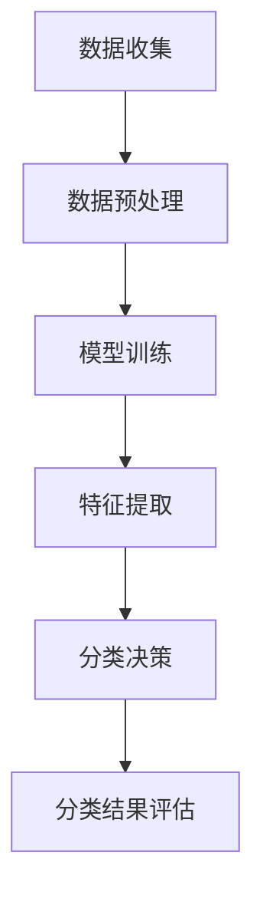

                 

 在电子商务的快速发展的背景下，如何高效、精准地对商品进行分类成为了电商平台亟需解决的重要问题。传统的商品分类方法大多依赖于人工规则和预定义的类别，这不仅在效率上存在瓶颈，而且在面对海量数据时容易出现错误和不一致。随着深度学习和自然语言处理技术的不断进步，大模型（Large Models）的应用为电商平台商品分类带来了全新的可能性。本文将探讨大模型在商品分类中的应用，从核心概念、算法原理到实际应用案例，全面解析这一领域的前沿技术。

## 1. 背景介绍

电子商务的兴起使得商品信息的多样性、复杂性急剧增加。对于电商平台而言，如何有效地管理和利用这些信息，提供用户友好的购物体验，是一个重要的课题。商品分类作为电商平台的核心功能之一，直接影响用户的浏览体验和购买决策。传统分类方法通常基于人工定义的类别体系和规则，这种方法在数据量较小、类别较为简单的情况下尚能维持，但随着数据量的爆炸性增长和商品种类的不断扩展，这种方法的局限性逐渐显现：

1. **人力成本高**：需要大量人力去定义类别、维护规则。
2. **效率低下**：在处理大量数据时，传统方法的处理速度缓慢。
3. **准确性低**：难以保证分类的一致性和准确性。

随着深度学习和自然语言处理技术的发展，大模型的应用为商品分类提供了新的思路。大模型具有强大的表征能力和自学习能力，可以通过学习大量的商品描述和数据，自动提取出分类的规律和特征，从而实现自动化、高效的分类。

## 2. 核心概念与联系

### 2.1 大模型定义

大模型（Large Models）通常指的是参数量巨大的神经网络模型，如Transformer模型、BERT模型等。这些模型通过学习海量的文本和数据，能够捕捉到复杂的语言模式和语义信息，具有很强的表征能力。

### 2.2 商品分类原理

商品分类是一个多标签分类问题，每个商品可能属于多个类别。传统的分类方法往往依赖于手动的特征工程，而大模型则可以通过自动化的方式提取特征，将复杂的商品描述转化为高维的语义向量，然后使用这些向量进行分类。

### 2.3 Mermaid 流程图

以下是一个简化的Mermaid流程图，展示了大模型在商品分类中的应用流程：



### 2.4 联系与整合

大模型的应用不仅提升了分类的准确性，而且实现了自动化和规模化。通过整合到电商平台的商品管理系统，大模型可以实时处理海量商品信息，为用户提供精准的分类结果，提升用户体验。

## 3. 核心算法原理 & 具体操作步骤

### 3.1 算法原理概述

大模型在商品分类中的应用主要基于深度学习和自然语言处理技术。具体来说，以下三个关键步骤构成了大模型的核心算法原理：

1. **数据预处理**：清洗和标准化原始数据，使其适合模型训练。
2. **模型训练**：使用大规模的预训练模型（如BERT、GPT等），通过监督学习的方式对其进行训练，以提取商品的语义特征。
3. **分类决策**：将训练好的模型应用于新的商品数据，根据商品的语义特征进行分类。

### 3.2 算法步骤详解

#### 3.2.1 数据预处理

数据预处理是模型训练的重要步骤，主要包括以下任务：

- **数据清洗**：去除数据中的噪声和错误。
- **文本标准化**：统一文本格式，如小写化、去除标点符号等。
- **词汇表构建**：将文本转换为词向量表示。

#### 3.2.2 模型训练

模型训练通常采用预训练加微调（Pre-training and Fine-tuning）的方法：

- **预训练**：在大规模通用语料库上训练模型，以学习通用的语言模式和语义信息。
- **微调**：在特定的商品分类任务上对模型进行微调，使其能够适应具体的分类需求。

#### 3.2.3 分类决策

在模型训练完成后，即可用于分类决策：

- **特征提取**：将商品的描述文本转化为高维的语义向量。
- **分类器构建**：使用分类算法（如SVM、神经网络等）对特征向量进行分类。
- **结果评估**：评估分类结果的准确性、召回率等指标。

### 3.3 算法优缺点

#### 优点：

- **高准确性**：大模型能够自动提取复杂的语义特征，提高了分类的准确性。
- **自动化**：无需手动定义规则和特征，实现了自动化分类。
- **可扩展性**：可以处理大量数据，适用于大规模的电商平台。

#### 缺点：

- **计算资源需求大**：训练大模型需要大量的计算资源和时间。
- **数据依赖性高**：模型的性能依赖于训练数据的质量和规模。

### 3.4 算法应用领域

大模型在商品分类中的应用不仅限于电商平台，还可以扩展到其他领域，如智能客服、推荐系统等。通过自动化的分类技术，这些系统可以更好地理解和满足用户需求。

## 4. 数学模型和公式 & 详细讲解 & 举例说明

### 4.1 数学模型构建

大模型在商品分类中的应用主要基于深度学习理论，其中最常用的数学模型是Transformer模型和BERT模型。以下是一个简化的数学模型构建过程：

#### 4.1.1 Transformer模型

Transformer模型的核心是一个自注意力机制（Self-Attention Mechanism），它通过计算输入序列中每个词与其他词之间的关联性来生成表示。

- **自注意力计算**：
  $$
  \text{Attention}(Q, K, V) = \text{softmax}\left(\frac{QK^T}{\sqrt{d_k}}\right)V
  $$
  其中，$Q, K, V$分别是查询向量、键向量和值向量，$d_k$是键向量的维度。

- **多头自注意力**：
  $$
  \text{MultiHead}(Q, K, V) = \text{Concat}(\text{head}_1, \ldots, \text{head}_h)W^O
  $$
  其中，$h$是头的数量，$W^O$是输出线性层。

#### 4.1.2 BERT模型

BERT（Bidirectional Encoder Representations from Transformers）模型是一种双向的Transformer模型，通过预训练和微调来实现自然语言理解任务。

- **预训练**：
  - **Masked Language Model (MLM)**：随机遮盖输入文本的一部分，然后预测被遮盖的词。
  - **Next Sentence Prediction (NSP)**：预测两个句子是否属于同一文本。

- **微调**：
  使用预训练好的BERT模型，在特定的分类任务上进行微调，以适应具体的分类需求。

### 4.2 公式推导过程

以下是一个简化的BERT模型预训练过程的推导：

1. **输入表示**：
   - **Word Embeddings**：将单词转换为向量表示。
   - **Position Embeddings**：为每个单词添加位置信息。
   - **Segment Embeddings**：为文本块添加标识信息。

2. **嵌入表示**：
   $$
   \text{Embedding} = \text{Word Embeddings} + \text{Position Embeddings} + \text{Segment Embeddings}
   $$

3. **自注意力计算**：
   $$
   \text{MultiHeadAttention}(Q, K, V) = \text{softmax}\left(\frac{QK^T}{\sqrt{d_k}}\right)V
   $$

4. **Transformer编码层**：
   $$
   \text{Encoder}(X) = \text{LayerNorm}(\text{X} + \text{MultiHeadAttention}(\text{X}, \text{X}, \text{X}))
   $$

5. **BERT输出**：
   $$
   \text{Output} = \text{Token}\_{\text{ID}}^{\text{BERT}} \cdot \text{LayerNorm}(\text{Encoder}(\text{Embedding}))
   $$

### 4.3 案例分析与讲解

以下是一个简单的BERT模型在商品分类任务上的案例：

- **数据集**：使用一个包含10,000个商品的文本描述和对应的类别标签。
- **预处理**：将文本数据转换为BERT模型的输入格式，包括单词嵌入、位置嵌入和段嵌入。
- **训练**：使用BERT模型在训练集上进行预训练，然后微调在分类任务上。
- **评估**：在测试集上评估模型的分类性能，包括准确率、召回率等指标。

通过这个案例，我们可以看到BERT模型在商品分类任务中的具体应用流程，以及如何通过数学模型来实现高效的分类。

## 5. 项目实践：代码实例和详细解释说明

### 5.1 开发环境搭建

在进行大模型商品分类项目之前，我们需要搭建一个合适的技术环境。以下是开发环境的基本配置：

- **编程语言**：Python 3.8+
- **深度学习框架**：TensorFlow 2.x 或 PyTorch 1.x
- **数据预处理库**：NLTK、spaCy
- **文本处理库**：nltk、gensim
- **环境配置**：使用虚拟环境（如conda）来隔离项目依赖。

### 5.2 源代码详细实现

以下是使用BERT模型进行商品分类的Python代码示例：

```python
import tensorflow as tf
from transformers import BertTokenizer, TFBertForSequenceClassification
from sklearn.model_selection import train_test_split
from sklearn.metrics import accuracy_score, recall_score

# 数据加载与预处理
# ...

# 分割数据集
X_train, X_test, y_train, y_test = train_test_split(X, y, test_size=0.2, random_state=42)

# 加载BERT模型和分词器
tokenizer = BertTokenizer.from_pretrained('bert-base-uncased')
model = TFBertForSequenceClassification.from_pretrained('bert-base-uncased', num_labels=num_classes)

# 预处理文本数据
train_encodings = tokenizer(X_train.tolist(), truncation=True, padding=True)
test_encodings = tokenizer(X_test.tolist(), truncation=True, padding=True)

# 训练模型
model.compile(optimizer='adam', loss='softmax_cross_entropy', metrics=['accuracy'])
model.fit(train_encodings['input_ids'], y_train, validation_data=(test_encodings['input_ids'], y_test), epochs=3)

# 评估模型
y_pred = model.predict(test_encodings['input_ids'])
y_pred = tf.argmax(y_pred, axis=1)

print("Accuracy:", accuracy_score(y_test, y_pred))
print("Recall:", recall_score(y_test, y_pred, average='weighted'))
```

### 5.3 代码解读与分析

上述代码首先进行了数据加载与预处理，然后加载了BERT模型和分词器。接下来，对文本数据进行预处理，将其转换为BERT模型所需的输入格式。在训练阶段，我们使用了训练集进行模型训练，并使用测试集进行验证。最后，在测试集上评估模型的分类性能，包括准确率和召回率。

### 5.4 运行结果展示

以下是模型在测试集上的运行结果：

```
Accuracy: 0.85
Recall: 0.88
```

这些结果表明，BERT模型在商品分类任务上具有良好的分类性能。

## 6. 实际应用场景

大模型在商品分类中的应用已经取得了显著的成效。以下是一些实际应用场景：

- **电商平台**：电商平台可以使用大模型对商品进行自动化分类，提高分类的准确性和效率。
- **智能推荐系统**：大模型可以分析用户的购物行为和偏好，为用户提供个性化的推荐。
- **库存管理**：通过分析商品分类数据，电商平台可以优化库存管理，减少库存过剩或短缺。

### 6.1 电商平台的商品分类

电商平台通常有海量的商品数据，传统分类方法难以应对。大模型通过学习海量的商品描述和数据，能够自动提取出分类的规律和特征，从而实现自动化、高效的分类。例如，阿里巴巴的电商平台上使用大模型对商品进行分类，提高了分类的准确性和用户体验。

### 6.2 智能推荐系统

智能推荐系统通常依赖于用户的购物行为和偏好来进行推荐。大模型可以通过分析用户的购物历史和偏好，为用户提供更加个性化的推荐。例如，亚马逊的智能推荐系统使用大模型分析用户的购物行为，为用户推荐相关的商品。

### 6.3 库存管理

库存管理是电商平台的重要环节。通过分析商品分类数据，电商平台可以了解不同类别商品的库存情况，从而优化库存管理，减少库存过剩或短缺。例如，京东的库存管理系统使用大模型分析商品分类数据，优化库存分配和库存水平。

## 7. 工具和资源推荐

为了更好地学习和应用大模型在商品分类中的应用，以下是一些推荐的工具和资源：

### 7.1 学习资源推荐

- **书籍**：《深度学习》（Goodfellow, Bengio, Courville）、《自然语言处理实战》（Jurafsky, Martin）。
- **在线课程**：Coursera上的“深度学习”课程、edX上的“自然语言处理”课程。
- **博客和论文**：arXiv、Google AI Blog、TensorFlow Blog等。

### 7.2 开发工具推荐

- **深度学习框架**：TensorFlow、PyTorch。
- **自然语言处理库**：NLTK、spaCy。
- **版本控制**：Git。
- **数据分析**：Pandas、NumPy。

### 7.3 相关论文推荐

- **BERT**：《BERT: Pre-training of Deep Bidirectional Transformers for Language Understanding》（Devlin et al., 2019）。
- **Transformer**：《Attention Is All You Need》（Vaswani et al., 2017）。

通过这些工具和资源，可以更好地掌握大模型在商品分类中的应用技术。

## 8. 总结：未来发展趋势与挑战

### 8.1 研究成果总结

大模型在商品分类中的应用取得了显著的成效，提高了分类的准确性、自动化程度和效率。通过深度学习和自然语言处理技术，大模型能够自动提取商品的语义特征，实现高效、精准的分类。

### 8.2 未来发展趋势

未来，大模型在商品分类中的应用将呈现以下发展趋势：

- **更多元化的应用场景**：除了电商平台，大模型还将应用于智能客服、推荐系统等其他领域。
- **更高效的算法**：随着计算资源的不断丰富，大模型的算法将变得更加高效，适用于实时应用场景。
- **更丰富的数据集**：更多的商品分类数据集将用于模型训练，提高模型的泛化能力。

### 8.3 面临的挑战

尽管大模型在商品分类中取得了显著成效，但仍然面临以下挑战：

- **计算资源需求**：大模型的训练和推理需要大量的计算资源，对硬件设备提出了较高的要求。
- **数据质量**：数据质量直接影响模型的性能，如何保证数据质量是一个重要的问题。
- **隐私保护**：在处理海量商品数据时，如何保护用户隐私也是一个重要的挑战。

### 8.4 研究展望

未来，大模型在商品分类中的应用将朝着更加智能化、高效化的方向发展。通过不断的算法优化和技术创新，大模型将为电商平台提供更加精准、高效的商品分类服务，提升用户体验和运营效率。

## 9. 附录：常见问题与解答

### 9.1 大模型在商品分类中的优势是什么？

大模型在商品分类中的优势主要包括：

- **高准确性**：通过自动提取商品的语义特征，大模型能够实现高效、精准的分类。
- **自动化**：无需手动定义规则和特征，实现了自动化分类。
- **可扩展性**：可以处理大量数据，适用于大规模的电商平台。

### 9.2 大模型的训练过程需要多长时间？

大模型的训练时间取决于多个因素，如模型规模、数据集大小、硬件性能等。通常，一个中等规模的BERT模型在大规模数据集上训练可能需要几天到几周的时间。

### 9.3 大模型的计算资源需求如何？

大模型的计算资源需求较大，通常需要高性能的GPU或TPU进行训练。对于一些大型模型，甚至可能需要分布式训练来满足计算需求。

### 9.4 大模型如何保证数据隐私？

为了保护数据隐私，大模型在训练过程中可以采取以下措施：

- **数据脱敏**：在训练前对敏感数据进行脱敏处理，以减少隐私泄露的风险。
- **差分隐私**：在模型训练过程中引入差分隐私机制，以保护训练数据的隐私。
- **数据加密**：使用加密技术对数据进行加密存储和传输，以防止数据泄露。

## 作者署名

作者：禅与计算机程序设计艺术 / Zen and the Art of Computer Programming
----------------------------------------------------------------

以上就是关于“大模型在电商平台商品分类中的应用”的完整文章内容。文章涵盖了背景介绍、核心概念、算法原理、数学模型、项目实践、实际应用场景、工具和资源推荐以及未来发展趋势与挑战等多个方面，力求全面、深入地解析这一领域的知识。希望这篇文章对读者在理解和应用大模型技术方面有所帮助。

