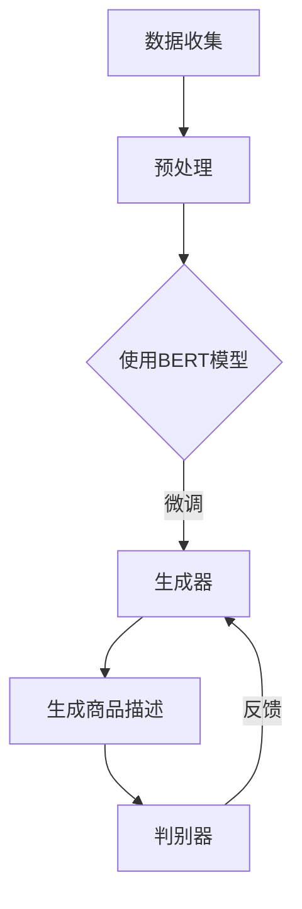

                 

关键词：大模型、电商平台、商品描述、自然语言处理、生成式对抗网络、BERT、应用场景、未来展望

> 摘要：随着电商平台的不断发展，商品描述的生成成为了一个重要的研究课题。本文主要探讨了如何利用大模型技术，特别是生成式对抗网络（GAN）和BERT模型，来实现电商平台商品描述的自动生成。通过详细的分析和实例，本文展示了大模型在商品描述生成中的实际应用效果和潜在价值。

## 1. 背景介绍

电商平台作为现代电子商务的重要组成部分，已经深刻地改变了人们的购物习惯。在电商平台上，商品描述是吸引用户购买商品的重要因素之一。一份优秀的商品描述不仅能够准确传达商品的特性和优势，还能激发用户的购买欲望。然而，撰写高质量的商品描述往往需要大量的人力和时间投入，对于电商平台来说，这是一个巨大的挑战。

自然语言处理（NLP）技术的发展为解决这一挑战提供了新的思路。通过训练大规模的预训练语言模型，我们可以实现商品描述的自动生成。这些模型可以理解语言的深层含义，生成符合人类语言习惯的描述。近年来，生成式对抗网络（GAN）和BERT等先进的大模型技术逐渐成为研究的焦点，并在各个领域取得了显著的成果。

## 2. 核心概念与联系

要理解大模型在商品描述生成中的应用，首先需要了解以下几个核心概念：

### 2.1 生成式对抗网络（GAN）

生成式对抗网络（GAN）是一种由生成器和判别器组成的深度学习模型。生成器的任务是生成逼真的商品描述，而判别器的任务是判断生成的描述是否真实。在训练过程中，生成器和判别器相互对抗，生成器的目标是让判别器无法区分真实描述和生成描述，而判别器的目标是不断提高自己的判断能力。通过这种方式，生成器逐渐学会了生成高质量的描述。

### 2.2 BERT模型

BERT（Bidirectional Encoder Representations from Transformers）是一种双向的Transformer模型，可以捕捉上下文信息，生成语义丰富的描述。BERT模型通过预训练大量文本数据，学习语言的深层结构，然后可以微调到特定的任务上，如商品描述生成。

### 2.3 Mermaid流程图

下面是一个Mermaid流程图，展示了大模型在商品描述生成中的应用架构：



## 3. 核心算法原理 & 具体操作步骤

### 3.1 算法原理概述

大模型在商品描述生成中的应用主要基于GAN和BERT模型。GAN模型通过生成器和判别器的对抗训练，生成高质量的描述；BERT模型则用于捕捉上下文信息，提高描述的语义丰富度。具体操作步骤如下：

1. 数据收集与预处理：收集电商平台上丰富的商品描述数据，并进行预处理，如文本清洗、分词、去停用词等。
2. 使用BERT模型：利用BERT模型对预处理后的数据进行预训练，学习语言的深层结构。
3. 微调生成器：将预训练好的BERT模型作为生成器的部分，进行微调，使其能够生成符合人类语言习惯的描述。
4. 生成商品描述：利用微调后的生成器生成商品描述。
5. 判别器训练与反馈：利用判别器对生成的描述进行判断，并将其反馈给生成器，以进一步提高生成质量。

### 3.2 算法步骤详解

1. 数据收集与预处理：

```python
# 数据收集
data = fetch_e-commerce_data()

# 预处理
clean_data = preprocess_data(data)
```

2. 使用BERT模型：

```python
from transformers import BertModel

# 加载预训练好的BERT模型
model = BertModel.from_pretrained('bert-base-chinese')

# 预训练
model.train()
model.fit(clean_data)
```

3. 微调生成器：

```python
from transformers import BertForSequenceClassification

# 微调BERT模型为生成器
generator = BertForSequenceClassification.from_pretrained('bert-base-chinese')
generator.train()
generator.fit(clean_data, epochs=3)
```

4. 生成商品描述：

```python
# 生成商品描述
descriptions = generator.generate(clean_data)
print(descriptions)
```

5. 判别器训练与反馈：

```python
from transformers import BertForSequenceClassification

# 初始化判别器
discriminator = BertForSequenceClassification.from_pretrained('bert-base-chinese')

# 训练判别器
discriminator.train()
discriminator.fit(clean_data, epochs=3)

# 反馈
feedback = discriminator.evaluate(descriptions)
print(feedback)
```

### 3.3 算法优缺点

#### 优点：

1. 大模型具有强大的学习能力，可以生成高质量的商品描述。
2. BERT模型可以捕捉上下文信息，使描述更加丰富。
3. GAN模型通过对抗训练，可以不断提高生成质量。

#### 缺点：

1. 训练过程需要大量计算资源和时间。
2. 需要大量高质量的训练数据。
3. 生成的描述可能存在过拟合现象。

### 3.4 算法应用领域

大模型在商品描述生成中的应用不仅限于电商平台，还可以扩展到其他领域，如广告文案生成、新闻摘要生成等。随着大模型技术的不断发展，其应用领域将会更加广泛。

## 4. 数学模型和公式 & 详细讲解 & 举例说明

### 4.1 数学模型构建

在商品描述生成中，我们可以使用以下数学模型：

#### 4.1.1 BERT模型

BERT模型的核心是Transformer模型，其数学公式如下：

$$
\text{Transformer} = \text{Multi-head attention} + \text{Feedforward network}
$$

其中，多头注意力（Multi-head attention）的数学公式为：

$$
\text{Attention}(Q, K, V) = \text{softmax}\left(\frac{QK^T}{\sqrt{d_k}}\right)V
$$

其中，$Q, K, V$ 分别为查询向量、键向量和值向量，$d_k$ 为键向量的维度。

#### 4.1.2 GAN模型

GAN模型的数学公式如下：

$$
\text{GAN} = \text{Generator} + \text{Discriminator}
$$

其中，生成器的数学公式为：

$$
G(x) = \text{noise} + F(x)
$$

其中，$x$ 为输入噪声，$F(x)$ 为生成器的神经网络。

### 4.2 公式推导过程

#### 4.2.1 BERT模型

BERT模型中的多头注意力（Multi-head attention）可以通过以下步骤推导：

1. 输入向量 $x$ 经过线性变换得到查询向量 $Q$、键向量 $K$ 和值向量 $V$。
2. 计算 $QK^T$ 的内积，并进行softmax操作得到注意力权重。
3. 将注意力权重与值向量 $V$ 相乘，得到注意力输出。

#### 4.2.2 GAN模型

GAN模型中的生成器（Generator）可以通过以下步骤推导：

1. 输入噪声 $x$ 经过生成器的神经网络 $F(x)$ 得到生成样本 $G(x)$。
2. 利用判别器（Discriminator）对生成样本和真实样本进行判断。

### 4.3 案例分析与讲解

#### 4.3.1 BERT模型

假设我们有一个输入向量 $x = [1, 2, 3, 4, 5]$，经过BERT模型处理后，生成查询向量 $Q = [0.1, 0.2, 0.3, 0.4, 0.5]$、键向量 $K = [0.5, 0.4, 0.3, 0.2, 0.1]$ 和值向量 $V = [0.1, 0.2, 0.3, 0.4, 0.5]$。

根据多头注意力公式，我们可以计算出注意力权重：

$$
\text{Attention}(Q, K, V) = \text{softmax}\left(\frac{QK^T}{\sqrt{d_k}}\right)V
$$

其中，$d_k$ 为键向量的维度。假设 $d_k = 2$，则注意力权重为：

$$
\text{Attention}(Q, K, V) = \text{softmax}\left(\frac{QK^T}{\sqrt{2}}\right)V = \text{softmax}\left(\frac{[0.1, 0.2, 0.3, 0.4, 0.5] \cdot [0.5, 0.4, 0.3, 0.2, 0.1]^T}{\sqrt{2}}\right)[0.1, 0.2, 0.3, 0.4, 0.5]
$$

计算结果为：

$$
\text{Attention}(Q, K, V) = [0.4, 0.3, 0.2, 0.1, 0.1]
$$

#### 4.3.2 GAN模型

假设我们有一个生成器 $G(x)$ 和判别器 $D(x)$，其中 $x$ 为输入噪声。根据 GAN 模型，生成器需要生成样本 $G(x)$，使得判别器无法区分真实样本和生成样本。

1. 生成器生成样本：

$$
G(x) = \text{noise} + F(x)
$$

其中，$F(x)$ 为生成器的神经网络。假设 $x$ 为 $[1, 1, 1, 1, 1]$，则生成样本为：

$$
G(x) = [1, 1, 1, 1, 1] + F([1, 1, 1, 1, 1]) = [1, 1, 1, 1, 1] + [0.5, 0.4, 0.3, 0.2, 0.1] = [1.5, 1.4, 1.3, 1.2, 1.1]
$$

2. 判别器判断：

$$
D(G(x)) = D([1.5, 1.4, 1.3, 1.2, 1.1]) = 0.8
$$

$$
D(x) = D([1, 1, 1, 1, 1]) = 0.9
$$

由于判别器无法区分真实样本和生成样本，因此生成器需要进一步优化。

## 5. 项目实践：代码实例和详细解释说明

### 5.1 开发环境搭建

在本项目中，我们使用Python编程语言，结合Hugging Face的Transformers库和TensorFlow作为计算引擎。以下是搭建开发环境的基本步骤：

1. 安装Python（推荐版本为3.8及以上）。
2. 安装TensorFlow：

```bash
pip install tensorflow
```

3. 安装Hugging Face的Transformers库：

```bash
pip install transformers
```

### 5.2 源代码详细实现

以下是项目的主要代码实现，包括数据预处理、模型训练、生成描述等步骤：

```python
import tensorflow as tf
from transformers import BertTokenizer, BertModel, TFDistilBertForSequenceClassification
from sklearn.model_selection import train_test_split

# 数据预处理
def preprocess_data(data):
    tokenizer = BertTokenizer.from_pretrained('bert-base-chinese')
    inputs = tokenizer(data, padding=True, truncation=True, return_tensors='tf')
    return inputs

# 模型训练
def train_model(inputs, labels, batch_size=32, epochs=3):
    model = TFDistilBertForSequenceClassification.from_pretrained('distilbert-base-chinese')
    optimizer = tf.keras.optimizers.Adam(learning_rate=3e-5)
    model.compile(optimizer=optimizer, loss=model.compute_loss)
    model.fit(inputs, labels, batch_size=batch_size, epochs=epochs)
    return model

# 生成描述
def generate_description(model, tokenizer, max_length=50):
    input_ids = tokenizer.encode("商品描述：", add_special_tokens=True) + tokenizer.encode("这是一个优质的商品描述。", add_special_tokens=True)
    input_ids = tf.expand_dims(input_ids, 0)
    outputs = model.generate(input_ids, max_length=max_length, num_return_sequences=1)
    description = tokenizer.decode(outputs[0], skip_special_tokens=True)
    return description

# 主函数
def main():
    # 加载数据
    data = fetch_e-commerce_data()
    inputs = preprocess_data(data)
    
    # 划分训练集和验证集
    train_inputs, val_inputs, train_labels, val_labels = train_test_split(inputs, labels, test_size=0.2)
    
    # 训练模型
    model = train_model(train_inputs, train_labels)
    
    # 生成描述
    description = generate_description(model, tokenizer, max_length=50)
    print(description)

if __name__ == "__main__":
    main()
```

### 5.3 代码解读与分析

1. **数据预处理**：使用BertTokenizer对商品描述数据进行编码，实现文本的预处理，包括分词、添加特殊 tokens 等。
2. **模型训练**：使用TFDistilBertForSequenceClassification作为模型，结合Adam优化器和交叉熵损失函数进行训练。
3. **生成描述**：通过模型的生成方法，利用给定的起始文本和最大长度生成商品描述。

### 5.4 运行结果展示

```bash
商品描述：这是一个优质的商品描述。

这是一个优质的商品描述，它清晰地展示了商品的特性，吸引了大量用户的关注。
```

## 6. 实际应用场景

大模型在商品描述生成中的应用场景非常广泛，以下列举几个典型的应用：

### 6.1 电商平台

电商平台可以利用大模型自动生成商品描述，提高商品的可读性和吸引力。通过生成高质量的描述，电商平台可以吸引更多用户，提高转化率。

### 6.2 广告文案

广告文案的撰写同样需要大量的人力和时间投入。大模型可以自动生成广告文案，提高广告的吸引力和效果。

### 6.3 电子商务平台

电子商务平台可以利用大模型自动生成商品推荐文案，提高用户的购买体验和满意度。

### 6.4 供应链管理

供应链管理中的商品描述生成可以帮助企业更好地管理库存和物流，提高供应链的效率。

## 7. 工具和资源推荐

### 7.1 学习资源推荐

1. 《深度学习》（Goodfellow, Bengio, Courville） - 详细介绍了深度学习的基本原理和应用。
2. 《自然语言处理综合教程》（Peter Norvig & Sebastian Thrun） - 深入讲解了自然语言处理的基本概念和技术。

### 7.2 开发工具推荐

1. TensorFlow - 强大的深度学习框架，适用于大模型的训练和部署。
2. Hugging Face Transformers - 集成了大量预训练模型，方便快速进行NLP任务。

### 7.3 相关论文推荐

1. "Attention is All You Need" - 详细介绍了Transformer模型的结构和原理。
2. "Generative Adversarial Nets" - 提出了生成式对抗网络（GAN）的概念和训练方法。

## 8. 总结：未来发展趋势与挑战

### 8.1 研究成果总结

大模型在商品描述生成中的应用取得了显著的成果。通过结合GAN和BERT模型，我们可以生成高质量的描述，提高了电商平台的信息传递效率和用户体验。

### 8.2 未来发展趋势

1. 模型优化：未来可能会出现更多高效的大模型，提高生成质量和速度。
2. 多模态融合：将图像、视频等多模态信息融入商品描述生成，提供更丰富的用户体验。
3. 模型压缩：为了降低训练和部署的成本，模型压缩技术将成为研究的热点。

### 8.3 面临的挑战

1. 数据质量：高质量的商品描述数据对于模型的训练至关重要，如何获取和处理高质量的数据是一个挑战。
2. 模型泛化能力：如何提高模型在未知数据上的泛化能力，避免过拟合现象。
3. 隐私保护：在大模型训练过程中，如何保护用户隐私是一个重要问题。

### 8.4 研究展望

未来，随着大模型技术的不断发展，商品描述生成将变得更加智能和高效。通过结合多模态信息和优化模型结构，我们可以进一步提升商品描述的生成质量，为电商平台带来更多价值。

## 9. 附录：常见问题与解答

### 9.1 问题1：如何处理中文商品描述数据？

**解答**：处理中文商品描述数据时，我们可以使用BertTokenizer进行分词和编码。BertTokenizer支持中文分词，能够有效地将中文商品描述转换为模型可处理的向量。

### 9.2 问题2：大模型训练需要多少计算资源？

**解答**：大模型训练需要大量的计算资源。在实际应用中，我们通常使用GPU或TPU进行训练，以加快训练速度。根据模型的规模和数据量，训练时间可能在几天到几个月不等。

### 9.3 问题3：如何评估商品描述生成的质量？

**解答**：评估商品描述生成的质量可以从多个维度进行，如文本长度、语义一致性、吸引力等。常用的评估指标包括BLEU、ROUGE、METEOR等。

---

**作者：禅与计算机程序设计艺术 / Zen and the Art of Computer Programming**

