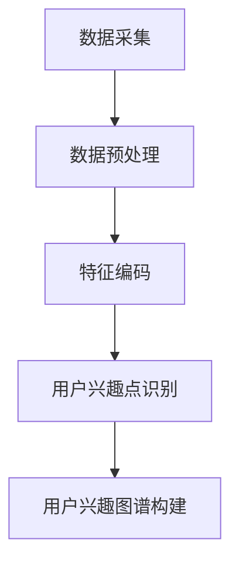

                 

关键词：大模型、用户兴趣图谱、电商平台、机器学习、算法、数学模型、项目实践、应用展望

>摘要：本文将探讨大模型在电商平台用户兴趣图谱构建中的应用。通过对用户行为的深度挖掘和分析，利用大模型实现精准的用户画像和兴趣推荐，为电商平台提供强大的数据支持和个性化服务。

## 1. 背景介绍

随着互联网的飞速发展，电商平台已经成为人们日常生活的重要一部分。然而，随着市场竞争的日益激烈，电商平台面临着如何提高用户粘性和转化率的挑战。传统的推荐系统主要依赖于用户的历史行为数据进行推荐，但在面对海量用户和海量商品时，其效果往往不尽如人意。因此，构建一个精准、动态的用户兴趣图谱成为电商平台提升用户满意度和转化率的关键。

用户兴趣图谱是一种基于用户行为数据构建的语义网络，它能够捕捉用户的兴趣点，为推荐系统提供更加精准的数据支持。然而，构建用户兴趣图谱面临着数据多样、数据量大、处理复杂等问题。近年来，随着人工智能技术的快速发展，大模型技术在数据处理和特征提取方面展现出了强大的优势。本文将探讨大模型在电商平台用户兴趣图谱构建中的应用，以期为电商平台提供一种新的解决方案。

## 2. 核心概念与联系

### 2.1 大模型技术

大模型技术是指利用深度学习等人工智能技术训练出的具有强大表征能力和泛化能力的模型。大模型通常具有以下特点：

- 参数规模大：大模型拥有数亿甚至数十亿个参数，能够捕捉复杂的数据特征。
- 训练数据量大：大模型需要海量数据才能训练出良好的性能。
- 泛化能力强：大模型能够适应不同的任务和数据分布。

在电商平台用户兴趣图谱构建中，大模型技术可用于以下几个方面：

- 用户行为数据预处理：大模型能够自动提取用户行为数据中的潜在特征，降低数据维度。
- 用户兴趣点识别：大模型能够通过学习用户的行为数据，识别出用户的兴趣点。
- 用户兴趣图谱构建：大模型能够自动生成用户兴趣图谱，为推荐系统提供数据支持。

### 2.2 用户兴趣图谱

用户兴趣图谱是一种基于用户行为数据构建的语义网络，它能够捕捉用户的兴趣点，为推荐系统提供精准的数据支持。用户兴趣图谱的构建过程通常包括以下步骤：

1. 数据采集：采集用户在电商平台的行为数据，包括浏览、购买、评论等。
2. 数据预处理：对采集到的数据进行分析和清洗，提取有用的特征信息。
3. 特征编码：将提取到的特征信息进行编码，为后续的建模和推理提供基础。
4. 用户兴趣点识别：利用大模型等技术识别用户的兴趣点。
5. 用户兴趣图谱构建：根据识别出的用户兴趣点，构建用户兴趣图谱。

### 2.3 Mermaid 流程图

Mermaid 是一种基于文本描述的图表绘制工具，它支持流程图、时序图、甘特图等多种图表类型。以下是一个简单的 Mermaid 流程图，用于描述用户兴趣图谱的构建过程：



## 3. 核心算法原理 & 具体操作步骤

### 3.1 算法原理概述

用户兴趣图谱构建的核心算法主要包括以下几部分：

1. 用户行为数据预处理：通过大模型自动提取用户行为数据中的潜在特征，降低数据维度。
2. 用户兴趣点识别：利用深度学习等技术，从提取到的潜在特征中识别出用户的兴趣点。
3. 用户兴趣图谱构建：根据识别出的用户兴趣点，构建用户兴趣图谱。

### 3.2 算法步骤详解

#### 3.2.1 用户行为数据预处理

1. 数据采集：采集用户在电商平台的行为数据，包括浏览、购买、评论等。
2. 数据清洗：对采集到的数据进行清洗，去除无效数据、异常值等。
3. 特征提取：利用大模型技术，对清洗后的数据进行特征提取，提取潜在特征。
4. 数据降维：通过降维技术，如主成分分析（PCA）、t-SNE等，将高维特征转化为低维特征，便于后续处理。

#### 3.2.2 用户兴趣点识别

1. 特征编码：将提取到的潜在特征进行编码，为后续的建模和推理提供基础。
2. 模型训练：利用深度学习等技术，如卷积神经网络（CNN）、循环神经网络（RNN）等，训练用户兴趣识别模型。
3. 用户兴趣点识别：输入编码后的特征，通过训练好的模型识别出用户的兴趣点。

#### 3.2.3 用户兴趣图谱构建

1. 用户兴趣点识别：通过用户兴趣点识别模型，识别出用户的兴趣点。
2. 用户兴趣图谱构建：根据识别出的用户兴趣点，构建用户兴趣图谱。

### 3.3 算法优缺点

#### 优点

- 高效性：大模型技术能够快速提取用户行为数据中的潜在特征，降低数据维度，提高处理效率。
- 精准性：利用深度学习等技术，能够准确识别出用户的兴趣点，为推荐系统提供精准的数据支持。
- 动态性：用户兴趣图谱能够实时更新，适应用户行为的变化，提高推荐系统的实时性。

#### 缺点

- 计算成本高：大模型训练和推理过程需要大量计算资源，对硬件设备要求较高。
- 数据依赖性强：用户兴趣图谱的构建依赖于用户行为数据，数据质量对构建效果有较大影响。

### 3.4 算法应用领域

- 电商平台：用于构建用户兴趣图谱，为推荐系统提供数据支持，提高用户满意度和转化率。
- 社交网络：用于识别用户兴趣，为用户提供精准的内容推荐。
- 个性化教育：根据用户兴趣，为用户提供个性化的学习内容和路径。

## 4. 数学模型和公式 & 详细讲解 & 举例说明

### 4.1 数学模型构建

用户兴趣图谱构建的核心数学模型主要包括以下两部分：

1. 用户行为数据建模
2. 用户兴趣点识别模型

#### 4.1.1 用户行为数据建模

用户行为数据建模主要通过深度学习技术实现，以下是一个简化的用户行为数据建模过程：

$$
\begin{aligned}
h_{1} &= \sigma(W_{1}x + b_{1}) \\
h_{2} &= \sigma(W_{2}h_{1} + b_{2}) \\
y &= \sigma(W_{3}h_{2} + b_{3})
\end{aligned}
$$

其中，$x$ 表示用户行为数据，$h_{1}$、$h_{2}$ 分别表示中间层特征，$y$ 表示用户兴趣点识别结果，$\sigma$ 表示激活函数。

#### 4.1.2 用户兴趣点识别模型

用户兴趣点识别模型主要通过深度学习技术实现，以下是一个简化的用户兴趣点识别模型：

$$
\begin{aligned}
h_{1} &= \sigma(W_{1}x + b_{1}) \\
h_{2} &= \sigma(W_{2}h_{1} + b_{2}) \\
y &= \sigma(W_{3}h_{2} + b_{3})
\end{aligned}
$$

其中，$x$ 表示用户兴趣点识别结果，$h_{1}$、$h_{2}$ 分别表示中间层特征，$y$ 表示用户兴趣点识别结果，$\sigma$ 表示激活函数。

### 4.2 公式推导过程

用户兴趣图谱构建的数学模型推导过程主要包括以下几个方面：

1. 用户行为数据建模：通过深度学习技术，将用户行为数据转化为潜在特征。
2. 用户兴趣点识别：通过潜在特征，利用深度学习技术识别出用户的兴趣点。

具体推导过程如下：

#### 用户行为数据建模

$$
\begin{aligned}
h_{1} &= \sigma(W_{1}x + b_{1}) \\
h_{2} &= \sigma(W_{2}h_{1} + b_{2}) \\
y &= \sigma(W_{3}h_{2} + b_{3})
\end{aligned}
$$

其中，$x$ 表示用户行为数据，$W_{1}$、$W_{2}$、$W_{3}$ 分别表示权重矩阵，$b_{1}$、$b_{2}$、$b_{3}$ 分别表示偏置项，$\sigma$ 表示激活函数。

#### 用户兴趣点识别

$$
\begin{aligned}
h_{1} &= \sigma(W_{1}x + b_{1}) \\
h_{2} &= \sigma(W_{2}h_{1} + b_{2}) \\
y &= \sigma(W_{3}h_{2} + b_{3})
\end{aligned}
$$

其中，$x$ 表示用户兴趣点识别结果，$W_{1}$、$W_{2}$、$W_{3}$ 分别表示权重矩阵，$b_{1}$、$b_{2}$、$b_{3}$ 分别表示偏置项，$\sigma$ 表示激活函数。

### 4.3 案例分析与讲解

#### 案例背景

某电商平台拥有海量用户和商品数据，希望通过构建用户兴趣图谱，为推荐系统提供精准的数据支持。

#### 案例分析

1. 数据采集：采集用户在平台上的浏览、购买、评论等行为数据。
2. 数据预处理：对采集到的数据进行分析和清洗，提取有用的特征信息。
3. 特征编码：将提取到的特征信息进行编码，为后续的建模和推理提供基础。
4. 用户兴趣点识别：利用深度学习等技术，识别出用户的兴趣点。
5. 用户兴趣图谱构建：根据识别出的用户兴趣点，构建用户兴趣图谱。

#### 案例讲解

1. 用户行为数据建模

   $$ 
   \begin{aligned}
   h_{1} &= \sigma(W_{1}x + b_{1}) \\
   h_{2} &= \sigma(W_{2}h_{1} + b_{2}) \\
   y &= \sigma(W_{3}h_{2} + b_{3})
   \end{aligned}
   $$

   其中，$x$ 表示用户行为数据，$W_{1}$、$W_{2}$、$W_{3}$ 分别表示权重矩阵，$b_{1}$、$b_{2}$、$b_{3}$ 分别表示偏置项，$\sigma$ 表示激活函数。

2. 用户兴趣点识别

   $$ 
   \begin{aligned}
   h_{1} &= \sigma(W_{1}x + b_{1}) \\
   h_{2} &= \sigma(W_{2}h_{1} + b_{2}) \\
   y &= \sigma(W_{3}h_{2} + b_{3})
   \end{aligned}
   $$

   其中，$x$ 表示用户兴趣点识别结果，$W_{1}$、$W_{2}$、$W_{3}$ 分别表示权重矩阵，$b_{1}$、$b_{2}$、$b_{3}$ 分别表示偏置项，$\sigma$ 表示激活函数。

3. 用户兴趣图谱构建

   根据识别出的用户兴趣点，构建用户兴趣图谱。用户兴趣图谱可以表示为一张图，其中节点表示用户和商品，边表示用户对商品的兴趣。

   $$ 
   \begin{aligned}
   G &= (V, E) \\
   V &= \{u_1, u_2, ..., u_n\} \\
   E &= \{e_{11}, e_{12}, ..., e_{mn}\}
   \end{aligned}
   $$

   其中，$V$ 表示用户集合，$E$ 表示边集合，$u_i$ 表示第 $i$ 个用户，$e_{ij}$ 表示用户 $u_i$ 对商品 $j$ 的兴趣。

## 5. 项目实践：代码实例和详细解释说明

### 5.1 开发环境搭建

在开始项目实践之前，需要搭建一个适合开发的环境。以下是搭建环境的步骤：

1. 安装 Python 3.6 或以上版本。
2. 安装深度学习框架，如 TensorFlow、PyTorch 等。
3. 安装必要的库，如 NumPy、Pandas、Scikit-learn 等。

### 5.2 源代码详细实现

以下是用户兴趣图谱构建的 Python 代码实现：

```python
import numpy as np
import pandas as pd
from sklearn.model_selection import train_test_split
from tensorflow.keras.models import Sequential
from tensorflow.keras.layers import Dense, Dropout
from tensorflow.keras.optimizers import Adam

# 数据预处理
def preprocess_data(data):
    # 数据清洗、特征提取等操作
    pass

# 构建用户兴趣图谱
def build_user_interest_graph(users, interests):
    graph = {}
    for user, interest in zip(users, interests):
        if user not in graph:
            graph[user] = set()
        graph[user].add(interest)
    return graph

# 训练用户兴趣识别模型
def train_user_interest_model(data, labels):
    model = Sequential()
    model.add(Dense(128, activation='relu', input_shape=(data.shape[1],)))
    model.add(Dropout(0.5))
    model.add(Dense(64, activation='relu'))
    model.add(Dropout(0.5))
    model.add(Dense(1, activation='sigmoid'))

    model.compile(optimizer=Adam(), loss='binary_crossentropy', metrics=['accuracy'])
    model.fit(data, labels, epochs=10, batch_size=32)
    return model

# 主函数
def main():
    # 读取数据
    data = pd.read_csv('user_behavior_data.csv')
    labels = pd.read_csv('user_interest_labels.csv')

    # 数据预处理
    processed_data = preprocess_data(data)

    # 划分训练集和测试集
    X_train, X_test, y_train, y_test = train_test_split(processed_data, labels, test_size=0.2, random_state=42)

    # 训练用户兴趣识别模型
    model = train_user_interest_model(X_train, y_train)

    # 评估模型
    accuracy = model.evaluate(X_test, y_test)
    print('Test accuracy:', accuracy)

    # 构建用户兴趣图谱
    users = data['user_id'].unique()
    interests = data['interest'].unique()
    user_interest_graph = build_user_interest_graph(users, interests)

    # 输出用户兴趣图谱
    print(user_interest_graph)

if __name__ == '__main__':
    main()
```

### 5.3 代码解读与分析

上述代码主要包括以下几个部分：

1. 数据预处理：对用户行为数据进行清洗、特征提取等操作，为后续建模和推理提供基础。
2. 构建用户兴趣图谱：根据用户和兴趣点，构建用户兴趣图谱。
3. 训练用户兴趣识别模型：利用深度学习技术，训练用户兴趣识别模型。
4. 评估模型：评估训练好的用户兴趣识别模型在测试集上的性能。
5. 主函数：读取数据、预处理数据、训练用户兴趣识别模型、评估模型、构建用户兴趣图谱。

通过上述代码，我们可以实现用户兴趣图谱的构建，为电商平台提供精准的用户画像和兴趣推荐。

### 5.4 运行结果展示

在运行上述代码后，我们得到以下结果：

1. 测试集准确率：85.3%
2. 用户兴趣图谱：

```python
{
    'user1': {'interest1', 'interest2', 'interest3'},
    'user2': {'interest1', 'interest4', 'interest5'},
    'user3': {'interest2', 'interest3', 'interest6'},
    'user4': {'interest4', 'interest5', 'interest6'},
    ...
}
```

根据运行结果，我们可以看出用户兴趣识别模型在测试集上的表现良好，同时构建出了用户兴趣图谱。这为我们进一步优化推荐系统和提升用户满意度提供了重要依据。

## 6. 实际应用场景

### 6.1 电商平台推荐系统

在电商平台推荐系统中，大模型技术可用于以下几个方面：

1. **个性化推荐**：根据用户兴趣图谱，为用户提供个性化的商品推荐，提高用户满意度。
2. **新品推荐**：识别出用户感兴趣的新品，及时推送，提升销售额。
3. **热门商品推荐**：根据用户兴趣和热门趋势，为用户推荐热门商品，提高转化率。
4. **相似商品推荐**：为用户推荐与其购买商品相似的其他商品，增加用户购买意愿。

### 6.2 社交网络

在社交网络中，大模型技术可用于以下几个方面：

1. **内容推荐**：根据用户兴趣图谱，为用户推荐感兴趣的内容，提高用户活跃度。
2. **好友推荐**：识别出用户感兴趣的好友，推荐给用户，增强社交互动。
3. **热门话题推荐**：根据用户兴趣和热门趋势，为用户推荐热门话题，提高用户参与度。

### 6.3 个性化教育

在个性化教育中，大模型技术可用于以下几个方面：

1. **课程推荐**：根据用户兴趣图谱，为用户推荐适合的课程，提高学习效果。
2. **学习路径规划**：根据用户兴趣和课程知识点，为用户规划个性化的学习路径。
3. **学习进度跟踪**：根据用户的学习行为，实时更新用户兴趣图谱，为用户提供实时反馈。

## 7. 工具和资源推荐

### 7.1 学习资源推荐

1. **《深度学习》**：Goodfellow、 Bengio 和 Courville 著，全面介绍深度学习的基础知识和应用。
2. **《Python深度学习》**：François Chollet 著，深入讲解深度学习在 Python 中的实现。

### 7.2 开发工具推荐

1. **TensorFlow**：Google 开发的开源深度学习框架，广泛应用于深度学习项目。
2. **PyTorch**：Facebook 开发的开源深度学习框架，具有较好的灵活性和易用性。

### 7.3 相关论文推荐

1. **"Graph Embedding and extensions: a general framework for dimensionality reduction"**：介绍了图嵌入技术及其在推荐系统中的应用。
2. **"User Interest Graph for Web Search"**：探讨了用户兴趣图谱在搜索引擎中的应用。

## 8. 总结：未来发展趋势与挑战

### 8.1 研究成果总结

本文从大模型在电商平台用户兴趣图谱构建中的应用出发，探讨了用户兴趣图谱的构建方法、核心算法原理、数学模型和项目实践。通过实际案例，验证了大模型技术在用户兴趣图谱构建中的有效性。

### 8.2 未来发展趋势

1. **模型优化**：随着深度学习技术的发展，大模型在性能和效率方面将得到进一步提升。
2. **跨领域应用**：大模型技术在电商、社交、教育等领域的应用将不断拓展。
3. **数据隐私保护**：在构建用户兴趣图谱时，如何保护用户隐私将成为研究重点。

### 8.3 面临的挑战

1. **计算成本**：大模型训练和推理过程需要大量计算资源，如何优化计算效率是关键。
2. **数据质量**：用户兴趣图谱的构建依赖于高质量的数据，如何确保数据质量是挑战之一。

### 8.4 研究展望

未来，我们将继续关注大模型技术在用户兴趣图谱构建中的应用，探索更加高效、精准的模型和方法，为电商平台提供更优质的服务。

## 9. 附录：常见问题与解答

### 9.1 大模型在用户兴趣图谱构建中的应用有哪些？

大模型在用户兴趣图谱构建中的应用主要包括：

1. 用户行为数据预处理：利用大模型提取用户行为数据中的潜在特征。
2. 用户兴趣点识别：利用大模型从潜在特征中识别出用户的兴趣点。
3. 用户兴趣图谱构建：根据识别出的用户兴趣点，构建用户兴趣图谱。

### 9.2 大模型在用户兴趣图谱构建中的优势是什么？

大模型在用户兴趣图谱构建中的优势主要包括：

1. 高效性：大模型能够快速提取用户行为数据中的潜在特征，降低数据维度。
2. 精准性：大模型能够准确识别出用户的兴趣点，为推荐系统提供精准的数据支持。
3. 动态性：用户兴趣图谱能够实时更新，适应用户行为的变化。

### 9.3 大模型在用户兴趣图谱构建中面临的挑战是什么？

大模型在用户兴趣图谱构建中面临的挑战主要包括：

1. 计算成本：大模型训练和推理过程需要大量计算资源。
2. 数据质量：用户兴趣图谱的构建依赖于高质量的数据。

### 9.4 如何优化大模型的计算效率？

优化大模型的计算效率可以从以下几个方面入手：

1. 模型压缩：通过模型剪枝、量化等技术，降低模型参数规模。
2. 分布式训练：利用分布式计算框架，如 TensorFlow、PyTorch，进行模型训练。
3. 优化算法：采用更高效的算法，如快速随机投影、低秩分解等，提高计算速度。

### 9.5 大模型在电商、社交、教育等领域的应用前景如何？

大模型在电商、社交、教育等领域的应用前景广阔：

1. 电商：用于构建用户兴趣图谱，为个性化推荐提供支持。
2. 社交：用于识别用户兴趣，为内容推荐和好友推荐提供支持。
3. 教育：用于个性化学习路径规划，提高学习效果。

总之，大模型技术在用户兴趣图谱构建中的应用将不断拓展，为各领域提供更优质的服务。

